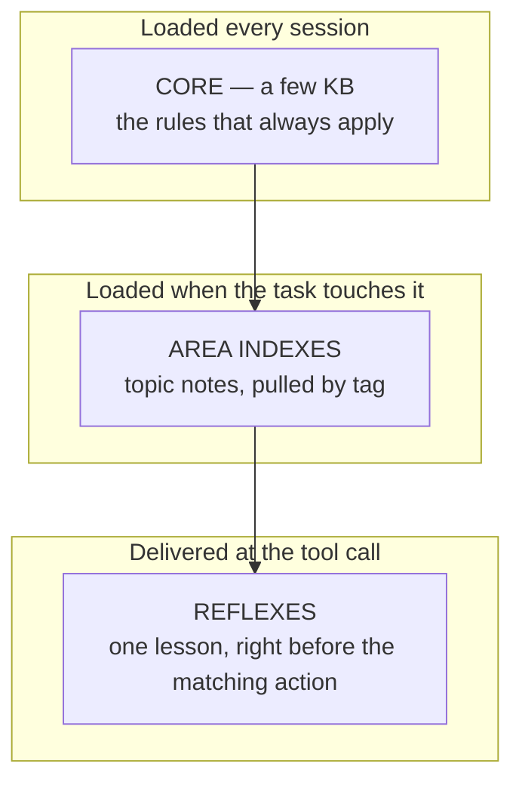

<p align="center">
  
</p>

<p align="center">
  
  
  
  <a href="LICENSE"></a>
  
  
</p>

# SMA — Shared Memory & Automation

**SMA is a local-first memory and accountability control plane for AI coding agents: it delivers the right project knowledge at the exact moment of action — and independently verifies the agent's claims. Layered memory that arrives on time, multi-terminal coordination without a server, and every "done" settled by a script, re-derived by a blind verifier, and blocked from shipping when it is false.**

[Русская версия → README.ru.md](README.ru.md)

> ### 🗺️ [Open the live system map →](https://sma-framework.github.io/sma/master-graph.html)
> Every subsystem of SMA on one interactive page — the fastest way to see how everything connects.

> ### 🧭 [Roadmap →](ROADMAP.md)
> Where SMA is and what comes next: **V5 orchestration (a 24/7 worker fleet) → V5.1 works-with-what-you-have + Memory Model 1.0 → V5.2 measured memory → V5.3 governance + hardened fleet.**

> **This is not a memory plugin.** It is a working discipline for shipping real code with an AI agent: memory that arrives at the exact moment it is needed, coordination that stops two terminals from overwriting each other, and a **trust spine** in which every "done" is settled by a script, re-derived by a blind verifier, and blocks the next release if it is false. It writes only to a few folders next to your code — **your source tree is never touched** — and everything it knows or enforces is a plain file you can read, diff, and revert.

---

## Install

One command, from the root of your own project (zero dependencies — the installer is Node built-ins only):

```bash
npx -y sma-framework@latest init
```

That is the whole install. It also embeds a short managed rules block into your project's CLAUDE.md so agents can find the memory corpus (your own content is never touched), and the off-ramp is symmetric: `/sma-deleteme` removes everything and PRESERVES `.claude/memory/`. The git-clone path, flags, and the full payload manifest are in [docs/INSTALL.md](docs/INSTALL.md).

## Quickstart

Open a Claude Code session in your project and run:

```
/sma-start
```

The onboarding conversation explains the system, seeds your starter memory corpus, and records your infrastructure profile so every later command speaks your stack. From that point on, each new session registers itself automatically and loads the memory core before doing anything else.

## Before SMA → After SMA

The whole point of SMA is the second column. Same agent, same model — a different discipline around it.

| | **Without SMA** | **With SMA** |
|---|---|---|
| **1 · A rule is dropped** | Your instructions say "every schema change needs a migration." Twenty edits later the agent adds a column and forgets. It ships; queries break on deploy. | The moment the agent touches the schema file, a reflex fires **into that tool call**: *"schema change → migration required (last time this broke prod)."* It cannot be skimmed past. |
| **2 · "Done" that isn't** | *"All tests pass, feature complete."* You pull, run them, three are red. The confident summary was the only evidence, and it was wrong. | The plan pre-registered a check. At close, a **script** re-runs it on a fresh clone and writes `hit` or `miss` to the ledger. "Done" is a re-runnable command, not a sentence — and a blind verifier re-derives it without ever reading the agent's report. |
| **3 · A lesson re-learned** | The same build flag bites you a third month running. Each fix lived only in one closed chat; nothing carried it forward. | The first burn was written as a note with a trigger. Every later session — and every teammate's clone — gets the warning **before** repeating it. One burn, permanent avoidance. |
| **4 · Two terminals collide** | Terminal B edits `src/api` while Terminal A is mid-refactor there. B's push silently reverts an hour of A's work; nobody notices until CI. | B registered a session and A had **claimed** `src/api`. When B goes to edit, it is warned *before* the keystroke — and both drew their migration numbers from one queue, so they never clash. |
| **5 · A false "done" ships** | The report said the feature works. It didn't; the regression reaches `main` and the next release carries it. | A class-A divergence **auto-blocks `sma ship`** until the founder records an explicit disposition. The ledger is append-only; the agent cannot forgive itself. |

> **Honest caveat.** On a single task, SMA costs more — the checks and the memory are not free. Its bet is **cost per correct result across many tasks**, not the cheapest single run.

<!-- sma:positioning:start -->

## How SMA compares

A model vendor cannot neutrally grade its own agent's homework. With Claude Outcomes that sentence needs sharpening, not retiring: the vendor now *can* verify, because separate-context grading shipped as a platform feature. What it cannot do is be **audited**. An outcomes grade is an opaque rubric verdict: no re-runnable receipt, no published track record, no consequence when it is wrong. SMA's lane is the audit layer any grader — theirs or ours — has to survive, and that lane is exactly why SMA outlives platform absorption.

So the comparison is deliberately honest, including where each analog is better than SMA:

| Tool | Reach | What it does better than SMA | What only SMA does |
|------|-------|------------------------------|--------------------|
| **Claude Outcomes** | platform | Managed sessions, a built-in outcome grader, zero setup | Deterministic re-runnable receipts, a judge-attributed calibrated hit rate, and a contradicted "satisfied" that blocks the release until a human rules |
| **claude-mem** | 86k★ | Category-leading memory mechanics, polished SQLite runtime | Scores whether the memory actually helped, and publishes the hit rate |
| **Aider** repo-map | 47k★ | Deterministic context graph with years of production proof | Carries a memory corpus and a learning loop on top of the graph |
| **Letta** / MemGPT | 24k★ | Rich memory-block architecture | No DB, no server, and the agent does not grade itself |
| **ccusage** | 16.5k★ | Excellent local spend observability | The spend signal drives enforcement, not just observation |
| **BMAD** | 50k★ | Rich orchestration templates | A verification layer, so a claim has to survive a script |

**What SMA deliberately does not do:** no daemon, no database, no embeddings, no cloud, no LLM in the hot path. Everything is files and git (see `pnpm sma explain substrate`). Correctness never depends on a model call.

**The grader itself is graded.** Every separate-context verdict — the blind verifier's, or an outcomes grader's if ever consumed — is recorded, scored against ground truth (a revert, a rework, red CI, a founder rejection), and a wrong "satisfied" cannot be audited away: it blocks the release until a human dispositions it. That is the audit an opaque grade cannot offer.

Economy is held to the same evidence bar. Lane budgets are derived from the project's *own* spend percentiles, never a vendor benchmark; any plan can publish a **footprint receipt** — git-diff arithmetic against a written claim, an overrun scored as a calibration miss; and the ship lanes gate a push on a full test-and-security run a quick lane can never weaken. Every saving is paired with a quality guard, and a number is published only once it has been scored (see `pnpm sma explain economy`).

Adoption is reported honestly, not asserted: the real hit rate and sample size live in the calibration badge and `PASSPORT.md`, rebuilt each release and reproducible on a fresh clone. The badge hides itself after a model change until enough new data exists, so it never quietly overstates.

Three trust-spine features (the git airbag, the spend ledger, and the pre-compaction capsule) are bridges the wider ecosystem may well absorb, and that is fine; they are not the headline, the accountability layer is. Two vendor-absorbable candidates stay explicit WATCH tripwires rather than headlines — a cross-session, on-by-default agent-teams primitive, and the advisor tool exposed inside sessions — each carrying a self-removal condition that retires our bridge the day the platform ships it.

<!-- sma:positioning:end -->

## What makes it different

- **Accountable, not just helpful.** Every claim SMA makes about itself is a pre-registered prediction settled by a script and re-derived by a blind verifier. Memory frameworks promise recall; SMA publishes its hit rate and lets a false "done" block its own release.
- **The layer a vendor cannot ship.** A model vendor cannot impartially grade its own agent's homework. SMA grades it from outside — deterministically, with no LLM in the hot path — which is exactly why it survives platform absorption.
- **Deterministic first.** Retrieval is tag- and trigger-driven, enforcement is plain scripts, and the whole learning-and-verification loop runs without a single LLM call in the hot path. Optional intelligence can sit on top; correctness never depends on it.
- **Git-native and reversible.** Notes, ledgers, journals, receipts — all files in your repo. Self-improvement arrives as diffs you review; anything the system learns can be reverted with `git revert`.
- **Fail-open by design.** A warning never blocks your work; a dead hook never wedges a session; every stream has a kill-switch. Hard blocking is reserved for security gates you configure yourself and for the consequences law you opt into.
- **Yours.** The corpus lives in your repository, travels with `git clone`, and is portable to other agents — it is knowledge you own, not a vendor cache.

## Memory, in three layers

Not one big instruction file — three tiers that keep the always-loaded budget tiny while nothing is ever forgotten.



Each note carries a `use-when` trigger — that single line is what lets SMA deliver it at exactly the right tool call instead of dumping the whole corpus into every prompt. Auto-trim never deletes — it *demotes* down the layers (in this repo's own dogfood, the always-loaded index went from 46 KB to 5 KB with full recall preserved). *The system never forgets — it only changes how loudly it remembers.*

## The pillars

- **Predictions** — every plan states, up front, what will measurably change and how to check it; a deterministic scorer compares promise to fact at plan close.
- **Receipts + blind verification** — every "done" carries a re-runnable check; a blind verifier re-derives it from the tree alone, refusing the agent's self-report as input.
- **Consequences** — a class-A miss does not just get logged, it *acts*: it blocks the next ship until a human dispositions it, from an append-only ledger the agent cannot edit.
- **Reflexes** — a scored miss becomes a permanent rule that fires *before* the next matching tool call. Touch boiling water once, never again.
- **Corpus health** — lint, contradiction detection, and consolidation keep the memory sharp at hundreds of notes instead of decaying into noise. Diagnostics are loud: a failing memory command prints what broke and why, and a corpus without its tag registry still builds a usable index instead of erroring.
- **Coordination** — session registry, file claims with pre-edit warnings, and shared counters for anything two terminals could race on.
- **Economy** — lane budgets derived from your own spend history, a self-cost meter, and quality guards on every savings number.

## It lives beside your code, never inside it

SMA never edits, moves, or reformats a single line of your application. It writes only to a handful of sibling folders — all plain text, all under version control, all yours.

```text
your-project/
├─ src/            ← YOUR CODE — SMA never writes here
├─ package.json    ← untouched
│
├─ .claude/
│  ├─ memory/      ← the memory corpus (markdown notes you can read & diff)
│  ├─ agents/      ← the /sma-* workflow agents
│  └─ settings.json← the hooks that wire SMA into your agent
├─ .sma/           ← coordination + accountability state
└─ .planning/      ← phase plans, predictions, receipts, calibration
```

Delete the folders and your project is exactly as it was.

## Commands

The `/sma-*` workflow family (run inside a Claude Code session):

| Command | What it does |
|---|---|
| `/sma-start` | First-run onboarding: explains the system, seeds the memory corpus and the infra profile |
| `/sma-discuss-phase` | Gather phase context through adaptive questioning before planning |
| `/sma-plan-phase` | Create a detailed phase plan with a verification loop |
| `/sma-grill` | Adversarially cross-examine every plan promise before the build |
| `/sma-execute-phase` | Execute all plans in a phase with wave-based parallelization |
| `/sma-verify-work` | Validate built features through conversational UAT |
| `/sma-quick` | A quick task with SMA guarantees (atomic commits, state tracking), skipping optional agents |
| `/sma-fast` | A trivial task inline — no subagents, no planning overhead |
| `/sma-debug` | Systematic debugging with persistent state across context resets |
| `/sma-progress` | Where things stand: progress, next step, freeform intent dispatch |
| `/sma-resume-work` | Resume from a previous session with full context restoration |
| `/sma-pause-work` | Create a context handoff when pausing mid-phase |
| `/sma-help` | Show available commands and the usage guide |
| `/sma-deleteme` | Remove SMA in one action; your memory corpus stays |

Underneath runs the coordination + accountability CLI (`pnpm sma`) — 83 verbs, each with an in-product explainer (`pnpm sma explain <verb>`). The full reference lives in [scripts/sma/README.md](scripts/sma/README.md).

---

## Going deeper

Everything above is the core. The detail lives one link away:

- **[docs/DETAILS.md](docs/DETAILS.md)** — the full engineering deep-dive: the four-setup side-by-side, the accountable loop diagrams, the complete CLI reference by version layer, the animated demo gallery, how the hooks integrate, and the whole version history V1 → V4 with the trust spine process by process.
- **[ROADMAP.md](ROADMAP.md)** — V5 orchestration and the memory-foundation program (V5.1 → V5.3).
- **[docs/INSTALL.md](docs/INSTALL.md)** — install flags, payload manifest, uninstall.
- **[scripts/sma/README.md](scripts/sma/README.md)** — every CLI subcommand, flag, hook event, and kill-switch.
- **[PASSPORT.md](PASSPORT.md)** — the calibration passport: the real hit rate and sample size, reproducible on a fresh clone.

## Star History

[](https://star-history.com/#sma-framework/sma&Date)

## License and attribution

**FSL-1.1-MIT** (Functional Source License) — see [LICENSE](LICENSE). In plain words: the source is open to read, install locally, modify, and use internally or for non-commercial education and research — free of charge. What it forbids is offering SMA (or a substantially similar product) as a competing commercial product or service. Each released version automatically becomes plain MIT two years after its release. Versions released before the license change (v4.0.2 and earlier, including the npm releases) remain MIT.

**Author: Matvey Maslov.** Questions, feedback, adoption stories: [matvey.maslov99@gmail.com](mailto:matvey.maslov99@gmail.com) — or open an [issue](https://github.com/sma-framework/sma/issues).
