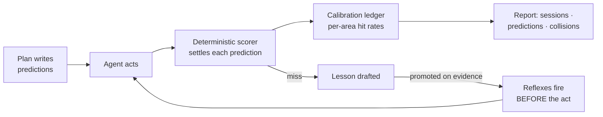
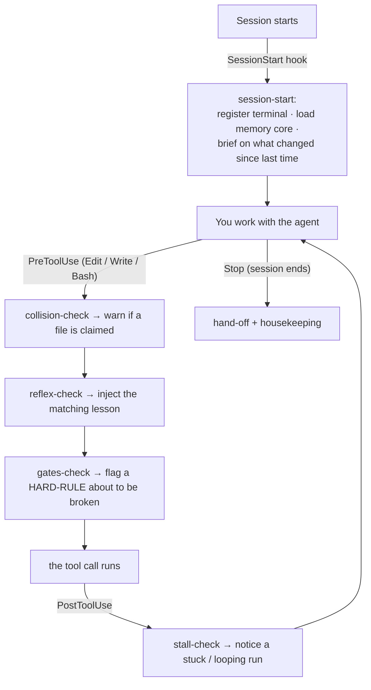
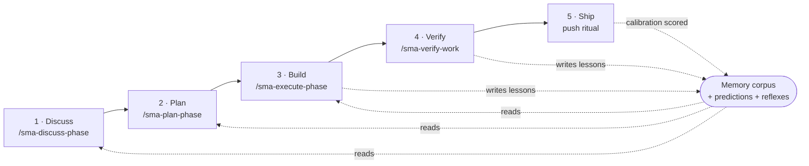
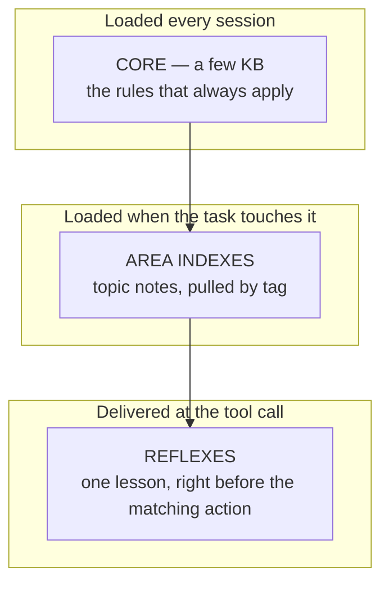
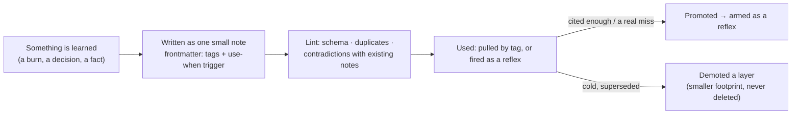
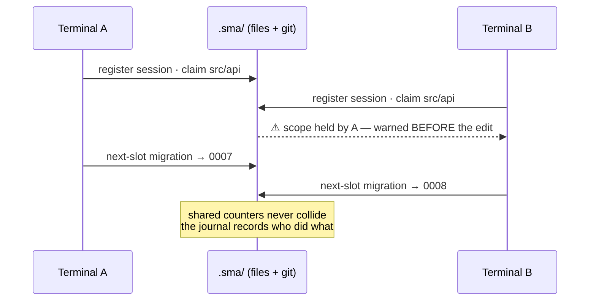
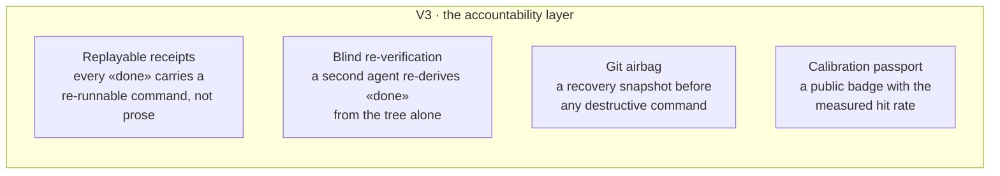

<p align="center">
  
</p>

<p align="center">
  <a href="LICENSE"></a>
  
  
  
  
</p>

# SMA — Shared Memory & Automation

**Layered memory + multi-terminal coordination for AI coding agents — with a learning loop that is measured, not hoped for.**

[Русская версия → README.ru.md](README.ru.md)

> **This is not a memory plugin.** It is a working discipline for shipping real code with an AI agent: memory that arrives at the exact moment it is needed, coordination that stops two terminals from overwriting each other, and a learning loop whose every claim is settled by a script instead of the model's own word. It writes only to a few folders next to your code — **your source tree is never touched** — and everything it knows or enforces is a plain file you can read, diff, and revert.

## Why SMA exists

If you run Claude Code (or any coding agent) on a real project every day, you already know these four failures:

1. **Rules get read, then dropped.** Your carefully written instructions file is acknowledged at session start and violated an hour later — the model's working attention is tiny, and a rule that isn't present *at the moment of the action* might as well not exist.
2. **"Done" that isn't.** The agent reports tests green and files written; the tree says otherwise. Confident prose is not evidence.
3. **Lessons get re-learned, expensively.** The same mistake — the same footgun in your build, the same API quirk — burns you again next month, because nothing turned the first burn into a permanent avoidance.
4. **Parallel sessions collide.** Two terminals on one checkout silently overwrite each other; session B "fixes" what session A finished an hour ago.

SMA is a layer on top of the agent that attacks all four with the same design bet: **small files in your git repo + deterministic scripts + the agent-harness hook system**. No daemon, no database, no embeddings, no cloud. Everything it knows is a markdown file you can read, diff, and revert; everything it enforces is a script you can run yourself.

> **A 700-line instructions file is not a process.** It is one big note the model skims once and forgets. SMA's bet is the opposite: keep the always-loaded rules tiny, and deliver each *specific* rule as a warning at the precise tool call it governs. Presence beats length. That is the difference between "I told the agent" and "the agent could not miss it."

## It lives beside your code, never inside it

SMA never edits, moves, or reformats a single line of your application. It writes only to a handful of sibling folders — its memory corpus, its coordination state, and its planning artifacts — all of them plain text, all of them under version control, all of them yours.

```text
your-project/
├─ src/            ← YOUR CODE — SMA never writes here
├─ package.json    ← untouched
├─ ...             ← untouched
│
├─ .claude/
│  ├─ memory/      ← the memory corpus (markdown notes you can read & diff)
│  ├─ agents/      ← the /sma-* workflow agents
│  └─ settings.json← the hooks that wire SMA into your agent
├─ .sma/           ← coordination state: sessions, claims, journal, reflexes
└─ .planning/      ← phase plans, predictions, and the calibration ledger
```

Because it is all files in git, adopting SMA is reversible in one commit, and everything it "learns" arrives as a diff you approve — not a black-box mutation of a cloud cache. Delete the folders and your project is exactly as it was.

## What SMA is

Three subsystems on one substrate:

- **Memory that arrives on time.** Project knowledge lives as small, tagged notes. The always-loaded core stays tiny (a few KB); topic notes load only when the task touches that topic; and *reflexes* deliver the exact relevant lesson right before the tool call that needs it — because a rule named at the moment of the act is worth ten rules buried in a big instructions file.
- **Coordination without a server.** Every open terminal registers itself, claims the files it is working on, and draws shared counters (migration numbers, release numbers) from one queue. Parallel sessions warn each other *before* the collision, and the journal records who did what.
- **A learning loop with a score.** Plans state up front what will measurably change and how to check it (`predictions`). A deterministic scorer — a script, not a judge model — settles each prediction against reality. Misses become lessons; repeated lessons become reflexes; the calibration ledger tracks, per area, how often promises match facts. SMA's memory does not claim to work — it has a measured hit rate.

## The story in 10 slides

<p align="center">
  
</p>

<details>
<summary><b>Open the full deck (10 slides)</b> — the problem, the root cause, the mechanism, the proof discipline</summary>

<br>

| | |
|:--:|:--:|
| <br>**The problem** — brilliant, and unaccountable | <br>**Root cause** — a model's working attention is tiny |
| <br>**The bet** — trust you can diff | <br>**The loop** — predict, act, score, learn |
| <br>**Memory that arrives on time** | <br>**Coordination without a server** |
| <br>**Measured, not promised** | <br>**Where this goes (V3)** |
| <br>**Own your agent's memory** | |

</details>

## Before SMA → After SMA

The whole point of SMA is the second column. Same agent, same model — a different discipline around it.

| | **Without SMA** | **With SMA** |
|---|---|---|
| **1 · A rule is dropped** | Your instructions say "every schema change needs a migration." Twenty edits later the agent adds a column and forgets. It ships; queries break on deploy. | The moment the agent touches the schema file, a reflex fires **into that tool call**: *"schema change → migration required (last time this broke prod)."* It cannot be skimmed past. |
| **2 · "Done" that isn't** | *"All tests pass, feature complete."* You pull, run them, three are red. The confident summary was the only evidence, and it was wrong. | The plan pre-registered a check (`pnpm vitest run …`). At close, a **script** runs it and writes `hit` or `miss` to the ledger. "Done" is a re-runnable command, not a sentence. |
| **3 · A lesson re-learned** | The same build flag bites you a third month running. Each fix lived only in one closed chat; nothing carried it forward. | The first burn was written as a note with a trigger. Every later session — and every teammate's clone — gets the warning **before** repeating it. One burn, permanent avoidance. |
| **4 · Two terminals collide** | Terminal B edits `src/api` while Terminal A is mid-refactor there. B's push silently reverts an hour of A's work; nobody notices until CI. | B registered a session and A had **claimed** `src/api`. When B goes to edit, it is warned *before* the keystroke — and both drew their migration numbers from one queue, so they never clash. |

## How the loop runs

<p align="center">
  
</p>



One burn, permanent avoidance — the model is a child who touches boiling water once. The miss is written down, the written lesson gets a trigger, and the trigger fires as a warning in front of the *next* matching action, in every terminal, forever. And because the scorer is a script, the loop cannot flatter itself.

## Watch it work — five real files

SMA is "just files," and that is the feature — you can point at every part of it. Here is the whole loop, in the artifacts it actually reads and writes.

**1 · A lesson, the first time something burns you** — `.claude/memory/bug_build_node20.md`

```markdown
---
description: Build emits an empty API chunk on Node 20 without --no-experimental
kind: bug-lesson
tags: [build, ci]
use-when: "editing vite.config or running the production build"
importance: 8
---
**Rule:** On Node 20 the API bundle needs `--no-experimental-*` or it silently
ships an empty chunk (exit code 0, broken deploy).

**Why:** Cost us a red prod on 2026-06-02 — the build "passed" and shipped nothing.

**How to apply:** keep the flag in `build:api`; if you touch the bundler config,
run `pnpm build:api` and confirm the chunk is non-empty before committing.
```

**2 · A prediction, written into the plan before any code** — `.planning/phases/12-.../12-01-PLAN.md`

```yaml
predictions:
  - id: PRED-01
    claim: "The rate limiter rejects the 101st request in a 60s window"
    metric: rejected_requests
    check_command: "pnpm vitest run test/rate-limit.test.ts"   # allowlisted prefixes only
    comparator: ">="
    threshold: 1
    horizon: plan-close
    domain: api
    confidence: 0.8    # recorded for calibration — NEVER gates the result
```

**3 · The scorer's verdict, settled by a script (zero LLM)** — appended to `.sma/journal/…`

```json
{"type":"prediction-verdict","id":"PRED-01","domain":"api",
 "result":"hit","observed":1,"comparator":">=","threshold":1,"ts":"2026-06-14T09:41:02Z"}
```

```text
# calibration ledger — per area, how often our promises matched facts
api        14/15  (93%)
migrations  6/6   (100%)
ui          9/12  (75%)   ← this area keeps over-promising; SMA escalates it
```

**4 · A reflex firing — the warning the agent sees *inside* the tool call** (before it edits `vite.config.ts`)

```text
⚠ SMA reflex [bug_build_node20]: On Node 20 the API bundle needs --no-experimental
  or it silently ships an empty chunk. Last time this red-shipped prod (2026-06-02).
  → run `pnpm build:api` and confirm the chunk is non-empty before you commit.
```

**5 · A collision + a shared counter — coordination, no server** (Terminal B, about to touch A's files)

```text
⚠ SMA: src/api/** is claimed by t-4821 (phase 12 exec) since 14:07.
  You are about to Edit src/api/routes.ts — coordinate first (`pnpm sma status`).

$ pnpm sma next-slot migration
0007          # yours. A parallel terminal asking now gets 0008 — they never collide.
```

Nothing here is a database row or an opaque embedding. It is five text files, and together they are the entire loop: burn → note → prediction → script-settled verdict → reflex that stops the next burn.

## How it hooks into your agent

SMA plugs into your agent through its harness's **hook points** — the moments the agent lets an outside script run. There is no wrapper around Claude and no fork of it; SMA simply registers small commands at four lifecycle events, and each is a one-line entry in `.claude/settings.json`. Every hook is **fail-open**: if it errors or times out, your work continues — a dead hook never wedges a session.



| Hook point | SMA command | What it does at that instant |
|---|---|---|
| **SessionStart** | `session-start` | Registers this terminal, loads the tiny memory core, and briefs the session on what other terminals changed since it last ran. |
| **PreToolUse** (Edit/Write/Bash) | `collision-check` | Is another live terminal holding this file? Warn **before** the edit, not after the overwrite. |
| **PreToolUse** (Edit/Write/Bash) | `reflex-check` | Does a promoted lesson match this path or command? Inject it as context so the rule is present *at the act*. |
| **PreToolUse** (Edit/Write/Bash) | `gates-check` | Is this action about to break a checkable HARD-RULE? Flag it (advisory first; blocking only for gates you opt into). |
| **PostToolUse** | `stall-check` | Did the run just loop or stall? Surface it so an executor death becomes a five-minute resume. |

That is the entire integration surface. The hooks call the same CLI you can run by hand (`pnpm sma …`), so nothing happens that you cannot reproduce and inspect yourself.

## The lifecycle: discuss → plan → build → verify → ship

SMA is not only memory — it is a full working rhythm for shipping real changes with an agent. Each stage is a `/sma-*` command, and every stage reads from and writes back to the same file-based memory, so nothing is re-explained twice.



- **1 · Discuss** — lock the gray-area decisions with a human *before* any code, through adaptive questioning. The context is captured as files, so the plan that follows is grounded, not guessed.
- **2 · Plan** — turn the decisions into an executable plan whose steps each carry a machine-checkable **prediction** (what will change, and the command that proves it). The plan is the contract.
- **3 · Build** — execute the plan in dependency-aware waves. Reflexes fire before risky actions; progress is journaled so an interrupted run resumes in minutes, not from scratch.
- **4 · Verify** — validate the built feature against its acceptance criteria in a conversational pass. Human sign-off gates stay human; the agent never self-certifies them.
- **5 · Ship** — the release ritual runs the full gate, and the predictions written back in step 2 are **scored** against what actually happened. Misses become the next lessons. The loop closes.

## Memory, in three layers

Not one big instruction file — three tiers that keep the always-loaded budget tiny while nothing is ever forgotten.



Auto-trim never deletes — it *demotes* down the layers, so the system gets lighter without ever losing a fact (in this repo's own dogfood, the always-loaded index went from 46 KB to 5 KB with full recall preserved, gated by a standing benchmark).

**How a memory actually gets saved** — a fact never enters by accident, and it never leaves by accident either:



Each note carries a `use-when` trigger — that single line is what lets SMA deliver it at exactly the right tool call instead of dumping the whole corpus into every prompt. Promotion is earned by evidence (a note that keeps mattering), never by a timer; demotion shrinks the hot budget without forgetting. *The system never forgets — it only changes how loudly it remembers.*

## Coordination without a server



## Install

The front door:

```bash
npx sma-framework init
```

The git-clone fallback (no registry access needed) — clone anywhere, then run
the installer **from your own project directory**:

```bash
git clone https://github.com/sma-framework/sma.git ../sma-clone
cd <your-project>
node ../sma-clone/bin/init.mjs --local
```

Both paths run the same zero-dependency installer. Flags (`--global`, `--with-gsd-aliases`, ...), the full payload manifest, and uninstall steps are in [docs/INSTALL.md](docs/INSTALL.md).

## Quickstart

Open a Claude Code session in your project and run:

```
/sma-start
```

The onboarding conversation explains the system, seeds your starter memory corpus and project scaffolding, and records your infrastructure profile (your deploy host, your release ritual) so every later command speaks your stack. From that point on, each new session registers itself automatically and loads the memory core before doing anything else.

## Commands

| Command | What it does |
|---|---|
| `/sma-start` | First-run onboarding: explains the system, seeds the memory corpus and the infra profile |
| `/sma-discuss-phase` | Gather phase context through adaptive questioning before planning |
| `/sma-plan-phase` | Create a detailed phase plan with a verification loop |
| `/sma-execute-phase` | Execute all plans in a phase with wave-based parallelization |
| `/sma-verify-work` | Validate built features through conversational UAT |
| `/sma-quick` | A quick task with SMA guarantees (atomic commits, state tracking), skipping optional agents |
| `/sma-fast` | A trivial task inline — no subagents, no planning overhead |
| `/sma-debug` | Systematic debugging with persistent state across context resets |
| `/sma-progress` | Where things stand: progress, next step, freeform intent dispatch |
| `/sma-resume-work` | Resume from a previous session with full context restoration |
| `/sma-pause-work` | Create a context handoff when pausing mid-phase |
| `/sma-help` | Show available commands and the usage guide |

The coordination CLI runs underneath (`node scripts/sma/cli.mjs` or `pnpm sma`): `status`, `claim`, `next-slot`, `load`, `lint`, and friends. Sessions and hooks call it for you; you can also call it directly.

### See each command in action

Every command is a terminal conversation. Expand any to watch what it does — each demo loops.

<details open>
<summary><b><code>/sma-start</code></b> — first-run onboarding: it explains the system, then configures it</summary>
<br>
</details>

<details>
<summary><b><code>/sma-discuss-phase</code></b> — lock the gray-area decisions with a human before any code</summary>
<br>
</details>

<details>
<summary><b><code>/sma-plan-phase</code></b> — research, plans, and a plan-check; every step carries a prediction</summary>
<br>
</details>

<details>
<summary><b><code>/sma-execute-phase</code></b> — build in dependency-aware waves; reflexes fire before the act</summary>
<br>
</details>

<details>
<summary><b><code>/sma-verify-work</code></b> — validate against acceptance criteria; a script re-runs each "done"</summary>
<br>
</details>

<details>
<summary><b><code>/sma-quick</code></b> — a small task with full guarantees (atomic commit, state tracked)</summary>
<br>
</details>

<details>
<summary><b><code>/sma-fast</code></b> — a trivial task, inline; no subagents, no planning</summary>
<br>
</details>

<details>
<summary><b><code>/sma-debug</code></b> — systematic debugging whose state survives a context reset</summary>
<br>
</details>

<details>
<summary><b><code>/sma-progress</code></b> — where things stand, and the next concrete step</summary>
<br>
</details>

<details>
<summary><b><code>/sma-resume-work</code></b> — restore full context from the flight recorder</summary>
<br>
</details>

<details>
<summary><b><code>/sma-pause-work</code></b> — write a handoff before you step away</summary>
<br>
</details>

<details>
<summary><b><code>/sma-help</code></b> — the whole <code>/sma-*</code> family at a glance</summary>
<br>
</details>

## The six pillars

- **Predictions** — every plan states, up front, what will measurably change and how to check it; a deterministic scorer compares promise to fact at plan close, and a calibration ledger tracks which areas keep being wrong.
- **Reflexes** — a scored miss becomes a permanent rule that fires *before* the next matching tool call, as a warning injected into the session. Touch boiling water once, never again.
- **Corpus health** — lint, contradiction detection, scheduled consolidation, and promotion counters keep the memory sharp at hundreds of notes instead of decaying into noise.
- **Coordination** — session registry, file claims with pre-edit warnings, shared counters for anything two terminals could race on, and a live "someone is pushing" signal.
- **Harness** — per-plan progress journals make an executor death a five-minute resume; stall detection and dependency-aware waves keep long runs honest and parallel.
- **Report** — a cockpit view of sessions, predictions, reflex firings, collisions, and corpus health, so the state of the system is visible, not assumed.

## What makes it different

- **Accountable, not just helpful.** Every claim SMA makes about itself is a pre-registered prediction settled by a script. Memory frameworks usually promise recall; SMA publishes its hit rate.
- **Deterministic first.** Retrieval is tag- and trigger-driven, enforcement is plain scripts, and the whole learning loop runs without a single LLM call in the hot path. Optional intelligence can sit on top; correctness never depends on it.
- **Git-native and reversible.** Notes, ledgers, journals — all files in your repo. Self-improvement arrives as diffs you review; anything the system learns can be reverted with `git revert`.
- **Fail-open by design.** A warning never blocks your work; a dead hook never wedges a session. Hard blocking is reserved for security gates you configure yourself.
- **Yours.** The corpus lives in your repository, travels with `git clone`, and is portable to other agents — it is knowledge you own, not a vendor cache.

## Roadmap — what's next (V3)

V1 gave agents memory. V2 gave them predictions, reflexes, and coordination. **V3 makes the agent stop trusting its own word** — the one thing a model vendor structurally cannot ship neutrally, because it cannot grade its own homework. Four load-bearing pieces, each a deterministic script on the substrate already here:



- **Replayable receipts** — every accomplishment claim carries a command and an expected result hash, re-runnable by anyone. Prose-only claims fail a lint. "Done" becomes evidence, not assertion.
- **Blind re-verification** — a separate agent re-derives each "done" purely from the code tree, without seeing the executor's report. Claimed-pass / reproduced-fail is the heaviest signal in the ledger.
- **Git airbag** — a deterministic recovery point written *before* any destructive command runs, so a bad `git reset --hard` or force-push becomes a one-command undo instead of lost work.
- **Calibration passport** — the per-area hit rate and recall score compile into a public README badge. The first honest trust metric for agentic work: memory that publishes its own accuracy.

Full design, scored and adversarially reviewed, lives with the project. This is the direction, not a promise of dates — it ships evidence-first, one falsifiable metric at a time.

## Star History

[](https://star-history.com/#sma-framework/sma&Date)

## License and attribution

MIT — see [LICENSE](LICENSE).

**Creator: Matvey Maslov.**

The workflow engine inside SMA is derived from [gsd-core](https://github.com/open-gsd/gsd-core) (MIT). The pristine upstream snapshot, the rename map, and third-party notices are tracked in [UPSTREAM.json](UPSTREAM.json), [rename-map.json](rename-map.json), and [THIRD-PARTY-LICENSES.md](THIRD-PARTY-LICENSES.md).
