<p align="center">
  
</p>

<p align="center">
  
  
  
  <a href="LICENSE"></a>
  
  
</p>

# SMA — Shared Memory & Automation

**The accountability layer for AI coding agents: layered memory that arrives on time, multi-terminal coordination without a server, and verified claims that *control* behavior. v4 — grade the grader: every separate-context verdict is recorded as a prediction and scored against what git actually did, on the thesis that a vendor can *verify* but cannot be *audited* — and per-lane economy meters that price every run against your own spend, each savings number paired with a quality guard.**

[Русская версия → README.ru.md](README.ru.md)

> ### 🗺️ [Open the live system map →](https://sma-framework.github.io/sma/master-graph.html)
> Every subsystem of SMA on one interactive page: six version layers, clickable node cards with commands, files, and honest numbers, verified benchmarks, and the registered 10× bets. The fastest way to see how everything connects.

> **This is not a memory plugin.** It is a working discipline for shipping real code with an AI agent: memory that arrives at the exact moment it is needed, coordination that stops two terminals from overwriting each other, and — since V3 — a **trust spine** in which every "done" is settled by a script, re-derived by a blind verifier, and blocks the next release if it is false. It writes only to a few folders next to your code — **your source tree is never touched** — and everything it knows or enforces is a plain file you can read, diff, and revert.

---

## Install

One command, from the root of your own project (zero dependencies — the installer is Node built-ins only and prints its version as it runs):

```bash
npx -y sma-framework@latest init
```

That is the whole install. It also embeds a short managed rules block into your project's CLAUDE.md so agents can find the memory corpus (your own content is never touched), and the off-ramp is symmetric: `/sma-deleteme` removes everything and PRESERVES `.claude/memory/`.

The git clone path remains for development and for machines without registry access:

```bash
git clone https://github.com/sma-framework/sma.git ../sma-clone
cd <your-project>
node ../sma-clone/bin/init.mjs --local
```

Flags (`--global`, `--with-gsd-aliases`, ...), the full payload manifest, and uninstall steps are in [docs/INSTALL.md](docs/INSTALL.md).

## Quickstart

Open a Claude Code session in your project and run:

```
/sma-start
```

The onboarding conversation explains the system, seeds your starter memory corpus and project scaffolding, and records your infrastructure profile (your deploy host, your release ritual) so every later command speaks your stack. From that point on, each new session registers itself automatically and loads the memory core before doing anything else.

## Before SMA → After SMA

The whole point of SMA is the second column. Same agent, same model — a different discipline around it.

| | **Without SMA** | **With SMA** |
|---|---|---|
| **1 · A rule is dropped** | Your instructions say "every schema change needs a migration." Twenty edits later the agent adds a column and forgets. It ships; queries break on deploy. | The moment the agent touches the schema file, a reflex fires **into that tool call**: *"schema change → migration required (last time this broke prod)."* It cannot be skimmed past. |
| **2 · "Done" that isn't** | *"All tests pass, feature complete."* You pull, run them, three are red. The confident summary was the only evidence, and it was wrong. | The plan pre-registered a check. At close, a **script** re-runs it on a fresh clone and writes `hit` or `miss` to the ledger. "Done" is a re-runnable command, not a sentence — and a blind verifier re-derives it without ever reading the agent's report. |
| **3 · A lesson re-learned** | The same build flag bites you a third month running. Each fix lived only in one closed chat; nothing carried it forward. | The first burn was written as a note with a trigger. Every later session — and every teammate's clone — gets the warning **before** repeating it. One burn, permanent avoidance. |
| **4 · Two terminals collide** | Terminal B edits `src/api` while Terminal A is mid-refactor there. B's push silently reverts an hour of A's work; nobody notices until CI. | B registered a session and A had **claimed** `src/api`. When B goes to edit, it is warned *before* the keystroke — and both drew their migration numbers from one queue, so they never clash. |
| **5 · A false "done" ships** | The report said the feature works. It didn't; the regression reaches `main` and the next release carries it. | A class-A divergence **auto-blocks `sma ship`** until the founder records an explicit disposition. The ledger is append-only; the agent cannot forgive itself. |


## Side by side — one task, four setups

The same model does the coding in bare Claude Code, in Superpowers, in GSD, and in SMA. What changes is the process around it — and, at the finish line, **whose word you take for "done."** Here is one ~30-minute task followed through its phases:

| Phase | Bare Claude Code | Superpowers | GSD | **SMA** |
|---|---|---|---|---|
| **Plan** | In its head, ad-hoc | Brainstorm → plan skill | Written `PLAN.md`, checked by an agent | Plan, then **grilled** — every promise cross-examined before a line is written |
| **Research** | From what it already knows | Research skill | Research subagents → `RESEARCH.md` | Reads its **own memory + receipts** first; catalog before grep |
| **Execute** | Writes the code | Test-first skills | Executor subagents, atomic commits | Executes — the relevant rule **fires at the exact tool call**, not in a file skimmed once |
| **Verify** | "Looks done" — its own word | Runs the tests | A verifier *agent* checks the goal | **Re-derives "done" from the code alone**, refuses the self-report; a false "done" blocks the release |
| **Remember** | Nothing — next session starts blank | Nothing carries across sessions | Learnings saved to `.planning` (this project) | Lessons + calibration + coordination **persist and fire next time** — across sessions and terminals |

Every column but one ends on *the agent's own word* for "done." SMA is the layer that checks the homework the model cannot grade itself — and remembers, so you don't pay for the same mistake twice.

> **Honest caveat.** On a single task, SMA costs more — the checks and the memory are not free. Its bet is **cost per correct result across many tasks**, not the cheapest single run.

<!-- sma:positioning:start -->

## How SMA compares

A model vendor cannot neutrally grade its own agent's homework. With Claude Outcomes that sentence needs sharpening, not retiring: the vendor now *can* verify, because separate-context grading shipped as a platform feature. What it cannot do is be **audited**. An outcomes grade is an opaque rubric verdict: no re-runnable receipt, no published track record, no consequence when it is wrong. SMA's lane is the audit layer any grader — theirs or ours — has to survive, and that lane is exactly why SMA outlives platform absorption.

So the comparison is deliberately honest, including where each analog is better than SMA:

| Tool | Reach | What it does better than SMA | What only SMA does |
|------|-------|------------------------------|--------------------|
| **Claude Outcomes** | platform | Managed sessions, a built-in outcome grader, zero setup | Deterministic re-runnable receipts, a judge-attributed calibrated hit rate, and a contradicted "satisfied" that blocks the release until a human rules |
| **claude-mem** | 86k★ | Category-leading memory mechanics, polished SQLite runtime | Scores whether the memory actually helped, and publishes the hit rate |
| **Aider** repo-map | 47k★ | Deterministic context graph with years of production proof | Carries a memory corpus and a learning loop on top of the graph |
| **Letta** / MemGPT | 24k★ | Rich memory-block architecture | No DB, no server, and the agent does not grade itself |
| **ccusage** | 16.5k★ | Excellent local spend observability | The spend signal drives enforcement, not just observation |
| **BMAD** | 50k★ | Rich orchestration templates | A verification layer, so a claim has to survive a script |

**What SMA deliberately does not do:** no daemon, no database, no embeddings, no cloud, no LLM in the hot path. Everything is files and git (see `pnpm sma explain substrate`). Correctness never depends on a model call.

**The grader itself is graded.** Every separate-context verdict — the blind verifier's, or an outcomes grader's if ever consumed — is recorded, scored against ground truth (a revert, a rework, red CI, a founder rejection), and a wrong "satisfied" cannot be audited away: it blocks the release until a human dispositions it. That is the audit an opaque grade cannot offer.

Economy is held to the same evidence bar. Lane budgets are derived from the project's *own* spend percentiles, never a vendor benchmark; any plan can publish a **footprint receipt** — git-diff arithmetic against a written claim, an overrun scored as a calibration miss; and the ship lanes gate a push on a full test-and-security run a quick lane can never weaken. Every saving is paired with a quality guard, and a number is published only once it has been scored (see `pnpm sma explain economy`).

Adoption is reported honestly, not asserted: the real hit rate and sample size live in the calibration badge and `PASSPORT.md`, rebuilt each release and reproducible on a fresh clone. The badge hides itself after a model change until enough new data exists, so it never quietly overstates.

Three trust-spine features (the git airbag, the spend ledger, and the pre-compaction capsule) are bridges the wider ecosystem may well absorb, and that is fine; they are not the headline, the accountability layer is. Two vendor-absorbable candidates stay explicit WATCH tripwires rather than headlines — a cross-session, on-by-default agent-teams primitive, and the advisor tool exposed inside sessions — each carrying a self-removal condition that retires our bridge the day the platform ships it.

<!-- sma:positioning:end -->

## What makes it different

- **Accountable, not just helpful.** Every claim SMA makes about itself is a pre-registered prediction settled by a script and re-derived by a blind verifier. Memory frameworks promise recall; SMA publishes its hit rate and lets a false "done" block its own release.
- **The layer a vendor cannot ship.** A model vendor cannot impartially grade its own agent's homework. SMA grades it from outside — deterministically, with no LLM in the hot path — which is exactly why it survives platform absorption.
- **Deterministic first.** Retrieval is tag- and trigger-driven, enforcement is plain scripts, and the whole learning-and-verification loop runs without a single LLM call in the hot path. Optional intelligence can sit on top; correctness never depends on it.
- **Git-native and reversible.** Notes, ledgers, journals, receipts — all files in your repo. Self-improvement arrives as diffs you review; anything the system learns can be reverted with `git revert`.
- **Fail-open by design.** A warning never blocks your work; a dead hook never wedges a session; every stream has a kill-switch. Hard blocking is reserved for security gates you configure yourself and for the consequences law you opt into.
- **Yours.** The corpus lives in your repository, travels with `git clone`, and is portable to other agents — it is knowledge you own, not a vendor cache.

## How the loop runs

<p align="center">
  
</p>

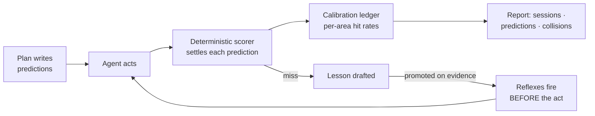
```mermaid
flowchart LR
    A["Plan writes<br>predictions"] --> B["Agent acts"]
    R["Reflexes fire<br>BEFORE the act"] --> B
    B --> C["Deterministic scorer<br>settles each prediction"]
    C --> D["Calibration ledger<br>per-area hit rates"]
    C -->|miss| E["Lesson drafted"]
    E -->|promoted on evidence| R
    D --> F["Report: sessions ·<br>predictions · collisions"]
```

One burn, permanent avoidance — the model is a child who touches boiling water once. The miss is written down, the written lesson gets a trigger, and the trigger fires as a warning in front of the *next* matching action, in every terminal, forever. And because the scorer is a script, the loop cannot flatter itself.


## Memory, in three layers

Not one big instruction file — three tiers that keep the always-loaded budget tiny while nothing is ever forgotten.

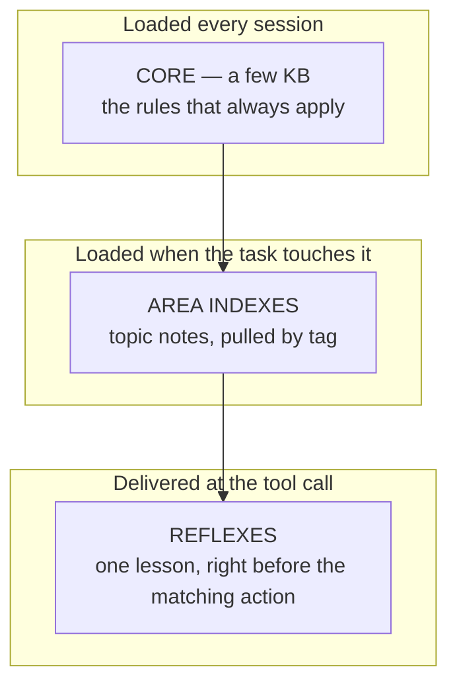
```mermaid
flowchart TD
    subgraph Always["Loaded every session"]
        C["CORE — a few KB<br>the rules that always apply"]
    end
    subgraph OnDemand["Loaded when the task touches it"]
        I["AREA INDEXES<br>topic notes, pulled by tag"]
    end
    subgraph AtTheAct["Delivered at the tool call"]
        X["REFLEXES<br>one lesson, right before the matching action"]
    end
    C --> I --> X
```

Auto-trim never deletes — it *demotes* down the layers, so the system gets lighter without ever losing a fact (in this repo's own dogfood, the always-loaded index went from 46 KB to 5 KB with full recall preserved, gated by a standing benchmark).

**How a memory actually gets saved** — a fact never enters by accident, and it never leaves by accident either:

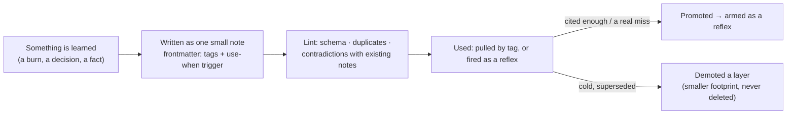
```mermaid
flowchart LR
    T["Something is learned<br>(a burn, a decision, a fact)"] --> N["Written as one small note<br>frontmatter: tags + use-when trigger"]
    N --> L["Lint: schema · duplicates ·<br>contradictions with existing notes"]
    L --> U["Used: pulled by tag, or fired as a reflex"]
    U -->|cited enough / a real miss| PR["Promoted → armed as a reflex"]
    U -->|cold, superseded| DM["Demoted a layer<br>(smaller footprint, never deleted)"]
```

Each note carries a `use-when` trigger — that single line is what lets SMA deliver it at exactly the right tool call instead of dumping the whole corpus into every prompt. Promotion is earned by evidence, never by a timer; demotion shrinks the hot budget without forgetting. *The system never forgets — it only changes how loudly it remembers.*


## The pillars

- **Predictions** — every plan states, up front, what will measurably change and how to check it; a deterministic scorer compares promise to fact at plan close, and a calibration ledger tracks which areas keep being wrong.
- **Receipts + blind verification (V3)** — every "done" carries a re-runnable check with an expected hash; a blind verifier re-derives it from the tree alone, and a divergence is the heaviest event the system knows.
- **Consequences (V3)** — a class-A miss does not just get logged, it *acts*: it blocks the next ship until a human dispositions it, from an append-only ledger the agent cannot edit.
- **Reflexes** — a scored miss becomes a permanent rule that fires *before* the next matching tool call. Touch boiling water once, never again.
- **Corpus health** — lint, contradiction detection, scheduled consolidation, and promotion counters keep the memory sharp at hundreds of notes instead of decaying into noise.
- **Coordination** — session registry, file claims with pre-edit warnings, shared counters for anything two terminals could race on, and a live "someone is pushing" signal.
- **Harness** — per-plan progress journals make an executor death a five-minute resume; stall detection, dependency-aware waves, and the one-spawn `pre` multiplexer keep long runs honest, parallel, and cheap.

## Commands

The `/sma-*` workflow family (run inside a Claude Code session):

| Command | What it does |
|---|---|
| `/sma-start` | First-run onboarding: explains the system, seeds the memory corpus and the infra profile |
| `/sma-discuss-phase` | Gather phase context through adaptive questioning before planning |
| `/sma-plan-phase` | Create a detailed phase plan with a verification loop |
| `/sma-grill` | Adversarially cross-examine every plan promise before the build |
| `/sma-execute-phase` | Execute all plans in a phase with wave-based parallelization |
| `/sma-verify-work` | Validate built features through conversational UAT |
| `/sma-quick` | A quick task with SMA guarantees (atomic commits, state tracking), skipping optional agents |
| `/sma-fast` | A trivial task inline — no subagents, no planning overhead |
| `/sma-debug` | Systematic debugging with persistent state across context resets |
| `/sma-progress` | Where things stand: progress, next step, freeform intent dispatch |
| `/sma-resume-work` | Resume from a previous session with full context restoration |
| `/sma-pause-work` | Create a context handoff when pausing mid-phase |
| `/sma-help` | Show available commands and the usage guide |
| `/sma-deleteme` | Remove SMA in one action — skills, engine, hooks, statusline, managed blocks; your memory corpus stays *(v3.6)* |

The coordination + accountability CLI runs underneath (`node scripts/sma/cli.mjs` or `pnpm sma`) — 83 verbs, grouped here by the version layer that introduced them. Sessions and hooks call it for you; you can also call any verb directly, and every one has an in-product explainer (`pnpm sma explain <verb>`).

### Core (V1–V2): memory, coordination, slots

| CLI verbs | What they do |
|---|---|
| `status` · `heartbeat` · `session-start` | Register/renew this terminal's session; the live who-is-doing-what picture (`status` now also reports fingerprint-backed liveness for each claim holder) |
| `claim` · `release` · `force-clear` | Declare "I am taking these files"; warnings fire for other terminals before they edit; force-clear carries provenance |
| `next-slot` · `consume` · `tia` | Race-free shared counters (migrations, releases) and regex test-impact analysis |
| `pre` · `pre-bench` | The one-spawn PreToolUse multiplexer (collision → reflex → gates → airbag → spend) and its SLO instrument; `collision-check` / `reflex-check` / `gates-check` remain as deprecated single-stream aliases |
| `stall-check` | PostToolUse stall/loop detector; drops a flight mark |
| `gates` · `gates-report` · `gates-ack` | Checkable project rules: advisory warns, evidence-gated soft-deny, acknowledgements |
| `lint` · `build-index` · `load` · `snapshot` · `usage` · `consolidate` · `trim` | The memory corpus toolchain: quality lint, machine-built index, tag-scoped loading, usage citations, scheduled consolidation, layer-aware trim |
| `predict-score` · `calibration` | Settle registered predictions with a script; read the per-domain hit-rate ledger |
| `state` · `exec-journal` · `metrics` · `report` | Where a plan stands, the per-plan progress journal, and the whole-system report |
| `upstream-check` | Watch the derived engine's upstream for updates (read-only, never auto-pulls) |

### V3 — the trust spine

| CLI verbs | What they do |
|---|---|
| `reverify` · `receipt-hash` | Re-run every structural receipt; `--fresh-clone` counts only committed evidence |
| `chain-tip` · `chain-verify` | The tamper-evident journal chain: emit the tip (pinned into release tags), detect any edit |
| `blind-verify` | Re-derive every "done" from the code tree alone; refuses executor self-reports (`BLIND_FORBIDDEN`) |
| `preship` · `disposition` | An open class-A event blocks the ship; only a founder disposition (append-only) clears it |
| `grill` | Register/resolve adversarial challenges; `--gate` blocks an ungrilled build; `--pre-push` grills `origin..main` |
| `evidence` | Burden-of-proof records required before risky ops (force-push, allowlist edits, foreign claim clears) |
| `pretask-pack` · `subagent-verify` · `subagent-receipts` | Context inheritance for subagents by construction; every claimed write verified against the real tree |
| `bench` | The 8-metric scorecard harness (baseline frozen before the spine was built) |
| `integrity` · `skeptic` · `canary` · `nearmiss` | The Goodhart/STPA guards that keep the published numbers honest |
| `airbag` · `airbag-check` · `undo` | Bridge (opt-in): millisecond git snapshots before destructive ops; one-action restore |
| `precompact-capsule` · `resume` · `handoff` · `flight` | Bridge (opt-in): the pre-compaction flight capsule and continuation/handoff briefs |
| `spend` · `spend-check` · `breaker` | Bridge (opt-in): the deterministic spend ledger, budget reflexes, and the runaway-rule loop-breaker |

### NEW in V3.5 — adoption & trust telemetry

| CLI verbs | What they do |
|---|---|
| `profile` | The deterministic onboarding profile surface: schema, lint, coverage, recap re-render check |
| `passport` · `model` | Build/verify the calibration passport + README badge; the model-version guard that hides stale priors until n≥20 |
| `excavate` | Mine a stranger's git history read-only; print CATCHES lines — which reflex would have fired before which push |
| `emit` | Compile the corpus into `CLAUDE.md` / `AGENTS.md` / `.cursorrules` / `GEMINI.md` managed blocks (byte-identical re-emits) |
| `catalog` · `context` | The fragment catalog (one deterministic card per file) and the budgeted, byte-deterministic context compiler |
| `ladder` · `tune` · `curriculum` | The self-tuning enforcement ladder: tier table, evidence-gated promote/demote proposals, the weekly miss-curriculum |
| `statusline` · `pulse` | The native statusline segment (composes with a pre-existing user statusline) and the working/waiting attention pulse |
| `manifest` | The PR evidence passport: predictions, receipts, and verdicts for a commit range, as JSON/Markdown |
| `preflight` | The already-built gate: check a plan's claims against the real tree before any executor spawns |
| `arena` | The comparative benchmark arena scorer + static graphs page (raw data and negative results published) |
| `batch` | The `/sma-batch` middle lane: risk filter, grill-lite, mandatory receipts |
| `worktree` · `merge` | Per-terminal worktree isolation, and the serialized local-only merge gate (push stays founder-ordered via `/sma-ship`) |
| `session-end` | SessionEnd hook: release this terminal's own claims so stale leases never haunt teammates |
| `ask` | *(experimental stub)* — the fingerprint demand surface (`--unmet-count`); the full feature matures in a later release |
| `explain` · `doc-audit` | 18 plain-language explainer topics with a command-coverage tripwire; the deterministic docs honesty audit |

### NEW in V3.6 — the one-command door

| CLI verbs | What they do |
|---|---|
| `deleteme` | The off-ramp: reverse every installer artifact (dry-run by default) and PRESERVE `.claude/memory/**` — leaving is as cheap as arriving |
| `memory-preview` | The onboarding preview: an ASCII graph of how SMA will lay out YOUR repo's memory (areas from `git ls-files`, reflex candidates from `excavate`) — read-only, zero network, deterministic |

The full CLI reference — every subcommand, flag, hook event, and kill-switch — lives in [scripts/sma/README.md](scripts/sma/README.md).

### See each command in action

Every command is a terminal conversation. Expand any to watch what it does — each demo loops.

<details open>
<summary><b><code>/sma-start</code></b> — first-run onboarding: it explains the system, then configures it</summary>
<br>
</details>

<details>
<summary><b><code>/sma-discuss-phase</code></b> — lock the gray-area decisions with a human before any code</summary>
<br>
</details>

<details>
<summary><b><code>/sma-plan-phase</code></b> — research, plans, and a plan-check; every step carries a prediction</summary>
<br>
</details>

<details>
<summary><b><code>/sma-execute-phase</code></b> — build in dependency-aware waves; reflexes fire before the act</summary>
<br>
</details>

<details>
<summary><b><code>/sma-verify-work</code></b> — validate against acceptance criteria; a script re-runs each "done"</summary>
<br>
</details>

<details>
<summary><b><code>/sma-quick</code></b> — a small task with full guarantees (atomic commit, state tracked)</summary>
<br>
</details>

<details>
<summary><b><code>/sma-fast</code></b> — a trivial task, inline; no subagents, no planning</summary>
<br>
</details>

<details>
<summary><b><code>/sma-debug</code></b> — systematic debugging whose state survives a context reset</summary>
<br>
</details>

<details>
<summary><b><code>/sma-progress</code></b> — where things stand, and the next concrete step</summary>
<br>
</details>

<details>
<summary><b><code>/sma-resume-work</code></b> — restore full context from the flight recorder</summary>
<br>
</details>

<details>
<summary><b><code>/sma-pause-work</code></b> — write a handoff before you step away</summary>
<br>
</details>

<details>
<summary><b><code>/sma-help</code></b> — the whole <code>/sma-*</code> family at a glance</summary>
<br>
</details>

#### V3 — the trust spine in action

<details open>
<summary><b><code>sma reverify</code></b> — re-run every "done" on a fresh clone; prose-only "done" fails lint</summary>
<br>
</details>

<details>
<summary><b><code>sma blind-verify</code></b> — re-derive "done" from the tree alone; refuse the executor's report</summary>
<br>
</details>

<details>
<summary><b><code>sma preship</code></b> / <code>disposition</code> — a class-A miss blocks the ship until the founder unblocks it</summary>
<br>
</details>

<details>
<summary><b><code>sma grill</code></b> — a challenge becomes a registered prediction, or the build does not start</summary>
<br>
</details>

<details>
<summary><b><code>sma pre-bench</code></b> — one spawn per tool call: 1268.6 ms → p95 152–157 ms</summary>
<br>
</details>

<details>
<summary><b><code>sma undo</code></b> — the git airbag: one action back to safety <sub>(bridge · opt-in)</sub></summary>
<br>
</details>

<details>
<summary><b><code>sma resume</code></b> — rebuild the brief from the flight recorder after a compaction <sub>(bridge · opt-in)</sub></summary>
<br>
</details>

<details>
<summary><b><code>sma spend</code></b> — the deterministic spend ledger + budget reflexes <sub>(bridge · opt-in)</sub></summary>
<br>
</details>

## How it hooks into your agent

SMA plugs into your agent through its harness's **hook points** — the moments the agent lets an outside script run. There is no wrapper around Claude and no fork of it; SMA registers small commands at a few lifecycle events, each a one-line entry in `.claude/settings.json`. Every hook is **fail-open**: if it errors or times out, your work continues — a dead hook never wedges a session.

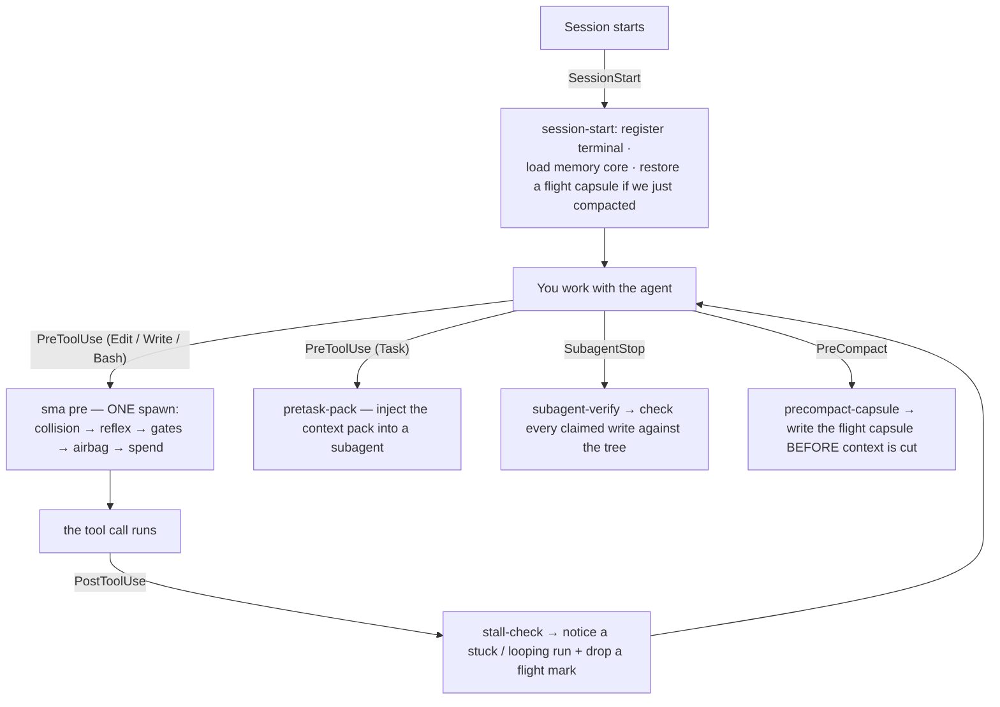
```mermaid
flowchart TD
    S["Session starts"] -->|SessionStart| S1["session-start: register terminal ·<br>load memory core · restore a flight capsule if we just compacted"]
    S1 --> W["You work with the agent"]
    W -->|"PreToolUse (Edit / Write / Bash)"| P1["sma pre — ONE spawn:<br>collision → reflex → gates → airbag → spend"]
    P1 --> ACT["the tool call runs"]
    W -->|"PreToolUse (Task)"| PT["pretask-pack — inject the context pack into a subagent"]
    ACT -->|PostToolUse| PO["stall-check → notice a stuck / looping run + drop a flight mark"]
    W -->|SubagentStop| SV["subagent-verify → check every claimed write against the tree"]
    W -->|PreCompact| PC["precompact-capsule → write the flight capsule BEFORE context is cut"]
    PO --> W
```

| Hook point | SMA command | What it does at that instant |
|---|---|---|
| **SessionStart** | `session-start` | Registers this terminal, loads the tiny memory core, briefs on what other terminals changed — and, if the session just auto-compacted, re-injects the flight capsule as the first context. |
| **PreToolUse** (Edit/Write/Bash) | `pre` | **One spawn** runs the ordered stream pipeline — collision → reflex → gates → airbag → spend — replacing V2's 3–4 spawns. |
| **PreToolUse** (Task) | `pretask-pack` | Injects the assembled context pack into a subagent — inheritance by construction. |
| **PostToolUse** | `stall-check` | Notices a stuck/looping run so an executor death becomes a five-minute resume; also appends one flight mark. |
| **SubagentStop** | `subagent-verify` | Verifies every claimed file write against the real tree; phantom writes are flagged. |
| **PreCompact** | `precompact-capsule` | Deterministically writes the flight capsule *before* compaction deletes the working state. |

That is the entire integration surface. The hooks call the same CLI you can run by hand (`pnpm sma …`), so nothing happens that you cannot reproduce and inspect yourself. The canonical PreToolUse wiring is now a **single** `pre` entry; the old per-stream commands remain as deprecated aliases for back-compat.

## What's new in V4 — grade the grader

V3 built the trust spine: every "done" is settled by a script and re-derived by a blind verifier. **V4 turns that skepticism on the verifier itself.** The bet is one line: a model vendor can *verify* — it cannot be *audited*. An opaque vendor grader (Anthropic's Outcomes, a managed judge) can say pass or fail, but you cannot open it, replay it, or hold last week's verdict against this week's model. SMA grades its graders in the open. Eight surfaces, the same discipline as always: deterministic scripts on files + git, no LLM in the hot path.

### Grade the grader — every verdict is a scored prediction

Each separate-context LLM verdict is recorded as a prediction (`--grader-record`) and scored against deterministic ground truth — a revert, a rework, a red CI run, a founder rejection. The judge model id is stamped on every record, so calibration slices by *who* judged (`hitRateByJudge`): a model change never lets stale accuracy headline a new judge. A verdict of 'satisfied' that ground truth later contradicts is a **class-A ship blocker** until the founder records a disposition — the grader does not get to be wrong quietly.

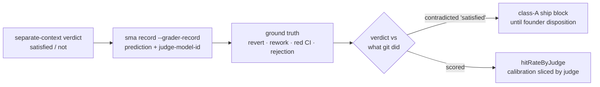
```mermaid
flowchart LR
    V["separate-context verdict<br>satisfied / not"] --> R["sma record --grader-record<br>prediction + judge-model-id"]
    R --> GT["ground truth<br>revert · rework · red CI · rejection"]
    GT --> S{"verdict vs<br>what git did"}
    S -->|"contradicted 'satisfied'"| BLK["class-A ship block<br>until founder disposition"]
    S -->|"scored"| HR["hitRateByJudge<br>calibration sliced by judge"]
```

### The economy meters — every run priced against your own spend, guarded on quality

Per-lane USD and minute budgets are derived from *your* project's own spend-ledger percentiles — not a vendor default — for the fix / quick / batch / build lanes; an overrun is scored as a calibration miss and drafts a lesson. `sma memory stats` reports the deterministic, versioned token cost of the corpus; `sma spend self-cost` makes SMA measure its own injection overhead. Every savings number is paired with a quality guard, so cheaper can never quietly mean worse.

### The rest of V4

| Surface | What it does |
|---|---|
| **Standing vendor triage** (`sma vendor`) | An append-only `VENDOR-LEDGER.md` (14 rows seeded, negative verdicts included) triages every upstream vendor capability as CORE or BRIDGE; `lint`/`count` verbs and a product release gate refuse to ship on an untriaged row. The vendor is watched in the open, not chased. |
| **Footprint ladder** (`reverify --footprint`) | A plan declares its footprint up front in frontmatter (files, new files, ~LOC, new deps); the grill asks «which ladder rung?»; a receipt checks the claim against `git diff --numstat` actuals — an overrun is a flagged calibration row. Ideology absorbed from two MIT sources (credited in THIRD-PARTY-LICENSES.md); their LLM judge was rejected and rebuilt as a deterministic receipt. |
| **Quick-ship lane** (`/sma-quick-ship`) | A deterministic entry precondition — origin delta ≤ 5 commits, no migrations, no foreign push-claim — or it REFUSES back into the full ritual. The gate is identical, never weaker; the lane only buys a small reviewed delta a deterministic conventional-commit changelog, plus pending-run orphan visibility. |
| **Phantom-instrument precision** (`--stat phantomsAsserted`) | S4 receipt forensics: dedupe, basename cross-match kill, a negation stoplist, and an honest unknown-key error path. Nine forensic rows are frozen as permanent regression fixtures. |
| **Quick profile update** (`sma profile --quick`) | An existing install no longer re-interviews from scratch: `--quick` plans an interview over unset fields only, with `--selftest` and `--profile`; `sma-start` routes existing installs there. |
| **Positioning, re-anchored** | The README positioning region (EN + RU) is rebuilt around the Outcomes row, the audit-gap thesis, and the economy pillar; 'Outcomes' joins the doc-audit ANALOGS honesty guard, and falsified claims were dropped. |

## What's new in V3.6 — the one-command door, both ways

V3.5 made the trust spine legible from the outside. **V3.6 removes the last friction at the door — in BOTH directions — and shows a newcomer their own project before they adopt anything.** Four surfaces, the same bet as always: deterministic scripts on files + git, no LLM in the hot path.

### One-command install: `npx -y sma-framework@latest init`

The package is on the public npm registry. One command from your project root installs the engine, the runtime, the `/sma-*` skills and the hooks — Node built-ins only, zero dependencies. The version in the banner, the git tag, `package.json` and `capability.json` are ONE value, enforced by the deterministic `package-check` gate (`--count` prints 0 on a publishable tree; it runs as `prepublishOnly`, so a stale or private tarball cannot ship).

### The installer embeds the rules block into CLAUDE.md

Most projects never wire `.claude/memory/` into the agent's context — the corpus SMA builds was invisible to the very agent it exists for. `init` now splices a short managed **rules block** (where the memory lives, how to load it, how to coordinate, how to leave) into your project's CLAUDE.md under the same splice law as `sma emit`: your bytes are never touched, re-runs are no-ops, torn markers are refused. Its anchor family is separate (`SMA:RULES`), so the corpus block and the rules block never fight over one span.

### The off-ramp: `sma deleteme` / `/sma-deleteme`

One command reverses everything the installer wrote — skills, engine, runtime, agents, hooks, the statusline segment (your original statusline is restored verbatim), both managed blocks, the `.sma/` state — and **preserves `.claude/memory/`**. Dry-run by default; never-clobber settings surgery (only SMA hook entries and the `statusLine` key are edited; every other key survives byte-identical). The trust argument is symmetry: an adopter who can see the exit will walk through the entrance.

### Your memory, previewed: `sma memory-preview`

During `/sma-start` TEACH, the preview draws — right in the terminal — how SMA would lay out the memory of YOUR repository: the always-loaded CORE, the periphery areas folded from your real file tree, and the reflex candidates `excavate` mines from your own git history (the reverts and fix-forward chains your team already paid for). Read-only, zero network, byte-identical at one HEAD; `--project <path>` previews any other repo, `--lang ru` renders in Russian.

## What's new in V3.5 — Adoption & Trust Telemetry

V3 built the trust spine. **V3.5 gets that spine into a stranger's repo on day one, and makes its honesty legible from the outside.** Fifteen surfaces, all the same bet — deterministic scripts on files + git, no LLM in the hot path.

### Deep `/sma-start` onboarding

The first run is a staged conversation that alternates teaching and asking — you learn how the accountable loop works *while* SMA records the profile every later command reads (your deploy host, your release ritual, your risk tolerance). Nothing is re-explained twice.

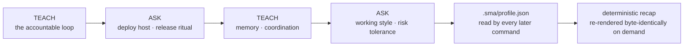
```mermaid
flowchart LR
    T1["TEACH<br>the accountable loop"] --> A1["ASK<br>deploy host · release ritual"]
    A1 --> T2["TEACH<br>memory · coordination"]
    T2 --> A2["ASK<br>working style · risk tolerance"]
    A2 --> P[".sma/profile.json<br>read by every later command"]
    P --> R["deterministic recap<br>re-rendered byte-identically on demand"]
```

### Calibration passport + honest README badge

`sma passport` turns the calibration ledger into `PASSPORT.md` and a public badge — the real hit rate and sample size, reproducible byte-for-byte on a fresh clone. The model-version guard is the honest part: after a model change the old hit rate no longer describes the new model, so the badge **hides itself until n ≥ 20** fresh predictions accumulate. The first production dogfood (the founder's platform, SMA user #1) stands at n=16/20 fresh verdicts on *its own* ledger — that is that deployment's number, not this repo's badge, which stays hidden until this repo's committed ledger reaches the gate.

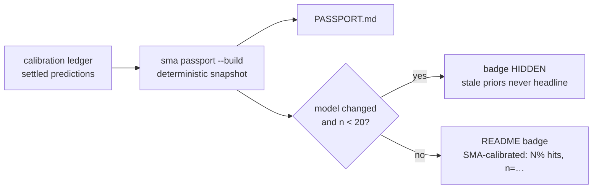
```mermaid
flowchart LR
    L["calibration ledger<br>settled predictions"] --> S["sma passport --build<br>deterministic snapshot"]
    S --> PM["PASSPORT.md"]
    S --> G{"model changed<br>and n &lt; 20?"}
    G -->|"yes"| H["badge HIDDEN<br>stale priors never headline"]
    G -->|"no"| B["README badge<br>SMA-calibrated: N% hits, n=…"]
```

### The adoption wedges — value before any habit change

| Surface | What it does |
|---|---|
| **`sma excavate`** | Mines a stranger's git history read-only (commit↔revert pairs, typo-fix chains, red CI runs) and prints CATCHES lines — *this reflex would have fired before this push*. Concrete evidence in the first five minutes. |
| **`sma emit`** | Compiles the corpus into `CLAUDE.md` / `AGENTS.md` / `.cursorrules` / `GEMINI.md` via managed blocks. Your text outside the block is never touched; re-emits are byte-identical. Anti-lock-in by construction. |
| **Fragment catalog + `sma context`** | A deterministic one-line card per repo file (symbols, imports, git stats), then a budgeted, byte-deterministic task context pack — catalog before grep, same input → same pack. |
| **Already-built preflight** | A millisecond, zero-token check of a plan's claims against the real tree before any executor spawns — nothing is rebuilt for pay. |
| **`sma explain` + `sma doc-audit`** | 18 plain-language topics covering every concept *and every CLI verb* (a coverage tripwire scores a miss if a command ships undocumented); a deterministic audit proves the manual and this README stay complete, fresh, and honest. |

### Self-tuning enforcement ladder

Rules rise **and fall** only on journal evidence — benefit accounting, not fire counting — and always as a reviewable diff. A weekly miss-curriculum turns error clusters into prediction templates and a weak-spots brief. The rule set sharpens instead of only growing.

### Statusline segment + attention pulse

Live coordination state in the native Claude Code status line — and it composes: your existing statusline command runs first and its output is preserved, with the SMA segment appended.

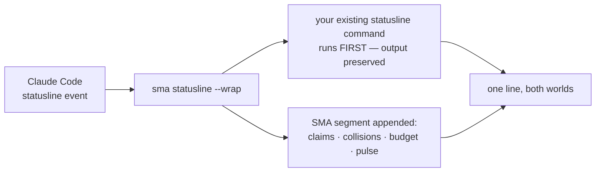
```mermaid
flowchart LR
    CC["Claude Code<br>statusline event"] --> W["sma statusline --wrap"]
    W --> U["your existing statusline command<br>runs FIRST — output preserved"]
    U --> OUT["one line, both worlds"]
    W --> SEG["SMA segment appended:<br>claims · collisions · budget · pulse"]
    SEG --> OUT
```

The attention pulse marks each window *working* or *waiting-for-human* (idle is derived, never guessed). The optional webhook is **outbound-only** — SMA sends a nudge out; there is no inbound path and nothing listens.

### PR evidence manifest + benchmark arena

`sma manifest` assembles the evidence passport for a commit range — registered predictions and how they scored, a receipt per claim, blind-verify verdicts — so the reviewer starts from evidence, not diff archaeology. `sma arena` scores comparative 4-arm benchmark runs deterministically and publishes raw data **including negative results**; the claim under test is cost-per-*result*, not cost-per-task.

### `/sma-batch` — the middle lane

Between an inline fix and a full phase: 2–4 compatible backlog items, one executor, receipts and re-verification still mandatory. Two hard guards keep the lane honest:

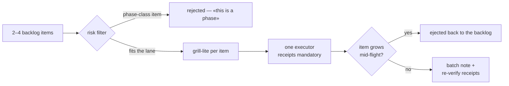
```mermaid
flowchart LR
    I["2–4 backlog items"] --> RF{"risk filter"}
    RF -->|"phase-class item"| REJ["rejected — «this is a phase»"]
    RF -->|"fits the lane"| GL["grill-lite per item"]
    GL --> EX["one executor<br>receipts mandatory"]
    EX --> GR{"item grows<br>mid-flight?"}
    GR -->|"yes"| EJ["ejected back to the backlog"]
    GR -->|"no"| DONE["batch note +<br>re-verify receipts"]
```

### Coordination hardening: fingerprint → claim-trust → worktrees → merge gate

Four surfaces that close the multi-terminal loop end to end — from *is that claim holder even alive?* to *how does a parallel branch safely enter main?*

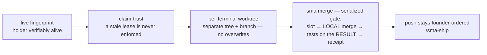
```mermaid
flowchart LR
    F["live fingerprint<br>holder verifiably alive"] --> CT["claim-trust<br>a stale lease is never enforced"]
    CT --> WT["per-terminal worktree<br>separate tree + branch — no overwrites"]
    WT --> MG["sma merge — serialized gate:<br>slot → LOCAL merge → tests on the RESULT → receipt"]
    MG --> SHIP["push stays founder-ordered<br>/sma-ship"]
```

`sma merge` never pushes and never deploys: it acquires the merge slot (a concurrent merge gets a soft-deny), merges **locally**, runs targeted tests on the *merged* tree — because two individually green branches can be red together — journals a receipt, and releases the slot.

## V3 — The Trust Spine

V1 taught the system to **remember**. V2 taught it to **predict, fire reflexes, and coordinate**. **V3 makes it stop trusting its own word.**

> **The vendor cannot impartially grade its own agent's homework.** That is the one layer that survives platform absorption — the accountability that a model vendor structurally cannot ship neutrally. SMA is that layer, built from outside the model: **files + git only, deterministic, zero LLM in the hot path, fail-open with a kill-switch on every stream.**

Everything below is a plain script on the V2 files+git substrate — no daemon, no database, no embeddings, no cloud. Here is the whole accountable loop, end to end:

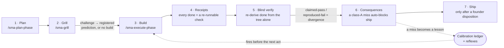
```mermaid
flowchart LR
    P["1 · Plan<br>/sma-plan-phase"] --> G["2 · Grill<br>/sma-grill"]
    G -->|"challenge → registered<br>prediction, or no build"| B["3 · Build<br>/sma-execute-phase"]
    B --> R["4 · Receipts<br>every done = a re-runnable check"]
    R --> BV["5 · Blind verify<br>re-derive done from the tree alone"]
    BV -->|"claimed-pass /<br>reproduced-fail = divergence"| C["6 · Consequences<br>a class-A miss auto-blocks ship"]
    C --> S["7 · Ship<br>only after a founder disposition"]
    C -.->|"a miss becomes a lesson"| M(["Calibration ledger<br>+ reflexes"])
    M -.->|"fires before the next act"| B
```

| The V3 spine | What it gives you | Command |
|---|---|---|
| **Structural receipts** | every "done" carries machine-checkable claims `{assertion, check_command, expected hash}`, re-run on a fresh clone; prose-only "done" fails lint | `sma reverify` |
| **Tamper-evident journal** | every journal line is hash-chained; the chain tip is pinned in the release tag, so editing history is detectable by anyone holding the tag | `sma chain-verify` |
| **Blind verifier** | re-derives every "done" from the code tree alone; structurally refuses the executor's self-report as input | `sma blind-verify` |
| **Consequences-as-LAW** | a trust-class miss or divergence auto-blocks shipping until the human owner records an explicit disposition — the agent cannot forgive itself | `sma preship` / `sma disposition` |
| **`/sma-grill`** | every plan promise is cross-examined before the build; an unresolved challenge must become a registered prediction or the build does not start | `sma grill` |
| **`sma pre` multiplexer** | ONE node spawn per tool call for all hook streams, replacing 3–4: measured p95 **152–157 ms** vs a **1268.6 ms** V2 base | `sma pre-bench` |
| **Subagent write-receipts** | every claimed file write is verified against the real tree on SubagentStop; phantom writes flagged deterministically | `sma subagent-verify` |
| **Integrity guards** | skeptic countersign, seeded 5% receipt audit, planted canary false-dones, STPA disarm-path guard — so the published numbers stay honest | `sma skeptic` / `sma canary` / `sma integrity` |
| **`sma bench`** | the 8-metric scorecard, captured and frozen *before* the spine was built ("no measured base, no target") | `sma bench` |

Each of these is explained, with its own diagram and — where you drive it — an animated demo, in **[The Trust Spine, process by process](#the-trust-spine-process-by-process)** below. The V3 release ate its own cooking: **532/532 tests green at that tag (the suite stands at 876/876, 78 files, in v4.0.0); hostile goal-backward verification 56/56 after a same-day fix round; the consequences law fired for real during that verification.** Journal chain tip at the V3 release: `b745d7d4…67db0161`, 0 breaks.

### The Trust Spine, process by process

This is the V3 core — the class of capability a model vendor structurally cannot ship neutrally. Each stream is a deterministic script; each is explained here with a diagram, and the ones you drive have an animated demo in **[the command gallery](#see-each-command-in-action)**.

#### 1 · Structural receipts + `sma reverify`

A "done" is no longer prose. Every plan summary may carry a `receipts:` block of machine-checkable claims — `{id, assertion, check_command, expected_sha256}` — layered over the V2 coverage block. `sma reverify` re-runs each `check_command` across the same safe-command boundary as predictions; `--fresh-clone` runs it on a throwaway `git clone` so **only committed evidence counts**. A `RECEIPT-PROSE` lint fails any machine-verifiable "done" that carries no receipt — a prose-only claim cannot pass.

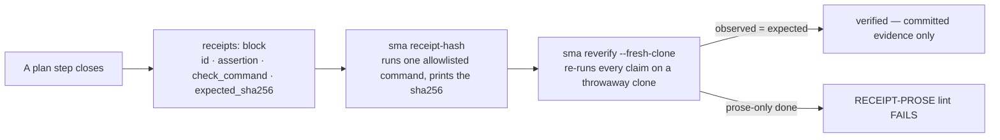
```mermaid
flowchart LR
    D["A plan step closes"] --> RC["receipts: block<br>id · assertion · check_command · expected_sha256"]
    RC --> RH["sma receipt-hash<br>runs one allowlisted command, prints the sha256"]
    RH --> RV["sma reverify --fresh-clone<br>re-runs every claim on a throwaway clone"]
    RV -->|"observed = expected"| OK["verified — committed evidence only"]
    RV -->|"prose-only done"| L["RECEIPT-PROSE lint FAILS"]
```

#### 2 · Tamper-evident journal

Published trust numbers are worthless if the local ledger is silently editable. So every `.sma/journal` line is **hash-chained**: each line's `prev` is the sha256 of the previous raw line. `sma chain-verify` reports any edit, deletion, or post-chain insertion, and a break is never auto-repaired. `sma chain-tip` emits a deterministic merged tip that the release ritual **pins into the annotated release tag** (`SMA-Journal-Tip: …`). Anyone holding the tag can recompute the tip and detect a local edit.

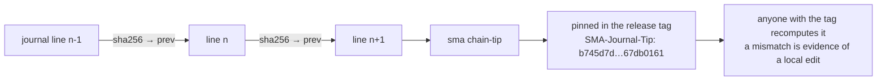
```mermaid
flowchart LR
    L1["journal line n-1"] -->|"sha256 → prev"| L2["line n"]
    L2 -->|"sha256 → prev"| L3["line n+1"]
    L3 --> T["sma chain-tip"]
    T --> TAG["pinned in the release tag<br>SMA-Journal-Tip: b745d7d…67db0161"]
    TAG --> V["anyone with the tag recomputes it<br>a mismatch is evidence of a local edit"]
```

#### 3 · Blind verifier — `sma blind-verify`

The heaviest signal in the whole system. A separate pass re-derives every "done" **from the code tree alone**, and it **structurally refuses** the executor's own report as input: hand it a SUMMARY or exec-journal and it errors with `BLIND_FORBIDDEN`, writing nothing. A claimed-pass that the blind pass reproduces as a fail is a **divergence** — the heaviest calibration-ledger event there is, and it blocks the ship.

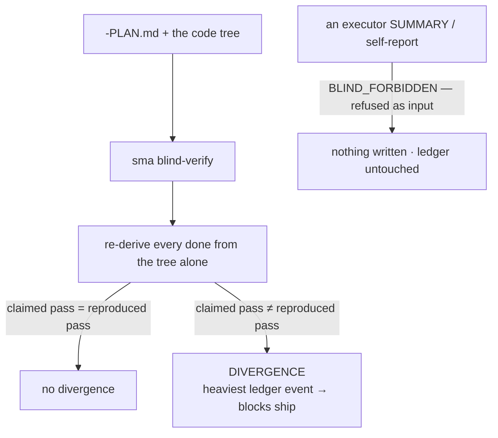
```mermaid
flowchart TD
    IN["-PLAN.md + the code tree"] --> BV["sma blind-verify"]
    SUM["an executor SUMMARY / self-report"] -->|"BLIND_FORBIDDEN — refused as input"| XX["nothing written · ledger untouched"]
    BV --> DER["re-derive every done from the tree alone"]
    DER -->|"claimed pass = reproduced pass"| OK["no divergence"]
    DER -->|"claimed pass ≠ reproduced pass"| DIV["DIVERGENCE<br>heaviest ledger event → blocks ship"]
```

#### 4 · Consequences-as-LAW — `sma preship` / `sma disposition`

The single step from *recording* a false "done" to *acting* on it. An immutable `consequences:` block in plan frontmatter, fixed at plan time, defines what a class-A miss blocks. **Class A** = a miss that invalidates the trust claim itself (false-done rate, subagent honesty, blind-verifier quality). When one fires, `sma preship` **blocks the push ritual** until the founder records an explicit disposition (`accept` / `fix-forward` / `rollback`) in the **append-only** ledger; a divergence additionally opens a rollback candidate branch. The agent cannot forgive itself — **this fired for real during this very release's verification**, and its two false ledger events are visible in the ledger, dispositioned by the owner, exactly as designed.

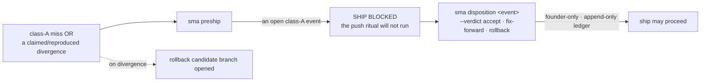
```mermaid
flowchart LR
    E["class-A miss OR<br>a claimed/reproduced divergence"] --> PS["sma preship"]
    PS -->|"an open class-A event"| BLK["SHIP BLOCKED<br>the push ritual will not run"]
    BLK --> DISP["sma disposition &lt;event&gt;<br>--verdict accept · fix-forward · rollback"]
    DISP -->|"founder-only · append-only ledger"| CLR["ship may proceed"]
    E -.->|"on divergence"| RB["rollback candidate branch opened"]
```

#### 5 · `/sma-grill` — the adversarial pre-build gate

The founder's own *grillme* ritual, absorbed into architecture instead of rhetoric. Every promise of a plan is cross-examined **before** the build. An unresolved challenge must become a registered falsifiable prediction, be withdrawn, or be founder-accepted — otherwise `--gate` **blocks the build**. Pre-push, a **budget-aware** grill inspects `origin..main` and spends review depth precisely where the calibration ledger proves the project has historically been miscalibrated.

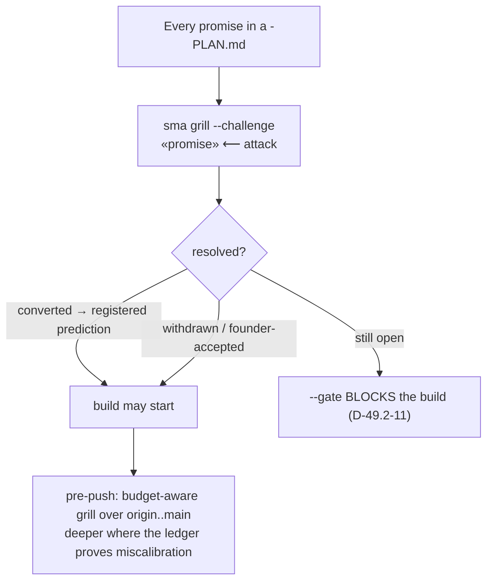
```mermaid
flowchart TD
    P["Every promise in a -PLAN.md"] --> CH["sma grill --challenge<br>«promise» ⟵ attack"]
    CH --> Q{"resolved?"}
    Q -->|"converted → registered prediction"| GO["build may start"]
    Q -->|"withdrawn / founder-accepted"| GO
    Q -->|"still open"| STOP["--gate BLOCKS the build (D-49.2-11)"]
    GO --> PP["pre-push: budget-aware grill over origin..main<br>deeper where the ledger proves miscalibration"]
```

#### 6 · `sma pre` — one spawn per tool call

Everything above adds hook streams, and naive hooks tax every keystroke. The `sma pre` multiplexer reads the tool event **once** and dispatches the ordered stream pipeline (collision → reflex → gates → airbag → spend) in a **single node spawn**, replacing the 3–4 spawns V2 used. Honest numbers, measured on the platform dogfood (SMA user #1) on 2026-07-08:

<p align="center">
  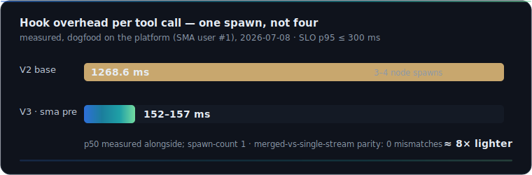
</p>

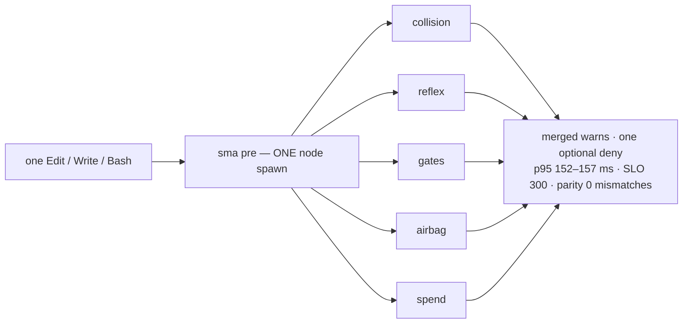
```mermaid
flowchart LR
    TC["one Edit / Write / Bash"] --> PRE["sma pre — ONE node spawn"]
    PRE --> S1["collision"]
    PRE --> S2["reflex"]
    PRE --> S3["gates"]
    PRE --> S4["airbag"]
    PRE --> S5["spend"]
    S1 & S2 & S3 & S4 & S5 --> OUT["merged warns · one optional deny<br>p95 152–157 ms · SLO 300 · parity 0 mismatches"]
```

`sma pre-bench` re-measures the p95, the spawn count (must be 1), and merged-vs-single-stream parity after any change. Every stream has a kill-switch (`SMA_PRE_DISABLE`, `SMA_REFLEX_DISABLE`, …) and a soft time budget — a slow stream is skipped, never allowed to overrun.

#### 7 · Subagent write-receipts + PreTask pack

Anthropic closed the context-inheritance request "not planned", so only an outer layer can fix it. A `PreToolUse(Task)` hook injects the assembled pack — rules digest, task-scoped lessons, active claims, the parent's task slice — giving the subagent **inheritance by construction**. On `SubagentStop`, `sma subagent-verify` checks **every claimed file write against the real tree**: a receipt lands in the shared journal, and a **phantom write** (claimed but not on disk) is flagged deterministically. The parent reads disk truth, not the subagent's self-report.

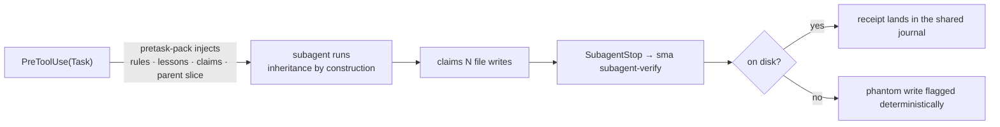
```mermaid
flowchart LR
    PT["PreToolUse(Task)"] -->|"pretask-pack injects<br>rules · lessons · claims · parent slice"| SUB["subagent runs<br>inheritance by construction"]
    SUB --> CLAIM["claims N file writes"]
    CLAIM --> SS["SubagentStop → sma subagent-verify"]
    SS --> TREE{"on disk?"}
    TREE -->|"yes"| OK["receipt lands in the shared journal"]
    TREE -->|"no"| PH["phantom write flagged deterministically"]
```

#### 8 · Integrity guards — keeping the numbers honest

The moment trust numbers are published, the incentive to game them exists — a scoreboard without a judge is not viable. So the spine ships with its own adversaries: predictions are **countersigned by a skeptic** (a non-implementer role); a **seeded 5% deep audit** re-checks receipts at random; **planted canary false-dones** the blind verifier must catch (below a 90% catch rate, "zero divergence" is evidence of a lazy verifier, not clean work — this is scorecard metric S8); and an **STPA disarm-path guard** where every kill-switch must cite a compensating control, with the birth-fixture shadow-running even while a rule is off and auto-re-arming it.

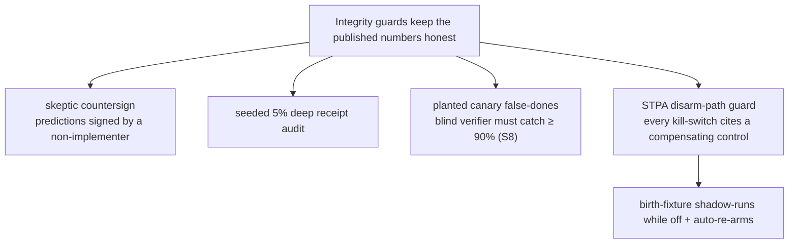
```mermaid
flowchart TD
    G["Integrity guards keep the published numbers honest"] --> SK["skeptic countersign<br>predictions signed by a non-implementer"]
    G --> AU["seeded 5% deep receipt audit"]
    G --> CAN["planted canary false-dones<br>blind verifier must catch ≥ 90% (S8)"]
    G --> STPA["STPA disarm-path guard<br>every kill-switch cites a compensating control"]
    STPA --> SR["birth-fixture shadow-runs while off + auto-re-arms"]
```

#### 9 · `sma bench` + the 8-metric scorecard

The founding act: **the measurement harness shipped before the spine was built.** No measured base, no target. `sma bench` captured and froze the V2 baseline first; every target lives as an immutable, machine-scoreable prediction. Honest to a fault — two of the eight bases were forfeit when the founder shortened the measurement window on 2026-07-08, and they are frozen as `insufficient-data` rather than hidden.

| # | Metric | V2 base | 10× target | Status |
|---|--------|---------|------------|--------|
| S1 | False-"done" rate | retro blind re-verify of the last 10 V2 plans | < 1%, 100% of claims carrying receipts | measured, registered |
| S2 | Git-loss recoverability | 30-day journal of destructive-gate firings | 100% of firings preceded by a snapshot | measured, registered |
| S3 | Compaction survival | 10-question exam *before* the capsule exists | ≥ 90% match against the capsule | **`insufficient-data`** (window forfeit) |
| S4 | Subagent honesty | phantom-write share over 2 dogfood phases | 0 unverified write claims in `main` | measured, registered |
| S5 | Time-to-context | median "session start → first Edit" | ≥ 3× reduction on same-risk tasks | **`insufficient-data`** (window forfeit) |
| S6 | Cross-machine collisions | 0 (no mechanism yet) | ≥ 90% warns in a 2-machine drill, n=20 | registered, scored when the git bus ships (V3.1) |
| S7 | V3 self-cost | today's 3–4 node runs per tool call | all V3 layers ≤ 10% of session spend; p95 ≤ 300 ms | measured, registered |
| S8 | Blind-verifier quality | 0 (no verifier existed) | ≥ 90% catch of planted canary false-"dones" | measured, registered |

> **We never claim a multiplier for S3 or S5.** Under the founder's 2026-07-08 force-freeze the measurement window was shortened; those two bases are recorded `insufficient-data`, on the record, rather than dressed up. That honesty *is* the product.

#### The bridges (opt-in, never headlined)

Three conveniences ship behind capability probes, each with a **registered self-removal prediction** — they stand down the day a native equivalent suffices. They are deliberately not part of the headline; the accountability core above is what SMA *is*, and these are scaffolding it expects to remove.

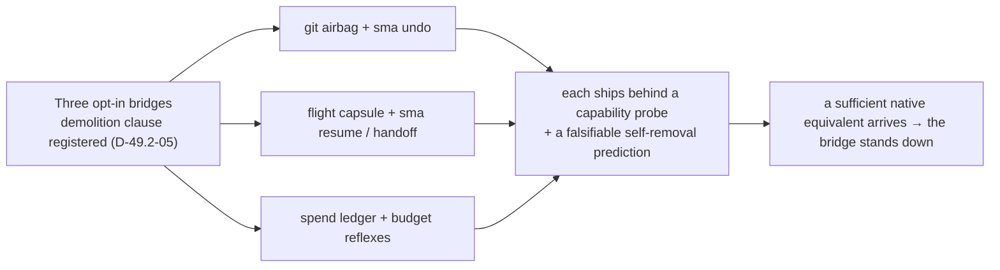
```mermaid
flowchart LR
    B["Three opt-in bridges<br>demolition clause registered (D-49.2-05)"] --> A1["git airbag + sma undo"]
    B --> A2["flight capsule + sma resume / handoff"]
    B --> A3["spend ledger + budget reflexes"]
    A1 & A2 & A3 --> DC["each ships behind a capability probe<br>+ a falsifiable self-removal prediction"]
    DC --> STAND["a sufficient native equivalent arrives → the bridge stands down"]
```

- **Git airbag** — a millisecond `git update-ref refs/sma/airbag` + `git stash create` snapshot before destructive git (explicitly **not** a slow `git bundle`, which would time out at exactly the catastrophe moment). `sma undo` restores HEAD + dirty tracked + untracked in one action. Stand-down probe: `SMA_AIRBAG_NATIVE`.
- **Pre-compaction flight capsule** — a deterministic, zero-LLM `PreCompact` capsule (`.sma/flight/intent.md`) written *before* the context is cut; `sma resume` assembles a continuation brief, `sma handoff` a teammate one. Stand-down probe: `SMA_FLIGHT_NATIVE`.
- **Deterministic spend ledger** — a versioned log-format adapter parses local session logs into a per-session/subagent/model book; `sma spend` reports it; budget reflexes warn at 70/90% and soft-deny new subagents over cap; a loop-breaker disarms a rule that fires runaway. Field-compatible with the OTel/ccusage schema.

### Watch it work — five real files

SMA is "just files," and that is the feature — you can point at every part of it. Here is the whole loop, in the artifacts it actually reads and writes.

**1 · A lesson, the first time something burns you** — `.claude/memory/bug_build_node20.md`

```markdown
---
description: Build emits an empty API chunk on Node 20 without --no-experimental
kind: bug-lesson
tags: [build, ci]
use-when: "editing vite.config or running the production build"
importance: 8
---
**Rule:** On Node 20 the API bundle needs `--no-experimental-*` or it silently
ships an empty chunk (exit code 0, broken deploy).

**Why:** Cost us a red prod on 2026-06-02 — the build "passed" and shipped nothing.

**How to apply:** keep the flag in `build:api`; if you touch the bundler config,
run `pnpm build:api` and confirm the chunk is non-empty before committing.
```

**2 · A prediction, written into the plan before any code** — `.planning/phases/12-.../12-01-PLAN.md`

```yaml
predictions:
  - id: PRED-01
    claim: "The rate limiter rejects the 101st request in a 60s window"
    metric: rejected_requests
    check_command: "pnpm vitest run test/rate-limit.test.ts"   # allowlisted prefixes only
    comparator: ">="
    threshold: 1
    horizon: plan-close
    domain: api
    confidence: 0.8    # recorded for calibration — NEVER gates the result
```

**3 · A structural receipt, settled by a script on a fresh clone (zero LLM)** — the `receipts:` block a "done" now carries

```yaml
receipts:
  - id: R-01
    assertion: "rate-limit suite is green on a clean clone"
    check_command: "pnpm vitest run test/rate-limit.test.ts"
    expected_sha256: "9f2c…a17b"   # observed == expected on `sma reverify --fresh-clone`
```

```json
{"type":"prediction-verdict","id":"PRED-01","domain":"api",
 "result":"hit","observed":1,"comparator":">=","threshold":1,"ts":"2026-06-14T09:41:02Z"}
```

```text
# calibration ledger — per area, how often our promises matched facts
api        14/15  (93%)
migrations  6/6   (100%)
ui          9/12  (75%)   ← this area keeps over-promising; SMA escalates it
```

**4 · A reflex firing — the warning the agent sees *inside* the tool call** (before it edits `vite.config.ts`)

```text
⚠ SMA reflex [bug_build_node20]: On Node 20 the API bundle needs --no-experimental
  or it silently ships an empty chunk. Last time this red-shipped prod (2026-06-02).
  → run `pnpm build:api` and confirm the chunk is non-empty before you commit.
```

**5 · A collision + a shared counter — coordination, no server** (Terminal B, about to touch A's files)

```text
⚠ SMA: src/api/** is claimed by t-4821 (phase 12 exec) since 14:07.
  You are about to Edit src/api/routes.ts — coordinate first (`pnpm sma status`).

$ pnpm sma next-slot migration
0007          # yours. A parallel terminal asking now gets 0008 — they never collide.
```

Nothing here is a database row or an opaque embedding. It is a handful of text files, and together they are the entire loop: burn → note → prediction → script-settled receipt → reflex that stops the next burn.

### The lifecycle: discuss → plan → grill → build → verify → ship

SMA is not only memory — it is a full working rhythm for shipping real changes with an agent. Each stage is a `/sma-*` command, and every stage reads from and writes back to the same file-based memory, so nothing is re-explained twice.

```mermaid
flowchart LR
    D["1 · Discuss<br>/sma-discuss-phase"] --> P["2 · Plan<br>/sma-plan-phase"]
    P --> G["3 · Grill<br>/sma-grill"]
    G --> B["4 · Build<br>/sma-execute-phase"]
    B --> V["5 · Verify<br>/sma-verify-work"]
    V --> S["6 · Ship<br>push ritual + preship gate"]
    M(["Memory + predictions<br>+ receipts + reflexes"]) -.->|reads| D
    M -.->|reads| P
    M -.->|reads| B
    B -.->|writes receipts + lessons| M
    V -.->|writes lessons| M
    S -.->|calibration scored| M
```

- **1 · Discuss** — lock the gray-area decisions with a human *before* any code, through adaptive questioning. The context is captured as files, so the plan that follows is grounded, not guessed.
- **2 · Plan** — turn the decisions into an executable plan whose steps each carry a machine-checkable **prediction** and, at close, a re-runnable **receipt**. The plan is the contract.
- **3 · Grill** — cross-examine every promise before a line is built; an unresolved challenge becomes a registered prediction or the build does not start.
- **4 · Build** — execute the plan in dependency-aware waves. Reflexes fire before risky actions; progress is journaled so an interrupted run resumes in minutes, not from scratch; subagent writes are verified against the tree.
- **5 · Verify** — validate the built feature against its acceptance criteria, and let the blind verifier re-derive each "done" from the tree alone. Human sign-off gates stay human; the agent never self-certifies.
- **6 · Ship** — the release ritual runs the full gate *and the `preship` consequences check*; the predictions written in step 2 are **scored** against what actually happened. A class-A miss blocks the push until the founder dispositions it. The loop closes.

## V2 — Predictions, reflexes, coordination

V2 is where SMA learned to keep score. Three mechanisms, all deterministic, all still the substrate everything above runs on:

- **Predictions** — every plan states up front what will measurably change: a metric, a check command, a threshold. Registered predictions are immutable (a lint refuses post-hoc edits), so the goalposts cannot move after the result is known.
- **Reflexes** — a scored miss becomes a rule with a firing condition, delivered as a warning *inside* the matching tool call. One burn, permanent avoidance — with noise controls (repeat muting, a kill-switch per rule).
- **Calibration** — a per-domain ledger of promise-versus-fact. An area that keeps over-promising earns stricter oversight; a long clean record earns lighter touch.

The prediction lifecycle, end to end:

```mermaid
flowchart LR
    REG["prediction registered<br>in plan frontmatter — immutable"] --> HZ["horizon reached<br>plan close / phase verify"]
    HZ --> SC["deterministic scorer<br>sma predict-score"]
    SC -->|"hit"| CAL["calibration ledger<br>per-domain hit rate"]
    SC -->|"miss"| LES["lesson drafted<br>→ promoted to a reflex on evidence"]
    LES --> CAL
    CAL --> BG["budget-aware grill<br>review goes deeper exactly where<br>the ledger proves miscalibration"]
```

### Coordination without a server

```mermaid
sequenceDiagram
    participant A as Terminal A
    participant FS as .sma/ (files + git)
    participant B as Terminal B
    A->>FS: register session · claim src/api
    B->>FS: register session · claim src/api
    FS-->>B: ⚠ scope held by A — warned BEFORE the edit
    A->>FS: next-slot migration → 0007
    B->>FS: next-slot migration → 0008
    Note over FS: shared counters never collide<br>the journal records who did what
```

## V1 — The memory foundation (why SMA exists)

Everything above stands on the V1 bet: small files in your git repo, deterministic scripts, and the agent-harness hook system. This is the origin story — the four failures that started it, and the memory architecture that answers them.

### Why SMA exists

If you run Claude Code (or any coding agent) on a real project every day, you already know these four failures:

1. **Rules get read, then dropped.** Your carefully written instructions file is acknowledged at session start and violated an hour later — the model's working attention is tiny, and a rule that isn't present *at the moment of the action* might as well not exist.
2. **"Done" that isn't.** The agent reports tests green and files written; the tree says otherwise. Confident prose is not evidence. **(This is the failure the V3 trust spine exists to kill — see below.)**
3. **Lessons get re-learned, expensively.** The same mistake — the same footgun in your build, the same API quirk — burns you again next month, because nothing turned the first burn into a permanent avoidance.
4. **Parallel sessions collide.** Two terminals on one checkout silently overwrite each other; session B "fixes" what session A finished an hour ago.

SMA is a layer on top of the agent that attacks all four with the same design bet: **small files in your git repo + deterministic scripts + the agent-harness hook system**. No daemon, no database, no embeddings, no cloud. Everything it knows is a markdown file you can read, diff, and revert; everything it enforces is a script you can run yourself.

> **A 700-line instructions file is not a process.** It is one big note the model skims once and forgets. SMA's bet is the opposite: keep the always-loaded rules tiny, and deliver each *specific* rule as a warning at the precise tool call it governs. Presence beats length. That is the difference between "I told the agent" and "the agent could not miss it."

### It lives beside your code, never inside it

SMA never edits, moves, or reformats a single line of your application. It writes only to a handful of sibling folders — its memory corpus, its coordination state, and its planning artifacts — all of them plain text, all of them under version control, all of them yours.

```text
your-project/
├─ src/            ← YOUR CODE — SMA never writes here
├─ package.json    ← untouched
├─ ...             ← untouched
│
├─ .claude/
│  ├─ memory/      ← the memory corpus (markdown notes you can read & diff)
│  ├─ agents/      ← the /sma-* workflow agents
│  └─ settings.json← the hooks that wire SMA into your agent
├─ .sma/           ← coordination + accountability state:
│                    sessions · claims · hash-chained journal · reflexes ·
│                    airbag snapshots · flight capsules · spend ledger
└─ .planning/      ← phase plans, predictions, receipts, and the calibration ledger
```

Because it is all files in git, adopting SMA is reversible in one commit, and everything it "learns" arrives as a diff you approve — not a black-box mutation of a cloud cache. Delete the folders and your project is exactly as it was.

### What SMA is

Three subsystems on one substrate, now bound by a fourth — the accountability layer that makes their claims answerable:

- **Memory that arrives on time.** Project knowledge lives as small, tagged notes. The always-loaded core stays tiny (a few KB); topic notes load only when the task touches that topic; and *reflexes* deliver the exact relevant lesson right before the tool call that needs it — because a rule named at the moment of the act is worth ten rules buried in a big instructions file.
- **Coordination without a server.** Every open terminal registers itself, claims the files it is working on, and draws shared counters (migration numbers, release numbers) from one queue. Parallel sessions warn each other *before* the collision, and the journal records who did what.
- **A learning loop with a score.** Plans state up front what will measurably change and how to check it (`predictions`). A deterministic scorer — a script, not a judge model — settles each prediction against reality. Misses become lessons; repeated lessons become reflexes; the calibration ledger tracks, per area, how often promises match facts.
- **An accountability spine (V3).** Every "done" carries a re-runnable receipt; a blind verifier re-derives it from the code tree alone; a false "done" blocks the next ship until a human dispositions it. SMA's memory does not claim to work — it publishes a measured hit rate, and its own release is gated by that measurement.

### The story in 10 slides

<p align="center">
  
</p>

<details>
<summary><b>Open the full deck (10 slides)</b> — the problem, the root cause, the mechanism, the proof discipline</summary>

<br>

| | |
|:--:|:--:|
| 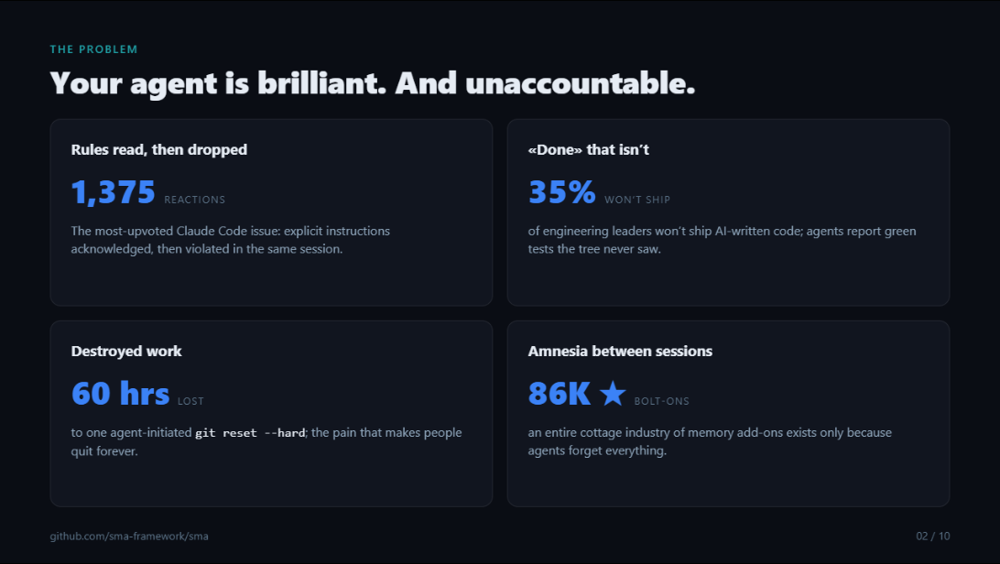<br>**The problem** — brilliant, and unaccountable | 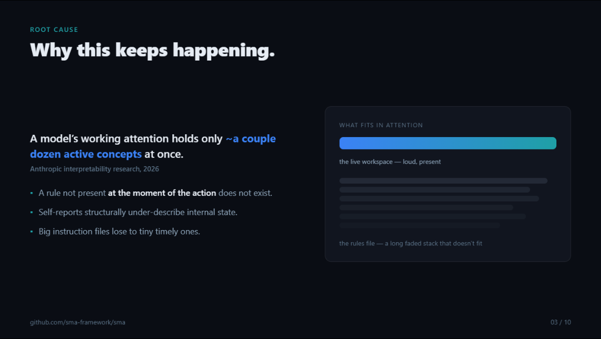<br>**Root cause** — a model's working attention is tiny |
| 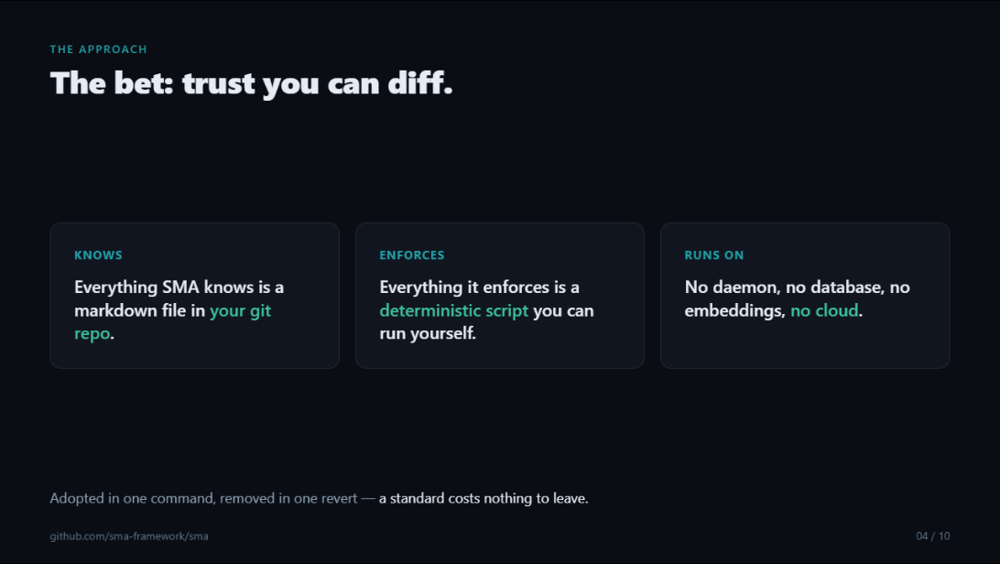<br>**The bet** — trust you can diff | 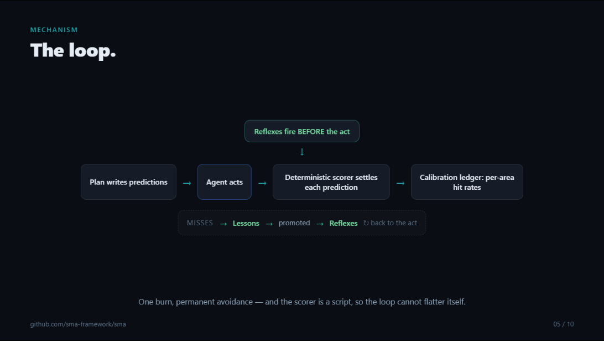<br>**The loop** — predict, act, score, learn |
| 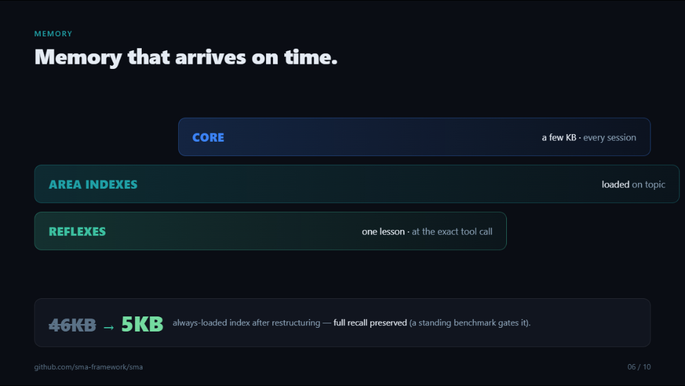<br>**Memory that arrives on time** | 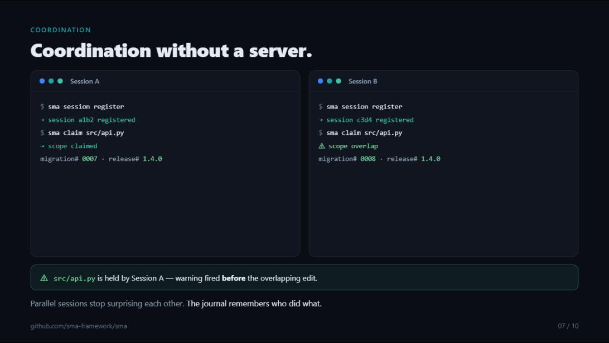<br>**Coordination without a server** |
| 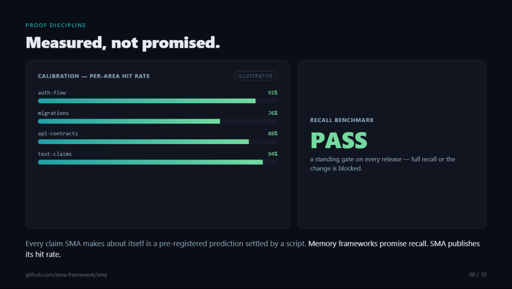<br>**Measured, not promised** | 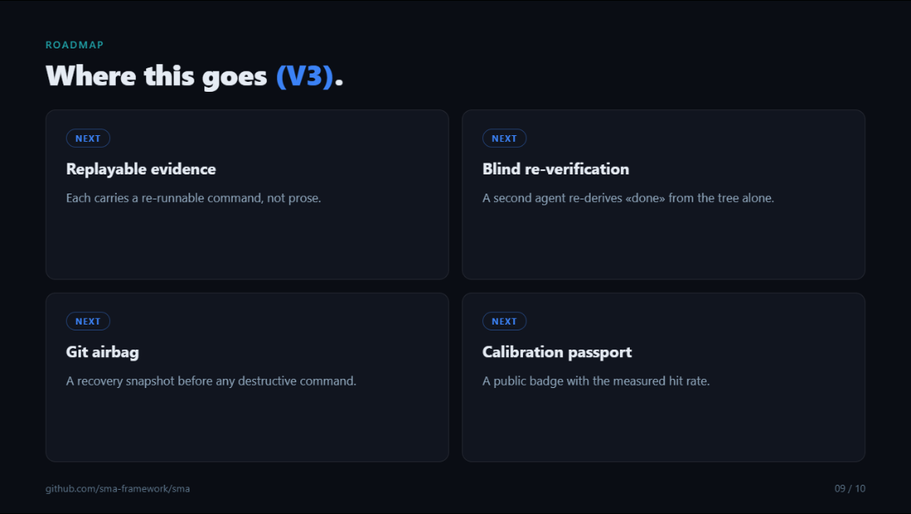<br>**Where this goes (V3)** |
| 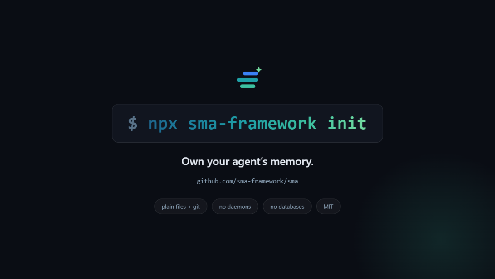<br>**Own your agent's memory** | |

</details>

### The version timeline

```mermaid
flowchart LR
    V1["V1<br>memory + coordination<br>on files + git"] --> V2["V2<br>predictions · reflexes ·<br>corpus health · gates"]
    V2 --> V3["V3<br>the trust spine:<br>receipts · blind verify · consequences"]
    V3 --> V35["V3.5<br>adoption & trust telemetry"]
    V35 --> V36["V3.6<br>the one-command door:<br>npm install · off-ramp · memory preview"]
    V36 --> V4["V4 — current<br>grade the grader:<br>graded verdicts · economy meters · vendor triage"]
```

## Planned next

Directions, not dates — and each will arrive the way everything here arrives: as a deterministic script with a registered prediction. The managed-agents absorption and the adoption/off-ramp hygiene that lived here have shipped — see **[What's new in V4](#whats-new-in-v4--grade-the-grader)** and **[What's new in V3.6](#whats-new-in-v36--the-one-command-door-both-ways)**.

**Publish this repo's calibration badge.** The honest badge stays hidden until *this* repo's committed ledger reaches n ≥ 20 settled predictions on one Claude model; the graded-grader loop now feeds it. When the gate is met, the README badge turns on.

**Keep watching the vendor in the open.** Vendor triage is a standing process, not a one-time pass: each new upstream capability gets a CORE/BRIDGE verdict in the append-only ledger, and a BRIDGE surface ships with its own self-removal prediction — never headlined.

## Star History

[](https://star-history.com/#sma-framework/sma&Date)

## License and attribution

**FSL-1.1-MIT** (Functional Source License) — see [LICENSE](LICENSE). In plain words: the source is open to read, install locally, modify, and use internally or for non-commercial education and research — free of charge. What it forbids is offering SMA (or a substantially similar product) as a competing commercial product or service. Each released version automatically becomes plain MIT two years after its release. Versions released before the license change (v4.0.2 and earlier, including the npm releases) remain MIT.

**Author: Matvey Maslov.** Questions, feedback, adoption stories: [matvey.maslov99@gmail.com](mailto:matvey.maslov99@gmail.com) — or open an [issue](https://github.com/sma-framework/sma/issues).

The workflow engine inside SMA is derived from [gsd-core](https://github.com/open-gsd/gsd-core) (MIT). The pristine upstream snapshot, the rename map, and third-party notices are tracked in [UPSTREAM.json](UPSTREAM.json), [rename-map.json](rename-map.json), and [THIRD-PARTY-LICENSES.md](THIRD-PARTY-LICENSES.md).

<!-- sma:passport:begin -->
**SMA calibration:** badge hidden — no Claude model recorded yet.

<sub>derived from PASSPORT.md, rebuilt each release, reproducible via <code>sma passport --verify</code></sub>
<!-- sma:passport:end -->

