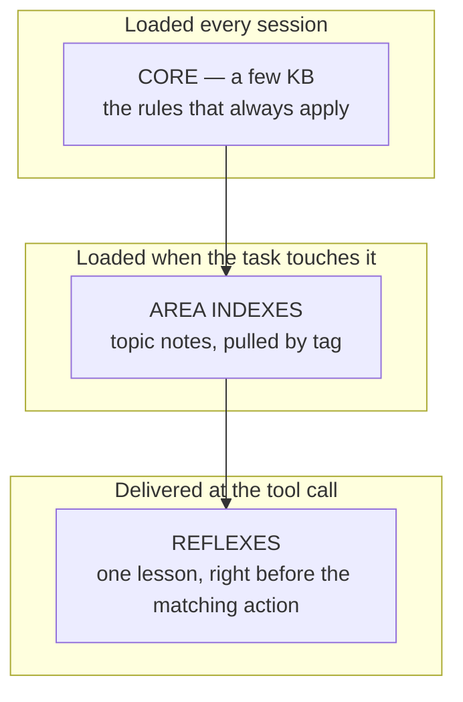

<p align="center">
  
</p>

<p align="center">
  
  
<!-- sma:passport:begin -->
  <a href="PASSPORT.md"></a>
<!-- sma:passport:end -->
  <a href="LICENSE"></a>
  
  
</p>

# SMA — Shared Memory & Automation

**Your AI coding agent forgets, overstates, and does not scale into a team. SMA is the local-first control plane that fixes all three at once: layered memory that arrives at the exact moment of action, multi-terminal coordination without a server, and a trust spine in which every "done" is settled by a script, re-derived by a blind verifier, and blocked from shipping when it is false.**

[Русская версия → README.ru.md](README.ru.md)

> ### 🗺️ [Open the live system map →](https://sma-framework.github.io/sma/master-graph.html)
> Every subsystem of SMA on one interactive page — the fastest way to see how everything connects.

> ### 🆕 [What's new in v5.7.0 — the design stage →](#whats-new-in-v570--the-design-stage)
> The phase graph gains a fifth stage between the plan and the code: the thing is drawn, a short contract is written beside the drawing, and **execution does not start until a person confirms it**. With it come two new roles — a designer and an animator.

> ### 🧭 [Roadmap →](ROADMAP.md) · [по-русски](ROADMAP.ru.md) · [The deep description →](docs/WHAT-IS-SMA.md)
> Where SMA is and what it took to get here — the V5 line shipped as a release every few days, from the 24/7 worker fleet through measured memory, live-session steering and a taskboard whose numbers do not lie, to today's five-stage phase cycle.

> **This is not a memory plugin.** It is a working discipline for shipping real code with an AI agent: memory that arrives at the exact moment it is needed, coordination that stops two terminals from overwriting each other, and a **trust spine** in which every "done" is settled by a script, re-derived by a blind verifier, and blocks the next release if it is false. It writes only to a few folders next to your code — **your source tree is never touched** — and everything it knows or enforces is a plain file you can read, diff, and revert.

> ### 🤝 The promise
> 1. Every task you hand to SMA is done by a worker in its own copy of your project, is checked by a script rather than by anyone's word, and comes back to you with a receipt — what was promised, what was done, how it is proven — and rolls back with one command.
> 2. The worker works in exactly your environment: the same rules, hooks, memory, skills and permissions you have in your terminal — and each of its tasks leaves a lesson the system applies to the next one.
> 3. Not a single number and not a single "done" in SMA is invented: everything this README states is verified by a command you can run yourself.

---

## What you get

**🧠 Memory that arrives on time.** Not one big instruction file the model skims — three tiers. A few kilobytes of always-true rules load every session; topic notes load when the task touches their tags; and *reflexes* — one lesson each — fire into the exact tool call they protect. The lesson about schema migrations does not sit in the prompt all day; it interrupts the agent the moment it touches the schema file. Auto-trim demotes, never deletes; forgetting is a deliberate command of its own.

**🚦 Coordination without a server.** Sessions register themselves, scopes are claimed, a collision warns *before* the keystroke — and anything two terminals could race on (a migration number, a release version) comes from one shared counter. A session that ends gives its claims back **and closes its own window**, so a run that was killed rather than finished leaves no ghost behind to be warned about. A parallel branch enters the trunk through **one serialized merge door** — a smoke runs on the *merged* tree before the merge commit exists, and a red run is refused with a receipt; the wave cleanup that folds a multi-worker phase back together walks through that same door, never a bare `git merge`. All of it plain files in your repository.

**🧾 The trust spine.** Every plan pre-registers what will measurably change and how to check it. Every "done" carries a re-runnable check settled by an exit code, not by prose. A **blind verifier** re-derives the verdict from the tree alone, refusing the agent's self-report as input. And a false "done" is not a log line — it **blocks the next release** until a human rules on it, from an append-only ledger the agent cannot edit.

**📐 The design stage — new.** Between the plan and the code, the phase draws the thing and writes a contract beside the drawing. A person confirms it — on the phase card in the window or from the terminal — and until then, **execution physically does not start**: there is no flag that turns the gate off. Phases older than the stage honestly read «skipped», decided by evidence, not by date.

**🤖 The fleet and its window — optional.** A daemon on your machine runs worker sessions around the clock: durable queue, one attempt ledger, budget stops that read the same number the screen shows, and a window served by the daemon itself — put work in, watch it live, steer it mid-run, accept or return it — and the acceptance press stands in the day's row itself, so finished work is let through without opening a card. **Finished work unfolds where it stands**: what was promised, what was merged — which branch became which commit, whether the tests ran and how they came out — the commits with their messages, what it cost and how long it took, who accepted it and when, and how many times it was sent back and with what words. That last part is the point rather than a convenience: the acceptor is now often a terminal accepting on standing approval, and «accepted» that cannot be opened is a word rather than evidence — you would have nothing to check the acceptor against. Every attempt journals its base commit, its changed files and **one whole rollback command**. A stage the fleet starts carries the answers to its own mechanical questions and spawns no subagents — it never prints a menu into a room with nobody in it; a question only a person can settle is parked as an artifact and waits for you — and **anything that waits for you is loud everywhere, not only on its own card**: a batch stopped on a broken item now carries its own board counter beside «waiting for approval», its own «standing for so long» clock, and one Telegram message naming the batch and the item it stopped on. That last part is measured, not decorative: the same state, visible only to whoever happened to open that one card, once cost fifteen hours of fleet idling in total silence. **And the channel that calls you does not shout.** Everything standing on your decision arrives as ONE message per pass — «4 works waiting for approval, the oldest for 2 d 3 h», with the names and their own clocks — rather than one message per row; a repeat about the same work comes no sooner than six hours, which is shorter than a working day (work that stood since morning is named before evening) and longer than one sitting (a repeat never lands while you are still reading the first call). What it has already said it remembers **on disk, not in the process**: restarting the daemon no longer replays the whole waiting list into your phone — measured on 02.09, two starts in one morning cost two identical salvos of ten messages each. And before speaking it checks the registry: a card you have already ticked closed, and a piece of a batch you abandoned, stay silent even while the queue still holds them waiting for a person. **And what does not need you no longer waits for you**: an ending the engine itself calls repeatable is re-issued by the queue on its own — with a ceiling on the repeats, a pause that doubles between them and a line in the log for each — so only what a repeat cannot fix ever reaches you. **Workers and agents are two different rosters, and routing knows it:** a worker is an EXECUTOR — the one who takes inline tasks and batch pieces, writes code and fixes bugs — and a task that names no role goes to one of them, never to whoever happens to sit first in the config. An agent is a specialist the swarm raises inside a phase; it takes nothing from the queue on its own, and putting inline work on one is an explicit choice you make at intake — a «who takes it» field on the task form (`role`), listing the agents this machine can actually call — not a side effect of alphabetical order. Ask for a role nobody holds, or one whose only worker is switched off, and the task says exactly that instead of waiting for a window that would not help — and instead of quietly running on the paid channel, which carries no role at all. **And a role, once named, outlives the attempt it was named on:** send the work back for another try, or retry a broken batch piece, and the second attempt asks for the same specialist the first one did. A re-queue that forgot the name would be the very substitution that refusal exists to prevent — reached by forgetfulness rather than by refusal, and with nothing left to complain about, because the request itself would no longer exist. **A build belongs to one worker, from its first piece to its last:** every piece of a batch goes to whoever ran the piece before it, so what one piece learned is not paid for again in a fresh session on another account. That is a preference the router may still overrule — holding a batch for a spent window would be a stall nobody asked for — but overruling it is no longer silent: the log names the pin that was let go and why, whether the worker vanished from the config or the piece asks for a role that worker does not hold. The silence was the danger, not the substitution: a build quietly coming apart across accounts is exactly what the rule exists to prevent, and it can no longer happen without a word. **And sending a piece back does not take it out of its build:** a returned piece stays a piece of its build — same worker, same turn order, same card — because a return re-queues THE SAME work whole, instead of rebuilding it out of what the screen happens to show. The door used to list the fields one by one, and each new one was lost in silence until somebody noticed: the stage envelope, the lane, the words, the estimate, the role, the kinship with the build — and the context snapshot you wrote for the worker could not be saved by listing at all, because it never travels to the screen in the first place. There is no list any more: the work comes back as itself. And when a build's worker can no longer be read off it — the only piece that ever ran is the one being retried — the log says that too, instead of switching accounts in silence. **Every task the fleet runs stands in its own copy on its own branch — a stage of the phase cycle exactly like a piece of code**, so the plans, the drawing and the verification record reach your tree by your acceptance and by nothing else: a stage that failed, or one you cancelled, leaves your main branch untouched. Switch the fleet off and everything above loses nothing.

The deep version of all five, with the mechanisms named: **[docs/WHAT-IS-SMA.md](docs/WHAT-IS-SMA.md)**.

## Proof, not prose

The claim that makes SMA different is not a feature — it is that **you never have to take SMA's word for anything**:

- The counts of commands, CLI verbs, daemon routes and tests quoted in this documentation are checked against the code on every `npm test` — a document that disagrees turns the suite red. Check it yourself: `node scripts/sma/cli.mjs doc-audit --target numbers`.
- The tests badge at the top is written by a script from the JSON report of an actual run — never edited by hand, and never accepted from a run over uncommitted files or from a commit the code has since moved past: `npm test` goes red on a receipt that measured another tree, so the number in the shop window is about the tree you are looking at.
- A receipt's digest is derived from the exact check command, its exit code and its normalized output, so two different checks can never share a hash.
- Live QA runs the product in a real browser and presses every visible control once; a run that did not happen exits 3 and says `NOT RUN` — **never** an empty findings list that reads as clean.
- The calibration badge hides itself after a model change until enough new data exists, so it never quietly overstates.
- A green suite is not accepted on its colour alone. The exit gate also reads the diff, and refuses a test whose every assertion is about files that same attempt added — such a test cannot go red from any breakage of the product, so its green certifies nothing. A new top-level directory is parked as a question to you rather than absorbed as a side effect.
- **«There is no subject» is a first-class ending**, beside «done». A task whose complaint is already closed ends with `MOOT:` and `MOOT_EVIDENCE:` — the conclusion is the worker's, the evidence is re-checked by the daemon against git and the disk, and an unproven claim never becomes a receipt. Nobody has to invent a file to have something to hand in.

### Before SMA → After SMA

Same agent, same model — a different discipline around it.

| | **Without SMA** | **With SMA** |
|---|---|---|
| **1 · A rule is dropped** | Your instructions say "every schema change needs a migration." Twenty edits later the agent adds a column and forgets. It ships; queries break on deploy. | The moment the agent touches the schema file, a reflex fires **into that tool call**: *"schema change → migration required (last time this broke prod)."* It cannot be skimmed past. |
| **2 · "Done" that isn't** | *"All tests pass, feature complete."* You pull, run them, three are red. The confident summary was the only evidence, and it was wrong. | The plan pre-registered a check. At close, a **script** re-runs it and writes `hit` or `miss` to the ledger. "Done" is a re-runnable command, not a sentence — and a blind verifier re-derives it without ever reading the agent's report. |
| **3 · A lesson re-learned** | The same build flag bites you a third month running. Each fix lived only in one closed chat; nothing carried it forward. | The first burn was written as a note with a trigger. Every later session — and every teammate's clone — gets the warning **before** repeating it. One burn, permanent avoidance. |
| **4 · Two terminals collide** | Terminal B edits `src/api` while Terminal A is mid-refactor there. B's push silently reverts an hour of A's work; nobody notices until CI. | B registered a session and A had **claimed** `src/api`. When B goes to edit, it is warned *before* the keystroke — and both drew their migration numbers from one queue, so they never clash. |
| **5 · The wrong thing gets built** | The plan was right, the build was diligent — and the screen that came out is not what anyone meant. You pay for the build to find that out. | The phase **draws the thing first** and writes a contract beside the drawing. Execution is refused until a person confirms it — and a redraw closes execution again until a fresh yes. |
| **6 · A false "done" ships** | The report said the feature works. It didn't; the regression reaches `main` and the next release carries it. | A claimed pass that the blind verifier reproduced as a failure — the heaviest signal in the system — **auto-blocks the release gate** until a human records an explicit disposition. The ledger is append-only; the agent cannot forgive itself. |

> **Honest caveat.** On a single task, SMA costs more — the checks and the memory are not free. Its bet is **cost per correct result across many tasks**, not the cheapest single run.

## Install

### 1 · What you need first

| | |
|---|---|
| **Node 22.5 or newer** | Node is the program that runs SMA's scripts. Check with `node -v`; if lower or missing, install from [nodejs.org](https://nodejs.org). |
| **git** | SMA keeps everything as ordinary text files in your repository, so your project should be a git repository (`git init` if it is not yet). |
| **Claude Code** | The AI coding agent SMA plugs into today. The `/sma-…` commands below are typed into a Claude Code session. |

Nothing else. The core adds no packages to your project and needs no database, no server and no account. (The optional worker fleet described further down does ask for more; you can ignore it entirely.)

### 2 · One command

Open a terminal, go to the top folder of **your own project**, and run:

```bash
npx -y sma-framework@latest init
```

That is the whole install. It takes a few seconds and prints every file it wrote.

### 3 · What you have afterwards

New folders appear **next to** your code. Not one line of your own source is edited.

```text
your-project/
├─ src/, package.json…   ← YOUR CODE — untouched
│
├─ .claude/
│  ├─ skills/            ← the 16 /sma-… commands you can now type
│  ├─ agents/            ← the helpers those commands call on
│  ├─ sma-core/          ← the engine: the instructions behind each command
│  ├─ memory/            ← your project's notes — installed EMPTY, the notes stay yours
│  └─ settings.json      ← 8 hooks + the engine's statusline segment (your own entries are kept)
├─ scripts/sma/          ← the command-line tool the commands use underneath
├─ .sma/                 ← working state: who is editing what, and the log of checks
└─ CLAUDE.md             ← one short marked block is added; your own text is untouched
```

The hooks are eight entries across seven agent events — session pickup, the collision/reflex/gate check before every edit, the stall check after it, the flight capsule before a context trim, the claims hand-back at session end. Every one is anchored to the project root, heals in place on re-install, and **fails open**: a warning never blocks your work, a dead hook never wedges a session. What each hook does and its time budget: [docs/DETAILS.md](docs/DETAILS.md).

Changed your mind? `/sma-update` re-runs this same installer to move to a newer version, and `/sma-deleteme` removes everything in one step — both keep your notes in `.claude/memory/`. Install flags, install-from-a-clone, the complete file list: [docs/INSTALL.md](docs/INSTALL.md).

## First steps

Open a Claude Code session in your project and type:

| Type this | What happens |
|---|---|
| `/sma-start` | Run once. It opens with a map of what this system will do in YOUR repository, counted from your own files and history — then asks what your project is and how you ship it, writes the answers down, and starts your notes file. |
| `/sma-help` | The list of commands, one line each. |
| `/sma-progress` | "Where are we?" — what is done, what comes next, and an offer to run it. |

### A normal working cycle

You work in **phases**: one chunk of work at a time — a feature, a fix, a rewrite. Five commands, always in this order:

1. `/sma-discuss-phase 1` — it asks you questions until the goal is unambiguous.
2. `/sma-plan-phase 1` — it writes the plan, including how the result will be checked.
3. `/sma-design-phase 1` — it draws the thing and writes a short contract beside the drawing, for you to confirm.
4. `/sma-execute-phase 1` — it does the work and commits it, step by step.
5. `/sma-verify-work 1` — it walks the result through with you and re-runs the checks the plan promised.

Then repeat with `2`, `3`, and so on. For something small, skip all five: `/sma-quick` for a small task, `/sma-fast` for a one-liner.

## What's new in v5.7.0 — the design stage

Between "the plan is written" and "the code is being written" there was a gap every team knows: the agent builds the wrong shape of the right thing, and you find out after paying for the build. v5.7.0 closes it.

- **A fifth stage in the phase graph** — discuss, plan, **design**, execute, verify — held in lockstep across every surface that names the stages: the queue, the policy, the window's board and the phase card, with a contract test that reddens if any of the seven places drifts.
- **An artifact, not a vibe.** The stage leaves a design contract in the phase folder — what stands where, what the person does, what must not be there — plus a self-contained HTML sketch when the work has screens. Both stay in the folder for good.
- **A gate with no key under the mat.** The dispatcher refuses to start execution of a phase whose design is not confirmed — there is no flag and no configuration entry that disables it. A new version of the contract closes execution again until a fresh confirmation. Confirmed where it is looked at: on the phase card, artifacts listed first, «Confirm design» and «Return with a comment» on the awaiting row — and the gate diamond on the stage strip stays hollow until *your* yes, because a drawing on disk is not a person's yes.
- **Grandfathering by evidence, not by date.** A phase that predates the stage reads «skipped» — decided by a checkable trace of prior execution, never by a timestamp.
- **A road back.** If the drawing exposes a hole in the plan, the phase returns to planning with the reason carried as data, and the plan is corrected in its own stage.
- **Two new roles.** `sma-designer` — a persona distilled from real design resources (rules, palettes, reference judgments) that drafts the contract. `sma-animator` — motion under a stated law: nothing over 300 ms, nothing frequent animated at all. Six design roles now have six named callers in the workflows; the contract provably reaches the executor and the acceptance ritual.
- **A command of its own.** `/sma-design-phase N` runs the stage from the terminal; the fleet lane runs it inline, with zero subagent spawns, so it works where a worker has no spawning tool.

Everything earlier — the taskboard and its honest numbers, live-session steering, the whole working day without the terminal, measured memory — release by release, with what each deliberately did not claim: [docs/DETAILS.md](docs/DETAILS.md#the-v5-series-release-by-release).

<!-- sma:positioning:start -->

## How SMA compares

A model vendor cannot neutrally grade its own agent's homework. With Claude Outcomes that sentence needs sharpening, not retiring: the vendor now *can* verify, because separate-context grading shipped as a platform feature. What it cannot do is be **audited**. An outcomes grade is an opaque rubric verdict: no re-runnable receipt, no published track record, no consequence when it is wrong. SMA's lane is the audit layer any grader — theirs or ours — has to survive, and that lane is exactly why SMA outlives platform absorption.

So the comparison is deliberately honest, including where each analog is better than SMA. Reach figures are GitHub stars as of July 2026 — check them before quoting:

| Tool | Reach | What it does better than SMA | What only SMA does |
|------|-------|------------------------------|--------------------|
| **Claude Outcomes** | platform | Managed sessions, a built-in outcome grader, zero setup | Deterministic re-runnable receipts, a judge-attributed calibrated hit rate, and a contradicted "satisfied" that blocks the release until a human rules |
| **claude-mem** | 86k★ | Category-leading memory mechanics, polished SQLite runtime | Scores whether the memory actually helped, and publishes the hit rate |
| **Aider** repo-map | 47k★ | Deterministic context graph with years of production proof | Carries a memory corpus and a learning loop on top of the graph |
| **Letta** / MemGPT | 24k★ | Rich memory-block architecture | No DB, no server, and the agent does not grade itself |
| **ccusage** | 16.5k★ | Excellent local spend observability | The spend signal drives enforcement, not just observation |
| **BMAD** | 50k★ | Rich orchestration templates | A verification layer, so a claim has to survive a script |

**What SMA deliberately does not do in the layer that matters:** the memory, coordination and accountability core runs with no daemon, no database, no embeddings, no cloud and no LLM in the hot path — everything is files and git (see `node scripts/sma/cli.mjs explain substrate`). Correctness never depends on a model call, or on anything staying up. The V5 worker fleet and its app are a **separate, optional layer** on top: that one does run a local daemon and keep its queue in a local PostgreSQL, both on your own machines, and switching it off leaves everything above untouched.

**The grader itself is graded.** Every separate-context verdict — the blind verifier's, or an outcomes grader's if ever consumed — is recorded, scored against ground truth (a revert, a rework, red CI, a founder rejection), and a wrong "satisfied" cannot be audited away: it blocks the release until a human dispositions it. That is the audit an opaque grade cannot offer.

**The evidence passport reads two ways.** `sma manifest` assembles one deterministic passport per pull request — the predictions and their verdicts, the receipts and their hashes, the blind-verify counts, the spend window, the per-area hit rate — and renders it for whoever is reading: `--md` for the reviewer's PR comment, `--json` for a tool, and `--dense` for an agent, which prints the whole passport as one fixed line per section. Nothing is recomputed for any of them: all three renders read the same built object, so the compact view can never disagree with the one a human signed off, and an empty section is marked rather than dropped.

Economy is held to the same evidence bar. Lane budgets are derived from the project's *own* spend percentiles, never a vendor benchmark; any plan can publish a **footprint receipt** — git-diff arithmetic against a written claim, an overrun scored as a calibration miss; and the ship lanes gate a push on a full test-and-security run a quick lane can never weaken. Every saving is paired with a quality guard, and a number is published only once it has been scored (see `node scripts/sma/cli.mjs explain economy`). The spend book prices tokens from a versioned, local pricing table — never fetched over the network — updated 2026-07-21 to the current Claude rates: the newest model family added, and a stale Opus rate corrected after it had overstated the real price roughly threefold.

Adoption is reported honestly, not asserted: the real hit rate and sample size live in the calibration badge and `PASSPORT.md`, rebuilt from the ledger with `sma passport --build` and reproducible on a fresh clone. The badge hides itself after a model change until enough new data exists, so it never quietly overstates. One rebuild reaches **every** README this repository carries — the English one and the Russian one are written by the same operation from the same snapshot, so the two locales cannot drift apart because somebody edited one by hand; a README that is absent is named in the output rather than created. It also says out loud what it is able to count: only what this repository can reproduce. Predictions made in a private planning workspace are never copied in — each such record names the internal planning file it was written in — so a small sample size on this page means few reproducible verdicts of our own, never a larger number kept out of sight.

Three trust-spine features (the git airbag, the spend ledger, and the pre-compaction capsule) are bridges the wider ecosystem may well absorb, and that is fine; they are not the headline, the accountability layer is. **They now ship working rather than waiting to be switched on:** the three hook streams — the airbag, the spend ledger and the scope guard — run by default, and the pre-compaction capsule writes itself without being asked. The honest formula for what that does and does not mean is short: **the protection is on by default; the refusal tier is not.** The airbag lays a restore point and writes a receipt before every destructive git command, and it names its own price instead of hiding it: the snapshot now **finishes** over an untracked directory — the directory is unfolded into its files, a batch hash that dies falls back to hashing file by file, and a bad path loses only itself, by name in the receipt — so the doomed branch is pinned and the untracked files ride along. The cure cost hook time, exactly as promised while this paragraph still named the limitation: remeasured honestly on the cheapest possible scene, the hook now runs at 283–405 ms p95, and the owner moved the hook time budget from 300 to 500 ms in the open — the budget followed the honest number, the number was not bent to fit the budget. It only begins *refusing* such a command once `SMA_AIRBAG_DENY` is set — that variable ships unset, and arming it stays a separate, deliberate operator decision rather than something an upgrade does to you. The spend ledger exits immediately and does nothing at all until you have set a budget yourself; it never invents one. The scope stream stays silent for anyone working in a single window, and speaks only against a foreign claim it has verified as live. Each keeps a visible way out, named here rather than buried in a source file: `SMA_AIRBAG_DISABLE`, `SMA_SPEND_DISABLE`, `SMA_ENFORCE_SCOPES_DISABLE`. Two vendor-absorbable candidates stay explicit WATCH tripwires rather than headlines — a cross-session, on-by-default agent-teams primitive, and the advisor tool exposed inside sessions — each carrying a self-removal condition that retires our bridge the day the platform ships it.

<!-- sma:positioning:end -->

## What makes it different

- **Accountable, not just helpful.** Every claim SMA makes about itself is a pre-registered prediction settled by a script and re-derived by a blind verifier — and only once its stated horizon has actually arrived. Memory frameworks promise recall; SMA publishes its hit rate and lets a false "done" block its own release.
- **The layer a vendor cannot ship.** A model vendor cannot impartially grade its own agent's homework. SMA grades it from outside — deterministically, with no LLM in the hot path — which is exactly why it survives platform absorption.
- **Deterministic first.** Retrieval is tag- and trigger-driven, enforcement is plain scripts, and the whole learning-and-verification loop runs without a single LLM call in the hot path. Optional intelligence can sit on top; correctness never depends on it.
- **Git-native and reversible.** Notes, ledgers, journals, receipts — all files in your repo. Self-improvement arrives as diffs you review; anything the system learns can be reverted with `git revert`.
- **Fail-open by design.** A warning never blocks your work; a dead hook never wedges a session; every stream has a kill-switch. Hard blocking is reserved for the boundaries you would want hard: push rights, secrets, budget stops, the design gate, the release gate.
- **Yours.** The corpus lives in your repository, travels with `git clone`, and is portable to other agents — it is knowledge you own, not a vendor cache.

## Memory, in three layers


```mermaid
flowchart TD
    subgraph Always["Loaded every session"]
        C["CORE — a few KB<br>the rules that always apply"]
    end
    subgraph OnDemand["Loaded when the task touches it"]
        I["AREA INDEXES<br>topic notes, pulled by tag"]
    end
    subgraph AtTheAct["Delivered at the tool call"]
        X["REFLEXES<br>one lesson, right before the matching action"]
    end
    C --> I --> X
```

Each note carries a `use-when` trigger — that single line is what lets SMA deliver it at exactly the right tool call instead of dumping the whole corpus into every prompt. Auto-trim never deletes — it *demotes* down the layers (in this repo's own dogfood, the always-loaded index went from 46 KB to 5 KB with full recall preserved). Real forgetting is a separate deliberate command (`memory forget`, with `--erase` that names every surface it cleaned), never a side effect. The index reports its own weight where it cannot be missed: the header of the generated `MEMORY.md` carries the share of the always-load budget it spends — percent and bytes — so the session reading the index sees what the index costs.

A note is a **claim** with a schema — type, truth mode, authority, scope, temporal validity, sensitivity — written through one twelve-step pipeline (secret scrub first, contradiction check, drafts until you accept) and delivered under a hard budget, ranked by three layers at once: deterministic facets, exact path/symbol match, and lexical BM25 — a layer admitted to the default path only after a measured lift on this project's own gold set. Retrieved text is **data, never an instruction**: a note that talks to the assistant is refused at read time, with the reason named. The full model, lifecycle and threat model: [docs/MEMORY-MODEL.md](docs/MEMORY-MODEL.md) · [docs/MEMORY-LIFECYCLE.md](docs/MEMORY-LIFECYCLE.md) · [docs/MEMORY-THREAT-MODEL.md](docs/MEMORY-THREAT-MODEL.md).

## The fleet and the window — the optional layer

A daemon on your machine runs worker sessions around the clock, and serves its own app — two dozen screens behind one token and a **frozen route table** whose size is a test, so the surface cannot quietly grow into remote command execution.

- **Terminal parity, proven per attempt.** A worker runs in its own copy of your project on its own branch, carrying the layer git does not: your rules, hooks, memory, skills and narrowing permission lists — and *not* your widening rights, plugins or claude.ai connectors, each named. Six receipts per attempt — hooks, memory, rules, skills, rights, profile — are computed by the daemon and printed by one command; the last of them shows that the model and effort the session burned are the ones you assigned it. Missing data is a failure, never a default pass.
- **The dependency store is shared, so it is guarded — and a broken environment is called one.** A worker's copy carries your `node_modules` **by reference**, never reinstalled: that is what makes a copy cost seconds instead of minutes, and exactly what makes every careless cleanup dangerous. A raw `git worktree remove` walks INTO that link and empties the directory in the tree *you* are working in — measured on one day: three emptyings, the last of them 1.7 seconds after such a command, and every one of them reaching the person as «the tests are red». Three refusals now stand where nothing stood: the copy's own cleanup will not hand git a copy that still holds a live link; a removal or an install aimed through a link is refused **in words**, with the safe verb named; and the merge gate asks whether the tree can run anything **before** it runs it — so «the environment is broken» is a first-class ending with its own name, never a red test that sends someone hunting a regression that does not exist. `git clean -xfd` and `rmdir /s` are refused by the same rule as `git worktree remove`: inside git it is literally the same recursive removal, called by a different name.
- **A fourth emptying showed what a refusal cannot cover, so the store now keeps its own journal.** Two paths are closed and they hold — and the store was still emptied again, by a hand neither of them names. That is structural, not bad luck: the store is shared **by reference**, so whoever empties it is invisible in their own session, and every journal this product kept was a journal of a *session*. So the store keeps a watch of its own. Every gated call takes a census of `node_modules` and `node_modules/.pnpm` and writes it into the tree that **owns** the store — not into the copy that happened to look. A census that comes up short appends one line: what went, who last saw the store whole, who first saw it short, with process, working directory and time. Read it with `sma worktree store-log`. The watch accuses an **interval**, never a person: it names the command that was running when the entry vanished, and says out loud that a hand outside the gate could have been standing there too. It refuses nothing and can stop nothing — a witness that also punishes is a witness nobody checks. That fourth emptying also named a door **no refusal was standing at**: the guard and the watch each asked «is this Bash?», while a worker has *two* shells. Measured on the day — of 55 gated commands across the six live sessions in the interval, not one was a removal; the hand arrived as a **PowerShell** call. Both now read the one answer the danger classifier already held, so a removal aimed through a link is refused in either shell and the witness sees both. The lesson generalises past this bug: a check inside a stream that the event never raises is worth nothing, so the tool list is the first door and belongs in the same review as the rule.
- **A project has two addresses, and the second one is optional.** Code and planning often live in two repositories: the product's checkout, and the folder that holds its `.planning` — backlog, phases, roadmap. One registry entry carries both, so a two-repository house is **one** project instead of two (tasks visible in one, phases and backlog in the other, and neither switchable off without losing what it held). Work is cut from the code tree; a documentary stage of a phase is cut from the planning home; the acceptance looks for the branch in whichever of the two the work was actually done in — never in whatever the window happens to be showing. Name no second address and every reader answers exactly as before.
- **Working remotely is explained and checked — never installed for you.** A screen of its own («Работать удалённо» / Work remotely) states the requirement in words — both machines in one private network, and a port is *never* opened outward to the internet — and then shows the **fact** about this daemon: what it is bound to, whether anything beyond this machine can see it, whether a private network is present (recognised by address range, never by vendor, so any encrypted tunnel qualifies), and the address a second machine would type. It hands you ready-to-copy commands and installs nothing: running somebody else's installer out of ours would bring another dependency, another licence and another trust boundary into your install, and that is not a trade an installer may make on your behalf. It also says the four things without which «work remotely» is a broken promise — the host machine has to be awake, nothing comes back up by itself after a reboot, the token becomes a real password the second another machine can reach it, and changing `bind` is a security decision rather than a quiet toggle. Full runbook: [docs/REMOTE-ACCESS-RUNBOOK.md](docs/REMOTE-ACCESS-RUNBOOK.md).
- **Accepting is a landing, not just a merge — and the suite runs once.** The button used to bring the branch in and stop there: the test badge, the measured receipt and the numbers the map repeats stayed as the worker had measured them on *their* tree, the numbers guard went red on the tip the moment the merge landed, and a person finished the acceptance by hand — sync, full run, re-derive, restore the version marker, commit named paths. Now the door does both halves. It re-derives every derived place in **one commit of derived files only**, and the install marker is never carried along: a rewrite that moves only its line ending is put back, because the guard compares the value and never saw a difference there. The full suite runs **once per landing**, and only when it has to — git's own diff between the commit the receipt names and the assembled tree decides it, never a promise: if no code or test file moved in between, the measurement still describes this tree and the numbers are re-stamped from that receipt without a second run; if the trunk moved by code, the suite runs here, on the merged-but-uncommitted tree, so a red run means the branch never entered. While it runs the card says it is landing, with the estimate, instead of «accepted» — and when it ends it says in words whether the tip is green.
- **Human-only stays human-only.** Push, merge, tag, deploy travel as a refusal list in the launch arguments of the worker's own process — in force inside the process, not in the wording of a prompt. The window's ship card runs the gate and records the run; **the publish itself stays a human action, by construction**.
- **Rollback is a record.** Every attempt journals its base commit, branch, changed files (from git, so shell edits count), deletions as their own line — and one whole copy-paste command that undoes it.
- **Money cannot go quiet.** Every worker attempt leaves a line in the spend book — the killed ones too, as labelled estimates — and the budget stop reads the same number the costs screen shows, through one seam.
- **Steering, not just watching.** Text typed at a running task has three declared fates: reach the turn mid-run at the next tool-call boundary, wait for the turn's end, or interrupt now — with your correction written to disk *before* anything is killed. A returned task resumes the session you already paid for. **A word said to an executor that cannot take one mid-turn is not quietly dropped**: the mid-turn fate is refused in words at the door, naming the two that do reach it — and when «interrupt now» ends such a run, the task is handed back to the queue by name and your correction rides the text of its next run, instead of the turn dying with an «accepted» nobody could tell from a delivery.
- **The conversation is threads, not one endless feed.** The window's conversation screen keeps a **list of past conversations** beside the feed: each named by its opening words — or by your own hand — ordered by when it was last spoken in, one click back into any of them. Opening the window **resumes the most recent one**; a new conversation starts only when you say so, and the one a turn is running in right now is marked **live**, including a turn you started from Telegram. Until this, the window minted a fresh conversation almost every time it was opened — fifty replies had scattered across fifteen threads, which is why history seemed to appear only every other time — showed every thread of a project as one unbroken feed, and offered no way back into an earlier one.
- **A stop that tells the truth.** A worker that halts with a question shows up in the «waiting on you» column and on the card, with how long it has waited; your answer continues the same session. A whole wave can be told to stand, finishes the move it is in, and survives a daemon restart on disk.
- **What is repeatable repeats itself.** The failure taxonomy has always divided endings in two: one of them needs a person (the turn ceiling — a repeat walks into the same wall at the same step), every other one is a cause a second try can outlive. Now the second half is wired: the queue re-issues such work by itself, with a **ceiling** on the repeats, a **pause that doubles** between them and a **line in the log for every one** («repeated by itself, try N of M»). A batch is not called broken while its piece still has repeats left, and work whose repeats ran out goes to the «waiting on you» column with its cause in words — never quietly closed. Measured: three assemblies stood broken since the day before, holding ten pieces of work behind them, all three for a cause whose own card said «the provider cut it, try again» — and all three went green on the first try when a person pressed repeat by hand.
- **Accepted work does not come back, and the person's decision is written down.** The backlog file belongs to whoever keeps it: the approval does not edit it, so a line stays open until a person strikes it out — and the queue's own coalescing holds only what is still waiting or running. So work that had been accepted and merged was picked up by the next backlog pass and handed out again as try number two: nobody could be asked «was this card closed?» — the minute of the acceptance was inferred from the trace of the CLEANUP, a consequence that may never happen, and the finished queue row is mortal (the queue archives it after its retention window). Measured on the live board: work finished at 11:03, accepted by hand at 11:12, back in the queue by the next pass. Now the approval writes the closure into the attempt ledger as a row of its own — the minute, the door, whether it was merged, the merge commit — and the backlog pass enqueues a line only when neither the queue nor the ledger has said anything about it. A queue that will not answer stops the pass entirely: a missed pass costs a new line one interval, a duplicate costs a paid run on work already accepted.
- **And nobody is handed work that has already been decided.** Not enqueuing an accepted card was only half of it: a row that was *already* in the queue still reached a worker. The «last word about this task» rule was asked by the automatic repeat alone — the claim never asked it. Measured over one day: three paid runs, each ending with the words «already done», and — sharper — a task waiting for a person's word got a **second live writer into the same working copy** (19:48:35Z and 20:07:18Z): sources were being edited under a landing, an honest stamp on a moving tree is impossible, and the cleanup the approval performs would have taken that worker's uncommitted work with it. Now the claim asks the same two sources before anything is paid for — the ledger about a closed card (it outlives the queue's retention window) and the queue about a row that is waiting for a person — and a ghost row is closed with a cause of its own instead of being handed out. A **stop is no longer replayed** either: a cancel is a person's decision, and the re-issue door of both queues refuses it (measured: work merged overnight, its duplicate cancelled at 03:14, re-issued three times between 10:11 and 10:20 — three live processes in one copy). And the **attempt count is monotonic**: the ledger, which forgets nothing, lifts a count the queue restarted at one, so two physical tries can never share a run directory — while a raw epoch is not a stamp, and the row schema admits ISO only.
- **A failure lands in one journal.** Three places know why a task broke — the queue row, the attempt ledger, the worker's own note — and the card shows one of them, so a stop by hand hides the turn ceiling the attempt had already walked into. Every tick the daemon gathers them into one append-only journal: one line per failure, one file for every project, the queue's word and the ledger's word side by side. The same pass gathers the history behind you, in one command.
- **The turn ceiling reads the promise you actually wrote — and says so on the card.** How many turns a task gets is derived from what it declares: the estimate, how many criteria it promises, and how long that promise is. The promise field takes a list or a string, and a string used to count as ONE criterion whatever was inside it — so a promise typed as five dashed lines read as one, the work came out «small» and got the base number. Measured on the same text: as a string, 160 turns; as a list, 480. A string is now read **by its own markup** — the dashes, bullets and numbers the author typed — while unmarked prose stays exactly one criterion, because the boundaries are the author's to place and inventing them by sentence would report against a criterion nobody wrote. And the answer is now on the card **before** the run — «крупная · потолок 480 ходов», beside the signals it came from — so a promise written in the shape that hides its size is visible as a mistake while it still costs nothing. Pressing «raise the ceiling» re-queues the same row, and now carries the task's own words with it: the promise, the description and the estimate were being wiped by that re-queue, which erased precisely the fields the ceiling is computed from.
- **The triage a backlog line already carries now reaches the queue — urgency, dependencies, and a long title that is no longer a refusal.** A registry line says more than how big it is: it can name how urgent it is (`priority:critical|urgent|high`), what it waits for (`deps:`), and it usually spells its subject out in a paragraph rather than in a line. None of that was read. Measured on a live registry: urgency was invisible, so a critical line queued behind a trivial one; dependencies were invisible, so work was minted while the thing it waits for was still open; and 15 of 17 estimated lines never reached the queue at all — refused by the gate for a title over the ceiling, in a log nobody reads. Triage lived on paper. All three are read now, in ONE place both intake paths use — the hourly scan and the window's «put to work» button — so the same line queues the same way whichever of the two put it there. Urgency is the first ordering key and size the second (critical > urgent > high > ordinary), a line waiting on a card that is still open in the registry is not minted at all, and a long line is CUT rather than dropped: its first phrase becomes the title, the rest becomes the description, and a promise past the ceiling is split along the author's own `(а)(б)(в)` markers instead of being thrown away. **And a refusal is now said out loud on the board**: every backlog row carries, in words, why the scan will not take it — beside the title it would have queued under — where before that reason existed only in the daemon's log. A row the scan mints also carries the project whose backlog it was read out of, so work finished by the fleet stops vanishing from a screen that filters by project.
- **A boundary the machine cannot enforce is refused in words, before the spawn.** A worker on the Codex lane is bounded by a SANDBOX rather than by a tool list, and a sandbox flag is a request: on Windows the writing sandbox is held by a restricted user an elevated setup creates, and a home without it accepts the flag and stays read-only in silence. Measured live: an envelope granting the editor and the shell, ten minutes of subscription, zero files, and a worker explaining into the void. Now the daemon reads the home before any process exists and refuses such work by name — what will not be enforced is said, not spawned. And every attempt records what it was STARTED with: the whole command line and the sandbox read back off it, on the durable row, so «could not» and «did not» stay different sentences after the copy is swept. The refusal names a fork you can actually take: the per-task home is minted fresh for every task and swept with it, so neither a retry nor an elevated setup along *that* path changes anything — and when the ACCOUNT home is provisioned and the task's is not, the card says so instead of reading as «you forgot to run the setup». And the check now asks the question at the moment it is being asked in: the per-task home does not exist yet when the daemon decides whether to spawn — it is minted and seeded a step later — so «is the trace there» answered *no* for every task, and a machine where the setup had been done ran nothing at all. What is asked instead is whether the trace WILL be there: provisioned home, or an account home carrying the whole trace the seeding copies, by the very rule the seeding uses. One setup for the account, and every task inherits it by copy.
- **A worker whose sandbox is held by a restricted user gets that sandbox carried into its own copy.** On Windows the writing sandbox is not the flag on the command line — it is a restricted user an elevated setup creates once, and the RECORD of that setup lives in the home it was run for. Every task gets a fresh home, which can inherit nothing, so the record is now seeded into it exactly the way the login already was: the whole trace or none of it, and the home asks to use it only when the trace actually landed — a half-seeded home would pass the pre-spawn check and hit the same wall inside the process. Measured live on one machine, twice over: an unprovisioned home answered «writing is blocked by read-only sandbox» and wrote nothing; the seeded home brought the sandbox up and wrote its file into a real task copy. One wall stood behind that one, and it was about where the work is SENT rather than about whether it can be written: the writing sandbox opens the working directory and nothing else, while the copy a worker stands in is a git WORKING TREE — its `.git` is a pointer file, and the index, the refs and the objects live in the main repository, outside that directory. So the session changed files honestly and could not commit them, the attempt closed as «no receipt», and the card blamed a worker who had done everything he could. The per-task home now names ONE directory beside the copy as writable: the copy's own git directory, asked of git rather than guessed from the layout, and carried through both spawn doors by one expression. The boundary is not lifted to get there — `danger-full-access` is still refused structurally, and nothing outside that single directory is opened.

- **«Alive» and «answering» are not the same fact.** A process can hold its port and stop serving it, and from outside that reads exactly like a quiet afternoon. The watchdog knocks at the cheapest door with patience measured against that door's own latency under load, and calls it a death only after a **series** of silences — never one. A process that is alive and no longer answering is then treated as the death it is: stopped first, lifted second, because a lift over a hung process only loses the race for its port. The first minutes after a lift are the daemon's own start-up cleanup, and they are never mistaken for a jam.

The daemon needs a local PostgreSQL for its queue (or the bundled sandbox for a machine with no PostgreSQL and no admin rights), and **one command to open the app** — `node scripts/sma/cli.mjs open`. It builds the single sanctioned `?token=` exchange out of the daemon's own config and hands it to your browser, so the address bar is never assembled by hand: the bare address answers `401` on purpose, and nothing in that posture is relaxed to make the door usable. On a machine with no browser, `--print` writes the ready link out as one line. Setup, supervision, autostart, the watchdog, Telegram pairing, machine sizing — measured, not guessed: [docs/DETAILS.md](docs/DETAILS.md) and [docs/INSTALL.md](docs/INSTALL.md).

## Commands

The `/sma-*` workflow family (run inside a Claude Code session):

| Command | What it does |
|---|---|
| `/sma-start` | First-run onboarding: maps what SMA will do in this repo BEFORE its first question, then explains the system, seeds the memory corpus and the infra profile |
| `/sma-discuss-phase` | Gather phase context through adaptive questioning before planning |
| `/sma-plan-phase` | Create a detailed phase plan with a verification loop |
| `/sma-design-phase` | Draw the phase and write the contract beside the drawing; execution waits for your confirmation |
| `/sma-execute-phase` | Execute all plans in a phase with wave-based parallelization |
| `/sma-verify-work` | Validate built features through conversational UAT |
| `/sma-qa` | Live QA: run the app, check every success criterion by using it, press the surface, file defects with repro steps |
| `/sma-quick` | A quick task with SMA guarantees (atomic commits, state tracking), skipping optional agents |
| `/sma-fast` | A trivial task inline — no subagents, no planning overhead |
| `/sma-debug` | Systematic debugging with persistent state across context resets |
| `/sma-progress` | Where things stand: progress, next step, freeform intent dispatch |
| `/sma-resume-work` | Resume from a previous session with full context restoration |
| `/sma-pause-work` | Create a context handoff when pausing mid-phase |
| `/sma-help` | Show available commands and the usage guide |
| `/sma-deleteme` | Remove SMA in one action; your memory corpus stays |
| `/sma-update` | Check installed vs available versions and update via the standard installer; everything local stays |

Underneath runs the coordination + accountability CLI — 99 verbs, each with an in-product explainer. Call it from your project root, the way the hooks do:

```bash
node scripts/sma/cli.mjs status            # who is working on what, right now
node scripts/sma/cli.mjs explain <verb>    # what any verb is for, in plain language
node scripts/sma/cli.mjs grill --gate      # cross-examine every plan promise before the build
```

A few worth naming: `sma wires` re-checks that the plumbing your plans declared still exists in the code; `sma memory explain --task "…"` names why every note was delivered or withheld; `sma history search` asks whether you have been here before, across the four books the project already keeps; `sma baseline capture/replay` turns "it got better" into a diff; `sma eval memory` scores the memory layer against your own gold cases, with deterministic floors. The full reference: [scripts/sma/README.md](scripts/sma/README.md).

## It lives beside your code, never inside it

SMA never edits, moves, or reformats a single line of your application. It writes only to a handful of sibling folders — all plain text, all under version control, all yours. Delete the folders and your project is exactly as it was.

## Going deeper

- **[docs/WHAT-IS-SMA.md](docs/WHAT-IS-SMA.md)** — the deep description: the problem, the architecture, the philosophy, the design stage in full, and the structural argument for why nobody else has this.
- **[docs/DETAILS.md](docs/DETAILS.md)** — the engineering deep dive: hooks, the window screen by screen, terminal parity receipt by receipt, and the whole version history — V1 through the V5 series, release by release.
- **[ROADMAP.md](ROADMAP.md)** — what shipped, what it took, and what comes next. Русская копия: [ROADMAP.ru.md](ROADMAP.ru.md).
- **[docs/MEMORY-MODEL.md](docs/MEMORY-MODEL.md)** · **[docs/MEMORY-LIFECYCLE.md](docs/MEMORY-LIFECYCLE.md)** · **[docs/MEMORY-THREAT-MODEL.md](docs/MEMORY-THREAT-MODEL.md)** — the schema law, the write pipeline and lifecycle, the security posture of the memory layer.
- **[docs/FLEET-INVARIANTS.md](docs/FLEET-INVARIANTS.md)** — the fleet's eight invariants written as law, and §5: what is deliberately *not* a goal.
- **[docs/FEATURE-GATE.md](docs/FEATURE-GATE.md)** — the five elements a new feature must declare before it reaches the default path.
- **[docs/INSTALL.md](docs/INSTALL.md)** — install flags, payload manifest, uninstall.
- **[docs/REMOTE-ACCESS-RUNBOOK.md](docs/REMOTE-ACCESS-RUNBOOK.md)** — reaching your own window from a second machine: the private-network requirement, what the product refuses to do about it, and the four caveats. Русская копия: [docs/REMOTE-ACCESS-RUNBOOK.ru.md](docs/REMOTE-ACCESS-RUNBOOK.ru.md).
- **[scripts/sma/README.md](scripts/sma/README.md)** — every CLI subcommand, flag, hook event, and kill-switch.
- **[PASSPORT.md](PASSPORT.md)** — the calibration passport: the real hit rate and sample size, reproducible on a fresh clone.

## Star History

[](https://star-history.com/#sma-framework/sma&Date)

## License and attribution

**SMA Source-Available License v1.0** — see [LICENSE](LICENSE). In plain words: the source is open to read, install locally, modify, and use for yourself, inside your own team, and in noncommercial education and research — free of charge. Any monetization of SMA — selling it, offering it (or a product built on it) for a fee or as a hosted service, or charging for services where SMA is part of what the customer pays for — requires a written commercial agreement with the author: **matvey.maslov99@gmail.com**. The default commercial terms are 30% of the gross revenue of the offering that uses SMA; write first, always. Commercial use without an agreement does not escape these terms: by that use alone you accept the license automatically — no notice in either direction is required — and the author may sue at any time, without prior warning or an offer to cure, for no less than 30% of the gross revenue involved, plus interest and enforcement costs (LICENSE §4; German law, venue at the author's seat). Earlier versions keep the licenses they shipped with: v4.0.2 and earlier (including those npm releases) remain MIT, and v5.0.0–v5.0.4 remain FSL-1.1-MIT with that license's scheduled conversion of each version to MIT two years after its release.

**Author: Matvey Maslov.** Questions, feedback, adoption stories: [matvey.maslov99@gmail.com](mailto:matvey.maslov99@gmail.com) — or open an [issue](https://github.com/sma-framework/sma/issues).

The workflow engine inside SMA is derived from [gsd-core](https://github.com/open-gsd/gsd-core) (MIT). Third-party notices and the engine's provenance are tracked in [THIRD-PARTY-LICENSES.md](THIRD-PARTY-LICENSES.md).
