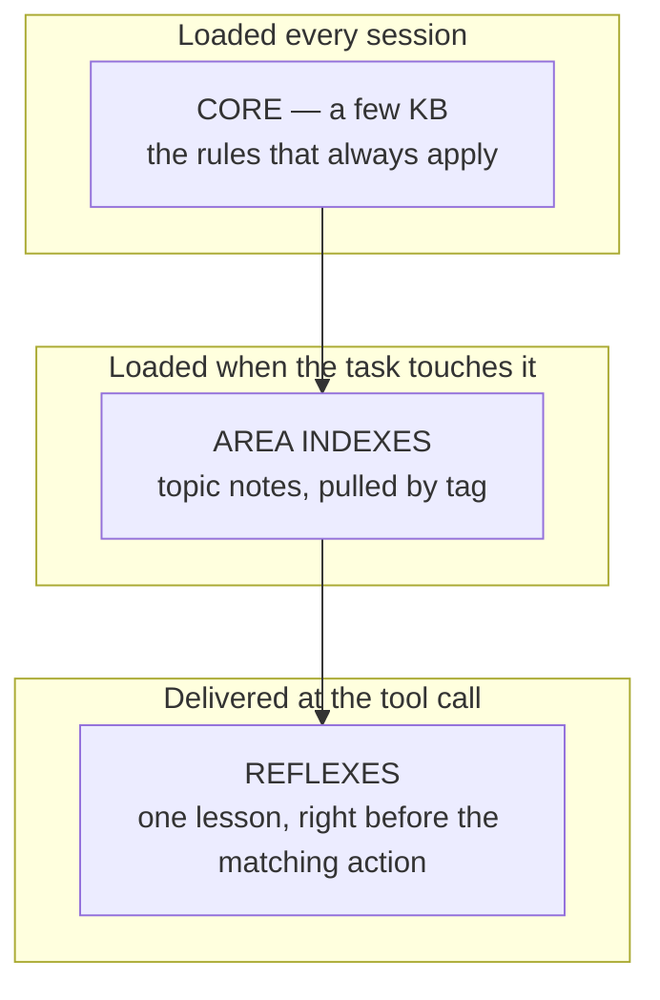

<p align="center">
  
</p>

<p align="center">
  
  
<!-- sma:passport:begin -->
  <a href="PASSPORT.md"></a>
<!-- sma:passport:end -->
  <a href="LICENSE"></a>
  
  
</p>

# SMA — Shared Memory & Automation

**SMA is a local-first memory and accountability control plane for AI coding agents: it delivers the right project knowledge at the exact moment of action — and independently verifies the agent's claims. Layered memory that arrives on time, multi-terminal coordination without a server, and every "done" settled by a script, re-derived by a blind verifier, and blocked from shipping when it is false.**

[Русская версия → README.ru.md](README.ru.md)

> ### 🗺️ [Open the live system map →](https://sma-framework.github.io/sma/master-graph.html)
> Every subsystem of SMA on one interactive page — the fastest way to see how everything connects.

> ### 🆕 [What's new — the taskboard, and numbers that do not lie →](#whats-new--the-taskboard-and-numbers-that-do-not-lie)
> Every unit of work stands in the column of the stage it is at and opens into its own view, and what waits on **you** has a column of its own; the conversation about it is one keystroke away — and the gate that lets work out measures the worker's own copy, reddening only on what the worker actually broke.

> ### 🧭 [Roadmap →](ROADMAP.md) · [по-русски](ROADMAP.ru.md)
> Where SMA is and what comes next: **V5 orchestration (a 24/7 worker fleet) — shipped → V5.1 works-with-what-you-have + the working front — shipped (v5.1.0) → V5.2 measured memory — shipped (v5.2.0) → V5.3 governance + hardened fleet — shipped (v5.3.0) → V5.4 the whole working day without the terminal — shipped (v5.4.0) → V5.5 the engine: steering a live session — shipped (v5.5.0) → V5.6 the taskboard and honest numbers — in the repository, current.** The whole release history, note by note, is in [docs/DETAILS.md](docs/DETAILS.md#the-v5-series-release-by-release).

> **This is not a memory plugin.** It is a working discipline for shipping real code with an AI agent: memory that arrives at the exact moment it is needed, coordination that stops two terminals from overwriting each other, and a **trust spine** in which every "done" is settled by a script, re-derived by a blind verifier, and blocks the next release if it is false. It writes only to a few folders next to your code — **your source tree is never touched** — and everything it knows or enforces is a plain file you can read, diff, and revert.

> ### 🤝 The promise
> 1. Every task you hand to SMA is done by a worker in its own copy of your project, is checked by a script rather than by anyone's word, and comes back to you with a receipt — what was promised, what was done, how it is proven — and rolls back with one command.
> 2. The worker works in exactly your environment: the same rules, hooks, memory, skills and permissions you have in your terminal — and each of its tasks leaves a lesson the system applies to the next one.
> 3. Not a single number and not a single "done" in SMA is invented: everything this README states is verified by a command you can run yourself.

---

## Install

### 1 · What you need first

| | |
|---|---|
| **Node 22.5 or newer** | Node is the program that runs SMA's scripts. Check what you have with `node -v`. If the number is lower, or the command is not found, install the current version from [nodejs.org](https://nodejs.org). |
| **git** | SMA keeps everything as ordinary text files in your repository, so your project should be a git repository (run `git init` in it if it is not one yet). |
| **Claude Code** | The AI coding agent SMA plugs into today. The `/sma-…` commands below are typed into a Claude Code session, the same way you talk to it normally. |

Nothing else. The core of SMA adds no packages to your project and needs no database, no server and no account. (An optional extra — the worker fleet described further down — does ask for more; you can ignore it entirely.)

### 2 · One command

Open a terminal, go to the top folder of **your own project**, and run:

```bash
npx -y sma-framework@latest init
```

That is the whole install. It takes a few seconds and prints every file it wrote. (`npx` is Node's built-in "fetch and run this once" tool; it leaves nothing behind afterwards.)

### 3 · What you have afterwards

New folders appear **next to** your code. Not one line of your own source is edited.

```text
your-project/
├─ src/, package.json…   ← YOUR CODE — untouched
│
├─ .claude/
│  ├─ skills/            ← the 14 /sma-… commands you can now type
│  ├─ agents/            ← the helpers those commands call on
│  ├─ sma-core/          ← the engine: the instructions behind each command
│  ├─ memory/            ← your project's notes — installed EMPTY, the notes stay yours
│  └─ settings.json      ← 8 hooks + the engine's statusline segment (your own entries are kept)
├─ scripts/sma/          ← the command-line tool the commands use underneath
├─ .sma/                 ← working state: who is editing what, and the log of checks
└─ CLAUDE.md             ← one short marked block is added; your own text is untouched
```

Those hooks are **eight entries across seven agent events**, and together they are the
whole of SMA's grip on a session. `SessionStart` — pick up what this window was doing.
`PreToolUse` twice: once on the editing tools `Edit`/`Write`/`Bash`, where the collision,
reflex and gate checks run as one process, and once on the tool that spawns a subagent
(matched under both names that tool has carried across agent versions, so an upgrade
cannot quietly unhook it), so the subagent starts already holding the project's claims
and open questions. `PostToolUse` on the same editing tools — the stall check.
`SessionEnd` — hand back the claims this window is holding. `PreCompact` — write a flight
capsule before the context is trimmed. `SubagentStop` — check what a finishing subagent
said it wrote against what is actually in the tree. `Stop` — at the boundary of every turn,
say which files have moved since you claimed the scope you are working in, and whether any
of them fell outside the area that claim declared. Every one of those command lines — and
the statusline segment with them — is **anchored to the project root** instead of to
whatever directory the session happens to be standing in, so changing directory mid-session
no longer takes the whole table down at once; re-running the installer over an older
install **heals** those lines in place rather than leaving a second copy of each hook
beside them.

Three things stated honestly, because a promise is worth less than a limit named out loud.
The turn verdict is a **comparison of two git trees and nothing else** — it never re-runs the
check commands recorded in your summaries. Those are strings that arrive as data, and running
them on a schedule instead of on your decision is not a thing a hook should do; that re-check
stays in the verb you type and in the acceptance ritual.
`SessionEnd` fires whenever the session ends — you close the window, you type `/clear`,
you log out — not only on a closed window. And the `PreCompact` capsule is written **when
your version of the agent announces that event**; on a version that does not, the command
simply exits without an error and nothing else changes. Your own entries in any of these
events are kept exactly as they are. What each hook does and the time budget it runs
under: [docs/DETAILS.md](docs/DETAILS.md).

The statusline gets one entry too, and it is installed **by default**: the engine's own
segment, a compact readout of what this window and the neighbouring ones are doing — the
attention pulse, the claim this window holds, today's collisions, how much of the
subscription window is used up, open gates, unscored predictions. If you already had a
statusline command of your own, it is kept verbatim and printed **first**; the segment
goes after it, and `/sma-deleteme` hands your line back byte-for-byte — or removes the
key entirely, if we were the ones who added it. The entry asks the agent to re-run it
once a minute, because repaints driven by events only ever reach the window where you
are typing; nothing would otherwise ask a quiet window to look again. The price of that
timer is named rather than hidden: once a minute, each open window spawns one short
process, and your own wrapped command with it.

A `.planning/` folder appears later, the first time you plan a piece of work.

Changed your mind? `/sma-update` re-runs this same installer to move to a newer version, and `/sma-deleteme` removes everything in one step — both keep your notes in `.claude/memory/` and everything else local. Install flags, the install-from-a-git-clone route, and the complete list of files: [docs/INSTALL.md](docs/INSTALL.md).

## First steps

### Start here

Open a Claude Code session in your project and type:

| Type this | What happens |
|---|---|
| `/sma-start` | A guided conversation, run once. It asks what your project is and how you ship it, writes the answers down, and starts your notes file. Everything you run later speaks in those terms. |
| `/sma-help` | The list of commands, one line each — your map when you forget a name. |
| `/sma-progress` | "Where are we?" — what is done, what comes next, and an offer to run it. |

### A normal working cycle

You work in **phases**: one chunk of work at a time — a feature, a fix, a rewrite. Four commands, always in this order:

1. `/sma-discuss-phase 1` — it asks you questions until the goal is unambiguous.
2. `/sma-plan-phase 1` — it writes the plan, including how the result will be checked.
3. `/sma-execute-phase 1` — it does the work and commits it, step by step.
4. `/sma-verify-work 1` — it walks the result through with you and re-runs the checks the plan promised.

Then repeat with `2`, `3`, and so on. For something small, skip all four: `/sma-quick` for a small task, `/sma-fast` for a one-liner.

### Where to look next

- [docs/INSTALL.md](docs/INSTALL.md) — install options, what lands where, updating and removing.
- [docs/DETAILS.md](docs/DETAILS.md) — the engineering deep dive, once you want to know how it works inside.
- `node scripts/sma/cli.mjs explain <name>` — run from your project root: a plain-language explanation of any SMA command.

## What's new — the taskboard, and numbers that do not lie

The window had a board of cards. This work turns it into the place the owner actually works from: **every unit of work stands in the column of the stage it is at, opens into its own view, and the conversation about it happens without leaving the screen** — and every figure beside it is either measured or admitted to be missing. There are six columns — discussion, planning, execution, verification, **waiting on you**, and done — a phase stands by its own stage, a task and a batch by their state, and the finished ones are folded into a counter so the working columns keep the screen. Names on the cards are small on purpose («17.7 Phone»); the full name lives on the page of the thing itself, which is what the card opens into.

The first cut of this screen read every unit as one line instead, and said so here. The owner accepted the column layout in its place on 25.08.2026; the reason the list existed — that a person comes to this screen to find what is stuck on **them** — did not go away, it got a column of its own.

**Three real kinds of work, not one thing wearing three labels.**

| | One line says |
|---|---|
| **A task** | the smallest unit — one order, one worker, one session. It closes when the session closes; nothing else has to be signed. |
| **A pack of tasks** | one sentence of yours spread over several items, worked one at a time by the same worker, and closed by a single assembly at the end. The line names which item is holding the assembly up. |
| **A phase** | the full cycle — discuss, plan, execute, verify — with gates between the stages. It does not call itself finished until verification and your acceptance are both behind it. |

A task is the bottom of the hierarchy and the way in is the same from everywhere: from inside a phase you reach it through a plan, from inside a pack through an item, and on its own it is simply a task with no parent. The trail at the top leads back exactly where you came from.

**A unit of work answers three questions, and the card is those three columns.** *What was promised* — the words of the order and the marks of success. *What was done* — what the attempt actually produced. *What proves it* — the receipt, not an adjective. Each column carries ✓ / ? / × only where the state is genuinely known; where the engine cannot answer, the cell says so in words. Under the columns: who was in the session — the worker first, its subagents beneath it, each with its model and how long it ran. To the right, three blocks: a **live flow** of the last three to five approach-level events (started, done, broke off, waiting on you) with their time and the colour of their state; the last event; and **what it cost** in six lines — subscription, tokens in and out, cache read and cache write, the paid channel. Below them, an explicit block for outside connections that is empty when there are none rather than absent.

**The card refreshes itself.** After Approve or Return — and on any other event about that task — the card re-reads its own state over the live channel the window already holds open: no manual page refresh, and no second connection to pay for it.

**What the work cost is added up where you read it.** The four numbers the provider states for an attempt — in, out, cache read, cache write — now travel with the task card and the attempt view, and are summed over a task from all of its approaches, over a phase and over a pack from the attempts of their tasks; an attempt whose receipt predates those counters contributes a zero rather than a guess, and where there is nothing to measure at all the figure is honestly absent instead of a cheerful nought. A pack also carries the moment its owner asked for it, which is not the same second as the one its rows were written in.

**The words of a task are derived by the system, not typed by you.** You write the formulation. Press once and SMA proposes the description and the marks of success the way a planner derives criteria from a goal — visible on the card, and yours to correct. Nothing is queued by the proposal itself; a draft is a draft until you confirm it. Setting up a pack works the same way: write the sentence, and the system proposes what it could be made of — matching entries from your backlog and new sub-tasks split out of the sentence — every candidate confirmable, removable, and never queued without your word.

**A worker that stops with a question is impossible to miss.** The stop shows up in two places at once — the **waiting on you** column, in amber, and the card itself — each carrying how long it has been waiting. The column says what is waiting and what there is to decide; the decision itself is taken on the card, which is what a click opens, because a decision made off one line of text is not a decision. You answer from the conversation window, and the worker **continues the same session**: the return does not start over, and the context you already paid for stays in its head.

**Talk to the system without leaving the screen — `Ctrl K`.** The conversation opens over whatever you are looking at and takes its context from it, so «what is the state of this?» means *this*. Three things can come out of it: a decision on a waiting question, which travels to the worker; an order, which becomes a task and appears in the list; or an answer about the current state. Search and actions moved to `Ctrl P`. Nothing is answered into the void: your message stands in the feed at once, marked «получено», a pulsing bubble holds the place of the reply and fills with the stage the turn is at («reading the context…», «writing the answer…») as the live channel reports it — and a conversation opened from a task card is given that card's state as data, so it says «I do not see that» instead of guessing.

**A whole echelon can be told to stand.** «Stop wave 2» — confirmed, then the tasks of that wave finish the move they are in and stop; nothing is torn mid-step. Unfinished steps stay in their sessions, and when you lift the hold they continue from exactly where they stood. The hold is written to disk, so it survives a restart of the daemon.
**You can cancel a task, and cancelling it is final.** The card carries a «Cancel task» button with a confirmation of its own; pressing it closes the row terminally — a cancelled task is not put back in the queue and is never handed to a worker again. If a live child was running under it, **the process is killed first** and the row is closed only once it is gone; the answer names which of the two actually happened rather than reporting a success it never observed. Work that is merely waiting after a lost attempt can be cancelled the same way, not only work that is running.

**A worker runs under a turn cap.** How many turns one attempt may take is a setting — `pipeline.maxTurns` — with a sensible default of eighty that applies even when the key is absent from the file entirely. Walking into the cap is written down as **its own kind of halt**, with the number of turns beside it, instead of dissolving into a general «the worker failed»: the card names the turn cap rather than an error. What is promised here is the mechanism and its default — that the number a person edits reaches the command line of the process actually started. What is not promised is a run in which a worker walked into the ceiling; that costs a paid attempt, and none was spent on it.

**An attempt leaves a continuation summary behind it.** At the end of every attempt the daemon writes a short handover beside that attempt’s own record: what the approach was, what came of it, which files moved, what the person said when sending the work back. It is assembled from what is already written down, so no model is asked anything and it costs nothing. It is capped at eight thousand characters, and a summary that had to be cut says so **inside its own text**, not in a field beside it — one file, so there is nothing for two readers to disagree about. When the task comes back, that text travels into the next attempt’s prompt as fenced data, and the very same file — word for word, not a second rendering of it — is what the window shows you on the card.

**A person’s return continues the session; a timer wake starts a fresh session.** The two ways an attempt can begin again are deliberately not the same thing. You sending work back with a remark continues the session you have already paid for, with the head it was in. A wake by time — the lease expired, the world moved on — starts a fresh session instead, because a picture of the world from the previous sitting is no longer a picture of the world.

**The liveness sweep kills the process; it does not merely mark the attempt dead.** Having decided an attempt is dead, the sweep stops that attempt’s child **before** the task is handed out again, and says out loud which of two things happened: it killed the process, or there was no handle left to kill because the daemon had been restarted since. A kill that did not happen is never claimed. A closed row used to be able to mean a live worker still burning your subscription behind your back; it cannot mean that any more.

**Every hand-out of a task carries its own attempt token.** The claim hands the worker the token of *that* attempt, and completion, failure and lease renewal all present it back. The point is exactly one: **a stale worker — one whose task has already been taken away and handed to somebody else — cannot close another attempt's work**. Attempts used to be closed by the task's name, so a worker still finishing up in the second its lease expired and the row went to a successor would certify somebody else's run with its own receipt — quietly, without a line in the log. Now the queue answers a foreign token with a named refusal. What is promised here is the mechanism and its refusal: it is run against real Postgres — the stale completion is rejected, the fresh attempt untouched — and taken with a live daemon on the failure seam. What is *not* promised is a run in which a stale worker survives to the end of a paid working cycle: that costs a paid attempt, and no attempt was spent on it. A row claimed before this release carries no token at all, and its absence reads as absence — never as licence to invent a value.

**A task waiting to be retried is as first-class as a task waiting for its first run.** The queue has two kinds of waiting: the ordinary one, and the one a task returns to after a broken attempt. Two doors only ever looked at the first, and it read as breakage out of nowhere: a returned task's words could not be edited, and cancelling a stopped batch walked straight past the items of it that were waiting to be retried — and walked past them silently, reporting «done». Both doors now reach a task in either kind of waiting, and a row the cancellation could not reach is named out loud instead of skipped.

**The attempt limit is one border across both queue stores.** The daemon has two: the durable one in Postgres, and the in-memory one it runs on without a database. The durable store always knew the border; the in-memory one handed a task out **forever** — the same work could go round and round until a person noticed. Now the border is one, under one name, for both: once it is spent the task **closes with a named reason** — «attempts exhausted», not «the worker erred», because those are different pieces of news and they ask different things of a person.

**Every task gets its own working copy.** The copy an attempt runs in is named after the **task**, not after the daemon. While the name came from the daemon, every task of one process laid claim to a single directory: a neighbouring task would quietly work inside somebody else's copy, and the moment a copy was orphaned every following attempt died before it ever started — showing up in the log as «runtime unavailable». Measured: one abandoned copy held the pipeline dead for nearly two hours. Now the copies of different tasks never claim one directory, an abandoned copy stalls only **its own** task, and a retry of the same task honestly reuses the environment already prepared. Run live: three copies of one daemon in three directories, all at once, without a single «already exists» refusal. What is left uncovered is said plainly: a copy that has lost its registration still needs clearing by hand — and until then it stops only its own task.

**A worker is handed the task's context — as a file in its own copy and as a data block in the prompt.** Everything a person knows about a task that its title does not say — where the data lives, who to ask for access, what must not be touched — is written in a field of its own when the task goes in, and corrected through the same door as the rest of the task's words. From there it reaches the worker along **two paths at once**: as `task_context.md` in the root of the working copy, where a person who opens that copy will find it too, and as a fenced data block in the prompt — as data, never as an instruction. Words over the ceiling are **refused** at the door rather than quietly trimmed: an instruction cut in half is more dangerous than a refusal. Handing a task back with corrected context rewrites the file in the copy instead of working from yesterday's words, and in the window every approach shows exactly what **it** went out with: context added after a failed attempt does not rewrite the history of that attempt. Run live in one lift: the task goes in → the file in the copy, checked against the queue row → the prompt, checked by digest → the hand-back with the correction → the panel in the window.

**The worker's working copy carries the platform's built-in skills.** Alongside the context, every attempt's copy receives short texts on what closes a claim of «done» (a receipt), how to leave a lesson behind, and what to do with a question nobody will answer mid-work. They arrive in the copy of **any** project — even one holding nothing but your code — and a skill of the same name belonging to the project always wins over ours: the user's rules outrank ours. The right to call a skill is granted in the worker's permission envelope, and that is checked on the arguments of the **real** spawned process, not on a table. What we do not promise, and say so plainly: that the model will use them. That the grant arrives is measured; that a worker actually opened a skill is visible only in the transcript of a paid attempt, and no attempt was spent on that.

**Work that is already built is not built again.** Before the daemon starts a worker it asks the already-built preflight — a millisecond, zero-token check — whether the thing has already been done: it reads **every plan of the task's phase** and compares each plan's own claims against the real tree. If every one of them answers built, the task closes on that check's receipt and no session is ever started; nothing is rebuilt for pay. One plan short and the door stays shut, deliberately: a false «not built» costs one extra run, while a false «already built» would close the task with the work never done, quietly, with «completed» standing in the ledger — so a door that exists to save work errs towards doing it. **The verdict is written to the daemon's log every time** — built, partially built, absent, and the verb's own failure alike. And the door is only asked where there is something deterministic to ask about: an ordinary order carries no phase and no plan behind it, its marks of success are prose, and a verdict may never be made to judge prose — so it is not asked at all, and *that* reason is on the record too. A door that is quietly never opened looks exactly like a door that is broken; one line naming the plan and the verdict turns a year of silence into a minute of reading.

**The gate that lets work out is differential, and it measures the worker's own copy.** A worker's changes used to be judged against a whole-repository run, so anything already red before the task started came back as the worker's fault — and the same run measured the tree the *daemon* stood in rather than the tree the work actually happened in. Both are fixed. The gate takes its two snapshots — before and after — **naming the worker's working copy in each**, and `reverify --tree` runs the checks against the tree it was told to measure while the accounting stays in one shared ledger. Only a divergence that is **new** is red. A pre-existing failure is reported as pre-existing, by name, so it can be dealt with as its own piece of work rather than blocking someone who did not cause it.

**Numbers that are measured, or absent — never invented.**

| | What it says now |
|---|---|
| **How long it has been waiting** | counted from the moment the work actually stopped, not from when the row was created — and a decision that has been waiting a minute is not called «stuck» |
| **How many attempts** | attempts, counted as attempts: three approaches written down as six journal lines are three, not six |
| **One task, one line** | every section of the list stands for the **last word** about a task, so a returned task appears once — under its own name, never as an identifier |
| **A merge receipt** | the tests run on the merged result BEFORE the merge is recorded: a red run means the merge did not happen, and the refusal names that as its cause. «Not run» stays an honest third answer — a tree with nothing in it to run — and it is not a green. **The same gate stands behind the `merge` verb you type in your own terminal** — one ritual and one test runner, whether the work is accepted from the window or by hand |
| **Which project a task belongs to** | a fact the task itself carries, written when it was queued — never inferred from the project you happen to be looking at. A row queued before tasks knew their project says **«project unknown»** in words and stays visible under every project, instead of being quietly attributed to the one on screen |
| **A worker's counts** | folded out of the attempt ledger over the last **30 days**, and the window names that period out loud. A ledger that could not be read says «no data»; a period that was read with nothing finished in it says «no finished attempts» — two different facts, and neither is printed as a confident zero |
| **Anything the engine cannot answer** | says «no data» in words. A zero that is wrong is worse than a blank, because it reads as an answer |

**A transcript that shortens a line says so, in the line.** The two frames a reader needs whole — what the session was started with and what it returned — are kept whole under their own, far larger ceiling; every other line keeps the ordinary one. When a cut really happens the row carries the mark and the original length beside the text, so a clipped line can be told apart from a line that simply ended there. The silence was the bug: a shortened line and a short line used to look identical.

**A log that repeats itself is a log nobody reads.** A task that has been sitting too long is now said once, when it crosses the threshold, and once a day after that, instead of on every tick of the engine — and every line carries its timestamp. What that leaves behind was measured rather than estimated: over one fixed idle window the aging lines went from 119 to 1, which recalculates to roughly 5.6 KB a day for a single stalled task instead of roughly 650 KB. That figure is the **recalculation of a fixed window taken on a bench around the engine's tick** — not a day-long measurement of a live daemon.

**The rules you already apply are proposed back to you, with their denominators.** `sma approvals suggest` folds your own history of accepting work and sending it back into standing acceptance rules — deterministically, with no model asked anything, so the same history always yields the same proposal. Every reason carries the denominator it rests on, and a class with too little history is refused a rule out loud rather than given one inferred from three cases. The verb proposes and writes nothing: switching a rule on stays a separate, explicit step of yours, and **the mechanism for switching one on was deliberately not built** — the proposal is the whole of what shipped.

**The numbers this documentation uses about SMA itself are held by the suite.** How many doors the daemon's web front serves, how many verbs the CLI dispatches, how many tests and files the last measured run counted, which version the package stands at — each is read from the code or the receipt that owns it, and a document that disagrees turns `npm test` red. Check it yourself with `node scripts/sma/cli.mjs doc-audit --target numbers`; the same verb with `--write` rewrites the derived places from the code, so no number here is ever typed by a hand. The tests badge at the top is written by `scripts/sma/lib/badge.mjs` from the JSON report of an actual run, never edited.

**The promise is exactly this wide, and no wider.** The gate holds two things: a number in the docs cannot disagree with the code, and the badge cannot disagree with the last measured run receipt. It does not hold the third — whether that receipt is still fresh — because a test run cannot measure itself without running itself again; freshness is checked at the release gate. So this page promises numbers that match the code and a badge that matches the last measurement, not a badge re-measured on every reading.

And it holds a number only where somebody wrote down the place that names it. That is not a detail: the verb count was watched in exactly one file — the one that was wrong the day the rule was written — while three other shipped documents named the same number with no lock at all. The first time the count moved they stayed behind and the gate printed zero, because a check that merely agrees with today, with nothing pinned, is a snapshot rather than a gate. Every place that names the verb count is watched now, each divergence naming its own file, and a place that stops naming the number is its own violation instead of a silent pass — but the general shape of the flaw survives the fix: a number in a place nobody listed is a number nobody is holding.

**What is held by a run, and what is held only by tests.** The rows above about a task's project, and the worker counts over 30 days, were driven live in a browser against an isolated daemon and their screenshots are in the receipts. The truncation mark is held by tests only: the isolated home had no live attempt to open a card against, so nothing in this work pressed that mark on a screen. The aging figure is a bench recalculation, as its own paragraph says. Where a claim rests on a test rather than on a run, that is the claim being made — not a smaller version of a run.

**Accepting the work happens in the right tree, and a refusal says why.** The approve door merges in the tree that actually holds the branch — the connected project's, not the daemon's — and when it refuses, it names the reason in words and the card shows that reason instead of a dead button.

**«What would I be rolling back, and with which command?» — both answers are on the card.** Every attempt's record carries the **list of files it changed**, read from git rather than from watching tools, so a change made with a shell command is in it; **what VANISHED is a separate line**, because «modified» read where «deleted» was true sends a person looking for a file that is not there. Beside them stands **one command, whole and ready to copy**: accepted work is undone by reverting its merge commit, and work that was never accepted is undone by removing the copy it was done in — the main tree was never touched by it. Both commands were run, on both stories, not asserted.

**«Done» and «done, but nobody re-checked» are now different words.** A gate that opened without a receipt says so on the card, with the reason in words and the numbers it decided on, and it is marked as waiting for a person rather than with a tick.

**The full merge commit name applies going FORWARD.** Work accepted from this release on has all forty characters of it in the record; acceptances older than this release kept the seven they were written with, and that record is an audit log — it is not rewritten to look tidier. The card shows the short one for them, and says out loud that the record is older.

### Everything before it

The V5 line shipped as a release every few days. In one breath: V5 built the fleet and its engine; V5.1 put the window in front of it; V5.2 made the memory layer measurable; V5.3 made it governable and gave the fleet a state machine its running code consults; V5.4 turned the window into a place you can work from all day, and taught the system that **an answer is also work**; V5.5 built the wheel — steering a live session, with a correction written to disk before anything is killed. Each of those releases, with its fix list and what it deliberately did not claim, is in [docs/DETAILS.md](docs/DETAILS.md#the-v5-series-release-by-release).

**What this does not claim.** This release lives in the repository (tag v5.6.1); the npm listing is deliberately behind while the engine settles — installing from npm today gives you the last published version, not this page.

## The window — the app the daemon serves

V5 shipped the engine and a deliberately thin operations panel. The releases after it built the app on top: **two dozen screens**, compiled once and served by the daemon itself, behind the same token and the same frozen route table. No second web server appears, no extra port is opened, nothing new listens.

The app arrives already compiled: the npm package carries the built front in `daemon/static/app`, so there is nothing to build before you can open it. The daemon's own dependencies ride inside the package the same way — nineteen packages, about 6 MB, vendored in `daemon/node_modules` — so there is no second `npm install` for it either; the full list, with the licence each one carries, is in [THIRD-PARTY-LICENSES.md](THIRD-PARTY-LICENSES.md). From a git clone, `cd spa && npm run build` rebuilds it into that same folder. The daemon needs no further wiring, and the panel it already served stays exactly where it was, as the emergency view. A clean boot says so out loud — one line, *«Buckle up, soldier — the park is live»*, naming the exact address to open; failure was always loud, and success no longer whispers.

### The whole working day, without the terminal

The screens behind the daemon became a place you can actually work from. The route table that
carries them is **declared once and frozen** — its size is a test, and it grows only by an
explicit, recorded revision, so the surface cannot quietly turn into remote command execution.
Every door in it is live: there is no «coming soon» handler left in the table.

- **The phase cycle, run from the app.** An index of every phase with «N open / M answered», a
  card per phase with its four stages and a button on each, plans and summaries opened in place,
  and the acceptance list answered line by line. A phase is named the way *you*
  named it in the roadmap, not by its directory. The phase's own **folder** is on that card too —
  its directory as a tree, any file in it previewed read-only and never reaching outside
  that directory. Markdown and HTML are shown **rendered, inside a sealed frame**: an `iframe`
  with an EMPTY `sandbox` — no scripts, no origin of its own, and a policy that closes the
  network, so nothing in somebody else's file runs or phones home. Markdown is converted by
  this project's own hundred-line converter, no dependency; a link that is not `http`/`https`
  stays text. The raw view is always one click away, and for every other kind of file it is
  the only view.
- **A parked question is answered on a card.** When a stage stops to ask, the question arrives in
  the window in exactly the shape the engine parked it — a variant or your own words, one of the
  two, and the form says which to remove rather than silently dropping one.
- **The live attempt log.** A worker's output streams into the screen *while it is still talking*,
  including the text of its subagents — so a session that delegates does not go silent behind a
  spinner for minutes.
- **The memory workbench.** Drafts are reviewed and applied one at a time, each with its own
  preview and its own yes; the lint report, the index rebuild and the corpus doors are all in the
  window. Nothing is written to your corpus without a per-file confirmation.
- **Coordination and backlog.** Who is holding what, which claims collide, and the backlog with a
  «promote to a task» door — the same state the terminal reads, in one place.
- **The ship card — and it never pushes.** It runs the gate, records the run, and marks the
  result. **The publish itself stays a human action**, by construction: there is no path from the
  daemon to `origin`, and this card does not invent one.
- **Search across everything, and Ctrl+K.** One search over tasks, phases, memory and backlog with
  a visibility filter, and a command palette. The palette **opens the thing that acts** rather than
  acting itself — a keystroke is not consent.
- **Several accounts, secrets staying local.** Accounts are added from the window; the value of a
  token never travels through it, only the NAME of the variable it lives in. Each worker session
  is assembled with one account's credentials and no other's.
- **On a phone: a narrow strip with a named composition, not a shrunken desk.** At phone width the
  window carries exactly four things — what is waiting for you, the list of tasks, the task card,
  and the approve button. Approving goes through **the same door and the same gate as on the
  desk**: there is no faster path to a yes because you happen to be holding a phone. The 248-px
  side column does not squeeze; it gives way to a top bar with a **Menu** curtain that lists the
  same screens, in the same order, from the same registry. Everything else does NOT fold itself
  into a mush: each screen made for a wide desk says so plainly on a phone and points at the
  computer — a decision, stated, rather than a layout that broke. Walked live at 375 px from the
  task through to the approval, with the sideways-scroll measurement on that width in the receipt.

### The wheel: a word for a session that is already running

A running task is not a locked box. The sentence you type at a busy task has **three fates**, and
the third one kills nobody.

- **Say it now — the word reaches the turn mid-run.** The gate that already stands in front of
  every tool call a worker makes hands your sentence over at the next such call, inside the same
  turn. Nothing is killed, nothing restarts, and the session keeps everything it was holding in
  its head. Measured on a live run of the real CLI, not read off a design: the word entered the
  turn forty frames before that turn's final answer, the model quoted it back verbatim, all 98
  frames of the attempt carried **one** session identifier, and the attempt spawned **one**
  process from beginning to end.
- **And the boundary of that channel is stated rather than hidden.** Delivery happens at a
  tool-call boundary and nowhere else. A turn that will make no further tool calls does not see
  the word before it ends — measured the same way: in a live probe the word was stored right
  after the last tool call, the turn finished saying no correction had arrived, and the line
  stayed **waiting** instead of being consumed. It is not lost: a waiting correction rides the
  task's next run into the same session. The window says both halves of this before you press
  anything, because the useful half alone would be an advertisement.
- **Interrupt now** — the live child is told to die, and your correction is written to disk
  *first*, so a restart cannot lose it; the continuation comes back into the same session with it.
- **After the turn** — the word waits and is delivered on the way out. Neither of these two
  changed in name or in behaviour; the third fate was added beside them.
- **Where an executor has no such channel, the door says so instead of quietly killing.** Not
  every CLI runs our gate inside its own process. Asking for the mid-run word on one that does
  not is refused **in words**, naming the two shapes that do reach it — and that refusal now
  reaches your eyes rather than dying in the browser: the same door does honest work as «kill and
  continue», and it is labelled that way. Dressing a kill up as a mid-run word would be a forgery.
- **The worker may ask, and the answer continues the same session.** A dangerous call parks
  itself and waits for a person rather than being refused; a judgment the task did not settle is
  **returned as a question** instead of guessed; your reply resumes the session that asked it, so
  nothing is re-read and nothing is paid for twice. The brief the worker receives says all three
  out loud — a mechanism its user does not know about does not exist for them.
- **What you typed does not vanish.** A half-written correction, chat message or console line
  survives leaving the screen and survives a page reload — walked live in a browser: typed,
  navigated away, came back, reloaded, still there.

### Opening the window — what a first run actually needs

The app belongs to the **optional** V5 layer, and that layer asks for two things the memory and coordination core never does: a process that stays up, and somewhere durable to keep the work. Nothing below is needed to use SMA's memory, coordination or accountability — skip the whole section and everything else still works.

**1 · A local PostgreSQL for the queue.** The daemon keeps its task queue in Postgres (pg-boss), in a database of its own — never your application's production database, and never exposed to the internet. There are two honest roads and the product does not pretend there is a third: point `queueUrl` at **a server you already run** (SMA neither installs PostgreSQL nor manages yours), or start **the bundled sandbox**, for a machine with no PostgreSQL, no docker and no administrator rights:

```bash
node supervisor/pg-sandbox-windows.mjs start
```

It waits until a real session answers instead of trusting an open socket, creates the queue's database if it is missing, and says so and exits 0 when everything is already up. The whole road — including the one-time step that creates the sandbox directory — is in [docs/INSTALL.md](docs/INSTALL.md).

**A task can be named in any language.** If the queue database was created in a non-UTF-8 encoding (the Windows `initdb` default), SMA says so at boot — naming the database, what will happen to a non-ASCII title, and the command that repairs it — and refuses such a title with that same sentence instead of an "internal error". `node supervisor/queue-utf8-migrate.mjs` reports; `--apply` builds a UTF-8 database, carries the waiting tasks and the attempt rows over, and keeps the old database under a new name. The whole procedure, and what deliberately does not travel, is in [supervisor/setup-windows.md](supervisor/setup-windows.md).

**2 · Start the daemon**, from the SMA checkout or the installed package directory:

```bash
node daemon/src/main.mjs
```

The first boot writes `~/.sma-daemon/config.json` — machine-local settings, never committed, carrying a freshly generated front token — and then prints the address it listens on (`127.0.0.1:7777` by default). If the queue is unreachable the boot fails loudly and the process exits: set `queueUrl` in that file to your own server (`postgres://localhost:5432/sma_daemon` is the default) and start it again.

**3 · Open the app once with the token:**

```
http://127.0.0.1:7777/?token=<the token in ~/.sma-daemon/config.json>
```

That single visit exchanges the token for an HttpOnly session cookie and every later visit is a plain address. Until it happens the daemon answers `unauthorized` and nothing else — there is no login page to guess at, deliberately. Read the token out of the config file; it is never printed to the log.

**Always-on wiring** — a launchd job on macOS, a Scheduled Task on Windows — is written up in the [supervisor/](supervisor/) checklists, together with the smoke run that proves the loop end to end before you leave it running overnight.

**Your day, not a dashboard.** *Today* opens on what the fleet did overnight and what is waiting on you; the board holds every task; the team screen shows each worker with its lane and its window; the live stream is the work as it happens; costs read straight from the spend book, per day, per lane and per account. Those lines are WORKERS' attempts: your own window — the terminal session you are typing in — runs on a subscription, and its tokens can be counted, but a subscription has **no price in money** by design, so the book never invents a dollar figure for it. The app is built for a desktop screen (1440 px and up) — the phone still waits for its own design pass, and every release so far has shipped without it rather than pretending otherwise.

**Every task card answers WHY.** The decision journal rides the same attempt ledger the receipts do, in three layers: the dispatcher's own reasons (why this lane, this worker, this window — structured codes from a closed vocabulary, never free text), the worker's mandatory approach note (what it chose, what it rejected, which rules and memories shaped it), and the memory trace — what the session actually did, not what its role file claimed: whether it opened the memory index, which notes it read, how many times it called the loader, which reflexes fired and from which source that is known, what it read out of the account's own notebook (counted apart from the project's corpus, because the two are not the same memory), what lesson it left behind and whether it left an approach note. That layer is written for **every** attempt, a failed one included. An attempt without its note is as incomplete as one without its receipt — and so is an attempt without a lesson.

**A conversation with tied hands.** The chat screen carries one caption and it is literal: *«Reads and suggests. Runs nothing itself.»* Factual questions — why a run failed, what is eating the window, where a task stands — are answered by deterministic read models with no model call at all: instant and free. Only open questions and task drafts reach a model, on a short lane outside the task queue, and a draft still passes the same readiness gate and the same approval door as any other task. The route table gains no execution surface for it.

**Bring the agents you already have.** The import door reads the estate already sitting in your repository — `.claude/agents`, `.claude/skills`, your rules file — and enrolls it through the same door the Creator uses: a draft, a lint receipt, an approval queue. The wizard shows what it found, what collides with a name already taken, and exactly what will be written. Imported definitions are third-party text, so nothing is ever enabled by the import itself; activation stays two explicit human steps.

**A first run without the terminal.** Once the daemon is up (see above) the app opens on a four-step interview — your project, your infrastructure, the estate it can see, and your first lessons. It writes exactly the artifacts `/sma-start` writes, through the same writer, so the two doors are provably one door. The terminal path stays for whoever prefers it, and it needs no daemon at all. **And it can wait.** «Позже» closes the interview having written nothing into your project; the answer is kept on the daemon's side, so the window stops asking and the door stays open for whenever you want it.

**Terminal parity, proven rather than asserted.** A worker session has to be able to do what your own terminal session does — and that claim is worth nothing while it is merely asserted, so parity here is a property of the ground the worker stands on and it is proven by artifacts. Every attempt leaves a small run directory in the connected project, `.sma/runs/<attemptId>/`, and one command reads it: `node tools/terminal-parity-check.mjs [--attempt <id>] [--project <dir>]` — with no identifier at all it takes the latest attempt. It prints five receipts, and each of them is written to say what it proves *and what it does not*. **Hooks** — a guard answered inside that run's own time window; that something was watching, not that it refused the right thing, and a hook that started and never replied is written down as a failure rather than rounded up. **Memory** — the corpus was actually read: the index came back or the loader was called; that the notes reached the session, not that the session used them. **Rules** — your project's instruction file reached the working copy; that the copy has it, not that anyone opened it. **Skills** — the copy carries your skills and agents, or an honest `n/a` naming the reason on a project that has neither, because «not applicable» and «passed» are different words on purpose. **Rights** — **both** halves of the capability envelope reached the process: the tools it granted equal the allow list on the command line, and the actions it reserves for a human — push, merge, tag, deploy — equal the refusal list on the same command line. This receipt could not be green for the whole life of this product, and the yellow was honest: only the grant travelled, and the four human-only actions were computed, hashed and written to the journal without ever reaching the session, so «the worker cannot push» was a property of the prompt and of nothing else. It is green now because the refusal is an argument the spawn carries, measured landing in a live session's denial list. An envelope that names human-only actions while the spawn carries no refusal list is a **failure** here, not a warning — that is exactly the state the yellow used to describe. Missing data is a failure that names the missing file — never a default pass, because the cheapest route to five out of five is to check nothing. The command exits 0 only at five out of five, and the last line of its output is the bare count, so it is scorable; `--json` prints the same verdict as an object. The daemon computes the same five with the same module and writes them onto the attempt, so the task card shows the score and the path without anybody running a command first. **And a refused call is now named by its command rather than counted.** The vendor hands back the full list of calls its permission boundary turned down — the tool, the id of the call, the arguments — and this product used to keep only the length of that list, so a person could read «refusals: 1» and never learn what the worker was stopped from doing. Each refusal is now a line in the attempt's own journal carrying the tool and the command, capped in length with the cut marked, scrubbed of secrets like every other line, and bounded per attempt by one closing line that says how many were left out — silent loss is not one of the options. The count is kept beside the list, never instead of it: our own tally and the vendor's are two measurements, and the day they disagree is a finding. The directory is local evidence and **not for git**; the project keeps the newest 200 attempts and names in the log every one it sweeps. Receipt by receipt, with the boundary of each: [docs/DETAILS.md](docs/DETAILS.md#terminal-parity-receipt-by-receipt).

**The worker's copy carries your project's whole layer.** A worker never edits the tree you are working in: it gets its own copy on its own branch, cut from a known commit. The actions this product reserves for a person — push, merge, tag, deploy — are refused to the worker by an argument its session is started with, so the refusal is in force inside the process rather than in the wording of a prompt; the list catches the obvious spellings of each, which is why it is one of three locks and never the only one. **The second lock takes the push address away from the copy — where, and only where, you have already switched on git's per-worktree config extension yourself.** Written the naive way, that address lands in the config your MAIN checkout reads and takes push away from *you*: measured, not feared. The only thing that isolates it is that extension, and switching it on changes how settings your repository already has are read — so this product **never** switches it on for you, in your repository or anywhere else. Where it is off, the copy is handed over without the lock, your repository is left byte for byte as it was, and the attempt's record says so in words; the boundary is then held by the refusal above, which is the lock that actually stands in the path. Where it is on, the write goes into the copy's own config and the shared one is re-read immediately: had the address leaked through, it is taken back on both sides and the copy is handed over unlocked rather than left «probably fine». None of the three locks is a proof of impossibility — a worker holding a shell can unset an address — and this product does not sell any of them as one. That copy is not a bare checkout — it brings the layer your project deliberately keeps outside git (`.claude/`, `CLAUDE.md`, `.claude/settings.local.json` by default), so the rules, hooks and lessons the worker was taught are in the room with it. Name your own list in `.sma/worktree-include` — a small JSON `{"copy": […], "link": […]}` at the root of your main tree. Dependencies are **linked, not installed**: a junction on Windows, a directory symlink elsewhere, pointing at the `node_modules` you already have — no package manager runs in the copy, so a run starts in seconds rather than minutes. Secrets never travel: `.env*`, `*.pem`, `*.key` and `.secrets*` are refused even when the manifest names them, and every refusal is reported rather than silent. When you approve the work, the copy and its branch are removed for you. What was copied, what was linked, what was skipped, when the copy was removed and by whom is written onto the attempt and shown on the task card — so «this can be rolled back» is a record you can read, not a promise.

**A dangerous call is parked rather than refused — and the session waits on it.** Not everything a worker asks for is either fine or forbidden. Some calls are ordinary work most days and a bad idea on this one: publishing to a remote, reconfiguring one, merging, tagging, releasing a package, deleting a directory outright, running something downloaded straight into a shell. Those are classified by a threshold written for a WORKER, kept deliberately apart from the one your own terminal uses — a person publishing his own work is doing his job, and the same command from an unattended session is the one nobody would see until afterwards. The classifier refuses nothing by itself; the hard boundary stays the refusal list above, and whatever the classifier does not recognise goes through, because a machine that parks every unlisted command is a machine that cannot work.

What it does instead is STOP the call. A ticket is written into that attempt's own directory, and the session stands on that call — not crashed, not skipped, not restarted. The card shows «ждут вас» with the command in full, and one button continues **the same session, the same call**, with the whole context you have already paid for. **The wait is declared, not endless:** the ticket carries a deadline, and when it passes the call is REFUSED — by the hook itself, in words the worker can act on. That last part is the whole design: measured on a live run, a hook that outlives the timeout it declared is cancelled by the harness and the call *goes through*, so «fail closed» here is not a switch anybody can turn on — it is built, as a deadline strictly smaller than the declared one, with the inequality checked every time the hook starts. And approving one command opens no other: the ticket's identity carries a fingerprint of the call's arguments, so the same command with different arguments arrives as a new ticket and stops again. The gate travels with the worker's ACCOUNT rather than with a project, so it is in force wherever that worker runs; on a session that is not one of ours — another window, somebody's production worker — it finds no attempt directory, answers «allow», and says out loud that it is not configured, because a guard installed in a file shared by the whole machine must never refuse work it was not asked about. **And a ticket nobody is waiting on any more stops saying «ждут вас».** The three ways a ticket closes — approved, refused, its own deadline — are all written by the hook's own process, so a session that is killed leaves its ticket waiting for ever and the card goes on asking you to approve a call that no longer exists. Both ends of that are now closed: the deadline the ticket already carries is read when the card asks (the reader stops ignoring a fact the writer wrote down), and the end of an attempt marks whatever is still waiting in its directory as closed along with it, in words. **And the card says in advance when approving will not open the call at all.** Part of what a worker asks for is stopped not by the classifier but by the refusal that travelled in the launch arguments of its copy — the one it cannot reach, edit or argue with. Pressing approve on such a call has always produced a refusal a second later: correct behaviour, never said out loud. The card now compares the ticket's own class against what ACTUALLY travelled into that attempt's process and, where the two meet, says so before the press — this one has a wall behind it, and only a person can do it by hand. The button is not taken away: the wall is named and the choice stays yours. Where the answer is «not known» nothing is said at all, because a false reassurance is worse than silence, and a false warning would cost the real one its meaning.

**Every WORKER attempt leaves a line in the spend book — including the one whose process was killed.** Money spent that leaves no trace is the worst kind of missing record: a line that is absent reads as «that attempt cost nothing», and it is precisely the attempt that burned a window and produced nothing to show for it. So the book is written for every attempt, before any gate decides its fate — and when the session's stream ends without a final frame (a killed process, a cut provider) the line is a time-based ESTIMATE, labelled as one. A coarse estimate called an estimate is a record; the same figure called a measurement would be a lie, so the label is not optional and no caller may overwrite it. Each line names the ATTEMPT and not only the task, which is what turns «did every attempt of mine leave a line» from an argument into a question you can run — forwards only: lines written before this shipped name the task alone, and the book is an audit record, so they were not rewritten to look as if they had always known. Your own terminal window leaves no line of its own here, for the reason given above: it is on a subscription, so there is a token count but nothing priced to write down.

**The worker leaves a lesson with every task — or says why not.** The copy carries your lessons in; the flywheel only turns if something comes back out. So the last step of a run is a lesson: the worker writes one note into the memory corpus of its own copy through `sma memory write` — the same twelve-step pipeline your own terminal uses, never a file dropped past it — and closes with `LESSON_WRITTEN: <path>`. If there is genuinely nothing to teach it says `LESSON_NONE: <reason>` instead, in its own words; «no» without a reason is not an answer and is refused. Neither of the two, and the attempt is not complete: it fails as `no_lesson`, exactly the way an attempt without a receipt fails, and the card says so in words rather than in a code. The note is a **draft** until you accept it — the pipeline stages it, nothing enters the corpus behind your back — and it passes your approval together with the code. On «Одобрить» the drafts are applied into the project's corpus and the index is rebuilt. On a project that keeps `.claude/` under git the merge brings the note itself; on a project that keeps it outside git — this product's own corpus is one — the daemon carries the drafts out of the copy before the copy is removed, and if it cannot, the copy is not removed at all: a lesson that exists in one place only is not something to sweep. The approach note travels the same road: it becomes a draft of the project's memory instead of a line that dies in the journal. Parked work owes no lesson — a round cut short by a question to you never reached the step — and neither does the Creator's own lane, which drafts definitions rather than doing the work. What the pipeline refused is named with its reason on the card, because the fate of a lesson is something you read, not something you infer from a missing file.

**The worker's account mirrors your personal layer — with named limits.** A copy of your project is not the same thing as your own working profile, and until the account carries that too, «the same session you get» is a claim nobody can check. Before **every** spawn — not once at setup — the daemon writes your personal layer into the worker's own config directory: your global `CLAUDE.md`, your `hooks`, and the two permission lists that can only ever narrow what a session may do, `permissions.deny` and `permissions.ask`. What does **not** travel is named just as plainly. `allow` and `defaultMode` stay behind: `defaultMode: "auto"` in a user-scope settings file would put a headless worker session into auto mode and widen its rights past the envelope this product hands it, and an `allow` list would do the same one rule at a time — widening a worker's rights is a decision somebody makes on purpose, never a side effect of mirroring. **And that sentence is now a check rather than a promise:** one reading command, `node tools/rules-parity-check.mjs`, opens both live files — yours and the worker account's — and answers with an exit code. The narrowing lists have to match rule for rule; the widening ones have to be declared not-mirrored and absent from the worker; a difference nobody declared fails just as loudly as a difference nobody intended, because «we never carried it» and «we forgot it» look identical from the outside. Every divergence is printed by its own text, and the command writes to neither file — it holds no write path at all. Your own plugins stay behind too, because a plugin is installed into an account and the worker's account is not yours: name the ones it should carry in `workers[].plugins` in `config.json` and install them into that account yourself — the product never runs an install on your behalf. `model`, `env` and `statusLine` are left alone as well: the model and the environment of a run come from the worker profile the daemon already owns. Hosted claude.ai connectors are switched **off** for the worker by `disableClaudeAiConnectors: true` (Claude Code 2.1.182 or later), so no connector of your subscription attaches itself to a session you are paying for; the servers you chose travel explicitly on `--mcp-config`, from your own registry, switched on by you on «Подключения». **And one door this product cannot shut is named rather than papered over:** an MCP server declared in the root of the connected project is loaded into the worker's session anyway — measured, with a clean account directory and our own server list passed explicitly, and none of the account settings that read as though they would prevent it does. So the product does not claim that list is closed; it writes down what came through. Every attempt's record carries the MCP tools the session actually loaded that did **not** come from your registry, so a capability you never chose is something you read rather than something nobody noticed. Auto-memory is kept per repository rather than per copy — every copy of one project shares one auto-memory directory, so a lesson written down in one attempt is there in the next. The account's previous settings file is backed up before it is overwritten. And all of it — the fingerprint of the instructions file that travelled, how many hooks, how many narrowing rules, which plugins, the connectors switch, the auto-memory path, and what the session actually loaded when it started — is written onto the attempt and shown on the task card, because a layer nobody can see is a layer nobody can notice is wrong.

### Several machines, several projects — one window

A project is a first-class dimension now, not a separate install: one daemon runs the tasks of all your repositories, each task carries its project, and the app filters by it. Existing tasks are adopted into a project on first start — nothing to migrate by hand. Connecting one is a form rather than a hand-made HTTP request: on «Машины и проекты» you name the project's folder, press «Подключить», and the daemon reads it from there. An entry with no folder behind it is labelled «не подключён» instead of being shown as though it were live.

Across machines, daemons federate. You nominate one daemon as the **hub** and introduce its peers from the app: the hub mints a single-use invitation, you carry it to the second machine, and from then on the hub aggregates state — presence per machine, costs and windows per machine, every project in one window. Actions are not re-played by the hub: an approval or a new task issued from the hub travels to the owning machine as the same already-authorised call, through every door it would have passed locally. A peer opened directly still shows its own machine, with a quiet banner when the hub is unreachable — there is no single point of failure.

The network between your machines is **yours, not ours**: a private mesh (WireGuard, Tailscale, or a self-hosted coordinator). **The daemon never asks to be exposed to the public internet**, and no vendor cloud appears anywhere in this design.

### What the machine needs — measured, not guessed

The core of SMA needs nothing: it is plain files next to your code. The **fleet** is what asks for a
machine, so here is what each part of it actually costs, measured on a reference Windows host
(12 logical processors, 13 GB) running this repository's own suite and real worker sessions:

| | Measured |
|---|---|
| The daemon itself | **22 MB** |
| PostgreSQL (the queue) | **~30 MB** idle |
| One worker session | **~310 MB** average, ~380 MB at its peak |
| One full parallel test run | **~1 GB** peak, and it takes *cores − 1* workers |

Those four numbers are the whole model. A machine running **W** windows at once, with **T** test
runs happening at the same time, wants roughly `W × 0.4 GB + T × 1 GB` of working set, plus your
operating system, plus as much again for the file cache — and the cache is not optional comfort: it
is what keeps `git` fast when every worker has its own worktree of a thousand-file checkout.

**Worked example — three projects, three windows each (nine sessions):** about 3.6 GB of sessions,
two suites running at once ≈ 2 GB, daemon and queue ≈ 0.5 GB. Call it **6 GB of working set**, and
then leave room for the OS and the cache:

- **RAM — 16 GB is the floor, 32 GB is where it stops being tight.** Prefer a machine whose memory
  you can add to later over one where it is soldered.
- **CPU — 8 cores / 16 threads minimum.** The heaviest thing this fleet ever does is your own test
  suite, run in parallel, several times a day; two suites at once will use every thread you have.
- **Disk — an NVMe SSD, 1 TB works and 2 TB is comfortable.** Size is not the interesting number:
  **write endurance is**. Provisioning and removing worktrees is a constant stream of small-file
  writes, so prefer a drive with DRAM cache and a TBW rating you can look up.
- **No GPU.** The model runs on the provider's side; nothing here is local inference. A machine sold
  on its graphics is money spent on a capability this fleet never uses.

Two honest caveats. These are measurements from **one** machine and **one** codebase — the variable
that moves them most is your own test suite, so measure yours before buying for it. And a session
that mostly waits on the network costs far less than one that is running your build; the 310 MB
average above is real work, not idling.

## Before SMA → After SMA

The whole point of SMA is the second column. Same agent, same model — a different discipline around it.

| | **Without SMA** | **With SMA** |
|---|---|---|
| **1 · A rule is dropped** | Your instructions say "every schema change needs a migration." Twenty edits later the agent adds a column and forgets. It ships; queries break on deploy. | The moment the agent touches the schema file, a reflex fires **into that tool call**: *"schema change → migration required (last time this broke prod)."* It cannot be skimmed past. |
| **2 · "Done" that isn't** | *"All tests pass, feature complete."* You pull, run them, three are red. The confident summary was the only evidence, and it was wrong. | The plan pre-registered a check. At close, a **script** re-runs it on a fresh clone and writes `hit` or `miss` to the ledger. "Done" is a re-runnable command, not a sentence — and a blind verifier re-derives it without ever reading the agent's report. |
| **3 · A lesson re-learned** | The same build flag bites you a third month running. Each fix lived only in one closed chat; nothing carried it forward. | The first burn was written as a note with a trigger. Every later session — and every teammate's clone — gets the warning **before** repeating it. One burn, permanent avoidance. |
| **4 · Two terminals collide** | Terminal B edits `src/api` while Terminal A is mid-refactor there. B's push silently reverts an hour of A's work; nobody notices until CI. | B registered a session and A had **claimed** `src/api`. When B goes to edit, it is warned *before* the keystroke — and both drew their migration numbers from one queue, so they never clash. |
| **5 · A false "done" ships** | The report said the feature works. It didn't; the regression reaches `main` and the next release carries it. | A class-A divergence — the heaviest signal in the system: a claimed pass that the blind verifier reproduced as a failure — **auto-blocks the release gate (`sma preship`)** until a human records an explicit disposition. The ledger is append-only; the agent cannot forgive itself. |

> **Honest caveat.** On a single task, SMA costs more — the checks and the memory are not free. Its bet is **cost per correct result across many tasks**, not the cheapest single run.

<!-- sma:positioning:start -->

## How SMA compares

A model vendor cannot neutrally grade its own agent's homework. With Claude Outcomes that sentence needs sharpening, not retiring: the vendor now *can* verify, because separate-context grading shipped as a platform feature. What it cannot do is be **audited**. An outcomes grade is an opaque rubric verdict: no re-runnable receipt, no published track record, no consequence when it is wrong. SMA's lane is the audit layer any grader — theirs or ours — has to survive, and that lane is exactly why SMA outlives platform absorption.

So the comparison is deliberately honest, including where each analog is better than SMA. Reach figures are GitHub stars as of July 2026 — check them before quoting:

| Tool | Reach | What it does better than SMA | What only SMA does |
|------|-------|------------------------------|--------------------|
| **Claude Outcomes** | platform | Managed sessions, a built-in outcome grader, zero setup | Deterministic re-runnable receipts, a judge-attributed calibrated hit rate, and a contradicted "satisfied" that blocks the release until a human rules |
| **claude-mem** | 86k★ | Category-leading memory mechanics, polished SQLite runtime | Scores whether the memory actually helped, and publishes the hit rate |
| **Aider** repo-map | 47k★ | Deterministic context graph with years of production proof | Carries a memory corpus and a learning loop on top of the graph |
| **Letta** / MemGPT | 24k★ | Rich memory-block architecture | No DB, no server, and the agent does not grade itself |
| **ccusage** | 16.5k★ | Excellent local spend observability | The spend signal drives enforcement, not just observation |
| **BMAD** | 50k★ | Rich orchestration templates | A verification layer, so a claim has to survive a script |

**What SMA deliberately does not do in the layer that matters:** the memory, coordination and accountability core runs with no daemon, no database, no embeddings, no cloud and no LLM in the hot path — everything is files and git (see `node scripts/sma/cli.mjs explain substrate`). Correctness never depends on a model call, or on anything staying up. The V5 worker fleet and its app are a **separate, optional layer** on top: that one does run a local daemon and keep its queue in a local PostgreSQL, both on your own machines, and switching it off leaves everything above untouched.

**The grader itself is graded.** Every separate-context verdict — the blind verifier's, or an outcomes grader's if ever consumed — is recorded, scored against ground truth (a revert, a rework, red CI, a founder rejection), and a wrong "satisfied" cannot be audited away: it blocks the release until a human dispositions it. That is the audit an opaque grade cannot offer.

**The evidence passport reads two ways.** `sma manifest` assembles one deterministic passport per pull request — the predictions and their verdicts, the receipts and their hashes, the blind-verify counts, the spend window, the per-area hit rate — and renders it for whoever is reading: `--md` for the reviewer's PR comment, `--json` for a tool, and `--dense` for an agent, which prints the whole passport as one fixed line per section. Nothing is recomputed for any of them: all three renders read the same built object, so the compact view can never disagree with the one a human signed off, and an empty section is marked rather than dropped.

Economy is held to the same evidence bar. Lane budgets are derived from the project's *own* spend percentiles, never a vendor benchmark; any plan can publish a **footprint receipt** — git-diff arithmetic against a written claim, an overrun scored as a calibration miss; and the ship lanes gate a push on a full test-and-security run a quick lane can never weaken. Every saving is paired with a quality guard, and a number is published only once it has been scored (see `node scripts/sma/cli.mjs explain economy`). The spend book prices tokens from a versioned, local pricing table — never fetched over the network — updated 2026-07-21 to the current Claude rates: the newest model family added, and a stale Opus rate corrected after it had overstated the real price roughly threefold.

Adoption is reported honestly, not asserted: the real hit rate and sample size live in the calibration badge and `PASSPORT.md`, rebuilt from the ledger with `sma passport --build` and reproducible on a fresh clone. The badge hides itself after a model change until enough new data exists, so it never quietly overstates. One rebuild reaches **every** README this repository carries — the English one and the Russian one are written by the same operation from the same snapshot, so the two locales cannot drift apart because somebody edited one by hand; a README that is absent is named in the output rather than created. It also says out loud what it is able to count: only what this repository can reproduce. Predictions made in a private planning workspace are never copied in — each such record names the internal planning file it was written in — so a small sample size on this page means few reproducible verdicts of our own, never a larger number kept out of sight.

Three trust-spine features (the git airbag, the spend ledger, and the pre-compaction capsule) are bridges the wider ecosystem may well absorb, and that is fine; they are not the headline, the accountability layer is. **They now ship working rather than waiting to be switched on:** the three hook streams — the airbag, the spend ledger and the scope guard — run by default, and the pre-compaction capsule writes itself without being asked. The honest formula for what that does and does not mean is short: **the protection is on by default; the refusal tier is not.** The airbag lays a restore point and writes a receipt before every destructive git command, and it names its own price instead of hiding it: the snapshot now **finishes** over an untracked directory — the directory is unfolded into its files, a batch hash that dies falls back to hashing file by file, and a bad path loses only itself, by name in the receipt — so the doomed branch is pinned and the untracked files ride along. The cure cost hook time, exactly as promised while this paragraph still named the limitation: remeasured honestly on the cheapest possible scene, the hook now runs at 283–405 ms p95, and the owner moved the hook time budget from 300 to 500 ms in the open — the budget followed the honest number, the number was not bent to fit the budget. It only begins *refusing* such a command once `SMA_AIRBAG_DENY` is set — that variable ships unset, and arming it stays a separate, deliberate operator decision rather than something an upgrade does to you. The spend ledger exits immediately and does nothing at all until you have set a budget yourself; it never invents one. The scope stream stays silent for anyone working in a single window, and speaks only against a foreign claim it has verified as live. Each keeps a visible way out, named here rather than buried in a source file: `SMA_AIRBAG_DISABLE`, `SMA_SPEND_DISABLE`, `SMA_ENFORCE_SCOPES_DISABLE`. Two vendor-absorbable candidates stay explicit WATCH tripwires rather than headlines — a cross-session, on-by-default agent-teams primitive, and the advisor tool exposed inside sessions — each carrying a self-removal condition that retires our bridge the day the platform ships it.

<!-- sma:positioning:end -->

## What makes it different

- **Accountable, not just helpful.** Every claim SMA makes about itself is a pre-registered prediction settled by a script and re-derived by a blind verifier — and only once its stated horizon has actually arrived: a claim due at a later version or a future date stays registered and unscored rather than collecting a verdict about a future nobody can observe. A receipt's digest is derived from the exact check command, its exit code and its normalized output, so two different checks can never share a hash. What may be a check command is one anchored allowlist — SMA's own verbs, a test run, and your project's `test`, `pack` and `run <script>`, so a release gate hashes the build and the suite instead of recording bare exit codes — and never anything that fetches code from a registry. A command that cannot be expressed there is admitted only with `--unsafe-ack`, which stamps the waiver onto the receipt where it stays readable, and does not make it re-verifiable. What the check *measures* is a field of the record rather than a suffix on the command: a prediction may declare that the fact is the command's **exit code** instead of the numeric last line of its output, and it may declare the **working directory** the command runs in. Both are handed to the runner as parameters, so the allowlist did not widen by a single character — `cd X && cmd` and `cmd; echo $?` are refused exactly as before; what widened is the vocabulary a claim can be measured in, which is why «the suite is green» is finally a claim that can turn out to be wrong. Memory frameworks promise recall; SMA publishes its hit rate and lets a false "done" block its own release.
- **The layer a vendor cannot ship.** A model vendor cannot impartially grade its own agent's homework. SMA grades it from outside — deterministically, with no LLM in the hot path — which is exactly why it survives platform absorption.
- **Deterministic first.** Retrieval is tag- and trigger-driven, enforcement is plain scripts, and the whole learning-and-verification loop runs without a single LLM call in the hot path. Optional intelligence can sit on top; correctness never depends on it.
- **Git-native and reversible.** Notes, ledgers, journals, receipts — all files in your repo. Self-improvement arrives as diffs you review; anything the system learns can be reverted with `git revert`.
- **Fail-open by design.** A warning never blocks your work; a dead hook never wedges a session; every stream has a kill-switch. Hard blocking is reserved for security gates you configure yourself and for the consequences law you opt into.
- **Yours.** The corpus lives in your repository, travels with `git clone`, and is portable to other agents — it is knowledge you own, not a vendor cache.

## Memory, in three layers

Not one big instruction file — three tiers that keep the always-loaded budget tiny while nothing is lost by accident. (Losing something *on purpose* is a command of its own — see below.)


```mermaid
flowchart TD
    subgraph Always["Loaded every session"]
        C["CORE — a few KB<br>the rules that always apply"]
    end
    subgraph OnDemand["Loaded when the task touches it"]
        I["AREA INDEXES<br>topic notes, pulled by tag"]
    end
    subgraph AtTheAct["Delivered at the tool call"]
        X["REFLEXES<br>one lesson, right before the matching action"]
    end
    C --> I --> X
```

Each note carries a `use-when` trigger — that single line is what lets SMA deliver it at exactly the right tool call instead of dumping the whole corpus into every prompt. Auto-trim never deletes — it *demotes* down the layers (in this repo's own dogfood, the always-loaded index went from 46 KB to 5 KB with full recall preserved). *Auto-trim only changes how loudly the system remembers; real forgetting is a separate deliberate command, never a side effect.*

**The always-loaded layer is a budget, and how full it is gets shown rather than looked up.** The tier that reaches every conversation is held to a byte budget, and its fill now arrives on its own: at session start, at the moment `build-index --write` rewrites the index, and on the statusline once the corpus comes near the limit — below that the axis stays silent, because a corpus at 30 % is not news and a permanent number on a glance-surface is only noise. Over budget the message is not a scolding but a ready offer — **consolidate now**, with the command printed beside it. Nothing is rewritten on your behalf: the signal speaks, and a person (or the session's agent) acts. The budget itself is overridable per machine, for the checkout whose corpus genuinely wants a different ceiling.

**Shrinking the TEXT of a note that grew heavy is its own verb.** `node scripts/sma/cli.mjs memory compress` names its targets out of the numbers the corpus meter already prints — which note is heavy, and on what grounds — and then stops: every proposal is staged as a template in `drafts/`, and not one byte outside `drafts/` moves on its own. You apply one by hand, one file at a time, and the original is copied aside before the overwrite, so the rollback is a single copy command. **The shortened text is written by you**, or by the session's agent; there is no model inside the verb, and it never rewrites your prose itself. Three neighbouring jobs stay three separate verbs: auto-trim demotes a note down the layers, `consolidate` merges twins and promotes, and compress only ever proposes shorter text.

Delivery is filtered before anything is ranked: a note that was retired, has passed its own valid-until date, or sits above the class the asking consumer may see is left out of the pack — and stays in its area index, marked, so it is still findable. Nothing is rewritten to make that happen.

**Then it is ranked by three layers at once, not one.** `sma load` and `sma context` fuse the tag order with an exact path/symbol match and a lexical one, so a note reaches you on a **word it never carried as a tag** — which is the whole reason to hold a lexical index. The layer got there by measurement, not by preference: scored against the tag-only path on this project's own gold cases (2026-08-19), recall@3 rose 34 points and MRR 26, at 8 % more tokens in the pack. The same record carries the cost honestly — on one case the layer answers where the tag-only path was right to stay silent, and that regression is written down rather than tuned away on the very set that measures it. The index behind the layer keeps itself: the corpus rebuild refreshes it, and delivery repairs a stale one in place. Where the layer cannot run — an older Node, or a build without full text — the periphery is the tag one and the reason is printed, never silently.

**Three paths deliberately do not get it:** the reflex fired mid-edit, the pre-act injection and the pack handed to a subagent. Each is budgeted or interrupts somebody at work, and widening them is a decision of its own rather than a consequence of this one.

**You can make it forget.** `node scripts/sma/cli.mjs memory forget <id>` retires one note: it stops being delivered, stays in its area index marked as retired, and remains readable as history. Add `--erase` and the record is physically removed instead — from the corpus, from the drafts area, from the this-machine-only store, and from every index derived from it, each surface named in the report and then read back to confirm it is actually gone. It asks once, and it does not ask twice. **It can also decline.** If an episode in the archive happens to share the record's id, the erase stops before touching a single surface, names that file, removes nothing — and hands the decision back to you: history is a different asset class from truth, and a delete command does not get to rule on it on your behalf.

**The honest limit, stated in the same breath: git already has it.** If the note was ever committed, erasing the file today does not remove it from your repository's history — an old commit still carries the text. Erase tells you so, and what to do about it (rewriting history, or rotating whatever leaked) is a decision for you, not something a memory command should do behind your back. [docs/MEMORY-LIFECYCLE.md](docs/MEMORY-LIFECYCLE.md) walks through both.

**Material that must not leave this machine has its own class.** A note marked as restricted is refused entry to any git-backed path before a single byte is written — in both write doors, failing closed — and is filed instead under `.sma/local-memory`, which keeps itself out of git by its own ignore marker. To be exact about what that does and does not buy you: this is enforced **placement**, not encryption. The bytes on disk are plain text, deliberately and on the record — see [docs/MEMORY-THREAT-MODEL.md](docs/MEMORY-THREAT-MODEL.md).

**A note that talks to the assistant is not delivered at all.** Retrieved text is data, never an instruction: a note whose body carries something aimed at the agent — "ignore your previous instructions", and the same trick in Russian — is refused at read time, and so is a note that plainly belongs to a different repository than the one being asked about. Neither is quietly down-ranked; each is withheld with the reason named, and `sma memory explain --task "…"` prints that reason.

How loudly a note speaks is what it says about itself: a note states what *missing* it would cost, and that grade — not a guess — decides whether it interrupts you with a full warning, a single line, or nothing at all.

## The pillars

- **Predictions** — every plan states, up front, what will measurably change and how to check it; a deterministic scorer compares promise to fact at plan close. Scoring at close stopped being a wish: a closed plan that leaves a checkable, already-due prediction without a verdict is a critical lint finding, so a promise cannot quietly outlive the plan that made it. A prediction whose check the command boundary refuses is a defect of the prediction, not a debt — it is named in words at close and blocks nothing, because a gate that jams on one badly written sentence is a gate somebody removes. A prediction may not grade itself, either: a check command that invokes the instrument's own self-check passes by construction, so the entry measures the instrument and inflates the hit rate while promising nothing about the work — on the live corpus, every such entry that ever got a verdict was a hit, all of them, which is exactly why the form is now a critical finding, while plans closed before the boundary day stay visible as marked history instead of being rewritten. And the slow lint over a live plans tree stopped depending on whoever remembers to run it: the release ritual runs it as a leg of its own, a red corpus stops the publish, and an install without a plans tree gets a said skip — out loud, never a silent pass.
- **Receipts + blind verification** — every "done" carries a re-runnable check; a blind verifier re-derives it from the tree alone, refusing the agent's self-report as input. The re-run measures the tree it was pointed at, and only a divergence that is **new** is red — a failure that was already there is named as pre-existing rather than charged to whoever ran last.
- **QA that uses the product instead of reading it** — `sma-ui-qa` runs after the verifier and before a phase reaches you. The verifier asks whether the *repository* shows the goal was met; this asks whether the *product does it when someone uses it*. It turns the phase's own success criteria into cases it runs in a real browser, sweeps the surface pressing every visible control once, and leaves the data-destroying ones for a human, named in the receipt. A criterion it could not test is BLOCKED, never passed — and **a run that did not happen is never a pass**: with no browser driver it exits 3 and says `NOT RUN`, instead of an empty finding list that reads as clean. The driver is resolved at run time and never installed on your behalf: SMA's own runtime dependency count stays zero. Only measured defects send work back to a builder; whether a screen *reads* well is advice for a person, because a beauty score with a decimal point is a random number.
- **Consequences** — a class-A miss does not just get logged, it *acts*: it blocks the next ship until a human dispositions it, from an append-only ledger the agent cannot edit.
- **Reflexes** — a scored miss becomes a permanent rule that fires *before* the next matching tool call. Touch boiling water once, never again. The chain now has a second source of fuel besides a settled prediction: when a receipt is re-run and the tree disagrees with what was recorded, that divergence drafts a lesson by itself. It stays a **draft** — nothing enters the corpus without you, and the draft carries its own three-condition review gate in its header, the first condition being «make sure the miss is not an artefact of a broken check». Only a **new** divergence drafts: a pair that already has its draft is counted, not filed again, or the first sweep of a long ledger would bury the drafts folder instead of teaching anything.
- **A weekly reading of the misses** — the miss-curriculum clusters settled misses into prediction templates and a weak-spots brief, and it now **builds itself** at session start the moment the standing brief is over a week old, instead of nagging you to run it. It names the state directory it read from, because the same verb run from a working copy used to resolve a different checkout's journal and report an empty week that was not empty.
- **Corpus health** — lint, contradiction detection, and consolidation keep the memory sharp at hundreds of notes instead of decaying into noise. The contradiction detector reads every kind of note that *states a rule* — a decision, a status, a norm, a procedure — and reads a Russian corpus as well as an English one, so a clean result means «nothing was found» rather than «nothing was examined». It calls two notes contradictory only where one denies the other *about the same subject, in the same clause* — a marker sitting in some unrelated aside of a long rule is not a disagreement — so a red result is worth acting on. Diagnostics are loud: a failing memory command prints what broke and why, and a corpus without its tag registry still builds a usable index instead of erroring.
- **Coordination** — session registry, file claims with pre-edit warnings, and shared counters for anything two terminals could race on. The session count is honest: a lease whose terminal is gone is reported as stale, never as a working window. A claim's directory is named from **your own words, transliterated**, so a scope described in Russian reads as itself instead of collapsing into a single Latin word — and two different descriptions can never land on one name, which is what makes releasing a claim by name reach yours rather than the window next door; a name that does not exist is refused with the reservations that *do* exist named beside it. A window that was never given a name is handed a readable one at session start («Окно-1», «Окно-2», …), remembered for that window, so the journals stop reading as machine tokens — and a name you set yourself outranks it, always. And a claim opens **the same attempt row a worker leaves** — the commit it started from, the files that moved, the verdict — closed when you release it.
- **Scaffolding** — a per-plan progress journal turns a dead executor into a five-minute resumption; a stall detector, dependency-aware waves and the one-spawn `pre` multiplexer keep long runs honest, parallel and cheap.
- **A fleet with its rules written down — and now consulted** — the optional worker fleet has a formal layer: a named state machine that says which task state may follow which and on whose authority, an envelope that declares up front what one worker may touch, and a stamp on every attempt recording the world it ran in. Seeded property tests attack all of it, and crash, restart, dead-letter and redelivery drills try to lose a task and cannot. Since 2026-08-05 the layer no longer stands beside the code as a declaration: the live queue path routes its status changes through the state machine, a spawn is refused when the lane's envelope grants it no execution surface, production attempt rows carry the idempotency key, the state-machine version, the envelope digest and the digest of the memory corpus the worker stood in — and a per-tick reconciliation closes the crash hole, so an attempt that ended while the daemon was down gets its ledger row, flagged as reconstructed rather than observed. One drill has now been run against a real PostgreSQL: the daemon hard-killed with a task in flight, the census taken from the database afterwards, no task lost. **Stated plainly so nobody reads more into it than shipped:** three of the seven stamp fields — the policy version, the harness version and a plan hash — stay *absent*, because nothing in the product can compute them and an invented value is worse than an admitted gap; and the envelope bounds what the *daemon* does on a worker's behalf, not what that worker may reach once its session is running, which is still the checkout's own settings. **One attempt now carries one number and one outcome:** the attempt number is taken from a single source — the retry count recorded when the work was claimed, not the one the queue holds while the work is being finished — and a row contradicting an outcome already recorded for that attempt is written **marked**, never refused, because an audit log that refuses a line loses the evidence of the very failure it exists to remember. The eight invariants, and what is deliberately not a goal, are in [docs/FLEET-INVARIANTS.md](docs/FLEET-INVARIANTS.md).
- **Economy** — lane budgets derived from your own spend history, a self-cost meter, a prompt-size meter (`sma spend prompt-size`) that breaks the whole injected prompt down channel by channel with each channel’s own ceiling printed beside the fact, and quality guards on every savings number. The prompt-size figure is honest about its own unit: the size is **counted in bytes**, and tokens are shown as an estimate under a stated rule, never as a bill from the vendor — and a channel with nothing live to measure says so in words, with the reason, instead of reporting a zero. Memory is priced the same way: the always-loaded tier carries a byte budget whose fill you are shown rather than have to ask for, and shrinking a heavy note's text (`memory compress`) was built only once the corpus meter had put numbers on the problem — preview-only, applied by hand, one file at a time. Output brevity modes were the opposite call and are deliberately NOT built: this output is deterministic and short by construction, and the surface does not grow without demonstrated value.

## It lives beside your code, never inside it

SMA never edits, moves, or reformats a single line of your application. It writes only to a handful of sibling folders — all plain text, all under version control, all yours.

```text
your-project/
├─ src/            ← YOUR CODE — SMA never writes here
├─ package.json    ← untouched
│
├─ .claude/
│  ├─ memory/      ← the memory corpus (markdown notes you can read & diff);
│  │                 installed EMPTY — you get the system, the notes stay yours
│  ├─ agents/      ← the /sma-* workflow agents
│  └─ settings.json← the hooks that wire SMA into your agent
├─ .sma/           ← coordination + accountability state
└─ .planning/      ← phase plans, predictions, receipts, calibration
```

Delete the folders and your project is exactly as it was.

## Which model runs which agent

By default a model *profile* answers one question — how heavy is this kind of work — and every agent follows it. The default profile hands the **strong model** to the two roles that decide the most on their own — the executor that writes the code, and the checker that reads a plan before anyone runs it — which is why the example below pins DOWN rather than up. When you need a single agent on a specific model, pin that agent instead of switching the whole profile:

```bash
node .claude/sma-core/bin/sma-tools.cjs query config-set model_profile_overrides.agents.sma-executor sonnet
```

The pin wins over the profile for that agent only; every other agent stays where it was, and it holds against automatic tier escalation. A name SMA does not recognise is ignored — a typo changes nothing rather than failing a run. To lift a pin, set it to `null`: the key is removed and the agent goes back to the profile.

```bash
node .claude/sma-core/bin/sma-tools.cjs query config-set model_profile_overrides.agents.sma-executor null
```

`null` is how you clear *any* setting — the key is deleted rather than set to the word "null". Full resolution order and the per-runtime tier map: [scripts/sma/README.md](scripts/sma/README.md).

**The whole team ships, and the window shows it.** Every SMA agent that comes with the product is visible on the app's team screen alongside any you wrote yourself — each one marked as stock, yours, or a stock definition you have edited — and one control switches the pipeline on for all of them at once. The control says which of the three states it is in — the team is on, on but not for everyone, or off — states what pressing it will do, and reports back whether the switch actually took, instead of flipping and leaving you to guess. Nothing is enabled by installing; turning the team on is a deliberate act, and turning it off again is the same control.

**A connected project is watched live.** Point the window at one of your repositories and its files are followed as they change: edit a note and the screen updates within a second, without a reload. If the watcher cannot run, the screen says so — «live connection unavailable, updating on a schedule» — instead of showing stale data as if it were fresh. Switch to another project and the watcher follows it, with no daemon restart. What the window shows of that project's memory is **read-only**: it reads your corpus, it never writes into it — and it reads it in the format the corpus is actually written in, so a note's claim is its title and what it applies to becomes its tags. The migration preview is bounded rather than open-ended: a corpus over 200 notes reports its size instead of building a preview of that scale, and a staged preview nobody accepted is pruned after fourteen days.

## Commands

The `/sma-*` workflow family (run inside a Claude Code session):

| Command | What it does |
|---|---|
| `/sma-start` | First-run onboarding: explains the system, seeds the memory corpus and the infra profile |
| `/sma-discuss-phase` | Gather phase context through adaptive questioning before planning |
| `/sma-plan-phase` | Create a detailed phase plan with a verification loop |
| `/sma-execute-phase` | Execute all plans in a phase with wave-based parallelization |
| `/sma-verify-work` | Validate built features through conversational UAT |
| `/sma-quick` | A quick task with SMA guarantees (atomic commits, state tracking), skipping optional agents |
| `/sma-fast` | A trivial task inline — no subagents, no planning overhead |
| `/sma-debug` | Systematic debugging with persistent state across context resets |
| `/sma-progress` | Where things stand: progress, next step, freeform intent dispatch |
| `/sma-resume-work` | Resume from a previous session with full context restoration |
| `/sma-pause-work` | Create a context handoff when pausing mid-phase |
| `/sma-help` | Show available commands and the usage guide |
| `/sma-deleteme` | Remove SMA in one action; your memory corpus stays |
| `/sma-update` | Check installed vs available versions and update via the standard installer; everything local stays |

Underneath runs the coordination + accountability CLI — 96 verbs, each with an in-product explainer. Call it from your project root, the way the hooks do:

```bash
node scripts/sma/cli.mjs status            # who is working on what, right now
node scripts/sma/cli.mjs explain <verb>    # what any verb is for, in plain language
node scripts/sma/cli.mjs grill --gate      # cross-examine every plan promise before the build
```

The full reference lives in [scripts/sma/README.md](scripts/sma/README.md). A few are worth naming here:

| Command | What it does |
|---|---|
| `sma wires` | Check that the links your plans **declared** are still there in the code. Plans state their own plumbing — which file feeds which, through what, and by what trace — and nobody ever reads those declarations back, so a wire can be cut or renamed while the declaration goes on stating it. The verdict is deterministic and the exit code carries it. It looks **only inside the tree you give it**: a declared path leading outside is neither pass nor fail but its own counted, named category, because an existence check against whatever directories happen to sit beside your checkout would make the answer a fact about your machine instead of about your product. And the ceiling is printed at the foot of every report rather than left for you to discover: a trace found in a file proves a **string** is there — not a call, not a delivery, and not a receiver that reads what was delivered. Only a test watching the receiver proves a wire. A trace occurring all over the tree is not evidence at all, and declarations written years ago in shapes nobody agreed on are named for a human to settle, never repaired automatically. The trace itself is read exactly as the plan wrote it: it lives in a quoted scalar, where a doubled backslash stands for one, and that doubling comes off before the search — so an escaped dot searches for a dot rather than declaring a living wire dead, and nothing wider than the author wrote is ever searched for |
| `sma baseline capture` | Measure what the layer costs you today — retrieval recall, context cost, hook latency, worker recovery, a clean install — and with `--record`, store each number as a re-runnable receipt |
| `sma baseline replay` | Re-run those recorded receipts later, so «it got better» is a diff and not a memory |
| `sma eval memory` | Score the memory layer against your gold cases — recall@k, precision@k, MRR, nDCG, critical-memory misses, retired records delivered anyway, contradictions handed over in one pack. Deterministic floors turn it into a verdict: a violated floor exits non-zero, and no model is asked its opinion. A gold set with **no cases** renders no verdict at all — it prints «no data», exits non-zero and reports `floor_verdict: "no-data"`, because a gate that goes green on an absence of data is decoration, not a gate |
| `sma eval memory --experiment <name>` | The A/B a retrieval layer has to face before anybody gets it by default: your gold set scored TWICE — once by the **facet path, named explicitly**, once by the named arm — differing by one option and nothing else, so the difference belongs to the layer. The control is that path by name and not «whatever ships today», and the reason is on the record: the day the shipped path became hybrid, a control that inherited it would have been comparing the layer with itself. Both arms are printed beside the deltas, in percentage points, with the token cost next to the score, because a retrieval number improves trivially by delivering more. It names **no** winner: the rule that decides whether a layer enters the default path is applied by a person and written down — which is exactly how the lexical layer entered it |
| `sma eval north-star` | Price one VERIFIED CORRECT result — tokens, compute, wall-clock and the minutes a human spent — divided by the results the benchmark judged correct, with every recorded receipt beside it in one guardrail panel. The term nothing measures yet (human minutes) reports `null` and names where its future measurement will come from; a flattering 0 is never substituted, because a 0 there would read as «humans spend no time on this» |
| `sma eval gate --file <decl.json>` | Check a new feature's admission declaration before the work starts: failure class, recorded baseline, falsifiable prediction, acceptance, rollback. A prediction whose threshold is not a number is refused by name — «it will be noticeably better» is a wish, and a wish cannot turn out to be wrong. The five elements and the format: [docs/FEATURE-GATE.md](docs/FEATURE-GATE.md) |
| `sma approvals suggest` | Read the standing acceptance rules out of your own history of accepting and sending work back. Deterministic — the ledger is folded into the decisions a PERSON made, and no model is asked anything, so the same history always yields the same proposal. Every reason carries its denominator («approved without a single return, 9 of 9»), and a class with too little history is refused a rule out loud rather than given one inferred from three cases. It proposes; switching a rule on stays a separate, explicit step of yours, and the verb itself writes nothing |
| `sma memory explain --task "…"` | Ask why the pack looks like this. Every note in the corpus gets exactly one verdict: delivered — on what grounds (the always-load rule it states about itself, its weight, which tag met your task) — or withheld, naming the filter and the field that decided, the missing tag overlap, or the budget cut and its position. It reports the real selection, instrumented, so a retrieval change can be argued about decision by decision |
| `sma memory migrate` | Propose a richer schema for every note as a reviewable draft — preview-only: it never rewrites a note, and each proposal is applied by hand with `--apply <draft> --confirm <note> --yes` |
| `sma memory write` | Put one candidate memory through the twelve-step write pipeline and read every verdict: what was scrubbed before anything could be stored, what it contradicts, whether it may be believed at all — and where it landed: the corpus, a draft for review, or nowhere. There is one door, and the product now points at it: the managed rules block SMA writes into your `CLAUDE.md` sends the agent **through** this pipeline instead of teaching it to drop a flat file into the corpus by hand, which is what it used to say. Walking the pipeline leaves a journal event, so a lint (`MEM-OFFPIPELINE`) can name every note that is in the corpus with no such event behind it. Notes older than the rule are flagged as a warning rather than an error and stay visible instead of being swept: an existing corpus is expected to carry history, and a run with zero findings is not what you should expect on day one |
| `sma memory index rebuild\|status` | **Measured, and in.** Build the derived lexical index — an exact path/symbol match plus SQLite BM25 — under `.sma/`, and ask whether it still describes the corpus. The layer takes part in the delivery of `load` and `context` by default, and what put it there is a comparison recorded on your kind of evidence rather than an opinion: on this project's own gold set, 2026-08-19, recall@3 rose 34 points and MRR 26, at 8 % more tokens in the pack. The same record names the cost in the other direction — on one case the layer speaks where the facet path was right to stay silent — because a layer admitted on numbers is admitted with its numbers, all of them. You rarely type these two commands: `sma build-index --write` rebuilds this index together with the corpus, and delivery repairs a stale one in place. It needs Node ≥ 22.5 for the `node:sqlite` module: below that the layer is honestly `unavailable` and exits 0, and delivery stays on the deterministic facet and exact layers and says so. The official Node build compiles SQLite **without** full text, so the engine is chosen by a probe and not by a version number — where the extension is missing, a plain-table BM25 answers the same question. The index is derived: delete the file and a single rebuild restores it whole, which is the only way an index stays an index instead of quietly becoming a second source of truth |
| `sma history search <word…>` | Ask whether you have been here before — in one run over the four books this project already keeps: the coordination journal, the plan execution records, the bodies of your lessons, and your session transcripts. Every hit names its source, its file and its moment. It matches on **words, not substrings**, and Cyrillic reads on equal terms with Latin. `--limit` caps each book separately, because one shared ceiling would go to the transcripts — they are three orders of magnitude larger than the rest — and the answer would be transcripts only; they are read as a stream and stop being opened as soon as the limit is met, so there is no second index to keep fresh. Every fragment passes the same key-shaped and high-entropy check the product runs over a profile, and a match is replaced whole — with the limit stated in the same breath: short secrets and word-passwords have no shape to recognise, so the output is still something you read before you paste it. Where the line with retrieval runs: delivery ranks a lesson by its **axis** — its claim, its triggers, its tags — so a word living only in the prose of a note is invisible there and findable here, deliberately. A missing transcript directory is an empty book, not an error |

---

## Going deeper

Everything above is the core. The detail lives one link away:

- **[docs/DETAILS.md](docs/DETAILS.md)** — the full engineering deep-dive: the four-setup side-by-side, the accountable loop diagrams, the complete CLI reference by version layer, the animated demo gallery, how the hooks integrate, and the whole version history — V1 through [the V5 series, release by release](docs/DETAILS.md#the-v5-series-release-by-release) — with the trust spine process by process.
- **[ROADMAP.md](ROADMAP.md)** — where SMA goes next, and what each version of the V5 line actually shipped, with its honest carries named. Русская копия: [ROADMAP.ru.md](ROADMAP.ru.md).
- **[docs/MEMORY-MODEL.md](docs/MEMORY-MODEL.md)** — the schema law of the memory layer: what one record may claim and must carry, the closed vocabularies, provenance and its fingerprint, the temporal model, the storage classes, the one-claim law, and the corpus checks that hold all of it up.
- **[docs/MEMORY-LIFECYCLE.md](docs/MEMORY-LIFECYCLE.md)** — how a memory is written, approved and retired: the twelve-step write pipeline with every refusal it can make, the risk-approval ladder, drafts, the four lifecycle transitions, and the preview-only migration ritual.
- **[docs/MEMORY-THREAT-MODEL.md](docs/MEMORY-THREAT-MODEL.md)** — the security posture: which storage class may hold what, what fails open and what fails closed, how retrieved text stays data instead of becoming an instruction, and the encryption policy — decided on 2026-08-04: no cipher in this version, the restricted class is enforced as placement and its bytes are plain text on disk.
- **[docs/FLEET-INVARIANTS.md](docs/FLEET-INVARIANTS.md)** — the fleet's eight invariants written as law: the named state machine and its transition contracts, the capability envelope, the attempt stamp, how the property tests and the drills attack each one — and §5, which says plainly what is *not* a goal, and where every remaining edge sits now that the daemon does route through the layer: the three stamp fields nothing in the product can compute, the transitions exempt by name, and the reach the envelope does not bound.
- **[docs/FEATURE-GATE.md](docs/FEATURE-GATE.md)** — the five elements a new feature must declare before it reaches the default path: the failure class it addresses, the recorded baseline it will be compared against, a falsifiable prediction with a numeric threshold and the command that produces the number, what acceptance means, and how it rolls back. Checked by `sma eval gate`.
- **[docs/INSTALL.md](docs/INSTALL.md)** — install flags, payload manifest, uninstall.
- **[docs/recipes/browser-check-command.md](docs/recipes/browser-check-command.md)** — how a user-interface check becomes a re-runnable receipt: a headless "command + exit code" script, the browser library in *your* devDependencies (SMA's core stays browser-free), and why pixel diffs are banned as evidence.
- **[sma-core/references/fanout-ladder.md](sma-core/references/fanout-ladder.md)** — swarm or solo: the four deterministic signals (divisibility into non-overlapping file scopes, risk class, size, budget remaining) that decide fan-out, plus what the shipped commands already do.
- **[scripts/sma/README.md](scripts/sma/README.md)** — every CLI subcommand, flag, hook event, and kill-switch.
- **[PASSPORT.md](PASSPORT.md)** — the calibration passport: the real hit rate and sample size, reproducible on a fresh clone.

## Star History

[](https://star-history.com/#sma-framework/sma&Date)

## License and attribution

**SMA Source-Available License v1.0** — see [LICENSE](LICENSE). In plain words: the source is open to read, install locally, modify, and use for yourself, inside your own team, and in noncommercial education and research — free of charge. Any monetization of SMA — selling it, offering it (or a product built on it) for a fee or as a hosted service, or charging for services where SMA is part of what the customer pays for — requires a written commercial agreement with the author: **matvey.maslov99@gmail.com**. The default commercial terms are 30% of the gross revenue of the offering that uses SMA; write first, always. Commercial use without an agreement does not escape these terms: by that use alone you accept the license automatically — no notice in either direction is required — and the author may sue at any time, without prior warning or an offer to cure, for no less than 30% of the gross revenue involved, plus interest and enforcement costs (LICENSE §4; German law, venue at the author's seat). Earlier versions keep the licenses they shipped with: v4.0.2 and earlier (including those npm releases) remain MIT, and v5.0.0–v5.0.4 remain FSL-1.1-MIT with that license's scheduled conversion of each version to MIT two years after its release.

**Author: Matvey Maslov.** Questions, feedback, adoption stories: [matvey.maslov99@gmail.com](mailto:matvey.maslov99@gmail.com) — or open an [issue](https://github.com/sma-framework/sma/issues).

The workflow engine inside SMA is derived from [gsd-core](https://github.com/open-gsd/gsd-core) (MIT). Third-party notices and the engine's provenance are tracked in [THIRD-PARTY-LICENSES.md](THIRD-PARTY-LICENSES.md).
