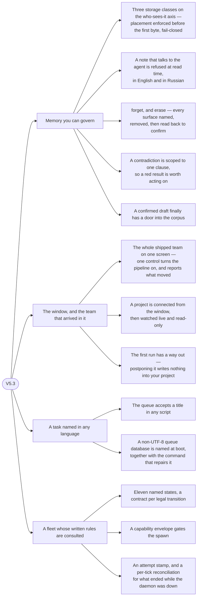
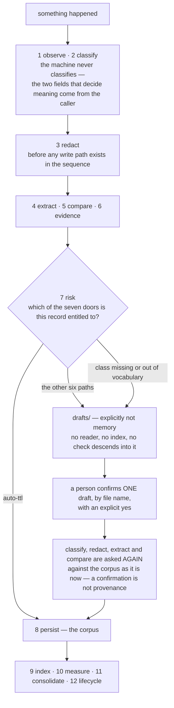
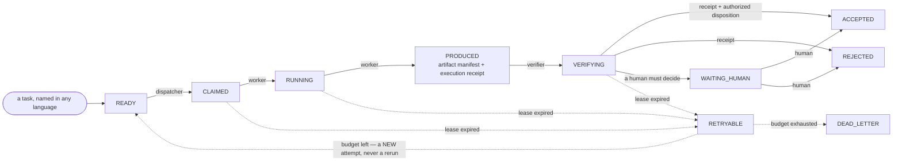
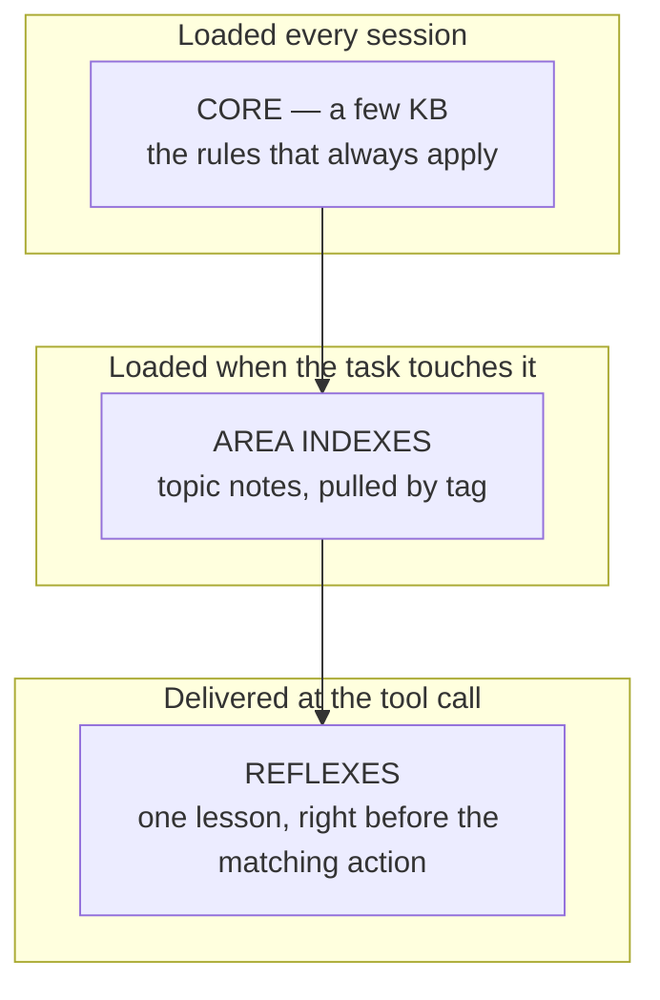

<p align="center">
  
</p>

<p align="center">
  
  
  
  <a href="LICENSE"></a>
  
  
</p>

# SMA — Shared Memory & Automation

**SMA is a local-first memory and accountability control plane for AI coding agents: it delivers the right project knowledge at the exact moment of action — and independently verifies the agent's claims. Layered memory that arrives on time, multi-terminal coordination without a server, and every "done" settled by a script, re-derived by a blind verifier, and blocked from shipping when it is false.**

[Русская версия → README.ru.md](README.ru.md)

> ### 🗺️ [Open the live system map →](https://sma-framework.github.io/sma/master-graph.html)
> Every subsystem of SMA on one interactive page — the fastest way to see how everything connects.

> ### 🆕 [What's new in V5.3 →](#whats-new-in-v53)
> Governable memory, the shipped team in the window, a task named in any language, and a fleet that consults its own written rules — with the diagrams.

> ### 🧭 [Roadmap →](ROADMAP.md) · [по-русски](ROADMAP.ru.md)
> Where SMA is and what comes next: **V5 orchestration (a 24/7 worker fleet) — shipped → V5.1 works-with-what-you-have + the working front — shipped (v5.1.0) → V5.2 measured memory — shipped (v5.2.0) → V5.3 governance + hardened fleet — shipped (v5.3.0).**

> **This is not a memory plugin.** It is a working discipline for shipping real code with an AI agent: memory that arrives at the exact moment it is needed, coordination that stops two terminals from overwriting each other, and a **trust spine** in which every "done" is settled by a script, re-derived by a blind verifier, and blocks the next release if it is false. It writes only to a few folders next to your code — **your source tree is never touched** — and everything it knows or enforces is a plain file you can read, diff, and revert.

---

## Install

### 1 · What you need first

| | |
|---|---|
| **Node 22.5 or newer** | Node is the program that runs SMA's scripts. Check what you have with `node -v`. If the number is lower, or the command is not found, install the current version from [nodejs.org](https://nodejs.org). |
| **git** | SMA keeps everything as ordinary text files in your repository, so your project should be a git repository (run `git init` in it if it is not one yet). |
| **Claude Code** | The AI coding agent SMA plugs into today. The `/sma-…` commands below are typed into a Claude Code session, the same way you talk to it normally. |

Nothing else. The core of SMA adds no packages to your project and needs no database, no server and no account. (An optional extra — the worker fleet described further down — does ask for more; you can ignore it entirely.)

### 2 · One command

Open a terminal, go to the top folder of **your own project**, and run:

```bash
npx -y sma-framework@latest init
```

That is the whole install. It takes a few seconds and prints every file it wrote. (`npx` is Node's built-in "fetch and run this once" tool; it leaves nothing behind afterwards.)

### 3 · What you have afterwards

New folders appear **next to** your code. Not one line of your own source is edited.

```text
your-project/
├─ src/, package.json…   ← YOUR CODE — untouched
│
├─ .claude/
│  ├─ skills/            ← the 14 /sma-… commands you can now type
│  ├─ agents/            ← the helpers those commands call on
│  ├─ sma-core/          ← the engine: the instructions behind each command
│  ├─ memory/            ← your project's notes — installed EMPTY, the notes stay yours
│  └─ settings.json      ← hooks that wire SMA into the agent (your own entries are kept)
├─ scripts/sma/          ← the command-line tool the commands use underneath
├─ .sma/                 ← working state: who is editing what, and the log of checks
└─ CLAUDE.md             ← one short marked block is added; your own text is untouched
```

A `.planning/` folder appears later, the first time you plan a piece of work.

Changed your mind? `/sma-update` re-runs this same installer to move to a newer version, and `/sma-deleteme` removes everything in one step — both keep your notes in `.claude/memory/` and everything else local. Install flags, the install-from-a-git-clone route, and the complete list of files: [docs/INSTALL.md](docs/INSTALL.md).

## First steps

### Start here

Open a Claude Code session in your project and type:

| Type this | What happens |
|---|---|
| `/sma-start` | A guided conversation, run once. It asks what your project is and how you ship it, writes the answers down, and starts your notes file. Everything you run later speaks in those terms. |
| `/sma-help` | The list of commands, one line each — your map when you forget a name. |
| `/sma-progress` | "Where are we?" — what is done, what comes next, and an offer to run it. |

### A normal working cycle

You work in **phases**: one chunk of work at a time — a feature, a fix, a rewrite. Four commands, always in this order:

1. `/sma-discuss-phase 1` — it asks you questions until the goal is unambiguous.
2. `/sma-plan-phase 1` — it writes the plan, including how the result will be checked.
3. `/sma-execute-phase 1` — it does the work and commits it, step by step.
4. `/sma-verify-work 1` — it walks the result through with you and re-runs the checks the plan promised.

Then repeat with `2`, `3`, and so on. For something small, skip all four: `/sma-quick` for a small task, `/sma-fast` for a one-liner.

### Where to look next

- [docs/INSTALL.md](docs/INSTALL.md) — install options, what lands where, updating and removing.
- [docs/DETAILS.md](docs/DETAILS.md) — the engineering deep dive, once you want to know how it works inside.
- `node scripts/sma/cli.mjs explain <name>` — run from your project root: a plain-language explanation of any SMA command.

## What's new in V5.3

V5.2 made the memory layer **measurable**. V5.3 makes it **governable** — and does the same to the optional fleet: rules that had been written down as prose are now the rules the running code actually asks. Four directions, one release. Everything below is described in full further down this page; this is the map.


```mermaid
flowchart LR
    V53(["V5.3"])

    V53 --> M["Memory you can govern"]
    V53 --> W["The window, and the team that arrived in it"]
    V53 --> L["A task named in any language"]
    V53 --> F["A fleet whose written rules are consulted"]

    M --> M1["Three storage classes on the who-sees-it axis —<br>placement enforced before the first byte, fail-closed"]
    M --> M2["A note that talks to the agent is refused at read time,<br>in English and in Russian"]
    M --> M3["forget, and erase — every surface named,<br>removed, then read back to confirm"]
    M --> M4["A contradiction is scoped to one clause,<br>so a red result is worth acting on"]
    M --> M5["A confirmed draft finally has a door into the corpus"]

    W --> W1["The whole shipped team on one screen —<br>one control turns the pipeline on, and reports what moved"]
    W --> W2["A project is connected from the window,<br>then watched live and read-only"]
    W --> W3["The first run has a way out —<br>postponing it writes nothing into your project"]

    L --> L1["The queue accepts a title in any script"]
    L --> L2["A non-UTF-8 queue database is named at boot,<br>together with the command that repairs it"]

    F --> F1["Eleven named states, a contract per legal transition"]
    F --> F2["A capability envelope gates the spawn"]
    F --> F3["An attempt stamp, and a per-tick reconciliation<br>for what ended while the daemon was down"]
```

### Memory you can govern

The three storage classes are the headline: a note marked as restricted is refused entry to any git-backed path **before a single byte is written**, in both write doors, and lands in `.sma/local-memory` instead. Retrieved text is now data rather than instruction — a note carrying "ignore your previous instructions", or the same trick in Russian, is withheld with the reason named. `memory forget` retires a note; `--erase` removes it physically from every surface a copy can live on, naming each one and reading it back — and it **declines** when an archived episode shares the record's id, because history is a different asset class from truth.

The write pipeline gained the door it was missing. Step 7 stages anything that is not a low-risk working observation as a draft — and until this release a confirmed draft had no path into the corpus at all:


```mermaid
flowchart TD
    E["something happened"] --> S1["1 observe · 2 classify<br>the machine never classifies —<br>the two fields that decide meaning come from the caller"]
    S1 --> S3["3 redact<br>before any write path exists in the sequence"]
    S3 --> S4["4 extract · 5 compare · 6 evidence"]
    S4 --> S7{"7 risk<br>which of the seven doors is this record entitled to?"}

    S7 -->|"auto-ttl"| S8["8 persist — the corpus"]
    S7 -->|"the other six paths"| DR["drafts/ — explicitly not memory<br>no reader, no index, no check descends into it"]
    S7 -->|"class missing or out of vocabulary"| DR

    DR --> DOOR["a person confirms ONE draft, by file name,<br>with an explicit yes"]
    DOOR --> RECHECK["classify, redact, extract and compare are asked AGAIN<br>against the corpus as it is now — a confirmation is not provenance"]
    RECHECK --> S8
    S8 --> S9["9 index · 10 measure · 11 consolidate · 12 lifecycle"]
```

The one automatic path — `auto-ttl` — is the only one that writes without a human, and it additionally demands a retention window. Anything whose class cannot be determined falls closed to the strictest door. The command behind that confirmation is `sma memory write --apply <draft> --confirm <id>.md --yes`; the schema migration keeps the same shape — preview by default, one proposal applied at a time, by hand.

The contradiction detector became worth listening to. It reads every kind of note that *states a rule*, and it reads a Russian corpus as well as an English one — so a clean result now means «nothing was found» instead of «nothing was examined». It calls two notes contradictory only where one denies the other **about the same subject, inside the same clause**, and it no longer reads a date as a quantity. Measured on a live corpus, that turned two critical findings — both false — into zero, with every true positive still firing.

### A task named in any language

PostgreSQL fixes a database's encoding at CREATE time, and the Windows `initdb` default is the ANSI code page. A queue created there used to answer a Cyrillic, Greek, Japanese or emoji title with a driver stack trace. Now the daemon asks the database its encoding at boot, says what will happen and which command repairs it, and refuses such a title with that same sentence. `node supervisor/queue-utf8-migrate.mjs --apply` builds a UTF-8 database, carries the waiting tasks and the attempt rows over, and **keeps** the old one — there is no `DROP` in it.

That title then walks the fleet's eleven named states. Every arrow below is a contract in the shipped state machine — who may perform it, what must be true first, and what it writes:


```mermaid
flowchart LR
    T(["a task, named in any language"]) --> R

    R["READY"] -->|"dispatcher"| C["CLAIMED"]
    C -->|"worker"| RUN["RUNNING"]
    RUN -->|"worker"| P["PRODUCED<br>artifact manifest + execution receipt"]
    P -->|"verifier"| V["VERIFYING"]

    V -->|"receipt + authorized disposition"| A["ACCEPTED"]
    V -->|"receipt"| RJ["REJECTED"]
    V -->|"a human must decide"| H["WAITING_HUMAN"]
    H -->|"human"| A
    H -->|"human"| RJ

    C -.->|"lease expired"| RT["RETRYABLE"]
    RUN -.->|"lease expired"| RT
    V -.->|"lease expired"| RT
    RT -.->|"budget left — a NEW attempt, never a rerun"| R
    RT -.->|"budget exhausted"| DL["DEAD_LETTER"]
```

`ACCEPTED`, `REJECTED`, `DEAD_LETTER` and `CANCELLED` are terminal — and terminality is the *absence* of any outgoing contract rather than a flag, so a state cannot be terminal in one place and leaky in another. `ACCEPTED` is reachable only with a verification receipt **and** an authorised disposition. The full table, the seven invariants and — in §5 — what is deliberately not a goal: [docs/FLEET-INVARIANTS.md](docs/FLEET-INVARIANTS.md).

### The rest of the release, in one breath

- **The whole team ships, and the window shows it.** Every agent that comes with the product appears on the team screen beside the ones you wrote, marked as stock, yours, or a stock definition you have edited. The switch is a panel now, at the top of the section it acts on: the state in words, the count in figures, what one press will do — and a result either way, because an action that ends in silence is a defect on its own.
- **A project is connected from the window** — a form, not a hand-made HTTP request — and its files are then followed as they change. What the window shows of that project's memory is read-only, and the migration preview is bounded: a corpus over 200 notes reports its size instead of building a preview of that scale.
- **The first run can wait.** «Позже» — the "later" button — closes the onboarding interview having written nothing into your project; the answer is kept daemon-side, so the window stops asking and the door stays open.
- **The release gate is runnable again.** `lint` over a real planning tree of 151 plans took ~193 s, and 92 % of it was two checks spawning 604 git processes to answer one question twice. It now asks git once per run: **193 s → 3.5 s, 604 spawns → 27**, with a byte-identical report. A check that costs more than the whole test suite is a check that stops being run. It also gained progress on stderr and a wall-clock budget that says `PARTIAL` and exits non-zero rather than truncating silently.
- **The suite grew with it** — 2050 cases at the v5.2.0 stamp to the figure in the badge at the top of this page, which is written from a measured run by `badge.mjs` and never typed by hand: the publish gate refuses a tarball whose badge disagrees with the receipt.

## The window — V5.1's app, served by the daemon

V5 shipped the engine and a deliberately thin operations panel. V5.1 builds the app on top of it: **seventeen screens**, compiled once and served by the daemon itself, behind the same token and the same frozen route table. No second web server appears, no extra port is opened, nothing new listens.

The app arrives already compiled: the npm package carries the built front in `daemon/static/app`, so there is nothing to build before you can open it. The daemon's own dependencies ride inside the package the same way — nineteen packages, about 6 MB, vendored in `daemon/node_modules` — so there is no second `npm install` for it either; the full list, with the licence each one carries, is in [THIRD-PARTY-LICENSES.md](THIRD-PARTY-LICENSES.md). From a git clone, `cd spa && npm run build` rebuilds it into that same folder. The daemon needs no further wiring, and the panel it already served stays exactly where it was, as the emergency view. A clean boot says so out loud — one line, *«Buckle up, soldier — the park is live»*, naming the exact address to open; failure was always loud, and success no longer whispers.

### Opening the window — what a first run actually needs

The app belongs to the **optional** V5 layer, and that layer asks for two things the memory and coordination core never does: a process that stays up, and somewhere durable to keep the work. Nothing below is needed to use SMA's memory, coordination or accountability — skip the whole section and everything else still works.

**1 · A local PostgreSQL for the queue.** The daemon keeps its task queue in Postgres (pg-boss), in a database of its own — never your application's production database, and never exposed to the internet. There are two honest roads and the product does not pretend there is a third: point `queueUrl` at **a server you already run** (SMA neither installs PostgreSQL nor manages yours), or start **the bundled sandbox**, for a machine with no PostgreSQL, no docker and no administrator rights:

```bash
node supervisor/pg-sandbox-windows.mjs start
```

It waits until a real session answers instead of trusting an open socket, creates the queue's database if it is missing, and says so and exits 0 when everything is already up. The whole road — including the one-time step that creates the sandbox directory — is in [docs/INSTALL.md](docs/INSTALL.md).

**A task can be named in any language.** If the queue database was created in a non-UTF-8 encoding (the Windows `initdb` default), SMA says so at boot — naming the database, what will happen to a non-ASCII title, and the command that repairs it — and refuses such a title with that same sentence instead of an "internal error". `node supervisor/queue-utf8-migrate.mjs` reports; `--apply` builds a UTF-8 database, carries the waiting tasks and the attempt rows over, and keeps the old database under a new name. The whole procedure, and what deliberately does not travel, is in [supervisor/setup-windows.md](supervisor/setup-windows.md).

**2 · Start the daemon**, from the SMA checkout or the installed package directory:

```bash
node daemon/src/main.mjs
```

The first boot writes `~/.sma-daemon/config.json` — machine-local settings, never committed, carrying a freshly generated front token — and then prints the address it listens on (`127.0.0.1:7777` by default). If the queue is unreachable the boot fails loudly and the process exits: set `queueUrl` in that file to your own server (`postgres://localhost:5432/sma_daemon` is the default) and start it again.

**3 · Open the app once with the token:**

```
http://127.0.0.1:7777/?token=<the token in ~/.sma-daemon/config.json>
```

That single visit exchanges the token for an HttpOnly session cookie and every later visit is a plain address. Until it happens the daemon answers `unauthorized` and nothing else — there is no login page to guess at, deliberately. Read the token out of the config file; it is never printed to the log.

**Always-on wiring** — a launchd job on macOS, a Scheduled Task on Windows — is written up in the [supervisor/](supervisor/) checklists, together with the smoke run that proves the loop end to end before you leave it running overnight.

**Your day, not a dashboard.** *Today* opens on what the fleet did overnight and what is waiting on you; the board holds every task; the team screen shows each worker with its lane and its window; the live stream is the work as it happens; costs read straight from the spend book, per day, per lane and per account. The app is built for a desktop screen (1440 px and up) — the phone still waits for its own design pass, and V5.3 shipped without it rather than pretending otherwise.

**Every task card answers WHY.** The decision journal rides the same attempt ledger the receipts do, in three layers: the dispatcher's own reasons (why this lane, this worker, this window — structured codes from a closed vocabulary, never free text), the worker's mandatory approach note (what it chose, what it rejected, which rules and memories shaped it), and the memory trace (which notes loaded, which reflexes fired). An attempt without its note is as incomplete as one without its receipt.

**A conversation with tied hands.** The chat screen carries one caption and it is literal: *«Reads and suggests. Runs nothing itself.»* Factual questions — why a run failed, what is eating the window, where a task stands — are answered by deterministic read models with no model call at all: instant and free. Only open questions and task drafts reach a model, on a short lane outside the task queue, and a draft still passes the same readiness gate and the same approval door as any other task. The route table gains no execution surface for it.

**Bring the agents you already have.** The import door reads the estate already sitting in your repository — `.claude/agents`, `.claude/skills`, your rules file — and enrolls it through the same door the Creator uses: a draft, a lint receipt, an approval queue. The wizard shows what it found, what collides with a name already taken, and exactly what will be written. Imported definitions are third-party text, so nothing is ever enabled by the import itself; activation stays two explicit human steps.

**A first run without the terminal.** Once the daemon is up (see above) the app opens on a four-step interview — your project, your infrastructure, the estate it can see, and your first lessons. It writes exactly the artifacts `/sma-start` writes, through the same writer, so the two doors are provably one door. The terminal path stays for whoever prefers it, and it needs no daemon at all. **And it can wait.** «Позже» closes the interview having written nothing into your project; the answer is kept on the daemon's side, so the window stops asking and the door stays open for whenever you want it.

**Terminal parity, proven rather than asserted.** A worker session has to be able to do what your own terminal session does. From a clone of this repository, `node tools/terminal-parity-check.mjs <attemptId>` reads one real run and prints five receipts — hooks fired, memory loaded, skills available, reverify honoured, model profile matched — and exits 0 only at five out of five.

### Several machines, several projects — one window

A project is a first-class dimension now, not a separate install: one daemon runs the tasks of all your repositories, each task carries its project, and the app filters by it. Existing tasks are adopted into a project on first start — nothing to migrate by hand. Connecting one is a form rather than a hand-made HTTP request: on «Машины и проекты» you name the project's folder, press «Подключить», and the daemon reads it from there. An entry with no folder behind it is labelled «не подключён» instead of being shown as though it were live.

Across machines, daemons federate. You nominate one daemon as the **hub** and introduce its peers from the app: the hub mints a single-use invitation, you carry it to the second machine, and from then on the hub aggregates state — presence per machine, costs and windows per machine, every project in one window. Actions are not re-played by the hub: an approval or a new task issued from the hub travels to the owning machine as the same already-authorised call, through every door it would have passed locally. A peer opened directly still shows its own machine, with a quiet banner when the hub is unreachable — there is no single point of failure.

The network between your machines is **yours, not ours**: a private mesh (WireGuard, Tailscale, or a self-hosted coordinator). **The daemon never asks to be exposed to the public internet**, and no vendor cloud appears anywhere in this design.

## Before SMA → After SMA

The whole point of SMA is the second column. Same agent, same model — a different discipline around it.

| | **Without SMA** | **With SMA** |
|---|---|---|
| **1 · A rule is dropped** | Your instructions say "every schema change needs a migration." Twenty edits later the agent adds a column and forgets. It ships; queries break on deploy. | The moment the agent touches the schema file, a reflex fires **into that tool call**: *"schema change → migration required (last time this broke prod)."* It cannot be skimmed past. |
| **2 · "Done" that isn't** | *"All tests pass, feature complete."* You pull, run them, three are red. The confident summary was the only evidence, and it was wrong. | The plan pre-registered a check. At close, a **script** re-runs it on a fresh clone and writes `hit` or `miss` to the ledger. "Done" is a re-runnable command, not a sentence — and a blind verifier re-derives it without ever reading the agent's report. |
| **3 · A lesson re-learned** | The same build flag bites you a third month running. Each fix lived only in one closed chat; nothing carried it forward. | The first burn was written as a note with a trigger. Every later session — and every teammate's clone — gets the warning **before** repeating it. One burn, permanent avoidance. |
| **4 · Two terminals collide** | Terminal B edits `src/api` while Terminal A is mid-refactor there. B's push silently reverts an hour of A's work; nobody notices until CI. | B registered a session and A had **claimed** `src/api`. When B goes to edit, it is warned *before* the keystroke — and both drew their migration numbers from one queue, so they never clash. |
| **5 · A false "done" ships** | The report said the feature works. It didn't; the regression reaches `main` and the next release carries it. | A class-A divergence — the heaviest signal in the system: a claimed pass that the blind verifier reproduced as a failure — **auto-blocks the release gate (`sma preship`)** until a human records an explicit disposition. The ledger is append-only; the agent cannot forgive itself. |

> **Honest caveat.** On a single task, SMA costs more — the checks and the memory are not free. Its bet is **cost per correct result across many tasks**, not the cheapest single run.

<!-- sma:positioning:start -->

## How SMA compares

A model vendor cannot neutrally grade its own agent's homework. With Claude Outcomes that sentence needs sharpening, not retiring: the vendor now *can* verify, because separate-context grading shipped as a platform feature. What it cannot do is be **audited**. An outcomes grade is an opaque rubric verdict: no re-runnable receipt, no published track record, no consequence when it is wrong. SMA's lane is the audit layer any grader — theirs or ours — has to survive, and that lane is exactly why SMA outlives platform absorption.

So the comparison is deliberately honest, including where each analog is better than SMA. Reach figures are GitHub stars as of July 2026 — check them before quoting:

| Tool | Reach | What it does better than SMA | What only SMA does |
|------|-------|------------------------------|--------------------|
| **Claude Outcomes** | platform | Managed sessions, a built-in outcome grader, zero setup | Deterministic re-runnable receipts, a judge-attributed calibrated hit rate, and a contradicted "satisfied" that blocks the release until a human rules |
| **claude-mem** | 86k★ | Category-leading memory mechanics, polished SQLite runtime | Scores whether the memory actually helped, and publishes the hit rate |
| **Aider** repo-map | 47k★ | Deterministic context graph with years of production proof | Carries a memory corpus and a learning loop on top of the graph |
| **Letta** / MemGPT | 24k★ | Rich memory-block architecture | No DB, no server, and the agent does not grade itself |
| **ccusage** | 16.5k★ | Excellent local spend observability | The spend signal drives enforcement, not just observation |
| **BMAD** | 50k★ | Rich orchestration templates | A verification layer, so a claim has to survive a script |

**What SMA deliberately does not do in the layer that matters:** the memory, coordination and accountability core runs with no daemon, no database, no embeddings, no cloud and no LLM in the hot path — everything is files and git (see `node scripts/sma/cli.mjs explain substrate`). Correctness never depends on a model call, or on anything staying up. The V5 worker fleet and its app are a **separate, optional layer** on top: that one does run a local daemon and keep its queue in a local PostgreSQL, both on your own machines, and switching it off leaves everything above untouched.

**The grader itself is graded.** Every separate-context verdict — the blind verifier's, or an outcomes grader's if ever consumed — is recorded, scored against ground truth (a revert, a rework, red CI, a founder rejection), and a wrong "satisfied" cannot be audited away: it blocks the release until a human dispositions it. That is the audit an opaque grade cannot offer.

**The evidence passport reads two ways.** `sma manifest` assembles one deterministic passport per pull request — the predictions and their verdicts, the receipts and their hashes, the blind-verify counts, the spend window, the per-area hit rate — and renders it for whoever is reading: `--md` for the reviewer's PR comment, `--json` for a tool, and `--dense` for an agent, which prints the whole passport as one fixed line per section. Nothing is recomputed for any of them: all three renders read the same built object, so the compact view can never disagree with the one a human signed off, and an empty section is marked rather than dropped.

Economy is held to the same evidence bar. Lane budgets are derived from the project's *own* spend percentiles, never a vendor benchmark; any plan can publish a **footprint receipt** — git-diff arithmetic against a written claim, an overrun scored as a calibration miss; and the ship lanes gate a push on a full test-and-security run a quick lane can never weaken. Every saving is paired with a quality guard, and a number is published only once it has been scored (see `node scripts/sma/cli.mjs explain economy`). The spend book prices tokens from a versioned, local pricing table — never fetched over the network — updated 2026-07-21 to the current Claude rates: the newest model family added, and a stale Opus rate corrected after it had overstated the real price roughly threefold.

Adoption is reported honestly, not asserted: the real hit rate and sample size live in the calibration badge and `PASSPORT.md`, rebuilt from the ledger with `sma passport --build` and reproducible on a fresh clone. The badge hides itself after a model change until enough new data exists, so it never quietly overstates.

Three trust-spine features (the git airbag, the spend ledger, and the pre-compaction capsule) are bridges the wider ecosystem may well absorb, and that is fine; they are not the headline, the accountability layer is. Two vendor-absorbable candidates stay explicit WATCH tripwires rather than headlines — a cross-session, on-by-default agent-teams primitive, and the advisor tool exposed inside sessions — each carrying a self-removal condition that retires our bridge the day the platform ships it.

<!-- sma:positioning:end -->

## What makes it different

- **Accountable, not just helpful.** Every claim SMA makes about itself is a pre-registered prediction settled by a script and re-derived by a blind verifier — and only once its stated horizon has actually arrived: a claim due at a later version or a future date stays registered and unscored rather than collecting a verdict about a future nobody can observe. A receipt's digest is derived from the exact check command, its exit code and its normalized output, so two different checks can never share a hash. What may be a check command is one anchored allowlist — SMA's own verbs, a test run, and your project's `test`, `pack` and `run <script>`, so a release gate hashes the build and the suite instead of recording bare exit codes — and never anything that fetches code from a registry. A command that cannot be expressed there is admitted only with `--unsafe-ack`, which stamps the waiver onto the receipt where it stays readable, and does not make it re-verifiable. Memory frameworks promise recall; SMA publishes its hit rate and lets a false "done" block its own release.
- **The layer a vendor cannot ship.** A model vendor cannot impartially grade its own agent's homework. SMA grades it from outside — deterministically, with no LLM in the hot path — which is exactly why it survives platform absorption.
- **Deterministic first.** Retrieval is tag- and trigger-driven, enforcement is plain scripts, and the whole learning-and-verification loop runs without a single LLM call in the hot path. Optional intelligence can sit on top; correctness never depends on it.
- **Git-native and reversible.** Notes, ledgers, journals, receipts — all files in your repo. Self-improvement arrives as diffs you review; anything the system learns can be reverted with `git revert`.
- **Fail-open by design.** A warning never blocks your work; a dead hook never wedges a session; every stream has a kill-switch. Hard blocking is reserved for security gates you configure yourself and for the consequences law you opt into.
- **Yours.** The corpus lives in your repository, travels with `git clone`, and is portable to other agents — it is knowledge you own, not a vendor cache.

## Memory, in three layers

Not one big instruction file — three tiers that keep the always-loaded budget tiny while nothing is lost by accident. (Losing something *on purpose* is a command of its own — see below.)


```mermaid
flowchart TD
    subgraph Always["Loaded every session"]
        C["CORE — a few KB<br>the rules that always apply"]
    end
    subgraph OnDemand["Loaded when the task touches it"]
        I["AREA INDEXES<br>topic notes, pulled by tag"]
    end
    subgraph AtTheAct["Delivered at the tool call"]
        X["REFLEXES<br>one lesson, right before the matching action"]
    end
    C --> I --> X
```

Each note carries a `use-when` trigger — that single line is what lets SMA deliver it at exactly the right tool call instead of dumping the whole corpus into every prompt. Auto-trim never deletes — it *demotes* down the layers (in this repo's own dogfood, the always-loaded index went from 46 KB to 5 KB with full recall preserved). *Auto-trim only changes how loudly the system remembers; real forgetting is a separate deliberate command, never a side effect.*

Delivery is filtered before anything is ranked: a note that was retired, has passed its own valid-until date, or sits above the class the asking consumer may see is left out of the pack — and stays in its area index, marked, so it is still findable. Nothing is rewritten to make that happen.

**You can make it forget.** `node scripts/sma/cli.mjs memory forget <id>` retires one note: it stops being delivered, stays in its area index marked as retired, and remains readable as history. Add `--erase` and the record is physically removed instead — from the corpus, from the drafts area, from the this-machine-only store, and from every index derived from it, each surface named in the report and then read back to confirm it is actually gone. It asks once, and it does not ask twice. **It can also decline.** If an episode in the archive happens to share the record's id, the erase stops before touching a single surface, names that file, removes nothing — and hands the decision back to you: history is a different asset class from truth, and a delete command does not get to rule on it on your behalf.

**The honest limit, stated in the same breath: git already has it.** If the note was ever committed, erasing the file today does not remove it from your repository's history — an old commit still carries the text. Erase tells you so, and what to do about it (rewriting history, or rotating whatever leaked) is a decision for you, not something a memory command should do behind your back. [docs/MEMORY-LIFECYCLE.md](docs/MEMORY-LIFECYCLE.md) walks through both.

**Material that must not leave this machine has its own class.** A note marked as restricted is refused entry to any git-backed path before a single byte is written — in both write doors, failing closed — and is filed instead under `.sma/local-memory`, which keeps itself out of git by its own ignore marker. To be exact about what that does and does not buy you: this is enforced **placement**, not encryption. The bytes on disk are plain text, deliberately and on the record — see [docs/MEMORY-THREAT-MODEL.md](docs/MEMORY-THREAT-MODEL.md).

**A note that talks to the assistant is not delivered at all.** Retrieved text is data, never an instruction: a note whose body carries something aimed at the agent — "ignore your previous instructions", and the same trick in Russian — is refused at read time, and so is a note that plainly belongs to a different repository than the one being asked about. Neither is quietly down-ranked; each is withheld with the reason named, and `sma memory explain --task "…"` prints that reason.

How loudly a note speaks is what it says about itself: a note states what *missing* it would cost, and that grade — not a guess — decides whether it interrupts you with a full warning, a single line, or nothing at all.

## The pillars

- **Predictions** — every plan states, up front, what will measurably change and how to check it; a deterministic scorer compares promise to fact at plan close.
- **Receipts + blind verification** — every "done" carries a re-runnable check; a blind verifier re-derives it from the tree alone, refusing the agent's self-report as input.
- **Consequences** — a class-A miss does not just get logged, it *acts*: it blocks the next ship until a human dispositions it, from an append-only ledger the agent cannot edit.
- **Reflexes** — a scored miss becomes a permanent rule that fires *before* the next matching tool call. Touch boiling water once, never again.
- **Corpus health** — lint, contradiction detection, and consolidation keep the memory sharp at hundreds of notes instead of decaying into noise. The contradiction detector reads every kind of note that *states a rule* — a decision, a status, a norm, a procedure — and reads a Russian corpus as well as an English one, so a clean result means «nothing was found» rather than «nothing was examined». It calls two notes contradictory only where one denies the other *about the same subject, in the same clause* — a marker sitting in some unrelated aside of a long rule is not a disagreement — so a red result is worth acting on. Diagnostics are loud: a failing memory command prints what broke and why, and a corpus without its tag registry still builds a usable index instead of erroring.
- **Coordination** — session registry, file claims with pre-edit warnings, and shared counters for anything two terminals could race on. The session count is honest: a lease whose terminal is gone is reported as stale, never as a working window.
- **Scaffolding** — a per-plan progress journal turns a dead executor into a five-minute resumption; a stall detector, dependency-aware waves and the one-spawn `pre` multiplexer keep long runs honest, parallel and cheap.
- **A fleet with its rules written down — and now consulted** — the optional worker fleet has a formal layer: a named state machine that says which task state may follow which and on whose authority, an envelope that declares up front what one worker may touch, and a stamp on every attempt recording the world it ran in. Seeded property tests attack all of it, and crash, restart, dead-letter and redelivery drills try to lose a task and cannot. Since 2026-08-05 the layer no longer stands beside the code as a declaration: the live queue path routes its status changes through the state machine, a spawn is refused when the lane's envelope grants it no execution surface, production attempt rows carry the idempotency key, the state-machine version, the envelope digest and the digest of the memory corpus the worker stood in — and a per-tick reconciliation closes the crash hole, so an attempt that ended while the daemon was down gets its ledger row, flagged as reconstructed rather than observed. One drill has now been run against a real PostgreSQL: the daemon hard-killed with a task in flight, the census taken from the database afterwards, no task lost. **Stated plainly so nobody reads more into it than shipped:** three of the seven stamp fields — the policy version, the harness version and a plan hash — stay *absent*, because nothing in the product can compute them and an invented value is worse than an admitted gap; and the envelope bounds what the *daemon* does on a worker's behalf, not what that worker may reach once its session is running, which is still the checkout's own settings. The seven invariants, and what is deliberately not a goal, are in [docs/FLEET-INVARIANTS.md](docs/FLEET-INVARIANTS.md).
- **Economy** — lane budgets derived from your own spend history, a self-cost meter, and quality guards on every savings number.

## It lives beside your code, never inside it

SMA never edits, moves, or reformats a single line of your application. It writes only to a handful of sibling folders — all plain text, all under version control, all yours.

```text
your-project/
├─ src/            ← YOUR CODE — SMA never writes here
├─ package.json    ← untouched
│
├─ .claude/
│  ├─ memory/      ← the memory corpus (markdown notes you can read & diff);
│  │                 installed EMPTY — you get the system, the notes stay yours
│  ├─ agents/      ← the /sma-* workflow agents
│  └─ settings.json← the hooks that wire SMA into your agent
├─ .sma/           ← coordination + accountability state
└─ .planning/      ← phase plans, predictions, receipts, calibration
```

Delete the folders and your project is exactly as it was.

## Which model runs which agent

By default a model *profile* answers one question — how heavy is this kind of work — and every agent follows it. When you need a single agent on a specific model, pin that agent instead of switching the whole profile:

```bash
node .claude/sma-core/bin/sma-tools.cjs query config-set model_profile_overrides.agents.sma-executor opus
```

The pin wins over the profile for that agent only; every other agent stays where it was, and it holds against automatic tier escalation. A name SMA does not recognise is ignored — a typo changes nothing rather than failing a run. To lift a pin, set it to `null`: the key is removed and the agent goes back to the profile.

```bash
node .claude/sma-core/bin/sma-tools.cjs query config-set model_profile_overrides.agents.sma-executor null
```

`null` is how you clear *any* setting — the key is deleted rather than set to the word "null". Full resolution order and the per-runtime tier map: [scripts/sma/README.md](scripts/sma/README.md).

**The whole team ships, and the window shows it.** Every SMA agent that comes with the product is visible on the app's team screen alongside any you wrote yourself — each one marked as stock, yours, or a stock definition you have edited — and one control switches the pipeline on for all of them at once. The control says which of the three states it is in — the team is on, on but not for everyone, or off — states what pressing it will do, and reports back whether the switch actually took, instead of flipping and leaving you to guess. Nothing is enabled by installing; turning the team on is a deliberate act, and turning it off again is the same control.

**A connected project is watched live.** Point the window at one of your repositories and its files are followed as they change: edit a note and the screen updates within a second, without a reload. If the watcher cannot run, the screen says so — «live connection unavailable, updating on a schedule» — instead of showing stale data as if it were fresh. Switch to another project and the watcher follows it, with no daemon restart. What the window shows of that project's memory is **read-only**: it reads your corpus, it never writes into it — and it reads it in the format the corpus is actually written in, so a note's claim is its title and what it applies to becomes its tags. The migration preview is bounded rather than open-ended: a corpus over 200 notes reports its size instead of building a preview of that scale, and a staged preview nobody accepted is pruned after fourteen days.

## Commands

The `/sma-*` workflow family (run inside a Claude Code session):

| Command | What it does |
|---|---|
| `/sma-start` | First-run onboarding: explains the system, seeds the memory corpus and the infra profile |
| `/sma-discuss-phase` | Gather phase context through adaptive questioning before planning |
| `/sma-plan-phase` | Create a detailed phase plan with a verification loop |
| `/sma-execute-phase` | Execute all plans in a phase with wave-based parallelization |
| `/sma-verify-work` | Validate built features through conversational UAT |
| `/sma-quick` | A quick task with SMA guarantees (atomic commits, state tracking), skipping optional agents |
| `/sma-fast` | A trivial task inline — no subagents, no planning overhead |
| `/sma-debug` | Systematic debugging with persistent state across context resets |
| `/sma-progress` | Where things stand: progress, next step, freeform intent dispatch |
| `/sma-resume-work` | Resume from a previous session with full context restoration |
| `/sma-pause-work` | Create a context handoff when pausing mid-phase |
| `/sma-help` | Show available commands and the usage guide |
| `/sma-deleteme` | Remove SMA in one action; your memory corpus stays |
| `/sma-update` | Check installed vs available versions and update via the standard installer; everything local stays |

Underneath runs the coordination + accountability CLI — 90 verbs, each with an in-product explainer. Call it from your project root, the way the hooks do:

```bash
node scripts/sma/cli.mjs status            # who is working on what, right now
node scripts/sma/cli.mjs explain <verb>    # what any verb is for, in plain language
node scripts/sma/cli.mjs grill --gate      # cross-examine every plan promise before the build
```

The full reference lives in [scripts/sma/README.md](scripts/sma/README.md). A few are worth naming here:

| Command | What it does |
|---|---|
| `sma baseline capture` | Measure what the layer costs you today — retrieval recall, context cost, hook latency, worker recovery, a clean install — and with `--record`, store each number as a re-runnable receipt |
| `sma baseline replay` | Re-run those recorded receipts later, so «it got better» is a diff and not a memory |
| `sma eval memory` | Score the memory layer against your gold cases — recall@k, precision@k, MRR, nDCG, critical-memory misses, retired records delivered anyway, contradictions handed over in one pack. Deterministic floors turn it into a verdict: a violated floor exits non-zero, and no model is asked its opinion |
| `sma eval memory --experiment <name>` | The A/B a new retrieval layer has to pass before anybody gets it by default: your gold set scored TWICE — once by the path that ships, once by the experiment — differing by one option and nothing else, so the difference belongs to the layer. Both arms are printed beside the deltas, in percentage points, with the token cost next to the score, because a retrieval number improves trivially by delivering more. It names **no** winner: the rule that decides whether a layer enters the default path is applied by a person and written down |
| `sma eval north-star` | Price one VERIFIED CORRECT result — tokens, compute, wall-clock and the minutes a human spent — divided by the results the benchmark judged correct, with every recorded receipt beside it in one guardrail panel. The term nothing measures yet (human minutes) reports `null` and names where its future measurement will come from; a flattering 0 is never substituted, because a 0 there would read as «humans spend no time on this» |
| `sma eval gate --file <decl.json>` | Check a new feature's admission declaration before the work starts: failure class, recorded baseline, falsifiable prediction, acceptance, rollback. A prediction whose threshold is not a number is refused by name — «it will be noticeably better» is a wish, and a wish cannot turn out to be wrong. The five elements and the format: [docs/FEATURE-GATE.md](docs/FEATURE-GATE.md) |
| `sma memory explain --task "…"` | Ask why the pack looks like this. Every note in the corpus gets exactly one verdict: delivered — on what grounds (the always-load rule it states about itself, its weight, which tag met your task) — or withheld, naming the filter and the field that decided, the missing tag overlap, or the budget cut and its position. It reports the real selection, instrumented, so a retrieval change can be argued about decision by decision |
| `sma memory migrate` | Propose a richer schema for every note as a reviewable draft — preview-only: it never rewrites a note, and each proposal is applied by hand with `--apply <draft> --confirm <note> --yes` |
| `sma memory write` | Put one candidate memory through the twelve-step write pipeline and read every verdict: what was scrubbed before anything could be stored, what it contradicts, whether it may be believed at all — and where it landed: the corpus, a draft for review, or nowhere |
| `sma memory index rebuild\|status` | **Experimental, and switched off.** Build the derived lexical index — an exact path/symbol match plus SQLite BM25 — under `.sma/`, and ask whether it still describes the corpus. It takes part in **no** delivery until a measured comparison on your gold cases says it earns its place; until then it exists and decides nothing. It needs Node ≥ 22.5 for the `node:sqlite` module: below that the layer is honestly `unavailable` and exits 0, because retrieval runs on the deterministic facet and exact layers without it. The official Node build compiles SQLite **without** full text, so the engine is chosen by a probe and not by a version number — where the extension is missing, a plain-table BM25 answers the same question. The index is derived: delete the file and a single rebuild restores it whole, which is the only way an index stays an index instead of quietly becoming a second source of truth |

---

## Going deeper

Everything above is the core. The detail lives one link away:

- **[docs/DETAILS.md](docs/DETAILS.md)** — the full engineering deep-dive: the four-setup side-by-side, the accountable loop diagrams, the complete CLI reference by version layer, the animated demo gallery, how the hooks integrate, and the whole version history V1 → V5.1 with the trust spine process by process.
- **[ROADMAP.md](ROADMAP.md)** — where SMA goes next: V5 orchestration (shipped), V5.1 shipped as v5.1.0, V5.2 shipped as v5.2.0, V5.3 shipped as v5.3.0 — and the memory-foundation program behind them. Русская копия: [ROADMAP.ru.md](ROADMAP.ru.md).
- **[docs/MEMORY-MODEL.md](docs/MEMORY-MODEL.md)** — the schema law of the memory layer: what one record may claim and must carry, the closed vocabularies, provenance and its fingerprint, the temporal model, the storage classes, the one-claim law, and the corpus checks that hold all of it up.
- **[docs/MEMORY-LIFECYCLE.md](docs/MEMORY-LIFECYCLE.md)** — how a memory is written, approved and retired: the twelve-step write pipeline with every refusal it can make, the risk-approval ladder, drafts, the four lifecycle transitions, and the preview-only migration ritual.
- **[docs/MEMORY-THREAT-MODEL.md](docs/MEMORY-THREAT-MODEL.md)** — the security posture: which storage class may hold what, what fails open and what fails closed, how retrieved text stays data instead of becoming an instruction, and the encryption policy — decided on 2026-08-04: no cipher in this version, the restricted class is enforced as placement and its bytes are plain text on disk.
- **[docs/FLEET-INVARIANTS.md](docs/FLEET-INVARIANTS.md)** — the fleet's seven invariants written as law: the named state machine and its transition contracts, the capability envelope, the attempt stamp, how the property tests and the drills attack each one — and §5, which says plainly what is *not* a goal, and where every remaining edge sits now that the daemon does route through the layer: the three stamp fields nothing in the product can compute, the transitions exempt by name, and the reach the envelope does not bound.
- **[docs/FEATURE-GATE.md](docs/FEATURE-GATE.md)** — the five elements a new feature must declare before it reaches the default path: the failure class it addresses, the recorded baseline it will be compared against, a falsifiable prediction with a numeric threshold and the command that produces the number, what acceptance means, and how it rolls back. Checked by `sma eval gate`.
- **[docs/INSTALL.md](docs/INSTALL.md)** — install flags, payload manifest, uninstall.
- **[docs/recipes/browser-check-command.md](docs/recipes/browser-check-command.md)** — how a user-interface check becomes a re-runnable receipt: a headless "command + exit code" script, the browser library in *your* devDependencies (SMA's core stays browser-free), and why pixel diffs are banned as evidence.
- **[sma-core/references/fanout-ladder.md](sma-core/references/fanout-ladder.md)** — swarm or solo: the four deterministic signals (divisibility into non-overlapping file scopes, risk class, size, budget remaining) that decide fan-out, plus what the shipped commands already do.
- **[scripts/sma/README.md](scripts/sma/README.md)** — every CLI subcommand, flag, hook event, and kill-switch.
- **[PASSPORT.md](PASSPORT.md)** — the calibration passport: the real hit rate and sample size, reproducible on a fresh clone.

## Star History

[](https://star-history.com/#sma-framework/sma&Date)

## License and attribution

**SMA Source-Available License v1.0** — see [LICENSE](LICENSE). In plain words: the source is open to read, install locally, modify, and use for yourself, inside your own team, and in noncommercial education and research — free of charge. Any monetization of SMA — selling it, offering it (or a product built on it) for a fee or as a hosted service, or charging for services where SMA is part of what the customer pays for — requires a written commercial agreement with the author: **matvey.maslov99@gmail.com**. The default commercial terms are 30% of the gross revenue of the offering that uses SMA; write first, always. Commercial use without an agreement does not escape these terms: by that use alone you accept the license automatically — no notice in either direction is required — and the author may sue at any time, without prior warning or an offer to cure, for no less than 30% of the gross revenue involved, plus interest and enforcement costs (LICENSE §4; German law, venue at the author's seat). Earlier versions keep the licenses they shipped with: v4.0.2 and earlier (including those npm releases) remain MIT, and v5.0.0–v5.0.4 remain FSL-1.1-MIT with that license's scheduled conversion of each version to MIT two years after its release.

**Author: Matvey Maslov.** Questions, feedback, adoption stories: [matvey.maslov99@gmail.com](mailto:matvey.maslov99@gmail.com) — or open an [issue](https://github.com/sma-framework/sma/issues).

The workflow engine inside SMA is derived from [gsd-core](https://github.com/open-gsd/gsd-core) (MIT). Third-party notices and the engine's provenance are tracked in [THIRD-PARTY-LICENSES.md](THIRD-PARTY-LICENSES.md).
