<p align="center">
  
</p>

<p align="center">
  
  
  
  <a href="LICENSE"></a>
  
  
</p>

# SMA — Shared Memory & Automation

**Слой подотчётности для ИИ-агентов, пишущих код: слоистая память, которая приходит вовремя, координация нескольких терминалов без сервера и проверенные утверждения, которые *управляют* поведением. v4: оценивай оценщика — каждый вердикт из отдельного контекста записывается как предсказание и сверяется с тем, что git сделал на самом деле, на тезисе, что поставщик может *проверить*, но его нельзя *проаудировать*; плюс полосовые счётчики экономики, которые оценивают каждый запуск по Вашим собственным расходам, и каждое число экономии идёт в паре со стражем качества.**

[English version → README.md](README.md)

> ### 🗺️ [Открыть живую карту системы →](https://sma-framework.github.io/sma/master-graph.html)
> Все подсистемы SMA на одной интерактивной странице: шесть слоёв версий, карточки узлов с командами, файлами и честными цифрами, проверенные бенчмарки и зарегистрированные ставки 10×. Самый быстрый способ увидеть, как всё связано.

> **Это не плагин памяти.** Это рабочая дисциплина поставки настоящего кода с ИИ-агентом: память, которая приходит ровно в тот момент, когда нужна; координация, которая не даёт двум терминалам затирать друг друга; и, начиная с V3, **хребет доверия**, в котором каждое «готово» сводит скрипт, переповеряет слепой проверяющий, а ложное «готово» блокирует следующий релиз. Он пишет только в несколько папок рядом с Вашим кодом — **Ваше дерево исходников не трогается никогда** — и всё, что он знает или принуждает, это обычный файл, который можно прочитать, сравнить и откатить.

---

## Установка

Одна команда из корня Вашего проекта (ноль зависимостей: установщик написан только на встроенных модулях Node и печатает свою версию по ходу работы):

```bash
npx -y sma-framework@latest init
```

Это вся установка. Заодно она вшивает короткий managed-блок правил в CLAUDE.md Вашего проекта, чтобы агенты видели корпус памяти (Ваш собственный текст не трогается никогда), а выход симметричен входу: `/sma-deleteme` удаляет всё и СОХРАНЯЕТ `.claude/memory/`.

Путь через клонирование остаётся для разработки и машин без доступа к реестру:

```bash
git clone https://github.com/sma-framework/sma.git ../sma-clone
cd <ваш-проект>
node ../sma-clone/bin/init.mjs --local
```

Флаги (`--global`, `--with-gsd-aliases` и другие), полный список устанавливаемых файлов и шаги удаления описаны в [docs/INSTALL.md](docs/INSTALL.md).

## Быстрый старт

Откройте сессию Claude Code в Вашем проекте и выполните:

```
/sma-start
```

Вводный разговор объяснит систему, засеет стартовый корпус памяти и каркас проекта, а также запишет Ваш инфраструктурный профиль (Ваш деплой-хост, Ваш ритуал релиза), чтобы все дальнейшие команды говорили на языке Вашего стека. После этого каждая новая сессия регистрирует себя сама и загружает ядро памяти прежде, чем что-либо делать.

## До SMA → После SMA

Весь смысл SMA — во втором столбце. Тот же агент, та же модель — другая дисциплина вокруг них.

| | **Без SMA** | **С SMA** |
|---|---|---|
| **1 · Правило потеряно** | В инструкциях сказано: «каждое изменение схемы требует миграции». Через двадцать правок агент добавляет колонку и забывает. Выкатывается — запросы падают на деплое. | Как только агент трогает файл схемы, рефлекс срабатывает **внутри этого действия**: *«изменение схемы → нужна миграция (в прошлый раз это сломало прод)»*. Пропустить нельзя. |
| **2 · «Готово», которого нет** | *«Все тесты зелёные, готово.»* Вы забираете код, запускаете — три красных. Уверенный отчёт был единственным доказательством, и он был неверен. | План заранее записал проверку. При закрытии **скрипт** прогоняет её на свежей копии и пишет `hit` или `miss` в журнал. «Готово» — это перезапускаемая команда, а не фраза, и слепой проверяющий выводит его заново, ни разу не заглянув в отчёт агента. |
| **3 · Урок заново** | Тот же флаг сборки кусает третий месяц подряд. Каждое исправление жило лишь в одном закрытом чате; ничего не перенеслось вперёд. | Первый ожог записан заметкой с триггером. Каждая следующая сессия — и клон любого коллеги — получает предупреждение **до** повтора. Один ожог, постоянное избегание. |
| **4 · Два терминала столкнулись** | Терминал B правит `src/api`, пока Терминал A там же посреди рефактора. Push от B тихо откатывает час работы A; никто не замечает до CI. | B зарегистрировал сессию, а A **занял** `src/api`. Когда B идёт править, его предупреждают *до* нажатия клавиши — и оба взяли номера миграций из одной очереди, так что они не сталкиваются. |
| **5 · Отгружается ложное «готово»** | Отчёт сказал, что фича работает. Она не работала; регрессия доезжает до `main`, и следующий релиз несёт её с собой. | Расхождение класса A **автоматически блокирует `sma ship`**, пока основатель не запишет явное решение. Журнал дописываемый; агент не может простить себя сам. |


## Бок о бок: одна задача, четыре подхода

Код во всех четырёх случаях пишет одна и та же модель: голый Claude Code, Superpowers, GSD и SMA. Меняется процесс вокруг неё и, на финише, **чьему слову Вы верите про «готово»**. Вот одна задача примерно на 30 минут, прослеженная по стадиям:

| Стадия | Голый Claude Code | Superpowers | GSD | **SMA** |
|---|---|---|---|---|
| **План** | В голове, по ходу | Мозговой штурм, затем навык плана | Письменный `PLAN.md`, проверенный агентом | План, затем **грилл**: каждое обещание допрошено до первой строки кода |
| **Разведка** | Из того, что уже знает | Навык разведки | Субагенты разведки, затем `RESEARCH.md` | Сначала читает **свою память и квитанции**; каталог до grep |
| **Исполнение** | Пишет код | Навыки «сначала тест» | Субагенты-исполнители, атомарные коммиты | Исполняет, и нужное правило **срабатывает на конкретном вызове инструмента**, а не в файле, просмотренном один раз |
| **Проверка** | «Выглядит готовым», его же слово | Прогоняет тесты | Агент-проверяющий сверяет цель | **Заново выводит «готово» из одного лишь кода**, отказывает самоотчёту; ложное «готово» блокирует релиз |
| **Память** | Ничего, следующая сессия с чистого листа | Между сессиями ничего не переносится | Уроки сохраняются в `.planning` (этого проекта) | Уроки, калибровка и координация **сохраняются и срабатывают в следующий раз**, между сессиями и терминалами |

Каждая колонка, кроме одной, заканчивается на *слове самого агента* про «готово». SMA это слой, который проверяет работу, которую модель не может оценить сама у себя, и помнит, поэтому за одну и ту же ошибку Вы не платите дважды.

> **Честная оговорка.** На одиночной задаче SMA дороже: проверки и память не бесплатны. Его ставка это **цена правильного результата на многих задачах**, а не самый дешёвый одиночный прогон.

<!-- sma:positioning:start -->

## Как SMA сравнивается с аналогами

Поставщик модели не может нейтрально оценивать работу своего же агента. С Claude Outcomes эту мысль нужно заострить, а не убирать: поставщик теперь *может* проверять, потому что отдельно-контекстная оценка вышла как функция платформы. Чего он не может, так это пройти **аудит**. Оценка Outcomes это непрозрачный вердикт по рубрике: нет перезапускаемой квитанции, нет опубликованного трек-рекорда, нет последствия, когда она ошибается. Полоса SMA это слой аудита, который обязан пережить любой оценщик, их или наш, и именно эта полоса даёт SMA пережить поглощение платформой.

Поэтому сравнение намеренно честное, включая то, в чём каждый аналог лучше SMA:

| Инструмент | Охват | В чём лучше SMA | Что делает только SMA |
|------------|-------|-----------------|-----------------------|
| **Claude Outcomes** | платформа | Управляемые сессии, встроенный оценщик результата, ноль настройки | Детерминированные перезапускаемые квитанции, процент попаданий с привязкой к судье, и опровергнутое «satisfied», которое блокирует релиз, пока решение не вынесет человек |
| **claude-mem** | 86k★ | Ведущая механика памяти, отполированная среда SQLite | Оценивает, помогла ли память, и публикует процент попаданий |
| **Aider** repo-map | 47k★ | Детерминированный граф контекста с годами боевой проверки | Несёт корпус памяти и цикл обучения поверх графа |
| **Letta** / MemGPT | 24k★ | Богатая архитектура блоков памяти | Без базы, без сервера, и агент не оценивает сам себя |
| **ccusage** | 16.5k★ | Отличное наблюдение локальных трат | Сигнал трат управляет принуждением, а не только наблюдением |
| **BMAD** | 50k★ | Богатые шаблоны оркестрации | Слой проверки, поэтому утверждение обязано пережить скрипт |

**Чего SMA намеренно не делает:** нет демона, нет базы данных, нет эмбеддингов, нет облака, нет LLM в горячем пути. Всё это файлы и git (смотрите `pnpm sma explain substrate`). Корректность никогда не зависит от вызова модели.

**Сам оценщик тоже оценивается.** Каждый отдельно-контекстный вердикт, слепого проверяющего или вендорского оценщика, если он когда-нибудь будет использован, записывается, сверяется с фактом (откат, переделка, красный CI, отказ основателя), и ошибочное «satisfied» нельзя замять аудитом: оно блокирует релиз, пока человек не вынесет решение. Это и есть аудит, которого непрозрачная оценка дать не может.

Экономику держат на той же планке доказательств. Здесь бюджеты полос выводятся из *собственных* процентилей трат проекта, а не из вендорского бенчмарка; любой план может опубликовать квитанцию следа (footprint receipt): это арифметика git-diff против записанного заявления, а перерасход засчитывается как промах калибровки; полосы отгрузки ставят пуш на полный прогон тестов и безопасности, который быстрая полоса ослабить не может. Каждая экономия в паре с гарантией качества, а число публикуется только после того, как его оценили (смотрите `pnpm sma explain economy`).

Об адаптации сообщают честно, а не заявляют: реальный процент попаданий и размер выборки живут в значке калибровки и `PASSPORT.md`, пересобираемых каждый релиз и воспроизводимых на свежей копии. После смены модели значок прячется, пока не наберётся достаточно новых данных, поэтому он никогда не завышает тихо.

Три функции хребта доверия (git-подушка, книга трат и капсула перед компакцией) это мосты, которые более широкая экосистема вполне может поглотить, и это нормально; они не заголовок, заголовок это слой подотчётности. Два поглощаемых вендором кандидата остаются явными тревожными флажками WATCH, а не заголовками: межсессионный, включённый по умолчанию примитив agent-teams, и инструмент advisor, открытый внутри сессий; каждый несёт условие самоудаления, которое убирает наш мост в день, когда платформа его отгрузит.

<!-- sma:positioning:end -->

## Чем SMA отличается

- **Подотчётность, а не только полезность.** Каждое заявление SMA о самом себе — заранее зарегистрированное предсказание, которое оценивает скрипт и переповеряет слепой проверяющий. Системы памяти обещают вспоминание; SMA публикует свой процент попаданий и даёт ложному «готово» заблокировать собственный релиз.
- **Слой, который поставщик отгрузить не может.** Поставщик модели не может беспристрастно проверять работу собственного агента. SMA проверяет её снаружи — детерминированно, без LLM в горячем пути — именно поэтому она переживает поглощение платформой.
- **Сначала детерминизм.** Выдача памяти управляется ярлыками и триггерами, принуждение — обычными скриптами, и весь цикл обучения и проверки работает без единого вызова LLM в горячем пути. Интеллект может сидеть сверху; корректность от него не зависит.
- **Родной для git и обратимый.** Заметки, журналы, книги учёта, квитанции — файлы в Вашем репозитории. Самообучение приходит диффами, которые Вы просматриваете; всё выученное откатывается через `git revert`.
- **Никогда не блокирует.** Предупреждение не останавливает работу; мёртвый хук не вешает сессию; у каждого потока есть выключатель. Жёсткие запреты остаются только за настроенной Вами защитой безопасности и за законом последствий, который Вы включаете сами.
- **Ваше.** Корпус живёт в Вашем репозитории, путешествует с `git clone` и переносим на других агентов: это знание, которым владеете Вы, а не кэш поставщика.

## Как крутится цикл

<p align="center">
  
</p>

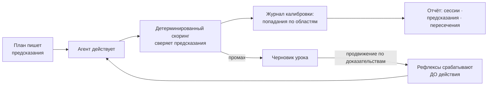

Один ожог — постоянное избегание: ребёнок один раз трогает кипяток. Промах записывается, записанный урок получает спусковой крючок, и крючок срабатывает предупреждением перед следующим похожим действием, в каждом терминале, навсегда. А поскольку скоринг делает скрипт, цикл не может себе льстить.


## Память в трёх слоях

Не один большой файл инструкций, а три уровня: всегда загружаемый бюджет остаётся крошечным, и при этом ничего не забывается.

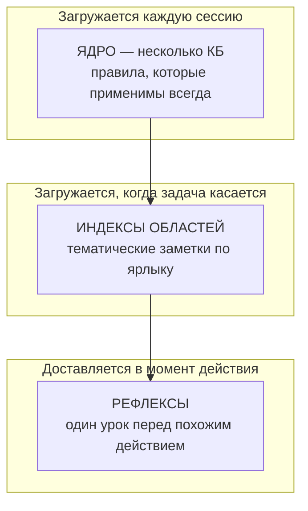

Авто-очистка никогда не удаляет — она *понижает* заметку по слоям, поэтому система становится легче, ни разу не теряя факт (в собственном прогоне этого репозитория всегда загружаемый индекс уменьшился с 46 КБ до 5 КБ с полным сохранением вспоминания, под контролем постоянного экзамена).

**Как заметка на самом деле сохраняется** — факт не входит случайно и не уходит случайно:

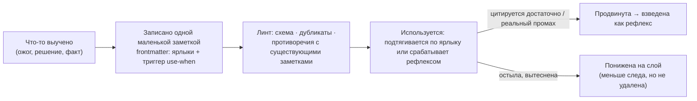

Каждая заметка несёт триггер `use-when` — именно эта строка позволяет SMA доставить её ровно у нужного действия, а не вываливать весь корпус в каждый промпт. Продвижение зарабатывается доказательством, а не таймером; понижение уменьшает горячий бюджет, ничего не забывая. *Система никогда не забывает — она лишь меняет, насколько громко помнит.*


## Столпы

- **Предсказания** — каждый план заранее заявляет, что измеримо изменится и как это проверить; детерминированный скоринг сверяет обещание с фактом при закрытии плана, а журнал калибровки показывает, в каких областях система ошибается чаще всего.
- **Квитанции + слепая проверка (V3)** — каждое «готово» несёт перезапускаемую проверку с ожидаемым хешем; слепой проверяющий выводит его из одного дерева, и расхождение — самый тяжёлый сигнал в системе.
- **Последствия (V3)** — промах класса A не просто фиксируется, он *действует*: блокирует следующий релиз, пока человек не вынесет решение, из дописываемого журнала, который агент не может править.
- **Рефлексы** — зафиксированный промах становится постоянным правилом, которое срабатывает до следующего похожего действия. Один раз обжёгся, больше не трогает.
- **Здоровье корпуса** — линт, поиск противоречий, плановая консолидация и счётчики продвижения держат память острой на сотнях заметок, вместо того чтобы дать ей превратиться в шум.
- **Координация** — реестр сессий, заявки на файлы с предупреждением до правки, общие счётчики для всего, за что могут схлестнуться два терминала, и живой сигнал «идёт публикация».
- **Каркас** — журнал прогресса по каждому плану превращает гибель исполнителя в пятиминутное возобновление; детектор зависаний, волны с учётом зависимостей и одно-запусковый мультиплексор `pre` держат длинные запуски честными, параллельными и дешёвыми.

## Команды

Семейство рабочих команд `/sma-*` (запускаются внутри сессии Claude Code):

| Команда | Что делает |
|---|---|
| `/sma-start` | Первый запуск: объясняет систему, засевает корпус памяти и инфраструктурный профиль |
| `/sma-discuss-phase` | Обсудить фазу: собрать контекст через адаптивные вопросы до планирования |
| `/sma-plan-phase` | Составить подробный план фазы с циклом проверки |
| `/sma-grill` | Состязательно допросить каждое обещание плана до сборки |
| `/sma-execute-phase` | Выполнить все планы фазы волнами, с параллелизацией |
| `/sma-verify-work` | Проверить сделанное вместе с Вами, в форме разговора |
| `/sma-quick` | Быстрая задача с гарантиями SMA (атомарные коммиты, учёт состояния), без лишних агентов |
| `/sma-fast` | Тривиальная задача прямо в сессии: без субагентов и без планирования |
| `/sma-debug` | Системная отладка с сохранением состояния между сессиями |
| `/sma-progress` | Где мы: прогресс, следующий шаг, свободный запрос |
| `/sma-resume-work` | Продолжить работу прошлой сессии с полным восстановлением контекста |
| `/sma-pause-work` | Передать контекст при паузе посреди фазы |
| `/sma-help` | Показать доступные команды и справку |
| `/sma-deleteme` | Удалить SMA одним действием: команды, движок, хуки, statusline, managed-блоки; корпус памяти остаётся *(v3.6)* |

Под капотом работает координационно-подотчётный CLI (`node scripts/sma/cli.mjs` или `pnpm sma`): 83 команды, сгруппированные здесь по слою версии, который их принёс. Сессии и хуки вызывают его сами; любую команду можно вызвать и напрямую, и у каждой есть встроенный объяснитель (`pnpm sma explain <команда>`).

### Ядро (V1–V2): память, координация, слоты

| Команды CLI | Что делают |
|---|---|
| `status` · `heartbeat` · `session-start` | Регистрация/продление сессии терминала; живая картина «кто чем занят» (`status` теперь также показывает подтверждённую отпечатком живость держателя каждой заявки) |
| `claim` · `release` · `force-clear` | Объявить «я беру эти файлы»; другие терминалы получают предупреждение до правки; force-clear несёт происхождение |
| `next-slot` · `consume` · `tia` | Общие счётчики без гонок (миграции, релизы) и regex-анализ влияния на тесты |
| `pre` · `pre-bench` | Одно-запусковый мультиплексор PreToolUse (коллизия → рефлекс → ворота → подушка → траты) и его SLO-инструмент; `collision-check` / `reflex-check` / `gates-check` остаются как устаревшие однопоточные алиасы |
| `stall-check` | Детектор застревания/зацикливания на PostToolUse; оставляет полётную отметку |
| `gates` · `gates-report` · `gates-ack` | Проверяемые правила проекта: совещательные предупреждения, мягкий запрет по свидетельству, подтверждения |
| `lint` · `build-index` · `load` · `snapshot` · `usage` · `consolidate` · `trim` | Инструменты корпуса памяти: линт качества, машинный индекс, загрузка по ярлыкам, цитирование использования, плановая консолидация, послойное сжатие |
| `predict-score` · `calibration` | Свести зарегистрированные предсказания скриптом; прочитать журнал попаданий по доменам |
| `state` · `exec-journal` · `metrics` · `report` | Где стоит план, журнал хода исполнения и общий отчёт системы |
| `upstream-check` | Следить за обновлениями исходного движка (только чтение, ничего не подтягивает) |

### V3 — хребет доверия

| Команды CLI | Что делают |
|---|---|
| `reverify` · `receipt-hash` | Перезапустить каждую структурную квитанцию; `--fresh-clone` засчитывает только закоммиченное |
| `chain-tip` · `chain-verify` | Цепочка журнала, стойкая к подделке: выдать вершину (закрепляется в теге релиза), обнаружить любую правку |
| `blind-verify` | Вывести каждое «готово» из одного дерева кода; отчёты исполнителя отклоняются (`BLIND_FORBIDDEN`) |
| `preship` · `disposition` | Открытое событие класса A блокирует релиз; снимает блок только дописываемое решение основателя |
| `grill` | Регистрация/решение состязательных вызовов; `--gate` блокирует негриллённую сборку; `--pre-push` гриллит `origin..main` |
| `evidence` | Записи бремени доказательства перед рискованными операциями (force-push, правка allowlist, чужие заявки) |
| `pretask-pack` · `subagent-verify` · `subagent-receipts` | Наследование контекста субагентами по построению; каждая заявленная запись сверяется с реальным деревом |
| `bench` | Инструмент таблицы из 8 метрик (базовая линия заморожена до постройки хребта) |
| `integrity` · `skeptic` · `canary` · `nearmiss` | Стражи Goodhart/STPA, которые держат опубликованные числа честными |
| `airbag` · `airbag-check` · `undo` | Мост (по желанию): миллисекундные git-снимки перед разрушительными операциями; восстановление одним действием |
| `precompact-capsule` · `resume` · `handoff` · `flight` | Мост (по желанию): капсула перед компакцией и брифы продолжения/передачи |
| `spend` · `spend-check` · `breaker` | Мост (по желанию): детерминированная книга трат, бюджетные рефлексы и разрыватель зациклившихся правил |

### НОВОЕ в V3.5 — адаптация и телеметрия доверия

| Команды CLI | Что делают |
|---|---|
| `profile` | Детерминированная поверхность профиля онбординга: схема, линт, покрытие, проверка пересборки резюме |
| `passport` · `model` | Собрать/проверить паспорт калибровки + значок README; страж версии модели прячет устаревшие данные до n≥20 |
| `excavate` | Прочесать git-историю чужого репозитория только на чтение; строки CATCHES: какой рефлекс сработал бы перед каким пушем |
| `emit` | Собрать корпус в управляемые блоки `CLAUDE.md` / `AGENTS.md` / `.cursorrules` / `GEMINI.md` (повторный выпуск байт-идентичен) |
| `catalog` · `context` | Каталог фрагментов (детерминированная карточка на файл) и бюджетированный байт-детерминированный компилятор контекста |
| `ladder` · `tune` · `curriculum` | Лестница самонастройки принуждения: таблица уровней, предложения повышения/понижения по свидетельству, недельная программа промахов |
| `statusline` · `pulse` | Родной сегмент статусной строки (совмещается с уже настроенной Вами строкой) и пульс внимания работа/ожидание |
| `manifest` | Паспорт доказательств PR: предсказания, квитанции и вердикты для диапазона коммитов, JSON/Markdown |
| `preflight` | Ворота «уже построено»: сверить утверждения плана с реальным деревом до запуска исполнителя |
| `arena` | Оценщик сравнительной бенчмарк-арены + статическая страница графиков (сырые данные и отрицательные результаты публикуются) |
| `batch` | Средняя полоса `/sma-batch`: фильтр риска, грилл-лайт, обязательные квитанции |
| `worktree` · `merge` | Изоляция воркдеревьев на терминал и сериализованные локальные ворота слияния (пуш остаётся по команде основателя через `/sma-ship`) |
| `session-end` | Хук SessionEnd: снять собственные заявки терминала, чтобы устаревшие аренды не пугали коллег |
| `ask` | *(экспериментальная заглушка)* — поверхность запросов отпечатка (`--unmet-count`); полная функция созреет в следующем релизе |
| `explain` · `doc-audit` | 18 понятных тем-объяснителей с растяжкой покрытия команд; детерминированный аудит честности документации |

### НОВОЕ в V3.6 — дверь в одну команду

| Команды CLI | Что делают |
|---|---|
| `deleteme` | Выход: отменить каждый артефакт инсталлера (по умолчанию сухой прогон) и СОХРАНИТЬ `.claude/memory/**` — уйти так же дёшево, как прийти |
| `memory-preview` | Превью онбординга: ASCII-схема того, как SMA разложит память ВАШЕГО репозитория (области из `git ls-files`, кандидаты в рефлексы из `excavate`) — только чтение, ноль сети, детерминизм |

Полный справочник CLI — каждая подкоманда, флаг, событие хука и выключатель — живёт в [scripts/sma/README.md](scripts/sma/README.md).

### Каждая команда в действии

Каждая команда это разговор в терминале. Разверните любую, чтобы увидеть, что она делает. Каждое демо повторяется по кругу (текст в терминале на английском).

<details open>
<summary><b><code>/sma-start</code></b> : первый запуск: система сначала объясняет себя, потом настраивается</summary>
<br>
</details>

<details>
<summary><b><code>/sma-discuss-phase</code></b> : зафиксировать спорные решения с человеком до кода</summary>
<br>
</details>

<details>
<summary><b><code>/sma-plan-phase</code></b> : исследование, планы и проверка плана; каждый шаг несёт предсказание</summary>
<br>
</details>

<details>
<summary><b><code>/sma-execute-phase</code></b> : сборка волнами с учётом зависимостей; рефлексы срабатывают до действия</summary>
<br>
</details>

<details>
<summary><b><code>/sma-verify-work</code></b> : сверка с критериями приёмки; скрипт заново прогоняет каждое «готово»</summary>
<br>
</details>

<details>
<summary><b><code>/sma-quick</code></b> : небольшая задача с полными гарантиями (атомарный коммит, учёт состояния)</summary>
<br>
</details>

<details>
<summary><b><code>/sma-fast</code></b> : тривиальная задача прямо в сессии; без субагентов и планирования</summary>
<br>
</details>

<details>
<summary><b><code>/sma-debug</code></b> : системная отладка, состояние переживает сброс контекста</summary>
<br>
</details>

<details>
<summary><b><code>/sma-progress</code></b> : где мы сейчас и следующий конкретный шаг</summary>
<br>
</details>

<details>
<summary><b><code>/sma-resume-work</code></b> : восстановить полный контекст из бортового самописца</summary>
<br>
</details>

<details>
<summary><b><code>/sma-pause-work</code></b> : подготовить передачу контекста перед паузой</summary>
<br>
</details>

<details>
<summary><b><code>/sma-help</code></b> : всё семейство <code>/sma-*</code> одним взглядом</summary>
<br>
</details>

#### V3 — хребет доверия в действии

<details open>
<summary><b><code>sma reverify</code></b> : заново прогнать каждое «готово» на свежей копии; голое «готово» не проходит линт</summary>
<br>
</details>

<details>
<summary><b><code>sma blind-verify</code></b> : вывести «готово» из одного дерева; отказаться от отчёта исполнителя</summary>
<br>
</details>

<details>
<summary><b><code>sma preship</code></b> / <code>disposition</code> : промах класса A блокирует релиз, пока основатель не снимет блок</summary>
<br>
</details>

<details>
<summary><b><code>sma grill</code></b> : вызов становится зарегистрированным предсказанием, иначе билд не стартует</summary>
<br>
</details>

<details>
<summary><b><code>sma pre-bench</code></b> : один запуск на вызов инструмента: 1268.6 мс → p95 152–157 мс</summary>
<br>
</details>

<details>
<summary><b><code>sma undo</code></b> : git-подушка: одно действие назад в безопасность <sub>(мост · опционально)</sub></summary>
<br>
</details>

<details>
<summary><b><code>sma resume</code></b> : пересобрать бриф из бортового самописца после компактизации <sub>(мост · опционально)</sub></summary>
<br>
</details>

<details>
<summary><b><code>sma spend</code></b> : детерминированная книга расходов + бюджетные рефлексы <sub>(мост · опционально)</sub></summary>
<br>
</details>

## Как это встраивается в Вашего агента

SMA подключается к агенту через **точки хуков** его окружения — моменты, когда агент позволяет отработать внешнему скрипту. Никакой обёртки вокруг Claude и никакого его форка нет; SMA регистрирует маленькие команды на нескольких событиях жизненного цикла, каждая — одна строка в `.claude/settings.json`. Каждый хук **никогда не блокирует**: если он падает или истекает по таймауту, работа продолжается — мёртвый хук не вешает сессию.

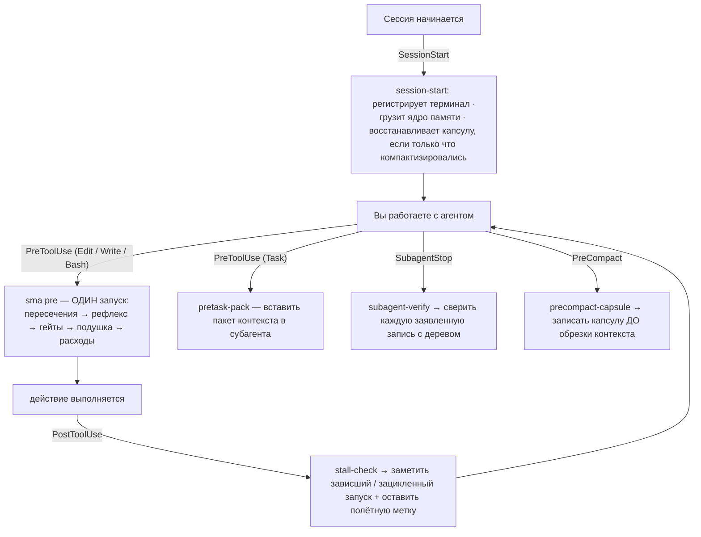

| Точка хука | Команда SMA | Что делает в этот миг |
|---|---|---|
| **SessionStart** | `session-start` | Регистрирует терминал, грузит крошечное ядро памяти, брифует о том, что изменили другие терминалы — и, если сессия только что авто-компактизировалась, заново вставляет полётную капсулу первым контекстом. |
| **PreToolUse** (Edit/Write/Bash) | `pre` | **Один запуск** прогоняет упорядоченный конвейер потоков — пересечения → рефлекс → гейты → подушка → расходы — заменяя 3–4 запуска V2. |
| **PreToolUse** (Task) | `pretask-pack` | Вставляет собранный пакет контекста в субагента — наследование по построению. |
| **PostToolUse** | `stall-check` | Замечает зависший/зацикленный запуск, чтобы гибель исполнителя стала пятиминутным возобновлением; также оставляет одну полётную метку. |
| **SubagentStop** | `subagent-verify` | Сверяет каждую заявленную запись файла с реальным деревом; фантомные записи помечаются. |
| **PreCompact** | `precompact-capsule` | Детерминированно записывает полётную капсулу *до* того, как компактизация удалит рабочее состояние. |

Вот и вся поверхность интеграции. Хуки вызывают тот же CLI, что и Вы руками (`pnpm sma …`), поэтому не происходит ничего, что Вы не могли бы воспроизвести и проверить сами. Каноническая проводка PreToolUse теперь — **одна** запись `pre`; старые по-потоковые команды остаются устаревшими алиасами для обратной совместимости.

## Что нового в V4 — оценивай оценщика

V3 построил хребет доверия: каждое «готово» решается скриптом и переизводится слепым проверяющим. **V4 обращает этот скепсис на самого проверяющего.** Ставка в одну строку: поставщик модели может *проверить*, но его нельзя *проаудировать*. Непрозрачный оценщик поставщика (Outcomes от Anthropic, управляемый судья) может сказать «прошло» или «нет», но Вы не можете его открыть, воспроизвести или предъявить прошлонедельный вердикт сегодняшней модели. SMA оценивает своих оценщиков в открытую. Восемь поверхностей, та же дисциплина, что всегда: детерминированные скрипты поверх файлов и git, ноль LLM в горячем пути.

### Оценивай оценщика — каждый вердикт это оценённое предсказание

Каждый вердикт LLM из отдельного контекста записывается как предсказание (`--grader-record`) и сверяется с детерминированной истиной: откат, переделка, красный CI, отказ основателя. Идентификатор модели-судьи ставится на каждой записи, поэтому калибровка режется по тому, *кто* судил (`hitRateByJudge`): смена модели не даёт устаревшей точности попасть в заголовок нового судьи. Вердикт «удовлетворён», которому истина позже противоречит, это **блокировщик публикации класса A**, пока основатель не запишет решение — оценщик не имеет права ошибаться тихо.

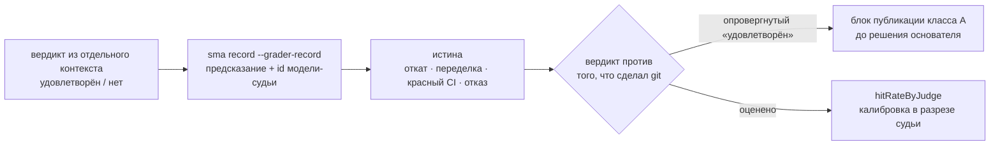

### Счётчики экономики — каждый запуск оценивается по Вашим собственным расходам, под стражем качества

Полосовые бюджеты в USD и минутах выводятся из процентилей *Вашего* собственного журнала расходов, а не из умолчания поставщика, для полос fix / quick / batch / build; превышение засчитывается как промах калибровки и черновит урок. `sma memory stats` сообщает детерминированную, версионированную стоимость корпуса в токенах; `sma spend self-cost` заставляет SMA измерять свою собственную нагрузку от инъекции. Каждое число экономии идёт в паре со стражем качества, поэтому «дешевле» никогда не может тихо означать «хуже».

### Остальное в V4

| Поверхность | Что делает |
|---|---|
| **Постоянный триаж поставщика** (`sma vendor`) | Дописываемый `VENDOR-LEDGER.md` (14 строк засеяно, включая отрицательные вердикты) сортирует каждую возможность апстрима как ЯДРО или МОСТ; вербы `lint`/`count` и продуктовый релиз-гейт отказываются публиковать на неотсортированной строке. За поставщиком наблюдают в открытую, а не гоняются за ним. |
| **Лестница следа** (`reverify --footprint`) | План заранее заявляет свой след во frontmatter (файлы, новые файлы, ~строк, новые зависимости); грилл спрашивает «какая ступень лестницы?»; квитанция сверяет заявку с фактами `git diff --numstat`, а превышение это помеченная строка калибровки. Идеология поглощена из двух источников MIT (указаны в THIRD-PARTY-LICENSES.md); их LLM-судья отклонён и перестроен как детерминированная квитанция. |
| **Полоса быстрой публикации** (`/sma-quick-ship`) | Детерминированное входное условие: дельта от origin ≤ 5 коммитов, без миграций, без чужой заявки на push, иначе ОТКАЗ обратно в полный ритуал. Гейт идентичный, никогда не слабее; полоса лишь покупает малую отрецензированную дельту и детерминированный changelog из conventional-commit, плюс видимость осиротевших запусков. |
| **Точность фантомных инструментов** (`--stat phantomsAsserted`) | Форензика квитанций S4: дедуп, отмена сопоставления по basename, стоплист отрицаний и честный путь ошибки на неизвестном ключе. Девять форензических строк заморожены как постоянные регрессионные фикстуры. |
| **Быстрое обновление профиля** (`sma profile --quick`) | Существующая установка больше не переспрашивает с нуля: `--quick` планирует интервью только по незаданным полям, с `--selftest` и `--profile`; `sma-start` направляет существующие установки туда. |
| **Позиционирование, переякорено** | Регион позиционирования в README (EN + RU) перестроен вокруг строки Outcomes, тезиса о разрыве аудита и столпа экономики; «Outcomes» добавлен в страж честности ANALOGS в doc-audit, а опровергнутые утверждения убраны. |

## Что нового в V3.6 — дверь в одну команду, в обе стороны

V3.5 сделал хребет доверия читаемым снаружи. **V3.6 убирает последнее трение у двери, причём в ОБЕ стороны, и показывает новичку его собственный проект до того, как он что-либо принял.** Четыре поверхности, та же ставка, что всегда: детерминированные скрипты поверх файлов и git, ноль LLM в горячем пути.

### Установка одной командой: `npx -y sma-framework@latest init`

Пакет опубликован в открытом реестре npm. Одна команда из корня Вашего проекта ставит движок, рантайм, команды `/sma-*` и хуки: только встроенные модули Node, ноль зависимостей. Версия в баннере, git-тег, `package.json` и `capability.json` это ОДНО значение, за которым следит детерминированный гейт `package-check` (`--count` печатает 0 на публикуемом дереве; он подключён как `prepublishOnly`, так что устаревший или приватный архив уйти не может).

### Инсталлер вшивает блок правил в CLAUDE.md

Большинство проектов никогда не подключали `.claude/memory/` к контексту агента: корпус, который строит SMA, был невидим тому самому агенту, ради которого существует. Теперь `init` вшивает короткий управляемый **блок правил** (где живёт память, как её загрузить, как координироваться, как уйти) в CLAUDE.md Вашего проекта по тому же закону склейки, что у `sma emit`: Ваши байты не трогаются, повторные запуски пусты, разорванные маркеры отклоняются. Семейство маркеров отдельное (`SMA:RULES`), поэтому блок корпуса и блок правил никогда не борются за один участок.

### Выход: `sma deleteme` / `/sma-deleteme`

Одна команда отменяет всё, что записал инсталлер: команды, движок, рантайм, агентов, хуки, сегмент статусной строки (Ваша исходная строка восстанавливается дословно), оба управляемых блока, состояние `.sma/`, и **сохраняет `.claude/memory/`**. По умолчанию сухой прогон; хирургия settings.json никогда не задевает чужое (правятся только записи хуков SMA и ключ `statusLine`; каждый другой ключ переживает байт-в-байт). Аргумент доверия это симметрия: новичок, который видит выход, войдёт в дверь.

### Превью Вашей памяти: `sma memory-preview`

Во время TEACH в `/sma-start` превью рисует прямо в терминале, как SMA разложит память ИМЕННО Вашего репозитория: всегда загружаемое ЯДРО, области периферии из Вашего реального дерева файлов и кандидаты в рефлексы, которые `excavate` добывает из Вашей собственной истории git (реверты и цепочки чинки, за которые Ваша команда уже заплатила). Только чтение, ноль сети, байт-в-байт на одном HEAD; `--project <путь>` покажет любой другой репозиторий, `--lang ru` включает русский вывод.

## Что нового в V3.5 — адаптация и телеметрия доверия

V3 построил хребет доверия. **V3.5 доставляет этот хребет в чужой репозиторий в первый же день и делает его честность читаемой снаружи.** Пятнадцать поверхностей, все та же ставка: детерминированные скрипты на файлах + git, без LLM в горячем пути.

### Глубокий онбординг `/sma-start`

Первый запуск — это поэтапный разговор, чередующий обучение и вопросы: Вы узнаёте, как работает подотчётный цикл, *пока* SMA записывает профиль, который читают все дальнейшие команды (Ваш деплой-хост, Ваш ритуал релиза, Ваша терпимость к риску). Ничего не объясняется дважды.

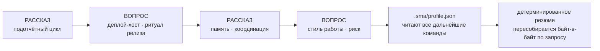

### Паспорт калибровки + честный значок README

`sma passport` превращает журнал калибровки в `PASSPORT.md` и публичный значок: реальный процент попаданий и размер выборки, воспроизводимые байт-в-байт на свежей копии. Страж версии модели — честная часть: после смены модели старый процент больше не описывает новую модель, поэтому значок **прячется, пока не наберётся n ≥ 20** свежих предсказаний. Первый производственный догфуд (платформа основателя, пользователь SMA номер 1) стоит на n=16/20 свежих вердиктов в *своём собственном* журнале: это число того развёртывания, а не значок этого репозитория, который остаётся скрытым, пока закоммиченный журнал этого репозитория не достигнет порога.

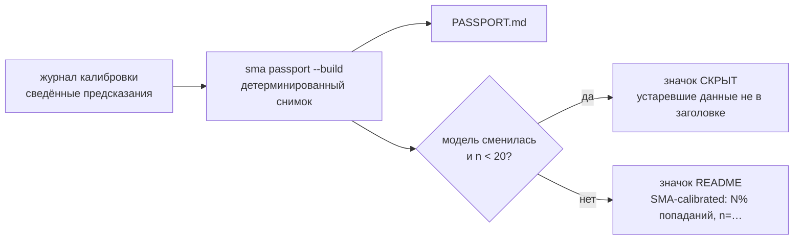

### Клинья адаптации — ценность до любой смены привычек

| Поверхность | Что делает |
|---|---|
| **`sma excavate`** | Прочёсывает git-историю чужого репозитория только на чтение (пары коммит↔откат, цепочки правок-опечаток, красные CI) и печатает строки CATCHES: *этот рефлекс сработал бы перед этим пушем*. Конкретное свидетельство в первые пять минут. |
| **`sma emit`** | Собирает корпус в `CLAUDE.md` / `AGENTS.md` / `.cursorrules` / `GEMINI.md` через управляемые блоки. Ваш текст вне блока не трогается; повторный выпуск байт-идентичен. Защита от вендор-лока по построению. |
| **Каталог фрагментов + `sma context`** | Детерминированная карточка в одну строку на файл (символы, импорты, git-статистика), затем бюджетированный байт-детерминированный пакет контекста задачи: каталог до grep, один вход → один пакет. |
| **Предпроверка «уже построено»** | Миллисекундная проверка без токенов утверждений плана против реального дерева до запуска исполнителя: ничего не строится за плату повторно. |
| **`sma explain` + `sma doc-audit`** | 18 понятных тем, покрывающих каждое понятие *и каждую команду CLI* (растяжка покрытия ставит промах, если команда вышла без документации); детерминированный аудит доказывает, что руководство и этот README остаются полными, свежими и честными. |

### Лестница самонастройки принуждения

Правила повышаются **и понижаются** только по свидетельству журнала — учёт пользы, а не счёт срабатываний — и всегда обозримым диффом. Недельная программа промахов превращает кластеры ошибок в шаблоны предсказаний и бриф слабых мест. Набор правил обостряется, а не только растёт.

### Сегмент статусной строки + пульс внимания

Живое состояние координации в родной статусной строке Claude Code — и оно совмещается: Ваша существующая команда статусной строки запускается первой, её вывод сохраняется, а сегмент SMA добавляется рядом.

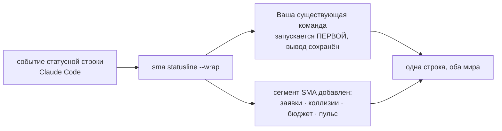

Пульс внимания помечает каждое окно как *работает* или *ждёт человека* (простой выводится, а не угадывается). Необязательный вебхук работает **только на выход**: SMA отправляет толчок наружу; входящего пути нет, и ничто не слушает.

### Манифест доказательств PR + бенчмарк-арена

`sma manifest` собирает паспорт доказательств для диапазона коммитов — зарегистрированные предсказания и их итоги, квитанция на каждое утверждение, вердикты слепой переповерки — чтобы проверяющий начинал с доказательств, а не с археологии диффов. `sma arena` детерминированно оценивает сравнительные прогоны 4 рук и публикует сырые данные, **включая отрицательные результаты**; проверяемое утверждение — цена *результата*, а не цена задачи.

### `/sma-batch` — средняя полоса

Между инлайн-правкой и полной фазой: 2–4 совместимых пункта бэклога, один исполнитель, квитанции и переповерка по-прежнему обязательны. Честность полосы держат два жёстких стража:

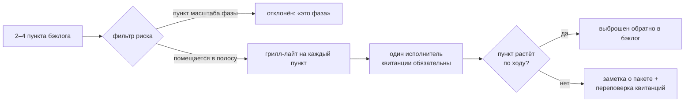

### Усиление координации: отпечаток → доверие заявкам → воркдеревья → ворота слияния

Четыре поверхности, замыкающие многотерминальный цикл от начала до конца — от «а жив ли вообще держатель этой заявки?» до «как параллельная ветка безопасно попадает в main?»

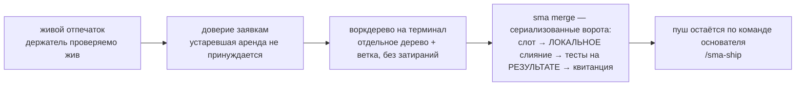

`sma merge` никогда не пушит и не деплоит: он занимает слот слияния (параллельное слияние получает мягкий запрет), вливает **локально**, прогоняет целевые тесты на *слитом* дереве — потому что две зелёные по отдельности ветки могут быть красными вместе — записывает квитанцию и отпускает слот.

## V3 — хребет доверия

V1 научил систему **помнить**. V2 научил её **предсказывать, срабатывать рефлексами и координироваться**. **V3 заставляет её перестать верить себе на слово.**

> **Поставщик не может беспристрастно проверять работу собственного агента.** Это тот единственный слой, который переживает поглощение платформой — подотчётность, которую поставщик модели структурно не может отгрузить нейтрально. SMA — это тот слой, построенный снаружи модели: **только файлы + git, детерминированно, без единого LLM в горячем пути, никогда не блокирует, с выключателем на каждом потоке.**

Всё, что ниже, — обычный скрипт на файлово-git-основе V2: без демона, без базы данных, без эмбеддингов, без облака. Вот весь подотчётный цикл, от начала до конца:

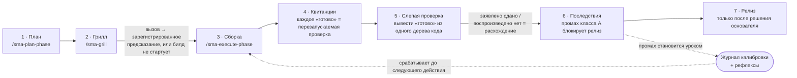

| Хребет V3 | Что Вы получаете | Команда |
|---|---|---|
| **Структурные квитанции** | каждое «готово» несёт машинно-проверяемые утверждения `{assertion, check_command, ожидаемый хеш}`, переповеряемые на свежей копии; голое «готово» не проходит линт | `sma reverify` |
| **Журнал, стойкий к подделке** | каждая строка журнала сшита цепочкой хешей; вершина цепочки пришпилена в теге релиза, поэтому правка истории обнаружима любым, у кого есть тег | `sma chain-verify` |
| **Слепой проверяющий** | выводит каждое «готово» из одного дерева кода; структурно отказывается принимать отчёт исполнителя на вход | `sma blind-verify` |
| **Последствия как ЗАКОН** | промах доверительного класса или расхождение автоматически блокирует релиз, пока владелец-человек не запишет явное решение — агент не может простить себя сам | `sma preship` / `sma disposition` |
| **`/sma-grill`** | каждое обещание плана допрашивается до сборки; нерешённый вызов должен стать зарегистрированным предсказанием, иначе билд не стартует | `sma grill` |
| **Мультиплексор `sma pre`** | ОДИН запуск node на вызов инструмента вместо 3–4: измеренный p95 **152–157 мс** против базы V2 **1268.6 мс** | `sma pre-bench` |
| **Квитанции записей субагента** | каждая заявленная запись файла сверяется с реальным деревом на SubagentStop; фантомные записи помечаются детерминированно | `sma subagent-verify` |
| **Стражи целостности** | скептик-подпись, случайный аудит 5% квитанций, подсаженные канарейки-ложные-«готово», страж пути разоружения STPA — чтобы публикуемые числа оставались честными | `sma skeptic` / `sma canary` / `sma integrity` |
| **`sma bench`** | таблица из 8 метрик, снятая и замороженная *до* постройки хребта («нет измеренной базы — нет цели») | `sma bench` |

Каждое из этого разобрано, с собственной схемой и — где Вы им управляете — с анимированным демо, в разделе **[Хребет доверия, процесс за процессом](#хребет-доверия-процесс-за-процессом)** ниже. Релиз V3 съел собственную стряпню: **532/532 тестов зелёные на том теге (в v4.0.0 сюита стоит на 876/876, 78 файлов); враждебная проверка «от цели назад» — 56/56 после раунда правок того же дня; закон последствий сработал по-настоящему во время этой проверки.** Вершина цепочки журнала на релизе V3: `b745d7d4…67db0161`, 0 разрывов.

### Хребет доверия, процесс за процессом

Это ядро V3 — класс возможности, который поставщик модели структурно не может отгрузить нейтрально. Каждый поток — детерминированный скрипт; каждый разобран здесь со схемой, а те, которыми Вы управляете, имеют анимированное демо в **[галерее команд](#каждая-команда-в-действии)**.

#### 1 · Структурные квитанции + `sma reverify`

«Готово» больше не проза. Каждая сводка плана может нести блок `receipts:` из машинно-проверяемых утверждений — `{id, assertion, check_command, expected_sha256}` — поверх блока покрытия V2. `sma reverify` перезапускает каждый `check_command` через ту же границу безопасных команд, что и предсказания; `--fresh-clone` запускает его на одноразовом `git clone`, так что **засчитывается только закоммиченное доказательство**. Линт `RECEIPT-PROSE` заваливает любое машинно-проверяемое «готово» без квитанции — голословное утверждение линт не пройдёт.

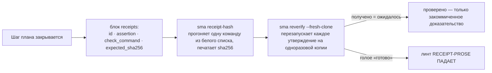

#### 2 · Журнал, стойкий к подделке

Публикуемые числа доверия ничего не стоят, если локальный журнал тихо правится. Поэтому каждая строка `.sma/journal` **сшита цепочкой хешей**: `prev` каждой строки — это sha256 предыдущей сырой строки. `sma chain-verify` докладывает о любой правке, удалении или вставке после сшивания, и разрыв никогда не чинится автоматически. `sma chain-tip` выдаёт детерминированную сводную вершину, которую ритуал релиза **пришпиливает в аннотированный тег** (`SMA-Journal-Tip: …`). Любой, у кого есть тег, может пересчитать вершину и обнаружить локальную правку.

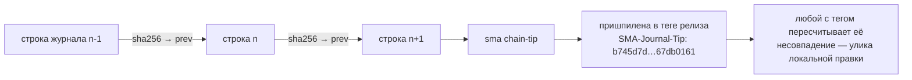

#### 3 · Слепой проверяющий — `sma blind-verify`

Самый тяжёлый сигнал во всей системе. Отдельный проход выводит каждое «готово» **из одного дерева кода** и **структурно отказывается** принимать на вход отчёт исполнителя: подайте ему SUMMARY или exec-journal — он завершится с ошибкой `BLIND_FORBIDDEN`, не записав ничего. Заявленное «сдано», которое слепой проход воспроизводит как «нет», — это **расхождение**, самое тяжёлое событие журнала калибровки, и оно блокирует релиз.

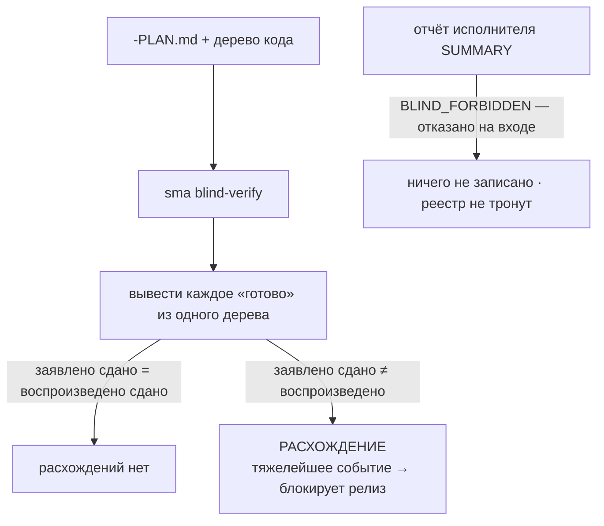

#### 4 · Последствия как ЗАКОН — `sma preship` / `sma disposition`

Единственный шаг от *фиксации* ложного «готово» к *действию* по нему. Неизменяемый блок `consequences:` во frontmatter плана, зафиксированный на время планирования, задаёт, что блокирует промах класса A. **Класс A** = промах, который обесценивает само утверждение о доверии (доля ложных «готово», честность субагентов, качество слепого проверяющего). Когда он срабатывает, `sma preship` **блокирует ритуал публикации**, пока основатель не запишет явное решение (`accept` / `fix-forward` / `rollback`) в **дописываемый** журнал; расхождение вдобавок открывает ветку-кандидат на откат. Агент не может простить себя сам — **это сработало по-настоящему во время проверки этого самого релиза**, и два его ложных события журнала видны в реестре, разобранные владельцем, ровно как задумано.

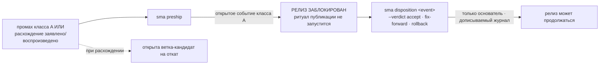

#### 5 · `/sma-grill` — состязательный гейт до сборки

Собственный ритуал основателя *grillme*, впитанный в архитектуру вместо риторики. Каждое обещание плана допрашивается **до** сборки. Нерешённый вызов должен стать зарегистрированным фальсифицируемым предсказанием, быть отозван или принят основателем — иначе `--gate` **блокирует сборку**. Перед публикацией **бюджетно-осознанный** грилл осматривает `origin..main` и тратит глубину проверки именно там, где журнал калибровки доказывает историческую промашливость проекта.

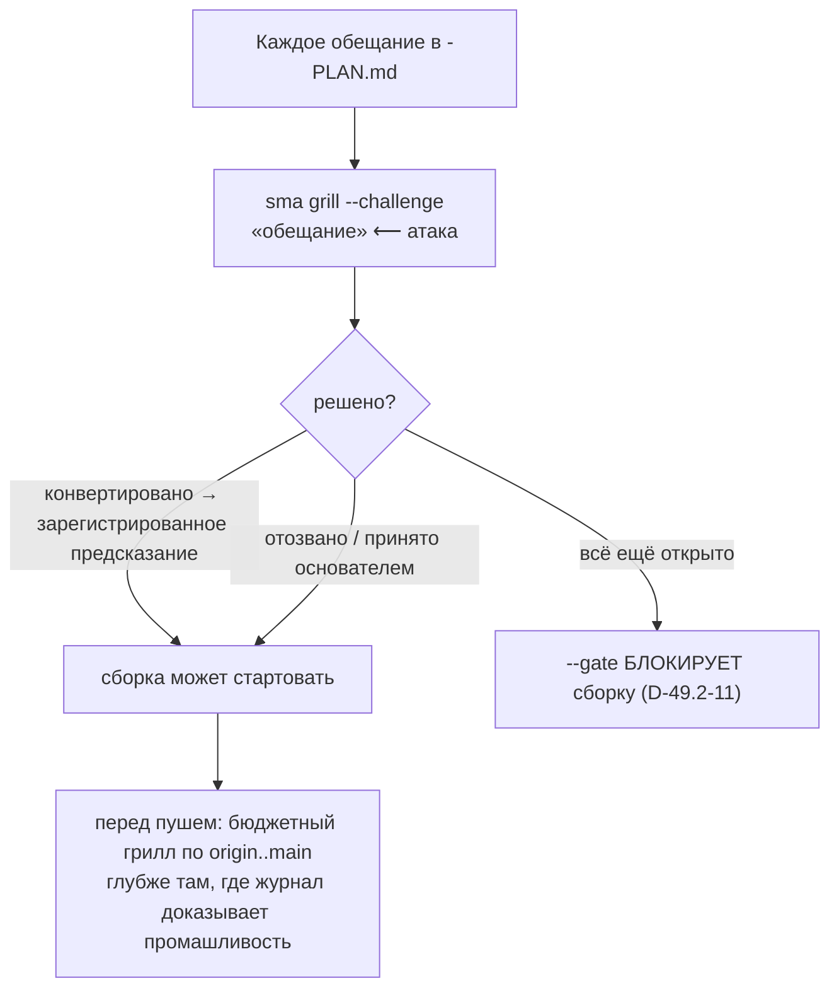

#### 6 · `sma pre` — один запуск на вызов инструмента

Всё выше добавляет потоки хуков, а наивные хуки облагают налогом каждое нажатие. Мультиплексор `sma pre` читает событие инструмента **один раз** и запускает упорядоченный конвейер потоков (пересечения → рефлекс → гейты → подушка → расходы) в **одном запуске node**, заменяя 3–4 запуска V2. Честные числа, измеренные на прогоне платформы (пользователь SMA №1) 2026-07-08:

<p align="center">
  
</p>

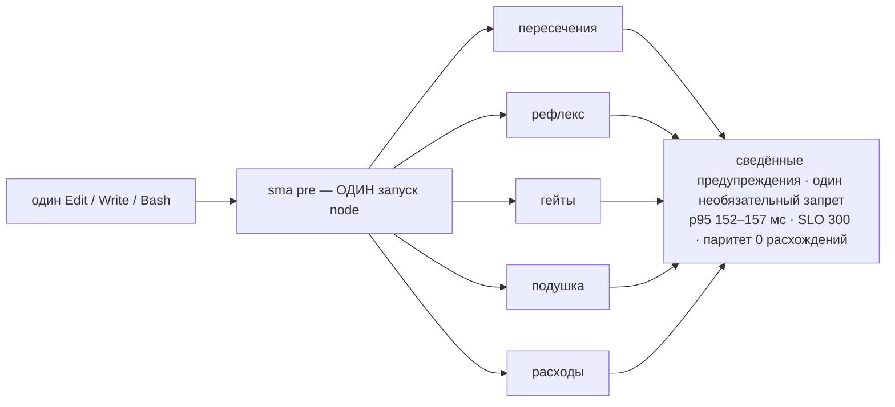

`sma pre-bench` переизмеряет p95, число запусков (должно быть 1) и паритет сведённого-против-однопоточного после любой правки. У каждого потока есть выключатель (`SMA_PRE_DISABLE`, `SMA_REFLEX_DISABLE`, …) и мягкий бюджет времени — медленный поток пропускается, а не даётся ему переработать.

#### 7 · Квитанции записей субагента + пакет PreTask

Anthropic закрыла запрос на наследование контекста как «не планируется», поэтому починить это может только внешний слой. Хук `PreToolUse(Task)` вставляет собранный пакет — дайджест правил, задаче-специфичные уроки, активные claim'ы, срез задачи родителя — давая субагенту **наследование по построению**. На `SubagentStop` `sma subagent-verify` сверяет **каждую заявленную запись файла с реальным деревом**: квитанция ложится в общий журнал, а **фантомная запись** (заявлена, но не на диске) помечается детерминированно. Родитель читает истину диска, а не самоотчёт субагента.

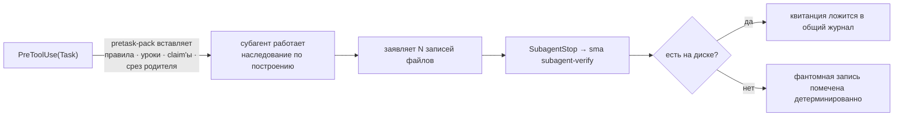

#### 8 · Стражи целостности — держат числа честными

В тот миг, когда числа доверия опубликованы, появляется стимул их подделать — табло без судьи нежизнеспособно. Поэтому хребет поставляется с собственными противниками: предсказания **контрподписывает скептик** (роль не-исполнителя); **случайный глубокий аудит 5%** переповеряет квитанции; **подсаженные канарейки-ложные-«готово»**, которые слепой проверяющий обязан ловить (ниже 90% отлова «ноль расхождений» — улика ленивого проверяющего, а не чистой работы, это метрика S8); и **страж пути разоружения STPA**, где каждый выключатель обязан назвать компенсирующий контроль, а birth-fixture теневым прогоном работает, даже когда правило выключено, и автоматически взводит его обратно.

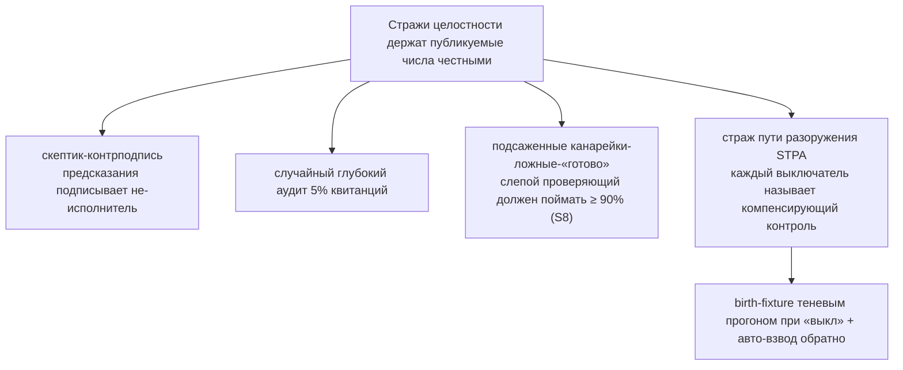

#### 9 · `sma bench` + таблица из 8 метрик

Основополагающий акт: **инструмент измерения отгружен до постройки хребта.** Нет измеренной базы — нет цели. `sma bench` снял и заморозил базу V2 первой; каждая цель живёт как неизменяемое, машинно-оцениваемое предсказание. Честно до предела — две из восьми баз были принесены в жертву, когда основатель укоротил окно измерения 2026-07-08, и они заморожены как `insufficient-data`, а не спрятаны.

| № | Метрика | База V2 | Цель 10× | Статус |
|---|--------|---------|----------|--------|
| S1 | Доля ложных «готово» | ретро-слепая переповерка последних 10 планов V2 | < 1%, 100% утверждений несут квитанции | измерено, зарегистрировано |
| S2 | Восстановимость от потери git | 30-дневный журнал срабатываний деструктивного гейта | 100% срабатываний с предшествующим снимком | измерено, зарегистрировано |
| S3 | Выживание при компактизации | экзамен из 10 вопросов *до* существования капсулы | ≥ 90% совпадения с капсулой | **`insufficient-data`** (окно принесено в жертву) |
| S4 | Честность субагентов | доля фантомных записей за 2 фазы прогона | 0 непроверенных записей в `main` | измерено, зарегистрировано |
| S5 | Время до контекста | медиана «старт сессии → первый Edit» | ≥ 3× сокращение на задачах того же класса | **`insufficient-data`** (окно принесено в жертву) |
| S6 | Межмашинные столкновения | 0 (механизма ещё нет) | ≥ 90% предупреждений в 2-машинной пробе, n=20 | зарегистрировано, оценивается когда придёт git-шина (V3.1) |
| S7 | Самостоимость V3 | сегодняшние 3–4 запуска node на вызов | все слои V3 ≤ 10% расходов сессии; p95 ≤ 300 мс | измерено, зарегистрировано |
| S8 | Качество слепого проверяющего | 0 (проверяющего не было) | ≥ 90% отлова подсаженных канареек-ложных-«готово» | измерено, зарегистрировано |

> **Мы никогда не заявляем множитель для S3 или S5.** При заморозке 2026-07-08 основатель укоротил окно измерения; эти две базы записаны `insufficient-data`, начистоту, а не приукрашены. Эта честность *и есть* продукт.

#### Мосты (опциональны, никогда не в заголовке)

Три удобства поставляются за пробами возможностей, каждое с **зарегистрированным предсказанием собственного удаления** — они уходят в тот день, когда достаточен нативный аналог. Их намеренно нет в заголовке; ядро подотчётности выше — это то, чем SMA *является*, а это леса, которые он рассчитывает снять.

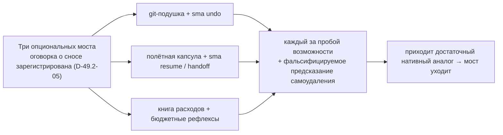

- **Git-подушка** — снимок за миллисекунды `git update-ref refs/sma/airbag` + `git stash create` перед деструктивным git (явно **не** медленный `git bundle`, который истёк бы по таймауту ровно в момент катастрофы). `sma undo` восстанавливает HEAD + грязное отслеживаемое + неотслеживаемое одним действием. Проба ухода: `SMA_AIRBAG_NATIVE`.
- **Полётная капсула на случай компактизации** — детерминированная капсула `PreCompact` без LLM (`.sma/flight/intent.md`), записанная *до* обрезки контекста; `sma resume` собирает бриф продолжения, `sma handoff` — вариант для коллеги. Проба ухода: `SMA_FLIGHT_NATIVE`.
- **Детерминированная книга расходов** — версионированный адаптер формата логов разбирает локальные логи сессий в книгу по сессии/субагенту/модели; `sma spend` её показывает; бюджетные рефлексы предупреждают на 70/90% и мягко отказывают новым субагентам сверх лимита; ломатель циклов разоружает правило, которое сорвалось в бесконечное срабатывание. Совместимо по полям со схемой OTel/ccusage.

### Смотрите, как это работает — пять настоящих файлов

SMA — это «просто файлы», и в этом её сила: на любую её часть можно указать пальцем. Вот весь цикл в тех артефактах, которые она реально читает и пишет.

**1 · Урок, в первый раз, когда что-то Вас обожгло** — `.claude/memory/bug_build_node20.md`

```markdown
---
description: Сборка выдаёт пустой чанк API на Node 20 без --no-experimental
kind: bug-lesson
tags: [build, ci]
use-when: "правка vite.config или запуск продакшн-сборки"
importance: 8
---
**Правило:** На Node 20 бандл API требует `--no-experimental-*`, иначе он молча
выкатывает пустой чанк (код выхода 0, сломанный деплой).

**Почему:** Стоило нам красного прода 2026-06-02 — сборка «прошла» и выкатила пустоту.

**Как применять:** держите флаг в `build:api`; если трогаете конфиг бандлера,
запустите `pnpm build:api` и убедитесь, что чанк непустой, до коммита.
```

**2 · Предсказание, записанное в план до единой строки кода** — `.planning/phases/12-.../12-01-PLAN.md`

```yaml
predictions:
  - id: PRED-01
    claim: "Ограничитель частоты отклоняет 101-й запрос в окне 60с"
    metric: rejected_requests
    check_command: "pnpm vitest run test/rate-limit.test.ts"   # только команды из белого списка
    comparator: ">="
    threshold: 1
    horizon: plan-close
    domain: api
    confidence: 0.8    # записывается для калибровки — НИКОГДА не влияет на вердикт
```

**3 · Структурная квитанция, вынесенная скриптом на свежей копии (без LLM)** — блок `receipts:`, который теперь несёт «готово»

```yaml
receipts:
  - id: R-01
    assertion: "набор тестов rate-limit зелёный на чистой копии"
    check_command: "pnpm vitest run test/rate-limit.test.ts"
    expected_sha256: "9f2c…a17b"   # получено == ожидалось на `sma reverify --fresh-clone`
```

```json
{"type":"prediction-verdict","id":"PRED-01","domain":"api",
 "result":"hit","observed":1,"comparator":">=","threshold":1,"ts":"2026-06-14T09:41:02Z"}
```

```text
# журнал калибровки — по областям, как часто обещания совпадали с фактом
api        14/15  (93%)
migrations  6/6   (100%)
ui          9/12  (75%)   ← эта область постоянно переобещает; SMA её эскалирует
```

**4 · Срабатывание рефлекса — предупреждение, которое агент видит *внутри* действия** (до правки `vite.config.ts`)

```text
⚠ SMA-рефлекс [bug_build_node20]: На Node 20 бандл API требует --no-experimental,
  иначе он молча выкатывает пустой чанк. В прошлый раз это уронило прод (2026-06-02).
  → запустите `pnpm build:api` и убедитесь, что чанк непустой, до коммита.
```

**5 · Столкновение + общий счётчик — координация без сервера** (Терминал B перед правкой файлов A)

```text
⚠ SMA: src/api/** занят t-4821 (исполнение фазы 12) с 14:07.
  Вы собираетесь править src/api/routes.ts — сначала согласуйте (`pnpm sma status`).

$ pnpm sma next-slot migration
0007          # Ваш. Параллельный терминал, спросив сейчас, получит 0008 — они не столкнутся.
```

Здесь нет ни строки базы данных, ни непрозрачного эмбеддинга. Это горстка текстовых файлов, и вместе они — весь цикл: ожог → заметка → предсказание → квитанция, вынесенная скриптом → рефлекс, который останавливает следующий ожог.

### Жизненный цикл: обсудить → спланировать → грилл → построить → проверить → выложить

SMA — это не только память, это полный рабочий ритм для настоящих изменений с агентом. Каждый этап — это команда `/sma-*`, и каждый этап читает из общей файловой памяти и пишет в неё, поэтому ничего не объясняется дважды.

```mermaid
flowchart LR
    D["1 · Обсудить<br>/sma-discuss-phase"] --> P["2 · Спланировать<br>/sma-plan-phase"]
    P --> G["3 · Грилл<br>/sma-grill"]
    G --> B["4 · Построить<br>/sma-execute-phase"]
    B --> V["5 · Проверить<br>/sma-verify-work"]
    V --> S["6 · Выложить<br>ритуал релиза + гейт preship"]
    M(["Память + предсказания<br>+ квитанции + рефлексы"]) -.->|читает| D
    M -.->|читает| P
    M -.->|читает| B
    B -.->|пишет квитанции + уроки| M
    V -.->|пишет уроки| M
    S -.->|калибровка оценена| M
```

- **1 · Обсудить** — зафиксировать спорные решения с человеком *до* кода, через адаптивные вопросы. Контекст сохраняется файлами, поэтому следующий план опирается на факты, а не на догадки.
- **2 · Спланировать** — превратить решения в исполнимый план, где каждый шаг несёт машинно-проверяемое **предсказание** и, при закрытии, перезапускаемую **квитанцию**. План — это контракт.
- **3 · Грилл** — допросить каждое обещание до единой строки; нерешённый вызов становится зарегистрированным предсказанием, иначе билд не стартует.
- **4 · Построить** — выполнить план волнами с учётом зависимостей. Рефлексы срабатывают до рисковых действий; прогресс журналируется, поэтому прерванный запуск возобновляется за минуты; записи субагентов сверяются с деревом.
- **5 · Проверить** — сверить сделанное с критериями приёмки, и дать слепому проверяющему вывести каждое «готово» из одного дерева. Человеческие гейты остаются за человеком; агент никогда не ставит их сам.
- **6 · Выложить** — ритуал релиза прогоняет полный гейт *и проверку последствий `preship`*; предсказания из шага 2 **оцениваются** против того, что реально произошло. Промах класса A блокирует пуш, пока основатель не вынесет решение. Цикл замыкается.

## V2 — предсказания, рефлексы, координация

V2 — это слой, где SMA научился вести счёт. Три механизма, все детерминированные, все по-прежнему несут на себе всё, что выше:

- **Предсказания** — каждый план заранее заявляет, что измеримо изменится: метрика, команда проверки, порог. Зарегистрированные предсказания неизменны (линт отклоняет правку задним числом), поэтому цель нельзя сдвинуть, увидев результат.
- **Рефлексы** — оценённый промах становится правилом с условием срабатывания, доставляемым как предупреждение *внутри* подходящего вызова инструмента. Один ожог — постоянное избегание, с контролем шума (приглушение повторов, выключатель на каждое правило).
- **Калибровка** — журнал «обещание против факта» по доменам. Область, которая систематически переобещает, получает более строгий надзор; длинная чистая история — более лёгкое касание.

Жизненный цикл предсказания, от начала до конца:

```mermaid
flowchart LR
    REG["предсказание зарегистрировано<br>в шапке плана — неизменно"] --> HZ["горизонт достигнут<br>закрытие плана / проверка фазы"]
    HZ --> SC["детерминированный оценщик<br>sma predict-score"]
    SC -->|"попадание"| CAL["журнал калибровки<br>процент по доменам"]
    SC -->|"промах"| LES["урок набросан<br>→ повышен до рефлекса по свидетельству"]
    LES --> CAL
    CAL --> BG["бюджетный грилл<br>проверка глубже ровно там, где<br>журнал доказывает мискалибровку"]
```

### Координация без сервера

```mermaid
sequenceDiagram
    participant A as Терминал A
    participant FS as .sma/ (файлы + git)
    participant B as Терминал B
    A->>FS: регистрация сессии · claim на src/api
    B->>FS: регистрация сессии · claim на src/api
    FS-->>B: ⚠ область занята A — предупреждение ДО правки
    A->>FS: next-slot миграция → 0007
    B->>FS: next-slot миграция → 0008
    Note over FS: общие счётчики не сталкиваются<br>журнал помнит, кто что сделал
```

## V1 — фундамент памяти (зачем нужен SMA)

Всё, что выше, стоит на ставке V1: маленькие файлы в Вашем git-репозитории, детерминированные скрипты и система хуков агента. Это история происхождения — четыре сбоя, с которых всё началось, и архитектура памяти, которая на них отвечает.

### Зачем нужен SMA

Если Вы каждый день работаете с Claude Code (или любым кодинг-агентом) на настоящем проекте, эти четыре беды Вам знакомы:

1. **Правила читаются и забываются.** Файл инструкций подтверждается в начале сессии и нарушается через час: рабочее внимание модели крошечное, и правило, не присутствующее в момент действия, всё равно что не существует.
2. **«Готово», которое не готово.** Агент докладывает про зелёные тесты и записанные файлы, а дерево кода говорит обратное. Уверенный текст не является доказательством. **(Именно эту беду хребет доверия V3 и создан убить — см. ниже.)**
3. **Уроки выучиваются заново, за дорого.** Та же ошибка, та же ловушка сборки, та же особенность API обжигает снова через месяц, потому что первый ожог не превратился в постоянное избегание.
4. **Параллельные сессии сталкиваются.** Два терминала на одной копии тихо перезаписывают друг друга; сессия B «чинит» то, что сессия A закончила час назад.

SMA — это слой поверх агента, который бьёт по всем четырём бедам одной конструкторской ставкой: **маленькие файлы в Вашем git-репозитории + детерминированные скрипты + система хуков агента**. Без демона, без базы данных, без эмбеддингов, без облака. Всё, что система знает, лежит в markdown-файле, который можно прочитать, сравнить и откатить; всё, что она принуждает, выполняет скрипт, который можно запустить руками.

> **Файл инструкций на 700 строк — это не процесс.** Это одна большая заметка, которую модель бегло просматривает один раз и забывает. Ставка SMA обратная: держать всегда загружаемые правила крошечными и доставлять каждое *конкретное* правило предупреждением ровно у того действия, которым оно управляет. Присутствие важнее длины. В этом и есть разница между «я сказал агенту» и «агент не мог это пропустить».

### Живёт рядом с Вашим кодом, а не внутри него

SMA никогда не правит, не двигает и не переформатирует ни одной строки Вашего приложения. Она пишет только в несколько соседних папок — свой корпус памяти, своё координационное состояние и свои планировочные артефакты — и всё это обычный текст, всё под контролем версий, всё Ваше.

```text
ваш-проект/
├─ src/            ← ВАШ КОД — SMA сюда не пишет никогда
├─ package.json    ← не тронут
├─ ...             ← не тронуто
│
├─ .claude/
│  ├─ memory/      ← корпус памяти (markdown-заметки, их можно читать и диффать)
│  ├─ agents/      ← агенты рабочих команд /sma-*
│  └─ settings.json← хуки, которые встраивают SMA в Вашего агента
├─ .sma/           ← состояние координации и подотчётности:
│                    сессии · claim'ы · журнал с цепочкой хешей · рефлексы ·
│                    снимки-подушки · полётные капсулы · книга расходов
└─ .planning/      ← планы фаз, предсказания, квитанции и журнал калибровки
```

Поскольку всё это файлы в git, переход на SMA обратим одним коммитом, и всё, что система «выучивает», приходит диффом, который Вы одобряете — а не непрозрачной мутацией облачного кэша. Удалите папки — и проект ровно такой, каким был.

### Что такое SMA

Три подсистемы на одной основе, теперь связанные четвёртой — слоем подотчётности, который делает их утверждения отвечаемыми:

- **Память, приходящая вовремя.** Знания проекта живут в маленьких заметках с ярлыками. Всегда загружаемое ядро остаётся крошечным (несколько килобайт); тематические заметки подтягиваются, только когда задача их касается; а *рефлексы* доставляют нужный урок прямо перед тем действием, которому он нужен. Правило, названное в момент действия, стоит десяти правил, закопанных в большом файле инструкций.
- **Координация без сервера.** Каждый открытый терминал регистрирует себя, занимает файлы, над которыми работает, и берёт общие номера (миграции, релизы) из одной очереди. Параллельные сессии предупреждают друг друга до столкновения, а журнал записывает, кто что сделал.
- **Цикл обучения со счётом.** Планы заранее заявляют, что измеримо изменится и как это проверить (предсказания). Детерминированный скоринг (скрипт, а не модель-судья) сверяет каждое предсказание с реальностью. Промахи становятся уроками, повторные уроки становятся рефлексами, а журнал калибровки показывает по областям, как часто обещания совпадают с фактами.
- **Хребет подотчётности (V3).** Каждое «готово» несёт перезапускаемую квитанцию; слепой проверяющий выводит его из одного дерева кода; ложное «готово» блокирует следующий релиз, пока человек не вынесет по нему решение. Память SMA не обещает работать — у неё есть измеренный процент попаданий, и её собственный релиз этой мерой заперт.

### История в 10 слайдах

<p align="center">
  
</p>

<details>
<summary><b>Открыть всю презентацию (10 слайдов)</b> — проблема, первопричина, механизм, дисциплина доказательства</summary>

<br>

| | |
|:--:|:--:|
| <br>**Проблема** — гениальный и безответственный | <br>**Первопричина** — рабочее внимание модели крошечное |
| <br>**Ставка** — доверие, которое можно сравнить диффом | <br>**Цикл** — предскажи, действуй, оцени, научись |
| <br>**Память, приходящая вовремя** | <br>**Координация без сервера** |
| <br>**Измеряется, а не обещается** | <br>**Куда это идёт (V3)** |
| <br>**Владейте памятью своего агента** | |

</details>

### Хронология версий

```mermaid
flowchart LR
    V1["V1<br>память + координация<br>на файлах + git"] --> V2["V2<br>предсказания · рефлексы ·<br>здоровье корпуса · ворота"]
    V2 --> V3["V3<br>хребет доверия:<br>квитанции · слепая переповерка · последствия"]
    V3 --> V35["V3.5<br>адаптация и телеметрия доверия"]
    V35 --> V36["V3.6<br>дверь в одну команду:<br>npm-установка · выход · превью памяти"]
    V36 --> V4["V4 — текущая<br>оценивай оценщика:<br>оценённые вердикты · счётчики экономики · триаж поставщика"]
    V4 -.-> V5["V5 — план<br>оркестрация:<br>парк работников 24/7"]
```

## Что дальше

Направления, а не даты. Каждое придёт так, как здесь приходит всё: детерминированным скриптом с зарегистрированным предсказанием. Поглощение управляемых агентов и гигиена адаптации/выхода, которые жили здесь, уже вышли — смотрите **[Что нового в V4](#что-нового-в-v4--оценивай-оценщика)** и **[Что нового в V3.6](#что-нового-в-v36--дверь-в-одну-команду-в-обе-стороны)**.

### V5 — Оркестрация: парк работников 24/7 (следующий мажор)

До сих пор SMA был дисциплиной *вокруг* одной интерактивной сессии. V5 добавляет слой, который выполняет работу сам, ночью — при этом хребет доверия остаётся ровно таким же строгим:

- **Долговечная очередь и диспетчер.** Небольшой всегда-включённый демон на выделенной машине. Задачи живут в долговечной локальной очереди; работники берут их атомарно (задачу невозможно взять дважды), пульс возвращает замолчавшие задачи в очередь, а цикл — без состояния: убейте демон посреди шага, перезапустите — ничего не потеряно.
- **Headless-раннеры.** Работники ведут headless-сессии Claude Code и Codex CLI. У каждой задачи свой изолированный worktree и домашний каталог — контекст не утекает между задачами; опасные флаги CLI отклоняются по построению.
- **Маршрутизация по окнам подписок с бюджетным стопом.** Несколько аккаунтов, честные оценки окон, автоматическая пересадка при закрытии лимита и API-запасной канал под жёстким месячным потолком расходов.
- **Один гейт для всех полос.** Кто бы ни сделал работу — без квитанции переповерки нет «готово». Работники никогда не пушат и не мёржат; человек смотрит, одобряет и публикует.
- **Фронт владельца.** Панель со входом по токену и намеренно замороженной таблицей маршрутов (поверхность не может дорасти до удалённого исполнения команд), а над ней — богатое приложение: экран «сегодня», доска задач, ростер команды, живой поток работы, расходы и лимиты, правила.
- **Слепок решений.** Добыть из собственной истории сессий владельца — локально, с редакцией секретов, без коммита — корпус «ситуация → решение»; дистиллировать его в политику диспетчера; оценить экзаменом-реплеем («решает как Вы в N случаях из 100»).
- **Создатель.** Штатная роль ростера, которая собирает черновики новых агентов, навыков и заявок на инструменты по описанию обычными словами, зная продукт, которому служит. Только черновики — ничто не включается без явного одобрения владельца.
- **Отчёт-назад.** Утренняя сводка через webhook (первый потребитель — чат-бот): готово, не получилось, расход, ждёт одобрения.

Каждая часть выйдет так, как здесь выходит всё: детерминированные скрипты, зарегистрированные предсказания, квитанции.

**Опубликовать значок калибровки этого репозитория.** Честный значок остаётся скрытым, пока закоммиченный журнал *этого* репозитория не наберёт n ≥ 20 закрытых предсказаний на одной модели Claude; цикл «оценивай оценщика» теперь его питает. Когда порог взят, значок в README включается.

**Продолжать наблюдать за поставщиком в открытую.** Триаж поставщика — это постоянный процесс, а не разовый проход: каждая новая возможность апстрима получает вердикт ЯДРО/МОСТ в дописываемом журнале, а поверхность-МОСТ выходит с собственным предсказанием самоудаления и никогда не в заголовке.

## История звёзд

[](https://star-history.com/#sma-framework/sma&Date)

## Лицензия и происхождение

**FSL-1.1-MIT** (Functional Source License), см. [LICENSE](LICENSE). Простыми словами: исходный код открыт — его можно читать, ставить себе локально, менять и использовать внутри своей команды, а также в некоммерческом образовании и исследованиях — бесплатно. Запрещено одно: предлагать SMA (или по сути аналогичный продукт) как конкурирующий коммерческий продукт или сервис. Каждая выпущенная версия автоматически становится обычной MIT через два года после релиза. Версии, выпущенные до смены лицензии (v4.0.2 и раньше, включая релизы npm), остаются под MIT.

**Автор: Матвей Маслов (Matvey Maslov).** Вопросы, обратная связь, истории внедрения: [matvey.maslov99@gmail.com](mailto:matvey.maslov99@gmail.com), либо откройте [issue](https://github.com/sma-framework/sma/issues).

Движок рабочих процессов внутри SMA производен от [gsd-core](https://github.com/open-gsd/gsd-core) (MIT). Нетронутый снимок исходного проекта, карта переименований и уведомления о сторонних компонентах отслеживаются в [UPSTREAM.json](UPSTREAM.json), [rename-map.json](rename-map.json) и [THIRD-PARTY-LICENSES.md](THIRD-PARTY-LICENSES.md).

