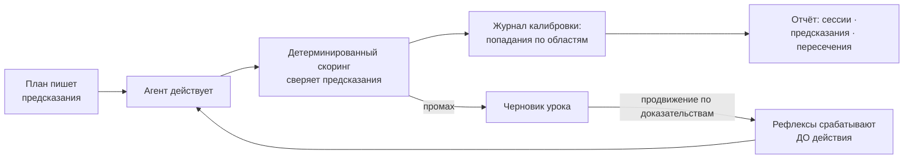
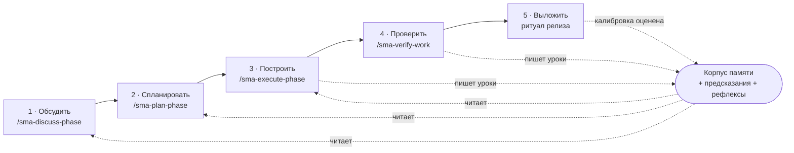
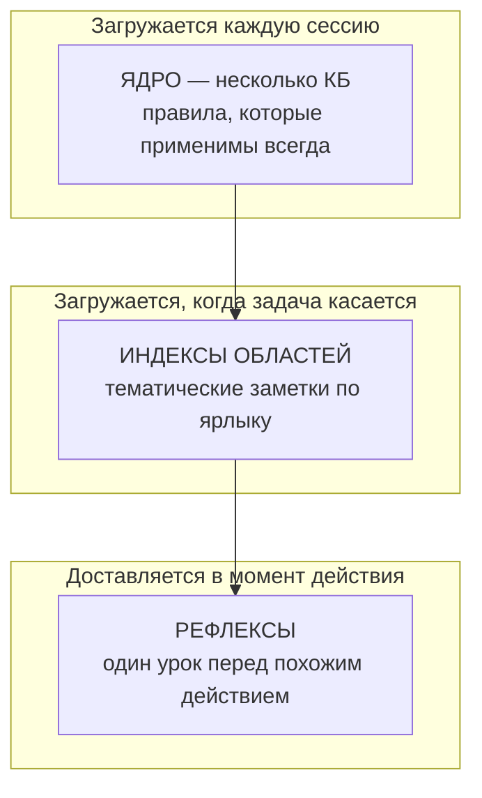
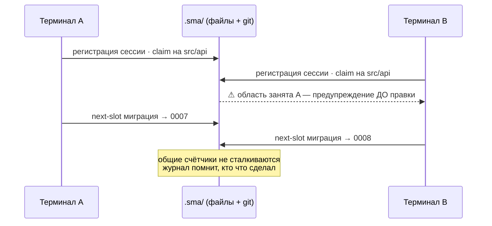
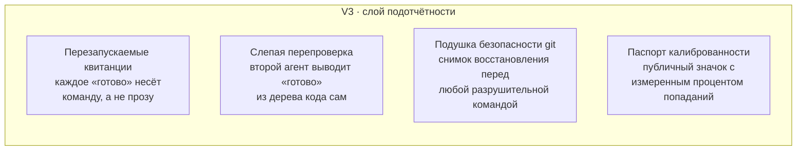

<p align="center">
  
</p>

<p align="center">
  <a href="LICENSE"></a>
  
  
  
</p>

# SMA — Shared Memory & Automation

**Слоистая память и координация терминалов для ИИ-агентов, пишущих код, с циклом обучения, который измеряется, а не предполагается.**

[English version → README.md](README.md)

## Зачем нужен SMA

Если Вы каждый день работаете с Claude Code (или любым кодинг-агентом) на настоящем проекте, эти четыре беды Вам знакомы:

1. **Правила читаются и забываются.** Файл инструкций подтверждается в начале сессии и нарушается через час: рабочее внимание модели крошечное, и правило, не присутствующее в момент действия, всё равно что не существует.
2. **«Готово», которое не готово.** Агент докладывает про зелёные тесты и записанные файлы, а дерево кода говорит обратное. Уверенный текст не является доказательством.
3. **Уроки выучиваются заново, за дорого.** Та же ошибка, та же ловушка сборки, та же особенность API обжигает снова через месяц, потому что первый ожог не превратился в постоянное избегание.
4. **Параллельные сессии сталкиваются.** Два терминала на одной копии тихо перезаписывают друг друга; сессия B «чинит» то, что сессия A закончила час назад.

SMA — это слой поверх агента, который бьёт по всем четырём бедам одной конструкторской ставкой: **маленькие файлы в Вашем git-репозитории + детерминированные скрипты + система хуков агента**. Без демона, без базы данных, без эмбеддингов, без облака. Всё, что система знает, лежит в markdown-файле, который можно прочитать, сравнить и откатить; всё, что она принуждает, выполняет скрипт, который можно запустить руками.

## Что такое SMA

Три подсистемы на одной основе:

- **Память, приходящая вовремя.** Знания проекта живут в маленьких заметках с ярлыками. Всегда загружаемое ядро остаётся крошечным (несколько килобайт); тематические заметки подтягиваются, только когда задача их касается; а *рефлексы* доставляют нужный урок прямо перед тем действием, которому он нужен. Правило, названное в момент действия, стоит десяти правил, закопанных в большом файле инструкций.
- **Координация без сервера.** Каждый открытый терминал регистрирует себя, занимает файлы, над которыми работает, и берёт общие номера (миграции, релизы) из одной очереди. Параллельные сессии предупреждают друг друга до столкновения, а журнал записывает, кто что сделал.
- **Цикл обучения со счётом.** Планы заранее заявляют, что измеримо изменится и как это проверить (предсказания). Детерминированный скоринг (скрипт, а не модель-судья) сверяет каждое предсказание с реальностью. Промахи становятся уроками, повторные уроки становятся рефлексами, а журнал калибровки показывает по областям, как часто обещания совпадают с фактами. Память SMA не обещает работать: у неё есть измеренный процент попаданий.

## История в 10 слайдах

<p align="center">
  
</p>

<details>
<summary><b>Открыть всю презентацию (10 слайдов)</b> — проблема, первопричина, механизм, дисциплина доказательства</summary>

<br>

| | |
|:--:|:--:|
| <br>**Проблема** — гениальный и безответственный | <br>**Первопричина** — рабочее внимание модели крошечное |
| <br>**Ставка** — доверие, которое можно сравнить диффом | <br>**Цикл** — предскажи, действуй, оцени, научись |
| <br>**Память, приходящая вовремя** | <br>**Координация без сервера** |
| <br>**Измеряется, а не обещается** | <br>**Куда это идёт (V3)** |
| <br>**Владейте памятью своего агента** | |

</details>

## Как крутится цикл



Один ожог — постоянное избегание: ребёнок один раз трогает кипяток. Промах записывается, записанный урок получает спусковой крючок, и крючок срабатывает предупреждением перед следующим похожим действием, в каждом терминале, навсегда. А поскольку скоринг делает скрипт, цикл не может себе льстить.

## Жизненный цикл: обсудить → спланировать → построить → проверить → выложить

SMA — это не только память, это полный рабочий ритм для настоящих изменений с агентом. Каждый этап — это команда `/sma-*`, и каждый этап читает из общей файловой памяти и пишет в неё, поэтому ничего не объясняется дважды.



- **1 · Обсудить** — зафиксировать спорные решения с человеком *до* кода, через адаптивные вопросы. Контекст сохраняется файлами, поэтому следующий план опирается на факты, а не на догадки.
- **2 · Спланировать** — превратить решения в исполнимый план, где каждый шаг несёт машинно-проверяемое **предсказание** (что изменится и какая команда это докажет). План — это контракт.
- **3 · Построить** — выполнить план волнами с учётом зависимостей. Рефлексы срабатывают до рисковых действий; прогресс журналируется, поэтому прерванный запуск возобновляется за минуты, а не с нуля.
- **4 · Проверить** — сверить сделанное с критериями приёмки в форме разговора. Человеческие гейты остаются за человеком; агент никогда не ставит их сам.
- **5 · Выложить** — ритуал релиза прогоняет полный гейт, и предсказания из шага 2 **оцениваются** против того, что реально произошло. Промахи становятся следующими уроками. Цикл замыкается.

## Память в трёх слоях

Не один большой файл инструкций, а три уровня: всегда загружаемый бюджет остаётся крошечным, и при этом ничего не забывается.



Авто-очистка никогда не удаляет — она *понижает* заметку по слоям, поэтому система становится легче, ни разу не теряя факт (в собственном прогоне этого репозитория всегда загружаемый индекс уменьшился с 46 КБ до 5 КБ с полным сохранением вспоминания, под контролем постоянного экзамена).

## Координация без сервера



## Установка

Основной путь:

```bash
npx sma-framework init
```

Запасной путь через git clone (доступ к реестру пакетов не нужен): клонируйте куда угодно, затем запустите установщик **из папки Вашего проекта** (установку внутрь самого клона установщик отклонит):

```bash
git clone https://github.com/sma-framework/sma.git ../sma-clone
cd <ваш-проект>
node ../sma-clone/bin/init.mjs --local
```

Оба пути запускают один и тот же установщик без зависимостей. Флаги (`--global`, `--with-gsd-aliases` и другие), полный список устанавливаемых файлов и шаги удаления описаны в [docs/INSTALL.md](docs/INSTALL.md).

## Быстрый старт

Откройте сессию Claude Code в Вашем проекте и выполните:

```
/sma-start
```

Вводный разговор объяснит систему, засеет стартовый корпус памяти и каркас проекта, а также запишет Ваш инфраструктурный профиль (Ваш деплой-хост, Ваш ритуал релиза), чтобы все дальнейшие команды говорили на языке Вашего стека. После этого каждая новая сессия регистрирует себя сама и загружает ядро памяти прежде, чем что-либо делать.

## Команды

| Команда | Что делает |
|---|---|
| `/sma-start` | Первый запуск: объясняет систему, засевает корпус памяти и инфраструктурный профиль |
| `/sma-discuss-phase` | Обсудить фазу: собрать контекст через адаптивные вопросы до планирования |
| `/sma-plan-phase` | Составить подробный план фазы с циклом проверки |
| `/sma-execute-phase` | Выполнить все планы фазы волнами, с параллелизацией |
| `/sma-verify-work` | Проверить сделанное вместе с Вами, в форме разговора |
| `/sma-quick` | Быстрая задача с гарантиями SMA (атомарные коммиты, учёт состояния), без лишних агентов |
| `/sma-fast` | Тривиальная задача прямо в сессии: без субагентов и без планирования |
| `/sma-debug` | Системная отладка с сохранением состояния между сессиями |
| `/sma-progress` | Где мы: прогресс, следующий шаг, свободный запрос |
| `/sma-resume-work` | Продолжить работу прошлой сессии с полным восстановлением контекста |
| `/sma-pause-work` | Передать контекст при паузе посреди фазы |
| `/sma-help` | Показать доступные команды и справку |

Под капотом работает координационный CLI (`node scripts/sma/cli.mjs` или `pnpm sma`): `status`, `claim`, `next-slot`, `load`, `lint` и другие. Сессии и хуки вызывают его сами; при желании Вы можете вызывать его напрямую.

## Шесть столпов

- **Предсказания** — каждый план заранее заявляет, что измеримо изменится и как это проверить; детерминированный скоринг сверяет обещание с фактом при закрытии плана, а журнал калибровки показывает, в каких областях система ошибается чаще всего.
- **Рефлексы** — зафиксированный промах становится постоянным правилом, которое срабатывает до следующего похожего действия, как предупреждение внутри сессии. Один раз обжёгся, больше не трогает.
- **Здоровье корпуса** — линт, поиск противоречий, плановая консолидация и счётчики продвижения держат память острой на сотнях заметок, вместо того чтобы дать ей превратиться в шум.
- **Координация** — реестр сессий, заявки на файлы с предупреждением до правки, общие счётчики для всего, за что могут схлестнуться два терминала, и живой сигнал «идёт публикация».
- **Каркас** — журнал прогресса по каждому плану превращает гибель исполнителя в пятиминутное возобновление; детектор зависаний и волны с учётом зависимостей держат длинные запуски честными и параллельными.
- **Отчёт** — панель с сессиями, предсказаниями, срабатываниями рефлексов, пересечениями и здоровьем корпуса: состояние системы видно, а не предполагается.

## Чем SMA отличается

- **Подотчётность, а не только полезность.** Каждое заявление SMA о самом себе — заранее зарегистрированное предсказание, которое оценивает скрипт. Системы памяти обычно обещают вспоминание; SMA публикует свой процент попаданий.
- **Сначала детерминизм.** Выдача памяти управляется ярлыками и триггерами, принуждение — обычными скриптами, и весь цикл обучения работает без единого вызова LLM в горячем пути. Интеллект может сидеть сверху; корректность от него не зависит.
- **Родной для git и обратимый.** Заметки, журналы, книги учёта — файлы в Вашем репозитории. Самообучение приходит диффами, которые Вы просматриваете; всё выученное откатывается через `git revert`.
- **Никогда не блокирует.** Предупреждение не останавливает работу; мёртвый хук не вешает сессию. Жёсткие запреты остаются только за настроенной Вами защитой безопасности.
- **Ваше.** Корпус живёт в Вашем репозитории, путешествует с `git clone` и переносим на других агентов: это знание, которым владеете Вы, а не кэш поставщика.

## Дорожная карта — что дальше (V3)

V1 дал агентам память. V2 дал предсказания, рефлексы и координацию. **V3 заставляет агента перестать верить себе на слово** — то единственное, что поставщик модели не может отгрузить нейтрально, потому что не может беспристрастно проверять собственную работу. Четыре несущих элемента, каждый — детерминированный скрипт на уже готовой основе:



- **Перезапускаемые квитанции** — каждое заявление о выполнении несёт команду и ожидаемый слепок результата, который любой может перезапустить. Голословные заявления не проходят линт. «Готово» становится доказательством, а не утверждением.
- **Слепая перепроверка** — отдельный агент выводит каждое «готово» только из дерева кода, не видя отчёта исполнителя. Расхождение «заявлено: сдано / воспроизведено: нет» — самый тяжёлый сигнал в журнале.
- **Подушка безопасности git** — точка восстановления пишется *до* любой разрушительной команды, поэтому неверный `git reset --hard` или force-push превращается из потерянной работы в откат одной командой.
- **Паспорт калиброванности** — процент попаданий по областям и оценка вспоминания собираются в публичный значок README. Первая честная метрика доверия к агентной работе: память, которая публикует собственную точность.

Полный дизайн, оценённый и состязательно проверенный, живёт вместе с проектом. Это направление, а не обещание дат: выход идёт от доказательства к доказательству, по одной фальсифицируемой метрике за раз.

## История звёзд

[](https://star-history.com/#sma-framework/sma&Date)

## Лицензия и происхождение

MIT, см. [LICENSE](LICENSE).

**Создатель: Матвей Маслов (Matvey Maslov).**

Движок рабочих процессов внутри SMA производен от [gsd-core](https://github.com/open-gsd/gsd-core) (MIT). Нетронутый снимок исходного проекта, карта переименований и уведомления о сторонних компонентах отслеживаются в [UPSTREAM.json](UPSTREAM.json), [rename-map.json](rename-map.json) и [THIRD-PARTY-LICENSES.md](THIRD-PARTY-LICENSES.md).
