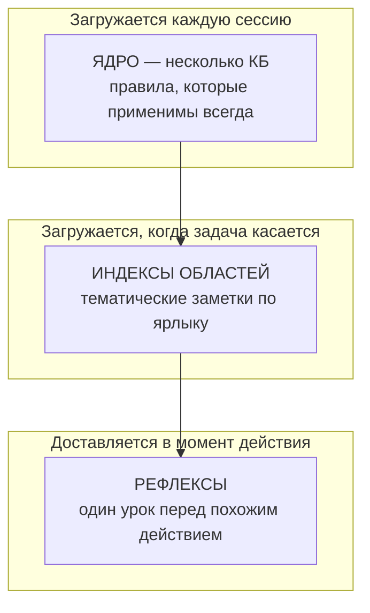

<p align="center">
  
</p>

<p align="center">
  
  
  
  <a href="LICENSE"></a>
  
  
</p>

# SMA — Shared Memory & Automation

**SMA — это local-first управляющий контур памяти и подотчётности для ИИ-агентов, пишущих код: он доставляет агенту нужное проектное знание в момент действия — и независимо проверяет его утверждения. Слоистая память, которая приходит вовремя; координация терминалов без сервера; каждое «готово» сводит скрипт, переповеряет слепой проверяющий, и оно блокирует релиз, если ложно.**

[English version → README.md](README.md)

> ### 🗺️ [Открыть живую карту системы →](https://sma-framework.github.io/sma/master-graph.html)
> Все подсистемы SMA на одной интерактивной странице — самый быстрый способ увидеть, как всё связано.

> ### 🧭 [Роадмап →](ROADMAP.md)
> Где SMA сейчас и что дальше: **оркестрация V5 (парк работников 24/7) → V5.1 работает с тем, что у вас есть + модель памяти 1.0 → V5.2 измеренная память → V5.3 управление + укреплённый парк.**

> **Это не плагин памяти.** Это рабочая дисциплина поставки настоящего кода с ИИ-агентом: память, которая приходит ровно в тот момент, когда нужна; координация, которая не даёт двум терминалам затирать друг друга; и, начиная с V3, **хребет доверия**, в котором каждое «готово» сводит скрипт, переповеряет слепой проверяющий, а ложное «готово» блокирует следующий релиз. Он пишет только в несколько папок рядом с Вашим кодом — **Ваше дерево исходников не трогается никогда** — и всё, что он знает или принуждает, это обычный файл, который можно прочитать, сравнить и откатить.

---

## Установка

Одна команда из корня Вашего проекта (ноль зависимостей: установщик написан только на встроенных модулях Node и печатает свою версию по ходу работы):

```bash
npx -y sma-framework@latest init
```

Это вся установка. Заодно она вшивает короткий managed-блок правил в CLAUDE.md Вашего проекта, чтобы агенты видели корпус памяти (Ваш собственный текст не трогается никогда), а выход симметричен входу: `/sma-deleteme` удаляет всё и СОХРАНЯЕТ `.claude/memory/`. Путь через клонирование, флаги (`--global`, `--with-gsd-aliases` и другие) и полный список устанавливаемых файлов описаны в [docs/INSTALL.md](docs/INSTALL.md).

## Быстрый старт

Откройте сессию Claude Code в Вашем проекте и выполните:

```
/sma-start
```

Вводный разговор объяснит систему, засеет стартовый корпус памяти и каркас проекта, а также запишет Ваш инфраструктурный профиль (Ваш деплой-хост, Ваш ритуал релиза), чтобы все дальнейшие команды говорили на языке Вашего стека. После этого каждая новая сессия регистрирует себя сама и загружает ядро памяти прежде, чем что-либо делать.

## До SMA → После SMA

Весь смысл SMA — во втором столбце. Тот же агент, та же модель — другая дисциплина вокруг них.

| | **Без SMA** | **С SMA** |
|---|---|---|
| **1 · Правило потеряно** | В инструкциях сказано: «каждое изменение схемы требует миграции». Через двадцать правок агент добавляет колонку и забывает. Выкатывается — запросы падают на деплое. | Как только агент трогает файл схемы, рефлекс срабатывает **внутри этого действия**: *«изменение схемы → нужна миграция (в прошлый раз это сломало прод)»*. Пропустить нельзя. |
| **2 · «Готово», которого нет** | *«Все тесты зелёные, готово.»* Вы забираете код, запускаете — три красных. Уверенный отчёт был единственным доказательством, и он был неверен. | План заранее записал проверку. При закрытии **скрипт** прогоняет её на свежей копии и пишет `hit` или `miss` в журнал. «Готово» — это перезапускаемая команда, а не фраза, и слепой проверяющий выводит его заново, ни разу не заглянув в отчёт агента. |
| **3 · Урок заново** | Тот же флаг сборки кусает третий месяц подряд. Каждое исправление жило лишь в одном закрытом чате; ничего не перенеслось вперёд. | Первый ожог записан заметкой с триггером. Каждая следующая сессия — и клон любого коллеги — получает предупреждение **до** повтора. Один ожог, постоянное избегание. |
| **4 · Два терминала столкнулись** | Терминал B правит `src/api`, пока Терминал A там же посреди рефактора. Push от B тихо откатывает час работы A; никто не замечает до CI. | B зарегистрировал сессию, а A **занял** `src/api`. Когда B идёт править, его предупреждают *до* нажатия клавиши — и оба взяли номера миграций из одной очереди, так что они не сталкиваются. |
| **5 · Отгружается ложное «готово»** | Отчёт сказал, что фича работает. Она не работала; регрессия доезжает до `main`, и следующий релиз несёт её с собой. | Расхождение класса A **автоматически блокирует `sma ship`**, пока основатель не запишет явное решение. Журнал дописываемый; агент не может простить себя сам. |

> **Честная оговорка.** На одиночной задаче SMA дороже: проверки и память не бесплатны. Его ставка это **цена правильного результата на многих задачах**, а не самый дешёвый одиночный прогон.

<!-- sma:positioning:start -->

## Как SMA сравнивается с аналогами

Поставщик модели не может нейтрально оценивать работу своего же агента. С Claude Outcomes эту мысль нужно заострить, а не убирать: поставщик теперь *может* проверять, потому что отдельно-контекстная оценка вышла как функция платформы. Чего он не может, так это пройти **аудит**. Оценка Outcomes это непрозрачный вердикт по рубрике: нет перезапускаемой квитанции, нет опубликованного трек-рекорда, нет последствия, когда она ошибается. Полоса SMA это слой аудита, который обязан пережить любой оценщик, их или наш, и именно эта полоса даёт SMA пережить поглощение платформой.

Поэтому сравнение намеренно честное, включая то, в чём каждый аналог лучше SMA:

| Инструмент | Охват | В чём лучше SMA | Что делает только SMA |
|------------|-------|-----------------|-----------------------|
| **Claude Outcomes** | платформа | Управляемые сессии, встроенный оценщик результата, ноль настройки | Детерминированные перезапускаемые квитанции, процент попаданий с привязкой к судье, и опровергнутое «satisfied», которое блокирует релиз, пока решение не вынесет человек |
| **claude-mem** | 86k★ | Ведущая механика памяти, отполированная среда SQLite | Оценивает, помогла ли память, и публикует процент попаданий |
| **Aider** repo-map | 47k★ | Детерминированный граф контекста с годами боевой проверки | Несёт корпус памяти и цикл обучения поверх графа |
| **Letta** / MemGPT | 24k★ | Богатая архитектура блоков памяти | Без базы, без сервера, и агент не оценивает сам себя |
| **ccusage** | 16.5k★ | Отличное наблюдение локальных трат | Сигнал трат управляет принуждением, а не только наблюдением |
| **BMAD** | 50k★ | Богатые шаблоны оркестрации | Слой проверки, поэтому утверждение обязано пережить скрипт |

**Чего SMA намеренно не делает:** нет демона, нет базы данных, нет эмбеддингов, нет облака, нет LLM в горячем пути. Всё это файлы и git (смотрите `pnpm sma explain substrate`). Корректность никогда не зависит от вызова модели.

**Сам оценщик тоже оценивается.** Каждый отдельно-контекстный вердикт, слепого проверяющего или вендорского оценщика, если он когда-нибудь будет использован, записывается, сверяется с фактом (откат, переделка, красный CI, отказ основателя), и ошибочное «satisfied» нельзя замять аудитом: оно блокирует релиз, пока человек не вынесет решение. Это и есть аудит, которого непрозрачная оценка дать не может.

Экономику держат на той же планке доказательств. Здесь бюджеты полос выводятся из *собственных* процентилей трат проекта, а не из вендорского бенчмарка; любой план может опубликовать квитанцию следа (footprint receipt): это арифметика git-diff против записанного заявления, а перерасход засчитывается как промах калибровки; полосы отгрузки ставят пуш на полный прогон тестов и безопасности, который быстрая полоса ослабить не может. Каждая экономия в паре с гарантией качества, а число публикуется только после того, как его оценили (смотрите `pnpm sma explain economy`).

Об адаптации сообщают честно, а не заявляют: реальный процент попаданий и размер выборки живут в значке калибровки и `PASSPORT.md`, пересобираемых каждый релиз и воспроизводимых на свежей копии. После смены модели значок прячется, пока не наберётся достаточно новых данных, поэтому он никогда не завышает тихо.

Три функции хребта доверия (git-подушка, книга трат и капсула перед компакцией) это мосты, которые более широкая экосистема вполне может поглотить, и это нормально; они не заголовок, заголовок это слой подотчётности. Два поглощаемых вендором кандидата остаются явными тревожными флажками WATCH, а не заголовками: межсессионный, включённый по умолчанию примитив agent-teams, и инструмент advisor, открытый внутри сессий; каждый несёт условие самоудаления, которое убирает наш мост в день, когда платформа его отгрузит.

<!-- sma:positioning:end -->

## Чем SMA отличается

- **Подотчётность, а не только полезность.** Каждое заявление SMA о самом себе — заранее зарегистрированное предсказание, которое оценивает скрипт и переповеряет слепой проверяющий. Системы памяти обещают вспоминание; SMA публикует свой процент попаданий и даёт ложному «готово» заблокировать собственный релиз.
- **Слой, который поставщик отгрузить не может.** Поставщик модели не может беспристрастно проверять работу собственного агента. SMA проверяет её снаружи — детерминированно, без LLM в горячем пути — именно поэтому она переживает поглощение платформой.
- **Сначала детерминизм.** Выдача памяти управляется ярлыками и триггерами, принуждение — обычными скриптами, и весь цикл обучения и проверки работает без единого вызова LLM в горячем пути. Интеллект может сидеть сверху; корректность от него не зависит.
- **Родной для git и обратимый.** Заметки, журналы, книги учёта, квитанции — файлы в Вашем репозитории. Самообучение приходит диффами, которые Вы просматриваете; всё выученное откатывается через `git revert`.
- **Никогда не блокирует.** Предупреждение не останавливает работу; мёртвый хук не вешает сессию; у каждого потока есть выключатель. Жёсткие запреты остаются только за настроенной Вами защитой безопасности и за законом последствий, который Вы включаете сами.
- **Ваше.** Корпус живёт в Вашем репозитории, путешествует с `git clone` и переносим на других агентов: это знание, которым владеете Вы, а не кэш поставщика.

## Память в трёх слоях

Не один большой файл инструкций, а три уровня: всегда загружаемый бюджет остаётся крошечным, и при этом ничего не забывается.



Каждая заметка несёт триггер `use-when` — именно эта строка позволяет SMA доставить её ровно у нужного действия, а не вываливать весь корпус в каждый промпт. Авто-очистка никогда не удаляет — она *понижает* заметку по слоям (в собственном прогоне этого репозитория всегда загружаемый индекс уменьшился с 46 КБ до 5 КБ с полным сохранением вспоминания). *Система никогда не забывает — она лишь меняет, насколько громко помнит.*

## Столпы

- **Предсказания** — каждый план заранее заявляет, что измеримо изменится и как это проверить; детерминированный скоринг сверяет обещание с фактом при закрытии плана, а журнал калибровки показывает, в каких областях система ошибается чаще всего.
- **Квитанции + слепая проверка (V3)** — каждое «готово» несёт перезапускаемую проверку с ожидаемым хешем; слепой проверяющий выводит его из одного дерева, и расхождение — самый тяжёлый сигнал в системе.
- **Последствия (V3)** — промах класса A не просто фиксируется, он *действует*: блокирует следующий релиз, пока человек не вынесет решение, из дописываемого журнала, который агент не может править.
- **Рефлексы** — зафиксированный промах становится постоянным правилом, которое срабатывает до следующего похожего действия. Один раз обжёгся, больше не трогает.
- **Здоровье корпуса** — линт, поиск противоречий, плановая консолидация и счётчики продвижения держат память острой на сотнях заметок, вместо того чтобы дать ей превратиться в шум. Диагностика говорит вслух: упавшая команда памяти печатает, что именно сломалось и почему, а корпус без реестра тегов всё равно собирает рабочий индекс, а не падает с ошибкой.
- **Координация** — реестр сессий, заявки на файлы с предупреждением до правки, общие счётчики для всего, за что могут схлестнуться два терминала, и живой сигнал «идёт публикация».
- **Каркас** — журнал прогресса по каждому плану превращает гибель исполнителя в пятиминутное возобновление; детектор зависаний, волны с учётом зависимостей и одно-запусковый мультиплексор `pre` держат длинные запуски честными, параллельными и дешёвыми.

## Живёт рядом с Вашим кодом, а не внутри него

SMA никогда не правит, не двигает и не переформатирует ни одной строки Вашего приложения. Она пишет только в несколько соседних папок — свой корпус памяти, своё координационное состояние и свои планировочные артефакты — и всё это обычный текст, всё под контролем версий, всё Ваше.

```text
ваш-проект/
├─ src/            ← ВАШ КОД — SMA сюда не пишет никогда
├─ package.json    ← не тронут
├─ ...             ← не тронуто
│
├─ .claude/
│  ├─ memory/      ← корпус памяти (markdown-заметки, их можно читать и диффать)
│  ├─ agents/      ← агенты рабочих команд /sma-*
│  └─ settings.json← хуки, которые встраивают SMA в Вашего агента
├─ .sma/           ← состояние координации и подотчётности:
│                    сессии · claim'ы · журнал с цепочкой хешей · рефлексы ·
│                    снимки-подушки · полётные капсулы · книга расходов
└─ .planning/      ← планы фаз, предсказания, квитанции и журнал калибровки
```

Поскольку всё это файлы в git, переход на SMA обратим одним коммитом, и всё, что система «выучивает», приходит диффом, который Вы одобряете — а не непрозрачной мутацией облачного кэша. Удалите папки — и проект ровно такой, каким был.

## Команды

Семейство рабочих команд `/sma-*` (запускаются внутри сессии Claude Code):

| Команда | Что делает |
|---|---|
| `/sma-start` | Первый запуск: объясняет систему, засевает корпус памяти и инфраструктурный профиль |
| `/sma-discuss-phase` | Обсудить фазу: собрать контекст через адаптивные вопросы до планирования |
| `/sma-plan-phase` | Составить подробный план фазы с циклом проверки |
| `/sma-grill` | Состязательно допросить каждое обещание плана до сборки |
| `/sma-execute-phase` | Выполнить все планы фазы волнами, с параллелизацией |
| `/sma-verify-work` | Проверить сделанное вместе с Вами, в форме разговора |
| `/sma-quick` | Быстрая задача с гарантиями SMA (атомарные коммиты, учёт состояния), без лишних агентов |
| `/sma-fast` | Тривиальная задача прямо в сессии: без субагентов и без планирования |
| `/sma-debug` | Системная отладка с сохранением состояния между сессиями |
| `/sma-progress` | Где мы: прогресс, следующий шаг, свободный запрос |
| `/sma-resume-work` | Продолжить работу прошлой сессии с полным восстановлением контекста |
| `/sma-pause-work` | Передать контекст при паузе посреди фазы |
| `/sma-help` | Показать доступные команды и справку |
| `/sma-deleteme` | Удалить SMA одним действием: команды, движок, хуки, statusline, managed-блоки; корпус памяти остаётся *(v3.6)* |

Под капотом работает координационно-подотчётный CLI (`pnpm sma`) — 83 команды, у каждой есть встроенный объяснитель (`pnpm sma explain <команда>`). Полный справочник живёт в [scripts/sma/README.md](scripts/sma/README.md).

---

## Глубже

Всё выше — это ядро. Детали лежат в одной ссылке:

- **[docs/DETAILS.ru.md](docs/DETAILS.ru.md)** — полный инженерный разбор: сравнение четырёх подходов бок о бок, подотчётный цикл в деталях, полные таблицы справочника CLI, галерея демо, интеграция хуков и вся история версий V1 → V4 с хребтом доверия процесс за процессом.
- **[ROADMAP.md](ROADMAP.md)** — оркестрация V5 и программа фундамента памяти (V5.1 → V5.3).
- **[docs/INSTALL.md](docs/INSTALL.md)** — флаги установки, список устанавливаемых файлов, удаление.
- **[scripts/sma/README.md](scripts/sma/README.md)** — каждая подкоманда CLI, флаг, событие хука и выключатель.
- **[PASSPORT.md](PASSPORT.md)** — паспорт калибровки: реальный процент попаданий и размер выборки, воспроизводимые на свежей копии.

## История звёзд

[](https://star-history.com/#sma-framework/sma&Date)

## Лицензия и происхождение

**FSL-1.1-MIT** (Functional Source License), см. [LICENSE](LICENSE). Простыми словами: исходный код открыт — его можно читать, ставить себе локально, менять и использовать внутри своей команды, а также в некоммерческом образовании и исследованиях — бесплатно. Запрещено одно: предлагать SMA (или по сути аналогичный продукт) как конкурирующий коммерческий продукт или сервис. Каждая выпущенная версия автоматически становится обычной MIT через два года после релиза. Версии, выпущенные до смены лицензии (v4.0.2 и раньше, включая релизы npm), остаются под MIT.

**Автор: Матвей Маслов (Matvey Maslov).** Вопросы, обратная связь, истории внедрения: [matvey.maslov99@gmail.com](mailto:matvey.maslov99@gmail.com), либо откройте [issue](https://github.com/sma-framework/sma/issues).

Движок рабочих процессов внутри SMA производен от [gsd-core](https://github.com/open-gsd/gsd-core) (MIT). Нетронутый снимок исходного проекта, карта переименований и уведомления о сторонних компонентах отслеживаются в [UPSTREAM.json](UPSTREAM.json), [rename-map.json](rename-map.json) и [THIRD-PARTY-LICENSES.md](THIRD-PARTY-LICENSES.md).
