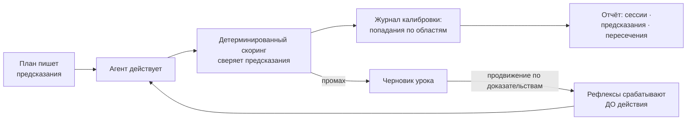
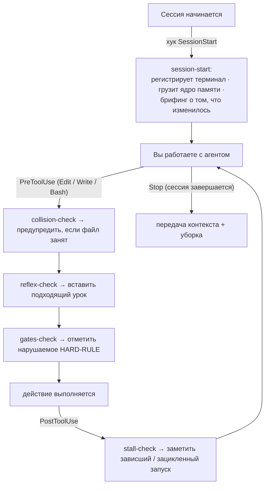
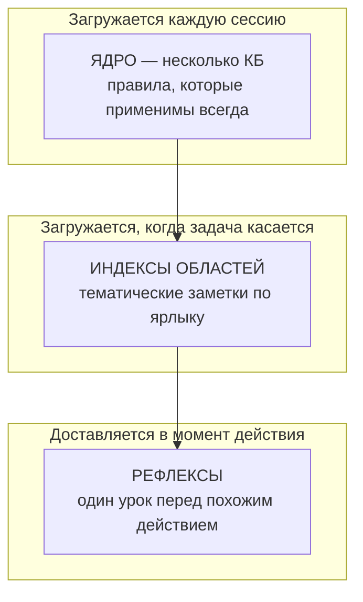
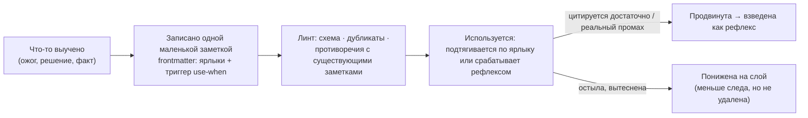
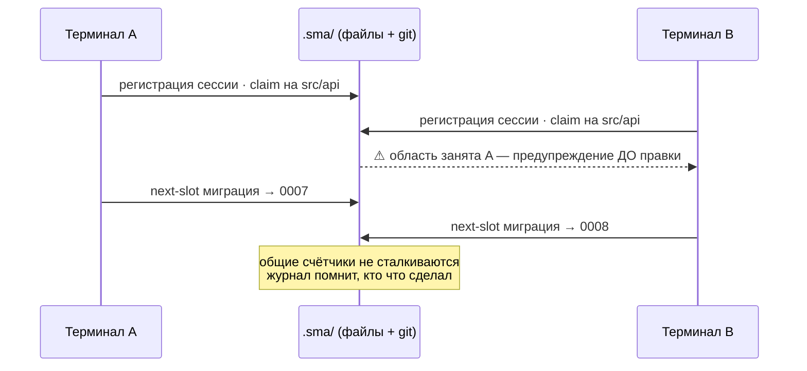
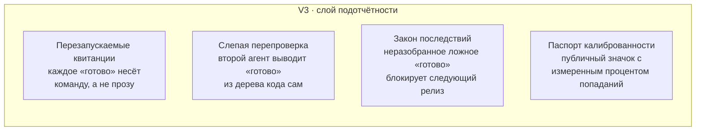

<p align="center">
  
</p>

<p align="center">
  <a href="LICENSE"></a>
  
  
  
  
</p>

# SMA — Shared Memory & Automation

**Слоистая память и координация терминалов для ИИ-агентов, пишущих код, с циклом обучения, который измеряется, а не предполагается.**

[English version → README.md](README.md)

> **Это не плагин памяти.** Это рабочая дисциплина для выпуска настоящего кода с ИИ-агентом: память, которая приходит ровно в тот момент, когда нужна; координация, не дающая двум терминалам перезаписать друг друга; и цикл обучения, где каждое утверждение сверяет скрипт, а не слово модели. Система пишет только в несколько папок рядом с Вашим кодом — **Ваше дерево исходников не трогается никогда** — и всё, что она знает или принуждает, лежит в обычном файле, который можно прочитать, сравнить и откатить.

## Зачем нужен SMA

Если Вы каждый день работаете с Claude Code (или любым кодинг-агентом) на настоящем проекте, эти четыре беды Вам знакомы:

1. **Правила читаются и забываются.** Файл инструкций подтверждается в начале сессии и нарушается через час: рабочее внимание модели крошечное, и правило, не присутствующее в момент действия, всё равно что не существует.
2. **«Готово», которое не готово.** Агент докладывает про зелёные тесты и записанные файлы, а дерево кода говорит обратное. Уверенный текст не является доказательством.
3. **Уроки выучиваются заново, за дорого.** Та же ошибка, та же ловушка сборки, та же особенность API обжигает снова через месяц, потому что первый ожог не превратился в постоянное избегание.
4. **Параллельные сессии сталкиваются.** Два терминала на одной копии тихо перезаписывают друг друга; сессия B «чинит» то, что сессия A закончила час назад.

SMA — это слой поверх агента, который бьёт по всем четырём бедам одной конструкторской ставкой: **маленькие файлы в Вашем git-репозитории + детерминированные скрипты + система хуков агента**. Без демона, без базы данных, без эмбеддингов, без облака. Всё, что система знает, лежит в markdown-файле, который можно прочитать, сравнить и откатить; всё, что она принуждает, выполняет скрипт, который можно запустить руками.

> **Файл инструкций на 700 строк — это не процесс.** Это одна большая заметка, которую модель бегло просматривает один раз и забывает. Ставка SMA обратная: держать всегда загружаемые правила крошечными и доставлять каждое *конкретное* правило предупреждением ровно у того действия, которым оно управляет. Присутствие важнее длины. В этом и есть разница между «я сказал агенту» и «агент не мог это пропустить».

## Живёт рядом с Вашим кодом, а не внутри него

SMA никогда не правит, не двигает и не переформатирует ни одной строки Вашего приложения. Она пишет только в несколько соседних папок — свой корпус памяти, своё координационное состояние и свои планировочные артефакты — и всё это обычный текст, всё под контролем версий, всё Ваше.

```text
ваш-проект/
├─ src/            ← ВАШ КОД — SMA сюда не пишет никогда
├─ package.json    ← не тронут
├─ ...             ← не тронуто
│
├─ .claude/
│  ├─ memory/      ← корпус памяти (markdown-заметки, их можно читать и диффать)
│  ├─ agents/      ← агенты рабочих команд /sma-*
│  └─ settings.json← хуки, которые встраивают SMA в Вашего агента
├─ .sma/           ← состояние координации: сессии, claim'ы, журнал, рефлексы
└─ .planning/      ← планы фаз, предсказания и журнал калибровки
```

Поскольку всё это файлы в git, переход на SMA обратим одним коммитом, и всё, что система «выучивает», приходит диффом, который Вы одобряете — а не непрозрачной мутацией облачного кэша. Удалите папки — и проект ровно такой, каким был.

## Что такое SMA

Три подсистемы на одной основе:

- **Память, приходящая вовремя.** Знания проекта живут в маленьких заметках с ярлыками. Всегда загружаемое ядро остаётся крошечным (несколько килобайт); тематические заметки подтягиваются, только когда задача их касается; а *рефлексы* доставляют нужный урок прямо перед тем действием, которому он нужен. Правило, названное в момент действия, стоит десяти правил, закопанных в большом файле инструкций.
- **Координация без сервера.** Каждый открытый терминал регистрирует себя, занимает файлы, над которыми работает, и берёт общие номера (миграции, релизы) из одной очереди. Параллельные сессии предупреждают друг друга до столкновения, а журнал записывает, кто что сделал.
- **Цикл обучения со счётом.** Планы заранее заявляют, что измеримо изменится и как это проверить (предсказания). Детерминированный скоринг (скрипт, а не модель-судья) сверяет каждое предсказание с реальностью. Промахи становятся уроками, повторные уроки становятся рефлексами, а журнал калибровки показывает по областям, как часто обещания совпадают с фактами. Память SMA не обещает работать: у неё есть измеренный процент попаданий.

## История в 10 слайдах

<p align="center">
  
</p>

<details>
<summary><b>Открыть всю презентацию (10 слайдов)</b> — проблема, первопричина, механизм, дисциплина доказательства</summary>

<br>

| | |
|:--:|:--:|
| <br>**Проблема** — гениальный и безответственный | <br>**Первопричина** — рабочее внимание модели крошечное |
| <br>**Ставка** — доверие, которое можно сравнить диффом | <br>**Цикл** — предскажи, действуй, оцени, научись |
| <br>**Память, приходящая вовремя** | <br>**Координация без сервера** |
| <br>**Измеряется, а не обещается** | <br>**Куда это идёт (V3)** |
| <br>**Владейте памятью своего агента** | |

</details>

## До SMA → После SMA

Весь смысл SMA — во втором столбце. Тот же агент, та же модель — другая дисциплина вокруг них.

| | **Без SMA** | **С SMA** |
|---|---|---|
| **1 · Правило потеряно** | В инструкциях сказано: «каждое изменение схемы требует миграции». Через двадцать правок агент добавляет колонку и забывает. Выкатывается — запросы падают на деплое. | Как только агент трогает файл схемы, рефлекс срабатывает **внутри этого действия**: *«изменение схемы → нужна миграция (в прошлый раз это сломало прод)»*. Пропустить нельзя. |
| **2 · «Готово», которого нет** | *«Все тесты зелёные, готово.»* Вы забираете код, запускаете — три красных. Уверенный отчёт был единственным доказательством, и он был неверен. | План заранее записал проверку (`pnpm vitest run …`). При закрытии **скрипт** её прогоняет и пишет `hit` или `miss` в журнал. «Готово» — это перезапускаемая команда, а не фраза. |
| **3 · Урок заново** | Тот же флаг сборки кусает третий месяц подряд. Каждое исправление жило лишь в одном закрытом чате; ничего не перенеслось вперёд. | Первый ожог записан заметкой с триггером. Каждая следующая сессия — и клон любого коллеги — получает предупреждение **до** повтора. Один ожог, постоянное избегание. |
| **4 · Два терминала столкнулись** | Терминал B правит `src/api`, пока Терминал A там же посреди рефактора. Push от B тихо откатывает час работы A; никто не замечает до CI. | B зарегистрировал сессию, а A **занял** `src/api`. Когда B идёт править, его предупреждают *до* нажатия клавиши — и оба взяли номера миграций из одной очереди, так что они не сталкиваются. |

## Как крутится цикл

<p align="center">
  
</p>



Один ожог — постоянное избегание: ребёнок один раз трогает кипяток. Промах записывается, записанный урок получает спусковой крючок, и крючок срабатывает предупреждением перед следующим похожим действием, в каждом терминале, навсегда. А поскольку скоринг делает скрипт, цикл не может себе льстить.

## Смотрите, как это работает — пять настоящих файлов

SMA — это «просто файлы», и в этом её сила: на любую её часть можно указать пальцем. Вот весь цикл в тех артефактах, которые она реально читает и пишет.

**1 · Урок, в первый раз, когда что-то Вас обожгло** — `.claude/memory/bug_build_node20.md`

```markdown
---
description: Сборка выдаёт пустой чанк API на Node 20 без --no-experimental
kind: bug-lesson
tags: [build, ci]
use-when: "правка vite.config или запуск продакшн-сборки"
importance: 8
---
**Правило:** На Node 20 бандл API требует `--no-experimental-*`, иначе он молча
выкатывает пустой чанк (код выхода 0, сломанный деплой).

**Почему:** Стоило нам красного прода 2026-06-02 — сборка «прошла» и выкатила пустоту.

**Как применять:** держите флаг в `build:api`; если трогаете конфиг бандлера,
запустите `pnpm build:api` и убедитесь, что чанк непустой, до коммита.
```

**2 · Предсказание, записанное в план до единой строки кода** — `.planning/phases/12-.../12-01-PLAN.md`

```yaml
predictions:
  - id: PRED-01
    claim: "Ограничитель частоты отклоняет 101-й запрос в окне 60с"
    metric: rejected_requests
    check_command: "pnpm vitest run test/rate-limit.test.ts"   # только команды из белого списка
    comparator: ">="
    threshold: 1
    horizon: plan-close
    domain: api
    confidence: 0.8    # записывается для калибровки — НИКОГДА не влияет на вердикт
```

**3 · Вердикт скоринга, вынесенный скриптом (без LLM)** — дописано в `.sma/journal/…`

```json
{"type":"prediction-verdict","id":"PRED-01","domain":"api",
 "result":"hit","observed":1,"comparator":">=","threshold":1,"ts":"2026-06-14T09:41:02Z"}
```

```text
# журнал калибровки — по областям, как часто обещания совпадали с фактом
api        14/15  (93%)
migrations  6/6   (100%)
ui          9/12  (75%)   ← эта область постоянно переобещает; SMA её эскалирует
```

**4 · Срабатывание рефлекса — предупреждение, которое агент видит *внутри* действия** (до правки `vite.config.ts`)

```text
⚠ SMA-рефлекс [bug_build_node20]: На Node 20 бандл API требует --no-experimental,
  иначе он молча выкатывает пустой чанк. В прошлый раз это уронило прод (2026-06-02).
  → запустите `pnpm build:api` и убедитесь, что чанк непустой, до коммита.
```

**5 · Столкновение + общий счётчик — координация без сервера** (Терминал B перед правкой файлов A)

```text
⚠ SMA: src/api/** занят t-4821 (исполнение фазы 12) с 14:07.
  Вы собираетесь править src/api/routes.ts — сначала согласуйте (`pnpm sma status`).

$ pnpm sma next-slot migration
0007          # Ваш. Параллельный терминал, спросив сейчас, получит 0008 — они не столкнутся.
```

Здесь нет ни строки базы данных, ни непрозрачного эмбеддинга. Это пять текстовых файлов, и вместе они — весь цикл: ожог → заметка → предсказание → вердикт, вынесенный скриптом → рефлекс, который останавливает следующий ожог.

## Как это встраивается в Вашего агента

SMA подключается к агенту через **точки хуков** его окружения — моменты, когда агент позволяет отработать внешнему скрипту. Никакой обёртки вокруг Claude и никакого его форка нет; SMA просто регистрирует маленькие команды на четырёх событиях жизненного цикла, и каждая — это одна строка в `.claude/settings.json`. Каждый хук **никогда не блокирует**: если он падает или истекает по таймауту, работа продолжается — мёртвый хук не вешает сессию.



| Точка хука | Команда SMA | Что делает в этот миг |
|---|---|---|
| **SessionStart** | `session-start` | Регистрирует терминал, грузит крошечное ядро памяти и брифует сессию о том, что изменили другие терминалы с её прошлого запуска. |
| **PreToolUse** (Edit/Write/Bash) | `collision-check` | Держит ли этот файл другой живой терминал? Предупредить **до** правки, а не после перезаписи. |
| **PreToolUse** (Edit/Write/Bash) | `reflex-check` | Подходит ли продвинутый урок к этому пути или команде? Вставить как контекст, чтобы правило было рядом *в момент действия*. |
| **PreToolUse** (Edit/Write/Bash) | `gates-check` | Не собирается ли это действие нарушить проверяемое HARD-RULE? Отметить (сначала совет; блокировка только для гейтов, которые Вы включили). |
| **PostToolUse** | `stall-check` | Запуск только что зациклился или завис? Показать это, чтобы гибель исполнителя стала пятиминутным возобновлением. |

Вот и вся поверхность интеграции. Хуки вызывают тот же CLI, что и Вы руками (`pnpm sma …`), поэтому не происходит ничего, что Вы не могли бы воспроизвести и проверить сами.

## Жизненный цикл: обсудить → спланировать → построить → проверить → выложить

SMA — это не только память, это полный рабочий ритм для настоящих изменений с агентом. Каждый этап — это команда `/sma-*`, и каждый этап читает из общей файловой памяти и пишет в неё, поэтому ничего не объясняется дважды.


- **1 · Обсудить** — зафиксировать спорные решения с человеком *до* кода, через адаптивные вопросы. Контекст сохраняется файлами, поэтому следующий план опирается на факты, а не на догадки.
- **2 · Спланировать** — превратить решения в исполнимый план, где каждый шаг несёт машинно-проверяемое **предсказание** (что изменится и какая команда это докажет). План — это контракт.
- **3 · Построить** — выполнить план волнами с учётом зависимостей. Рефлексы срабатывают до рисковых действий; прогресс журналируется, поэтому прерванный запуск возобновляется за минуты, а не с нуля.
- **4 · Проверить** — сверить сделанное с критериями приёмки в форме разговора. Человеческие гейты остаются за человеком; агент никогда не ставит их сам.
- **5 · Выложить** — ритуал релиза прогоняет полный гейт, и предсказания из шага 2 **оцениваются** против того, что реально произошло. Промахи становятся следующими уроками. Цикл замыкается.

## Память в трёх слоях

Не один большой файл инструкций, а три уровня: всегда загружаемый бюджет остаётся крошечным, и при этом ничего не забывается.



Авто-очистка никогда не удаляет — она *понижает* заметку по слоям, поэтому система становится легче, ни разу не теряя факт (в собственном прогоне этого репозитория всегда загружаемый индекс уменьшился с 46 КБ до 5 КБ с полным сохранением вспоминания, под контролем постоянного экзамена).

**Как заметка на самом деле сохраняется** — факт не входит случайно и не уходит случайно:



Каждая заметка несёт триггер `use-when` — именно эта строка позволяет SMA доставить её ровно у нужного действия, а не вываливать весь корпус в каждый промпт. Продвижение зарабатывается доказательством (заметка, которая продолжает быть важной), а не таймером; понижение уменьшает горячий бюджет, ничего не забывая. *Система никогда не забывает — она лишь меняет, насколько громко помнит.*

## Координация без сервера



## Установка

Основной путь:

```bash
npx sma-framework init
```

Запасной путь через git clone (доступ к реестру пакетов не нужен): клонируйте куда угодно, затем запустите установщик **из папки Вашего проекта** (установку внутрь самого клона установщик отклонит):

```bash
git clone https://github.com/sma-framework/sma.git ../sma-clone
cd <ваш-проект>
node ../sma-clone/bin/init.mjs --local
```

Оба пути запускают один и тот же установщик без зависимостей. Флаги (`--global`, `--with-gsd-aliases` и другие), полный список устанавливаемых файлов и шаги удаления описаны в [docs/INSTALL.md](docs/INSTALL.md).

## Быстрый старт

Откройте сессию Claude Code в Вашем проекте и выполните:

```
/sma-start
```

Вводный разговор объяснит систему, засеет стартовый корпус памяти и каркас проекта, а также запишет Ваш инфраструктурный профиль (Ваш деплой-хост, Ваш ритуал релиза), чтобы все дальнейшие команды говорили на языке Вашего стека. После этого каждая новая сессия регистрирует себя сама и загружает ядро памяти прежде, чем что-либо делать.

## Команды

| Команда | Что делает |
|---|---|
| `/sma-start` | Первый запуск: объясняет систему, засевает корпус памяти и инфраструктурный профиль |
| `/sma-discuss-phase` | Обсудить фазу: собрать контекст через адаптивные вопросы до планирования |
| `/sma-plan-phase` | Составить подробный план фазы с циклом проверки |
| `/sma-execute-phase` | Выполнить все планы фазы волнами, с параллелизацией |
| `/sma-verify-work` | Проверить сделанное вместе с Вами, в форме разговора |
| `/sma-quick` | Быстрая задача с гарантиями SMA (атомарные коммиты, учёт состояния), без лишних агентов |
| `/sma-fast` | Тривиальная задача прямо в сессии: без субагентов и без планирования |
| `/sma-debug` | Системная отладка с сохранением состояния между сессиями |
| `/sma-progress` | Где мы: прогресс, следующий шаг, свободный запрос |
| `/sma-resume-work` | Продолжить работу прошлой сессии с полным восстановлением контекста |
| `/sma-pause-work` | Передать контекст при паузе посреди фазы |
| `/sma-help` | Показать доступные команды и справку |

Под капотом работает координационный CLI (`node scripts/sma/cli.mjs` или `pnpm sma`): `status`, `claim`, `next-slot`, `load`, `lint` и другие. Сессии и хуки вызывают его сами; при желании Вы можете вызывать его напрямую.

### Каждая команда в действии

Каждая команда это разговор в терминале. Разверните любую, чтобы увидеть, что она делает. Каждое демо повторяется по кругу (текст в терминале на английском).

<details open>
<summary><b><code>/sma-start</code></b> : первый запуск: система сначала объясняет себя, потом настраивается</summary>
<br>
</details>

<details>
<summary><b><code>/sma-discuss-phase</code></b> : зафиксировать спорные решения с человеком до кода</summary>
<br>
</details>

<details>
<summary><b><code>/sma-plan-phase</code></b> : исследование, планы и проверка плана; каждый шаг несёт предсказание</summary>
<br>
</details>

<details>
<summary><b><code>/sma-execute-phase</code></b> : сборка волнами с учётом зависимостей; рефлексы срабатывают до действия</summary>
<br>
</details>

<details>
<summary><b><code>/sma-verify-work</code></b> : сверка с критериями приёмки; скрипт заново прогоняет каждое «готово»</summary>
<br>
</details>

<details>
<summary><b><code>/sma-quick</code></b> : небольшая задача с полными гарантиями (атомарный коммит, учёт состояния)</summary>
<br>
</details>

<details>
<summary><b><code>/sma-fast</code></b> : тривиальная задача прямо в сессии; без субагентов и планирования</summary>
<br>
</details>

<details>
<summary><b><code>/sma-debug</code></b> : системная отладка, состояние переживает сброс контекста</summary>
<br>
</details>

<details>
<summary><b><code>/sma-progress</code></b> : где мы сейчас и следующий конкретный шаг</summary>
<br>
</details>

<details>
<summary><b><code>/sma-resume-work</code></b> : восстановить полный контекст из бортового самописца</summary>
<br>
</details>

<details>
<summary><b><code>/sma-pause-work</code></b> : подготовить передачу контекста перед паузой</summary>
<br>
</details>

<details>
<summary><b><code>/sma-help</code></b> : всё семейство <code>/sma-*</code> одним взглядом</summary>
<br>
</details>

## Шесть столпов

- **Предсказания** — каждый план заранее заявляет, что измеримо изменится и как это проверить; детерминированный скоринг сверяет обещание с фактом при закрытии плана, а журнал калибровки показывает, в каких областях система ошибается чаще всего.
- **Рефлексы** — зафиксированный промах становится постоянным правилом, которое срабатывает до следующего похожего действия, как предупреждение внутри сессии. Один раз обжёгся, больше не трогает.
- **Здоровье корпуса** — линт, поиск противоречий, плановая консолидация и счётчики продвижения держат память острой на сотнях заметок, вместо того чтобы дать ей превратиться в шум.
- **Координация** — реестр сессий, заявки на файлы с предупреждением до правки, общие счётчики для всего, за что могут схлестнуться два терминала, и живой сигнал «идёт публикация».
- **Каркас** — журнал прогресса по каждому плану превращает гибель исполнителя в пятиминутное возобновление; детектор зависаний и волны с учётом зависимостей держат длинные запуски честными и параллельными.
- **Отчёт** — панель с сессиями, предсказаниями, срабатываниями рефлексов, пересечениями и здоровьем корпуса: состояние системы видно, а не предполагается.

## Чем SMA отличается

- **Подотчётность, а не только полезность.** Каждое заявление SMA о самом себе — заранее зарегистрированное предсказание, которое оценивает скрипт. Системы памяти обычно обещают вспоминание; SMA публикует свой процент попаданий.
- **Сначала детерминизм.** Выдача памяти управляется ярлыками и триггерами, принуждение — обычными скриптами, и весь цикл обучения работает без единого вызова LLM в горячем пути. Интеллект может сидеть сверху; корректность от него не зависит.
- **Родной для git и обратимый.** Заметки, журналы, книги учёта — файлы в Вашем репозитории. Самообучение приходит диффами, которые Вы просматриваете; всё выученное откатывается через `git revert`.
- **Никогда не блокирует.** Предупреждение не останавливает работу; мёртвый хук не вешает сессию. Жёсткие запреты остаются только за настроенной Вами защитой безопасности.
- **Ваше.** Корпус живёт в Вашем репозитории, путешествует с `git clone` и переносим на других агентов: это знание, которым владеете Вы, а не кэш поставщика.

## Дорожная карта — что дальше (V3)

V1 дал агентам память. V2 дал предсказания, рефлексы и координацию. **V3 заставляет агента перестать верить себе на слово** — то единственное, что поставщик модели не может отгрузить нейтрально, потому что не может беспристрастно проверять собственную работу. Четыре несущих элемента, каждый — детерминированный скрипт на уже готовой основе:



- **Перезапускаемые квитанции** — каждое заявление о выполнении несёт команду и ожидаемый слепок результата, который любой может перезапустить. Голословные заявления не проходят линт. «Готово» становится доказательством, а не утверждением.
- **Слепая перепроверка** — отдельный агент выводит каждое «готово» только из дерева кода, не видя отчёта исполнителя. Расхождение «заявлено: сдано / воспроизведено: нет» — самый тяжёлый сигнал в журнале.
- **Закон последствий** — ложное «готово» не просто фиксируется, оно *действует*: неразобранное расхождение «заявлено: сдано / воспроизведено: нет» блокирует следующий релиз, пока человек не вынесет по нему решение. Проверенные заявления, которые управляют поведением, — та подотчётность, которую самопроверяющийся поставщик отгрузить не может.
- **Паспорт калиброванности** — процент попаданий по областям и оценка вспоминания собираются в публичный значок README. Первая честная метрика доверия к агентной работе: память, которая публикует собственную точность.

Рядом с ядром стоят несколько **мостов** — аварийная подушка восстановления git, журнал расходов, капсула на случай компактизации, — каждый закрывает пробел, который харнесс пока не закрывает нативно. Их намеренно *не* выносят в заголовок: каждый мост поставляется с оговоркой о сносе и зарегистрированным предсказанием, которое выведет его из строя, как только появится достаточный нативный механизм. Ядро подотчётности выше — это то, чем SMA является; мосты — это леса, которые он рассчитывает снять.

Полный дизайн, оценённый и состязательно проверенный, живёт вместе с проектом. Это направление, а не обещание дат: выход идёт от доказательства к доказательству, по одной фальсифицируемой метрике за раз.

## История звёзд

[](https://star-history.com/#sma-framework/sma&Date)

## Лицензия и происхождение

MIT, см. [LICENSE](LICENSE).

**Создатель: Матвей Маслов (Matvey Maslov).**

Движок рабочих процессов внутри SMA производен от [gsd-core](https://github.com/open-gsd/gsd-core) (MIT). Нетронутый снимок исходного проекта, карта переименований и уведомления о сторонних компонентах отслеживаются в [UPSTREAM.json](UPSTREAM.json), [rename-map.json](rename-map.json) и [THIRD-PARTY-LICENSES.md](THIRD-PARTY-LICENSES.md).
