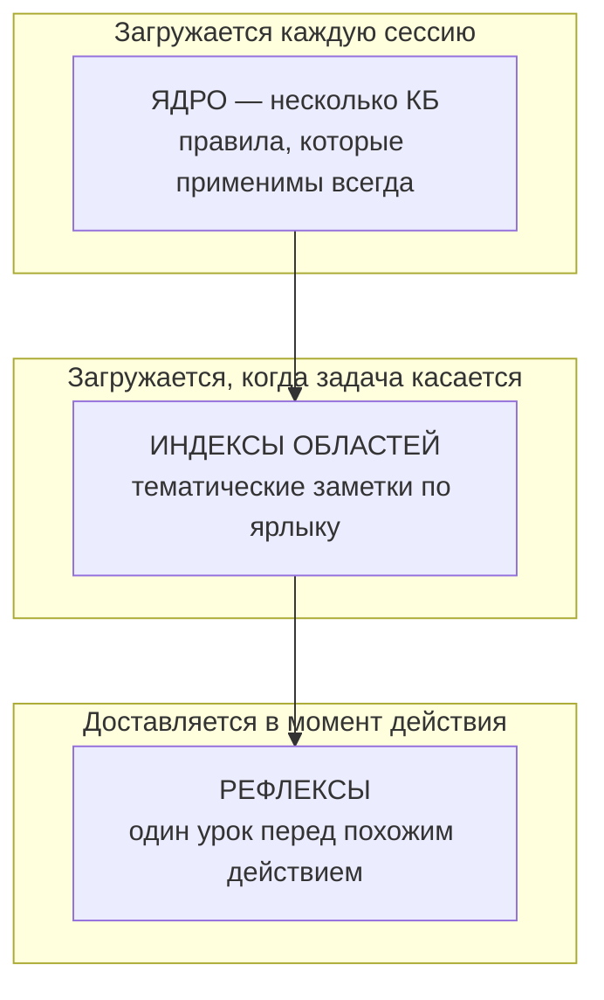

<p align="center">
  
</p>

<p align="center">
  
  
<!-- sma:passport:begin -->
  <a href="PASSPORT.md"></a>
<!-- sma:passport:end -->
  <a href="LICENSE"></a>
  
  
</p>

# SMA — Shared Memory & Automation

**SMA — это local-first управляющий контур памяти и подотчётности для ИИ-агентов, пишущих код: он доставляет агенту нужное проектное знание в момент действия — и независимо проверяет его утверждения. Слоистая память, которая приходит вовремя; координация терминалов без сервера; каждое «готово» сводит скрипт, переповеряет слепой проверяющий, и оно блокирует релиз, если ложно.**

[English version → README.md](README.md)

> ### 🗺️ [Открыть живую карту системы →](https://sma-framework.github.io/sma/master-graph.html)
> Все подсистемы SMA на одной интерактивной странице — самый быстрый способ увидеть, как всё связано.

> ### 🆕 [Что нового — задачник и числа, которые не врут →](#что-нового--задачник-и-числа-которые-не-врут)
> Каждая единица работы читается одной строкой и раскрывается в свой вид; разговор о ней — в одном нажатии клавиш. А гейт, который выпускает работу наружу, меряет собственную копию работника и краснеет только на том, что работник действительно сломал.

> ### 🧭 [Роадмап →](ROADMAP.ru.md) · [in English](ROADMAP.md)
> Где SMA сейчас и что дальше: **оркестрация V5 (парк работников 24/7) — вышла → V5.1 работает с тем, что у вас есть + рабочий фронт — вышла (v5.1.0) → V5.2 измеренная память — вышла (v5.2.0) → V5.3 управление + укреплённый парк — вышла (v5.3.0) → V5.4 целый рабочий день без терминала — вышла (v5.4.0) → V5.5 двигатель: рулёжка живой сессии — вышла (v5.5.0) → V5.6 задачник и честные числа — в репозитории, текущая.** Вся история выпусков, заметка за заметкой, — в [docs/DETAILS.ru.md](docs/DETAILS.ru.md#линейка-v5-выпуск-за-выпуском).

> **Это не плагин памяти.** Это рабочая дисциплина поставки настоящего кода с ИИ-агентом: память, которая приходит ровно в тот момент, когда нужна; координация, которая не даёт двум терминалам затирать друг друга; и, начиная с V3, **хребет доверия**, в котором каждое «готово» сводит скрипт, переповеряет слепой проверяющий, а ложное «готово» блокирует следующий релиз. Он пишет только в несколько папок рядом с Вашим кодом — **Ваше дерево исходников не трогается никогда** — и всё, что он знает или принуждает, это обычный файл, который можно прочитать, сравнить и откатить.

---

## Установка

### 1 · Что нужно заранее

| | |
|---|---|
| **Node 22.5 или новее** | Node — это программа, которая запускает скрипты SMA. Проверьте свою версию командой `node -v`. Если число меньше или команда не найдена, поставьте текущую версию с [nodejs.org](https://nodejs.org). |
| **git** | SMA хранит всё обычными текстовыми файлами в Вашем репозитории, поэтому проект должен быть git-репозиторием (если ещё нет — выполните в нём `git init`). |
| **Claude Code** | ИИ-агент для кода, в который SMA встраивается сегодня. Команды `/sma-…` ниже набираются прямо в сессии Claude Code — так же, как Вы обычно с ним разговариваете. |

Больше ничего. Ядро SMA не добавляет в Ваш проект ни одного пакета и не требует ни базы данных, ни сервера, ни аккаунта. (Необязательное дополнение — парк работников, описанный ниже, — просит большего; его можно вовсе не трогать.)

### 2 · Одна команда

Откройте терминал, перейдите в корневую папку **Вашего собственного проекта** и выполните:

```bash
npx -y sma-framework@latest init
```

Это вся установка. Она занимает несколько секунд и печатает каждый записанный файл. (`npx` — встроенный в Node способ «скачать и запустить один раз»; после себя он ничего не оставляет.)

### 3 · Что появится после неё

Новые папки появляются **рядом** с Вашим кодом. Ни одна строка Вашего исходника не правится.

```text
ваш-проект/
├─ src/, package.json…   ← ВАШ КОД — не тронут
│
├─ .claude/
│  ├─ skills/            ← 14 команд /sma-…, которые теперь можно набирать
│  ├─ agents/            ← помощники, которых эти команды вызывают
│  ├─ sma-core/          ← движок: инструкции, стоящие за каждой командой
│  ├─ memory/            ← заметки Вашего проекта — ставятся ПУСТЫМИ, заметки остаются Вашими
│  └─ settings.json      ← 7 хуков + сегмент строки состояния движка (Ваши записи сохраняются)
├─ scripts/sma/          ← консольный инструмент, которым команды пользуются под капотом
├─ .sma/                 ← рабочее состояние: кто что правит и журнал проверок
└─ CLAUDE.md             ← добавляется один короткий помеченный блок; Ваш текст не тронут
```

Этих хуков — **семь записей на шести событиях агента**, и вместе они и есть вся хватка
SMA за сессию. `SessionStart` — подхватить то, чем это окно занималось. `PreToolUse`
дважды: один раз на инструментах правки `Edit`/`Write`/`Bash`, где проверки коллизий,
рефлексов и гейтов идут одним процессом, и второй раз на инструменте, который запускает
субагента (ловится под обоими именами, которые этот инструмент носил в разных версиях
агента, — чтобы обновление не отцепило хук молча), так что субагент стартует, уже держа
в руках заявки проекта и его открытые вопросы. `PostToolUse` на тех же инструментах
правки — проверка на застревание. `SessionEnd` — вернуть заявки, которые держит это окно.
`PreCompact` — записать капсулу состояния до того, как контекст подрежут. `SubagentStop` —
сверить то, что заканчивающий субагент назвал написанным, с тем, что реально лежит в дереве.

Две вещи говорим честно, потому что названный вслух предел стоит больше обещания.
`SessionEnd` срабатывает, когда сессия завершается любым способом — Вы закрыли окно,
набрали `/clear`, вышли из учётной записи, — а не только на закрытии окна. А капсула
`PreCompact` пишется **тогда, когда Ваша версия агента подаёт это событие**; на версии,
которая его не подаёт, команда просто завершается без ошибки, и больше ничего не меняется.
Ваши собственные записи в любом из этих событий сохраняются ровно такими, какие они есть.
Что делает каждый хук и в какой срок он обязан уложиться: [docs/DETAILS.md](docs/DETAILS.md).

Одна запись достаётся и строке состояния, и она ставится **по умолчанию**: собственный
сегмент движка — короткая сводка о том, чем занято это окно и соседние: пульс внимания,
заявка, которую держит окно, коллизии за сегодня, сколько израсходовано от окна
подписки, открытые гейты, неоценённые предсказания. Если у Вас уже была своя команда
строки состояния, она сохраняется дословно и печатается **первой**, а сегмент идёт за
ней; `/sma-deleteme` возвращает Вашу строку байт-в-байт — или убирает ключ совсем, если
это мы его добавили. Запись просит агента перезапускать её раз в минуту, потому что
перерисовка по событию задевает только то окно, где Вы печатаете, — иначе молчащее окно
никто не попросил бы посмотреть заново. Цена этого таймера названа, а не спрятана: раз в
минуту каждое открытое окно запускает один короткий процесс, а вместе с ним и Вашу
обёрнутую команду.

Папка `.planning/` появится позже — когда Вы первый раз будете планировать работу.

Передумали? `/sma-update` заново запускает тот же установщик, чтобы перейти на свежую версию, а `/sma-deleteme` удаляет всё одним действием — и то и другое сохраняет Ваши заметки в `.claude/memory/` и всё остальное локальное. Флаги установки, путь через клонирование репозитория и полный список файлов: [docs/INSTALL.md](docs/INSTALL.md).

## Первые шаги

### С чего начать

Откройте сессию Claude Code в Вашем проекте и наберите:

| Наберите | Что произойдёт |
|---|---|
| `/sma-start` | Разговор-знакомство, один раз. Он спросит, что за проект и как Вы его выкатываете, запишет ответы и заведёт файл заметок. Всё, что Вы запустите дальше, будет говорить в этих терминах. |
| `/sma-help` | Список команд, по строчке на каждую — карта на случай, если забыли название. |
| `/sma-progress` | «Где мы?» — что сделано, что дальше и предложение это запустить. |

### Обычный рабочий цикл

Вы работаете **фазами**: по одному куску работы за раз — фича, исправление, переделка. Четыре команды, всегда в этом порядке:

1. `/sma-discuss-phase 1` — задаёт вопросы, пока цель не станет однозначной.
2. `/sma-plan-phase 1` — пишет план, включая то, как результат будет проверен.
3. `/sma-execute-phase 1` — делает работу и коммитит её шаг за шагом.
4. `/sma-verify-work 1` — проходит результат вместе с Вами и перезапускает проверки, обещанные планом.

Дальше то же самое с `2`, `3` и так далее. Для мелочи все четыре шага не нужны: `/sma-quick` — небольшая задача, `/sma-fast` — задача на одну строку.

### Куда смотреть дальше

- [docs/INSTALL.md](docs/INSTALL.md) — варианты установки, что и куда кладётся, обновление и удаление.
- [docs/DETAILS.ru.md](docs/DETAILS.ru.md) — инженерный разбор, когда захочется понять устройство изнутри.
- `node scripts/sma/cli.mjs explain <имя>` — из корня проекта: объяснение любой команды SMA простыми словами.

## Что нового — задачник и числа, которые не врут

В окне была доска карточек. Эта работа превращает её в место, где владелец действительно работает: **каждая единица работы читается одной строкой, раскрывается в свой собственный вид, а разговор о ней идёт не уходя с экрана** — и каждое число рядом либо измерено, либо честно названо отсутствующим.

**Три настоящих вида работы, а не одно и то же под тремя ярлыками.**

| | Одна строка говорит |
|---|---|
| **Задача** | самая мелкая единица — один приказ, один работник, одна сессия. Закрывается закрытием сессии; подписывать отдельно нечего. |
| **Пакет задач** | одна ваша формулировка, разошедшаяся на несколько элементов: их ведёт один работник по одному за раз, а в конце всё сходится в одну сборку. Строка называет, какой именно элемент держит сборку. |
| **Фаза** | полный цикл — дискуссия, планирование, исполнение, проверка — с воротами между стадиями. Завершённой себя не называет, пока не пройдены и проверка, и ваша приёмка. |

Задача — самый нижний уровень, и вход в неё одинаков отовсюду: изнутри фазы — через план, изнутри пакета — через элемент, сама по себе — просто задача без родителя. Крошки наверху ведут назад ровно туда, откуда вы пришли.

**Единица работы отвечает на три вопроса, и карточка — это те самые три колонки.** *Что обещано* — слова приказа и признаки успеха. *Что сделано* — что попытка действительно произвела. *Чем доказано* — квитанция, а не прилагательное. Отметки ✓ / ? / × стоят только там, где состояние действительно известно; где движок ответить не может, клетка говорит это словами. Под колонками — кто был в сессии: исполнитель первым, подагенты под ним, у каждого своя модель и сколько он шёл; последнее событие; расход попытки; и явный блок внешних подключений, который при их отсутствии пуст, а не отсутствует.

**Слова задачи выводит система, а не ваша рука.** Вы пишете формулировку. Одно нажатие — и SMA предлагает описание и признаки успеха так же, как планировщик выводит критерии из цели: они видны на карточке и правятся вами. Само предложение ничего не ставит в очередь — черновик остаётся черновиком, пока вы его не подтвердите. Постановка пакета устроена так же: пишете фразу, а система предлагает, из чего он мог бы состоять — подходящие записи вашего бэклога и новые подзадачи, разобранные из фразы. Любой кандидат подтверждается, снимается и без вашего слова в очередь не уезжает.

**Работника, который остановился с вопросом, невозможно пропустить.** Остановка видна разом в трёх местах — полоса наверху списка, сама строка и карточка, — и в каждом написано, сколько она уже ждёт. Вы отвечаете из окна разговора, и работник **продолжает ту же сессию**: возврат не начинает заново, контекст, за который вы уже заплатили, остаётся у него в голове.

**Разговор с системой не уводит с экрана — `Ctrl K`.** Окно открывается поверх того, на что вы смотрите, и контекст берёт оттуда: «как обстоит дело?» означает — вот с этим. Исходов три: решение по ожидающему вопросу, которое доезжает до работника; задание, которое становится задачей и появляется в списке; или ответ о текущем состоянии. Поиск и действия переехали на `Ctrl P`.

**Целому эшелону можно сказать «стой».** «Останови волну 2» — с подтверждением, после которого задачи этой волны доводят текущий ход и встают; посреди шага никого не рвут. Незакрытые шаги остаются в своих сессиях, и когда вы снимаете останов, они продолжают ровно с того места. Слово владельца записано на диск, поэтому переживает перезапуск демона.
**Задачу можно остановить, и остановка терминальна.** На карточке есть кнопка «Отменить задачу» со своим вопросом-подтверждением; нажатие закрывает строку насовсем — остановленная задача не возвращается в очередь и не выдаётся работнику снова. Если под ней шёл живой процесс, **он убивается первым**, и строка закрывается только после того, как процесса не стало; ответ называет, что именно из двух случилось, а не отчитывается об успехе, которого не наблюдал. Остановить можно и работу, которая ждёт после сорванной попытки, а не только идущую.

**Работник идёт под потолком ходов.** Сколько ходов позволено одной попытке — это настройка (`pipeline.maxTurns`) с разумным умолчанием в восемьдесят, и умолчание действует даже тогда, когда ключа в файле нет вовсе. Упор в потолок ходов записывается **отдельной причиной остановки**, с числом ходов рядом, а не растворяется в общем «работник ошибся»: карточка называет потолок ходов, а не ошибку. Обещается здесь механизм и его умолчание — то, что число, которое правит человек, доезжает до командной строки реально запущенного процесса. Не обещается прогон, в котором работник упёрся в потолок: такой стоит оплаченной попытки, а на него её не тратили.

**После попытки остаётся конспект передачи.** В конце каждой попытки демон кладёт рядом с её же записью короткий конспект: какой был подход, что из него вышло, какие файлы тронуты, что сказал человек, возвращая работу. Он собирается из уже записанного, поэтому модель не спрашивают ни о чём и стоит он ноль. Потолок — восемь тысяч знаков, и конспект, который пришлось обрезать, говорит об этом **внутри своего текста**, а не в соседнем поле: файл один, и расходиться двум читателям не в чем. Когда задача возвращается, этот текст едет в промпт следующей попытки за забором, как данные; и тот же самый файл — слово в слово, а не второй пересказ — показывает человеку панель «Конспект передачи» на карточке.

**Возврат человеком продолжает сессию, а пробуждение по таймеру начинает свежую сессию.** Два способа начать попытку заново намеренно не равны. Вы вернули работу с замечанием — продолжается та сессия, за которую уже заплачено, с той головой, в которой она была. Разбудило время (аренда истекла, мир ушёл вперёд) — начинается свежая сессия, потому что картина мира из прошлого захода уже не картина мира.

**Сторож живости убивает процесс, а не просто помечает попытку мёртвой.** Признав попытку мёртвой, сторож останавливает её ребёнка **прежде**, чем задачу выдадут снова, и говорит вслух, что из двух случилось: процесс убит — или убивать было нечем, потому что демон с тех пор перезапускали. Убийства, которого не было, он не утверждает никогда. Закрытая строка раньше могла означать живого работника, который у вас за спиной жжёт подписку; теперь означать этого она не может.

**Каждая выдача задачи несёт свой токен попытки.** Захват возвращает работнику жетон именно этой попытки, и завершение, провал и продление аренды предъявляют его обратно. Смысл ровно один: **устаревший работник — тот, у кого задачу уже отобрали и перевыдали, — не закрывает чужую попытку**. Раньше попытку закрывали по имени задачи, и работник, дописывавший свою работу в ту секунду, когда его аренда уже истекла, а строка ушла второму, заверял своей квитанцией чужой заход — тихо, не оставив ни строки в журнале. Теперь очередь на чужой жетон отвечает названным отказом. Обещается здесь механизм и его отказ: он прогнан на настоящем Postgres — устаревшее завершение отвергнуто, свежая попытка не тронута, — и живым демоном снят на шве провала. Не обещается прогон, в котором устаревший работник доживает до конца оплаченного рабочего цикла: такой стоит оплаченной попытки, а на него её не тратили. Строка, захваченная до этого выпуска, жетона не несёт вовсе, и отсутствие читается как отсутствие, а не как право выдумать значение.

**Задача, ждущая повтора, — такая же полноправная, как задача, ждущая первого захода.** Ожиданий у очереди два: обычное и то, в которое задача возвращается после сорванной попытки. Две двери смотрели только в первое, и это выглядело как поломка на ровном месте: вернувшейся задаче нельзя было переписать слова, а отмена остановленного пакета проходила мимо тех его элементов, которые ждали повтора, — и проходила молча, отчитавшись «сделано». Обе двери теперь достают задачу в обоих ожиданиях, а строка, до которой отмена не дотянулась, называется вслух, вместо того чтобы быть пропущенной.

**Граница попыток — одна на оба хранилища очереди.** Хранилищ у демона два: долговременное в Postgres и памятное, на котором он работает без базы. Долговременное границу знало всегда, памятное перевыдавало задачу **бесконечно** — одна и та же работа могла идти по кругу, пока её не заметит человек. Теперь граница попыток одна и называется одним именем для обоих: по её исчерпании задача **закрывается с названной причиной** — «попытки кончились», а не «работник ошибся», потому что это разные новости и просят они человека о разном.

**У каждой задачи своя рабочая копия.** Копия, в которой работает попытка, называется по **задаче**, а не по демону. Пока имя бралось от демона, все задачи одного процесса претендовали на один каталог: соседняя задача молча работала в чужой копии, а стоило копии осиротеть — каждая следующая попытка умирала ещё до запуска, и в журнале это выглядело как «среда исполнения недоступна». Замерено: одна брошенная копия держала конвейер мёртвым почти два часа. Теперь копии разных задач не претендуют на один каталог, брошенная копия глушит только **свою** задачу, а повтор той же задачи честно переиспользует уже готовую среду. Прогнано живьём: три копии одного демона в трёх каталогах, одновременно, без единого отказа «уже существует». Что осталось непокрытым, сказано прямо: копия, потерявшая регистрацию, по-прежнему требует ручной уборки — и до неё останавливает только свою задачу.

**Уже построенное не строится заново.** Прежде чем поднять работника, демон спрашивает дверь «уже построено» — миллисекундную проверку без токенов: она читает **каждый план фазы**, к которой относится задача, и сверяет утверждения каждого плана с реальным деревом. Если построен каждый из них, задача закрывается по квитанции этой проверки, и сессия не поднимается вовсе — за повторную стройку не платят. Не хватило одного плана — дверь не срабатывает, и это выбрано намеренно: ложное «не построено» стоит одного лишнего прогона, а ложное «уже построено» закрыло бы задачу так, что работа не сделана — тихо, с «завершено» в леджере. Дверь, существующая ради экономии работы, ошибается в сторону работы. **Вердикт всегда попадает в журнал демона** — построено, построено частично, не построено и собственный сбой проверки одинаково. И спрашивают дверь только там, где есть что спросить детерминированно: у обычного поручения нет ни фазы, ни плана за ним, его признаки успеха — проза, а вердикту нельзя поручать судить прозу, — поэтому её не спрашивают вовсе, и эта причина тоже остаётся записью. Дверь, которую тихо не открывают, выглядит ровно как сломанная; одна строка с именем плана и вердиктом превращает год молчания в минуту чтения.

**Гейт, выпускающий работу наружу, стал разностным — и меряет собственную копию работника.** Раньше изменения работника судили прогоном по всему репозиторию: всё, что было красным ещё до начала задачи, возвращалось как его вина, — и тот же прогон мерил дерево, в котором стоял *демон*, а не дерево, где работа на самом деле шла. Оба перекоса убраны. Гейт берёт два снимка — до и после — **называя в каждом рабочую копию работника**, а `reverify --tree` гоняет проверки по тому дереву, которое ему назвали, оставляя бухгалтерию в одном общем леджере. Красным считается только **новое** расхождение. Провал, который был до этого, докладывается как существовавший ранее, по имени, — чтобы им занимались отдельной работой, а не блокировали того, кто его не вызывал.

**Числа — измеренные или отсутствующие, но не выдуманные.**

| | Что теперь говорит |
|---|---|
| **Сколько уже ждёт** | считается с момента, когда работа действительно встала, а не с создания строки, — и решение, ждущее минуту, не зовётся «застряла» |
| **Сколько было подходов** | подходы считаются подходами: три подхода, записанные шестью строками журнала, — это три, а не шесть |
| **Одна задача — одна строка** | каждая секция списка стоит за **последнее слово** о задаче, поэтому возвращённая задача видна один раз — и под своим именем, а не под идентификатором |
| **Квитанция слияния** | тесты идут на сведённом результате ДО того, как слияние записано: красный прогон означает, что слияния не было, и отказ называет это причиной. «Не запускались» осталось честным третьим ответом — для дерева, в котором прогонять нечего, — и это не зелёный |
| **Какому проекту принадлежит задача** | факт, который несёт сама задача, проставленный при постановке, — а не вывод из того, на какой проект Вы сейчас смотрите. Строка, поставленная раньше, чем задача стала знать свой проект, говорит **«проект неизвестен»** словами и остаётся видна под любым проектом, вместо того чтобы тихо приписаться тому, что открыт на экране |
| **Числа работника** | сложены из леджера попыток за последние **30 дней**, и окно называет этот период вслух. Леджер, который не удалось прочитать, даёт «нет данных»; прочитанный период, в котором ничего не завершилось, — «завершённых попыток не было». Это два разных факта, и ни один из них не печатается уверенным нулём |
| **Всё, чего движок не знает** | говорит «нет данных» словами. Неверный ноль хуже пустоты: он читается как ответ |

**Стенограмма, укоротившая строку, говорит об этом в самой строке.** Два кадра, которые читателю нужны целиком — с чем сессия была запущена и что она вернула, — держатся целиком под своим, гораздо большим потолком; все остальные строки живут под обычным. Когда обрезка действительно произошла, строка несёт признак и исходную длину рядом с текстом, поэтому обрезанную строку можно отличить от строки, которая просто на этом кончилась. Ошибкой было молчание: укороченная строка и короткая строка выглядели одинаково.

**Журнал, который повторяется, — это журнал, который никто не читает.** О задаче, залежавшейся сверх порога, теперь говорится один раз, на переходе порога, и дальше раз в сутки — вместо каждого тика движка, — и каждая строка несёт метку времени. Остаток замерен, а не прикинут: за одно фиксированное окно простоя строк старения стало 1 вместо 119, что в пересчёте на сутки даёт около 5,6 КБ вместо примерно 650 КБ на одну залежавшуюся задачу. Это число — **пересчёт фиксированного окна, снятого стендом вокруг тика движка**, а не суточный замер живого демона.

**Правила, которые Вы и так применяете, предлагаются Вам обратно — со знаменателями.** `sma approvals suggest` складывает Вашу же историю принятий и возвратов в стоячие правила приёмки: детерминированно, ни одна модель ни о чём не спрашивается, поэтому одна и та же история всегда даёт одно и то же предложение. Каждое основание идёт со знаменателем, на котором оно стоит, а классу, истории у которого мало, в правиле отказано вслух — вместо правила, выведенного из трёх случаев. Команда предлагает и не пишет ничего: включение остаётся отдельным явным Вашим шагом, а **механизм включения намеренно не строился** — предложение и есть вся отгруженная поверхность.

**Числа, которыми эта документация описывает саму SMA, держит прогон тестов.** Сколько дверей у веб-морды демона, сколько глаголов рассылает CLI, сколько тестов и файлов насчитал последний измеренный прогон, на какой версии стоит пакет — каждое читается из кода или из квитанции, которой оно принадлежит, а документ, расходящийся с ними, делает `npm test` красным. Проверить самому: `node scripts/sma/cli.mjs doc-audit --target numbers`; тот же глагол с `--write` переписывает производные места из кода, поэтому ни одно число здесь не печатается руками. Значок тестов наверху пишет `scripts/sma/lib/badge.mjs` из JSON-отчёта настоящего прогона, и руками его не правят.

**Обещание ровно такой ширины и ни словом шире.** Гейт держит две вещи: число в доках не может разойтись с кодом, а значок — с последней измеренной квитанцией прогона. Третьего он не держит — свежести самой квитанции, — потому что прогон не может измерить себя, не запустив себя заново; свежесть проверяется на гейте выпуска. То есть страница обещает числа, совпадающие с кодом, и значок, совпадающий с последним замером, а не значок, который перемеряется при каждом чтении.

И держит он число только там, где место, которое его называет, кто-то выписал. Это не мелочь: счёт глаголов сторожился ровно в одном файле — том, который был неверен в день написания правила, — а ещё три отгружаемых документа называли то же число вовсе без замка. При первом же сдвиге счёта они остались позади, а гейт напечатал ноль: проверка, которая просто совпадает с сегодняшним днём и ничего не прикалывает, — это снимок, а не гейт. Теперь сторожится каждое место, где счёт назван, каждое расхождение называет свой файл, а место, переставшее называть число, — отдельное нарушение, а не тихий пропуск. Но общая форма изъяна правку пережила: число в месте, которое никто не выписал, — это число, которое никто не держит.

**Что держится прогоном, а что — только тестами.** Строки выше о проекте задачи и о числах работника за 30 дней прогнаны живьём в браузере против изолированного демона, снимки лежат в квитанциях. Признак обрезки держится ТОЛЬКО тестами: в изолированном доме не было живой попытки, карточку которой можно было бы открыть, — этот признак в этой работе никто на экране не нажимал. Число по журналу — стендовый пересчёт, о чём сказано в его собственном абзаце. Там, где утверждение стоит на тесте, а не на прогоне, именно это и утверждается — а не уменьшенная версия прогона.

**Приёмка происходит в правильном дереве, а отказ называет причину.** Дверь одобрения сливает в том дереве, где реально лежит ветка, — в дереве подключённого проекта, а не демона; а когда она отказывает, причина названа словами, и карточка показывает эту причину вместо мёртвой кнопки.

**«Что именно я откачу и какой командой?» — оба ответа на карточке.** Запись каждой попытки несёт **список изменённых файлов**, прочитанный у git, а не собранный наблюдением за инструментами, — поэтому правка, сделанная командой оболочки, в нём есть; **исчезнувшее идёт отдельной строкой**, потому что «изменён», прочитанный там, где было «удалён», отправляет человека искать файл, которого нет. Рядом стоит **одна команда, целиком и готовая к копированию**: принятая работа отменяется возвратом коммита слияния, непринятая — уборкой копии, в которой её делали; основного дерева она не касалась вовсе. Обе команды прогнаны по обоим сюжетам, а не заявлены.

**«Готово» и «готово, но никто не перепроверял» стали разными словами.** Гейт, открывшийся без квитанции, говорит об этом на карточке — причиной словами и числами, из которых сложился вердикт, — и помечен как ждущий человека, а не галочкой.

**Полный отпечаток коммита слияния действует ВПЕРЁД.** У работ, принятых начиная с этого выпуска, в записи лежат все сорок знаков; у приёмок старше выпуска остались те семь, с которыми их записали, — это журнал аудита, и переписывать его ради аккуратной картинки нельзя. Для них карточка показывает короткий отпечаток и честно говорит, что запись старая.

### Всё, что было до этого

Линейка V5 выходила выпуском раз в несколько дней. Одним дыханием: V5 построил парк и его двигатель; V5.1 поставила перед ним окно; V5.2 сделала слой памяти измеримым; V5.3 — управляемым и дала парку машину состояний, о которой спрашивает работающий код; V5.4 превратила окно в место, где можно работать весь день, и научила систему тому, что **ответ — тоже работа**; V5.5 построила руль — управление живой сессией, где поправка пишется на диск раньше, чем что-либо гасится. Каждый из этих выпусков, со списком починок и с тем, чего он намеренно не утверждал, — в [docs/DETAILS.ru.md](docs/DETAILS.ru.md#линейка-v5-выпуск-за-выпуском).

**Чего это не утверждает.** Этот релиз живёт в репозитории (тег v5.6.1); выкладка в npm намеренно придержана, пока двигатель устаканивается — установка из npm сегодня даст последнюю опубликованную версию, а не эту страницу.

## Окно — приложение, которое раздаёт демон

V5 выпустил двигатель и намеренно тонкую операционную панель. Выпуски после него построили поверх приложение: **два десятка экранов**, собранных один раз и раздаваемых самим демоном — за тем же токеном и той же замороженной таблицей маршрутов. Второй веб-сервер не появляется, лишний порт не открывается, ничего нового не слушает сеть.

Приложение приезжает уже собранным: npm-пакет везёт готовый фронт в `daemon/static/app`, так что собирать перед открытием нечего. Собственные зависимости демона едут внутри пакета тем же способом — девятнадцать пакетов, около 6 МБ, вендоренные в `daemon/node_modules`, — так что и второго `npm install` для него нет; полный перечень с лицензией каждого лежит в [THIRD-PARTY-LICENSES.md](THIRD-PARTY-LICENSES.md). Из git-клона его пересобирает `cd spa && npm run build` — в ту же папку. Больше демону ничего подключать не нужно, а панель, которую он раздавал раньше, остаётся ровно там же — как аварийный вид. Чистый старт говорит об этом вслух — одной строкой, *«Buckle up, soldier — the park is live»*, с точным адресом, который открывать; ошибка всегда была громкой, и успех больше не шепчет.

### Целый рабочий день без терминала

Экраны за демоном стали местом, из которого можно действительно работать. Таблица маршрутов,
которая их несёт, **объявлена один раз и заморожена** — её размер это тест, и растёт она только
явной записанной переторжкой, чтобы поверхность не превратилась незаметно в удалённое исполнение
команд. Живы в ней все двери: ни одного хендлера «скоро будет» в таблице не осталось.

- **Цикл фаз, который ведётся из приложения.** Индекс всех фаз с бейджем «N открыто / M отвечено»,
  карточка фазы с четырьмя стадиями и кнопкой у каждой, планы и итоги открываются на месте
  простым текстом, приёмка отвечается построчно. Фаза называется так, как **Вы** назвали её
  в роадмапе, а не именем каталога.
- **Припаркованный вопрос отвечается карточкой.** Когда стадия останавливается спросить, вопрос
  приходит в окно ровно в той форме, в какой движок его припарковал: вариант **или** свои слова,
  одно из двух, и форма говорит, что убрать, вместо того чтобы молча выбросить одно.
- **Живой лог попытки.** Вывод работника течёт на экран, **пока он ещё говорит**, включая текст
  его субагентов — сессия, которая делегирует, не пропадает за спиннером на минуты.
- **Верстак памяти.** Черновики разбираются по одному, у каждого свой предпросмотр и своё «да»;
  отчёт линтера, пересборка индекса и двери корпуса — всё в окне. В Ваш корпус ничего не
  записывается без пофайлового подтверждения.
- **Координация и бэклог.** Кто что держит, какие claim'ы сталкиваются, и бэклог с дверью
  «поднять в задачу» — то же состояние, что читает терминал, в одном месте.
- **Карточка выката — и она никогда не пушит.** Она гоняет гейт, записывает прогон и ставит
  отметку. **Сама публикация остаётся человеческим действием** по конструкции: у демона нет пути
  к `origin`, и эта карточка его не изобретает.
- **Поиск по всему и Ctrl+K.** Один поиск по задачам, фазам, памяти и бэклогу с фильтром
  видимости, плюс палитра команд. Палитра **открывает то, что исполняет**, а не исполняет сама —
  нажатие клавиши не есть согласие.
- **Несколько аккаунтов, секреты остаются локальными.** Аккаунты добавляются из окна; значение
  токена через него не проходит никогда — только ИМЯ переменной, в которой он лежит. Сессия
  каждого работника собирается с учётными данными одного аккаунта и ничьими больше.
- **На телефоне — узкая полоса с названным составом, а не сжатый стол.** На ширине телефона окно
  несёт ровно четыре вещи: что ждёт Вас, список задач, карточку задачи и кнопку приёмки. Приёмка
  идёт **той же дверью и тем же гейтом, что на столе**: более быстрого пути сказать «да» не
  появляется от того, что человек держит телефон. Боковая колонка в 248 px не сжимается, а
  уступает место верхней полосе со шторкой **«Меню»**, где те же экраны, в том же порядке, из
  того же реестра. Остальное в кашу НЕ складывается: каждый экран, сделанный для широкого стола,
  на телефоне прямо говорит об этом и отправляет к компьютеру — это названное решение, а не
  сломавшаяся вёрстка. Пройдено живьём на 375 px, от задачи до приёмки, и замер бокового вылета
  на этой ширине лежит в квитанции прогона.

### Руль: слово сессии, которая идёт прямо сейчас

Идущая задача — не запертый ящик. У фразы, которую Вы пишете занятой задаче, **три судьбы**, и
третья не убивает никого.

- **Сказать сейчас — слово въезжает в идущий ход.** Калитка, которая и без того стоит перед
  каждым вызовом инструмента работника, отдаёт Вашу фразу на ближайшем таком вызове, внутри того
  же хода. Никого не гасят, ничего не поднимают заново, и сессия сохраняет всё, что держала в
  голове. Замерено живым прогоном настоящего CLI, а не выведено из устройства: слово вошло в ход
  за сорок кадров до итогового ответа этого хода, модель процитировала его дословно, все 98
  кадров попытки несли **один** идентификатор сессии, и попытка от начала до конца подняла
  **один** процесс.
- **И граница этого канала названа, а не спрятана.** Доставка происходит на границе вызова
  инструмента и больше нигде. Ход, в котором вызовов инструментов больше не будет, слова до
  своего конца не увидит — замерено так же: в живой пробе слово было положено сразу после
  последнего вызова, ход закончился словами «поправок не было», а строка осталась **ждущей**, а
  не потреблённой. Она не потеряна: ждущая поправка уезжает со следующим заходом задачи, в ту же
  сессию. Окно говорит обе половины этого ДО нажатия, потому что одна удобная половина была бы
  рекламой.
- **Перебить сейчас** — живому ребёнку велят умереть, а Ваша поправка пишется на диск **раньше**
  этого, чтобы перезапуск её не потерял; продолжение возвращается в ту же сессию уже с ней.
- **После хода** — слово ждёт и доставляется на выходе. Ни одна из двух прежних судеб не
  переименована и не изменена: третья добавлена рядом с ними.
- **Где у исполнителя такого канала нет, дверь так и говорит, а не гасит молча.** Не всякий CLI
  запускает нашу калитку внутри своего процесса. Просьба о слове посреди хода к такому
  исполнителю отклоняется **словами**, называющими две формы, которые до него доходят, — и этот
  отказ теперь доезжает до глаз, а не умирает в браузере: та же дверь честно работает как «убить
  и продолжить», и так и подписана. У этого исполнителя **впрыска в живой ход нет**, и выдать
  убийство за впрыск было бы подлогом.
- **Работник может спросить, и ответ продолжает ту же сессию.** Опасный вызов встаёт на паузу и
  ждёт человека, а не получает отказ; суждение, которого задача не решила, **возвращается
  вопросом**, а не угадывается; Ваш ответ возобновляет ту самую сессию, которая спросила, — ничто
  не перечитывается и не оплачивается дважды. Задание, которое получает работник, говорит все три
  вещи вслух: механизм, о котором пользующийся им не знает, для него не существует.
- **Набранное не пропадает.** Недописанная поправка, сообщение в разговоре или строка в консоли
  переживают уход с экрана и перезагрузку страницы — пройдено живьём в браузере: набрали, ушли,
  вернулись, перезагрузили, текст на месте.

### Открыть окно — что на самом деле нужно для первого запуска

Приложение принадлежит **необязательному** слою V5, и этот слой просит две вещи, которых ядро памяти и координации не просит никогда: процесс, который не выключается, и надёжное место для работы. Ничто из написанного ниже не нужно, чтобы пользоваться памятью, координацией и подотчётностью SMA: пропустите весь раздел — остальное работает полностью.

**1 · Локальный PostgreSQL под очередь.** Демон держит очередь задач в Postgres (pg-boss), в отдельной базе — никогда в боевой базе Вашего приложения и никогда не выставленной в интернет. Честных дорог две, и третьей продукт не выдумывает: направить `queueUrl` на **сервер, который у Вас уже есть** (SMA не ставит PostgreSQL и не управляет Вашим), либо запустить **встроенную песочницу** — для машины, где нет ни PostgreSQL, ни docker, ни прав администратора:

```bash
node supervisor/pg-sandbox-windows.mjs start
```

Она ждёт, пока ответит настоящая сессия, а не доверяет открытому сокету, создаёт базу очереди, если её нет, и, когда всё уже поднято, так и говорит и выходит с кодом 0. Вся дорога целиком — включая разовый шаг, который создаёт каталог песочницы, — в [docs/INSTALL.md](docs/INSTALL.md).

**Задачу можно назвать на любом языке.** Если база очереди создана не в UTF-8 (на Windows это значение `initdb` по умолчанию), SMA говорит об этом при старте — называет базу, что будет с названием не из латиницы и какой командой это чинится — и отказывает такому названию той же фразой вместо «внутренней ошибки». `node supervisor/queue-utf8-migrate.mjs` показывает отчёт; `--apply` строит базу в UTF-8, переносит ожидающие задачи и строки попыток и сохраняет старую базу под новым именем. Вся процедура, и то, что намеренно не переезжает, — в [supervisor/setup-windows.ru.md](supervisor/setup-windows.ru.md).

**2 · Запустите демон** из клона SMA или из каталога установленного пакета:

```bash
node daemon/src/main.mjs
```

Первый запуск создаёт `~/.sma-daemon/config.json` — машинно-локальные настройки, которые не коммитятся, со свежесгенерированным токеном фронта — и печатает адрес, который слушает (по умолчанию `127.0.0.1:7777`). Если очередь недоступна, старт падает громко и процесс завершается: пропишите в этом файле свой `queueUrl` (по умолчанию `postgres://localhost:5432/sma_daemon`) и запустите снова.

**3 · Откройте приложение один раз с токеном:**

```
http://127.0.0.1:7777/?token=<токен из ~/.sma-daemon/config.json>
```

Один такой заход меняет токен на HttpOnly-куку сессии, а все последующие — это обычный адрес. Пока этого не произошло, демон отвечает `unauthorized` и ничем больше: страницы входа, которую можно подобрать, здесь нет намеренно. Токен читается из файла конфигурации — в лог он не печатается.

**Обвязка «всегда включён»** — задание launchd на macOS, задача Планировщика на Windows — описана в чек-листах [supervisor/](supervisor/) вместе со смоук-прогоном, который доказывает контур целиком, прежде чем оставлять его работать на ночь.

**Ваш день, а не дашборд.** «Сегодня» открывается тем, что парк сделал ночью и что ждёт Вас; доска держит все задачи; экран команды показывает каждого работника с его полосой и окном; живой поток — это работа по мере того, как она идёт; расходы читаются прямо из книги трат — по дням, по полосам и по аккаунтам. Приложение сделано под настольный экран (1440 px и шире): телефон по-прежнему ждёт собственного дизайн-захода, и каждый выпуск до сих пор выходил без него, а не делал вид, что он есть.

**Каждая карточка задачи отвечает ПОЧЕМУ.** Журнал решений едет в том же реестре попыток, что и квитанции, в трёх слоях: собственные причины диспетчера (почему эта полоса, этот работник, это окно — структурные коды из закрытого словаря, никогда не свободный текст), обязательная записка работника о подходе (что выбрано, что отвергнуто, какие правила и записи памяти на это повлияли) и след памяти — то, что сессия сделала на самом деле, а не то, что объявил её файл роли: открывала ли она индекс памяти, какие заметки прочитала, сколько раз позвала загрузчик, какие рефлексы сработали и по какому источнику это известно, что прочла из собственной записной книжки аккаунта (считается отдельно от корпуса проекта — это разные памяти), какой урок оставила и оставила ли записку о подходе. Этот слой пишется для **каждой** попытки, включая провалившуюся. Попытка без записки так же неполна, как попытка без квитанции, — и так же неполна попытка без урока.

**Разговор со связанными руками.** Экран чата несёт одну подпись, и она буквальна: *«Читает и предлагает. Ничего не запускает сам.»* Фактовые вопросы — почему прогон упал, что съедает окно, где стоит задача — отвечают детерминированные read-модели вообще без вызова модели: мгновенно и бесплатно. До модели доходят только свободные вопросы и черновики задач, по короткой полосе вне очереди задач, и черновик всё равно проходит тот же гейт готовности и ту же дверь одобрения, что и любая другая задача. Поверхности исполнения таблица маршрутов ради этого не получает.

**Приведите агентов, которые у Вас уже есть.** Дверь импорта читает хозяйство, уже лежащее в Вашем репозитории — `.claude/agents`, `.claude/skills`, Ваш файл правил — и заводит его через ту же дверь, что и Создатель: черновик, квитанция проверки, очередь одобрения. Мастер показывает, что найдено, что сталкивается с уже занятым именем и что именно будет записано. Импортированные определения — чужой текст, поэтому сам импорт не включает ничего: включение остаётся двумя явными человеческими шагами.

**Первый запуск без терминала.** Как только демон поднят (см. выше), приложение открывается интервью в четыре шага — Ваш проект, Ваша инфраструктура, видимое хозяйство и Ваши первые уроки. Пишутся ровно те же артефакты, что пишет `/sma-start`, тем же самым писателем — так что две двери доказуемо одна дверь. Терминальный путь остаётся для тех, кому он привычнее, и ему демон не нужен вовсе. **И это можно отложить.** «Позже» закрывает интервью, не записав в Ваш проект ни одного файла; ответ запоминается на стороне демона — окно перестаёт спрашивать, а дверь остаётся открытой на потом.

**Терминальный паритет — доказан, а не заявлен.** Сессия работника обязана уметь то же, что Ваша собственная терминальная сессия, — и пока это только СКАЗАНО, оно не стоит ничего. Поэтому паритет здесь — свойство подложки, на которой стоит работник, и доказывается он артефактами: каждая попытка оставляет в подключённом проекте небольшой каталог прогона `.sma/runs/<attemptId>/`, и его читает одна команда — `node tools/terminal-parity-check.mjs [--attempt <id>] [--project <dir>]`; без идентификатора берётся последняя попытка. Она печатает пять квитанций, и каждая написана так, чтобы сказать, что она доказывает *и чего не доказывает*. **Хуки** — страж ответил в собственном окне этого прогона: что кто-то сторожил, а не что он отказал правильно; хук, который запустился и не ответил, записывается провалом, а не округляется до нормы. **Память** — корпус действительно прочитан: вернулся индекс или был позван загрузчик; что заметки доехали до сессии, а не что сессия ими воспользовалась. **Правила** — файл инструкций Вашего проекта доехал до рабочей копии: что он в копии есть, а не что его кто-то открыл. **Навыки** — копия несёт Ваши навыки и агентов либо честное `n/a` с названной причиной на проекте, где их нет вовсе: «неприменимо» и «пройдено» — разные слова нарочно. **Права** — до процесса доехали **обе** половины конверта разрешений: инструменты, которые он разрешил, равны списку разрешённого в командной строке, а действия, оставленные человеку — push, merge, tag, deploy, — равны списку запретов в той же строке. Эта квитанция всю жизнь продукта не могла быть зелёной, и жёлтое было честным: доезжала только половина, а четыре человеческих действия вычислялись, хэшировались и писались в журнал, не доходя до сессии, — «работник не может push» было свойством промпта и больше ничьим. Зелёной она стала потому, что запрет теперь аргумент, который несёт сам запуск, и это измерено живым отказом в сессии. Конверт называет человеческие действия, а запрета в аргументах нет — здесь **провал**, а не предупреждение: ровно это состояние жёлтое и описывало. Данных нет — это провал с названием недостающего файла, а не проход по умолчанию: самый дешёвый путь к пяти из пяти — не проверять ничего. Команда завершается кодом 0 только при пяти из пяти, а последняя строка вывода — само число, поэтому её можно оценивать; `--json` печатает тот же вердикт объектом. Демон считает ту же пятёрку тем же модулем и пишет её в попытку, поэтому карточка задачи показывает счёт и путь, не требуя от Вас сначала запустить команду. **И отказанный вызов теперь называется своей командой, а не считается.** Вендор отдаёт полный список вызовов, которые отклонила его граница разрешений, — инструмент, идентификатор вызова, аргументы, — а продукт сохранял из этого только длину списка: человек читал «отказов: 1» и не узнавал, что именно работнику не дали сделать. Теперь каждый отказ — строка в журнале самой попытки, с инструментом и командой, обрезанная по объявленному пределу с явной пометкой обрезки, очищенная от секретов, как всякая другая строка, и ограниченная по числу строк на попытку одной закрывающей строкой о том, сколько не записано: тихой потери среди вариантов нет. Количество хранится РЯДОМ со списком, а не вместо него: наш собственный счёт и вендорский — два измерения, и день, когда они разойдутся, — это находка. Каталог — локальная улика и **не для git**; проект держит 200 последних попыток и называет в журнале каждую, которую вымел. Квитанция за квитанцией, с границей каждой: [docs/DETAILS.ru.md](docs/DETAILS.ru.md#терминальный-паритет-квитанция-за-квитанцией).

**Копия работника несёт весь слой Вашего проекта.** Работник никогда не правит дерево, в котором работаете Вы: он получает собственную копию на собственной ветке, отведённой от известного коммита. Действия, которые продукт оставляет человеку — push, merge, tag, deploy, — запрещены работнику аргументом, с которым запускается его сессия: запрет действует ВНУТРИ процесса, а не в формулировке промпта. Список ловит очевидные написания каждого из них — поэтому он один из трёх замков и никогда не единственный. **Второй замок отнимает у копии адрес для push — там, и только там, где Вы сами включили в git расширение per-worktree-конфигурации.** Записанный обычным способом, этот адрес попадает в конфигурацию, которую читает Ваше ГЛАВНОЕ дерево, и отнимает push у *Вас*: это измерено прогоном, а не предположено. Изолирует его только то самое расширение, а его включение меняет то, как читаются уже существующие настройки Вашего репозитория, — поэтому продукт **никогда** не включает его за Вас: ни в Вашем репозитории, ни в каком-либо другом. Где оно выключено, копия выдаётся без замка, Ваш репозиторий остаётся байт в байт прежним, и запись попытки говорит об этом словами; границу тогда держит запрет выше — тот замок, который реально стоит на пути. Где оно включено, запись уходит в собственную конфигурацию копии, а общая тут же перечитывается: если адрес всё-таки протёк, он снимается с обеих сторон и копия отдаётся без замка, а не остаётся «наверное, нормально». Ни один из трёх замков не является доказательством невозможности — работник, у которого открыта оболочка, может снять адрес, — и продукт ни один из них за такое доказательство не выдаёт. Эта копия — не голый checkout: она приносит слой, который Ваш проект намеренно держит вне git (`.claude/`, `CLAUDE.md`, `.claude/settings.local.json` по умолчанию), чтобы правила, хуки и уроки, которым работника учили, были с ним в комнате. Свой список назовите в `.sma/worktree-include` — небольшой JSON `{"copy": […], "link": […]}` в корне основного дерева. Зависимости **подключаются ссылкой, а не ставятся заново**: junction на Windows, ссылка на каталог на прочих системах, на тот `node_modules`, который у Вас уже есть, — в копии не запускается ни один пакетный менеджер, и прогон начинается за секунды, а не за минуты. Секреты не едут никогда: `.env*`, `*.pem`, `*.key` и `.secrets*` не пускаются, даже если названы в манифесте, и каждый отказ проговаривается, а не молчит. После Вашей приёмки копия и её ветка убираются сами. Что скопировано, что подключено ссылкой, что пропущено, когда копия убрана и кем — записано в попытке и показано на карточке задачи: «это можно откатить» становится записью, которую можно прочесть, а не обещанием.

**Опасный вызов паркуется, а не отказывается, — и сессия стоит на нём.** Не всё, о чём просит работник, делится на «можно» и «нельзя». Часть вызовов в обычный день — рядовая работа, а сегодня — плохая идея: отправка в удалённый репозиторий, его перенастройка, слияние, метка, публикация пакета, удаление каталога целиком, запуск скачанного из сети прямо в оболочке. Их называет порог, написанный ДЛЯ РАБОТНИКА и намеренно отделённый от того, которым пользуется Ваш собственный терминал: человек, публикующий свою работу, делает свою работу, а та же команда из сессии, за которой никто не смотрит, — это то, что заметят уже потом. Сам классификатор ничего не запрещает: жёсткой границей остаётся список запретов выше, а всё, чего классификатор не знает, проходит — машина, паркующая каждую неизвестную команду, работать не может.

Вместо запрета он ОСТАНАВЛИВАЕТ вызов. В каталог этой попытки кладётся билет, и сессия стоит на вызове — не упала, не пропустила, не перезапустилась. На карточке видно «ждут вас» с командой целиком, и одна кнопка продолжает **ту же сессию тем же вызовом**, со всем контекстом, который уже оплачен. **Ожидание объявлено, а не бесконечно:** у билета есть срок, и по его истечении вызов ОТКАЗЫВАЕТСЯ — самим хуком, словами, с которыми работник может что-то сделать. Последнее и есть вся конструкция: измерено прогоном, что хук, переживший объявленный им же таймаут, отменяется харнессом, а вызов *проходит*, — поэтому «отказ по умолчанию» здесь не выключатель, который можно включить, а построенная вещь: собственный срок, строго меньший объявленного, и это неравенство проверяется при каждом запуске хука. И одобрение одной команды не открывает другую: идентификатор билета несёт отпечаток аргументов вызова, поэтому та же команда с другими аргументами приходит новым билетом и снова останавливается. Гейт едет с АККАУНТОМ работника, а не с проектом, и потому действует всюду, где этот работник запускается; в сессии, которая не наша — соседнее окно, чей-то работник продакшна, — он не находит каталога попытки, отвечает «разрешено» и вслух говорит, что не сконфигурирован: страж, поставленный в файл, общий для всей машины, не имеет права отказывать работе, о которой его не спрашивали. **И билет, которого больше никто не ждёт, перестаёт говорить «ждут вас».** Все три пути, которыми билет закрывается — одобрение, отказ, собственный срок, — пишет процесс самого хука, поэтому убитая сессия оставляет свой билет ожидающим навсегда, а карточка продолжает звать Вас одобрить вызов, которого уже нет. Закрыты оба конца: срок, который у билета и так записан, читается в момент, когда карточка спрашивает (читатель перестаёт игнорировать факт, записанный писателем), а завершение попытки помечает всё, что осталось в её каталоге ожидающим, закрытым вместе с ней — словами. **И карточка говорит заранее, когда одобрение вызов не откроет.** Часть того, что просит работник, останавливает не классификатор, а отказ, уехавший в аргументы запуска её копии, — тот, до которого работник не дотягивается. Нажатие «Одобрить» на таком вызове всегда оборачивалось отказом секундой позже: поведение правильное, но человеку о нём не говорили. Теперь карточка сопоставляет класс самого билета с тем, что ДЕЙСТВИТЕЛЬНО уехало в процесс этой попытки, и там, где они сходятся, говорит это до нажатия — за этим вызовом стена, и сделать это может только человек своими руками. Кнопку при этом не отнимают: стену называют, а выбор остаётся Ваш. Там, где ответ «не знаем», не говорится ничего — ложное успокоение хуже молчания, а ложное предупреждение обесценило бы настоящее.

**Каждая попытка оставляет строку в книге расходов — включая ту, чей процесс убили.** Потраченные деньги без следа — худший вид пропажи: строка, которой нет, читается как «эта попытка ничего не стоила», а это ровно та попытка, которая сожгла окно и не оставила ничего взамен. Поэтому книга пишется на каждую попытку, до того как её судьбу решит любой гейт, — а когда поток сессии оборвался без финального кадра (убитый процесс, обрыв провайдера), строка становится ОЦЕНКОЙ по длительности и честно помечена оценкой. Грубая оценка, названная оценкой, — запись; она же, названная измерением, — ложь, поэтому пометка не необязательна и переписать её вызывающий не может. Каждая строка называет ПОПЫТКУ, а не только задачу, — именно это превращает «каждая ли моя попытка оставила строку» из спора в вопрос, который можно задать командой. Но только вперёд: строки, записанные до этого, называют одну задачу, и переписывать их задним числом мы не стали, потому что книга расходов — запись аудита.

**Работник оставляет урок каждой задачей — или говорит, почему нет.** Копия приносит Ваши уроки внутрь; маховик крутится только если что-то возвращается обратно. Поэтому последний шаг прогона — урок: работник пишет одну заметку в корпус памяти СВОЕЙ копии через `sma memory write` — тот же конвейер из двенадцати шагов, которым пользуется Ваш собственный терминал, и никогда файлом мимо него — и закрывается строкой `LESSON_WRITTEN: <путь>`. Если учить действительно нечему, он вместо этого пишет `LESSON_NONE: <причина>` своими словами; «нет» без причины ответом не считается и не проходит. Ни того, ни другого — попытка не полна: она падает с причиной `no_lesson` ровно так же, как падает попытка без квитанции, и карточка называет это словами, а не кодом. Заметка остаётся **черновиком**, пока Вы её не приняли: конвейер кладёт её на полку, в корпус за Вашей спиной не входит ничего, — и она проходит Вашу приёмку вместе с кодом. По «Одобрить» черновики применяются в корпус проекта, а индекс пересобирается. На проекте, где `.claude/` под git, заметку приносит само слияние; на проекте, где корпус вне git — собственный корпус этого продукта именно такой, — демон переносит черновики из копии до того, как копия будет убрана, а если перенести не удалось, копия не убирается вовсе: урок, существующий в одном экземпляре, не выметают. Записка о подходе едет той же дорогой: она становится черновиком памяти проекта, а не строкой, умирающей в журнале. Припаркованная работа урока не должна — раунд, оборванный вопросом к Вам, до этого шага не дошёл, — и не должна полоса Создателя, которая делает черновики определений, а не саму работу. Что конвейер не принял, названо на карточке с причиной: судьбу урока читают, а не выводят из отсутствия файла.

**Аккаунт работника зеркалит Ваш личный слой — с названными границами.** Копия проекта — не то же самое, что Ваш собственный рабочий профиль, и пока аккаунт не несёт ещё и его, «та же сессия, что у Вас» — заявление, которое некому проверить. Перед **каждым** запуском — а не один раз при настройке — демон пишет Ваш личный слой в собственный каталог настроек работника: Ваш глобальный `CLAUDE.md`, Ваши `hooks` и два списка разрешений, которые умеют только сужать доступное сессии, — `permissions.deny` и `permissions.ask`. Что **не** едет, названо так же прямо. `allow` и `defaultMode` остаются у Вас: `defaultMode: "auto"` в пользовательских настройках перевёл бы headless-сессию работника в автоматический режим и расширил её права за пределы конверта, который выдаёт этот продукт, а список `allow` сделал бы то же самое по одному правилу за раз — расширение прав работника решается нарочно, а не случается побочным эффектом зеркала. **И это уже не обещание, а проверка:** одна читающая команда `node tools/rules-parity-check.mjs` открывает оба живых файла — Ваш и файл аккаунта работника — и отвечает кодом выхода. Сужающие списки обязаны совпасть правило в правило; расширяющие обязаны быть объявлены незеркалируемыми и отсутствовать у работника; разница, которую никто не объявил, красит проверку так же, как разница, которую никто не хотел, потому что «мы это не везли» и «мы про это забыли» снаружи выглядят одинаково. Каждое расхождение печатается своим текстом, и ни в один из двух файлов команда не пишет: пути записи в ней нет вовсе. Ваши плагины тоже остаются у Вас: плагин ставится в аккаунт, а аккаунт работника — не Ваш. Назовите те, что он должен нести, в `workers[].plugins` в `config.json` и поставьте их в этот аккаунт сами — продукт не запускает установку за Вас. `model`, `env` и `statusLine` не трогаются вовсе: модель и окружение прогона приходят из профиля работника, который у демона уже есть. Размещённые подключения claude.ai работнику **выключаются** настройкой `disableClaudeAiConnectors: true` (Claude Code 2.1.182 и новее) — чтобы к сессии, за которую Вы платите, не прицепилось подключение Вашей подписки; выбранные Вами серверы едут явно через `--mcp-config`, из Вашего собственного реестра, включённые Вами на экране «Подключения». **И одна дверь, которую продукт закрыть не может, названа, а не заглажена:** MCP-сервер, объявленный в корне подключённого проекта, всё равно заходит в сессию работника — измерено прогоном при чистом каталоге настроек аккаунта и явно переданном своём списке серверов, и ни одна настройка аккаунта, которая читается как запрет, этого не меняет. Поэтому продукт не утверждает, что список закрыт, — он записывает, что через дверь прошло: в записи каждой попытки лежат MCP-инструменты, которые сессия ДЕЙСТВИТЕЛЬНО загрузила и которых **нет** в Вашем реестре. Способность, которую Вы не выбирали, становится тем, что читают, а не тем, чего никто не заметил. Авто-память ведётся по репозиторию, а не по копии: все копии одного проекта делят одну папку авто-памяти, поэтому урок, записанный в одной попытке, есть и в следующей. Прежний файл настроек аккаунта сохраняется в резервную копию до перезаписи. И всё перечисленное — отпечаток приехавшего файла инструкций, сколько хуков, сколько сужающих правил, какие плагины, состояние подключений, путь авто-памяти и то, что сессия ДЕЙСТВИТЕЛЬНО загрузила при старте, — записано в попытку и показано на карточке задачи: слой, которого не видно, — это слой, о котором никто не заметит, что он не тот.

### Несколько машин, несколько проектов — одно окно

«Проект» теперь измерение первого класса, а не отдельная установка: один демон ведёт задачи всех Ваших репозиториев, каждая задача несёт свой проект, приложение по нему фильтрует. Существующие задачи приписываются проекту при первом старте — руками мигрировать нечего. Подключение проекта — это форма, а не HTTP-запрос, собранный руками: на экране «Машины и проекты» Вы называете папку проекта, жмёте «Подключить», и демон читает его оттуда. Запись, за которой папки нет, помечена как «не подключён», а не показана так, будто она живая.

Между машинами демоны объединяются в федерацию. Вы назначаете один демон **hub**-ом и знакомите его с пирами прямо из приложения: hub выпускает одноразовое приглашение, Вы переносите его на вторую машину, и дальше hub собирает состояние — присутствие по машинам, расходы и окна по машинам, все проекты в одном окне. Логику пира hub не переигрывает: одобрение или новая задача, поданные с hub-а, доезжают до машины-владельца тем же уже проверенным вызовом и проходят все двери, которые прошли бы локально. Пир, открытый напрямую, по-прежнему показывает свою машину — с тихой плашкой, когда hub недоступен: единой точки отказа нет.

Сеть между Вашими машинами — **Ваша, а не наша**: приватная сеть (WireGuard, Tailscale или self-hosted координатор). **Демон никогда не просит выставить себя в публичный интернет**, и никакого облака вендора в этой конструкции нет нигде.

### Что нужно машине — замерено, а не прикинуто

Ядру SMA не нужно ничего: это обычные файлы рядом с Вашим кодом. Машину просит **парк**, поэтому
вот во что обходится каждая его часть — замерено на референсной Windows-машине (12 логических
ядер, 13 ГБ), на собственном сьюте этого репозитория и на живых сессиях работников:

| | Замер |
|---|---|
| Сам демон | **22 МБ** |
| PostgreSQL (очередь) | **~30 МБ** в покое |
| Одна сессия работника | **~310 МБ** в среднем, ~380 МБ на пике |
| Один полный параллельный прогон тестов | **~1 ГБ** на пике, забирает *ядра − 1* воркеров |

Эти четыре числа и есть вся модель. Машине, на которой одновременно открыто **W** окон и идёт
**T** прогонов тестов, нужно примерно `W × 0,4 ГБ + T × 1 ГБ` рабочего набора, плюс операционная
система, плюс столько же на файловый кэш — и кэш здесь не роскошь: именно он держит `git` быстрым,
когда у каждого работника своё рабочее дерево на тысячу с лишним файлов.

**Разбор примера — три проекта по три окна (девять сессий):** около 3,6 ГБ на сессии, два прогона
тестов одновременно ≈ 2 ГБ, демон и очередь ≈ 0,5 ГБ. Итого **6 ГБ рабочего набора**, и сверх этого
надо оставить место системе и кэшу:

- **Память — 16 ГБ это пол, 32 ГБ — там, где перестаёт быть тесно.** Машина, в которую память
  можно доложить, лучше машины с припаянной.
- **Процессор — минимум 8 ядер / 16 потоков.** Самое тяжёлое, что этот парк делает, — Ваш
  собственный сьют в параллель, много раз в день; два прогона сразу займут все потоки, какие есть.
- **Диск — NVMe SSD, 1 ТБ работает, 2 ТБ комфортно.** Интереснее объёма — **ресурс записи**:
  создание и снос рабочих деревьев это непрерывный поток мелких записей, поэтому берите диск
  с собственным кэшем DRAM и с заявленным ресурсом, который можно посмотреть.
- **Видеокарта не нужна.** Модель считается на стороне провайдера, локального вывода здесь нет
  нигде. Машина, которую продают за графику, — это деньги за способность, которой парк не
  воспользуется ни разу.

Две честные оговорки. Это замеры **одной** машины и **одного** кода — сильнее всего числа двигает
Ваш собственный сьют, так что померьте свой, прежде чем покупать под него. И сессия, которая
в основном ждёт сеть, стоит заметно меньше той, что гоняет Вашу сборку: 310 МБ выше — это
настоящая работа, а не простой.

## До SMA → После SMA

Весь смысл SMA — во втором столбце. Тот же агент, та же модель — другая дисциплина вокруг них.

| | **Без SMA** | **С SMA** |
|---|---|---|
| **1 · Правило потеряно** | В инструкциях сказано: «каждое изменение схемы требует миграции». Через двадцать правок агент добавляет колонку и забывает. Выкатывается — запросы падают на деплое. | Как только агент трогает файл схемы, рефлекс срабатывает **внутри этого действия**: *«изменение схемы → нужна миграция (в прошлый раз это сломало прод)»*. Пропустить нельзя. |
| **2 · «Готово», которого нет** | *«Все тесты зелёные, готово.»* Вы забираете код, запускаете — три красных. Уверенный отчёт был единственным доказательством, и он был неверен. | План заранее записал проверку. При закрытии **скрипт** прогоняет её на свежей копии и пишет `hit` или `miss` в журнал. «Готово» — это перезапускаемая команда, а не фраза, и слепой проверяющий выводит его заново, ни разу не заглянув в отчёт агента. |
| **3 · Урок заново** | Тот же флаг сборки кусает третий месяц подряд. Каждое исправление жило лишь в одном закрытом чате; ничего не перенеслось вперёд. | Первый ожог записан заметкой с триггером. Каждая следующая сессия — и клон любого коллеги — получает предупреждение **до** повтора. Один ожог, постоянное избегание. |
| **4 · Два терминала столкнулись** | Терминал B правит `src/api`, пока Терминал A там же посреди рефактора. Push от B тихо откатывает час работы A; никто не замечает до CI. | B зарегистрировал сессию, а A **занял** `src/api`. Когда B идёт править, его предупреждают *до* нажатия клавиши — и оба взяли номера миграций из одной очереди, так что они не сталкиваются. |
| **5 · Отгружается ложное «готово»** | Отчёт сказал, что фича работает. Она не работала; регрессия доезжает до `main`, и следующий релиз несёт её с собой. | Расхождение класса A, самый тяжёлый сигнал в системе (заявленный проход, который слепой проверяющий воспроизвёл как падение), **автоматически блокирует релизный гейт (`sma preship`)**, пока человек не запишет явное решение. Журнал дописываемый; агент не может простить себя сам. |

> **Честная оговорка.** На одиночной задаче SMA дороже: проверки и память не бесплатны. Его ставка это **цена правильного результата на многих задачах**, а не самый дешёвый одиночный прогон.

<!-- sma:positioning:start -->

## Как SMA сравнивается с аналогами

Поставщик модели не может нейтрально оценивать работу своего же агента. С Claude Outcomes эту мысль нужно заострить, а не убирать: поставщик теперь *может* проверять, потому что отдельно-контекстная оценка вышла как функция платформы. Чего он не может, так это пройти **аудит**. Оценка Outcomes это непрозрачный вердикт по рубрике: нет перезапускаемой квитанции, нет опубликованного трек-рекорда, нет последствия, когда она ошибается. Полоса SMA это слой аудита, который обязан пережить любой оценщик, их или наш, и именно эта полоса даёт SMA пережить поглощение платформой.

Поэтому сравнение намеренно честное, включая то, в чём каждый аналог лучше SMA. Охват дан звёздами GitHub на июль 2026 года, перепроверяйте перед цитированием:

| Инструмент | Охват | В чём лучше SMA | Что делает только SMA |
|------------|-------|-----------------|-----------------------|
| **Claude Outcomes** | платформа | Управляемые сессии, встроенный оценщик результата, ноль настройки | Детерминированные перезапускаемые квитанции, процент попаданий с привязкой к судье, и опровергнутое «satisfied», которое блокирует релиз, пока решение не вынесет человек |
| **claude-mem** | 86k★ | Ведущая механика памяти, отполированная среда SQLite | Оценивает, помогла ли память, и публикует процент попаданий |
| **Aider** repo-map | 47k★ | Детерминированный граф контекста с годами боевой проверки | Несёт корпус памяти и цикл обучения поверх графа |
| **Letta** / MemGPT | 24k★ | Богатая архитектура блоков памяти | Без базы, без сервера, и агент не оценивает сам себя |
| **ccusage** | 16.5k★ | Отличное наблюдение локальных трат | Сигнал трат управляет принуждением, а не только наблюдением |
| **BMAD** | 50k★ | Богатые шаблоны оркестрации | Слой проверки, поэтому утверждение обязано пережить скрипт |

**Чего SMA намеренно не делает в слое, который решает:** ядро памяти, координации и подотчётности работает без демона, без базы данных, без эмбеддингов, без облака и без LLM в горячем пути. Всё это файлы и git (смотрите `node scripts/sma/cli.mjs explain substrate`). Корректность никогда не зависит ни от вызова модели, ни от того, что что-то остаётся запущенным. Парк работников V5 и его приложение это **отдельный необязательный слой** сверху: он действительно поднимает локальный демон и держит очередь в локальном PostgreSQL, и то и другое на Ваших машинах, а если его выключить, всё описанное выше не меняется.

**Сам оценщик тоже оценивается.** Каждый отдельно-контекстный вердикт, слепого проверяющего или вендорского оценщика, если он когда-нибудь будет использован, записывается, сверяется с фактом (откат, переделка, красный CI, отказ основателя), и ошибочное «satisfied» нельзя замять аудитом: оно блокирует релиз, пока человек не вынесет решение. Это и есть аудит, которого непрозрачная оценка дать не может.

**Паспорт доказательств читается двумя способами.** `sma manifest` собирает один детерминированный паспорт на pull request (предсказания и их вердикты, квитанции и их хеши, счёт слепой проверки, окно трат, процент попаданий по областям) и отрисовывает его под читателя: `--md` для комментария в PR, `--json` для инструмента и `--dense` для агента, который печатает весь паспорт как одну фиксированную строку на секцию. Ничего при этом не пересчитывается: все три вида читают один и тот же собранный объект, поэтому компактный вид не может разойтись с тем, который подписал человек, а пустая секция помечается, а не исчезает.

Экономику держат на той же планке доказательств. Здесь бюджеты полос выводятся из *собственных* процентилей трат проекта, а не из вендорского бенчмарка; любой план может опубликовать квитанцию следа (footprint receipt): это арифметика git-diff против записанного заявления, а перерасход засчитывается как промах калибровки; полосы отгрузки ставят пуш на полный прогон тестов и безопасности, который быстрая полоса ослабить не может. Каждая экономия в паре с гарантией качества, а число публикуется только после того, как его оценили (смотрите `node scripts/sma/cli.mjs explain economy`). Книга трат оценивает токены по версионированной локальной таблице цен (никогда не из сети), обновлённой 21.07.2026 до актуальных ставок Claude: добавлено новейшее семейство моделей, исправлена устаревшая, примерно втрое завышенная ставка Opus.

Об адаптации сообщают честно, а не заявляют: реальный процент попаданий и размер выборки живут в значке калибровки и `PASSPORT.md`, который пересобирается из журнала командой `sma passport --build` и воспроизводится на свежей копии. После смены модели значок прячется, пока не наберётся достаточно новых данных, поэтому он никогда не завышает тихо. Одна пересборка доходит до **каждого** README этого репозитория: английский и русский пишутся одной операцией из одного снимка, поэтому две локали не могут разойтись оттого, что одну из них поправили руками; отсутствующий README называется в выводе, а не создаётся молча. Он же говорит вслух, что именно умеет считать: только то, что воспроизводится из этого репозитория. Предсказания, сделанные в приватном рабочем пространстве планирования, сюда не переносятся — каждая такая запись называет внутренний файл планирования, в котором была сделана, — поэтому малая выборка на этой странице означает мало собственных воспроизводимых вердиктов, а не спрятанное большее число.

Три функции хребта доверия (git-подушка, книга трат и капсула перед компакцией) это мосты, которые более широкая экосистема вполне может поглотить, и это нормально; они не заголовок, заголовок это слой подотчётности. **Теперь они приезжают работающими, а не ждущими, пока их включат:** три потока хука — подушка, книга трат и страж областей — работают по умолчанию, а капсула перед компакцией пишется, не спрашивая разрешения. Честная формула того, что это значит и чего не значит, короткая: **включена защита, не включён запрет.** Подушка *пытается* положить точку отката и пишет квитанцию перед каждой разрушительной git-командой, и называет собственное ограничение, а не прячет его: закрепление HEAD кладётся всегда, но если в рабочем дереве есть неотслеживаемый каталог, снимок сегодня обрывается на шаге хеширования, поэтому неотслеживаемые файлы не захватываются, а обречённая ветка не закрепляется. Квитанция говорит об этом прямо — `ok:false`, одна ссылка там, где их должно быть две, — и хук предупреждает Вас до выполнения команды. Это известное ограничение, оно лечится, и лекарство стоит времени хука — поэтому оно названо, а не тихо исправлено. *Отказывать* же в такой команде подушка начинает только тогда, когда выставлена `SMA_AIRBAG_DENY` — эта переменная приезжает снятой, и взвести её остаётся отдельным осознанным решением оператора, а не тем, что делает с Вами обновление. Книга трат выходит сразу и не делает ничего, пока Вы сами не задали бюджет; она никогда его не выдумывает. Поток областей молчит у того, кто работает в одном окне, и подаёт голос только против чужой заявки, которую сам проверил живой. У каждого есть видимый выход, названный здесь, а не спрятанный в исходнике: `SMA_AIRBAG_DISABLE`, `SMA_SPEND_DISABLE`, `SMA_ENFORCE_SCOPES_DISABLE`. Два поглощаемых вендором кандидата остаются явными тревожными флажками WATCH, а не заголовками: межсессионный, включённый по умолчанию примитив agent-teams, и инструмент advisor, открытый внутри сессий; каждый несёт условие самоудаления, которое убирает наш мост в день, когда платформа его отгрузит.

<!-- sma:positioning:end -->

## Чем SMA отличается

- **Подотчётность, а не только полезность.** Каждое заявление SMA о самом себе — заранее зарегистрированное предсказание, которое оценивает скрипт и переповеряет слепой проверяющий, и только после того, как наступил заявленный горизонт: обещание со сроком «следующая версия» или с будущей датой остаётся зарегистрированным и неоценённым, а не получает вердикт о будущем, которого никто не наблюдал. Хэш квитанции выводится из точной команды проверки, её кода выхода и нормализованного вывода, поэтому две разные проверки никогда не разделят один хэш. Что вообще может быть командой проверки — это один закреплённый список: собственные команды SMA, прогон тестов и `test`, `pack`, `run <скрипт>` Вашего проекта, чтобы релизный гейт хешировал сборку и прогон, а не записывал голые коды выхода; и никогда ничего, что тянет код из реестра пакетов. Команду, которая в этот список не укладывается, пускает только `--unsafe-ack` — он ставит на квитанцию отметку об осознанном обходе, которая остаётся читаемой навсегда, и перезапускаемой такую квитанцию не делает. То, ЧТО именно проверка измеряет, — это поле записи, а не хвост команды: предсказание может объявить, что фактом служит **код выхода** команды, а не числовая последняя строка её вывода, и может объявить **рабочий каталог**, в котором команда запускается. И то и другое передаётся раннеру параметром, поэтому список разрешённых форм не расширился ни на один символ — `cd X && cmd` и `cmd; echo $?` отвергаются ровно как прежде; расширился словарь измерения, и именно поэтому «сьют зелёный» наконец стало утверждением, которое может оказаться неверным. Системы памяти обещают вспоминание; SMA публикует свой процент попаданий и даёт ложному «готово» заблокировать собственный релиз.
- **Слой, который поставщик отгрузить не может.** Поставщик модели не может беспристрастно проверять работу собственного агента. SMA проверяет её снаружи — детерминированно, без LLM в горячем пути — именно поэтому она переживает поглощение платформой.
- **Сначала детерминизм.** Выдача памяти управляется ярлыками и триггерами, принуждение — обычными скриптами, и весь цикл обучения и проверки работает без единого вызова LLM в горячем пути. Интеллект может сидеть сверху; корректность от него не зависит.
- **Родной для git и обратимый.** Заметки, журналы, книги учёта, квитанции — файлы в Вашем репозитории. Самообучение приходит диффами, которые Вы просматриваете; всё выученное откатывается через `git revert`.
- **Никогда не блокирует.** Предупреждение не останавливает работу; мёртвый хук не вешает сессию; у каждого потока есть выключатель. Жёсткие запреты остаются только за настроенной Вами защитой безопасности и за законом последствий, который Вы включаете сами.
- **Ваше.** Корпус живёт в Вашем репозитории, путешествует с `git clone` и переносим на других агентов: это знание, которым владеете Вы, а не кэш поставщика.

## Память в трёх слоях

Не один большой файл инструкций, а три уровня: всегда загружаемый бюджет остаётся крошечным, и при этом ничего не теряется само собой. (Потерять что-то *намеренно* — это отдельная команда, см. ниже.)


```mermaid
flowchart TD
    subgraph Always["Загружается каждую сессию"]
        C["ЯДРО — несколько КБ<br>правила, которые применимы всегда"]
    end
    subgraph OnDemand["Загружается, когда задача касается"]
        I["ИНДЕКСЫ ОБЛАСТЕЙ<br>тематические заметки по ярлыку"]
    end
    subgraph AtTheAct["Доставляется в момент действия"]
        X["РЕФЛЕКСЫ<br>один урок перед похожим действием"]
    end
    C --> I --> X
```

Каждая заметка несёт триггер `use-when` — именно эта строка позволяет SMA доставить её ровно у нужного действия, а не вываливать весь корпус в каждый промпт. Авто-очистка никогда не удаляет — она *понижает* заметку по слоям (в собственном прогоне этого репозитория всегда загружаемый индекс уменьшился с 46 КБ до 5 КБ с полным сохранением вспоминания). *Авто-очистка лишь меняет, насколько громко система помнит; настоящее забывание — отдельная осознанная команда, и никогда не побочный эффект.*

Выдача отсеивается до всякого ранжирования: заметка, которую отставили, у которой истёк собственный срок действия или чей класс выше того, что можно показать спрашивающему, в пакет не попадает — и остаётся в индексе своей области, с пометкой, то есть найти её по-прежнему можно. Ничего при этом не переписывается.

**А дальше ранжируют три слоя сразу, а не один.** `sma load` и `sma context` смешивают порядок по ярлыкам с точным совпадением пути/символа и с лексическим, поэтому заметка доезжает до Вас **по слову, которого нет ни в одном её ярлыке**, — ради этого лексический индекс и держат. Слой попал туда замером, а не предпочтением: на золотых кейсах этого проекта (19.08.2026) против пути только по ярлыкам отдача@3 выросла на 34 процентных пункта, MRR — на 26, ценой 8 % лишних токенов в пакете. Та же запись честно несёт цену в обратную сторону: на одном кейсе слой отвечает там, где путь по ярлыкам был прав, промолчав, — и эта регрессия записана, а не подогнана на том самом наборе, которым мы и меряем. Индекс под слоем держит себя сам: пересборка корпуса освежает его, а выдача чинит протухший на месте. Там, где слой работать не может — старый Node или сборка без полнотекстового расширения, — периферия остаётся ярлычной, и причина печатается, а не умалчивается.

**Три пути его сознательно не получают:** рефлекс, который срабатывает посреди правки, предварительная инъекция и пакет, который отдают субагенту. Каждый из них либо ограничен бюджетом, либо перебивает человека в работе, и расширять их — отдельное решение, а не следствие этого.

**Забыть можно по команде.** `node scripts/sma/cli.mjs memory forget <id>` отставляет одну заметку: её перестают выдавать, она остаётся в индексе своей области с пометкой и читается как история. Добавьте `--erase` — и запись удаляется физически: из корпуса, из области черновиков, из хранилища «только эта машина» и из каждого производного от неё индекса; каждая поверхность названа в отчёте и после удаления перечитана, чтобы подтвердить, что там действительно пусто. Спрашивает один раз и второй раз не переспрашивает. **А ещё она умеет отказать.** Если эпизод в архиве случайно делит с записью один и тот же id, стирание останавливается, не тронув ни одной поверхности: называет этот файл, не удаляет ничего — и возвращает решение Вам. История это другой класс актива, чем истина, и команда удаления не вправе решать за Вас, что с ней делать.

**Честный предел, сказанный в том же дыхании: в git она уже есть.** Если заметку когда-то закоммитили, сегодняшнее стирание файла не убирает её из истории репозитория — старый коммит по-прежнему несёт текст. Стирание говорит об этом прямо, а что с этим делать (переписывать историю или менять то, что утекло) — Ваше решение, а не то, что команда памяти делает у Вас за спиной. Оба пути разобраны в [docs/MEMORY-LIFECYCLE.md](docs/MEMORY-LIFECYCLE.md).

**У материала, который не должен покидать эту машину, есть свой класс.** Заметке, помеченной как ограниченная, вход в любой путь под git закрыт ещё до записи первого байта — в обеих дверях записи, с отказом «в закрытую сторону», — и вместо этого она ложится в `.sma/local-memory`, которое само держит себя вне git собственной пометкой игнорирования. Чтобы быть точным в том, что это даёт и чего не даёт: это принуждение **размещением**, а не шифрование. Байты на диске лежат открытым текстом — намеренно и под запись, см. [docs/MEMORY-THREAT-MODEL.md](docs/MEMORY-THREAT-MODEL.md).

**Заметка, которая обращается к ассистенту, не выдаётся вовсе.** Найденный текст — это данные, а не инструкция: заметка, в теле которой лежит обращение к агенту («игнорируй предыдущие инструкции» — и тот же приём по-русски), на чтении получает отказ; и точно так же его получает заметка, которая явно принадлежит другому репозиторию, а не тому, о котором спрашивают. Ни та, ни другая не понижается тихо: каждая отклоняется с названной причиной, и `sma memory explain --task "…"` эту причину печатает.

Насколько громко говорит заметка — сказано в ней самой: заметка заявляет, во что обойдётся её пропустить, и именно эта оценка (а не догадка) решает, прервёт ли она вас развёрнутым предупреждением, одной строкой или промолчит.

## Столпы

- **Предсказания** — каждый план заранее заявляет, что измеримо изменится и как это проверить; детерминированный скоринг сверяет обещание с фактом при закрытии плана, а журнал калибровки показывает, в каких областях система ошибается чаще всего. Оценка при закрытии перестала быть пожеланием: закрытый план, оставивший выполнимое и уже наступившее предсказание без вердикта, — это критическая находка линта, поэтому обещание не может тихо пережить план, который его дал. Предсказание, чью проверку граница безопасных команд отвергает, — это дефект самого предсказания, а не долг: он называется при закрытии словами и не блокирует ничего, потому что гейт, встающий намертво из-за одной неудачно написанной фразы, — это гейт, который кто-нибудь снимет.
- **Квитанции + слепая проверка** — каждое «готово» несёт перезапускаемую проверку с ожидаемым хешем; слепой проверяющий выводит его из одного дерева, и расхождение — самый тяжёлый сигнал в системе. Перепроверка меряет то дерево, на которое её направили, и красным считается только **новое** расхождение: провал, который был там и раньше, называется существовавшим ранее, а не вешается на того, кто запускал последним.
- **Контроль качества, который продуктом пользуется, а не читает его** — `sma-ui-qa` работает после проверяющего и до того, как фаза дойдёт до вас. Проверяющий спрашивает, показывает ли *репозиторий*, что цель достигнута; этот — *делает ли продукт это, когда им пользуются*. Он превращает признаки успеха самой фазы в случаи, которые прогоняет в настоящем браузере, обходит поверхность, нажимая каждый видимый элемент по разу, и оставляет человеку те, что разрушают данные, — назвав их в квитанции. Критерий, который проверить не удалось, — ЗАБЛОКИРОВАН, а не пройден; и **прогон, которого не было, никогда не считается проходом**: без драйвера браузера это код 3 и слово `НЕ ПРОГНАНО`, а не пустой список находок, читающийся как «чисто». Драйвер разрешается в момент запуска и никогда не ставится за вас: собственных зависимостей исполнения у SMA по-прежнему ноль. На переработку уходит только измеренное; *хорошо ли читается* экран — совет человеку, потому что оценка красоты с десятичной дробью это случайное число.
- **Последствия** — промах класса A не просто фиксируется, он *действует*: блокирует следующий релиз, пока человек не вынесет решение, из дописываемого журнала, который агент не может править.
- **Рефлексы** — зафиксированный промах становится постоянным правилом, которое срабатывает до следующего похожего действия. Один раз обжёгся, больше не трогает. У цепочки появился второй источник топлива кроме сведённого предсказания: когда квитанцию перепроверяют и дерево расходится с записанным, это расхождение само сочиняет черновик урока. Он остаётся **черновиком** — в корпус без Вас не входит ничего, — и несёт в собственном заголовке трёхусловный рубеж допуска, первое условие которого: «убедитесь, что промах не вызван сломанной проверкой». Черновик рождается только у **нового** расхождения: пара, у которой черновик уже есть, считается, но заново не заводится, иначе первый же обход длинного журнала завалил бы каталог черновиков вместо того, чтобы чему-то научить.
- **Недельное чтение промахов** — выжимка промахов собирает сведённые промахи в кластеры, шаблоны предсказаний и бриф по слабым местам, и теперь **собирается сама** на старте сессии, как только стоящий бриф старше недели, вместо того чтобы напоминать Вам его запустить. Она называет каталог состояния, из которого читала: тот же верб, запущенный из рабочей копии, раньше разрешал корень в ЧУЖОЙ checkout и сообщал о пустой неделе, которая пустой не была.
- **Здоровье корпуса** — линт, поиск противоречий, плановая консолидация и счётчики продвижения держат память острой на сотнях заметок, вместо того чтобы дать ей превратиться в шум. Поиск противоречий смотрит на все виды заметок, которые *формулируют правило* — решение, статус, норму, процедуру, — и читает русский корпус так же, как английский, поэтому чистый результат означает «ничего не нашлось», а не «ничего не смотрели». Противоречием считается только то, где одна заметка отрицает другую *об одном и том же предмете и в одной и той же клаузе*: маркер, оказавшийся в постороннем обороте длинного правила, разногласием не является — поэтому красный результат стоит того, чтобы им заняться. Диагностика говорит вслух: упавшая команда памяти печатает, что именно сломалось и почему, а корпус без реестра тегов всё равно собирает рабочий индекс, а не падает с ошибкой.
- **Координация** — реестр сессий, заявки на файлы с предупреждением до правки, общие счётчики для всего, за что могут схлестнуться два терминала, и живой сигнал «идёт публикация». Счёт сессий честный: заявка, чей терминал уже мёртв, показывается как устаревшая, а не как работающее окно.
- **Каркас** — журнал прогресса по каждому плану превращает гибель исполнителя в пятиминутное возобновление; детектор зависаний, волны с учётом зависимостей и одно-запусковый мультиплексор `pre` держат длинные запуски честными, параллельными и дешёвыми.
- **Парк с записанными правилами — и теперь к ним обращаются** — у необязательного парка работников есть формальный слой: именованная машина состояний, которая говорит, какое состояние задачи может следовать за каким и по чьему полномочию; конверт, заранее объявляющий, к чему один работник вправе прикасаться; и штамп на каждой попытке, записывающий мир, в котором она шла. По всему этому бьют свойство-тесты с фиксированным зерном, а дриллы падения, рестарта, «мёртвого письма» и повторной доставки пытаются потерять задачу и не могут. С 05.08.2026 слой перестал быть декларацией, стоящей рядом с кодом: живой путь очереди проводит смены статуса через машину состояний; запуск работника получает отказ, если конверт его полосы не даёт поверхности исполнения; боевые строки попыток несут ключ идемпотентности, версию машины состояний, отпечаток конверта и отпечаток корпуса памяти, в котором стоял работник; а сверка раз в тик закрывает дыру падения — попытка, оборвавшаяся, пока демон лежал, получает свою строку в реестре с пометкой «восстановлена», а не «наблюдалась». Один дрилл уже прогнан против настоящего PostgreSQL: демон убит жёстко с задачей в полёте, перепись после этого снята из базы — ни одна задача не потеряна. **Скажем прямо, чтобы никто не прочитал больше отгруженного:** три из семи полей штампа — версия политики, версия обвязки и хеш плана — остаются *пустыми*, потому что в продукте нечему их вычислить, а выдуманное значение хуже честно признанного пробела; и конверт ограничивает то, что делает *демон* от имени работника, а не то, куда дотянется сам работник внутри своей сессии, — эта поверхность по-прежнему остаётся настройками самого чекаута. **Одна попытка теперь несёт один номер и один исход:** номер попытки берётся из одного источника — счётчика повторов, снятого в момент, когда работу взяли, а не того, что очередь держит, пока работу заканчивают, — а строка, противоречащая уже записанному исходу этой попытки, кладётся **помеченной**, а не отвергается: журнал аудита, отказавший строке, теряет улику того самого сбоя, ради памяти о котором он существует. Восемь инвариантов и то, что намеренно не является целью, — в [docs/FLEET-INVARIANTS.md](docs/FLEET-INVARIANTS.md).
- **Экономика** — бюджеты полос, выведенные из Вашей собственной истории трат, счётчик собственной стоимости, счётчик размера промпта (`sma spend prompt-size`), который раскладывает весь впрыснутый промпт по каналам и печатает потолок каждого канала рядом с фактом, и гарантия качества на каждое число экономии. Счёт размера промпта честен насчёт собственной единицы: размер считается **в байтах**, а токены показываются как оценка по объявленному правилу, а не как счёт от поставщика; а канал, которому нечего измерить живьём, так и говорит словами и называет причину, вместо того чтобы отчитаться нулём.

## Живёт рядом с Вашим кодом, а не внутри него

SMA никогда не правит, не двигает и не переформатирует ни одной строки Вашего приложения. Она пишет только в несколько соседних папок — свой корпус памяти, своё координационное состояние и свои планировочные артефакты — и всё это обычный текст, всё под контролем версий, всё Ваше.

```text
ваш-проект/
├─ src/            ← ВАШ КОД — SMA сюда не пишет никогда
├─ package.json    ← не тронут
├─ ...             ← не тронуто
│
├─ .claude/
│  ├─ memory/      ← корпус памяти (markdown-заметки, их можно читать и диффать);
│  │                 ставится ПУСТЫМ — Вы получаете систему, заметки остаются Вашими
│  ├─ agents/      ← агенты рабочих команд /sma-*
│  └─ settings.json← хуки, которые встраивают SMA в Вашего агента
├─ .sma/           ← состояние координации и подотчётности:
│                    сессии · claim'ы · журнал с цепочкой хешей · рефлексы ·
│                    снимки-подушки · полётные капсулы · книга расходов
└─ .planning/      ← планы фаз, предсказания, квитанции и журнал калибровки
```

Поскольку всё это файлы в git, переход на SMA обратим одним коммитом, и всё, что система «выучивает», приходит диффом, который Вы одобряете — а не непрозрачной мутацией облачного кэша. Удалите папки — и проект ровно такой, каким был.

## Какая модель у какого агента

По умолчанию *профиль* моделей отвечает на один вопрос — насколько тяжёлая это работа, — и по нему идут все агенты. Если конкретному агенту нужна конкретная модель, закрепите этого агента, а не переключайте весь профиль:

```bash
node .claude/sma-core/bin/sma-tools.cjs query config-set model_profile_overrides.agents.sma-executor opus
```

Закрепление сильнее профиля — но только для этого агента: остальные остаются на своих местах, и автоматическое повышение тира его не сдвигает. Имя, которого SMA не знает, просто игнорируется: опечатка ничего не меняет и не роняет запуск. Чтобы снять закрепление, задайте `null`: ключ удаляется, и агент возвращается к профилю.

```bash
node .claude/sma-core/bin/sma-tools.cjs query config-set model_profile_overrides.agents.sma-executor null
```

Через `null` очищается *любая* настройка — ключ удаляется, а не получает значение «null». Полный порядок разрешения и таблица тиров по рантаймам — в [scripts/sma/README.md](scripts/sma/README.md).

**Команда едет целиком, и окно её показывает.** Каждый агент SMA, приходящий вместе с продуктом, виден на экране команды рядом с теми, кого написали Вы сами — и у каждого стоит пометка: штатный, Ваш собственный или штатное определение, которое Вы правили. Один переключатель включает конвейер сразу для всех. Переключатель называет своё состояние — команда включена, включена не вся или выключена, — говорит, что произойдёт по нажатию, и потом сообщает, получилось ли, а не переключается молча, оставляя Вас гадать. Установка сама по себе не включает ничего: включение команды — осознанное действие, и выключение — тот же переключатель.

**Подключённый проект отслеживается вживую.** Направьте окно на один из Ваших репозиториев — и его файлы отслеживаются по мере изменения: правите заметку, и экран обновляется в течение секунды, без перезагрузки. Если слежение не может работать, экран так и говорит — «живая связь недоступна, вид обновляется по расписанию», — а не показывает старые данные как свежие. Переключитесь на другой проект — слежение переедет за ним, без перезапуска демона. Память этого проекта окно показывает **только на чтение**: оно читает Ваш корпус и никогда в него не пишет — и читает в том формате, в котором корпус на самом деле написан, так что утверждение заметки становится её заголовком, а то, к чему она применима, — её ярлыками. Предпросмотр миграции ограничен, а не безразмерен: корпус больше 200 заметок сообщает свой размер вместо того, чтобы строить предпросмотр такого масштаба, а отложенный предпросмотр, который никто не принял, вычищается через четырнадцать дней.

## Команды

Семейство рабочих команд `/sma-*` (запускаются внутри сессии Claude Code):

| Команда | Что делает |
|---|---|
| `/sma-start` | Первый запуск: объясняет систему, засевает корпус памяти и инфраструктурный профиль |
| `/sma-discuss-phase` | Обсудить фазу: собрать контекст через адаптивные вопросы до планирования |
| `/sma-plan-phase` | Составить подробный план фазы с циклом проверки |
| `/sma-execute-phase` | Выполнить все планы фазы волнами, с параллелизацией |
| `/sma-verify-work` | Проверить сделанное вместе с Вами, в форме разговора |
| `/sma-quick` | Быстрая задача с гарантиями SMA (атомарные коммиты, учёт состояния), без лишних агентов |
| `/sma-fast` | Тривиальная задача прямо в сессии: без субагентов и без планирования |
| `/sma-debug` | Системная отладка с сохранением состояния между сессиями |
| `/sma-progress` | Где мы: прогресс, следующий шаг, свободный запрос |
| `/sma-resume-work` | Продолжить работу прошлой сессии с полным восстановлением контекста |
| `/sma-pause-work` | Передать контекст при паузе посреди фазы |
| `/sma-help` | Показать доступные команды и справку |
| `/sma-deleteme` | Удалить SMA одним действием: команды, движок, хуки, statusline, managed-блоки; корпус памяти остаётся |
| `/sma-update` | Проверить установленную и доступную версии и обновиться штатным установщиком; всё локальное остаётся Вашим |

Под капотом работает координационно-подотчётный CLI — 93 команды, у каждой есть встроенный объяснитель. Вызывайте его из корня проекта так же, как это делают хуки:

```bash
node scripts/sma/cli.mjs status            # кто чем занят прямо сейчас
node scripts/sma/cli.mjs explain <команда> # для чего нужна любая команда, простыми словами
node scripts/sma/cli.mjs grill --gate      # допросить каждое обещание плана до сборки
```

Полный справочник живёт в [scripts/sma/README.md](scripts/sma/README.md). Несколько стоит назвать здесь:

| Команда | Что делает |
|---|---|
| `sma baseline capture` | Измерить, во что слой обходится сегодня: отдача памяти, цена контекста, латентность хука, восстановление воркера, чистая установка; с `--record` каждое число сохраняется как перезапускаемая квитанция |
| `sma baseline replay` | Перезапустить записанные квитанции позже, чтобы «стало лучше» было разницей чисел, а не воспоминанием |
| `sma eval memory` | Оценить память по Вашим золотым кейсам: отдача@k, точность@k, MRR, nDCG, промахи по критическим записям, отставленные записи, всё-таки попавшие в выдачу, противоречия, отданные одним пакетом. Детерминированные полы превращают отчёт в вердикт: нарушенный пол — ненулевой код выхода, и ни одну модель не спрашивают, что она думает. Золотой набор **без кейсов** вердикта не выносит вовсе: печатается «нет данных», код выхода ненулевой, в `--json` стоит `floor_verdict: "no-data"` — гейт, зелёный на отсутствии данных, это украшение, а не гейт |
| `sma eval memory --experiment <имя>` | A/B, который слой выдачи обязан пройти прежде, чем его получат все по умолчанию: Ваш золотой набор считается ДВАЖДЫ — один раз **ярлычным путём, названным явно**, другой раз названной рукой, — и руки отличаются одной опцией и больше ничем, поэтому разница принадлежит слою. Контроль — именно этот путь по имени, а не «то, что выпущено сегодня», и причина записана: в день, когда выпущенный путь стал гибридным, контроль, унаследованный от него, сравнивал бы слой с самим собой. Обе руки печатаются рядом с дельтами, в процентных пунктах, и цена в токенах стоит рядом со счётом: число выдачи улучшается тривиально, если просто отдавать больше. Победителя отчёт **не** называет: правило, по которому слой входит в путь по умолчанию, применяет человек и записывает решение — ровно так лексический слой в него и вошёл |
| `sma eval north-star` | Посчитать цену ОДНОГО ПРОВЕРЕННОГО ПРАВИЛЬНОГО результата: токены, compute, настенные часы и минуты человека, делённые на результаты, которые бенчмарк признал правильными, — и рядом, одной панелью, все записанные квитанции. Слагаемое, которое сегодня не меряет ничто (минуты человека), репортится как `null` и называет источник будущего замера; льстивый ноль не подставляется никогда, потому что ноль здесь читался бы как «человек не тратит на это времени» |
| `sma eval gate --file <decl.json>` | Проверить декларацию допуска новой фичи ДО начала работы: класс сбоя, записанный бейзлайн, опровержимый прогноз, приёмка, откат. Прогноз, чей порог не число, отклоняется поимённо: «станет заметно лучше» — это пожелание, а пожелание не может оказаться неверным. Пять элементов и формат: [docs/FEATURE-GATE.md](docs/FEATURE-GATE.md) |
| `sma approvals suggest` | Прочитать стоячие правила приёмки из Вашей же истории принятий и возвратов. Детерминированно: леджер складывается в решения, которые принял ЧЕЛОВЕК, и ни одна модель ни о чём не спрашивается, поэтому одна и та же история всегда даёт одно и то же предложение. Каждое основание идёт со знаменателем («одобрено без возврата 9 из 9»), а классу, истории у которого мало, в правиле отказано вслух — вместо правила, выведенного из трёх случаев. Команда ПРЕДЛАГАЕТ: включение остаётся отдельным явным Вашим шагом, а сама она не пишет ничего |
| `sma memory explain --task "…"` | Спросить, почему пакет именно такой. Каждая заметка корпуса получает ровно один вердикт: выдана — и на каком основании (собственное правило «всегда загружать», вес, какой тег совпал с Вашей задачей) — или отклонена, с именем фильтра и поля, которое это решило, отсутствием пересечения тегов или срезом бюджета и его позицией. Объясняется реальный отбор, снятый изнутри, — поэтому об изменении выдачи можно спорить решение за решением |
| `sma memory migrate` | Предложить каждой заметке более богатую схему в виде черновика на ревью — только предпросмотр: ни одна заметка не переписывается, каждое предложение принимается вручную через `--apply <черновик> --confirm <заметка> --yes` |
| `sma memory write` | Провести одну кандидат-запись через двенадцать шагов конвейера записи и прочитать каждый вердикт: что вычищено ещё до того, как что-либо могло быть сохранено, чему запись противоречит, можно ли ей вообще верить — и куда она легла: в корпус, в черновик на ревью или никуда. Дверь одна, и продукт теперь показывает именно на неё: управляемый блок правил, который SMA пишет в Ваш `CLAUDE.md`, ведёт агента **через** этот конвейер, а не мимо — раньше он учил класть плоский файл в корпус руками. Прохождение конвейера оставляет событие в журнале, поэтому линт (`MEM-OFFPIPELINE`) может назвать каждую заметку, которая лежит в корпусе без такого события за спиной. Заметки старше правила помечаются предупреждением, а не аварией, и остаются видимыми, а не выметаются: у существующего корпуса есть история, и ноль находок — не то, чего стоит ждать в первый же день |
| `sma memory index rebuild\|status` | **Измерен и включён.** Построить производный лексический индекс — точное совпадение пути/символа плюс SQLite BM25 — в `.sma/` и спросить, описывает ли он ещё Ваш корпус. Слой участвует в выдаче `load` и `context` по умолчанию, и поставило его туда сравнение, записанное на Ваших же уликах, а не чьё-то мнение: на золотом наборе этого проекта, 19.08.2026, отдача@3 выросла на 34 процентных пункта, MRR — на 26, ценой 8 % лишних токенов в пакете. Та же запись называет цену и в обратную сторону — на одном кейсе слой отвечает там, где ярлычный путь был прав, промолчав, — потому что слой, впущенный по числам, впускается со всеми своими числами. Эти две команды набирают руками редко: `sma build-index --write` пересобирает индекс вместе с корпусом, а выдача чинит протухший на месте. Нужен Node ≥ 22.5 (модуль `node:sqlite`): ниже этой версии слой честно `unavailable` и выходит с кодом 0, а выдача остаётся на детерминированных фасетном и точном слоях и говорит об этом. Официальная сборка Node компилирует SQLite **без** полнотекстового расширения, поэтому движок выбирается зондом, а не номером версии: там, где расширения нет, тот же вопрос отвечает BM25 на обычных таблицах. Индекс производный: удалите файл — одна пересборка восстановит его целиком, и это единственный способ остаться индексом, а не стать вторым источником истины |
| `sma history search <слово…>` | Спросить, не проходили ли Вы это уже, — одним прогоном по четырём книгам, которые проект и так ведёт: журнал координации, записи исполнения планов, тела Ваших уроков и стенограммы сессий. Каждая находка называет источник, файл и момент. Совпадение считается **по словам, а не по подстроке**, и кириллица видна наравне с латиницей. `--limit` ограничивает КАЖДУЮ книгу отдельно: один общий потолок достался бы стенограммам — они больше остальных на три порядка — и ответ состоял бы только из них; читаются они потоком и перестают открываться, как только норма набрана, поэтому второго индекса, который надо держать свежим, здесь нет. Каждый фрагмент проходит ту же проверку на ключеподобные и высокоэнтропийные строки, которой продукт проверяет профиль, и совпадение заменяется целиком — с пределом, названным в том же дыхании: у коротких секретов и паролей-слов нет формы, по которой их можно узнать, поэтому выдачу всё равно смотрят глазами, прежде чем куда-то вложить. Где проходит граница с выдачей: выдача ранжирует урок по его **оси** — клейму, триггерам, ярлыкам, — поэтому слово, живущее только в прозе заметки, там невидимо, а здесь находится, и это сознательно. Каталога стенограмм может не быть — тогда эта книга просто пуста, и это не ошибка |

---

## Глубже

Всё выше — это ядро. Детали лежат в одной ссылке:

- **[docs/DETAILS.ru.md](docs/DETAILS.ru.md)** — полный инженерный разбор: сравнение четырёх подходов бок о бок, подотчётный цикл в деталях, полные таблицы справочника CLI, галерея демо, интеграция хуков и вся история версий — от V1 до [линейки V5, выпуск за выпуском](docs/DETAILS.ru.md#линейка-v5-выпуск-за-выпуском) — с хребтом доверия процесс за процессом.
- **[ROADMAP.ru.md](ROADMAP.ru.md)** — куда SMA идёт дальше и что на самом деле выпустила каждая версия линейки V5, с честно названными переносами. English: [ROADMAP.md](ROADMAP.md).
- **[docs/MEMORY-MODEL.md](docs/MEMORY-MODEL.md)** — закон схемы слоя памяти: что одна запись может утверждать и что обязана нести, закрытые словари, происхождение и его отпечаток, временная модель, классы хранения, закон одного утверждения и проверки корпуса, которые всё это держат.
- **[docs/MEMORY-LIFECYCLE.md](docs/MEMORY-LIFECYCLE.md)** — как память пишется, принимается и уходит на покой: двенадцать шагов конвейера записи со всеми отказами, которые он может вынести, лестница одобрений по риску, черновики, четыре перехода жизненного цикла и ритуал миграции «только предпросмотр».
- **[docs/MEMORY-THREAT-MODEL.md](docs/MEMORY-THREAT-MODEL.md)** — защитная позиция: какой класс хранения что может держать, что падает открыто, а что закрыто, как найденный текст остаётся данными, а не инструкцией, и политика шифрования — решено 2026-08-04: шифра в этой версии нет, ограниченный класс держится размещением, а байты на диске лежат открытым текстом.
- **[docs/FLEET-INVARIANTS.md](docs/FLEET-INVARIANTS.md)** — восемь инвариантов парка, записанных как закон: именованная машина состояний и её контракты переходов, конверт возможностей, штамп попытки, как свойство-тесты и дриллы бьют по каждому — и §5, где прямо сказано, что целью **не** является и где проходит каждый оставшийся край теперь, когда демон через этот слой действительно ходит: три поля штампа, которые продукту нечем вычислить, поимённо освобождённые переходы и та досягаемость, которую конверт не ограничивает.
- **[docs/FEATURE-GATE.md](docs/FEATURE-GATE.md)** — пять элементов, которые новая фича обязана объявить, прежде чем попадёт в путь по умолчанию: класс сбоя, который она закрывает, записанный бейзлайн для сравнения, опровержимый прогноз с числовым порогом и командой, которая это число даёт, что означает приёмка и как фича откатывается. Проверяется командой `sma eval gate`.
- **[docs/INSTALL.md](docs/INSTALL.md)** — флаги установки, список устанавливаемых файлов, удаление.
- **[docs/recipes/browser-check-command.md](docs/recipes/browser-check-command.md)** — как UI-проверка становится перезапускаемой квитанцией: headless-скрипт «команда + код возврата», браузерная библиотека в *Ваших* devDependencies (ядро SMA остаётся браузер-свободным) и почему пиксель-диффы запрещены как доказательство.
- **[sma-core/references/fanout-ladder.md](sma-core/references/fanout-ladder.md)** — рой или соло: четыре детерминированных сигнала (делимость на непересекающиеся файловые скоупы, риск-класс, размер, остаток бюджета), которые решают фан-аут, и что уже делают команды продукта.
- **[scripts/sma/README.md](scripts/sma/README.md)** — каждая подкоманда CLI, флаг, событие хука и выключатель.
- **[PASSPORT.md](PASSPORT.md)** — паспорт калибровки: реальный процент попаданий и размер выборки, воспроизводимые на свежей копии.

## История звёзд

[](https://star-history.com/#sma-framework/sma&Date)

## Лицензия и происхождение

**SMA Source-Available License v1.0**, см. [LICENSE](LICENSE). Простыми словами: исходный код открыт — его можно читать, ставить себе локально, менять и использовать для себя, внутри своей команды, а также в некоммерческом образовании и исследованиях — бесплатно. Любая монетизация SMA — продажа, платный продукт или хостинг-сервис на его основе, платные услуги, где SMA — часть того, за что платит клиент, — требует письменного коммерческого соглашения с автором: **matvey.maslov99@gmail.com**. Условия по умолчанию — 30% валовой выручки предложения, использующего SMA; сначала напишите — всегда. Коммерческое использование без договора от этих условий не освобождает: самим таким использованием вы автоматически принимаете лицензию — уведомления ни в одну сторону не требуются — и автор вправе в любой момент, без предупреждения и без предложения исправиться, взыскать через суд не менее 30% соответствующей валовой выручки, плюс проценты и издержки взыскания (LICENSE §4; право Германии, подсудность по месту автора). Ранние версии сохраняют свои лицензии: v4.0.2 и раньше (включая те релизы npm) остаются под MIT, а v5.0.0–v5.0.4 — под FSL-1.1-MIT с её плановым переходом каждой версии в MIT через два года после релиза.

**Автор: Матвей Маслов (Matvey Maslov).** Вопросы, обратная связь, истории внедрения: [matvey.maslov99@gmail.com](mailto:matvey.maslov99@gmail.com), либо откройте [issue](https://github.com/sma-framework/sma/issues).

Движок рабочих процессов внутри SMA производен от [gsd-core](https://github.com/open-gsd/gsd-core) (MIT). Уведомления о сторонних компонентах и происхождение движка отслеживаются в [THIRD-PARTY-LICENSES.md](THIRD-PARTY-LICENSES.md).
