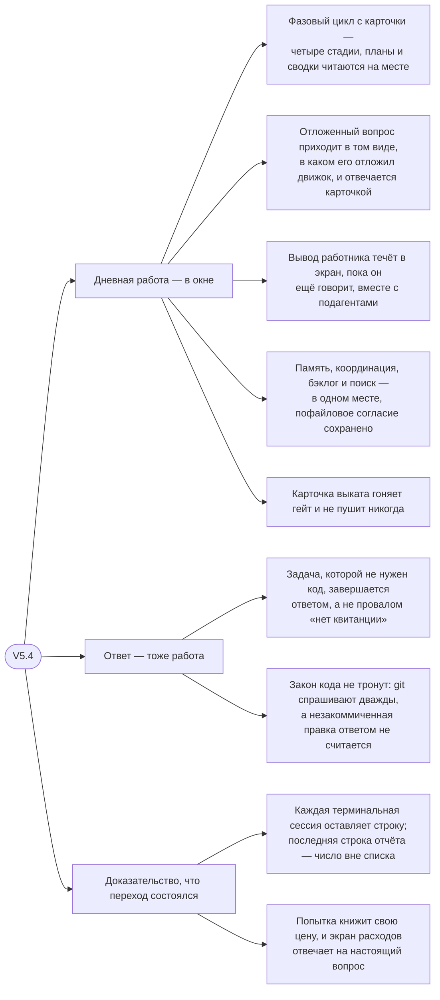
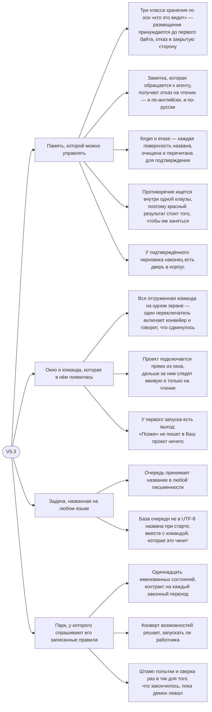
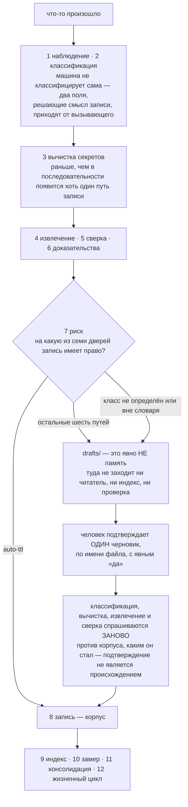
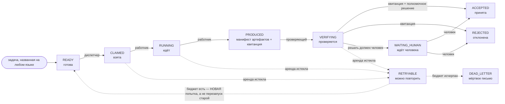
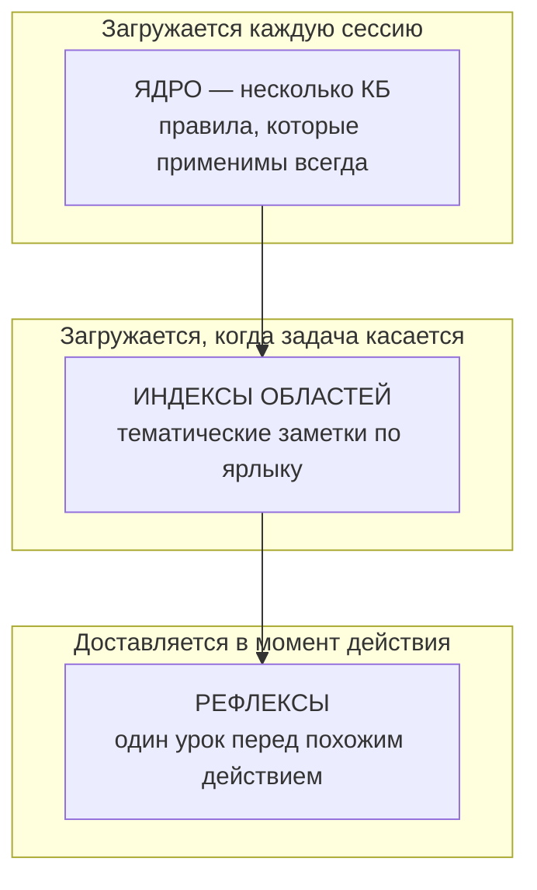

<p align="center">
  
</p>

<p align="center">
  
  
  
  <a href="LICENSE"></a>
  
  
</p>

# SMA — Shared Memory & Automation

**SMA — это local-first управляющий контур памяти и подотчётности для ИИ-агентов, пишущих код: он доставляет агенту нужное проектное знание в момент действия — и независимо проверяет его утверждения. Слоистая память, которая приходит вовремя; координация терминалов без сервера; каждое «готово» сводит скрипт, переповеряет слепой проверяющий, и оно блокирует релиз, если ложно.**

[English version → README.md](README.md)

> ### 🗺️ [Открыть живую карту системы →](https://sma-framework.github.io/sma/master-graph.html)
> Все подсистемы SMA на одной интерактивной странице — самый быстрый способ увидеть, как всё связано.

> ### 🆕 [Что нового в V5.4 →](#что-нового-в-v54)
> Целый рабочий день без терминала: пятьдесят три живых двери, фазовый цикл из приложения, отложенный вопрос, отвечаемый карточкой — и задача, которой не нужен код, завершающаяся ответом, а не красной строкой.

> ### 🧭 [Роадмап →](ROADMAP.ru.md) · [in English](ROADMAP.md)
> Где SMA сейчас и что дальше: **оркестрация V5 (парк работников 24/7) — вышла → V5.1 работает с тем, что у вас есть + рабочий фронт — вышла (v5.1.0) → V5.2 измеренная память — вышла (v5.2.0) → V5.3 управление + укреплённый парк — вышла (v5.3.0, патч v5.3.1) → V5.4 целый рабочий день без терминала — вышла (v5.4.0, патчи v5.4.1–v5.4.3) → V5.5 двигатель: рулёжка живой сессии — вышла (v5.5.0, патчи v5.5.1–v5.5.2, текущая).**

> **Это не плагин памяти.** Это рабочая дисциплина поставки настоящего кода с ИИ-агентом: память, которая приходит ровно в тот момент, когда нужна; координация, которая не даёт двум терминалам затирать друг друга; и, начиная с V3, **хребет доверия**, в котором каждое «готово» сводит скрипт, переповеряет слепой проверяющий, а ложное «готово» блокирует следующий релиз. Он пишет только в несколько папок рядом с Вашим кодом — **Ваше дерево исходников не трогается никогда** — и всё, что он знает или принуждает, это обычный файл, который можно прочитать, сравнить и откатить.

---

## Установка

### 1 · Что нужно заранее

| | |
|---|---|
| **Node 22.5 или новее** | Node — это программа, которая запускает скрипты SMA. Проверьте свою версию командой `node -v`. Если число меньше или команда не найдена, поставьте текущую версию с [nodejs.org](https://nodejs.org). |
| **git** | SMA хранит всё обычными текстовыми файлами в Вашем репозитории, поэтому проект должен быть git-репозиторием (если ещё нет — выполните в нём `git init`). |
| **Claude Code** | ИИ-агент для кода, в который SMA встраивается сегодня. Команды `/sma-…` ниже набираются прямо в сессии Claude Code — так же, как Вы обычно с ним разговариваете. |

Больше ничего. Ядро SMA не добавляет в Ваш проект ни одного пакета и не требует ни базы данных, ни сервера, ни аккаунта. (Необязательное дополнение — парк работников, описанный ниже, — просит большего; его можно вовсе не трогать.)

### 2 · Одна команда

Откройте терминал, перейдите в корневую папку **Вашего собственного проекта** и выполните:

```bash
npx -y sma-framework@latest init
```

Это вся установка. Она занимает несколько секунд и печатает каждый записанный файл. (`npx` — встроенный в Node способ «скачать и запустить один раз»; после себя он ничего не оставляет.)

### 3 · Что появится после неё

Новые папки появляются **рядом** с Вашим кодом. Ни одна строка Вашего исходника не правится.

```text
ваш-проект/
├─ src/, package.json…   ← ВАШ КОД — не тронут
│
├─ .claude/
│  ├─ skills/            ← 14 команд /sma-…, которые теперь можно набирать
│  ├─ agents/            ← помощники, которых эти команды вызывают
│  ├─ sma-core/          ← движок: инструкции, стоящие за каждой командой
│  ├─ memory/            ← заметки Вашего проекта — ставятся ПУСТЫМИ, заметки остаются Вашими
│  └─ settings.json      ← хуки, встраивающие SMA в агента (Ваши записи сохраняются)
├─ scripts/sma/          ← консольный инструмент, которым команды пользуются под капотом
├─ .sma/                 ← рабочее состояние: кто что правит и журнал проверок
└─ CLAUDE.md             ← добавляется один короткий помеченный блок; Ваш текст не тронут
```

Папка `.planning/` появится позже — когда Вы первый раз будете планировать работу.

Передумали? `/sma-update` заново запускает тот же установщик, чтобы перейти на свежую версию, а `/sma-deleteme` удаляет всё одним действием — и то и другое сохраняет Ваши заметки в `.claude/memory/` и всё остальное локальное. Флаги установки, путь через клонирование репозитория и полный список файлов: [docs/INSTALL.md](docs/INSTALL.md).

## Первые шаги

### С чего начать

Откройте сессию Claude Code в Вашем проекте и наберите:

| Наберите | Что произойдёт |
|---|---|
| `/sma-start` | Разговор-знакомство, один раз. Он спросит, что за проект и как Вы его выкатываете, запишет ответы и заведёт файл заметок. Всё, что Вы запустите дальше, будет говорить в этих терминах. |
| `/sma-help` | Список команд, по строчке на каждую — карта на случай, если забыли название. |
| `/sma-progress` | «Где мы?» — что сделано, что дальше и предложение это запустить. |

### Обычный рабочий цикл

Вы работаете **фазами**: по одному куску работы за раз — фича, исправление, переделка. Четыре команды, всегда в этом порядке:

1. `/sma-discuss-phase 1` — задаёт вопросы, пока цель не станет однозначной.
2. `/sma-plan-phase 1` — пишет план, включая то, как результат будет проверен.
3. `/sma-execute-phase 1` — делает работу и коммитит её шаг за шагом.
4. `/sma-verify-work 1` — проходит результат вместе с Вами и перезапускает проверки, обещанные планом.

Дальше то же самое с `2`, `3` и так далее. Для мелочи все четыре шага не нужны: `/sma-quick` — небольшая задача, `/sma-fast` — задача на одну строку.

### Куда смотреть дальше

- [docs/INSTALL.md](docs/INSTALL.md) — варианты установки, что и куда кладётся, обновление и удаление.
- [docs/DETAILS.ru.md](docs/DETAILS.ru.md) — инженерный разбор, когда захочется понять устройство изнутри.
- `node scripts/sma/cli.mjs explain <имя>` — из корня проекта: объяснение любой команды SMA простыми словами.

## Что нового в V5.4

V5.1 поставила окно. V5.3 наполнила его отгруженной командой. **V5.4 делает его местом, где можно работать весь день** — таблица маршрутов выросла с тридцати дверей до **пятидесяти трёх**, объявлена один раз и заморожена, и ни одной заглушки «скоро будет» в ней не осталось. Подробный разбор — [дальше на этой странице](#целый-рабочий-день-без-терминала); здесь карта.


```mermaid
flowchart LR
    V54(["V5.4"])

    V54 --> D["Дневная работа — в окне"]
    V54 --> A["Ответ — тоже работа"]
    V54 --> P["Доказательство, что переход состоялся"]

    D --> D1["Фазовый цикл с карточки —<br>четыре стадии, планы и сводки читаются на месте"]
    D --> D2["Отложенный вопрос приходит в том виде,<br>в каком его отложил движок, и отвечается карточкой"]
    D --> D3["Вывод работника течёт в экран, пока он<br>ещё говорит, вместе с подагентами"]
    D --> D4["Память, координация, бэклог и поиск —<br>в одном месте, пофайловое согласие сохранено"]
    D --> D5["Карточка выката гоняет гейт и не пушит никогда"]

    A --> A1["Задача, которой не нужен код, завершается<br>ответом, а не провалом «нет квитанции»"]
    A --> A2["Закон кода не тронут: git спрашивают дважды,<br>а незакоммиченная правка ответом не считается"]

    P --> P1["Каждая терминальная сессия оставляет строку;<br>последняя строка отчёта — число вне списка"]
    P --> P2["Попытка книжит свою цену, и экран расходов<br>отвечает на настоящий вопрос"]
```

### Ответ — тоже работа

«Разберись и скажи» — настоящая работа, и до этого выпуска она кончалась красной строкой: единственная дверь в «сделано» требовала квитанцию о коде, которого не должно было существовать. Теперь такая задача завершается **квитанцией ответа** и уезжает в одобрение, где карточкой, которую человек подтверждает, служит собственная записка работника.

Закон, который нельзя было трогать, — про работу, которая коснулась репозитория, и он остался цел. Новый гейт открывается только тогда, когда репозиторий не может сказать, что попытка вообще была: git спрашивают дважды и никогда не спрашивают работника — **ноль коммитов** на ветке задачи и **чистое рабочее дерево**. Правка, брошенная незакоммиченной, — это незаконченная работа кода, а не ответ, и она падает ровно как раньше. Каждый вопрос падает безопасно: нет git, исключение или счётчик, не равный простому нулю — и остаётся прежний исход.

### Доказательство, что переход состоялся

Утверждение «я работал только из приложения» стоит ровно столько, сколько стоит его проверка, поэтому проверка едет вместе с выпуском. Хук старта сессии пишет по строке на каждый запуск терминала, а `terminal-journal.mjs report --since <дата>` раскладывает строки по **четырём видам работы, которым разрешено остаться в терминале** — замеры, хирургия истории git, снос фреймворка и починка самого демона — и печатает **последней строкой** число запусков вне этого списка. Отсутствующий журнал не выдаётся за ноль: команда говорит об этом прямо и выходит с кодом 3, потому что отсутствие записи не есть запись об отсутствии. Сессии, которые спавнит демон, пропускаются вовсе — считать их значило бы утопить доказательство в том, что оно измеряет.

Попытка теперь книжит и свою цену, поэтому экран расходов отвечает настоящими числами, а не нулём.

**Чего этот выпуск не утверждает.** Пятидневный прогон, доказывающий переход — полный фазовый цикл, проведённый из окна от начала до конца, — это живая эксплуатация *после* этой версии, а не квитанция внутри неё.

## Что нового в 5.4.2

### Контроль качества, который продуктом пользуется, а не читает его

Все проверки интерфейса во флоте читали код. Единственный путь, которому полагалось посмотреть на живое приложение, вызывал `npx playwright screenshot … 2>/dev/null` — команду, которая на любой машине без этого пакета в кэше отказывается работать без человека, а при устаревшем кэше браузера падает на несовпадении сборки. Обе ошибки уходили в `/dev/null`, аудит продолжался как чтение исходников — **и всё равно выставлял оценку**. Панель, не подключённая ни к чему, фотографируется как чистый проход, а человек, которому сказали, что машина посмотрела, перестаёт смотреть сам.

`sma-ui-qa` — это отдел контроля качества: он работает после проверяющего и до того, как фаза дойдёт до Вас. Проверяющий спрашивает, показывает ли **репозиторий**, что цель достигнута; этот спрашивает, **делает ли продукт это, когда им пользуются**, — а файл может быть на месте, импортирован, покрыт тестом, и фича при этом не работать.

**Сравнивает он с обещаниями самой фазы и не выдумывает ничего.** Он загружает тот же контракт, что и проверяющий, — критерии успеха из дорожной карты, обязательные пункты плана, идентификаторы требований — и превращает каждый в тестовый случай, который *прогоняет*: набрать в поиске и посмотреть на выдачу, нажать «Экспорт» и открыть файл. Критерий, который проверить не удалось, — ЗАБЛОКИРОВАН, а не пройден. Затем он обходит поверхность: нажимает каждый видимый элемент по разу и сообщает, что сломалось, скольких он достал **из скольких существующих** и какие нажать отказался, потому что они разрушают данные, — «Удалить», «Выкат», «Оплатить» остаются человеку и названы в квитанции, а не пропущены молча.

Под ним `scripts/sma/ui-drive.mjs` пишет квитанцию и выходит с ненулевым кодом на блокирующей находке, чтобы гейт мог запирать, а не советовать. Рядом с контрактом он докладывает то, что измеряется, а не судится: содержимое шире экрана на телефонной ширине, элемент, который невозможно нажать, элемент без доступного имени, необработанные исключения, недошедшие запросы, собственный интерфейс приложения на 4xx или 5xx.

**На переработку билдеру уходит только измеренное.** Провалившийся критерий или мёртвый запрос воспроизводятся — машина вправе их вернуть. «Хорошо ли читается иерархия» не воспроизводится, и это ложится на карточку советом человеку: оценка красоты с десятичной дробью — случайное число, а случайное число, отправляющее людей на переработку, ещё и дорогое. И петля умеет кончаться: дефект, переживший одну переработку, третий раз не отправляется — он паркуется Вам с описанием обеих попыток.

Правило, ради которого всё это существует: **прогон, которого не было, никогда не считается проходом.** Нет драйвера браузера — значит код 3, слово `НЕ ПРОГНАНО` и та единственная команда, которая это чинит; никогда — пустой список находок, читающийся как «чисто». SMA по-прежнему объявляет **ноль зависимостей исполнения**: драйвер разрешается в момент запуска, никогда не ставится за Вас, а `SMA_UI_DRIVER` указывает на уже установленный в другом месте — чтобы живая проверка не тащила 120 МБ в проект, который об этом не просил.

**Чего этот выпуск не утверждает.** Это управление браузером: родные и мобильные оболочки остаются за границей. А та часть, что судит, *хорош* ли экран — читается ли текст, честен ли отказ, находится ли главное действие за две секунды, — это модель, читающая скриншоты, то есть суждение, а не измерение. Измеренная половина — дефекты исполнения; квитанция держит их врозь, чтобы читатель видел, где что.

### Что поймал его первый прогон — починено в этом же выпуске

Первый живой проход нового проверяющего по собственному окну продукта нашёл пять дефектов, которых не видело ни одно чтение кода, — они едут здесь уже починенными:

- закрытая вкладка освобождает слот живых событий — окно больше не слепнет навсегда после шестнадцати открытий
- проверка корпуса отвечает за секунды бюджетным отчётом, называющим пропущенное, вместо вечного вращения
- экран координации показывает живые сессии и брони подключённого чекаута; нечитаемый журнал сообщает о себе, а не притворяется пустой комнатой
- деньги перестают противоречить себе: каждая строка расхода несёт свой канал, и цифра платного канала считает только платную работу
- экран памяти читает оглавление выбранного проекта, а не папку демона

Переполнение на узких ширинах, которое он тоже отметил, записано тем, что оно есть, — стоячим решением дизайна (окно построено под 1440 px и шире), теперь видимым в квитанции прогона через `--min-viewport`, а не краснящим каждый проход.

## Что нового в 5.5.2 — двигатель, соединённый

5.5.0 построил двигатель. Этот выпуск — день, когда выяснилось, что его части никогда не были прикручены друг к другу. Девять разрывов, все одного класса: каждый кусок написан, покрыт тестами, зелёный — и ни к чему не присоединён. Каждый следующий становился виден только после починки предыдущего. Здесь они выходят починенными.

- **Работник не мог изменить ни одного файла — ни разу за всю историю продукта.** Конверт разрешений считался для каждой полосы, хэшировался в каждую попытку и писался в журнал — и никогда не передавался запускаемому процессу. Неинтерактивной сессии некому подтвердить действие, поэтому Edit, Write, Bash, Grep и Glob отклонялись на месте: работник мог прочитать репозиторий, найти причину дефекта, написать точную правку в итоговое сообщение — и не мог её применить. Все задачи падали ниже по течению («нет квитанции», «тесты красные»), и ни один экран не мог назвать причину, потому что отказ происходил внутри дочернего процесса. Грант — это список самого конверта и ничего сверх: политика не расширяется, она **доставляется**.
- **Живой работник объявлялся мёртвым каждые две минуты.** Продление аренды задачи звало метод, которого у библиотеки очереди нет вовсе, а ошибка глушилась пустым перехватом. Работник считался замолчавшим, его процесс никто не убивал, и запускался дубль — три параллельных агента на одной задаче, сжигающих одну подписку.
- **Доска показывала пустую комнату, пока шла работа.** Исполнителя выбирал маршрутизатор и никуда не записывал, а все счётчики занятости строятся по этому полю. Отсюда свободный работник и пустая очередь рядом с задачей, которая на самом деле выполнялась.
- **Работа шла в чужом репозитории.** Рабочая копия резалась в каталоге запуска демона, а не в дереве подключённого проекта — и карточка «сделано», дверь диффа, таймлайн задачи и гейт «ответ без кода» читали git там же, называя основную ветку жёстко зашитым словом.
- **Готовую работу невозможно было принять.** Гейт приёмки спрашивал проверку, не требуя структурного ответа, и получал прозу, из которой разбор доставал пустоту; а в репозитории без структурных рецептов честный ответ «проверять нечего» читался как «нет квитанции» и валил работу с настоящим коммитом. Теперь работа с коммитом, но без доказательства, не объявляется сделанной — она уезжает в колонку человека с пометкой *проверки не было*. Никакой самосертификации: «сделано» по-прежнему ставит только человек.
- **Записку работника о подходе не слышали никогда.** Разбор требовал маркер в начале строки, а поток приходит JSON-кадрами, где слова работника лежат внутри поля. Три попытки подряд печатали объяснение, и все три были засчитаны как необъяснённые.
- **Полоса кузницы — создание агентов и навыков — не получила ничего из перечисленного.** Те же четыре промаха заново, на своей ветке кода.
- **Живые обновления никогда не доходили до окна.** Демон называет каждый кадр (`event: <имя>`), а окно слушало только безымянный тип по умолчанию, которому именованный кадр не доставляется никогда. С того дня, как хаб начал называть кадры, не доехал ни один звонок: все экраны молча жили на опросе раз в три секунды, а живая лента всегда показывала «Пока тихо». Ничего не падало — поэтому ничего и не заметили. Теперь окно подписано по имени на каждое объявленное имя, и провод доказан от края до края тестом: настоящий хаб → настоящий сервер на живом порту → сокет → разбор потока по букве спецификации → слушатель самого окна, и требуется, чтобы дошли все объявленные имена.
- **Корпус молча терял заметки на Windows-выкладках.** Все грамматические решения читателя frontmatter предполагали LF, поэтому заметка, пришедшая с CRLF, возвращалась «структурным файлом» — описание, вид, метки, важность исчезали без единого слова, — а словарь меток возвращался пустым, после чего линт объявлял незарегистрированной каждую метку корпуса. Владелец не видит этого по построению: у него старая выкладка с LF, а каждое свежее рабочее дерево, которое демон режет работнику, приходит с CRLF.

**Новое и видимое.** Цифра окна подписки на экране расходов — теперь та самая, которую Claude Code передаёт своей строке состояния: единственный программный источник, который считает и сессии, проведённые вами в собственном терминале. Она ложится снимком наблюдения, не приписывается ни одному аккаунту (в этом stdin нет имени аккаунта, а угадать его — ровно тот класс догадки, от которого этот модуль и уходит) и протухает вместе с окном: после сброса блок говорит, что свежего наблюдения нет, и когда было последнее. Ноль не показывается никогда — ноль читается как «квота свободна».

Рядом с ними — то, что было построено и ни разу не увидено: свежая попытка на карточке задачи раскрывается без клика, а её сводка — сколько шагов, какие инструменты и сколько раз, какие файлы изменены, были ли подключения и навыки, шло ли через платный канал и сколько стоило — читается там же словами.

**Чего этот выпуск не утверждает.** Цифры из терминала появятся после вашей следующей сессии в терминале; до этого блок говорит об этом словами, а не рисует ноль. Три известных разрыва учтены и здесь НЕ починены: платный канал пока не может выполнить задачу, стадию фазы нельзя принять из окна, а квитанция слияния всё ещё сообщает о прогоне тестов, который к ней не подключён. Они названы здесь по той же причине, что и девять выше: выпуск, скрывающий то, что сам знает о своих поломках, — это ровно та беда, на доказательство которой ушёл этот день.

## Что нового в 5.5.0 — двигатель

Дыра рынка, которую вскрыла разведка конкурентов (11.08): **рулить живой сессией агента не даёт никто** — у Hermes есть словарь, но нет окна; у Paperclip есть видимость, но нет руля; у Multica есть вход, но её поток так и не завёлся. Этот выпуск встраивает руль в окно:

- **Карточка задачи — тред.** Приказ, каждый нумерованный подход свёрткой («Подход 2 · готово · 1 мин 20 с»), и свёртка раскрывается в стенограмму — в трёх чтениях: **Лента** (человеческая: крошки инструментов, передачи агентам), **Сырьё** (каждая строка как записана), **Вживую** (прибито к хвосту бегущей попытки). Одна стенограмма, один читатель — тот же, что в «Живом потоке».
- **У текста, набранного против бегущей работы, объявленная судьба.** На карточке бегущей задачи — руль: **«Перебить сейчас»** гасит прогон, и ТА ЖЕ сессия продолжается с вашей поправкой — всё сделанное остаётся у неё в голове; **«После хода»** даёт прогону закончиться, и поправка едет продолжением. Поправка пишется на диск ДО выстрела — рестарт демона не потеряет ваше «нет, не так».
- **Возврат продолжает ту же сессию.** Задача, возвращённая с комментарием, раньше начинала с нуля; теперь подход N+1 продолжает сессию подхода N — контекст, за который вы уже заплатили, переживает возврат.
- **Проверка корпуса говорит по-русски** в русском окне (включая предупреждение о частичном прогоне по бюджету).

**Чего этот выпуск не утверждает.** Настоящий впрыск в середину хода — поправка между двумя tool-вызовами ТЕКУЩЕГО хода, как у Hermes — упирается в stdin-протокол CLI и НЕ построен; «Перебить сейчас» — честное «погасить и продолжить», так и названо. У Codex другой протокол продолжения: поправка к codex-задаче пропускается С ЗАПИСЬЮ, не молча. Статистика работника за 30 дней требует пер-работникового индекса попыток, которого у леджера пока нет — отложена, учтена.

Одна объявленная новая дверь (`POST /api/redirect`) — переторжка таблицы маршрутов 54 → 55.

## Что нового в 5.4.3

Первая волна «двигателя» — пять приёмов, которые делают окно живым; каждый снят с разведки конкурентов и построен по-нашему:

- статус разговора **тикает посекундно** («Думает · 12 с») — живую систему видно по движению цифры
- пока ход работает, **«Отправить» превращается в «Стоп»** — и остановленный ход отвечает «остановлено», а не извинением за «сбой», который вы сами приказали
- после «Стоп» **ваш текст возвращается в поле ввода** — стоп это поворот, не потеря
- задача в очереди, которую никто не заберёт, **называет причину прямо на карточке** (конвейер выключен / окна закрыты / бюджет исчерпан), а форма новой задачи предупреждает **до** отправки — «Queued без причины» здесь больше не существует
- провал попытки читается **в два слоя**: человеческая фраза плюс сколько подход длился, и сырой код причины в одном клике

Одна новая дверь (`POST /api/chat/stop`) — объявленная переторжка таблицы маршрутов, 53 → 54.

## Что нового в 5.4.1

Фиксы, накопившиеся на главной ветке после штампа 5.4.0, — нарезаны отдельным выпуском, а не отправлены ехать попутчиками со следующей функцией:

- потолок расходов начинает существовать, а оценка перестаёт книжить века
- живые обновления доходят, а строки подагентов группируются под работником, который их породил
- карточка показывает квитанцию, которая есть, вместо «квитанции нет»
- вход ведёт к работе, а память показывает записи **выбранного** проекта
- парк останавливается из окна, машина отвязывается
- очистка контекста внутри окна больше не считается новым терминалом
- живой лог говорит словами, какой инструмент отработал и что передано агенту

## Что нового в V5.3

V5.2 сделала слой памяти **измеримым**. V5.3 делает его **управляемым** — и то же самое проделывает с необязательным парком: правила, записанные до этого прозой, теперь и есть те правила, о которых спрашивает работающий код. Четыре направления, один выпуск. Всё перечисленное ниже разобрано подробно дальше на этой странице; здесь — карта.


```mermaid
flowchart LR
    V53(["V5.3"])

    V53 --> M["Память, которой можно управлять"]
    V53 --> W["Окно и команда, которая в нём появилась"]
    V53 --> L["Задача, названная на любом языке"]
    V53 --> F["Парк, у которого спрашивают его записанные правила"]

    M --> M1["Три класса хранения по оси «кто это видит» —<br>размещение принуждается до первого байта, отказ в закрытую сторону"]
    M --> M2["Заметка, которая обращается к агенту,<br>получает отказ на чтении — и по-английски, и по-русски"]
    M --> M3["forget и erase — каждая поверхность названа,<br>очищена и перечитана для подтверждения"]
    M --> M4["Противоречие ищется внутри одной клаузы,<br>поэтому красный результат стоит того, чтобы им заняться"]
    M --> M5["У подтверждённого черновика наконец есть дверь в корпус"]

    W --> W1["Вся отгруженная команда на одном экране —<br>один переключатель включает конвейер и говорит, что сдвинулось"]
    W --> W2["Проект подключается прямо из окна,<br>дальше за ним следят вживую и только на чтение"]
    W --> W3["У первого запуска есть выход:<br>«Позже» не пишет в Ваш проект ничего"]

    L --> L1["Очередь принимает название в любой письменности"]
    L --> L2["База очереди не в UTF-8 названа при старте,<br>вместе с командой, которая это чинит"]

    F --> F1["Одиннадцать именованных состояний,<br>контракт на каждый законный переход"]
    F --> F2["Конверт возможностей решает, запускать ли работника"]
    F --> F3["Штамп попытки и сверка раз в тик для того,<br>что закончилось, пока демон лежал"]
```

### Память, которой можно управлять

Главное — три класса хранения: заметке, помеченной как ограниченная, вход в любой путь под git закрыт **ещё до записи первого байта**, в обеих дверях записи, и она ложится в `.sma/local-memory`. Найденный текст стал данными, а не инструкцией: заметка с обращением «игнорируй предыдущие инструкции» — и тем же приёмом по-русски — отклоняется с названной причиной. `memory forget` отставляет заметку; `--erase` физически удаляет её с каждой поверхности, где может лежать копия, называя каждую и перечитывая её после; и **умеет отказать**, если эпизод в архиве делит с записью один id, — история это другой класс актива, чем истина.

У конвейера записи появилась дверь, которой ему не хватало. Шаг 7 откладывает в черновики всё, что не является наблюдением с низким риском, — и до этого выпуска у подтверждённого черновика вообще не было пути в корпус:


```mermaid
flowchart TD
    E["что-то произошло"] --> S1["1 наблюдение · 2 классификация<br>машина не классифицирует сама — два поля,<br>решающие смысл записи, приходят от вызывающего"]
    S1 --> S3["3 вычистка секретов<br>раньше, чем в последовательности появится хоть один путь записи"]
    S3 --> S4["4 извлечение · 5 сверка · 6 доказательства"]
    S4 --> S7{"7 риск<br>на какую из семи дверей запись имеет право?"}

    S7 -->|"auto-ttl"| S8["8 запись — корпус"]
    S7 -->|"остальные шесть путей"| DR["drafts/ — это явно НЕ память<br>туда не заходит ни читатель, ни индекс, ни проверка"]
    S7 -->|"класс не определён или вне словаря"| DR

    DR --> DOOR["человек подтверждает ОДИН черновик,<br>по имени файла, с явным «да»"]
    DOOR --> RECHECK["классификация, вычистка, извлечение и сверка спрашиваются ЗАНОВО<br>против корпуса, каким он стал — подтверждение не является происхождением"]
    RECHECK --> S8
    S8 --> S9["9 индекс · 10 замер · 11 консолидация · 12 жизненный цикл"]
```

Единственный автоматический путь — `auto-ttl` — это и единственный путь, который пишет без человека, и он вдобавок требует срока хранения. Запись, чей класс определить не удалось, падает в закрытую сторону, к самой строгой двери. За подтверждением стоит команда `sma memory write --apply <черновик> --confirm <id>.md --yes`; миграция схемы устроена так же — по умолчанию предпросмотр, за раз применяется одно предложение, руками.

Поиск противоречий стало осмысленно слушать. Он смотрит на все виды заметок, которые *формулируют правило*, и читает русский корпус так же, как английский, — поэтому чистый результат теперь означает «ничего не нашлось», а не «ничего не смотрели». Противоречием считается только то, где одна заметка отрицает другую **об одном предмете и внутри одной клаузы**, и дата больше не читается как величина. На живом корпусе это превратило две критические находки — обе ложные — в ноль, причём все настоящие срабатывания остались на месте.

### Задача, названная на любом языке

PostgreSQL фиксирует кодировку базы в момент её создания, а `initdb` на Windows по умолчанию берёт ANSI-кодовую страницу. Очередь, созданная там, отвечала на кириллическое, греческое, японское название или эмодзи стек-трейсом драйвера. Теперь демон спрашивает у базы её кодировку при старте, говорит, что произойдёт и какой командой это чинится, и отказывает такому названию той же фразой. `node supervisor/queue-utf8-migrate.mjs --apply` строит базу в UTF-8, переносит ожидающие задачи и строки попыток и **сохраняет** старую — команды `DROP` в нём нет.

Дальше это название идёт по одиннадцати именованным состояниям парка. Каждая стрелка ниже — контракт в отгруженной машине состояний: кто вправе его выполнить, что должно быть верно заранее и что он записывает:


```mermaid
flowchart LR
    T(["задача, названная на любом языке"]) --> R

    R["READY<br>готова"] -->|"диспетчер"| C["CLAIMED<br>взята"]
    C -->|"работник"| RUN["RUNNING<br>идёт"]
    RUN -->|"работник"| P["PRODUCED<br>манифест артефактов + квитанция"]
    P -->|"проверяющий"| V["VERIFYING<br>проверяется"]

    V -->|"квитанция + полномочное решение"| A["ACCEPTED<br>принята"]
    V -->|"квитанция"| RJ["REJECTED<br>отклонена"]
    V -->|"решать должен человек"| H["WAITING_HUMAN<br>ждёт человека"]
    H -->|"человек"| A
    H -->|"человек"| RJ

    C -.->|"аренда истекла"| RT["RETRYABLE<br>можно повторить"]
    RUN -.->|"аренда истекла"| RT
    V -.->|"аренда истекла"| RT
    RT -.->|"бюджет есть — НОВАЯ попытка, а не перезапуск старой"| R
    RT -.->|"бюджет исчерпан"| DL["DEAD_LETTER<br>мёртвое письмо"]
```

`ACCEPTED`, `REJECTED`, `DEAD_LETTER` и `CANCELLED` — конечные, и конечность выражена *отсутствием* исходящих контрактов, а не флагом: состояние не может быть конечным в одном месте и протекать в другом. В `ACCEPTED` попасть можно только при наличии квитанции проверки **и** полномочного решения. Полная таблица, семь инвариантов и — в §5 — то, что намеренно не является целью: [docs/FLEET-INVARIANTS.md](docs/FLEET-INVARIANTS.md).

### Остальное из выпуска, одним дыханием

- **Команда отгружается целиком, и окно её показывает.** Каждый агент, который приезжает с продуктом, виден на экране команды рядом с Вашими собственными и помечен как стоковый, Ваш или стоковый, который Вы правили. Переключатель теперь панель, вверху того раздела, на который он действует: состояние словами, количество цифрами, что сделает одно нажатие — и результат в любом случае, потому что действие, заканчивающееся тишиной, само по себе дефект.
- **Проект подключается из окна** — формой, а не собранным руками HTTP-запросом, — и дальше за его файлами следят по мере их изменения. Память подключённого проекта окно показывает **только на чтение**, а предпросмотр миграции ограничен: корпус больше 200 заметок сообщает свой размер, а не строит предпросмотр такого масштаба.
- **Первый запуск можно отложить.** «Позже» закрывает интервью, не записав в Ваш проект ни одного файла; ответ хранится на стороне демона — окно перестаёт спрашивать, а дверь остаётся открытой.
- **Релизный гейт снова можно запускать.** `lint` по настоящему дереву планирования из 151 плана занимал ~193 с, и 92 % этого времени приходилось на две проверки, поднимавшие 604 процесса git, чтобы дважды ответить на один вопрос. Теперь он спрашивает git один раз за прогон: **193 с → 3,5 с, 604 запуска → 27**, и отчёт побайтово тот же. Проверка, которая стоит дороже всего набора тестов, — это проверка, которую перестают запускать. Заодно появились прогресс в stderr и бюджет по стенным часам: по его исчерпании прогон говорит `PARTIAL` и выходит ненулевым кодом, а не обрывается молча.
- **Набор тестов вырос вместе с этим** — с 2050 случаев на штампе v5.2.0 до числа в бейдже вверху этой страницы, которое пишется по измеренному прогону скриптом `badge.mjs`, а не набирается руками: гейт публикации не пропускает пакет, чей бейдж расходится с квитанцией.

## Окно — приложение V5.1, которое раздаёт демон

V5 выпустил двигатель и намеренно тонкую операционную панель. V5.1 строит поверх него приложение: **семнадцать экранов**, собранных один раз и раздаваемых самим демоном — за тем же токеном и той же замороженной таблицей маршрутов. Второй веб-сервер не появляется, лишний порт не открывается, ничего нового не слушает сеть.

Приложение приезжает уже собранным: npm-пакет везёт готовый фронт в `daemon/static/app`, так что собирать перед открытием нечего. Собственные зависимости демона едут внутри пакета тем же способом — девятнадцать пакетов, около 6 МБ, вендоренные в `daemon/node_modules`, — так что и второго `npm install` для него нет; полный перечень с лицензией каждого лежит в [THIRD-PARTY-LICENSES.md](THIRD-PARTY-LICENSES.md). Из git-клона его пересобирает `cd spa && npm run build` — в ту же папку. Больше демону ничего подключать не нужно, а панель, которую он раздавал раньше, остаётся ровно там же — как аварийный вид. Чистый старт говорит об этом вслух — одной строкой, *«Buckle up, soldier — the park is live»*, с точным адресом, который открывать; ошибка всегда была громкой, и успех больше не шепчет.

### Целый рабочий день без терминала

V5.1 поставила за демоном семнадцать экранов. То, что пришло следом, превратило их в место,
из которого можно действительно работать: таблица маршрутов выросла с тридцати дверей до
**пятидесяти трёх**, объявленных разом и замороженных, и живы все — ни одного хендлера
«скоро будет» в ней не осталось.

- **Цикл фаз, который ведётся из приложения.** Индекс всех фаз с бейджем «N открыто / M отвечено»,
  карточка фазы с четырьмя стадиями и кнопкой у каждой, планы и итоги открываются на месте
  простым текстом, приёмка отвечается построчно. Фаза называется так, как **Вы** назвали её
  в роадмапе, а не именем каталога.
- **Припаркованный вопрос отвечается карточкой.** Когда стадия останавливается спросить, вопрос
  приходит в окно ровно в той форме, в какой движок его припарковал: вариант **или** свои слова,
  одно из двух, и форма говорит, что убрать, вместо того чтобы молча выбросить одно.
- **Живой лог попытки.** Вывод работника течёт на экран, **пока он ещё говорит**, включая текст
  его субагентов — сессия, которая делегирует, не пропадает за спиннером на минуты.
- **Верстак памяти.** Черновики разбираются по одному, у каждого свой предпросмотр и своё «да»;
  отчёт линтера, пересборка индекса и двери корпуса — всё в окне. В Ваш корпус ничего не
  записывается без пофайлового подтверждения.
- **Координация и бэклог.** Кто что держит, какие claim'ы сталкиваются, и бэклог с дверью
  «поднять в задачу» — то же состояние, что читает терминал, в одном месте.
- **Карточка выката — и она никогда не пушит.** Она гоняет гейт, записывает прогон и ставит
  отметку. **Сама публикация остаётся человеческим действием** по конструкции: у демона нет пути
  к `origin`, и эта карточка его не изобретает.
- **Поиск по всему и Ctrl+K.** Один поиск по задачам, фазам, памяти и бэклогу с фильтром
  видимости, плюс палитра команд. Палитра **открывает то, что исполняет**, а не исполняет сама —
  нажатие клавиши не есть согласие.
- **Несколько аккаунтов, секреты остаются локальными.** Аккаунты добавляются из окна; значение
  токена через него не проходит никогда — только ИМЯ переменной, в которой он лежит. Сессия
  каждого работника собирается с учётными данными одного аккаунта и ничьими больше.

### Открыть окно — что на самом деле нужно для первого запуска

Приложение принадлежит **необязательному** слою V5, и этот слой просит две вещи, которых ядро памяти и координации не просит никогда: процесс, который не выключается, и надёжное место для работы. Ничто из написанного ниже не нужно, чтобы пользоваться памятью, координацией и подотчётностью SMA: пропустите весь раздел — остальное работает полностью.

**1 · Локальный PostgreSQL под очередь.** Демон держит очередь задач в Postgres (pg-boss), в отдельной базе — никогда в боевой базе Вашего приложения и никогда не выставленной в интернет. Честных дорог две, и третьей продукт не выдумывает: направить `queueUrl` на **сервер, который у Вас уже есть** (SMA не ставит PostgreSQL и не управляет Вашим), либо запустить **встроенную песочницу** — для машины, где нет ни PostgreSQL, ни docker, ни прав администратора:

```bash
node supervisor/pg-sandbox-windows.mjs start
```

Она ждёт, пока ответит настоящая сессия, а не доверяет открытому сокету, создаёт базу очереди, если её нет, и, когда всё уже поднято, так и говорит и выходит с кодом 0. Вся дорога целиком — включая разовый шаг, который создаёт каталог песочницы, — в [docs/INSTALL.md](docs/INSTALL.md).

**Задачу можно назвать на любом языке.** Если база очереди создана не в UTF-8 (на Windows это значение `initdb` по умолчанию), SMA говорит об этом при старте — называет базу, что будет с названием не из латиницы и какой командой это чинится — и отказывает такому названию той же фразой вместо «внутренней ошибки». `node supervisor/queue-utf8-migrate.mjs` показывает отчёт; `--apply` строит базу в UTF-8, переносит ожидающие задачи и строки попыток и сохраняет старую базу под новым именем. Вся процедура, и то, что намеренно не переезжает, — в [supervisor/setup-windows.ru.md](supervisor/setup-windows.ru.md).

**2 · Запустите демон** из клона SMA или из каталога установленного пакета:

```bash
node daemon/src/main.mjs
```

Первый запуск создаёт `~/.sma-daemon/config.json` — машинно-локальные настройки, которые не коммитятся, со свежесгенерированным токеном фронта — и печатает адрес, который слушает (по умолчанию `127.0.0.1:7777`). Если очередь недоступна, старт падает громко и процесс завершается: пропишите в этом файле свой `queueUrl` (по умолчанию `postgres://localhost:5432/sma_daemon`) и запустите снова.

**3 · Откройте приложение один раз с токеном:**

```
http://127.0.0.1:7777/?token=<токен из ~/.sma-daemon/config.json>
```

Один такой заход меняет токен на HttpOnly-куку сессии, а все последующие — это обычный адрес. Пока этого не произошло, демон отвечает `unauthorized` и ничем больше: страницы входа, которую можно подобрать, здесь нет намеренно. Токен читается из файла конфигурации — в лог он не печатается.

**Обвязка «всегда включён»** — задание launchd на macOS, задача Планировщика на Windows — описана в чек-листах [supervisor/](supervisor/) вместе со смоук-прогоном, который доказывает контур целиком, прежде чем оставлять его работать на ночь.

**Ваш день, а не дашборд.** «Сегодня» открывается тем, что парк сделал ночью и что ждёт Вас; доска держит все задачи; экран команды показывает каждого работника с его полосой и окном; живой поток — это работа по мере того, как она идёт; расходы читаются прямо из книги трат — по дням, по полосам и по аккаунтам. Приложение сделано под настольный экран (1440 px и шире): телефон по-прежнему ждёт собственного дизайн-захода, и V5.3 вышла без него, а не сделала вид, что он есть.

**Каждая карточка задачи отвечает ПОЧЕМУ.** Журнал решений едет в том же реестре попыток, что и квитанции, в трёх слоях: собственные причины диспетчера (почему эта полоса, этот работник, это окно — структурные коды из закрытого словаря, никогда не свободный текст), обязательная записка работника о подходе (что выбрано, что отвергнуто, какие правила и записи памяти на это повлияли) и след памяти (какие заметки загрузились, какие рефлексы сработали). Попытка без записки так же неполна, как попытка без квитанции.

**Разговор со связанными руками.** Экран чата несёт одну подпись, и она буквальна: *«Читает и предлагает. Ничего не запускает сам.»* Фактовые вопросы — почему прогон упал, что съедает окно, где стоит задача — отвечают детерминированные read-модели вообще без вызова модели: мгновенно и бесплатно. До модели доходят только свободные вопросы и черновики задач, по короткой полосе вне очереди задач, и черновик всё равно проходит тот же гейт готовности и ту же дверь одобрения, что и любая другая задача. Поверхности исполнения таблица маршрутов ради этого не получает.

**Приведите агентов, которые у Вас уже есть.** Дверь импорта читает хозяйство, уже лежащее в Вашем репозитории — `.claude/agents`, `.claude/skills`, Ваш файл правил — и заводит его через ту же дверь, что и Создатель: черновик, квитанция проверки, очередь одобрения. Мастер показывает, что найдено, что сталкивается с уже занятым именем и что именно будет записано. Импортированные определения — чужой текст, поэтому сам импорт не включает ничего: включение остаётся двумя явными человеческими шагами.

**Первый запуск без терминала.** Как только демон поднят (см. выше), приложение открывается интервью в четыре шага — Ваш проект, Ваша инфраструктура, видимое хозяйство и Ваши первые уроки. Пишутся ровно те же артефакты, что пишет `/sma-start`, тем же самым писателем — так что две двери доказуемо одна дверь. Терминальный путь остаётся для тех, кому он привычнее, и ему демон не нужен вовсе. **И это можно отложить.** «Позже» закрывает интервью, не записав в Ваш проект ни одного файла; ответ запоминается на стороне демона — окно перестаёт спрашивать, а дверь остаётся открытой на потом.

**Терминальный паритет — доказан, а не заявлен.** Сессия работника обязана уметь то же, что Ваша собственная терминальная сессия. Из клона этого репозитория `node tools/terminal-parity-check.mjs <attemptId>` читает один реальный прогон и печатает пять квитанций — сработали хуки, загрузилась память, доступны навыки, соблюдён reverify, совпал профиль модели — и завершается кодом 0 только при пяти из пяти.

### Несколько машин, несколько проектов — одно окно

«Проект» теперь измерение первого класса, а не отдельная установка: один демон ведёт задачи всех Ваших репозиториев, каждая задача несёт свой проект, приложение по нему фильтрует. Существующие задачи приписываются проекту при первом старте — руками мигрировать нечего. Подключение проекта — это форма, а не HTTP-запрос, собранный руками: на экране «Машины и проекты» Вы называете папку проекта, жмёте «Подключить», и демон читает его оттуда. Запись, за которой папки нет, помечена как «не подключён», а не показана так, будто она живая.

Между машинами демоны объединяются в федерацию. Вы назначаете один демон **hub**-ом и знакомите его с пирами прямо из приложения: hub выпускает одноразовое приглашение, Вы переносите его на вторую машину, и дальше hub собирает состояние — присутствие по машинам, расходы и окна по машинам, все проекты в одном окне. Логику пира hub не переигрывает: одобрение или новая задача, поданные с hub-а, доезжают до машины-владельца тем же уже проверенным вызовом и проходят все двери, которые прошли бы локально. Пир, открытый напрямую, по-прежнему показывает свою машину — с тихой плашкой, когда hub недоступен: единой точки отказа нет.

Сеть между Вашими машинами — **Ваша, а не наша**: приватная сеть (WireGuard, Tailscale или self-hosted координатор). **Демон никогда не просит выставить себя в публичный интернет**, и никакого облака вендора в этой конструкции нет нигде.

### Что нужно машине — замерено, а не прикинуто

Ядру SMA не нужно ничего: это обычные файлы рядом с Вашим кодом. Машину просит **парк**, поэтому
вот во что обходится каждая его часть — замерено на референсной Windows-машине (12 логических
ядер, 13 ГБ), на собственном сьюте этого репозитория и на живых сессиях работников:

| | Замер |
|---|---|
| Сам демон | **22 МБ** |
| PostgreSQL (очередь) | **~30 МБ** в покое |
| Одна сессия работника | **~310 МБ** в среднем, ~380 МБ на пике |
| Один полный параллельный прогон тестов | **~1 ГБ** на пике, забирает *ядра − 1* воркеров |

Эти четыре числа и есть вся модель. Машине, на которой одновременно открыто **W** окон и идёт
**T** прогонов тестов, нужно примерно `W × 0,4 ГБ + T × 1 ГБ` рабочего набора, плюс операционная
система, плюс столько же на файловый кэш — и кэш здесь не роскошь: именно он держит `git` быстрым,
когда у каждого работника своё рабочее дерево на тысячу с лишним файлов.

**Разбор примера — три проекта по три окна (девять сессий):** около 3,6 ГБ на сессии, два прогона
тестов одновременно ≈ 2 ГБ, демон и очередь ≈ 0,5 ГБ. Итого **6 ГБ рабочего набора**, и сверх этого
надо оставить место системе и кэшу:

- **Память — 16 ГБ это пол, 32 ГБ — там, где перестаёт быть тесно.** Машина, в которую память
  можно доложить, лучше машины с припаянной.
- **Процессор — минимум 8 ядер / 16 потоков.** Самое тяжёлое, что этот парк делает, — Ваш
  собственный сьют в параллель, много раз в день; два прогона сразу займут все потоки, какие есть.
- **Диск — NVMe SSD, 1 ТБ работает, 2 ТБ комфортно.** Интереснее объёма — **ресурс записи**:
  создание и снос рабочих деревьев это непрерывный поток мелких записей, поэтому берите диск
  с собственным кэшем DRAM и с заявленным ресурсом, который можно посмотреть.
- **Видеокарта не нужна.** Модель считается на стороне провайдера, локального вывода здесь нет
  нигде. Машина, которую продают за графику, — это деньги за способность, которой парк не
  воспользуется ни разу.

Две честные оговорки. Это замеры **одной** машины и **одного** кода — сильнее всего числа двигает
Ваш собственный сьют, так что померьте свой, прежде чем покупать под него. И сессия, которая
в основном ждёт сеть, стоит заметно меньше той, что гоняет Вашу сборку: 310 МБ выше — это
настоящая работа, а не простой.

## До SMA → После SMA

Весь смысл SMA — во втором столбце. Тот же агент, та же модель — другая дисциплина вокруг них.

| | **Без SMA** | **С SMA** |
|---|---|---|
| **1 · Правило потеряно** | В инструкциях сказано: «каждое изменение схемы требует миграции». Через двадцать правок агент добавляет колонку и забывает. Выкатывается — запросы падают на деплое. | Как только агент трогает файл схемы, рефлекс срабатывает **внутри этого действия**: *«изменение схемы → нужна миграция (в прошлый раз это сломало прод)»*. Пропустить нельзя. |
| **2 · «Готово», которого нет** | *«Все тесты зелёные, готово.»* Вы забираете код, запускаете — три красных. Уверенный отчёт был единственным доказательством, и он был неверен. | План заранее записал проверку. При закрытии **скрипт** прогоняет её на свежей копии и пишет `hit` или `miss` в журнал. «Готово» — это перезапускаемая команда, а не фраза, и слепой проверяющий выводит его заново, ни разу не заглянув в отчёт агента. |
| **3 · Урок заново** | Тот же флаг сборки кусает третий месяц подряд. Каждое исправление жило лишь в одном закрытом чате; ничего не перенеслось вперёд. | Первый ожог записан заметкой с триггером. Каждая следующая сессия — и клон любого коллеги — получает предупреждение **до** повтора. Один ожог, постоянное избегание. |
| **4 · Два терминала столкнулись** | Терминал B правит `src/api`, пока Терминал A там же посреди рефактора. Push от B тихо откатывает час работы A; никто не замечает до CI. | B зарегистрировал сессию, а A **занял** `src/api`. Когда B идёт править, его предупреждают *до* нажатия клавиши — и оба взяли номера миграций из одной очереди, так что они не сталкиваются. |
| **5 · Отгружается ложное «готово»** | Отчёт сказал, что фича работает. Она не работала; регрессия доезжает до `main`, и следующий релиз несёт её с собой. | Расхождение класса A, самый тяжёлый сигнал в системе (заявленный проход, который слепой проверяющий воспроизвёл как падение), **автоматически блокирует релизный гейт (`sma preship`)**, пока человек не запишет явное решение. Журнал дописываемый; агент не может простить себя сам. |

> **Честная оговорка.** На одиночной задаче SMA дороже: проверки и память не бесплатны. Его ставка это **цена правильного результата на многих задачах**, а не самый дешёвый одиночный прогон.

<!-- sma:positioning:start -->

## Как SMA сравнивается с аналогами

Поставщик модели не может нейтрально оценивать работу своего же агента. С Claude Outcomes эту мысль нужно заострить, а не убирать: поставщик теперь *может* проверять, потому что отдельно-контекстная оценка вышла как функция платформы. Чего он не может, так это пройти **аудит**. Оценка Outcomes это непрозрачный вердикт по рубрике: нет перезапускаемой квитанции, нет опубликованного трек-рекорда, нет последствия, когда она ошибается. Полоса SMA это слой аудита, который обязан пережить любой оценщик, их или наш, и именно эта полоса даёт SMA пережить поглощение платформой.

Поэтому сравнение намеренно честное, включая то, в чём каждый аналог лучше SMA. Охват дан звёздами GitHub на июль 2026 года, перепроверяйте перед цитированием:

| Инструмент | Охват | В чём лучше SMA | Что делает только SMA |
|------------|-------|-----------------|-----------------------|
| **Claude Outcomes** | платформа | Управляемые сессии, встроенный оценщик результата, ноль настройки | Детерминированные перезапускаемые квитанции, процент попаданий с привязкой к судье, и опровергнутое «satisfied», которое блокирует релиз, пока решение не вынесет человек |
| **claude-mem** | 86k★ | Ведущая механика памяти, отполированная среда SQLite | Оценивает, помогла ли память, и публикует процент попаданий |
| **Aider** repo-map | 47k★ | Детерминированный граф контекста с годами боевой проверки | Несёт корпус памяти и цикл обучения поверх графа |
| **Letta** / MemGPT | 24k★ | Богатая архитектура блоков памяти | Без базы, без сервера, и агент не оценивает сам себя |
| **ccusage** | 16.5k★ | Отличное наблюдение локальных трат | Сигнал трат управляет принуждением, а не только наблюдением |
| **BMAD** | 50k★ | Богатые шаблоны оркестрации | Слой проверки, поэтому утверждение обязано пережить скрипт |

**Чего SMA намеренно не делает в слое, который решает:** ядро памяти, координации и подотчётности работает без демона, без базы данных, без эмбеддингов, без облака и без LLM в горячем пути. Всё это файлы и git (смотрите `node scripts/sma/cli.mjs explain substrate`). Корректность никогда не зависит ни от вызова модели, ни от того, что что-то остаётся запущенным. Парк работников V5 и его приложение это **отдельный необязательный слой** сверху: он действительно поднимает локальный демон и держит очередь в локальном PostgreSQL, и то и другое на Ваших машинах, а если его выключить, всё описанное выше не меняется.

**Сам оценщик тоже оценивается.** Каждый отдельно-контекстный вердикт, слепого проверяющего или вендорского оценщика, если он когда-нибудь будет использован, записывается, сверяется с фактом (откат, переделка, красный CI, отказ основателя), и ошибочное «satisfied» нельзя замять аудитом: оно блокирует релиз, пока человек не вынесет решение. Это и есть аудит, которого непрозрачная оценка дать не может.

**Паспорт доказательств читается двумя способами.** `sma manifest` собирает один детерминированный паспорт на pull request (предсказания и их вердикты, квитанции и их хеши, счёт слепой проверки, окно трат, процент попаданий по областям) и отрисовывает его под читателя: `--md` для комментария в PR, `--json` для инструмента и `--dense` для агента, который печатает весь паспорт как одну фиксированную строку на секцию. Ничего при этом не пересчитывается: все три вида читают один и тот же собранный объект, поэтому компактный вид не может разойтись с тем, который подписал человек, а пустая секция помечается, а не исчезает.

Экономику держат на той же планке доказательств. Здесь бюджеты полос выводятся из *собственных* процентилей трат проекта, а не из вендорского бенчмарка; любой план может опубликовать квитанцию следа (footprint receipt): это арифметика git-diff против записанного заявления, а перерасход засчитывается как промах калибровки; полосы отгрузки ставят пуш на полный прогон тестов и безопасности, который быстрая полоса ослабить не может. Каждая экономия в паре с гарантией качества, а число публикуется только после того, как его оценили (смотрите `node scripts/sma/cli.mjs explain economy`). Книга трат оценивает токены по версионированной локальной таблице цен (никогда не из сети), обновлённой 21.07.2026 до актуальных ставок Claude: добавлено новейшее семейство моделей, исправлена устаревшая, примерно втрое завышенная ставка Opus.

Об адаптации сообщают честно, а не заявляют: реальный процент попаданий и размер выборки живут в значке калибровки и `PASSPORT.md`, который пересобирается из журнала командой `sma passport --build` и воспроизводится на свежей копии. После смены модели значок прячется, пока не наберётся достаточно новых данных, поэтому он никогда не завышает тихо.

Три функции хребта доверия (git-подушка, книга трат и капсула перед компакцией) это мосты, которые более широкая экосистема вполне может поглотить, и это нормально; они не заголовок, заголовок это слой подотчётности. Два поглощаемых вендором кандидата остаются явными тревожными флажками WATCH, а не заголовками: межсессионный, включённый по умолчанию примитив agent-teams, и инструмент advisor, открытый внутри сессий; каждый несёт условие самоудаления, которое убирает наш мост в день, когда платформа его отгрузит.

<!-- sma:positioning:end -->

## Чем SMA отличается

- **Подотчётность, а не только полезность.** Каждое заявление SMA о самом себе — заранее зарегистрированное предсказание, которое оценивает скрипт и переповеряет слепой проверяющий, и только после того, как наступил заявленный горизонт: обещание со сроком «следующая версия» или с будущей датой остаётся зарегистрированным и неоценённым, а не получает вердикт о будущем, которого никто не наблюдал. Хэш квитанции выводится из точной команды проверки, её кода выхода и нормализованного вывода, поэтому две разные проверки никогда не разделят один хэш. Что вообще может быть командой проверки — это один закреплённый список: собственные команды SMA, прогон тестов и `test`, `pack`, `run <скрипт>` Вашего проекта, чтобы релизный гейт хешировал сборку и прогон, а не записывал голые коды выхода; и никогда ничего, что тянет код из реестра пакетов. Команду, которая в этот список не укладывается, пускает только `--unsafe-ack` — он ставит на квитанцию отметку об осознанном обходе, которая остаётся читаемой навсегда, и перезапускаемой такую квитанцию не делает. Системы памяти обещают вспоминание; SMA публикует свой процент попаданий и даёт ложному «готово» заблокировать собственный релиз.
- **Слой, который поставщик отгрузить не может.** Поставщик модели не может беспристрастно проверять работу собственного агента. SMA проверяет её снаружи — детерминированно, без LLM в горячем пути — именно поэтому она переживает поглощение платформой.
- **Сначала детерминизм.** Выдача памяти управляется ярлыками и триггерами, принуждение — обычными скриптами, и весь цикл обучения и проверки работает без единого вызова LLM в горячем пути. Интеллект может сидеть сверху; корректность от него не зависит.
- **Родной для git и обратимый.** Заметки, журналы, книги учёта, квитанции — файлы в Вашем репозитории. Самообучение приходит диффами, которые Вы просматриваете; всё выученное откатывается через `git revert`.
- **Никогда не блокирует.** Предупреждение не останавливает работу; мёртвый хук не вешает сессию; у каждого потока есть выключатель. Жёсткие запреты остаются только за настроенной Вами защитой безопасности и за законом последствий, который Вы включаете сами.
- **Ваше.** Корпус живёт в Вашем репозитории, путешествует с `git clone` и переносим на других агентов: это знание, которым владеете Вы, а не кэш поставщика.

## Память в трёх слоях

Не один большой файл инструкций, а три уровня: всегда загружаемый бюджет остаётся крошечным, и при этом ничего не теряется само собой. (Потерять что-то *намеренно* — это отдельная команда, см. ниже.)


```mermaid
flowchart TD
    subgraph Always["Загружается каждую сессию"]
        C["ЯДРО — несколько КБ<br>правила, которые применимы всегда"]
    end
    subgraph OnDemand["Загружается, когда задача касается"]
        I["ИНДЕКСЫ ОБЛАСТЕЙ<br>тематические заметки по ярлыку"]
    end
    subgraph AtTheAct["Доставляется в момент действия"]
        X["РЕФЛЕКСЫ<br>один урок перед похожим действием"]
    end
    C --> I --> X
```

Каждая заметка несёт триггер `use-when` — именно эта строка позволяет SMA доставить её ровно у нужного действия, а не вываливать весь корпус в каждый промпт. Авто-очистка никогда не удаляет — она *понижает* заметку по слоям (в собственном прогоне этого репозитория всегда загружаемый индекс уменьшился с 46 КБ до 5 КБ с полным сохранением вспоминания). *Авто-очистка лишь меняет, насколько громко система помнит; настоящее забывание — отдельная осознанная команда, и никогда не побочный эффект.*

Выдача отсеивается до всякого ранжирования: заметка, которую отставили, у которой истёк собственный срок действия или чей класс выше того, что можно показать спрашивающему, в пакет не попадает — и остаётся в индексе своей области, с пометкой, то есть найти её по-прежнему можно. Ничего при этом не переписывается.

**Забыть можно по команде.** `node scripts/sma/cli.mjs memory forget <id>` отставляет одну заметку: её перестают выдавать, она остаётся в индексе своей области с пометкой и читается как история. Добавьте `--erase` — и запись удаляется физически: из корпуса, из области черновиков, из хранилища «только эта машина» и из каждого производного от неё индекса; каждая поверхность названа в отчёте и после удаления перечитана, чтобы подтвердить, что там действительно пусто. Спрашивает один раз и второй раз не переспрашивает. **А ещё она умеет отказать.** Если эпизод в архиве случайно делит с записью один и тот же id, стирание останавливается, не тронув ни одной поверхности: называет этот файл, не удаляет ничего — и возвращает решение Вам. История это другой класс актива, чем истина, и команда удаления не вправе решать за Вас, что с ней делать.

**Честный предел, сказанный в том же дыхании: в git она уже есть.** Если заметку когда-то закоммитили, сегодняшнее стирание файла не убирает её из истории репозитория — старый коммит по-прежнему несёт текст. Стирание говорит об этом прямо, а что с этим делать (переписывать историю или менять то, что утекло) — Ваше решение, а не то, что команда памяти делает у Вас за спиной. Оба пути разобраны в [docs/MEMORY-LIFECYCLE.md](docs/MEMORY-LIFECYCLE.md).

**У материала, который не должен покидать эту машину, есть свой класс.** Заметке, помеченной как ограниченная, вход в любой путь под git закрыт ещё до записи первого байта — в обеих дверях записи, с отказом «в закрытую сторону», — и вместо этого она ложится в `.sma/local-memory`, которое само держит себя вне git собственной пометкой игнорирования. Чтобы быть точным в том, что это даёт и чего не даёт: это принуждение **размещением**, а не шифрование. Байты на диске лежат открытым текстом — намеренно и под запись, см. [docs/MEMORY-THREAT-MODEL.md](docs/MEMORY-THREAT-MODEL.md).

**Заметка, которая обращается к ассистенту, не выдаётся вовсе.** Найденный текст — это данные, а не инструкция: заметка, в теле которой лежит обращение к агенту («игнорируй предыдущие инструкции» — и тот же приём по-русски), на чтении получает отказ; и точно так же его получает заметка, которая явно принадлежит другому репозиторию, а не тому, о котором спрашивают. Ни та, ни другая не понижается тихо: каждая отклоняется с названной причиной, и `sma memory explain --task "…"` эту причину печатает.

Насколько громко говорит заметка — сказано в ней самой: заметка заявляет, во что обойдётся её пропустить, и именно эта оценка (а не догадка) решает, прервёт ли она вас развёрнутым предупреждением, одной строкой или промолчит.

## Столпы

- **Предсказания** — каждый план заранее заявляет, что измеримо изменится и как это проверить; детерминированный скоринг сверяет обещание с фактом при закрытии плана, а журнал калибровки показывает, в каких областях система ошибается чаще всего.
- **Квитанции + слепая проверка** — каждое «готово» несёт перезапускаемую проверку с ожидаемым хешем; слепой проверяющий выводит его из одного дерева, и расхождение — самый тяжёлый сигнал в системе.
- **Последствия** — промах класса A не просто фиксируется, он *действует*: блокирует следующий релиз, пока человек не вынесет решение, из дописываемого журнала, который агент не может править.
- **Рефлексы** — зафиксированный промах становится постоянным правилом, которое срабатывает до следующего похожего действия. Один раз обжёгся, больше не трогает.
- **Здоровье корпуса** — линт, поиск противоречий, плановая консолидация и счётчики продвижения держат память острой на сотнях заметок, вместо того чтобы дать ей превратиться в шум. Поиск противоречий смотрит на все виды заметок, которые *формулируют правило* — решение, статус, норму, процедуру, — и читает русский корпус так же, как английский, поэтому чистый результат означает «ничего не нашлось», а не «ничего не смотрели». Противоречием считается только то, где одна заметка отрицает другую *об одном и том же предмете и в одной и той же клаузе*: маркер, оказавшийся в постороннем обороте длинного правила, разногласием не является — поэтому красный результат стоит того, чтобы им заняться. Диагностика говорит вслух: упавшая команда памяти печатает, что именно сломалось и почему, а корпус без реестра тегов всё равно собирает рабочий индекс, а не падает с ошибкой.
- **Координация** — реестр сессий, заявки на файлы с предупреждением до правки, общие счётчики для всего, за что могут схлестнуться два терминала, и живой сигнал «идёт публикация». Счёт сессий честный: заявка, чей терминал уже мёртв, показывается как устаревшая, а не как работающее окно.
- **Каркас** — журнал прогресса по каждому плану превращает гибель исполнителя в пятиминутное возобновление; детектор зависаний, волны с учётом зависимостей и одно-запусковый мультиплексор `pre` держат длинные запуски честными, параллельными и дешёвыми.
- **Парк с записанными правилами — и теперь к ним обращаются** — у необязательного парка работников есть формальный слой: именованная машина состояний, которая говорит, какое состояние задачи может следовать за каким и по чьему полномочию; конверт, заранее объявляющий, к чему один работник вправе прикасаться; и штамп на каждой попытке, записывающий мир, в котором она шла. По всему этому бьют свойство-тесты с фиксированным зерном, а дриллы падения, рестарта, «мёртвого письма» и повторной доставки пытаются потерять задачу и не могут. С 05.08.2026 слой перестал быть декларацией, стоящей рядом с кодом: живой путь очереди проводит смены статуса через машину состояний; запуск работника получает отказ, если конверт его полосы не даёт поверхности исполнения; боевые строки попыток несут ключ идемпотентности, версию машины состояний, отпечаток конверта и отпечаток корпуса памяти, в котором стоял работник; а сверка раз в тик закрывает дыру падения — попытка, оборвавшаяся, пока демон лежал, получает свою строку в реестре с пометкой «восстановлена», а не «наблюдалась». Один дрилл уже прогнан против настоящего PostgreSQL: демон убит жёстко с задачей в полёте, перепись после этого снята из базы — ни одна задача не потеряна. **Скажем прямо, чтобы никто не прочитал больше отгруженного:** три из семи полей штампа — версия политики, версия обвязки и хеш плана — остаются *пустыми*, потому что в продукте нечему их вычислить, а выдуманное значение хуже честно признанного пробела; и конверт ограничивает то, что делает *демон* от имени работника, а не то, куда дотянется сам работник внутри своей сессии, — эта поверхность по-прежнему остаётся настройками самого чекаута. Семь инвариантов и то, что намеренно не является целью, — в [docs/FLEET-INVARIANTS.md](docs/FLEET-INVARIANTS.md).
- **Экономика** — бюджеты полос, выведенные из Вашей собственной истории трат, счётчик собственной стоимости и гарантия качества на каждое число экономии.

## Живёт рядом с Вашим кодом, а не внутри него

SMA никогда не правит, не двигает и не переформатирует ни одной строки Вашего приложения. Она пишет только в несколько соседних папок — свой корпус памяти, своё координационное состояние и свои планировочные артефакты — и всё это обычный текст, всё под контролем версий, всё Ваше.

```text
ваш-проект/
├─ src/            ← ВАШ КОД — SMA сюда не пишет никогда
├─ package.json    ← не тронут
├─ ...             ← не тронуто
│
├─ .claude/
│  ├─ memory/      ← корпус памяти (markdown-заметки, их можно читать и диффать);
│  │                 ставится ПУСТЫМ — Вы получаете систему, заметки остаются Вашими
│  ├─ agents/      ← агенты рабочих команд /sma-*
│  └─ settings.json← хуки, которые встраивают SMA в Вашего агента
├─ .sma/           ← состояние координации и подотчётности:
│                    сессии · claim'ы · журнал с цепочкой хешей · рефлексы ·
│                    снимки-подушки · полётные капсулы · книга расходов
└─ .planning/      ← планы фаз, предсказания, квитанции и журнал калибровки
```

Поскольку всё это файлы в git, переход на SMA обратим одним коммитом, и всё, что система «выучивает», приходит диффом, который Вы одобряете — а не непрозрачной мутацией облачного кэша. Удалите папки — и проект ровно такой, каким был.

## Какая модель у какого агента

По умолчанию *профиль* моделей отвечает на один вопрос — насколько тяжёлая это работа, — и по нему идут все агенты. Если конкретному агенту нужна конкретная модель, закрепите этого агента, а не переключайте весь профиль:

```bash
node .claude/sma-core/bin/sma-tools.cjs query config-set model_profile_overrides.agents.sma-executor opus
```

Закрепление сильнее профиля — но только для этого агента: остальные остаются на своих местах, и автоматическое повышение тира его не сдвигает. Имя, которого SMA не знает, просто игнорируется: опечатка ничего не меняет и не роняет запуск. Чтобы снять закрепление, задайте `null`: ключ удаляется, и агент возвращается к профилю.

```bash
node .claude/sma-core/bin/sma-tools.cjs query config-set model_profile_overrides.agents.sma-executor null
```

Через `null` очищается *любая* настройка — ключ удаляется, а не получает значение «null». Полный порядок разрешения и таблица тиров по рантаймам — в [scripts/sma/README.md](scripts/sma/README.md).

**Команда едет целиком, и окно её показывает.** Каждый агент SMA, приходящий вместе с продуктом, виден на экране команды рядом с теми, кого написали Вы сами — и у каждого стоит пометка: штатный, Ваш собственный или штатное определение, которое Вы правили. Один переключатель включает конвейер сразу для всех. Переключатель называет своё состояние — команда включена, включена не вся или выключена, — говорит, что произойдёт по нажатию, и потом сообщает, получилось ли, а не переключается молча, оставляя Вас гадать. Установка сама по себе не включает ничего: включение команды — осознанное действие, и выключение — тот же переключатель.

**Подключённый проект отслеживается вживую.** Направьте окно на один из Ваших репозиториев — и его файлы отслеживаются по мере изменения: правите заметку, и экран обновляется в течение секунды, без перезагрузки. Если слежение не может работать, экран так и говорит — «живая связь недоступна, вид обновляется по расписанию», — а не показывает старые данные как свежие. Переключитесь на другой проект — слежение переедет за ним, без перезапуска демона. Память этого проекта окно показывает **только на чтение**: оно читает Ваш корпус и никогда в него не пишет — и читает в том формате, в котором корпус на самом деле написан, так что утверждение заметки становится её заголовком, а то, к чему она применима, — её ярлыками. Предпросмотр миграции ограничен, а не безразмерен: корпус больше 200 заметок сообщает свой размер вместо того, чтобы строить предпросмотр такого масштаба, а отложенный предпросмотр, который никто не принял, вычищается через четырнадцать дней.

## Команды

Семейство рабочих команд `/sma-*` (запускаются внутри сессии Claude Code):

| Команда | Что делает |
|---|---|
| `/sma-start` | Первый запуск: объясняет систему, засевает корпус памяти и инфраструктурный профиль |
| `/sma-discuss-phase` | Обсудить фазу: собрать контекст через адаптивные вопросы до планирования |
| `/sma-plan-phase` | Составить подробный план фазы с циклом проверки |
| `/sma-execute-phase` | Выполнить все планы фазы волнами, с параллелизацией |
| `/sma-verify-work` | Проверить сделанное вместе с Вами, в форме разговора |
| `/sma-quick` | Быстрая задача с гарантиями SMA (атомарные коммиты, учёт состояния), без лишних агентов |
| `/sma-fast` | Тривиальная задача прямо в сессии: без субагентов и без планирования |
| `/sma-debug` | Системная отладка с сохранением состояния между сессиями |
| `/sma-progress` | Где мы: прогресс, следующий шаг, свободный запрос |
| `/sma-resume-work` | Продолжить работу прошлой сессии с полным восстановлением контекста |
| `/sma-pause-work` | Передать контекст при паузе посреди фазы |
| `/sma-help` | Показать доступные команды и справку |
| `/sma-deleteme` | Удалить SMA одним действием: команды, движок, хуки, statusline, managed-блоки; корпус памяти остаётся |
| `/sma-update` | Проверить установленную и доступную версии и обновиться штатным установщиком; всё локальное остаётся Вашим |

Под капотом работает координационно-подотчётный CLI — 90 команд, у каждой есть встроенный объяснитель. Вызывайте его из корня проекта так же, как это делают хуки:

```bash
node scripts/sma/cli.mjs status            # кто чем занят прямо сейчас
node scripts/sma/cli.mjs explain <команда> # для чего нужна любая команда, простыми словами
node scripts/sma/cli.mjs grill --gate      # допросить каждое обещание плана до сборки
```

Полный справочник живёт в [scripts/sma/README.md](scripts/sma/README.md). Несколько стоит назвать здесь:

| Команда | Что делает |
|---|---|
| `sma baseline capture` | Измерить, во что слой обходится сегодня: отдача памяти, цена контекста, латентность хука, восстановление воркера, чистая установка; с `--record` каждое число сохраняется как перезапускаемая квитанция |
| `sma baseline replay` | Перезапустить записанные квитанции позже, чтобы «стало лучше» было разницей чисел, а не воспоминанием |
| `sma eval memory` | Оценить память по Вашим золотым кейсам: отдача@k, точность@k, MRR, nDCG, промахи по критическим записям, отставленные записи, всё-таки попавшие в выдачу, противоречия, отданные одним пакетом. Детерминированные полы превращают отчёт в вердикт: нарушенный пол — ненулевой код выхода, и ни одну модель не спрашивают, что она думает |
| `sma eval memory --experiment <имя>` | A/B, который новый слой выдачи обязан пройти прежде, чем его получат все по умолчанию: Ваш золотой набор считается ДВАЖДЫ — один раз тем путём, который выпущен, другой раз экспериментом, — и руки отличаются одной опцией и больше ничем, поэтому разница принадлежит слою. Обе руки печатаются рядом с дельтами, в процентных пунктах, и цена в токенах стоит рядом со счётом: число выдачи улучшается тривиально, если просто отдавать больше. Победителя отчёт **не** называет: правило, по которому слой входит в путь по умолчанию, применяет человек и записывает решение |
| `sma eval north-star` | Посчитать цену ОДНОГО ПРОВЕРЕННОГО ПРАВИЛЬНОГО результата: токены, compute, настенные часы и минуты человека, делённые на результаты, которые бенчмарк признал правильными, — и рядом, одной панелью, все записанные квитанции. Слагаемое, которое сегодня не меряет ничто (минуты человека), репортится как `null` и называет источник будущего замера; льстивый ноль не подставляется никогда, потому что ноль здесь читался бы как «человек не тратит на это времени» |
| `sma eval gate --file <decl.json>` | Проверить декларацию допуска новой фичи ДО начала работы: класс сбоя, записанный бейзлайн, опровержимый прогноз, приёмка, откат. Прогноз, чей порог не число, отклоняется поимённо: «станет заметно лучше» — это пожелание, а пожелание не может оказаться неверным. Пять элементов и формат: [docs/FEATURE-GATE.md](docs/FEATURE-GATE.md) |
| `sma memory explain --task "…"` | Спросить, почему пакет именно такой. Каждая заметка корпуса получает ровно один вердикт: выдана — и на каком основании (собственное правило «всегда загружать», вес, какой тег совпал с Вашей задачей) — или отклонена, с именем фильтра и поля, которое это решило, отсутствием пересечения тегов или срезом бюджета и его позицией. Объясняется реальный отбор, снятый изнутри, — поэтому об изменении выдачи можно спорить решение за решением |
| `sma memory migrate` | Предложить каждой заметке более богатую схему в виде черновика на ревью — только предпросмотр: ни одна заметка не переписывается, каждое предложение принимается вручную через `--apply <черновик> --confirm <заметка> --yes` |
| `sma memory write` | Провести одну кандидат-запись через двенадцать шагов конвейера записи и прочитать каждый вердикт: что вычищено ещё до того, как что-либо могло быть сохранено, чему запись противоречит, можно ли ей вообще верить — и куда она легла: в корпус, в черновик на ревью или никуда |
| `sma memory index rebuild\|status` | **Эксперимент, и он выключен.** Построить производный лексический индекс — точное совпадение пути/символа плюс SQLite BM25 — в `.sma/` и спросить, описывает ли он ещё Ваш корпус. Он **не участвует** ни в какой выдаче, пока измеренное сравнение на Ваших золотых кейсах не покажет, что он это место заслужил; до тех пор он существует и ничего не решает. Нужен Node ≥ 22.5 (модуль `node:sqlite`): ниже этой версии слой честно `unavailable` и выходит с кодом 0, потому что выдача работает без него — на детерминированных фасетном и точном слоях. Официальная сборка Node компилирует SQLite **без** полнотекстового расширения, поэтому движок выбирается зондом, а не номером версии: там, где расширения нет, тот же вопрос отвечает BM25 на обычных таблицах. Индекс производный: удалите файл — одна пересборка восстановит его целиком, и это единственный способ остаться индексом, а не стать вторым источником истины |

---

## Глубже

Всё выше — это ядро. Детали лежат в одной ссылке:

- **[docs/DETAILS.ru.md](docs/DETAILS.ru.md)** — полный инженерный разбор: сравнение четырёх подходов бок о бок, подотчётный цикл в деталях, полные таблицы справочника CLI, галерея демо, интеграция хуков и вся история версий V1 → V5.1 с хребтом доверия процесс за процессом.
- **[ROADMAP.ru.md](ROADMAP.ru.md)** — куда SMA идёт дальше: оркестрация V5 (вышла), V5.1 вышла как v5.1.0, V5.2 вышла как v5.2.0, V5.3 вышла как v5.3.0, V5.4 вышла как v5.4.0 с патчами v5.4.1/v5.4.2 — и программа фундамента памяти за ними. English: [ROADMAP.md](ROADMAP.md).
- **[docs/MEMORY-MODEL.md](docs/MEMORY-MODEL.md)** — закон схемы слоя памяти: что одна запись может утверждать и что обязана нести, закрытые словари, происхождение и его отпечаток, временная модель, классы хранения, закон одного утверждения и проверки корпуса, которые всё это держат.
- **[docs/MEMORY-LIFECYCLE.md](docs/MEMORY-LIFECYCLE.md)** — как память пишется, принимается и уходит на покой: двенадцать шагов конвейера записи со всеми отказами, которые он может вынести, лестница одобрений по риску, черновики, четыре перехода жизненного цикла и ритуал миграции «только предпросмотр».
- **[docs/MEMORY-THREAT-MODEL.md](docs/MEMORY-THREAT-MODEL.md)** — защитная позиция: какой класс хранения что может держать, что падает открыто, а что закрыто, как найденный текст остаётся данными, а не инструкцией, и политика шифрования — решено 2026-08-04: шифра в этой версии нет, ограниченный класс держится размещением, а байты на диске лежат открытым текстом.
- **[docs/FLEET-INVARIANTS.md](docs/FLEET-INVARIANTS.md)** — семь инвариантов парка, записанных как закон: именованная машина состояний и её контракты переходов, конверт возможностей, штамп попытки, как свойство-тесты и дриллы бьют по каждому — и §5, где прямо сказано, что целью **не** является и где проходит каждый оставшийся край теперь, когда демон через этот слой действительно ходит: три поля штампа, которые продукту нечем вычислить, поимённо освобождённые переходы и та досягаемость, которую конверт не ограничивает.
- **[docs/FEATURE-GATE.md](docs/FEATURE-GATE.md)** — пять элементов, которые новая фича обязана объявить, прежде чем попадёт в путь по умолчанию: класс сбоя, который она закрывает, записанный бейзлайн для сравнения, опровержимый прогноз с числовым порогом и командой, которая это число даёт, что означает приёмка и как фича откатывается. Проверяется командой `sma eval gate`.
- **[docs/INSTALL.md](docs/INSTALL.md)** — флаги установки, список устанавливаемых файлов, удаление.
- **[docs/recipes/browser-check-command.md](docs/recipes/browser-check-command.md)** — как UI-проверка становится перезапускаемой квитанцией: headless-скрипт «команда + код возврата», браузерная библиотека в *Ваших* devDependencies (ядро SMA остаётся браузер-свободным) и почему пиксель-диффы запрещены как доказательство.
- **[sma-core/references/fanout-ladder.md](sma-core/references/fanout-ladder.md)** — рой или соло: четыре детерминированных сигнала (делимость на непересекающиеся файловые скоупы, риск-класс, размер, остаток бюджета), которые решают фан-аут, и что уже делают команды продукта.
- **[scripts/sma/README.md](scripts/sma/README.md)** — каждая подкоманда CLI, флаг, событие хука и выключатель.
- **[PASSPORT.md](PASSPORT.md)** — паспорт калибровки: реальный процент попаданий и размер выборки, воспроизводимые на свежей копии.

## История звёзд

[](https://star-history.com/#sma-framework/sma&Date)

## Лицензия и происхождение

**SMA Source-Available License v1.0**, см. [LICENSE](LICENSE). Простыми словами: исходный код открыт — его можно читать, ставить себе локально, менять и использовать для себя, внутри своей команды, а также в некоммерческом образовании и исследованиях — бесплатно. Любая монетизация SMA — продажа, платный продукт или хостинг-сервис на его основе, платные услуги, где SMA — часть того, за что платит клиент, — требует письменного коммерческого соглашения с автором: **matvey.maslov99@gmail.com**. Условия по умолчанию — 30% валовой выручки предложения, использующего SMA; сначала напишите — всегда. Коммерческое использование без договора от этих условий не освобождает: самим таким использованием вы автоматически принимаете лицензию — уведомления ни в одну сторону не требуются — и автор вправе в любой момент, без предупреждения и без предложения исправиться, взыскать через суд не менее 30% соответствующей валовой выручки, плюс проценты и издержки взыскания (LICENSE §4; право Германии, подсудность по месту автора). Ранние версии сохраняют свои лицензии: v4.0.2 и раньше (включая те релизы npm) остаются под MIT, а v5.0.0–v5.0.4 — под FSL-1.1-MIT с её плановым переходом каждой версии в MIT через два года после релиза.

**Автор: Матвей Маслов (Matvey Maslov).** Вопросы, обратная связь, истории внедрения: [matvey.maslov99@gmail.com](mailto:matvey.maslov99@gmail.com), либо откройте [issue](https://github.com/sma-framework/sma/issues).

Движок рабочих процессов внутри SMA производен от [gsd-core](https://github.com/open-gsd/gsd-core) (MIT). Уведомления о сторонних компонентах и происхождение движка отслеживаются в [THIRD-PARTY-LICENSES.md](THIRD-PARTY-LICENSES.md).
