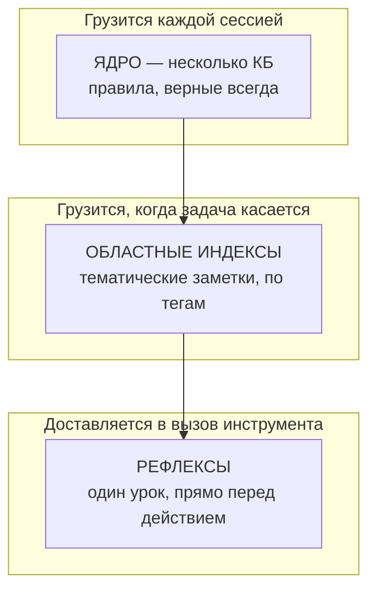

<p align="center">
  
</p>

<p align="center">
  
  
<!-- sma:passport:begin -->
  <a href="PASSPORT.md"></a>
<!-- sma:passport:end -->
  <a href="LICENSE"></a>
  
  
</p>

# SMA — Shared Memory & Automation

**Ваш ИИ-агент забывает, преувеличивает и не складывается в команду. SMA — это local-first управляющий контур, чинящий все три болезни разом: слоистая память, приходящая точно в момент действия; координация терминалов без сервера; и хребет доверия, в котором каждое «готово» сводит скрипт, переповеряет слепой проверяющий — и оно блокирует релиз, если ложно.**

[English version → README.md](README.md)

> ### 🗺️ [Открыть живую карту системы →](https://sma-framework.github.io/sma/master-graph.html)
> Все подсистемы SMA на одной интерактивной странице — самый быстрый способ увидеть, как всё связано.

> ### 🆕 [Что нового в v5.7.0 — ступень дизайна →](#что-нового-в-v570--ступень-дизайна)
> В графе фаз появляется пятая ступень между планом и кодом: вещь рисуется, рядом с рисунком пишется короткий договор, и **исполнение не начинается, пока человек его не подтвердит**. Вместе со ступенью приходят две роли — дизайнер и аниматор.

> ### 🧭 [Роадмап →](ROADMAP.ru.md) · [in English](ROADMAP.md) · [Глубокое описание →](docs/WHAT-IS-SMA.ru.md)
> Где SMA сейчас и чего это стоило: линейка V5 выходила релизом раз в несколько дней — от парка работников 24/7 через измеренную память, рулёжку живой сессии и задачник, чьи числа не врут, до сегодняшнего пятиступенчатого цикла фазы.

> **Это не плагин памяти.** Это рабочая дисциплина поставки настоящего кода с ИИ-агентом: память, которая приходит ровно в тот момент, когда нужна; координация, которая не даёт двум терминалам затирать друг друга; и **хребет доверия**, в котором каждое «готово» сводит скрипт, переповеряет слепой проверяющий, а ложное «готово» блокирует следующий релиз. Он пишет только в несколько папок рядом с Вашим кодом — **Ваше дерево исходников не трогается никогда** — и всё, что он знает или принуждает, это обычный файл, который можно прочитать, сравнить и откатить.

> ### 🤝 Обещание
> 1. Каждая задача, которую вы отдаёте SMA, делается работником в его собственной копии проекта, проверяется скриптом, а не словом, и возвращается вам с квитанцией — что обещано, что сделано, чем доказано — и откатывается одной командой.
> 2. Работник работает ровно в вашей среде: те же правила, хуки, память, навыки и права, что у вас в терминале, — и каждая его задача оставляет урок, который система применит в следующей.
> 3. Ни одно число и ни одно «готово» в SMA не выдумано: всё, что написано в README, проверяется командой, которую вы можете запустить сами.

---

## Что вы получаете

**🧠 Память, приходящая вовремя.** Не один большой файл инструкций, который модель проглядывает, — три яруса. Несколько килобайт всегда-истинных правил грузятся каждой сессией; тематические заметки — когда задача касается их тегов; а *рефлексы* — по одному уроку — срабатывают в тот самый вызов инструмента, который они охраняют. Урок о миграциях схемы не сидит в промпте весь день; он перебивает агента в момент, когда тот трогает файл схемы. Авто-трим понижает, никогда не удаляет; забывание — отдельная осознанная команда.

**🚦 Координация без сервера.** Сессии регистрируются сами, области работ берутся в claim, коллизия предупреждает *до* нажатия клавиши — а всё, на чём два терминала могут столкнуться (номер миграции, версия релиза), выдаёт один общий счётчик. Закончившаяся сессия возвращает свои claim'ы **и закрывает собственное окно**, поэтому прогон, который убили, а не довели, не оставляет за собой призрака, о котором потом предупреждают. Всё это обычные файлы в вашем репозитории.

**🧾 Хребет доверия.** Каждый план заранее регистрирует, что измеримо изменится и как это проверить. Каждое «готово» несёт перезапускаемую проверку, которую сводит код выхода, а не проза. **Слепой проверяющий** выводит вердикт заново из одного лишь дерева, отказываясь читать самоотчёт агента. А ложное «готово» — не строка в логе: оно **блокирует следующий релиз**, пока человек не вынесет решение, — из append-only леджера, который агент править не может.

**📐 Ступень дизайна — новое.** Между планом и кодом фаза рисует вещь и пишет рядом с рисунком договор. Человек подтверждает его — на карточке фазы в окне или тем же действием из терминала, — и до подтверждения **исполнение физически не начинается**: флага, выключающего ворота, не существует. Фазы старше самой ступени честно читаются «пропущена» — по свидетельству, не по дате.

**🤖 Парк и его окно — по желанию.** Демон на вашей машине гоняет рабочие сессии круглые сутки: долговечная очередь, единый леджер попыток, стопы бюджета, читающие то же число, что и экран, — и окно, которое демон раздаёт сам: туда кладут работу, там смотрят её вживую, рулят на ходу, принимают или возвращают. Каждая попытка журналирует базовый коммит, изменённые файлы и **одну цельную команду отката**. Ступень, запущенная парком, несёт ответы на свои механические вопросы и не спавнит субагентов — она не печатает меню в комнату, где никого нет; вопрос, который может решить только человек, паркуется артефактом и ждёт вас. Выключите парк — всё перечисленное выше не потеряет ничего.

Глубокая версия всех пяти, с названными механизмами: **[docs/WHAT-IS-SMA.ru.md](docs/WHAT-IS-SMA.ru.md)**.

## Доказательства, а не проза

То, что делает SMA другим, — не фича, а принцип: **вам никогда не приходится верить SMA на слово**:

- Числа команд, глаголов CLI, дверей демона и тестов, названные в этой документации, сверяются с кодом на каждом `npm test` — расходящийся документ красит сьют. Проверьте сами: `node scripts/sma/cli.mjs doc-audit --target numbers`.
- Значок тестов наверху пишет скрипт из JSON-отчёта настоящего прогона — рукой он не правится никогда.
- Отпечаток квитанции выводится из точной команды проверки, её кода выхода и нормализованного вывода — две разные проверки не могут разделить один хэш.
- Живой QA гоняет продукт в настоящем браузере и нажимает каждый видимый контрол по разу; прогон, которого не было, выходит с кодом 3 и говорит `NOT RUN` — **никогда** не пустым списком находок, читающимся как чистота.
- Значок калибровки прячется после смены модели, пока не наберётся достаточно новых данных, — он никогда не завышает тихо.

### До SMA → После SMA

Тот же агент, та же модель — другая дисциплина вокруг.

| | **Без SMA** | **С SMA** |
|---|---|---|
| **1 · Правило выпало** | В инструкциях написано: «каждое изменение схемы требует миграции». Через двадцать правок агент добавляет колонку и забывает. Уезжает; запросы ломаются на деплое. | В момент, когда агент трогает файл схемы, рефлекс срабатывает **в сам вызов инструмента»: *«изменение схемы → нужна миграция (в прошлый раз это уронило прод)»*. Мимо не проглядеть. |
| **2 · «Готово», которое не готово** | *«Все тесты зелёные, фича готова».* Вы затягиваете, запускаете — три красных. Уверенная сводка была единственным свидетельством, и она лгала. | План заранее зарегистрировал проверку. При закрытии **скрипт** перегоняет её и пишет `hit` или `miss` в леджер. «Готово» — перезапускаемая команда, не предложение, — и слепой проверяющий выводит вердикт, не читая отчёта агента. |
| **3 · Урок, выученный заново** | Тот же флаг сборки кусает третий месяц подряд. Каждая починка жила в одном закрытом чате; вперёд не поехало ничего. | Первый ожог записан заметкой с триггером. Каждая следующая сессия — и клон каждого коллеги — получает предупреждение **до** повторения. Один ожог — постоянное избегание. |
| **4 · Два терминала столкнулись** | Терминал B правит `src/api`, пока терминал A там в середине рефакторинга. Пуш B тихо откатывает час работы A; никто не замечает до CI. | B зарегистрировал сессию, а A **взял в claim** `src/api`. Когда B идёт править, его предупреждают *до* нажатия — а номера миграций оба взяли из одной очереди, так что они не столкнутся. |
| **5 · Построено не то** | План был верный, стройка добросовестная — а экран вышел не тем, что все имели в виду. Вы платите за стройку, чтобы это узнать. | Фаза **сначала рисует вещь** и пишет рядом договор. Исполнение отказано, пока человек не подтвердит, — а перерисовка снова закрывает исполнение до свежего «да». |
| **6 · Ложное «готово» уехало** | Отчёт сказал: работает. Не работало; регрессия доехала до `main`, следующий релиз её увёз. | Заявленный «зачёт», который слепой проверяющий воспроизвёл как провал, — самый тяжёлый сигнал системы — **автоматически блокирует ворота релиза**, пока человек не запишет явное решение. Леджер append-only; агент не может простить сам себя. |

> **Честная оговорка.** Одна задача с SMA стоит дороже — проверки и память не бесплатны. Ставка — **цена верного результата на дистанции многих задач**, а не самый дешёвый одиночный прогон.

## Установка

### 1 · Что нужно заранее

| | |
|---|---|
| **Node 22.5 или новее** | Node — программа, которая запускает скрипты SMA. Проверьте `node -v`; если ниже или нет — поставьте с [nodejs.org](https://nodejs.org). |
| **git** | SMA держит всё обычными текстовыми файлами в репозитории, так что ваш проект должен быть git-репозиторием (`git init`, если ещё нет). |
| **Claude Code** | ИИ-агент, к которому SMA подключается сегодня. Команды `/sma-…` ниже печатаются в сессию Claude Code. |

Больше ничего. Ядро не добавляет пакетов в ваш проект и не требует ни базы, ни сервера, ни аккаунта. (Необязательный парк работников ниже просит больше; его можно целиком игнорировать.)

### 2 · Одна команда

Откройте терминал, перейдите в корневую папку **вашего собственного проекта** и выполните:

```bash
npx -y sma-framework@latest init
```

Это вся установка. Занимает секунды и печатает каждый записанный файл.

### 3 · Что у вас появилось

Новые папки встают **рядом** с кодом. Ни одна строка ваших исходников не правится.

```text
ваш-проект/
├─ src/, package.json…   ← ВАШ КОД — не тронут
│
├─ .claude/
│  ├─ skills/            ← 16 команд /sma-…, которые теперь можно печатать
│  ├─ agents/            ← помощники, которых эти команды зовут
│  ├─ sma-core/          ← движок: инструкции за каждой командой
│  ├─ memory/            ← заметки вашего проекта — ставится ПУСТЫМ, заметки ваши
│  └─ settings.json      ← 8 хуков + сегмент статуслайна (ваши записи сохраняются)
├─ scripts/sma/          ← командный инструмент, на котором всё работает
├─ .sma/                 ← рабочее состояние: кто что правит, журнал проверок
└─ CLAUDE.md             ← добавляется один короткий помеченный блок; ваш текст не тронут
```

Хуки — восемь записей на семи событиях агента: подхват сессии, проверка коллизий/рефлексов/гейтов перед каждой правкой, проверка застоя после неё, капсула перед обрезкой контекста, возврат заявок при конце сессии. Каждая привязана к корню проекта, лечится на месте при переустановке и **fail-open**: предупреждение никогда не блокирует работу, мёртвый хук никогда не клинит сессию. Что делает каждый хук и его бюджет времени: [docs/DETAILS.ru.md](docs/DETAILS.ru.md).

Передумали? `/sma-update` перегоняет тот же установщик на новую версию, `/sma-deleteme` убирает всё одним действием — обе команды сохраняют ваши заметки в `.claude/memory/`. Флаги установки, установка из клона, полный список файлов: [docs/INSTALL.md](docs/INSTALL.md).

## Первые шаги

Откройте сессию Claude Code в проекте и напечатайте:

| Напечатайте | Что произойдёт |
|---|---|
| `/sma-start` | Направляемый разговор, один раз. Спросит, что за проект и как вы поставляете, запишет ответы, заведёт файл заметок. |
| `/sma-help` | Список команд, по строке на каждую. |
| `/sma-progress` | «Где мы?» — что сделано, что дальше, и предложение это запустить. |

### Обычный рабочий цикл

Вы работаете **фазами**: один кусок работы за раз — фича, починка, переписывание. Пять команд, всегда в этом порядке:

1. `/sma-discuss-phase 1` — задаёт вопросы, пока цель не станет однозначной.
2. `/sma-plan-phase 1` — пишет план, включая то, как результат будет проверен.
3. `/sma-design-phase 1` — рисует вещь и пишет рядом с рисунком короткий договор, вам на подтверждение.
4. `/sma-execute-phase 1` — делает работу и коммитит, шаг за шагом.
5. `/sma-verify-work 1` — проходит результат вместе с вами и перегоняет обещанные планом проверки.

Дальше то же с `2`, `3` и так далее. Для мелочи можно пропустить все пять: `/sma-quick` для небольшой задачи, `/sma-fast` для однострочника.

## Что нового в v5.7.0 — ступень дизайна

Между «план написан» и «код пишется» была щель, знакомая каждой команде: агент строит не ту форму нужной вещи, а вы узнаёте об этом после оплаты стройки. v5.7.0 её закрывает.

- **Пятая ступень в графе фаз** — обсуждение, план, **дизайн**, исполнение, проверка — в жёсткой сцепке на каждой поверхности, называющей ступени: очередь, политика, доска окна и карточка фазы, с контракт-тестом, который краснеет, если любое из семи мест уехало.
- **Артефакт, а не настроение.** Ступень оставляет в папке фазы договор дизайна — что где стоит, что делает человек, чего быть не должно, — плюс самодостаточный HTML-набросок, когда у работы есть экраны. Оба остаются навсегда.
- **Ворота без ключа под ковриком.** Диспетчер отказывается начинать исполнение фазы с неподтверждённым дизайном — флага или ключа конфигурации, выключающего ворота, не существует. Новая версия договора снова закрывает исполнение до свежего подтверждения. Подтверждается там, где смотрится: на карточке фазы, артефакты первыми, «Подтвердить дизайн» и «Вернуть с комментарием» на ждущей строке — и ромб ворот на ленте ступеней остаётся полым до *вашего* «да», потому что рисунок на диске — ещё не «да» человека.
- **Грандфазер по свидетельству, не по дате.** Фаза старше самой ступени читается «пропущена» — это решает проверяемый след прежнего исполнения, никогда не таймстемп.
- **Дорога назад.** Если рисунок вскрывает дыру в плане, фаза возвращается в планирование с причиной, едущей как данные, и план правится в своей собственной ступени.
- **Две новые роли.** `sma-designer` — персона, собранная из настоящих дизайн-наработок (правила, палитры, эталонные суждения), пишет черновик договора. `sma-animator` — движение под явным законом: ничего дольше 300 мс, частое не анимируется вовсе. У шести дизайн-ролей теперь шесть именованных вызывающих в воркфлоу; договор доказанно доезжает до исполнителя и до ритуала приёмки.
- **Своя команда.** `/sma-design-phase N` гоняет ступень из терминала; флотская полоса гоняет её инлайн, без единого спавна субагентов, — работает и там, где у работника нет инструмента спавна.

Всё, что было раньше — задачник и его честные числа, рулёжка живой сессии, целый рабочий день без терминала, измеренная память — выпуск за выпуском, с тем, чего каждый сознательно не утверждал: [docs/DETAILS.ru.md](docs/DETAILS.ru.md#линейка-v5-выпуск-за-выпуском).

<!-- sma:positioning:start -->

## Как SMA сравнивается с аналогами

Поставщик модели не может нейтрально оценивать работу своего же агента. С Claude Outcomes эту мысль нужно заострить, а не убирать: поставщик теперь *может* проверять, потому что отдельно-контекстная оценка вышла как функция платформы. Чего он не может, так это пройти **аудит**. Оценка Outcomes это непрозрачный вердикт по рубрике: нет перезапускаемой квитанции, нет опубликованного трек-рекорда, нет последствия, когда она ошибается. Полоса SMA это слой аудита, который обязан пережить любой оценщик, их или наш, и именно эта полоса даёт SMA пережить поглощение платформой.

Поэтому сравнение намеренно честное, включая то, в чём каждый аналог лучше SMA. Охват дан звёздами GitHub на июль 2026 года, перепроверяйте перед цитированием:

| Инструмент | Охват | В чём лучше SMA | Что делает только SMA |
|------------|-------|-----------------|-----------------------|
| **Claude Outcomes** | платформа | Управляемые сессии, встроенный оценщик результата, ноль настройки | Детерминированные перезапускаемые квитанции, процент попаданий с привязкой к судье, и опровергнутое «satisfied», которое блокирует релиз, пока решение не вынесет человек |
| **claude-mem** | 86k★ | Ведущая механика памяти, отполированная среда SQLite | Оценивает, помогла ли память, и публикует процент попаданий |
| **Aider** repo-map | 47k★ | Детерминированный граф контекста с годами боевой проверки | Несёт корпус памяти и цикл обучения поверх графа |
| **Letta** / MemGPT | 24k★ | Богатая архитектура блоков памяти | Без базы, без сервера, и агент не оценивает сам себя |
| **ccusage** | 16.5k★ | Отличное наблюдение локальных трат | Сигнал трат управляет принуждением, а не только наблюдением |
| **BMAD** | 50k★ | Богатые шаблоны оркестрации | Слой проверки, поэтому утверждение обязано пережить скрипт |

**Чего SMA намеренно не делает в слое, который решает:** ядро памяти, координации и подотчётности работает без демона, без базы данных, без эмбеддингов, без облака и без LLM в горячем пути. Всё это файлы и git (смотрите `node scripts/sma/cli.mjs explain substrate`). Корректность никогда не зависит ни от вызова модели, ни от того, что что-то остаётся запущенным. Парк работников V5 и его приложение это **отдельный необязательный слой** сверху: он действительно поднимает локальный демон и держит очередь в локальном PostgreSQL, и то и другое на Ваших машинах, а если его выключить, всё описанное выше не меняется.

**Сам оценщик тоже оценивается.** Каждый отдельно-контекстный вердикт, слепого проверяющего или вендорского оценщика, если он когда-нибудь будет использован, записывается, сверяется с фактом (откат, переделка, красный CI, отказ основателя), и ошибочное «satisfied» нельзя замять аудитом: оно блокирует релиз, пока человек не вынесет решение. Это и есть аудит, которого непрозрачная оценка дать не может.

**Паспорт доказательств читается двумя способами.** `sma manifest` собирает один детерминированный паспорт на pull request (предсказания и их вердикты, квитанции и их хеши, счёт слепой проверки, окно трат, процент попаданий по областям) и отрисовывает его под читателя: `--md` для комментария в PR, `--json` для инструмента и `--dense` для агента, который печатает весь паспорт как одну фиксированную строку на секцию. Ничего при этом не пересчитывается: все три вида читают один и тот же собранный объект, поэтому компактный вид не может разойтись с тем, который подписал человек, а пустая секция помечается, а не исчезает.

Экономику держат на той же планке доказательств. Здесь бюджеты полос выводятся из *собственных* процентилей трат проекта, а не из вендорского бенчмарка; любой план может опубликовать квитанцию следа (footprint receipt): это арифметика git-diff против записанного заявления, а перерасход засчитывается как промах калибровки; полосы отгрузки ставят пуш на полный прогон тестов и безопасности, который быстрая полоса ослабить не может. Каждая экономия в паре с гарантией качества, а число публикуется только после того, как его оценили (смотрите `node scripts/sma/cli.mjs explain economy`). Книга трат оценивает токены по версионированной локальной таблице цен (никогда не из сети), обновлённой 21.07.2026 до актуальных ставок Claude: добавлено новейшее семейство моделей, исправлена устаревшая, примерно втрое завышенная ставка Opus.

Об адаптации сообщают честно, а не заявляют: реальный процент попаданий и размер выборки живут в значке калибровки и `PASSPORT.md`, который пересобирается из журнала командой `sma passport --build` и воспроизводится на свежей копии. После смены модели значок прячется, пока не наберётся достаточно новых данных, поэтому он никогда не завышает тихо. Одна пересборка доходит до **каждого** README этого репозитория: английский и русский пишутся одной операцией из одного снимка, поэтому две локали не могут разойтись оттого, что одну из них поправили руками; отсутствующий README называется в выводе, а не создаётся молча. Он же говорит вслух, что именно умеет считать: только то, что воспроизводится из этого репозитория. Предсказания, сделанные в приватном рабочем пространстве планирования, сюда не переносятся (каждая такая запись называет внутренний файл планирования, в котором была сделана), поэтому малая выборка на этой странице означает мало собственных воспроизводимых вердиктов, а не спрятанное большее число.

Три функции хребта доверия (git-подушка, книга трат и капсула перед компакцией) это мосты, которые более широкая экосистема вполне может поглотить, и это нормально; они не заголовок, заголовок это слой подотчётности. **Теперь они приезжают работающими, а не ждущими, пока их включат:** три потока хука (подушка, книга трат и страж областей) работают по умолчанию, а капсула перед компакцией пишется, не спрашивая разрешения. Честная формула того, что это значит и чего не значит, короткая: **включена защита, не включён запрет.** Подушка кладёт точку отката и пишет квитанцию перед каждой разрушительной git-командой, и называет собственную цену, а не прячет её: снимок теперь **доделывается** над неотслеживаемым каталогом: каталог разворачивается в файлы, упавшее пакетное хеширование повторяется по одному файлу, и плохой путь теряет только себя, по имени в квитанции. Поэтому обречённая ветка закреплена, а неотслеживаемые файлы едут вместе с ней. Лекарство стоило времени хука, ровно как и обещал этот абзац, пока ещё называл ограничение: честный перезамер на самой дешёвой сцене даёт 283–405 мс p95, и владелец поднял бюджет времени хука с 300 до 500 мс открыто: бюджет пошёл за честным числом, а не число подогнали под бюджет. *Отказывать* же в такой команде подушка начинает только тогда, когда выставлена `SMA_AIRBAG_DENY`; эта переменная приезжает снятой, и взвести её остаётся отдельным осознанным решением оператора, а не тем, что делает с Вами обновление. Книга трат выходит сразу и не делает ничего, пока Вы сами не задали бюджет; она никогда его не выдумывает. Поток областей молчит у того, кто работает в одном окне, и подаёт голос только против чужой заявки, которую сам проверил живой. У каждого есть видимый выход, названный здесь, а не спрятанный в исходнике: `SMA_AIRBAG_DISABLE`, `SMA_SPEND_DISABLE`, `SMA_ENFORCE_SCOPES_DISABLE`. Два поглощаемых вендором кандидата остаются явными тревожными флажками WATCH, а не заголовками: межсессионный, включённый по умолчанию примитив agent-teams, и инструмент advisor, открытый внутри сессий; каждый несёт условие самоудаления, которое убирает наш мост в день, когда платформа его отгрузит.

<!-- sma:positioning:end -->

## Чем это отличается

- **Подотчётный, а не просто полезный.** Каждое утверждение SMA о самом себе — предрегистрированное предсказание, которое сводит скрипт и переповеряет слепой проверяющий, — и только когда его заявленный горизонт действительно наступил. Фреймворки памяти обещают припоминание; SMA публикует процент попаданий и позволяет ложному «готово» заблокировать собственный релиз.
- **Слой, который вендор не может отгрузить.** Поставщик модели не может беспристрастно оценивать работу собственного агента. SMA оценивает её снаружи — детерминированно, без LLM в горячем пути, — и именно поэтому переживает поглощение платформой.
- **Сначала детерминизм.** Доставка ведётся тегами и триггерами, принуждение — обычными скриптами, и весь цикл обучения-и-проверки работает без единого вызова LLM в горячем пути. Опциональный интеллект может сидеть сверху; корректность от него не зависит никогда.
- **Git-родной и обратимый.** Заметки, леджеры, журналы, квитанции — всё файлы в вашем репо. Самоулучшение приходит диффами, которые вы ревьюите; всё, чему система научилась, откатывается `git revert`.
- **Fail-open по устройству.** Предупреждение никогда не блокирует работу; мёртвый хук никогда не клинит сессию; у каждого потока есть выключатель. Жёсткая блокировка — только на границах, которые вы сами хотели бы жёсткими: права пуша, секреты, стопы бюджета, ворота дизайна, ворота релиза.
- **Ваше.** Корпус живёт в вашем репозитории, уезжает с `git clone` и переносим на других агентов — это знание, которым владеете вы, а не кэш вендора.

## Память в три слоя


```mermaid
flowchart TD
    subgraph Always["Грузится каждой сессией"]
        C["ЯДРО — несколько КБ<br>правила, верные всегда"]
    end
    subgraph OnDemand["Грузится, когда задача касается"]
        I["ОБЛАСТНЫЕ ИНДЕКСЫ<br>тематические заметки, по тегам"]
    end
    subgraph AtTheAct["Доставляется в вызов инструмента"]
        X["РЕФЛЕКСЫ<br>один урок, прямо перед действием"]
    end
    C --> I --> X
```

Каждая заметка несёт триггер `use-when` — эта одна строка и позволяет SMA доставлять её ровно в нужный вызов инструмента вместо вываливания корпуса в каждый промпт. Авто-трим никогда не удаляет — он *понижает* по слоям (на собственном корпусе этого репозитория всегда-загружаемый индекс сжался с 46 КБ до 5 КБ с сохранённой полнотой). Настоящее забывание — отдельная осознанная команда (`memory forget`, с `--erase`, называющим каждую вычищенную поверхность), никогда не побочный эффект.

Заметка — это **утверждение** со схемой: тип, режим истинности, авторитет, область, временна́я валидность, чувствительность. Пишется через один двенадцатишаговый конвейер (сначала вычистка секретов, проверка противоречий, черновики до вашего «да») и доставляется под жёстким бюджетом, ранжированная тремя слоями сразу: детерминированные фасеты, точное совпадение пути/символа и лексический BM25 — слой, допущенный в путь по умолчанию только после измеренного прироста на золотом наборе этого же проекта. Извлечённый текст — **данные, никогда не инструкция**: заметка, обращающаяся к ассистенту, отказывается при чтении с названной причиной. Полная модель, жизненный цикл и модель угроз: [docs/MEMORY-MODEL.md](docs/MEMORY-MODEL.md) · [docs/MEMORY-LIFECYCLE.md](docs/MEMORY-LIFECYCLE.md) · [docs/MEMORY-THREAT-MODEL.md](docs/MEMORY-THREAT-MODEL.md).

## Парк и окно — необязательный слой

Демон на вашей машине гоняет рабочие сессии круглые сутки и сам раздаёт своё приложение — два десятка экранов за одним токеном и **замороженной таблицей дверей**, размер которой — тест, так что поверхность не может тихо перерасти в удалённое исполнение команд.

- **Паритет с терминалом, доказанный на каждой попытке.** Работник идёт в собственной копии вашего проекта на своей ветке и несёт слой, которого нет в git: ваши правила, хуки, память, навыки и сужающие списки разрешений — и *не несёт* расширяющих прав, плагинов и коннекторов claude.ai, каждый назван. Пять квитанций на попытку — хуки, память, правила, навыки, права — демон считает сам, одна команда их печатает; отсутствие данных — провал, никогда не «зачёт по умолчанию».
- **Человеческое остаётся человеческим.** Пуш, слияние, тег, деплой едут списком отказа в аргументах запуска процесса работника — в силе внутри процесса, а не в словах промпта. Карточка отгрузки в окне гоняет гейт и записывает прогон; **сама публикация остаётся действием человека, по устройству**.
- **Откат — это запись.** Каждая попытка журналирует базовый коммит, ветку, изменённые файлы (из git — правки через shell тоже видны), удаления отдельной строкой — и одну цельную команду отката, готовую к копированию.
- **Деньги не могут замолчать.** Каждая попытка работника оставляет строку в книге расходов — убитые тоже, помеченными оценками, — и стоп бюджета читает то же число, что экран затрат, через один шов.
- **Рулёжка, а не только наблюдение.** У текста, напечатанного в работающую задачу, три объявленные судьбы: доехать в ход на ближайшей границе вызова инструмента, дождаться конца хода или прервать сейчас — и правка пишется на диск *до* того, как что-либо убито. Возвращённая задача продолжает сессию, за которую вы уже заплатили.
- **Остановка, говорящая правду.** Работник, вставший с вопросом, виден в столбике «ждут вас» и на карточке, со временем ожидания; ваш ответ продолжает ту же сессию. Целой волне можно сказать «стоять» — задачи доделывают ход, в котором стоят, и останавливаются; стоянка записана на диск и переживает рестарт демона.
- **Срыв попадает в один журнал.** Почему задача сломалась, знают три места — строка очереди, реестр попыток и записка самого работника, — а карточка показывает одно из них: остановка рукой прячет потолок ходов, в который попытка упёрлась до неё. Демон каждым тиком сводит их в один append-only журнал: строка на срыв, один файл на все проекты, слово очереди и слово реестра рядом. Тот же проход сводит и историю за прошлое — одной командой.

- **«Процесс жив» и «дверь отвечает» — разные факты.** Процесс умеет держать свой порт и перестать его обслуживать, а снаружи это выглядит ровно как тихий день. Сторож стучится в самую дешёвую дверь с терпением, отмеренным по замеренной задержке ЭТОЙ двери под нагрузкой, и называет смертью только **серию** молчаний, а не одно. Живой процесс, переставший отвечать, дальше лечится как смерть: сначала гашение, потом подъём — подъём над зависшим лишь проигрывает гонку за его же порт. А первые минуты после подъёма — стартовая уборка самого демона, и клином они не считаются.

Демону нужен локальный PostgreSQL под очередь (или встроенная песочница для машины без PostgreSQL и без прав администратора) и один визит с токеном, чтобы открыть приложение. Настройка, супервизия, автозапуск, сторож, привязка Telegram, размер машины — измеренный, не угаданный: [docs/DETAILS.ru.md](docs/DETAILS.ru.md) и [docs/INSTALL.md](docs/INSTALL.md).

## Команды

Семейство `/sma-*` (печатается в сессии Claude Code):

| Команда | Что делает |
|---|---|
| `/sma-start` | Онбординг первого запуска: объясняет систему, заводит корпус памяти и инфраструктурный профиль |
| `/sma-discuss-phase` | Собрать контекст фазы адаптивными вопросами до планирования |
| `/sma-plan-phase` | Создать детальный план фазы с циклом верификации |
| `/sma-design-phase` | Нарисовать фазу и написать договор рядом с рисунком; исполнение ждёт вашего подтверждения |
| `/sma-execute-phase` | Исполнить все планы фазы волнами с параллелизацией |
| `/sma-verify-work` | Проверить построенное разговорным UAT |
| `/sma-qa` | Живой QA: запустить приложение, проверить каждый критерий успеха использованием, нажать поверхность, завести дефекты с шагами воспроизведения |
| `/sma-quick` | Быстрая задача с гарантиями SMA (атомарные коммиты, трекинг состояния), без опциональных агентов |
| `/sma-fast` | Тривиальная задача инлайн — без субагентов и планирования |
| `/sma-debug` | Систематическая отладка с состоянием, переживающим сбросы контекста |
| `/sma-progress` | Где мы: прогресс, следующий шаг, свободная диспетчеризация намерения |
| `/sma-resume-work` | Продолжить с прошлой сессии с полным восстановлением контекста |
| `/sma-pause-work` | Создать хендофф контекста при паузе посреди фазы |
| `/sma-help` | Показать команды и руководство |
| `/sma-deleteme` | Убрать SMA одним действием; корпус памяти остаётся |
| `/sma-update` | Проверить установленную и доступную версии и обновиться штатным установщиком; всё локальное остаётся |

Внизу работает координационный и подотчётный CLI — 96 команд-глаголов, у каждой встроенный объяснитель. Зовите из корня проекта, как это делают хуки:

```bash
node scripts/sma/cli.mjs status            # кто над чем работает прямо сейчас
node scripts/sma/cli.mjs explain <verb>    # зачем нужен любой глагол, простым языком
node scripts/sma/cli.mjs grill --gate      # допросить каждое обещание планов до стройки
```

Несколько стоящих упоминания: `sma wires` перепроверяет, что заявленная планами проводка ещё существует в коде; `sma memory explain --task "…"` называет, почему каждая заметка доставлена или удержана; `sma history search` спрашивает, были ли вы здесь раньше, по четырём книгам, которые проект уже ведёт; `sma baseline capture/replay` превращает «стало лучше» в дифф; `sma eval memory` оценивает слой памяти на ваших золотых кейсах с детерминированными порогами. Полный справочник: [scripts/sma/README.md](scripts/sma/README.md).

## Он живёт рядом с кодом, никогда внутри

SMA не правит, не двигает и не переформатирует ни одной строки вашего приложения. Он пишет лишь в несколько соседних папок — все с обычным текстом, все под версионным контролем, все ваши. Удалите папки — и проект ровно таков, каким был.

## Глубже

- **[docs/WHAT-IS-SMA.ru.md](docs/WHAT-IS-SMA.ru.md)** — глубокое описание: проблема, архитектура, философия, ступень дизайна целиком и структурный аргумент, почему этого нет ни у кого.
- **[docs/DETAILS.ru.md](docs/DETAILS.ru.md)** — инженерное погружение: хуки, окно экран за экраном, паритет квитанция за квитанцией и вся история версий — V1 через линейку V5, выпуск за выпуском.
- **[ROADMAP.ru.md](ROADMAP.ru.md)** — что вышло, чего это стоило и что дальше. English: [ROADMAP.md](ROADMAP.md).
- **[docs/MEMORY-MODEL.md](docs/MEMORY-MODEL.md)** · **[docs/MEMORY-LIFECYCLE.md](docs/MEMORY-LIFECYCLE.md)** · **[docs/MEMORY-THREAT-MODEL.md](docs/MEMORY-THREAT-MODEL.md)** — закон схемы, конвейер записи и жизненный цикл, модель угроз слоя памяти.
- **[docs/FLEET-INVARIANTS.md](docs/FLEET-INVARIANTS.md)** — восемь инвариантов парка, записанных как закон, и §5: что сознательно *не* является целью.
- **[docs/FEATURE-GATE.md](docs/FEATURE-GATE.md)** — пять элементов, которые новая фича обязана объявить до пути по умолчанию.
- **[docs/INSTALL.md](docs/INSTALL.md)** — флаги установки, манифест, удаление.
- **[scripts/sma/README.md](scripts/sma/README.md)** — каждый подкомандный глагол, флаг, событие хука и выключатель.
- **[PASSPORT.md](PASSPORT.md)** — паспорт калибровки: реальный процент попаданий и размер выборки, воспроизводимо на свежем клоне.

## История звёзд

[](https://star-history.com/#sma-framework/sma&Date)

## Лицензия и происхождение

**SMA Source-Available License v1.0**, см. [LICENSE](LICENSE). Простыми словами: исходный код открыт — его можно читать, ставить себе локально, менять и использовать для себя, внутри своей команды, а также в некоммерческом образовании и исследованиях — бесплатно. Любая монетизация SMA — продажа, платный продукт или хостинг-сервис на его основе, платные услуги, где SMA — часть того, за что платит клиент, — требует письменного коммерческого соглашения с автором: **matvey.maslov99@gmail.com**. Условия по умолчанию — 30% валовой выручки предложения, использующего SMA; сначала напишите — всегда. Коммерческое использование без договора от этих условий не освобождает: самим таким использованием вы автоматически принимаете лицензию — уведомления ни в одну сторону не требуются — и автор вправе в любой момент, без предупреждения и без предложения исправиться, взыскать через суд не менее 30% соответствующей валовой выручки, плюс проценты и издержки взыскания (LICENSE §4; право Германии, подсудность по месту автора). Ранние версии сохраняют свои лицензии: v4.0.2 и раньше (включая те релизы npm) остаются под MIT, а v5.0.0–v5.0.4 — под FSL-1.1-MIT с её плановым переходом каждой версии в MIT через два года после релиза.

**Автор: Матвей Маслов (Matvey Maslov).** Вопросы, обратная связь, истории внедрения: [matvey.maslov99@gmail.com](mailto:matvey.maslov99@gmail.com), либо откройте [issue](https://github.com/sma-framework/sma/issues).

Движок рабочих процессов внутри SMA производен от [gsd-core](https://github.com/open-gsd/gsd-core) (MIT). Уведомления о сторонних компонентах и происхождение движка отслеживаются в [THIRD-PARTY-LICENSES.md](THIRD-PARTY-LICENSES.md).
