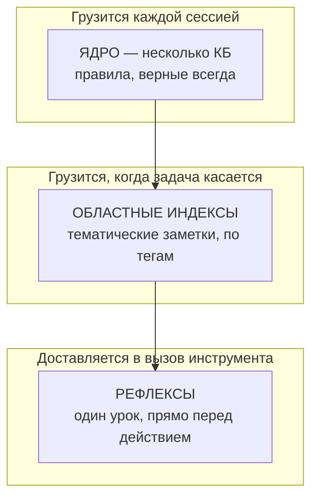

<p align="center">
  
</p>

<p align="center">
  
  
<!-- sma:passport:begin -->
  <a href="PASSPORT.md"></a>
<!-- sma:passport:end -->
  <a href="LICENSE"></a>
  
  
</p>

# SMA — Shared Memory & Automation

**Ваш ИИ-агент забывает, преувеличивает и не складывается в команду. SMA — это local-first управляющий контур, чинящий все три болезни разом: слоистая память, приходящая точно в момент действия; координация терминалов без сервера; и хребет доверия, в котором каждое «готово» сводит скрипт, переповеряет слепой проверяющий — и оно блокирует релиз, если ложно.**

[English version → README.md](README.md)

> ### 🗺️ [Открыть живую карту системы →](https://sma-framework.github.io/sma/master-graph.html)
> Все подсистемы SMA на одной интерактивной странице — самый быстрый способ увидеть, как всё связано.

> ### 🆕 [Что нового в v5.7.0 — ступень дизайна →](#что-нового-в-v570--ступень-дизайна)
> В графе фаз появляется пятая ступень между планом и кодом: вещь рисуется, рядом с рисунком пишется короткий договор, и **исполнение не начинается, пока человек его не подтвердит**. Вместе со ступенью приходят две роли — дизайнер и аниматор.

> ### 🧭 [Роадмап →](ROADMAP.ru.md) · [in English](ROADMAP.md) · [Глубокое описание →](docs/WHAT-IS-SMA.ru.md)
> Где SMA сейчас и чего это стоило: линейка V5 выходила релизом раз в несколько дней — от парка работников 24/7 через измеренную память, рулёжку живой сессии и задачник, чьи числа не врут, до сегодняшнего пятиступенчатого цикла фазы.

> **Это не плагин памяти.** Это рабочая дисциплина поставки настоящего кода с ИИ-агентом: память, которая приходит ровно в тот момент, когда нужна; координация, которая не даёт двум терминалам затирать друг друга; и **хребет доверия**, в котором каждое «готово» сводит скрипт, переповеряет слепой проверяющий, а ложное «готово» блокирует следующий релиз. Он пишет только в несколько папок рядом с Вашим кодом — **Ваше дерево исходников не трогается никогда** — и всё, что он знает или принуждает, это обычный файл, который можно прочитать, сравнить и откатить.

> ### 🤝 Обещание
> 1. Каждая задача, которую вы отдаёте SMA, делается работником в его собственной копии проекта, проверяется скриптом, а не словом, и возвращается вам с квитанцией — что обещано, что сделано, чем доказано — и откатывается одной командой.
> 2. Работник работает ровно в вашей среде: те же правила, хуки, память, навыки и права, что у вас в терминале, — и каждая его задача оставляет урок, который система применит в следующей.
> 3. Ни одно число и ни одно «готово» в SMA не выдумано: всё, что написано в README, проверяется командой, которую вы можете запустить сами.

---

## Что вы получаете

**🧠 Память, приходящая вовремя.** Не один большой файл инструкций, который модель проглядывает, — три яруса. Несколько килобайт всегда-истинных правил грузятся каждой сессией; тематические заметки — когда задача касается их тегов; а *рефлексы* — по одному уроку — срабатывают в тот самый вызов инструмента, который они охраняют. Урок о миграциях схемы не сидит в промпте весь день; он перебивает агента в момент, когда тот трогает файл схемы. Авто-трим понижает, никогда не удаляет; забывание — отдельная осознанная команда.

**🚦 Координация без сервера.** Сессии регистрируются сами, области работ берутся в claim, коллизия предупреждает *до* нажатия клавиши — а всё, на чём два терминала могут столкнуться (номер миграции, версия релиза), выдаёт один общий счётчик. Закончившаяся сессия возвращает свои claim'ы **и закрывает собственное окно**, поэтому прогон, который убили, а не довели, не оставляет за собой призрака, о котором потом предупреждают. Параллельная ветка входит в основную через **одну сериализованную дверь слияния** — смок идёт по *сведённому* дереву ещё до того, как коммит слияния существует, а красный прогон отклоняется с квитанцией; уборка волны, сводящая многоворкерную фазу обратно, ходит через ту же дверь, а не голым `git merge`. Всё это обычные файлы в вашем репозитории.

**🧾 Хребет доверия.** Каждый план заранее регистрирует, что измеримо изменится и как это проверить. Каждое «готово» несёт перезапускаемую проверку, которую сводит код выхода, а не проза. **Слепой проверяющий** выводит вердикт заново из одного лишь дерева, отказываясь читать самоотчёт агента. А ложное «готово» — не строка в логе: оно **блокирует следующий релиз**, пока человек не вынесет решение, — из append-only леджера, который агент править не может.

**📐 Ступень дизайна — новое.** Между планом и кодом фаза рисует вещь и пишет рядом с рисунком договор. Человек подтверждает его — на карточке фазы в окне или тем же действием из терминала, — и до подтверждения **исполнение физически не начинается**: флага, выключающего ворота, не существует. Фазы старше самой ступени честно читаются «пропущена» — по свидетельству, не по дате.

**🤖 Парк и его окно — по желанию.** Демон на вашей машине гоняет рабочие сессии круглые сутки: долговечная очередь, единый леджер попыток, стопы бюджета, читающие то же число, что и экран, — и окно, которое демон раздаёт сам: туда кладут работу, там смотрят её вживую, рулят на ходу, принимают или возвращают — и «одобрить» нажимается прямо в строке ленты дня, так что сделанная работа проходит, не открывая карточку. **Готовая работа раскрывается на месте**: что было обещано, что слито — какая ветка каким коммитом стала, гонялись ли тесты и с каким исходом, — коммиты с их сообщениями, во что обошлось и сколько шло, кто принял и когда, сколько было кругов возврата и с какими словами. Последнее — суть, а не удобство: приёмщиком теперь часто выступает терминал, принимающий по стоящему добро, и «принято», которое нельзя раскрыть, остаётся словом, а не доказательством — проверить приёмщика было бы нечем. Каждая попытка журналирует базовый коммит, изменённые файлы и **одну цельную команду отката**. Ступень, запущенная парком, несёт ответы на свои механические вопросы и не спавнит субагентов — она не печатает меню в комнату, где никого нет; вопрос, который может решить только человек, паркуется артефактом и ждёт вас — и **всё, что ждёт вас, слышно везде, а не только на своей карточке**: сборка, вставшая на сорвавшемся элементе, теперь несёт свой счётчик на доске рядом с «ждут приёмки», свои часы «стоит столько-то» и одно сообщение в телеграм, называющее сборку и элемент, на котором она встала. Последнее — измеренное, а не украшение: ровно это состояние, видимое только тому, кто открыл именно ту карточку, однажды стоило пятнадцати часов простоя флота в полной тишине. **И зовущий канал не кричит.** Всё, что стоит на Вашем решении, приходит ОДНИМ сообщением за проход — «на приёмке 4 работы, старшая ждёт 2 сут 3 ч», с именами и их собственными сроками, — а не по сообщению на строку; повтор о той же работе идёт не раньше шести часов: короче рабочего дня, чтобы вставшее утром было названо до вечера, и длиннее одного сидения, чтобы повтор не застал Вас за чтением первого зова. А сказанное канал помнит **на диске, а не в процессе**: перезапуск демона больше не высыпает в телефон весь список ожиданий заново — измерено 02.09, два подъёма за одно утро стоили двух одинаковых залпов по десять сообщений. И перед словом идёт сверка с реестром: карточка, которую Вы уже отметили сделанной, и кусок брошенной сборки молчат, даже если очередь всё ещё держит их ждущими человека. **Работники и агенты — это разное, и маршрут об этом знает:** работник — ИСПОЛНИТЕЛЬ, тот, кто разбирает инлайн-задачи и куски сборок, пишет код и исправляет баги, и задача, не назвавшая роли, едет одному из них, а не тому, кто случайно оказался первым в конфиге. Агент — специалист, которого поднимает рой внутри фазы; из очереди сам он не берёт ничего, и отдать ему инлайн-задачу — Ваш явный выбор при постановке: поле «кто возьмёт» в форме задачи (`role`), где перечислены агенты, которых эта машина действительно может позвать, а не побочный эффект порядка строк. Попросите роль, которой ни у кого нет — или ту, чей работник выключен, — задача так и скажет, вместо того чтобы ждать окна, которое ничему не поможет, и вместо того чтобы тихо уехать в платный канал, роли не несущий вовсе. **И названная роль переживает попытку, на которой её назвали:** верните работу «переделать» или повторите сорвавшийся кусок сборки — вторая попытка просит того же специалиста, что и первая. Повторная постановка, забывшая имя, была бы ровно той подменой, ради запрета которой стоит отказ выше, — достигнутой не отказом, а забывчивостью, и пожаловаться было бы не на что, потому что самой просьбы больше не существовало бы. **Сборка принадлежит одному работнику, от первого куска до последнего:** каждый кусок достаётся тому, кто вёл предыдущий, чтобы выученное одним куском не оплачивалось заново новой сессией на другом счёте. Это предпочтение, которое маршрут вправе перебить — держать сборку за выработанным окном значило бы простой, которого никто не просил, — но перебивает он его больше не молча: журнал называет отпущенное закрепление и причину, исчез ли работник из конфига или кусок просит роль, которой тот не держит. Опасность была в молчании, а не в замене: сборка, тихо расклеившаяся по разным счетам, — ровно то, от чего это правило и стоит, и без слова это больше не случается. **И «переделай» из сборки не выводит:** возвращённый кусок остаётся куском своей сборки — с её работником, её очерёдностью и её карточкой, — потому что возврат ставит ТУ ЖЕ работу целиком, а не пересобирает её из того, что видно на экране. Раньше дверь перечисляла поля по одному, и каждое следующее терялось молча, пока кто-нибудь не замечал: конверт ступени, полоса, слова, оценка, роль, родство со сборкой — а снимок контекста, который Вы написали для работника, перечислением было не спасти вовсе, потому что на экран он и не едет. Перечня больше нет: работа возвращается собой. А когда работника сборки прочитать не с чего — единственный отработавший кусок и есть тот, который повторяют, — журнал говорит и это, вместо того чтобы сменить счёт молча. **Всякая работа парка идёт в собственной копии на собственной ветке — ступень цикла фазы ровно так же, как код**, поэтому планы, чертёж и запись проверки входят в ваше дерево вашей приёмкой и ничем другим: сорвавшаяся или отменённая ступень не оставляет в вашей основной ветке ни одного коммита. Выключите парк — всё перечисленное выше не потеряет ничего.

Глубокая версия всех пяти, с названными механизмами: **[docs/WHAT-IS-SMA.ru.md](docs/WHAT-IS-SMA.ru.md)**.

## Доказательства, а не проза

То, что делает SMA другим, — не фича, а принцип: **вам никогда не приходится верить SMA на слово**:

- Числа команд, глаголов CLI, дверей демона и тестов, названные в этой документации, сверяются с кодом на каждом `npm test` — расходящийся документ красит сьют. Проверьте сами: `node scripts/sma/cli.mjs doc-audit --target numbers`.
- Значок тестов наверху пишет скрипт из JSON-отчёта настоящего прогона — рукой он не правится никогда и не принимается от прогона по незакоммиченным файлам или с коммита, от которого код уже ушёл: `npm test` краснеет на квитанции, измерившей другое дерево, поэтому число в витрине про то дерево, на которое вы смотрите.
- **У набора два яруса, и ни один прогон не забирает машину целиком.** `npm run test:fast` — юнит-ярус: без настоящих дочерних процессов, без настоящих копий репозитория, без Postgres, — и гоняют его ПО ХОДУ работы, рядом с `npm run test:related -- <изменённый файл>` для тестов, задетых именно этой правкой. `npm test` — полный набор, вместе с живыми сьютами, и он идёт **один раз**, перед сдачей, по сведённому дереву. Кто попал в быстрый ярус, решает правило, читающее исходник самого теста, а не список имён, — новый живой тест уезжает оттуда в тот же день, когда его написали. Оба яруса держат один прогон в пределах трети потоков машины — число вычислено из процессора, а не вписано, — поэтому три прогона умещаются рядом вместо того, чтобы один морил голодом двух других. Куплено это не пропусками: быстрый ярус — строгое подмножество, которое гоняют чаще, а единственным гейтом остаётся полный набор.
- Отпечаток квитанции выводится из точной команды проверки, её кода выхода и нормализованного вывода — две разные проверки не могут разделить один хэш.
- Живой QA гоняет продукт в настоящем браузере и нажимает каждый видимый контрол по разу; прогон, которого не было, выходит с кодом 3 и говорит `NOT RUN` — **никогда** не пустым списком находок, читающимся как чистота.
- Значок калибровки прячется после смены модели, пока не наберётся достаточно новых данных, — он никогда не завышает тихо.
- Зелёный сьют не принимается за один свой цвет. Выходной гейт читает и сам diff: тест, все утверждения которого касаются файлов, добавленных этой же попыткой, отклоняется — покраснеть от поломки продукта он не может, значит его зелёный не удостоверяет ничего. **Держаться за продукт — это подключить его ИЛИ запустить:** тест, который берёт настоящий скрипт дерева, запускает его дочерним процессом и читает, что тот напечатал, держится за продукт не слабее `import`'а, и отклонить его значит вернуть честный провод-тест на косметику. Путь запускаемого собирается обратно из кусков `join(...)` — иначе его и не пишут — и засчитывается, только если собранный путь **действительно есть в каталогах самого продукта**: угаданное имя не доказывает ничего. Вопрос задаётся **всем тестам попытки разом**, а не каждому новому файлу по отдельности — работа, которая правит и существующий тест продукта, говорит не только о себе, — а вот **удалённый или переехавший** тест голосом не считается, как и файл, который никто не смог прочесть: молчание не оправдывает. Отказ называет файл, причину и выход словами. Новый каталог верхнего уровня паркуется вопросом человеку, а не проглатывается побочным эффектом.
- **«Предмета нет» — первоклассный конец работы**, рядом со «сделано». Задача, чья жалоба уже закрыта, кончается маркерами `MOOT:` и `MOOT_EVIDENCE:`: вывод — работника, улику демон перепроверяет сам у git и у диска, а непроверенное заявление квитанции не даёт. Никому не нужно выдумывать файл, чтобы было что сдать.

### До SMA → После SMA

Тот же агент, та же модель — другая дисциплина вокруг.

| | **Без SMA** | **С SMA** |
|---|---|---|
| **1 · Правило выпало** | В инструкциях написано: «каждое изменение схемы требует миграции». Через двадцать правок агент добавляет колонку и забывает. Уезжает; запросы ломаются на деплое. | В момент, когда агент трогает файл схемы, рефлекс срабатывает **в сам вызов инструмента»: *«изменение схемы → нужна миграция (в прошлый раз это уронило прод)»*. Мимо не проглядеть. |
| **2 · «Готово», которое не готово** | *«Все тесты зелёные, фича готова».* Вы затягиваете, запускаете — три красных. Уверенная сводка была единственным свидетельством, и она лгала. | План заранее зарегистрировал проверку. При закрытии **скрипт** перегоняет её и пишет `hit` или `miss` в леджер. «Готово» — перезапускаемая команда, не предложение, — и слепой проверяющий выводит вердикт, не читая отчёта агента. |
| **3 · Урок, выученный заново** | Тот же флаг сборки кусает третий месяц подряд. Каждая починка жила в одном закрытом чате; вперёд не поехало ничего. | Первый ожог записан заметкой с триггером. Каждая следующая сессия — и клон каждого коллеги — получает предупреждение **до** повторения. Один ожог — постоянное избегание. |
| **4 · Два терминала столкнулись** | Терминал B правит `src/api`, пока терминал A там в середине рефакторинга. Пуш B тихо откатывает час работы A; никто не замечает до CI. | B зарегистрировал сессию, а A **взял в claim** `src/api`. Когда B идёт править, его предупреждают *до* нажатия — а номера миграций оба взяли из одной очереди, так что они не столкнутся. |
| **5 · Построено не то** | План был верный, стройка добросовестная — а экран вышел не тем, что все имели в виду. Вы платите за стройку, чтобы это узнать. | Фаза **сначала рисует вещь** и пишет рядом договор. Исполнение отказано, пока человек не подтвердит, — а перерисовка снова закрывает исполнение до свежего «да». |
| **6 · Ложное «готово» уехало** | Отчёт сказал: работает. Не работало; регрессия доехала до `main`, следующий релиз её увёз. | Заявленный «зачёт», который слепой проверяющий воспроизвёл как провал, — самый тяжёлый сигнал системы — **автоматически блокирует ворота релиза**, пока человек не запишет явное решение. Леджер append-only; агент не может простить сам себя. |

> **Честная оговорка.** Одна задача с SMA стоит дороже — проверки и память не бесплатны. Ставка — **цена верного результата на дистанции многих задач**, а не самый дешёвый одиночный прогон.

## Установка

### 1 · Что нужно заранее

| | |
|---|---|
| **Node 22.5 или новее** | Node — программа, которая запускает скрипты SMA. Проверьте `node -v`; если ниже или нет — поставьте с [nodejs.org](https://nodejs.org). |
| **git** | SMA держит всё обычными текстовыми файлами в репозитории, так что ваш проект должен быть git-репозиторием (`git init`, если ещё нет). |
| **Claude Code** | ИИ-агент, к которому SMA подключается сегодня. Команды `/sma-…` ниже печатаются в сессию Claude Code. |

Больше ничего. Ядро не добавляет пакетов в ваш проект и не требует ни базы, ни сервера, ни аккаунта. (Необязательный парк работников ниже просит больше; его можно целиком игнорировать.)

### 2 · Одна команда

Откройте терминал, перейдите в корневую папку **вашего собственного проекта** и выполните:

```bash
npx -y sma-framework@latest init
```

Это вся установка. Занимает секунды и печатает каждый записанный файл.

### 3 · Что у вас появилось

Новые папки встают **рядом** с кодом. Ни одна строка ваших исходников не правится.

```text
ваш-проект/
├─ src/, package.json…   ← ВАШ КОД — не тронут
│
├─ .claude/
│  ├─ skills/            ← 16 команд /sma-…, которые теперь можно печатать
│  ├─ agents/            ← помощники, которых эти команды зовут
│  ├─ sma-core/          ← движок: инструкции за каждой командой
│  ├─ memory/            ← заметки вашего проекта — ставится ПУСТЫМ, заметки ваши
│  └─ settings.json      ← 8 хуков + сегмент статуслайна (ваши записи сохраняются)
├─ scripts/sma/          ← командный инструмент, на котором всё работает
├─ .sma/                 ← рабочее состояние: кто что правит, журнал проверок
└─ CLAUDE.md             ← добавляется один короткий помеченный блок; ваш текст не тронут
```

Хуки — восемь записей на семи событиях агента: подхват сессии, проверка коллизий/рефлексов/гейтов перед каждой правкой, проверка застоя после неё, капсула перед обрезкой контекста, возврат заявок при конце сессии. Каждая привязана к корню проекта, лечится на месте при переустановке и **fail-open**: предупреждение никогда не блокирует работу, мёртвый хук никогда не клинит сессию. Что делает каждый хук и его бюджет времени: [docs/DETAILS.ru.md](docs/DETAILS.ru.md).

Передумали? `/sma-update` перегоняет тот же установщик на новую версию, `/sma-deleteme` убирает всё одним действием — обе команды сохраняют ваши заметки в `.claude/memory/`. Флаги установки, установка из клона, полный список файлов: [docs/INSTALL.md](docs/INSTALL.md).

## Первые шаги

Откройте сессию Claude Code в проекте и напечатайте:

| Напечатайте | Что произойдёт |
|---|---|
| `/sma-start` | Один раз. Сначала карта того, что система сделает в ВАШЕМ репозитории, посчитанная по вашим файлам и истории, и только потом вопросы: что за проект и как вы поставляете. Ответы записываются, заводится файл заметок. |
| `/sma-help` | Список команд, по строке на каждую. |
| `/sma-progress` | «Где мы?» — что сделано, что дальше, и предложение это запустить. |

### Обычный рабочий цикл

Вы работаете **фазами**: один кусок работы за раз — фича, починка, переписывание. Пять команд, всегда в этом порядке:

1. `/sma-discuss-phase 1` — задаёт вопросы, пока цель не станет однозначной.
2. `/sma-plan-phase 1` — пишет план, включая то, как результат будет проверен.
3. `/sma-design-phase 1` — рисует вещь и пишет рядом с рисунком короткий договор, вам на подтверждение.
4. `/sma-execute-phase 1` — делает работу и коммитит, шаг за шагом.
5. `/sma-verify-work 1` — проходит результат вместе с вами и перегоняет обещанные планом проверки.

Дальше то же с `2`, `3` и так далее. Для мелочи можно пропустить все пять: `/sma-quick` для небольшой задачи, `/sma-fast` для однострочника.

## Что нового в v5.7.0 — ступень дизайна

Между «план написан» и «код пишется» была щель, знакомая каждой команде: агент строит не ту форму нужной вещи, а вы узнаёте об этом после оплаты стройки. v5.7.0 её закрывает.

- **Пятая ступень в графе фаз** — обсуждение, план, **дизайн**, исполнение, проверка — в жёсткой сцепке на каждой поверхности, называющей ступени: очередь, политика, доска окна и карточка фазы, с контракт-тестом, который краснеет, если любое из семи мест уехало.
- **Артефакт, а не настроение.** Ступень оставляет в папке фазы договор дизайна — что где стоит, что делает человек, чего быть не должно, — плюс самодостаточный HTML-набросок, когда у работы есть экраны. Оба остаются навсегда.
- **Ворота без ключа под ковриком.** Диспетчер отказывается начинать исполнение фазы с неподтверждённым дизайном — флага или ключа конфигурации, выключающего ворота, не существует. Новая версия договора снова закрывает исполнение до свежего подтверждения. Подтверждается там, где смотрится: на карточке фазы, артефакты первыми, «Подтвердить дизайн» и «Вернуть с комментарием» на ждущей строке — и ромб ворот на ленте ступеней остаётся полым до *вашего* «да», потому что рисунок на диске — ещё не «да» человека.
- **Грандфазер по свидетельству, не по дате.** Фаза старше самой ступени читается «пропущена» — это решает проверяемый след прежнего исполнения, никогда не таймстемп.
- **Дорога назад.** Если рисунок вскрывает дыру в плане, фаза возвращается в планирование с причиной, едущей как данные, и план правится в своей собственной ступени.
- **Две новые роли.** `sma-designer` — персона, собранная из настоящих дизайн-наработок (правила, палитры, эталонные суждения), пишет черновик договора. `sma-animator` — движение под явным законом: ничего дольше 300 мс, частое не анимируется вовсе. У шести дизайн-ролей теперь шесть именованных вызывающих в воркфлоу; договор доказанно доезжает до исполнителя и до ритуала приёмки.
- **Своя команда.** `/sma-design-phase N` гоняет ступень из терминала; флотская полоса гоняет её инлайн, без единого спавна субагентов, — работает и там, где у работника нет инструмента спавна.

Всё, что было раньше — задачник и его честные числа, рулёжка живой сессии, целый рабочий день без терминала, измеренная память — выпуск за выпуском, с тем, чего каждый сознательно не утверждал: [docs/DETAILS.ru.md](docs/DETAILS.ru.md#линейка-v5-выпуск-за-выпуском).

<!-- sma:positioning:start -->

## Как SMA сравнивается с аналогами

Поставщик модели не может нейтрально оценивать работу своего же агента. С Claude Outcomes эту мысль нужно заострить, а не убирать: поставщик теперь *может* проверять, потому что отдельно-контекстная оценка вышла как функция платформы. Чего он не может, так это пройти **аудит**. Оценка Outcomes это непрозрачный вердикт по рубрике: нет перезапускаемой квитанции, нет опубликованного трек-рекорда, нет последствия, когда она ошибается. Полоса SMA это слой аудита, который обязан пережить любой оценщик, их или наш, и именно эта полоса даёт SMA пережить поглощение платформой.

Поэтому сравнение намеренно честное, включая то, в чём каждый аналог лучше SMA. Охват дан звёздами GitHub на июль 2026 года, перепроверяйте перед цитированием:

| Инструмент | Охват | В чём лучше SMA | Что делает только SMA |
|------------|-------|-----------------|-----------------------|
| **Claude Outcomes** | платформа | Управляемые сессии, встроенный оценщик результата, ноль настройки | Детерминированные перезапускаемые квитанции, процент попаданий с привязкой к судье, и опровергнутое «satisfied», которое блокирует релиз, пока решение не вынесет человек |
| **claude-mem** | 86k★ | Ведущая механика памяти, отполированная среда SQLite | Оценивает, помогла ли память, и публикует процент попаданий |
| **Aider** repo-map | 47k★ | Детерминированный граф контекста с годами боевой проверки | Несёт корпус памяти и цикл обучения поверх графа |
| **Letta** / MemGPT | 24k★ | Богатая архитектура блоков памяти | Без базы, без сервера, и агент не оценивает сам себя |
| **ccusage** | 16.5k★ | Отличное наблюдение локальных трат | Сигнал трат управляет принуждением, а не только наблюдением |
| **BMAD** | 50k★ | Богатые шаблоны оркестрации | Слой проверки, поэтому утверждение обязано пережить скрипт |

**Чего SMA намеренно не делает в слое, который решает:** ядро памяти, координации и подотчётности работает без демона, без базы данных, без эмбеддингов, без облака и без LLM в горячем пути. Всё это файлы и git (смотрите `node scripts/sma/cli.mjs explain substrate`). Корректность никогда не зависит ни от вызова модели, ни от того, что что-то остаётся запущенным. Парк работников V5 и его приложение это **отдельный необязательный слой** сверху: он действительно поднимает локальный демон и держит очередь в локальном PostgreSQL, и то и другое на Ваших машинах, а если его выключить, всё описанное выше не меняется.

**Сам оценщик тоже оценивается.** Каждый отдельно-контекстный вердикт, слепого проверяющего или вендорского оценщика, если он когда-нибудь будет использован, записывается, сверяется с фактом (откат, переделка, красный CI, отказ основателя), и ошибочное «satisfied» нельзя замять аудитом: оно блокирует релиз, пока человек не вынесет решение. Это и есть аудит, которого непрозрачная оценка дать не может.

**Паспорт доказательств читается двумя способами.** `sma manifest` собирает один детерминированный паспорт на pull request (предсказания и их вердикты, квитанции и их хеши, счёт слепой проверки, окно трат, процент попаданий по областям) и отрисовывает его под читателя: `--md` для комментария в PR, `--json` для инструмента и `--dense` для агента, который печатает весь паспорт как одну фиксированную строку на секцию. Ничего при этом не пересчитывается: все три вида читают один и тот же собранный объект, поэтому компактный вид не может разойтись с тем, который подписал человек, а пустая секция помечается, а не исчезает.

Экономику держат на той же планке доказательств. Здесь бюджеты полос выводятся из *собственных* процентилей трат проекта, а не из вендорского бенчмарка; любой план может опубликовать квитанцию следа (footprint receipt): это арифметика git-diff против записанного заявления, а перерасход засчитывается как промах калибровки; полосы отгрузки ставят пуш на полный прогон тестов и безопасности, который быстрая полоса ослабить не может. Каждая экономия в паре с гарантией качества, а число публикуется только после того, как его оценили (смотрите `node scripts/sma/cli.mjs explain economy`). Книга трат оценивает токены по версионированной локальной таблице цен (никогда не из сети), обновлённой 21.07.2026 до актуальных ставок Claude: добавлено новейшее семейство моделей, исправлена устаревшая, примерно втрое завышенная ставка Opus.

Об адаптации сообщают честно, а не заявляют: реальный процент попаданий и размер выборки живут в значке калибровки и `PASSPORT.md`, который пересобирается из журнала командой `sma passport --build` и воспроизводится на свежей копии. После смены модели значок прячется, пока не наберётся достаточно новых данных, поэтому он никогда не завышает тихо. Одна пересборка доходит до **каждого** README этого репозитория: английский и русский пишутся одной операцией из одного снимка, поэтому две локали не могут разойтись оттого, что одну из них поправили руками; отсутствующий README называется в выводе, а не создаётся молча. Он же говорит вслух, что именно умеет считать: только то, что воспроизводится из этого репозитория. Предсказания, сделанные в приватном рабочем пространстве планирования, сюда не переносятся (каждая такая запись называет внутренний файл планирования, в котором была сделана), поэтому малая выборка на этой странице означает мало собственных воспроизводимых вердиктов, а не спрятанное большее число.

Три функции хребта доверия (git-подушка, книга трат и капсула перед компакцией) это мосты, которые более широкая экосистема вполне может поглотить, и это нормально; они не заголовок, заголовок это слой подотчётности. **Теперь они приезжают работающими, а не ждущими, пока их включат:** три потока хука (подушка, книга трат и страж областей) работают по умолчанию, а капсула перед компакцией пишется, не спрашивая разрешения. Честная формула того, что это значит и чего не значит, короткая: **включена защита, не включён запрет.** Подушка кладёт точку отката и пишет квитанцию перед каждой разрушительной git-командой, и называет собственную цену, а не прячет её: снимок теперь **доделывается** над неотслеживаемым каталогом: каталог разворачивается в файлы, упавшее пакетное хеширование повторяется по одному файлу, и плохой путь теряет только себя, по имени в квитанции. Поэтому обречённая ветка закреплена, а неотслеживаемые файлы едут вместе с ней. Лекарство стоило времени хука, ровно как и обещал этот абзац, пока ещё называл ограничение: честный перезамер на самой дешёвой сцене даёт 283–405 мс p95, и владелец поднял бюджет времени хука с 300 до 500 мс открыто: бюджет пошёл за честным числом, а не число подогнали под бюджет. *Отказывать* же в такой команде подушка начинает только тогда, когда выставлена `SMA_AIRBAG_DENY`; эта переменная приезжает снятой, и взвести её остаётся отдельным осознанным решением оператора, а не тем, что делает с Вами обновление. Книга трат выходит сразу и не делает ничего, пока Вы сами не задали бюджет; она никогда его не выдумывает. Поток областей молчит у того, кто работает в одном окне, и подаёт голос только против чужой заявки, которую сам проверил живой. У каждого есть видимый выход, названный здесь, а не спрятанный в исходнике: `SMA_AIRBAG_DISABLE`, `SMA_SPEND_DISABLE`, `SMA_ENFORCE_SCOPES_DISABLE`. Два поглощаемых вендором кандидата остаются явными тревожными флажками WATCH, а не заголовками: межсессионный, включённый по умолчанию примитив agent-teams, и инструмент advisor, открытый внутри сессий; каждый несёт условие самоудаления, которое убирает наш мост в день, когда платформа его отгрузит.

<!-- sma:positioning:end -->

## Чем это отличается

- **Подотчётный, а не просто полезный.** Каждое утверждение SMA о самом себе — предрегистрированное предсказание, которое сводит скрипт и переповеряет слепой проверяющий, — и только когда его заявленный горизонт действительно наступил. Фреймворки памяти обещают припоминание; SMA публикует процент попаданий и позволяет ложному «готово» заблокировать собственный релиз.
- **Слой, который вендор не может отгрузить.** Поставщик модели не может беспристрастно оценивать работу собственного агента. SMA оценивает её снаружи — детерминированно, без LLM в горячем пути, — и именно поэтому переживает поглощение платформой.
- **Сначала детерминизм.** Доставка ведётся тегами и триггерами, принуждение — обычными скриптами, и весь цикл обучения-и-проверки работает без единого вызова LLM в горячем пути. Опциональный интеллект может сидеть сверху; корректность от него не зависит никогда.
- **Git-родной и обратимый.** Заметки, леджеры, журналы, квитанции — всё файлы в вашем репо. Самоулучшение приходит диффами, которые вы ревьюите; всё, чему система научилась, откатывается `git revert`.
- **Fail-open по устройству.** Предупреждение никогда не блокирует работу; мёртвый хук никогда не клинит сессию; у каждого потока есть выключатель. Жёсткая блокировка — только на границах, которые вы сами хотели бы жёсткими: права пуша, секреты, стопы бюджета, ворота дизайна, ворота релиза.
- **Ваше.** Корпус живёт в вашем репозитории, уезжает с `git clone` и переносим на других агентов — это знание, которым владеете вы, а не кэш вендора.

## Память в три слоя


```mermaid
flowchart TD
    subgraph Always["Грузится каждой сессией"]
        C["ЯДРО — несколько КБ<br>правила, верные всегда"]
    end
    subgraph OnDemand["Грузится, когда задача касается"]
        I["ОБЛАСТНЫЕ ИНДЕКСЫ<br>тематические заметки, по тегам"]
    end
    subgraph AtTheAct["Доставляется в вызов инструмента"]
        X["РЕФЛЕКСЫ<br>один урок, прямо перед действием"]
    end
    C --> I --> X
```

Каждая заметка несёт триггер `use-when` — эта одна строка и позволяет SMA доставлять её ровно в нужный вызов инструмента вместо вываливания корпуса в каждый промпт. Авто-трим никогда не удаляет — он *понижает* по слоям (на собственном корпусе этого репозитория всегда-загружаемый индекс сжался с 46 КБ до 5 КБ с сохранённой полнотой). Настоящее забывание — отдельная осознанная команда (`memory forget`, с `--erase`, называющим каждую вычищенную поверхность), никогда не побочный эффект. Индекс сообщает свой вес там, где этого не пропустить: шапка сгенерированного `MEMORY.md` несёт долю всегда-загружаемого бюджета, которую он занимает, — процент и байты, — так что сессия, читающая индекс, видит, во сколько он ей обходится.

Заметка — это **утверждение** со схемой: тип, режим истинности, авторитет, область, временна́я валидность, чувствительность. Пишется через один двенадцатишаговый конвейер (сначала вычистка секретов, проверка противоречий, черновики до вашего «да») и доставляется под жёстким бюджетом, ранжированная тремя слоями сразу: детерминированные фасеты, точное совпадение пути/символа и лексический BM25 — слой, допущенный в путь по умолчанию только после измеренного прироста на золотом наборе этого же проекта. Извлечённый текст — **данные, никогда не инструкция**: заметка, обращающаяся к ассистенту, отказывается при чтении с названной причиной. Полная модель, жизненный цикл и модель угроз: [docs/MEMORY-MODEL.md](docs/MEMORY-MODEL.md) · [docs/MEMORY-LIFECYCLE.md](docs/MEMORY-LIFECYCLE.md) · [docs/MEMORY-THREAT-MODEL.md](docs/MEMORY-THREAT-MODEL.md).

## Парк и окно — необязательный слой

Демон на вашей машине гоняет рабочие сессии круглые сутки и сам раздаёт своё приложение — два десятка экранов за одним токеном и **замороженной таблицей дверей**, размер которой — тест, так что поверхность не может тихо перерасти в удалённое исполнение команд.

- **Паритет с терминалом, доказанный на каждой попытке.** Работник идёт в собственной копии вашего проекта на своей ветке и несёт слой, которого нет в git: ваши правила, хуки, память, навыки и сужающие списки разрешений — и *не несёт* расширяющих прав, плагинов и коннекторов claude.ai, каждый назван. Шесть квитанций на попытку — хуки, память, правила, навыки, права, профиль — демон считает сам, одна команда их печатает; последняя показывает, что модель и усилие, которые сожгла сессия, — те, что Вы ей назначили. Отсутствие данных — провал, никогда не «зачёт по умолчанию».
- **Склад зависимостей общий — поэтому он под охраной, а сломанная среда названа средой.** Копия работника несёт ваш `node_modules` **ссылкой**, а не переустановкой: именно это делает копию делом секунд, а не минут, и ровно это делает опасной любую небрежную уборку. Сырой `git worktree remove` идёт ПО ссылке и опустошает каталог в дереве, в котором работаете *вы*, — замерено за один день: три опустошения, последнее через полторы секунды после такой команды, и каждое доехало до человека словами «тесты красные». Теперь на этом месте стоят три отказа: уборка копии не отдаёт её git, пока внутри цела хоть одна ссылка; удаление и установка, нацеленные сквозь ссылку, отказываются **словами** и называют безопасный верб; а гейт слияния спрашивает, есть ли на чём запускаться, **до** прогона — так «среда сломана» стало первоклассным концом со своим именем, а не красным тестом, посылающим искать регрессию, которой нет. `git clean -xfd` и `rmdir /s` отказываются по тому же правилу, что и `git worktree remove`: внутри git это буквально одна и та же рекурсивная уборка, позванная другим именем.
- **Четвёртое опустошение показало, чего отказ не закрывает, — и склад завёл собственный журнал.** Два пути закрыты и держат, а склад опустел снова: рукой, которую ни один из них не называет. Это устройство, а не невезение: склад общий **по ссылке**, поэтому опустошающий его невидим в своей сессии, а все журналы этого продукта были журналами *сессии*. Поэтому вахта теперь стоит у самого склада. Каждый вызов под гейтом снимает перепись `node_modules` и `node_modules/.pnpm` и пишет её в дерево-**владелец** склада — а не в копию, которая смотрела. Перепись, в которой чего-то недостаёт, добавляет одну строку: что пропало, кто последним видел склад целым, кто первым увидел недостачу — с процессом, рабочим каталогом и временем. Читается `sma worktree store-log`. Вахта обвиняет **промежуток**, а не человека: она называет команду, которая шла, когда запись исчезла, и вслух говорит, что рядом могла стоять и рука без гейта. Она ничего не запрещает и никого не останавливает — свидетель, который сам же и наказывает, не проверяется. Четвёртое опустошение назвало и дверь, **у которой не стоял ни один отказ**: страж и вахта каждый спрашивали «это Bash?», а у работника оболочки **две**. Замерено в тот день: из 55 команд, прошедших через гейт во всех шести живых сессиях промежутка, удалением не была ни одна — рука пришла вызовом **PowerShell**. Теперь оба читают тот единственный ответ, который классификатор опасного держал с самого начала: удаление, нацеленное сквозь ссылку, отказывается в любой оболочке, и свидетель видит обе. Урок шире самой ошибки: проверка внутри стрима, который на событии не поднимается, не стоит ничего — поэтому список инструментов и есть первая дверь, и пересматривать его надо вместе с правилом.
- **У проекта два адреса, и второй необязателен.** Код и планирование часто живут в двух репозиториях: рабочая копия продукта и папка, в которой лежит его `.planning` — беклог, фазы, дорожная карта. Одна запись реестра несёт оба адреса, поэтому двухрепный дом — это **один** проект, а не два (в одном видны задачи, в другом фазы и беклог, и выключить нельзя ни один, не потеряв то, что он держал). Работа режется из дерева кода; документарная ступень фазы — из дома планирования; приёмка ищет ветку в том из двух, где работа реально шла, — никогда в том, что сейчас показано в окне. Второй адрес не назван — каждый читатель отвечает ровно как раньше.
- **Удалённая работа объясняется и проверяется — но не устанавливается за Вас.** У неё свой экран, «Работать удалённо»: он говорит требование словами — обе машины в одной приватной сети, а порт наружу, в интернет, не открывается *никогда*, — и показывает **факт** об этом демоне: на что он привязан, виден ли он кому-то кроме этой машины, есть ли приватная сеть (узнаётся по диапазону адресов, а не по поставщику, поэтому подойдёт любой шифрованный туннель) и какой адрес набирают на второй машине. Готовые команды даются на копирование, и не ставится ничего: запускать чужой установщик из своего значит привести в Вашу установку чужую зависимость, чужую лицензию и чужую границу доверия, а такую сделку установщик за Вас заключать не вправе. Сказаны и четыре вещи, без которых «работать удалённо» — сломанное обещание: машина-хозяйка должна не спать, после перезагрузки само не поднимается ничего, токен становится настоящим паролем в ту же секунду, когда до демона дотянулись со второй машины, и смена `bind` — решение по безопасности, а не тихий тумблер. Рунбук целиком: [docs/REMOTE-ACCESS-RUNBOOK.ru.md](docs/REMOTE-ACCESS-RUNBOOK.ru.md).
- **Роль, приехавшая выключенной, объясняет себя сама — а главное действие узкое.** Вместе с установкой приезжает четвёртый десяток описаний ролей, и все они выключены: без Вашего решения SMA не включает ничего. Экран настроек говорил об этом одним словом «выключен» напротив каждого имени и одной кнопкой «включить всех», а доска команды в ту же минуту показывала работников, ждущих работы, — и разницу двух окон человек читал как ошибку окна. Ошибки не было: это два разных вопроса — «кто приехал» и «кто уже берёт работу», — и теперь оба окна это говорят. Каждая карточка называет **кто ставит этой роли задачи**: очередь — исполнителю (ему едет всё, о чьей роли ничего не сказано), сборка — планировщику, фаза — специалисту, которого поднимают поимённо; и что изменится от включения. Главной кнопкой стала узкая — **включить тех, кого зовёт сам конвейер** (исполнители и планировщик); «включить всех» осталась рядом как редкое действие, потому что тридцать включённых специалистов не двигают ни одной задачи. Кого считает узкая кнопка, решает демон тем же выражением, каким роль читает маршрутизатор, так что подпись на кнопке и её действие разойтись не могут. И «есть новая версия у: N» перестало быть концом фразы: строка ведёт к обновлению обычным установщиком — тем же, что ставил SMA.
- **Приёмка — это посадка, а не одно слияние, и набор идёт один раз.** Кнопка вносила ветку и на этом заканчивалась: значок прогона, измеренная квитанция и числа, которые повторяет карта, оставались снятыми работником на *его* дереве, сторож чисел краснел на вершине сразу после слияния, и человек доводил приёмку руками — свод, полный прогон, дозапись чисел, возврат маркера версии, коммит явными путями. Теперь обе половины делает дверь. Она пересобирает все производные места **одним коммитом из одних производных файлов**, и маркер установки в него не едет: правку, которая двигает только конец его строки, штамп возвращает назад — сторож сравнивает значение и такой разницы не видел никогда. Полный набор идёт **один раз на посадку** и только когда нужен, а решает это не обещание, а сам git: если между коммитом, который называет квитанция, и сведённым деревом не двинулось ни одного файла кода или тестов, замер по-прежнему описывает это дерево, и числа штампуются по той же квитанции без второго прогона; если вершина двигалась по коду — набор идёт здесь, по сведённому, но ещё не зафиксированному дереву, и красный прогон значит, что ветка не вошла. Пока он идёт, карточка говорит, что идёт посадка, и называет её цену временем, а не слово «принято»; по концу она словами говорит, зелёная ли вершина. **Окно дверь пересобирает сама**: тронула ветка исходник окна — посадка зовёт сборку на сведённом дереве, после слияния и до прогона, и время сборки пишет в квитанцию; несобравшееся окно отказывает слиянию своими словами, а не «красными тестами».
 **Отказанная посадка оставляет улику там, где её можно открыть:** отчёт сьютера и хвост вывода прогона ложатся в дом данных демона (`<dataDir>/landing/<задача>-<время>.json` и парный `.log`), а отказ и карточка называют упавшие тесты и этот путь — красный прогон, сказавший только «тесты красные», после отката слияния не оставлял ничего, что можно прочесть, а полный набор, идущий рядом с живыми сессиями, умеет краснеть по причинам, к ветке не относящимся.
- **Человеческое остаётся человеческим.** Пуш, слияние, тег, деплой едут списком отказа в аргументах запуска процесса работника — в силе внутри процесса, а не в словах промпта. Карточка отгрузки в окне гоняет гейт и записывает прогон; **сама публикация остаётся действием человека, по устройству**.
- **Откат — это запись.** Каждая попытка журналирует базовый коммит, ветку, изменённые файлы (из git — правки через shell тоже видны), удаления отдельной строкой — и одну цельную команду отката, готовую к копированию.
- **Деньги не могут замолчать.** Каждая попытка работника оставляет строку в книге расходов — убитые тоже, помеченными оценками, — и стоп бюджета читает то же число, что экран затрат, через один шов.
- **Рулёжка, а не только наблюдение.** У текста, напечатанного в работающую задачу, три объявленные судьбы: доехать в ход на ближайшей границе вызова инструмента, дождаться конца хода или прервать сейчас — и правка пишется на диск *до* того, как что-либо убито. Возвращённая задача продолжает сессию, за которую вы уже заплатили. **Слово, сказанное исполнителю, который не умеет принимать его на живом ходу, не теряется молча**: судьба «в ход» отказывается словами прямо у двери, называя две другие, которые до него доедут, — а если «прервать сейчас» оборвало такой прогон, задача возвращается в очередь по имени и ваша правка едет в тексте её следующего захода, вместо того чтобы ход умер с «принято», неотличимым от доставки.
- **Разговор — это нити, а не одна бесконечная лента.** Рядом с лентой в окне стоит **список прошлых разговоров**: каждый назван своими первыми словами — или Вашей рукой, — упорядочены по времени последней реплики, переход в любой одним щелчком. Открытие окна **поднимает последний разговор**; новый заводится только по Вашему слову, а тот, в котором ход идёт прямо сейчас, помечен **живым** — в том числе ход, начатый с телефона. До этого окно заводило новый разговор почти при каждом открытии — пятьдесят реплик разошлись по пятнадцати нитям, оттого история и появлялась будто через раз, — показывало все нити проекта одной сплошной лентой и не давало вернуться ни в одну прошлую.
- **Остановка, говорящая правду.** Работник, вставший с вопросом, виден в столбике «ждут вас» и на карточке, со временем ожидания; ваш ответ продолжает ту же сессию. Целой волне можно сказать «стоять» — задачи доделывают ход, в котором стоят, и останавливаются; стоянка записана на диск и переживает рестарт демона.
- **У строки, стоящей на вас, появился второй выход — ЗАКРЫТЬ ЕЁ СЛОВАМИ.** У работы, ждущей вашего решения, была ровно одна кнопка — «вернуть в очередь», то есть оплатить ещё один заход в ту же стену. Две другие двери такую строку не брали вовсе: отмена закрывает только ЖИВУЮ работу и о задаче, чьё задание уже кончилось, честно отвечает «останавливать нечего», а дверь слов отказывается переписывать обещание законченной работы. Так четыре строки простояли в столбике «ЖДУТ ВАС» трое суток: ни одну нельзя было исполнить без чужой починки и ни одну — снять из окна. Теперь на карточке рядом с «вернуть» стоит закрытие словами из закрытого словаря — **устарело**, **предмета нет**, **сделано иначе**, — и последнее не принимается без sha или причины: утверждение, которое нечем перепроверить, это слово, а не доказательство. Задания очереди закрытие не трогает вовсе: оно пишет собственное последнее слово демона о строке, поэтому работа остаётся тем, чем была, а строка **уходит из «ЖДУТ ВАС» в «Готово» вместе со своим словом**, а не исчезает — и автоповтор её обратно не поставит, по тому же одному предложению, которым весь продукт отвечает на вопрос «решил ли здесь человек». Живой работе дверь отказывает словами: сначала остановите, потом закрывайте. **И само закрытие запомнено там, где оно переживёт очередь**: строка о нём ложится в реестр попыток рядом с приёмками — законченное задание очередь забывает по сроку хранения, и без этой строки обход реестра работ через полсуток отчеканил бы ровно ту карточку, которую вы закрыли, и оплатил бы её заново. **И вставшему куску сборки теперь есть что сказать**: «повторить» несёт вашу записку до следующей выдачи этого куска — раньше повтор уходил вслепую на полный потолок ходов, а сказать «только досдай по ритуалу» было некуда, потому что возврат кусок сборки не берёт, а дверь слов отказывает по законченной работе.
- **Столбик «Готово» раскрывается — и красное больше не стоит поверх принятого.** Закрытая работа сворачивалась в две строки и надпись «ещё N — свёрнуты»: за числом не было двери, и посмотреть сделанное было нечем. Две видимые строки при этом были не самыми свежими, а самыми красными — общий порядок списка идёт по состоянию, а «не получилось» стоит в нём выше «готово», — поэтому на доске висели срывы недельной давности, а сто двадцать две принятые работы лежали под счётчиком. Теперь заголовок столбика — дверь: полный список закрытого раскрывается полосой во всю ширину, **свежие сверху по отметке закрытия**, с ситом «принято / не получилось» и поиском по названию. **Каждая строка раскрывается на месте окном готовой работы** — что обещали, кто принял и что сказала квитанция слияния, коммиты с их сообщениями, расход, подходы и их стенограммы, — и раскрывается одинаково у принятой и у провалившейся: до этого красная строка была немым прямоугольником, за которым человек всё равно шёл в терминал. **И архив — не корзина**: снятое рукой и провалы старше недели стоят отдельной группой со своим числом, не потеряв ни одного слова и открываясь одним нажатием, а принятая работа не уходит в архив никогда, сколько бы ей ни было, — столбик обещает человеку сделанное, и прятать сделанное по возрасту значило бы ответить «ничего не сделано» тому, кто не заходил месяц.
- **Место держит живой процесс — и отдаётся оно в момент его смерти.** Потолок одновременной работы считает места, а место отдавалось только в самом конце прохода — после ворот: маркера, квитанции, слепой переповерки, коммитов, свода. Это минуты, в которые процесса уже нет. Замерено на живом дне: две попытки сняты из окна, дверь ответила про каждую «попытка закрылась», в системе не осталось ни одного такого процесса — и следующие три минуты тик **282 раза** отказал очереди словами «идущих попыток 4 при потолке 4», при пяти ждущих строках и свободном работнике. «Попытка закрылась» на экране и «идущих попыток» в тике были два разных счёта одного факта. Теперь это одно выражение: ответ, который дверь отмены даёт человеку, ИМ ЖЕ и отдаёт место, — снятая попытка освобождает его в момент подтверждённой смерти своего процесса, и ждавшая строка едет следующим же проходом. Молчание о процессе за смерть не принимается никогда: место, отданное под живым ребёнком, — это второй процесс на ту же подписку.
- **И место, которого не объясняет ни одна карточка, называется — а не остаётся разницей двух чисел.** Доска говорила «занято 4 из 4» рядом со списком, в котором работали двое; человек читает такое как ошибку экрана и идёт чинить экран. Экран был прав: за лишними местами шли **живые сессии, не привязанные ни к одной карточке работника** — строку сняли в окне между захватом и запуском, сессия стартовала следом и осталась жить. Одна из них проработала час невидимой и закончилась коммитом в копию задачи, которой уже нет. Изменились две вещи. Число идущих попыток, которых не показывает ни одна карточка, теперь стоит на доске рядом с местами — и выведено из тех же карточек, что нарисованы ниже. А «убить было нечего» перестало значить «ничего не будет»: остановка, сказанная ходу, который ещё не родился, помнится названный короткий срок и исполняется при его рождении, — снятая строка больше не может оставить за собой работающую сессию.
- **Повторяемое повторяется само.** Таксономия срывов всегда делила концы надвое: за одним стоит человек (потолок ходов — повтор упрётся в ту же стену на том же шаге), за всеми прочими стоит следующая попытка. Теперь вторая половина имеет провод: такую работу очередь перевыдаёт сама — с **потолком** числа повторов, **удваивающейся паузой** между ними и **строкой в журнале на каждый** («повторено само, попытка N из M»). Сборка не считается сорвавшейся, пока у её куска остаются повторы, а работа, у которой они кончились, уходит в столбик «ждут вас» с причиной словами — а не ложится молча закрытой. Измеренное: три сборки стояли сорвавшимися со вчерашнего дня и держали за собой десять работ — у всех трёх причина, чья же карточка и говорила «оборвал провайдер, попробуйте ещё раз», — а повторённые рукой все три прошли с первой попытки.
- **Принятая работа не возвращается в очередь, а решение человека записано.** Файл беклога ведёт тот, кто его держит: приёмка его не правит, и строка остаётся открытой, пока человек сам её не вычеркнет, — а слипание очереди держит только то, что ещё ждёт или идёт. Поэтому работа, принятая и слитая, поднималась ближайшим обходом беклога и выдавалась заново, подходом номер два: спросить «эту карточку закрывали?» было некого — минуту приёмки выводили из следа УБОРКИ, то есть из следствия, которого может не быть вовсе, а строка законченной работы смертна (очередь уносит её в архив по сроку хранения). Замерено на живой доске: работа закончена в 11:03, принята рукой в 11:12 и вернулась в очередь ближайшим обходом. Теперь приёмка пишет закрытие карточки в реестр попыток отдельной строкой — минута, дверь, слито ли, коммит слияния, — а обход ставит строку файла только тогда, когда о ней не сказали ни очередь, ни реестр. Очередь, которая не ответила, останавливает постановку целиком: пропущенный заход стоит новой строке одного периода ожидания, а лишняя постановка — оплаченного прогона по уже принятой работе.
- **И решённую работу больше никому не выдают.** Не ставить принятую карточку — это была половина: строка, которая УЖЕ стояла в очереди, доезжала до работника как ни в чём не бывало. Правило «последнее слово о задаче» спрашивал один автоповтор, у захвата того же вопроса не было ни одного. Замерено за день: три оплаченных прогона, каждый из которых закончился словами «уже сделано», — и, острее того, задача, ждущая решения человека, получила **второго живого писателя в ту же рабочую копию** (19:48:35Z и 20:07:18Z): исходники двигались под ногами у посадки, честный штамп на движущемся дереве невозможен, а уборка копии при приёмке убила бы его незакоммиченное. Теперь захват спрашивает те же два источника до того, как за строку начнут платить, — реестр о закрытой карточке (он переживает срок хранения очереди) и очередь о строке, которая ждёт человека, — а призрак закрывается своей причиной вместо выдачи. **Отмену тоже больше не переигрывают**: остановка — решение человека, и дверь перевыдачи обоих хранилищ ей отказывает (замерено: работа слита ночью, дубль снят в 03:14 и перевыдан трижды с 10:11 до 10:20 — три живых процесса в одной копии). И **счёт подходов монотонен**: реестр, который ничего не забывает, поднимает счёт, начатый очередью заново с единицы, — две физические попытки не могут разделить один каталог прогона; а сырое число эпохи отметкой не считается вовсе, схема строки допускает только ISO.
- **Штампы очередь не держат.** Две работы, назвавшие один и тот же файл, выдаются друг за другом, а не разом: иначе обе отводятся от одной вершины и приезжают на приёмку конфликтом, который система создала себе сама. Но файлы, которые *по закону* называет каждая карточка — оба README, дорожная карта и журнал изменений, квитанция прогона, индекс памяти, карта графа, — объявленными больше не считаются: их числа посадка перештамповывает сама, а спор о них слияние разводит механически, и удержание по ним не экономит человеку ни минуты. Замерено 02.09.2026: одиннадцать строк в очереди, свободный работник, ни одного захвата — каждая карточка называла оба README, поэтому каждая держала каждую, и весь флот стоял в одну линию. Теперь о механическом файле очередь спрашивает ту самую сторону, которая его и разводит, одним списком, а не копией, — и удержание называет только то, что человеку пришлось бы разводить руками.
- **Срыв попадает в один журнал.** Почему задача сломалась, знают три места — строка очереди, реестр попыток и записка самого работника, — а карточка показывает одно из них: остановка рукой прячет потолок ходов, в который попытка упёрлась до неё. Демон каждым тиком сводит их в один append-only журнал: строка на срыв, один файл на все проекты, слово очереди и слово реестра рядом. Тот же проход сводит и историю за прошлое — одной командой.
- **Потолок ходов читает то обещание, которое вы написали, — и называет его на карточке.** Сколько ходов достанется задаче, считается по её объявленным полям: оценка, число обещанных признаков и длина обещания. Поле обещания принимает список и строку — и строка считалась ОДНИМ признаком, что бы в ней ни лежало: обещание, набранное пятью строчками с тире, читалось одним пунктом, работа выходила «мелкой» и получала базовое число. Замерено на одном и том же тексте: строкой — 160 ходов, списком — 480. Теперь строка читается **по своей собственной разметке** — по тем тире, звёздочкам и номерам, которые поставил автор, — а сплошной текст остаётся ровно одним признаком: границы ставит автор, и выдумывать их по предложениям значило бы потом отчитываться по пункту, которого никто не писал. И ответ виден на карточке **до** запуска — «крупная · потолок 480 ходов» рядом с признаками, по которым он получился, — так что обещание, написанное в форме, скрывающей его размер, видно как ошибку, пока она ещё ничего не стоит. Нажатие «поднять потолок» ставит в очередь ТУ ЖЕ строку — и теперь везёт с ней её собственные слова: обещание, описание и оценку эта постановка стирала, то есть стирала ровно те поля, по которым потолок и считается.
- **Обещание едет вместе со своей работой, а не запросом позже, — и строка без обещания говорит вслух, во что ей это станет.** Потолок считается по объявленным полям задачи, поэтому число решает то, КОГДА обещание приехало. А приезжало оно вторым: две двери, ставящие работу пачкой — сборка и строка беклога, повышенная рукой, — принимали только «что сделать», а слова шли отдельным запросом, дверью правки того, что задача говорит о себе. Строка же становится захватываемой в тот миг, когда она записана, и тик успевал взять её первым. Замерено 02.09: кусок, взятый через шестнадцать секунд после создания сборки, ушёл «мелким» на базовый потолок с нулём признаков на строке, а четыре соседних куска той же сборки, взятые после прихода слов, ушли «крупными» на втрое больший — и взятый раньше умер на ритуале сдачи, перешагнув свой потолок на один ход. Обе двери теперь принимают `description`, `acceptance` и `taskContext` **тем же запросом** — у сборки на каждый кусок, потому что у пяти дел пять разных обещаний, — и опаздывать стало нечему. Слова, приехавшие всё-таки позже, больше не теряются: всё, что написано до старта попытки, попадает в строку, по которой считается потолок, а журнал называет их приход вместо того, чтобы менять число молча. И строка, которая ждёт работника, не объявив о себе ничего, говорит это прямо на доске — «без обещания: потолок 160», настоящим числом рядом с местом в очереди, — в тот единственный миг, когда это ещё чинится набором текста, а не оплатой сгоревшей попытки.
- **Триаж, который строка реестра уже несёт, доехал до очереди — срочность, зависимости и длинное название, которое больше не отказ.** Строка реестра говорит не только о размере: она умеет назвать, насколько срочна (`priority:critical|urgent|high`), чего ждёт (`deps:`), и обычно излагает суть абзацем, а не строкой. Не читалось ничего из этого. Замерено на живом реестре: срочность была невидима, и критическая строка стояла в очереди за пустяковой; зависимости были невидимы, и работа минтилась, пока то, чего она ждёт, ещё открыто; а 15 карточек из 17 с весом не доезжали до очереди вовсе — ворота отказывали им за название длиннее потолка, в журнале, которого никто не читает. Триаж жил на бумаге. Теперь читаются все три, и читаются В ОДНОМ месте, которым пользуются оба входа — часовой скан и кнопка «в работу» в окне, — поэтому одна и та же строка встаёт в очередь одинаково, каким бы из двух её ни поставили. Срочность — первый ключ порядка, размер — второй (critical > urgent > high > обычный); строка, ждущая карточку, ещё открытую в реестре, не минтится вовсе; а длинная строка РЕЖЕТСЯ, а не выбрасывается: первая фраза становится заголовком, остальное — описанием, а обещание длиннее потолка режется по собственным пунктам автора «(а)(б)(в)», вместо того чтобы пропасть целиком. **И отказ теперь произносится вслух на доске**: каждая строка реестра несёт словами, почему скан её не возьмёт, — рядом с тем заголовком, которым она поехала бы в очередь; раньше эта причина жила только в журнале демона. Строка, сминченная сканом, несёт ещё и проект того реестра, из которого её прочитали, — и работа, законченная флотом, перестаёт исчезать с экрана, который фильтрует по проекту.
- **Граница, которую машина не исполнит, отказывается словами — до запуска.** Работника полосы Codex ограничивает ПЕСОЧНИЦА, а не список инструментов, и флаг песочницы — это просьба: на Windows пишущую песочницу держит ограниченный пользователь, которого создаёт элевированная установка, а дом без неё принимает флаг и молча остаётся читающим. Замерено живьём: конверт с редактором и оболочкой, десять минут подписки, ноль файлов и работник, объясняющий в пустоту. Теперь демон читает дом до того, как появится процесс, и отказывает такой работе по имени — то, что не будет исполнено, называется, а не запускается. А каждая попытка записывает, ЧЕМ её запустили: полную командную строку и песочницу, прочитанную с неё же, — на долговечной строке, чтобы «не мог» и «не стал» остались разными предложениями и после уборки копии. И отказ называет развилку, которой правда можно воспользоваться: дом задачи чеканится заново на каждую задачу и уходит вместе с ней, поэтому ни повтор, ни элевированная установка *по этому пути* ничего не меняют, — а если провизирован дом АККАУНТА, а дом задачи нет, карточка говорит именно это, вместо того чтобы читаться как «вы забыли провести установку». И вопрос теперь задаётся тот, который уместен в этот момент: дома задачи в секунду решения ещё нет на диске — его чеканит и засевает следующий шаг, — поэтому «лежит ли в нём след» отвечало «нет» на каждую задачу, и машина, где установка проведена, не запускала ничего вовсе. Спрашивается другое: ЛЯЖЕТ ЛИ след — провизирован дом задачи или в доме счёта лежит целиком тот след, который посев в него скопирует, — и спрашивается тем же правилом, каким сеет сам посев. Одна установка на счёт, и каждая задача получает её копией.
- **Работнику, чью песочницу держит ограниченный пользователь, эта песочница доезжает в его собственную копию.** На Windows право писать держит не флаг на командной строке, а ограниченный пользователь, которого разово заводит элевированная установка, — а ЗАПИСЬ об этой установке живёт в доме, для которого её запускали. Дом у каждой задачи свежий и унаследовать не может ничего, поэтому запись теперь сеется в него ровно тем же швом, что и логин: целиком либо никак, и дом просит воспользоваться ею только тогда, когда след действительно лёг, — наполовину посеянный дом прошёл бы проверку перед запуском и упёрся бы в ту же стену уже внутри процесса. Замерено живьём на одной машине дважды: непровизированный дом отвечал «writing is blocked by read-only sandbox» и не писал ничего; дом с посевом поднял песочницу и написал свой файл в настоящую копию задачи. За этой стеной стояла ещё одна, и она была не про право писать, а про то, КУДА работа сдаётся: пишущая песочница открывает рабочий каталог и ничего больше, а копия, в которой стоит работник, — это РАБОЧЕЕ ДЕРЕВО git: её `.git` — файл-указатель, а индекс, ссылки и объекты лежат в основном репозитории, снаружи этого каталога. Поэтому сессия честно правила файлы и не могла их закоммитить, попытка закрывалась как «нет квитанции», а на карточке был виноват работник, сделавший всё, что мог. Теперь дом задачи называет пишущим ОДИН каталог рядом с копией — её собственный git-каталог, спрошенный у git, а не выведенный из раскладки, — и делает это на обеих дверях спавна одним выражением. Границу ради этого не снимают: `danger-full-access` по-прежнему отклонён структурно, и ничего, кроме этого одного каталога, не открывается.
- **Песочница получает свой временный каталог на задачу — и старт сессии занимает секунды, а не минуты.** Перед первым словом песочница Windows раздаёт право записи по КАЖДОМУ писаемому корню, обходя дерево запись за записью. Копия и её git-каталог маленькие — замерено, секунда с небольшим. Третьим корнем оказывается ОБЩИЙ временный каталог машины, унаследованный из окружения демона: годы чужих остатков, обойденные целиком. Замерено на этой машине: четыре минуты в одном запуске и семнадцать в другом — до того, как сессия сказала хоть слово, на идущем окне подписки, и снаружи это неотличимо от повисшего работника. Лечится адресом, а не флагом: право нужно по делу, поэтому меняется то, ЧЕЙ каталог им накрывают. Дом у каждой задачи и так свежий и пустой — временный каталог теперь лежит внутри него, и обходить нечего. Окружение его называет, а посев его СОЗДАЁТ: названный и не сделанный отправил бы процесс обратно в общий.
- **Отменённая попытка уносит с собой и помощников песочницы, а не только тот процесс, который запустила.** Пишущая песочница поднимает собственного помощника, который эти права и раздаёт, — это отдельный процесс. Отмена, гасившая один pid, оставляла его жить с мёртвым родителем: замерено живьём — ещё три минуты процессорного времени, потраченные на права для работы, которая уже закрыта; умерла для учёта, жива для денег. Теперь отмена гасит всё дерево, и приказ уходит ДО того, как кто-нибудь трогает самого ребёнка: дерево обходится по записям о родителе, и убитый первым родитель оставляет сироту, которого уже не с чего найти. Там, где дерева не снять, гасится одиночный процесс ровно как прежде — обещания, которого система не исполнит, здесь не дают.
- **«Молчит N минут» и «ещё готовит песочницу» — теперь разные фразы.** У идущей попытки снаружи есть ровно один признак жизни — её вывод, поэтому всякая пауза до первого кадра выглядела одинаково, и решение «снимать или ждать» принималось вслепую. Время от запуска до первого кадра теперь стоит на долговечной строке попытки — числом, которым два запуска сравнивают, и словами, которые читаются, — и карточка его называет. Кадр, которого не было, сказан вслух; ноль читался бы как «ответила мгновенно», то есть ровно наоборот.
- **Тумблер работника читается в момент запуска, а не в момент решения о маршруте.** Между ними лежит настоящая работа: копия отводится настоящим git, зеркало личного слоя пишет файлы, дом задачи засевается, — и человек, снявший тумблер внутри этой паузы, видел, как выключенный работник всё равно берёт задачу через две секунды после нажатия. Теперь вопрос задаётся ещё раз, последним, прямо перед сборкой команды: процесса не существует вовсе, карточка называет причину, а работа возвращается в очередь тому, кто включён. Это не то же самое, что «роли не держит никто»: там повтор встретил бы тот же ответ, и строка ждёт человека.
- **Один работник — одна живая сессия.** Строка уходит из очереди только пока свободен хоть один включённый работник: потолок одновременных попыток — второй ограничитель, а не единственный, поэтому потолок выше числа работников больше не отдаёт четвёртую строку тому, кто уже ведёт одну. Если последнее свободное место заняли между этой проверкой и маршрутом, строка **возвращается в очередь** — без счёта попытки и без парковки, — а не достаётся занятому; сама гонка при этом остаётся в журнале. Возвращённая строка при этом **пропускает вперёд соседей на короткий срок**, а не встаёт обратно в голову очереди: работу, закреплённую за одним работником (кусок сборки, полоса, названная роль), иначе брали бы и возвращали каждым проходом, а стоящие за ней не поехали бы вовсе, пока её работник занят. Она ждёт, следующая строка едет, а доска говорит, чего она ждёт: «ждёт своего работника» и число возвратов — иначе строка, возвращённая трижды, выглядит как только что поставленная. Если правило всё-таки нарушено, карточка работника называет *обе* попытки, а не первую попавшуюся.

- **Окна подписок на экране читаются целиком, и у каждого числа виден возраст.** Поставщик называет в потоке работы ОДНО окно — то, что ближе к пределу, — и только его демон и записывал. Недельное он называет примерно раз в сутки, поэтому на доске неделя, измеренная девятнадцать часов назад, стояла рядом с пятичасовым окном, измеренным минуту назад, и ничто в строке одно от другого не отличало. Замерено 02.09: доска говорила про неделю 67 %, а кадры, приходившие в ту же минуту, несли 7 % — в поле рядом с именем, которое никто не открывал. Каждый кадр о лимите несёт собственное чтение поставщика по ОБОИМ окнам, и теперь из каждого кадра пишутся оба: один кадр — одно чтение всей подписки. Слово о здоровье по-прежнему едет только там, где поставщик его действительно сказал: второе окно, молча помеченное «принимает работу», было бы нашим словом в его одежде. А из двух чтений ОДНОЙ подписки главнее теперь то, что снято позже, чьими бы устами оно ни было сказано, — вместо «своё всегда», которое держало на стекле вчерашнее число: строка состояния сессии, вошедшей в ту же подписку, — это та же подписка, сказанная другими устами, и она по-прежнему помечена как заимствованная. ОТКАЗ — единственное исключение: его снимает только собственное «разрешено» поставщика по тому же окну, потому что свежее измерение — это доля израсходованного, а не разрешение работать. Рядом с каждым процентом экран теперь говорит, когда его измерили, словами («7 % · 2 мин назад»), а старше часа — помечает: процент без часа читается как «сейчас».

- **«Процесс жив» и «дверь отвечает» — разные факты.** Процесс умеет держать свой порт и перестать его обслуживать, а снаружи это выглядит ровно как тихий день. Сторож стучится в самую дешёвую дверь с терпением, отмеренным по замеренной задержке ЭТОЙ двери под нагрузкой, и называет смертью только **серию** молчаний, а не одно. Живой процесс, переставший отвечать, дальше лечится как смерть: сначала гашение, потом подъём — подъём над зависшим лишь проигрывает гонку за его же порт. А первые минуты после подъёма — стартовая уборка самого демона, и клином они не считаются.
- **Поднять демона обратно — одна команда, и на Windows этот подъём больше не умирает молча.** `npm run daemon:restart` останавливает демона, поднимает его тем же путём, что и супервизор, и отчитывается ДВЕРЬЮ, а не запуском. На Windows подъём раньше исчезал: отделённому от родителя ребёнку ядро говорит «консоли не давать», а виндовая обёртка старта без консоли не начинается — процесс выходил с нулём за миллисекунды, не выполнив ни строки скрипта и не написав ни слова никуда, и в журнале запусков оставалось намерение подняться и ничего после него. Замерено трижды за один день. Теперь подъём идёт через запускальщик, который стартует обёртку скрыто с перехватом её вывода, а дневной журнал запусков называет pid, первые строки старта и код возврата вместе с временем жизни всего, что умерло: «удачный» подъём за двадцать миллисекунд — это улика, а не тишина. `node supervisor/lift-drill.mjs` прогоняет тот же путь на живой машине и ничего не останавливает.

Демону нужен локальный PostgreSQL под очередь (или встроенная песочница для машины без PostgreSQL и без прав администратора) и **одна команда, чтобы открыть приложение**, — `node scripts/sma/cli.mjs open`. Она собирает тот самый единственный разрешённый обмен `?token=` из собственного конфига демона и отдаёт его браузеру, поэтому адресную строку больше не склеивают руками: голый адрес отвечает `401` намеренно, и ради удобства входа в этой защите не ослабляется ничего. На машине без браузера `--print` выпишет готовую ссылку одной строкой. И ключ остаётся внутри этого одного обмена даже тогда, когда что-то ломается: движок живого прогона по интерфейсу маскирует кредиталы на всём своём выходе — квитанция, её машинный журнал, stdout, stderr и текст любой ошибки драйвера, — потому что браузер, сообщая о таймауте, цитирует полный адрес, куда он шёл, а такое предложение едет туда, куда маскировка квитанции не достаёт. Настройка, супервизия, автозапуск, сторож, привязка Telegram, размер машины — измеренный, не угаданный: [docs/DETAILS.ru.md](docs/DETAILS.ru.md) и [docs/INSTALL.md](docs/INSTALL.md).

## Команды

Семейство `/sma-*` (печатается в сессии Claude Code):

| Команда | Что делает |
|---|---|
| `/sma-start` | Онбординг первого запуска: сначала карта того, что SMA сделает в этом репозитории, и только после неё вопросы; объясняет систему, заводит корпус памяти и инфраструктурный профиль |
| `/sma-discuss-phase` | Собрать контекст фазы адаптивными вопросами до планирования |
| `/sma-plan-phase` | Создать детальный план фазы с циклом верификации |
| `/sma-design-phase` | Нарисовать фазу и написать договор рядом с рисунком; исполнение ждёт вашего подтверждения |
| `/sma-execute-phase` | Исполнить все планы фазы волнами с параллелизацией |
| `/sma-verify-work` | Проверить построенное разговорным UAT |
| `/sma-qa` | Живой QA: запустить приложение, проверить каждый критерий успеха использованием, нажать поверхность, завести дефекты с шагами воспроизведения |
| `/sma-quick` | Быстрая задача с гарантиями SMA (атомарные коммиты, трекинг состояния), без опциональных агентов |
| `/sma-fast` | Тривиальная задача инлайн — без субагентов и планирования |
| `/sma-debug` | Систематическая отладка с состоянием, переживающим сбросы контекста |
| `/sma-progress` | Где мы: прогресс, следующий шаг, свободная диспетчеризация намерения |
| `/sma-resume-work` | Продолжить с прошлой сессии с полным восстановлением контекста |
| `/sma-pause-work` | Создать хендофф контекста при паузе посреди фазы |
| `/sma-help` | Показать команды и руководство |
| `/sma-deleteme` | Убрать SMA одним действием; корпус памяти остаётся |
| `/sma-update` | Проверить установленную и доступную версии и обновиться штатным установщиком; всё локальное остаётся |

Внизу работает координационный и подотчётный CLI — 99 команд-глаголов, у каждой встроенный объяснитель. Зовите из корня проекта, как это делают хуки:

```bash
node scripts/sma/cli.mjs status            # кто над чем работает прямо сейчас
node scripts/sma/cli.mjs explain <verb>    # зачем нужен любой глагол, простым языком
node scripts/sma/cli.mjs grill --gate      # допросить каждое обещание планов до стройки
```

Несколько стоящих упоминания: `sma wires` перепроверяет, что заявленная планами проводка ещё существует в коде; `sma memory explain --task "…"` называет, почему каждая заметка доставлена или удержана; `sma history search` спрашивает, были ли вы здесь раньше, по четырём книгам, которые проект уже ведёт; `sma baseline capture/replay` превращает «стало лучше» в дифф; `sma eval memory` оценивает слой памяти на ваших золотых кейсах с детерминированными порогами. Полный справочник: [scripts/sma/README.md](scripts/sma/README.md).

## Он живёт рядом с кодом, никогда внутри

SMA не правит, не двигает и не переформатирует ни одной строки вашего приложения. Он пишет лишь в несколько соседних папок — все с обычным текстом, все под версионным контролем, все ваши. Удалите папки — и проект ровно таков, каким был.

## Глубже

- **[docs/WHAT-IS-SMA.ru.md](docs/WHAT-IS-SMA.ru.md)** — глубокое описание: проблема, архитектура, философия, ступень дизайна целиком и структурный аргумент, почему этого нет ни у кого.
- **[docs/DETAILS.ru.md](docs/DETAILS.ru.md)** — инженерное погружение: хуки, окно экран за экраном, паритет квитанция за квитанцией и вся история версий — V1 через линейку V5, выпуск за выпуском.
- **[ROADMAP.ru.md](ROADMAP.ru.md)** — что вышло, чего это стоило и что дальше. English: [ROADMAP.md](ROADMAP.md).
- **[docs/MEMORY-MODEL.md](docs/MEMORY-MODEL.md)** · **[docs/MEMORY-LIFECYCLE.md](docs/MEMORY-LIFECYCLE.md)** · **[docs/MEMORY-THREAT-MODEL.md](docs/MEMORY-THREAT-MODEL.md)** — закон схемы, конвейер записи и жизненный цикл, модель угроз слоя памяти.
- **[docs/FLEET-INVARIANTS.md](docs/FLEET-INVARIANTS.md)** — восемь инвариантов парка, записанных как закон, и §5: что сознательно *не* является целью.
- **[docs/FEATURE-GATE.md](docs/FEATURE-GATE.md)** — пять элементов, которые новая фича обязана объявить до пути по умолчанию.
- **[docs/INSTALL.md](docs/INSTALL.md)** — флаги установки, манифест, удаление.
- **[docs/REMOTE-ACCESS-RUNBOOK.ru.md](docs/REMOTE-ACCESS-RUNBOOK.ru.md)** — как открыть своё окно со второй машины: требование приватной сети, чего продукт для этого делать не станет, и четыре оговорки. English copy: [docs/REMOTE-ACCESS-RUNBOOK.md](docs/REMOTE-ACCESS-RUNBOOK.md).
- **[scripts/sma/README.md](scripts/sma/README.md)** — каждый подкомандный глагол, флаг, событие хука и выключатель.
- **[PASSPORT.md](PASSPORT.md)** — паспорт калибровки: реальный процент попаданий и размер выборки, воспроизводимо на свежем клоне.

## История звёзд

[](https://star-history.com/#sma-framework/sma&Date)

## Лицензия и происхождение

**SMA Source-Available License v1.0**, см. [LICENSE](LICENSE). Простыми словами: исходный код открыт — его можно читать, ставить себе локально, менять и использовать для себя, внутри своей команды, а также в некоммерческом образовании и исследованиях — бесплатно. Любая монетизация SMA — продажа, платный продукт или хостинг-сервис на его основе, платные услуги, где SMA — часть того, за что платит клиент, — требует письменного коммерческого соглашения с автором: **matvey.maslov99@gmail.com**. Условия по умолчанию — 30% валовой выручки предложения, использующего SMA; сначала напишите — всегда. Коммерческое использование без договора от этих условий не освобождает: самим таким использованием вы автоматически принимаете лицензию — уведомления ни в одну сторону не требуются — и автор вправе в любой момент, без предупреждения и без предложения исправиться, взыскать через суд не менее 30% соответствующей валовой выручки, плюс проценты и издержки взыскания (LICENSE §4; право Германии, подсудность по месту автора). Ранние версии сохраняют свои лицензии: v4.0.2 и раньше (включая те релизы npm) остаются под MIT, а v5.0.0–v5.0.4 — под FSL-1.1-MIT с её плановым переходом каждой версии в MIT через два года после релиза.

**Автор: Матвей Маслов (Matvey Maslov).** Вопросы, обратная связь, истории внедрения: [matvey.maslov99@gmail.com](mailto:matvey.maslov99@gmail.com), либо откройте [issue](https://github.com/sma-framework/sma/issues).

Движок рабочих процессов внутри SMA производен от [gsd-core](https://github.com/open-gsd/gsd-core) (MIT). Уведомления о сторонних компонентах и происхождение движка отслеживаются в [THIRD-PARTY-LICENSES.md](THIRD-PARTY-LICENSES.md).
