# SMA Roadmap

*Directions, not dates. Every item ships the way everything here ships: as a deterministic script with a registered prediction and a receipt.*

**Русская версия: [ROADMAP.ru.md](ROADMAP.ru.md)**

## Where we are

```mermaid
flowchart LR
    V1["V1<br>memory + coordination<br>on files + git"] --> V2["V2<br>predictions · reflexes ·<br>corpus health · gates"]
    V2 --> V3["V3<br>the trust spine:<br>receipts · blind verify · consequences"]
    V3 --> V35["V3.5<br>adoption & trust telemetry"]
    V35 --> V36["V3.6<br>the one-command door:<br>npm install · off-ramp · memory preview"]
    V36 --> V4["V4<br>grade the grader:<br>graded verdicts · economy meters"]
    V4 --> V5["V5 — current<br>orchestration:<br>a 24/7 worker fleet"]
    V5 -.-> V51["V5.1<br>works with what you have<br>+ memory model 1.0 + the front"]
    V51 -.-> V52["V5.2<br>measured memory:<br>benchmark · explain · hybrid retrieval"]
    V52 -.-> V53["V5.3<br>governance · hardened fleet ·<br>external validation"]
```

| Version | Theme | Status |
|---|---|---|
| V1 | Layered memory + multi-terminal coordination, plain files + git | ✅ shipped |
| V2 | Predictions, reflexes, corpus health, gates | ✅ shipped |
| V3 | The trust spine: receipts, blind verify, consequences | ✅ shipped |
| V3.5 | Adoption & trust telemetry | ✅ shipped |
| V3.6 | The one-command door: npm install, off-ramp, memory preview | ✅ shipped |
| V4 | Grade the grader: graded verdicts, economy meters, vendor triage | ✅ shipped |
| **V5** | **Orchestration: a 24/7 worker fleet** | ✅ **current** (v5.0.0 → v5.0.1, July 2026) |
| V5.1 | Works with what you have + Memory Model 1.0 + the working front | 🔵 in design |
| V5.2 | Measured memory: benchmark, explainability, hybrid retrieval | 🔵 planned |
| V5.3 | Memory governance, hardened fleet, external validation | 🔵 planned |

## V5 — Orchestration: a 24/7 worker fleet ✅

Until V5, SMA was the discipline *around* one interactive session. V5 shipped the layer that runs the work itself, overnight, while the trust spine stays exactly as strict. This is the engine that is in the repository today:

| Piece | What it does |
|---|---|
| **Durable queue + dispatcher** | A small always-on daemon on a machine you own. Tasks live in a durable local queue (Postgres); workers claim atomically — a task can never be taken twice; every attempt lands in an append-only attempt ledger; an expired lease returns a silent task to the queue, and a task that keeps failing parks in a dead-letter lane instead of looping forever. The tick loop is stateless: kill the daemon mid-step, restart it, nothing is lost and nothing double-runs. |
| **Headless runners** | Workers drive Claude Code and Codex CLI headless sessions. Dangerous CLI flags are refused by construction — an error class, not a convention; output parsers never throw on garbage; usage is estimated per run. |
| **Window routing + budget stop** | Several subscription accounts, honest window estimates (marked *estimated* until a ground-truth close confirms them), automatic hand-over when a limit closes, and a hard budget staircase: warn at 70%, alarm at 90%, stop at 100%. The fleet spends inside the subscriptions you already pay for. |
| **One gate for every lane** | Whoever produced the work — no reverify receipt, no "done". Workers hold zero push and zero merge capability, no matter what any prompt tells them; a human reviews, approves, and publishes. |
| **Owner's front** | A token-authenticated panel served by the daemon itself, with a deliberately **frozen route table** — the surface cannot quietly grow into remote command execution; it grows only by an explicit recorded revision. Live updates stream only after the underlying write is durable. |
| **Decision snapshot** | The dispatcher's policy is distilled from the owner's own session history — mined locally, secrets redacted, never committed — and graded by a replay exam: held-out historical situations run through the synthetic dispatcher, and the match rate against what the owner really decided is the policy's score. Hard boundaries (push, design, scope, budget) stay human-only regardless of score. |
| **The Creator** | A standing roster role that turns a plain-language description into *drafts* of new agents, skills, and tool requests. Drafts only — each carries a lint receipt, parks in an approval queue, and activation is two explicit human steps. Tool connections toggle a boolean in a host-local registry; the Creator can request, never grant. |
| **Report-back** | A morning summary over a webhook (a chat bot as the first consumer): done, failed, spend, awaiting approval. |

Two honesty notes. The **rich daily-driver app** on top of this engine is the first deliverable of V5.1 — what ships today is the engine plus the thin operations panel. And the **autostart scaffolds** (Windows Task Scheduler, macOS launchd) ship in the repository *disabled*: registering and enabling them is an explicit owner action, documented step by step, with a smoke script that proves the queue → claim → receipt → front loop end to end before a single model token is spent.

## V5.1 — Works with what you have

Orchestration is only useful when it runs YOUR setup, not a naked model. V5.1 makes that true in three steps: the fleet's workers operate with the estate the repository already carries (its agents, skills, rules, and the layered memory); a fresh install ships the SMA preset out of the box — the standard agents, skills, and the memory system itself (the architecture and its rituals, with your own empty corpus; nobody's memories are ever bundled); and an import door reads the agents and skills you built elsewhere (`.claude/agents`, `.claude/skills`, rules files; other tools' formats as demand appears) and enrolls them into the fleet through the same door the Creator uses — draft, lint receipt, approval queue. Imported definitions are third-party text: nothing activates without the owner's explicit yes. The bar the fleet has to clear is **terminal parity**: a worker session must be able to do what your own terminal session does — same hooks, same memory, same skills — proven by receipts on a real run, not asserted.

V5.1 also opens the conversational door. A chat window in the owner's front lets you talk to the dispatcher the way you talk to a terminal — add a task to the backlog, ask why a run failed, ask what is eating the budget. The chat's hands are deliberately tied: it can read fleet state and draft tasks (through the same readiness gate as any task), and nothing more — no command execution, and everything that changes reality still passes the existing approval doors; the front's frozen route table only grows by an explicit, recorded revision. The same seam carries first-run onboarding: a fresh install boots the daemon, opens the app, and the dispatcher interviews you — project profile, infrastructure, seeding your empty memory corpus and the preset — so a new user never needs the terminal to start. The CLI onboarding remains for those who prefer it.

V5.1 makes every decision visible. **The decision journal**: nothing in the fleet happens "on faith" — the task card shows WHY at every step. The dispatcher logs its reasons as structured codes (why this lane and this worker, why the run moved to another account, what was rejected and why — deterministic, from the routing and window machinery). Every worker attempt carries a mandatory **approach note**: the chosen approach, the alternatives considered and rejected, and which memories or rules shaped it — an attempt without its note is as incomplete as one without its receipt. And the memory-influence trace (which notes loaded, which reflexes fired during the attempt) closes the chain, connecting forward to `sma memory explain` in V5.2. The journal is append-only and rides the same attempt ledger the receipts do.

### Several machines, several projects — one window

A fleet rarely lives on one computer: the realistic shape is a small always-on machine doing the night work, a desktop that joins when it is on, and a phone that wants to watch and approve from anywhere. V5.1 designs for exactly that shape, on three laws:

- **One daemon per machine, and every subscription account pinned to exactly one machine.** Window estimates and budget stops can only be honest when a single daemon sees all the spending an account does — two daemons blindly sharing one subscription would burn the same window twice.
- **"Project" is a first-class dimension, not a separate install.** One daemon runs tasks for all your repositories; the task carries its project; the front filters by it. One machine — one daemon — every project in it.
- **Across machines, daemons federate.** You nominate one daemon as the **hub** and list its peers (address + token). The hub aggregates their state, and the app shows every machine and every project in a single window: presence per machine (online / offline, like a runtimes board), costs and windows per machine, one address in your browser — phone included.

The network layer is **yours, not ours**: a private mesh (WireGuard, Tailscale, or a self-hosted coordinator) connects your machines and your phone. The daemon never asks to be exposed to the public internet — the docs say so in bold — and no vendor cloud appears anywhere in this design. Your fleet, your queue, your tokens, your machines. The screens land with the V5.1 front; full federation ships no later than V5.3.

V5.1 ships two more things. **The working front** — the owner's rich app (today view, task board, roster, live work stream, costs, rules) goes from design to a running build served by the daemon. And **Memory Model 1.0** — the start of the memory-foundation program below: freeze the surface baseline (reproducible install, current receipts green, current retrieval/latency/cost measured), then formalize what a memory IS. Schema v2 turns a note into a **claim**: memory type (working / semantic / episodic / procedural / prospective / normative / preference), truth mode (observed / inferred / factual / hypothesis / decision / normative), source authority, evidence links, scope, `observed_at`/`recorded_at`/valid time, sensitivity, retention, and a verification command. The overloaded single "importance" number splits into criticality, frequency, confidence, freshness, context priority, and risk. Agents write the full schema — the discipline costs model tokens, not human patience. The whole v1 corpus stays readable; migration is preview-only; nothing is rewritten silently.

## The memory foundation — the program behind V5.1–V5.3

An external architecture review of SMA (internal working document, 2026-07-20) set the direction we adopt here: **before the product surface grows further, the memory layer itself must become formally specified, measurable, explainable, and governable.** The sequence is the point: formal memory model → baseline → explainability → hybrid retrieval → lifecycle governance → fleet hardening → external validation.

**North-star metric: cost per verified correct result** — total tokens, compute, wall-clock time, and human minutes per independently verified accepted outcome. Guardrails around it: critical-memory miss rate, superseded-memory selection rate, repeated-incident recurrence, false-done rate, collision precision/recall, context overhead, human corrections per accepted task.

Two standing laws carried through every phase: **every derived index is rebuildable** (deleting an FTS, vector, or graph projection must never destroy knowledge — if it can't be rebuilt from canonical records, it has become a hidden source of truth), and **a new retriever enters the default path only after measured lift on the gold set** — a negative result is a full-fledged outcome, recorded and kept.

## V5.2 — Measured memory

Prove the memory works before making it cleverer.

- **Memory benchmark** — a gold set of real and adversarial cases: exact retrieval, synonyms and paraphrases, cross-language queries (a query in one language finding a note in another), superseded facts, contradictions, temporal questions, missing evidence, abstention, selective forgetting, prompt injection planted inside a memory, poisoned memories, multi-hop dependencies, similar-but-inapplicable lessons, renamed paths. Metrics: recall@k, precision@k, critical-memory miss rate, superseded selection rate, contradiction exposure — plus action-impact metrics: repeated-defect recurrence, time-to-first-correct-action, human corrections, cost per verified result. Reproducible on a fresh clone.
- **`sma memory explain`** — every retrieval decision becomes explainable BEFORE any new retriever: which memories were selected, on which exact/lexical/graph grounds, and which were rejected and why (superseded, out of scope, low trust).
- **Explainable hybrid retrieval** — deterministic facets stay the always-available substrate; add exact path/symbol retrieval and a rebuildable FTS/BM25 index; fuse and rerank by relevance, criticality, temporal state, and authority under a hard context budget. Optional multilingual dense retrieval only after measured lift — and the system keeps working with the vector layer removed.
- The front matures here if it slips V5.1.

## V5.3 — Memory governance and the hardened fleet

Make memory governable and the fleet's semantics formal — then prove the value on strangers' repositories. The multi-machine window reaches its full federated form here at the latest.

- **Temporal graph and typed links** — machine-readable relations (`derived_from`, `supports`, `contradicts`, `supersedes`, `applies_to`, `requires`, `exception_to`, `verified_by`), full `observed_at`/`recorded_at`/valid-time semantics, immutable episodes stored apart from compact reviewed claims. An edge is added only when it improves a concrete retrieval, temporal, or verification query — never for beauty.
- **The full memory lifecycle** — the old "memory is never deleted" invariant is replaced with the precise rule: reviewed organizational knowledge never disappears *by accident*, but the system supports supersede, **revoke**, **expire**, **archive**, and physical **erase** where safety, law, or the owner requires it — with erasure tests covering copies and indexes. Risk-based approval per memory class: low-risk observations auto-persist with TTL; procedural recommendations need an evidence threshold; hard reflexes need human approval or deterministic proof; security rules and decision policies are governed, versioned, human-only.
- **Storage classes and fail semantics** — public/repo memory in git; internal reviewed memory in private git; sensitive local memory encrypted; ephemeral runtime memory with TTL; regulated data in a separately governed store. Advisory streams fail open; push authorization, secret access, destructive actions, and hard budget stops fail closed. A small **safety kernel** — capability validation, human-only boundaries, secret scopes, budget stops — with formal failure semantics and minimal dependence on the LLM or optional indexes.
- **Memory as untrusted input** — retrieved content is data, never policy: source, trust level, and sensitivity travel separately from the text; a retrieved document can never widen tool permissions; external content passes secret scan and suspicious-instruction detection.
- **Fleet hardening** — the task lifecycle becomes a versioned state machine (ready → claimed → running → produced → verifying → waiting-human → accepted / rejected / retryable / dead-letter) with transition contracts, immutable attempts, single-active-lease semantics, idempotency keys for side effects, per-worker capability envelopes, and dead-letter recovery drills. Every attempt is stamped with the policy version, memory snapshot hash, plan hash, model, and harness version. No exactly-once promises — at-least-once delivery with idempotent effects, stated plainly. Workers keep zero push/merge capability, no matter what any prompt says.
- **External validation and the product core** — counterfactual pilots (bare agent vs current SMA vs experimental SMA on the same tasks and repo states) across several external repositories and stacks; the default command surface shrinks to a small core path with advanced instruments discoverable but secondary; the evidence report is published including negative results. Acceptance is blunt: a lower cost per verified correct result in the target segment, and a new user reaching first value **without the author's help** — onboarding sells value, not terminology.

## Not building yet — on purpose

A feature enters this roadmap only with a concrete failure class, a baseline, a falsifiable prediction, acceptance criteria, and a rollback condition. Until then, deliberately **not** building: a hosted control plane or SaaS dashboard — the fleet, its queue, and its secrets stay on machines you own; a mandatory cloud vector database; automatic LLM rewriting of canonical memories; automatic promotion of any conclusion into a reflex; a full graph for every note; more top-level CLI verbs; fine-tuning a policy model on the owner's transcripts (retrieval + replay first, compare later); a Creator that activates agents itself; automatic push/merge; regulated data in the shared memory substrate; marketing claims about "human-like memory".

## Also planned

- **Publish this repo's calibration badge** — hidden until the committed ledger reaches n ≥ 20 settled predictions on one Claude model.
- **Keep watching the vendor in the open** — every new upstream capability gets a CORE/BRIDGE verdict in the append-only ledger; a BRIDGE surface ships with its own self-removal prediction.
