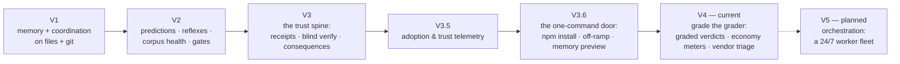

# SMA Roadmap

*Directions, not dates. Every item ships the way everything here ships: as a deterministic script with a registered prediction and a receipt.*

[Русская версия ниже ↓](#роадмап-sma)

## Where we are

| Version | Theme | Status |
|---|---|---|
| V1 | Layered memory + multi-terminal coordination, plain files + git | ✅ shipped |
| V2 | Predictions, reflexes, corpus health, gates | ✅ shipped |
| V3 | The trust spine: receipts, blind verify, consequences | ✅ shipped |
| V3.5 | Adoption & trust telemetry | ✅ shipped |
| V3.6 | The one-command door: npm install, off-ramp, memory preview | ✅ shipped |
| V4 | Grade the grader: graded verdicts, economy meters, vendor triage | ✅ current |
| **V5** | **Orchestration: a 24/7 worker fleet** | 🔵 planned — next major |

## V5 — Orchestration: a 24/7 worker fleet

Until now SMA has been the discipline *around* one interactive session. V5 adds the layer that runs the work itself, overnight, while the trust spine stays exactly as strict.

| Piece | What it does |
|---|---|
| **Durable queue + dispatcher** | A small always-on daemon on a dedicated machine. Tasks live in a durable local queue; workers claim atomically (a task can never be taken twice); a heartbeat returns silent tasks to the queue; the tick loop is stateless — kill the daemon mid-step, restart it, nothing is lost. |
| **Headless runners** | Workers drive Claude Code and Codex CLI headless sessions. Every task gets its own isolated worktree and home directory — context never leaks between tasks; dangerous CLI flags are refused by construction. |
| **Window routing + budget stop** | Several subscription accounts, honest window estimates, automatic hand-over when a limit closes, and an API fallback under a hard monthly spend ceiling. |
| **One gate for every lane** | Whoever produced the work — no reverify receipt, no "done". Workers never push and never merge; a human reviews, approves, and publishes. |
| **Owner's front** | A token-authenticated panel with a deliberately frozen route table (the surface cannot grow into remote command execution), and a richer app on top: today view, task board, team roster, live work stream, costs and limits, rules. |
| **Decision snapshot** | Mine the owner's own session history — locally, secrets redacted, never committed — into a situation → decision corpus; distill it into the dispatcher's policy; grade it with a replay exam ("decides like you in N cases out of 100"). |
| **The Creator** | A standing roster role that drafts new agents, skills, and tool requests from a plain-language description, knowing the product it serves. Drafts only — nothing activates without the owner's explicit approval. |
| **Report-back** | A morning summary over a webhook (a chat bot as the first consumer): done, failed, spend, awaiting approval. |

## Also planned

- **Publish this repo's calibration badge** — hidden until the committed ledger reaches n ≥ 20 settled predictions on one Claude model.
- **Keep watching the vendor in the open** — every new upstream capability gets a CORE/BRIDGE verdict in the append-only ledger; a BRIDGE surface ships with its own self-removal prediction.

---

# Роадмап SMA

*Направления, а не даты. Каждый пункт выйдет так, как здесь выходит всё: детерминированным скриптом с зарегистрированным предсказанием и квитанцией.*

## Где мы сейчас

| Версия | Тема | Статус |
|---|---|---|
| V1 | Слоёная память + координация терминалов, файлы + git | ✅ вышла |
| V2 | Предсказания, рефлексы, здоровье корпуса, ворота | ✅ вышла |
| V3 | Хребет доверия: квитанции, слепая переповерка, последствия | ✅ вышла |
| V3.5 | Адаптация и телеметрия доверия | ✅ вышла |
| V3.6 | Дверь в одну команду: npm-установка, выход, превью памяти | ✅ вышла |
| V4 | Оценивай оценщика: оценённые вердикты, счётчики экономики, триаж поставщика | ✅ текущая |
| **V5** | **Оркестрация: парк работников 24/7** | 🔵 план — следующий мажор |

## V5 — Оркестрация: парк работников 24/7

До сих пор SMA был дисциплиной *вокруг* одной интерактивной сессии. V5 добавляет слой, который выполняет работу сам, ночью — при этом хребет доверия остаётся ровно таким же строгим.

| Часть | Что делает |
|---|---|
| **Долговечная очередь + диспетчер** | Небольшой всегда-включённый демон на выделенной машине. Задачи живут в долговечной локальной очереди; работники берут их атомарно (задачу невозможно взять дважды); пульс возвращает замолчавшие задачи в очередь; цикл — без состояния: убейте демон посреди шага, перезапустите — ничего не потеряно. |
| **Headless-раннеры** | Работники ведут headless-сессии Claude Code и Codex CLI. У каждой задачи свой изолированный worktree и домашний каталог — контекст не утекает между задачами; опасные флаги CLI отклоняются по построению. |
| **Окна подписок + бюджетный стоп** | Несколько аккаунтов, честные оценки окон, автоматическая пересадка при закрытии лимита, API-запасной канал под жёстким месячным потолком расходов. |
| **Один гейт для всех полос** | Кто бы ни сделал работу — без квитанции переповерки нет «готово». Работники никогда не пушат и не мёржат; человек смотрит, одобряет и публикует. |
| **Фронт владельца** | Панель со входом по токену и намеренно замороженной таблицей маршрутов (поверхность не может дорасти до удалённого исполнения команд), а над ней — богатое приложение: экран «сегодня», доска задач, ростер команды, живой поток работы, расходы и лимиты, правила. |
| **Слепок решений** | Добыть из собственной истории сессий владельца — локально, с редакцией секретов, без коммита — корпус «ситуация → решение»; дистиллировать его в политику диспетчера; оценить экзаменом-реплеем («решает как Вы в N случаях из 100»). |
| **Создатель** | Штатная роль ростера, которая собирает черновики новых агентов, навыков и заявок на инструменты по описанию обычными словами, зная продукт, которому служит. Только черновики — ничто не включается без явного одобрения владельца. |
| **Отчёт-назад** | Утренняя сводка через webhook (первый потребитель — чат-бот): готово, не получилось, расход, ждёт одобрения. |

## Также в плане

- **Опубликовать значок калибровки этого репозитория** — скрыт, пока закоммиченный журнал не наберёт n ≥ 20 закрытых предсказаний на одной модели Claude.
- **Продолжать смотреть на поставщика в открытую** — каждая новая возможность платформы получает вердикт CORE/BRIDGE в append-only журнале; BRIDGE-поверхность выходит со своим предсказанием самоустранения.
