# SMA Roadmap

*Directions, not dates. Every item ships the way everything here ships: as a deterministic script with a registered prediction and a receipt.*

[Русская версия ниже ↓](#роадмап-sma)

## Where we are

```mermaid
flowchart LR
    V1["V1<br>memory + coordination<br>on files + git"] --> V2["V2<br>predictions · reflexes ·<br>corpus health · gates"]
    V2 --> V3["V3<br>the trust spine:<br>receipts · blind verify · consequences"]
    V3 --> V35["V3.5<br>adoption & trust telemetry"]
    V35 --> V36["V3.6<br>the one-command door:<br>npm install · off-ramp · memory preview"]
    V36 --> V4["V4 — current<br>grade the grader:<br>graded verdicts · economy meters · vendor triage"]
    V4 -.-> V5["V5 — planned<br>orchestration:<br>a 24/7 worker fleet"]
    V5 -.-> V51["V5.1<br>works with what you have<br>+ memory model 1.0 + the front"]
    V51 -.-> V52["V5.2<br>measured memory:<br>benchmark · explain · hybrid retrieval"]
    V52 -.-> V53["V5.3<br>governance · hardened fleet ·<br>external validation"]
```

| Version | Theme | Status |
|---|---|---|
| V1 | Layered memory + multi-terminal coordination, plain files + git | ✅ shipped |
| V2 | Predictions, reflexes, corpus health, gates | ✅ shipped |
| V3 | The trust spine: receipts, blind verify, consequences | ✅ shipped |
| V3.5 | Adoption & trust telemetry | ✅ shipped |
| V3.6 | The one-command door: npm install, off-ramp, memory preview | ✅ shipped |
| V4 | Grade the grader: graded verdicts, economy meters, vendor triage | ✅ current |
| **V5** | **Orchestration: a 24/7 worker fleet** | 🔵 planned — next major |
| V5.1 | Works with what you have + Memory Model 1.0 + the working front | 🔵 planned |
| V5.2 | Measured memory: benchmark, explainability, hybrid retrieval | 🔵 planned |
| V5.3 | Memory governance, hardened fleet, external validation | 🔵 planned |

## V5 — Orchestration: a 24/7 worker fleet

Until now SMA has been the discipline *around* one interactive session. V5 adds the layer that runs the work itself, overnight, while the trust spine stays exactly as strict.

| Piece | What it does |
|---|---|
| **Durable queue + dispatcher** | A small always-on daemon on a dedicated machine. Tasks live in a durable local queue; workers claim atomically (a task can never be taken twice); a heartbeat returns silent tasks to the queue; the tick loop is stateless — kill the daemon mid-step, restart it, nothing is lost. |
| **Headless runners** | Workers drive Claude Code and Codex CLI headless sessions. Every task gets its own isolated worktree and home directory — context never leaks between tasks; dangerous CLI flags are refused by construction. |
| **Window routing + budget stop** | Several subscription accounts, honest window estimates, automatic hand-over when a limit closes, and an API fallback under a hard monthly spend ceiling. |
| **One gate for every lane** | Whoever produced the work — no reverify receipt, no "done". Workers never push and never merge; a human reviews, approves, and publishes. |
| **Owner's front** | A token-authenticated panel with a deliberately frozen route table (the surface cannot grow into remote command execution), and a richer app on top: today view, task board, team roster, live work stream, costs and limits, rules. |
| **Decision snapshot** | Mine the owner's own session history — locally, secrets redacted, never committed — into a situation → decision corpus; distill it into the dispatcher's policy; grade it with a replay exam ("decides like you in N cases out of 100"). |
| **The Creator** | A standing roster role that drafts new agents, skills, and tool requests from a plain-language description, knowing the product it serves. Drafts only — nothing activates without the owner's explicit approval. |
| **Report-back** | A morning summary over a webhook (a chat bot as the first consumer): done, failed, spend, awaiting approval. |

## V5.1 — Works with what you have

Orchestration is only useful when it runs YOUR setup, not a naked model. V5.1 makes that true in three steps: the fleet's workers operate with the estate the repository already carries (its agents, skills, rules, and the layered memory); a fresh install ships the SMA preset out of the box — the standard agents, skills, and the memory system itself (the architecture and its rituals, with your own empty corpus; nobody's memories are ever bundled); and an import door reads the agents and skills you built elsewhere (`.claude/agents`, `.claude/skills`, rules files; other tools' formats as demand appears) and enrolls them into the fleet through the same door the Creator uses — draft, lint receipt, approval queue. Imported definitions are third-party text: nothing activates without the owner's explicit yes.

V5.1 also opens the conversational door. A chat window in the owner's front lets you talk to the dispatcher the way you talk to a terminal — add a task to the backlog, ask why a run failed, ask what is eating the budget. The chat's hands are deliberately tied: it can read fleet state and draft tasks (through the same readiness gate as any task), and nothing more — no command execution, and everything that changes reality still passes the existing approval doors; the front's frozen route table only grows by an explicit, recorded revision. The same seam carries first-run onboarding: a fresh install boots the daemon, opens the app, and the dispatcher interviews you — project profile, infrastructure, seeding your empty memory corpus and the preset — so a new user never needs the terminal to start. The CLI onboarding remains for those who prefer it.

V5.1 also makes every decision visible. **The decision journal**: nothing in the fleet happens "on faith" — the task card shows WHY at every step. The dispatcher logs its reasons as structured codes (why this lane and this worker, why the run moved to another account, what was rejected and why — deterministic, from the routing and window machinery). Every worker attempt carries a mandatory **approach note**: the chosen approach, the alternatives considered and rejected, and which memories or rules shaped it — an attempt without its note is as incomplete as one without its receipt. And the memory-influence trace (which notes loaded, which reflexes fired during the attempt) closes the chain, connecting forward to `sma memory explain` in V5.2. The journal is append-only and rides the same attempt ledger the receipts do.

V5.1 ships two more things. **The working front** — the owner's rich app (today view, task board, roster, live work stream, costs, rules) goes from design to a running build served by the daemon. And **Memory Model 1.0** — the start of the memory-foundation program below: freeze the surface baseline (reproducible install, current receipts green, current retrieval/latency/cost measured), then formalize what a memory IS. Schema v2 turns a note into a **claim**: memory type (working / semantic / episodic / procedural / prospective / normative / preference), truth mode (observed / inferred / factual / hypothesis / decision / normative), source authority, evidence links, scope, `observed_at`/`recorded_at`/valid time, sensitivity, retention, and a verification command. The overloaded single "importance" number splits into criticality, frequency, confidence, freshness, context priority, and risk. Agents write the full schema — the discipline costs model tokens, not human patience. The whole v1 corpus stays readable; migration is preview-only; nothing is rewritten silently.

## The memory foundation — the program behind V5.1–V5.3

An external architecture review of SMA (internal working document, 2026-07-20) set the direction we adopt here: **before the product surface grows further, the memory layer itself must become formally specified, measurable, explainable, and governable.** The sequence is the point: formal memory model → baseline → explainability → hybrid retrieval → lifecycle governance → fleet hardening → external validation.

**North-star metric: cost per verified correct result** — total tokens, compute, wall-clock time, and human minutes per independently verified accepted outcome. Guardrails around it: critical-memory miss rate, superseded-memory selection rate, repeated-incident recurrence, false-done rate, collision precision/recall, context overhead, human corrections per accepted task.

Two standing laws carried through every phase: **every derived index is rebuildable** (deleting an FTS, vector, or graph projection must never destroy knowledge — if it can't be rebuilt from canonical records, it has become a hidden source of truth), and **a new retriever enters the default path only after measured lift on the gold set** — a negative result is a full-fledged outcome, recorded and kept.

## V5.2 — Measured memory

Prove the memory works before making it cleverer.

- **Memory benchmark** — a gold set of real and adversarial cases: exact retrieval, synonyms and paraphrases, cross-language queries (a query in one language finding a note in another), superseded facts, contradictions, temporal questions, missing evidence, abstention, selective forgetting, prompt injection planted inside a memory, poisoned memories, multi-hop dependencies, similar-but-inapplicable lessons, renamed paths. Metrics: recall@k, precision@k, critical-memory miss rate, superseded selection rate, contradiction exposure — plus action-impact metrics: repeated-defect recurrence, time-to-first-correct-action, human corrections, cost per verified result. Reproducible on a fresh clone.
- **`sma memory explain`** — every retrieval decision becomes explainable BEFORE any new retriever: which memories were selected, on which exact/lexical/graph grounds, and which were rejected and why (superseded, out of scope, low trust).
- **Explainable hybrid retrieval** — deterministic facets stay the always-available substrate; add exact path/symbol retrieval and a rebuildable FTS/BM25 index; fuse and rerank by relevance, criticality, temporal state, and authority under a hard context budget. Optional multilingual dense retrieval only after measured lift — and the system keeps working with the vector layer removed.
- The front matures here if it slips V5.1.

## V5.3 — Memory governance and the hardened fleet

Make memory governable and the fleet's semantics formal — then prove the value on strangers' repositories.

- **Temporal graph and typed links** — machine-readable relations (`derived_from`, `supports`, `contradicts`, `supersedes`, `applies_to`, `requires`, `exception_to`, `verified_by`), full `observed_at`/`recorded_at`/valid-time semantics, immutable episodes stored apart from compact reviewed claims. An edge is added only when it improves a concrete retrieval, temporal, or verification query — never for beauty.
- **The full memory lifecycle** — the old "memory is never deleted" invariant is replaced with the precise rule: reviewed organizational knowledge never disappears *by accident*, but the system supports supersede, **revoke**, **expire**, **archive**, and physical **erase** where safety, law, or the owner requires it — with erasure tests covering copies and indexes. Risk-based approval per memory class: low-risk observations auto-persist with TTL; procedural recommendations need an evidence threshold; hard reflexes need human approval or deterministic proof; security rules and decision policies are governed, versioned, human-only.
- **Storage classes and fail semantics** — public/repo memory in git; internal reviewed memory in private git; sensitive local memory encrypted; ephemeral runtime memory with TTL; regulated data in a separately governed store. Advisory streams fail open; push authorization, secret access, destructive actions, and hard budget stops fail closed. A small **safety kernel** — capability validation, human-only boundaries, secret scopes, budget stops — with formal failure semantics and minimal dependence on the LLM or optional indexes.
- **Memory as untrusted input** — retrieved content is data, never policy: source, trust level, and sensitivity travel separately from the text; a retrieved document can never widen tool permissions; external content passes secret scan and suspicious-instruction detection.
- **Fleet hardening** — the task lifecycle becomes a versioned state machine (ready → claimed → running → produced → verifying → waiting-human → accepted / rejected / retryable / dead-letter) with transition contracts, immutable attempts, single-active-lease semantics, idempotency keys for side effects, per-worker capability envelopes, and dead-letter recovery drills. Every attempt is stamped with the policy version, memory snapshot hash, plan hash, model, and harness version. No exactly-once promises — at-least-once delivery with idempotent effects, stated plainly. Workers keep zero push/merge capability, no matter what any prompt says.
- **External validation and the product core** — counterfactual pilots (bare agent vs current SMA vs experimental SMA on the same tasks and repo states) across several external repositories and stacks; the default command surface shrinks to a small core path with advanced instruments discoverable but secondary; the evidence report is published including negative results. Acceptance is blunt: a lower cost per verified correct result in the target segment, and a new user reaching first value **without the author's help** — onboarding sells value, not terminology.

## Not building yet — on purpose

A feature enters this roadmap only with a concrete failure class, a baseline, a falsifiable prediction, acceptance criteria, and a rollback condition. Until then, deliberately **not** building: a mandatory cloud vector database; automatic LLM rewriting of canonical memories; automatic promotion of any conclusion into a reflex; a full graph for every note; more top-level CLI verbs; fine-tuning a policy model on the owner's transcripts (retrieval + replay first, compare later); a Creator that activates agents itself; automatic push/merge; regulated data in the shared memory substrate; marketing claims about "human-like memory".

## Also planned

- **Publish this repo's calibration badge** — hidden until the committed ledger reaches n ≥ 20 settled predictions on one Claude model.
- **Keep watching the vendor in the open** — every new upstream capability gets a CORE/BRIDGE verdict in the append-only ledger; a BRIDGE surface ships with its own self-removal prediction.

---

# Роадмап SMA

*Направления, а не даты. Каждый пункт выйдет так, как здесь выходит всё: детерминированным скриптом с зарегистрированным предсказанием и квитанцией.*

## Где мы сейчас

| Версия | Тема | Статус |
|---|---|---|
| V1 | Слоёная память + координация терминалов, файлы + git | ✅ вышла |
| V2 | Предсказания, рефлексы, здоровье корпуса, ворота | ✅ вышла |
| V3 | Хребет доверия: квитанции, слепая переповерка, последствия | ✅ вышла |
| V3.5 | Адаптация и телеметрия доверия | ✅ вышла |
| V3.6 | Дверь в одну команду: npm-установка, выход, превью памяти | ✅ вышла |
| V4 | Оценивай оценщика: оценённые вердикты, счётчики экономики, триаж поставщика | ✅ текущая |
| **V5** | **Оркестрация: парк работников 24/7** | 🔵 план — следующий мажор |
| V5.1 | Работает с тем, что у вас есть + модель памяти 1.0 + рабочий фронт | 🔵 план |
| V5.2 | Измеренная память: бенчмарк, объяснимость, гибридный поиск | 🔵 план |
| V5.3 | Управление памятью, укреплённый парк, внешняя валидация | 🔵 план |

## V5 — Оркестрация: парк работников 24/7

До сих пор SMA был дисциплиной *вокруг* одной интерактивной сессии. V5 добавляет слой, который выполняет работу сам, ночью — при этом хребет доверия остаётся ровно таким же строгим.

| Часть | Что делает |
|---|---|
| **Долговечная очередь + диспетчер** | Небольшой всегда-включённый демон на выделенной машине. Задачи живут в долговечной локальной очереди; работники берут их атомарно (задачу невозможно взять дважды); пульс возвращает замолчавшие задачи в очередь; цикл — без состояния: убейте демон посреди шага, перезапустите — ничего не потеряно. |
| **Headless-раннеры** | Работники ведут headless-сессии Claude Code и Codex CLI. У каждой задачи свой изолированный worktree и домашний каталог — контекст не утекает между задачами; опасные флаги CLI отклоняются по построению. |
| **Окна подписок + бюджетный стоп** | Несколько аккаунтов, честные оценки окон, автоматическая пересадка при закрытии лимита, API-запасной канал под жёстким месячным потолком расходов. |
| **Один гейт для всех полос** | Кто бы ни сделал работу — без квитанции переповерки нет «готово». Работники никогда не пушат и не мёржат; человек смотрит, одобряет и публикует. |
| **Фронт владельца** | Панель со входом по токену и намеренно замороженной таблицей маршрутов (поверхность не может дорасти до удалённого исполнения команд), а над ней — богатое приложение: экран «сегодня», доска задач, ростер команды, живой поток работы, расходы и лимиты, правила. |
| **Слепок решений** | Добыть из собственной истории сессий владельца — локально, с редакцией секретов, без коммита — корпус «ситуация → решение»; дистиллировать его в политику диспетчера; оценить экзаменом-реплеем («решает как Вы в N случаях из 100»). |
| **Создатель** | Штатная роль ростера, которая собирает черновики новых агентов, навыков и заявок на инструменты по описанию обычными словами, зная продукт, которому служит. Только черновики — ничто не включается без явного одобрения владельца. |
| **Отчёт-назад** | Утренняя сводка через webhook (первый потребитель — чат-бот): готово, не получилось, расход, ждёт одобрения. |

## V5.1 — Работает с тем, что у вас есть

Оркестрация полезна только тогда, когда она ведёт ВАШУ систему, а не голую модель. V5.1 делает это правдой в три шага: работники парка действуют с тем хозяйством, которое уже лежит в репозитории (его агенты, навыки, правила и слоёная память); свежая установка приносит пресет SMA из коробки — штатные агенты, навыки и саму систему памяти (архитектуру и её ритуалы, с вашим собственным пустым корпусом; ничьи воспоминания никогда не поставляются); а дверь импорта читает агентов и навыки, собранные вами в других местах (`.claude/agents`, `.claude/skills`, файлы правил; форматы других инструментов — по мере спроса), и заводит их в парк через ту же дверь, что и у Создателя: черновик, квитанция проверки, очередь одобрения. Импортированные определения — чужой текст: ничто не включается без явного «да» владельца.

V5.1 открывает и разговорную дверь. Окно чата во фронте владельца позволяет говорить с диспетчером так, как вы говорите с терминалом: добавить задачу в бэклог, спросить, почему прогон упал, что съедает бюджет. Руки чата намеренно связаны: он умеет читать состояние парка и создавать черновики задач (через тот же гейт готовности, что и любая задача) — и ничего больше; никакого исполнения команд, а всё, что меняет реальность, по-прежнему проходит существующие двери одобрения; замороженная таблица маршрутов фронта растёт только явной записанной ревизией. Этот же шов несёт онбординг первого запуска: свежая установка поднимает демон, открывает приложение, и диспетчер проводит интервью — профиль проекта, инфраструктура, посев вашего пустого корпуса памяти и пресета, — так что новому пользователю терминал для старта не нужен. Онбординг через CLI остаётся для тех, кому он привычнее.

V5.1 делает видимым и каждое решение. **Журнал решений**: ничто в парке не происходит «на веру» — карточка задачи показывает ПОЧЕМУ на каждом шаге. Диспетчер записывает свои причины структурными кодами (почему эта полоса и этот работник, почему прогон переехал на другой аккаунт, что отвергнуто и почему — детерминированно, из механики маршрутизации и окон). Каждая попытка работника несёт обязательную **записку о подходе**: выбранный подход, рассмотренные и отклонённые альтернативы, какие записи памяти и правила на это повлияли — попытка без записки так же неполна, как попытка без квитанции. А след влияния памяти (какие заметки загружены, какие рефлексы сработали в попытке) замыкает цепочку и стыкуется с `sma memory explain` в V5.2. Журнал append-only и едет в тот же реестр попыток, что и квитанции.

В V5.1 входят ещё две вещи. **Рабочий фронт** — богатое приложение владельца (экран «сегодня», доска задач, ростер, живой поток работы, расходы, правила) переходит из дизайна в работающую сборку, которую раздаёт демон. И **модель памяти 1.0** — старт программы фундамента памяти (ниже): зафиксировать базовую линию (воспроизводимая установка, текущие квитанции зелёные, замерены текущий поиск, задержки и стоимость), затем формализовать, что ТАКОЕ память. Схема v2 превращает заметку в **утверждение**: тип памяти (рабочая / смысловая / эпизодическая / процедурная / отложенная / нормативная / предпочтение), режим истины (наблюдение / вывод / факт / гипотеза / решение / норма), источник и его авторитет, ссылки на доказательства, область действия, времена `observed_at`/`recorded_at`/срок действия, чувствительность, срок хранения и команда проверки. Перегруженная единая «важность» разделяется на критичность, частоту, достоверность, свежесть, приоритет контекста и риск. Полную схему заполняют агенты — дисциплина стоит токенов модели, а не терпения человека. Весь корпус v1 остаётся читаемым; миграция только с предпросмотром; ничто не переписывается молча.

## Фундамент памяти — программа за V5.1–V5.3

Внешний архитектурный разбор SMA (внутренний рабочий документ, 20.07.2026) задал направление, которое мы здесь принимаем: **прежде чем поверхность продукта растёт дальше, сам слой памяти должен стать формально описанным, измеримым, объяснимым и управляемым.** Суть — в последовательности: формальная модель памяти → базовая линия → объяснимость → гибридный поиск → управление жизненным циклом → укрепление парка → внешняя валидация.

**Главная метрика: стоимость проверенного правильного результата** — токены, вычисления, время и человеческие минуты на один независимо проверенный принятый результат. Ограждения вокруг неё: доля пропущенной критичной памяти, доля устаревших версий в контексте, повторение уже оплаченных ошибок, расхождение самоотчёта с проверкой, точность предупреждений о коллизиях, накладные расходы контекста, число человеческих правок на принятую задачу.

Два постоянных закона через все фазы: **каждый производный индекс перестраиваем** (удаление полнотекстового, векторного или графового индекса не должно уничтожать знание — если индекс нельзя восстановить из канонических записей, он стал скрытым источником истины), и **новый поиск попадает в путь по умолчанию только после измеренного выигрыша на золотом наборе** — отрицательный результат является полноценным итогом, записывается и хранится.

## V5.2 — Измеренная память

Доказать, что память работает, прежде чем делать её умнее.

- **Бенчмарк памяти** — золотой набор из настоящих и враждебных случаев: точный поиск, синонимы и перефразировки, межъязыковые запросы (запрос на одном языке находит заметку на другом), заменённые факты, противоречия, временные вопросы, отсутствующие доказательства, воздержание от ответа, выборочное забывание, инъекция инструкций внутри памяти, отравленные записи, многошаговые зависимости, похожие-но-неприменимые уроки, переименованные пути. Метрики: полнота и точность в топ-k, доля пропущенной критичной памяти, доля выбранных устаревших версий, доля неразмеченных противоречий — плюс метрики влияния на действие: повторение уже оплаченных ошибок, время до первого правильного действия, число человеческих правок, стоимость проверенного результата. Воспроизводим на свежем клоне.
- **`sma memory explain`** — каждое решение поиска становится объяснимым ДО любого нового поисковика: какие записи выбраны, по каким точным/лексическим/графовым основаниям, какие отклонены и почему (заменена, вне области, низкое доверие).
- **Объяснимый гибридный поиск** — детерминированные фасеты остаются всегда доступной основой; добавляются точный поиск по путям и символам и перестраиваемый полнотекстовый индекс; слияние и переранжирование по релевантности, критичности, временному состоянию и авторитету источника под жёстким бюджетом контекста. Необязательный многоязычный векторный слой — только после измеренного выигрыша, и система продолжает работать с выключенным векторным слоем.
- Фронт дозревает здесь, если не успел в V5.1.

## V5.3 — Управление памятью и укреплённый парк

Сделать память управляемой, а семантику парка формальной — и доказать ценность на чужих репозиториях.

- **Временной граф и типизированные связи** — машинные отношения (получено-из, подтверждает, противоречит, заменяет, применимо-к, требует, исключение-из, проверено-чем), полные времена наблюдения/записи/действия, неизменяемые эпизоды отдельно от компактных проверенных утверждений. Ребро добавляется только когда улучшает конкретный поисковый, временной или проверочный запрос — никогда для красоты.
- **Полный жизненный цикл памяти** — старый инвариант «память никогда не удаляется» заменяется точным правилом: проверенное организационное знание не исчезает *случайно*, но система поддерживает замену, **отзыв**, **истечение**, **архив** и физическое **стирание** там, где этого требуют безопасность, закон или владелец — с тестами стирания, покрывающими копии и индексы. Одобрение по классу риска: низкорисковые наблюдения сохраняются автоматически со сроком жизни; процедурные рекомендации требуют порога доказательств; жёсткие рефлексы — человеческого одобрения или детерминированного доказательства; правила безопасности и политики решений — управляемые, версионируемые, только-человек.
- **Классы хранения и семантика отказов** — публичная память в git; внутренняя проверенная в приватном git; чувствительная локальная — шифрованно; эфемерная — в рантайме со сроком жизни; регулируемые данные — в отдельно управляемом хранилище. Советующие потоки при сбое открываются; авторизация публикации, доступ к секретам, разрушительные действия и жёсткие бюджет-стопы при сбое закрываются. Малое **ядро безопасности** — проверка полномочий, только-человеческие границы, области секретов, бюджет-стопы — с формальной семантикой отказов и минимальной зависимостью от модели и необязательных индексов.
- **Память как недоверенный вход** — извлечённое содержимое это данные, а не политика: источник, уровень доверия и чувствительность передаются отдельно от текста; извлечённый документ не может расширить права инструментов; внешнее содержимое проходит проверку на секреты и подозрительные инструкции.
- **Укрепление парка** — жизненный цикл задачи становится версионируемой машиной состояний (готова → взята → выполняется → произведена → проверяется → ждёт человека → принята / отклонена / повтор / отстойник) с контрактами переходов, неизменяемыми попытками, семантикой единственной активной аренды, ключами идемпотентности для внешних эффектов, конвертами полномочий на работника и учениями по восстановлению из отстойника. Каждая попытка штампуется версией политики, слепком памяти, планом, моделью и версией обвязки. Никаких обещаний «ровно один раз» — доставка «минимум один раз» с идемпотентными эффектами, сказано прямо. У работников ноль прав на публикацию и слияние, что бы ни говорил любой промпт.
- **Внешняя валидация и ядро продукта** — контрфактические пилоты (голый агент против текущей SMA против экспериментальной на одних и тех же задачах и состояниях репозитория) на нескольких чужих репозиториях и стеках; поверхность команд по умолчанию сжимается до малого ядра, продвинутые инструменты остаются доступными, но вторичными; отчёт о доказательствах публикуется вместе с отрицательными результатами. Приёмка прямая: ниже стоимость проверенного правильного результата в целевом сегменте, и новый пользователь доходит до первой ценности **без помощи автора** — онбординг продаёт ценность, а не терминологию.

## Пока не строим — намеренно

Новая возможность попадает в этот роадмап только с конкретным классом отказа, базовой линией, фальсифицируемым предсказанием, критериями приёмки и условием отката. До тех пор намеренно **не** строим: обязательную облачную векторную базу; автоматическое переписывание канонической памяти моделью; автоматическое превращение любого вывода в рефлекс; полный граф для каждой заметки; новые команды верхнего уровня; дообучение модели политики на транскриптах владельца (сначала поиск + реплей, потом сравнение); Создателя, который сам включает агентов; автоматическую публикацию и слияние; регулируемые данные в общем хранилище памяти; маркетинговые заявления о «человеческой памяти».

## Также в плане

- **Опубликовать значок калибровки этого репозитория** — скрыт, пока закоммиченный журнал не наберёт n ≥ 20 закрытых предсказаний на одной модели Claude.
- **Продолжать смотреть на поставщика в открытую** — каждая новая возможность платформы получает вердикт CORE/BRIDGE в append-only журнале; BRIDGE-поверхность выходит со своим предсказанием самоустранения.
