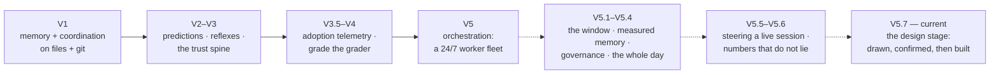

# SMA Roadmap

*Directions, not dates. Every item ships the way everything here ships: as a deterministic script with a registered prediction and a receipt.*

**Русская версия: [ROADMAP.ru.md](ROADMAP.ru.md)**

## Where we are

```mermaid
flowchart LR
    V1["V1<br>memory + coordination<br>on files + git"] --> V3["V2–V3<br>predictions · reflexes ·<br>the trust spine"]
    V3 --> V4["V3.5–V4<br>adoption telemetry ·<br>grade the grader"]
    V4 --> V5["V5<br>orchestration:<br>a 24/7 worker fleet"]
    V5 -.-> V54["V5.1–V5.4<br>the window · measured memory ·<br>governance · the whole day"]
    V54 -.-> V56["V5.5–V5.6<br>steering a live session ·<br>numbers that do not lie"]
    V56 -.-> V57["V5.7 — current<br>the design stage:<br>drawn, confirmed, then built"]
```

| Version | Theme | Status |
|---|---|---|
| V1 | Layered memory + multi-terminal coordination, plain files + git | ✅ shipped |
| V2 | Predictions, reflexes, corpus health, gates | ✅ shipped |
| V3 | The trust spine: receipts, blind verify, consequences | ✅ shipped |
| V3.5 / V3.6 | Adoption telemetry · the one-command door | ✅ shipped |
| V4 | Grade the grader: graded verdicts, economy meters | ✅ shipped |
| V5 | Orchestration: a 24/7 worker fleet | ✅ shipped (v5.0.0, July 2026) |
| V5.1 | Works with what you have + the working front | ✅ shipped (v5.1.0) |
| V5.2 | Measured memory: benchmark, explainability, hybrid retrieval | ✅ shipped (v5.2.0) |
| V5.3 | Memory governance, hardened fleet | ✅ shipped (v5.3.0) |
| V5.4 | The whole working day without the terminal | ✅ shipped (v5.4.0) |
| V5.5 | The engine: steering a live session | ✅ shipped (v5.5.0) |
| V5.6 | The taskboard, and numbers that do not lie | ✅ shipped (v5.6.0–v5.6.1) |
| **V5.7** | **The design stage: drawn, confirmed, then built** | ✅ **shipped (v5.7.0) — current** |

Each release's full story — what it built, what broke on the way, and what it deliberately did not claim — is in [docs/DETAILS.md](docs/DETAILS.md#the-v5-series-release-by-release). This page keeps the shape.

## What the journey built — the highlights

Every line below is held by receipts in the repository, not by this page's word.

- **A trust spine no other tool has.** Pre-registered predictions, re-runnable receipts whose digests bind command + exit code + output, a blind verifier that refuses the agent's self-report, and a false "done" that blocks the release until a human rules. The grader itself is graded, and the calibration badge hides itself rather than overstate.
- **A memory layer that is measured, not promised.** A benchmark reproducible on a fresh clone; an explain command that names why every note was delivered or withheld; a lexical retrieval layer admitted to the default path only after a measured lift on gold cases (recall@3 +34 points, MRR +26 — and its one regression on the same record); a twelve-step write pipeline with secret scrub and drafts.
- **A fleet whose parity is proven per attempt.** A worker runs in its own copy carrying your rules, hooks, memory, skills, narrowing permissions and the model you assigned it — six receipts per attempt, computed by the daemon, where missing data is a failure. Push, merge, tag, deploy are refused in the process's own launch arguments.
- **A window whose numbers do not lie.** Every figure on the taskboard is measured or says «no data» in words; a field that reaches the window's contract is drawn or stands in an explicit not-drawn list with a reason — enforced by the suite. The route table is frozen, its size is a test.
- **Steering a live session** — the gap the whole market left open: a word typed at running work reaches the turn mid-run at the next tool-call boundary, or interrupts with the correction written to disk first; a returned task resumes the session you already paid for.
- **Documentation held by the test suite.** The counts of commands, verbs, routes and tests quoted in the docs are checked against the code on every `npm test`; the badge is written from a real run's report.
- **A hardening campaign closed with receipts.** A 116-point registry — worker-terminal parity, engine wiring, docs-equal-code, end-to-end acceptance — was driven to 112 green with a receipt behind every point; the four that remain are exactly the live-operation milestones named below, on this page, not hidden in a changelog.
- **And the design stage** — the fifth stage of the phase graph: the thing is drawn, a contract stands beside the drawing, and execution is physically refused until a person confirms it. Two roles came with it: a designer distilled from real design resources, and an animator under a stated motion law.

## What comes next

- **The five-day acceptance run.** The owner works five days only from the window on a real project; every hole becomes a filed task; zero manual daemon lifts. This is a live-operation milestone — it cannot be closed by a test, only by the days actually happening.
- **Federation across two physical machines.** The hub/peer design is built and proven on one machine; the receipt on two real machines over a private mesh is the remaining step.
- **A bilingual runtime, and pilots on strangers' repositories.** The runtime's surfaces speak the user's language (RU/EN) evenly, held by a string-parity test; and the full path — task → worker → acceptance — runs on two external open repositories, receipts published, negative results included.
- **One journal for every error.** Today failures land in half a dozen places and some silent refusals land nowhere; a single error journal — every subsystem, one line each, with words and a trail — becomes the source that proposes tasks onto the board by itself.
- **An independent cross-vendor reviewer.** The blind-verification seat extended so that work done by one model family can be re-checked by a different vendor's model that never saw the executor's prompt or reasoning — catching what a same-family reviewer might share as a blind spot.

## Not building yet — on purpose

A feature enters this roadmap only with a concrete failure class, a baseline, a falsifiable prediction, acceptance criteria, and a rollback condition. Until then, deliberately **not** building: a hosted control plane or SaaS dashboard — the fleet, its queue, and its secrets stay on machines you own; a mandatory cloud vector database; automatic LLM rewriting of canonical memories; automatic promotion of any conclusion into a reflex; a full graph for every note; more top-level CLI verbs; fine-tuning a policy model on the owner's transcripts (retrieval + replay first, compare later); a Creator that activates agents itself; automatic push/merge; regulated data in the shared memory substrate; marketing claims about "human-like memory".

## Also planned

- **Publish this repo's calibration badge** — hidden until the committed ledger reaches n ≥ 20 settled predictions on one Claude model.
- **Keep watching the vendor in the open** — every new upstream capability gets a CORE/BRIDGE verdict in the append-only ledger; a BRIDGE surface ships with its own self-removal prediction.
