# Роадмап SMA

*Направления, а не даты. Каждый пункт выйдет так, как здесь выходит всё: детерминированным скриптом с зарегистрированным предсказанием и квитанцией.*

**English version: [ROADMAP.md](ROADMAP.md)**

## Где мы сейчас

```mermaid
flowchart LR
    V1["V1<br>память + координация<br>на файлах + git"] --> V2["V2<br>предсказания · рефлексы ·<br>здоровье корпуса · ворота"]
    V2 --> V3["V3<br>хребет доверия:<br>квитанции · слепая переповерка · последствия"]
    V3 --> V35["V3.5<br>адаптация и телеметрия доверия"]
    V35 --> V36["V3.6<br>дверь в одну команду:<br>npm-установка · выход · превью памяти"]
    V36 --> V4["V4<br>оценивай оценщика:<br>оценённые вердикты · счётчики экономики"]
    V4 --> V5["V5 — текущая<br>оркестрация:<br>парк работников 24/7"]
    V5 -.-> V51["V5.1<br>работает с тем, что у вас есть<br>+ модель памяти 1.0 + фронт"]
    V51 -.-> V52["V5.2<br>измеренная память:<br>бенчмарк · объяснимость · гибридный поиск"]
    V52 -.-> V53["V5.3<br>управление памятью · укреплённый парк ·<br>внешняя валидация"]
```

| Версия | Тема | Статус |
|---|---|---|
| V1 | Слоёная память + координация терминалов, файлы + git | ✅ вышла |
| V2 | Предсказания, рефлексы, здоровье корпуса, ворота | ✅ вышла |
| V3 | Хребет доверия: квитанции, слепая переповерка, последствия | ✅ вышла |
| V3.5 | Адаптация и телеметрия доверия | ✅ вышла |
| V3.6 | Дверь в одну команду: npm-установка, выход, превью памяти | ✅ вышла |
| V4 | Оценивай оценщика: оценённые вердикты, счётчики экономики, триаж поставщика | ✅ вышла |
| **V5** | **Оркестрация: парк работников 24/7** | ✅ **текущая** (v5.0.0 → v5.0.1, июль 2026) |
| V5.1 | Работает с тем, что у вас есть + модель памяти 1.0 + рабочий фронт | 🔵 в дизайне |
| V5.2 | Измеренная память: бенчмарк, объяснимость, гибридный поиск | 🔵 план |
| V5.3 | Управление памятью, укреплённый парк, внешняя валидация | 🔵 план |

## V5 — Оркестрация: парк работников 24/7 ✅

До V5 SMA был дисциплиной *вокруг* одной интерактивной сессии. V5 выпустил слой, который выполняет работу сам, ночью — при этом хребет доверия остаётся ровно таким же строгим. Вот двигатель, который сегодня лежит в репозитории:

| Часть | Что делает |
|---|---|
| **Долговечная очередь + диспетчер** | Небольшой всегда-включённый демон на вашей машине. Задачи живут в долговечной локальной очереди (Postgres); работники берут их атомарно — задачу невозможно взять дважды; каждая попытка ложится в append-only реестр попыток; истёкшая аренда возвращает замолчавшую задачу в очередь, а задача, падающая раз за разом, паркуется в отстойнике вместо вечного цикла. Цикл — без состояния: убейте демон посреди шага, перезапустите — ничего не потеряно и ничего не выполнится дважды. |
| **Headless-раннеры** | Работники ведут headless-сессии Claude Code и Codex CLI. Опасные флаги CLI отклоняются по построению — классом ошибки, а не договорённостью; парсеры вывода никогда не падают на мусоре; расход оценивается на каждый прогон. |
| **Окна подписок + бюджетный стоп** | Несколько аккаунтов, честные оценки окон (помечены как *оценка*, пока закрытие не подтверждено фактом), автоматическая пересадка при закрытии лимита и жёсткая бюджетная лестница: предупреждение на 70%, тревога на 90%, стоп на 100%. Парк тратит внутри подписок, за которые вы уже платите. |
| **Один гейт для всех полос** | Кто бы ни сделал работу — без квитанции переповерки нет «готово». У работников ноль прав на публикацию и слияние, что бы им ни говорил любой промпт; человек смотрит, одобряет и публикует. |
| **Фронт владельца** | Панель со входом по токену, которую раздаёт сам демон, с намеренно **замороженной таблицей маршрутов** — поверхность не может тихо дорасти до удалённого исполнения команд; она растёт только явной записанной ревизией. Живые обновления уходят только после того, как запись стала долговечной. |
| **Слепок решений** | Политика диспетчера дистиллируется из собственной истории сессий владельца — добыто локально, секреты вычищены, в коммиты не попадает — и оценивается экзаменом-реплеем: отложенные исторические ситуации прогоняются через синтетического диспетчера, и процент совпадения с реальными решениями владельца — это оценка политики. Жёсткие границы (публикация, дизайн, объём, бюджет) остаются только-человеческими при любом счёте. |
| **Создатель** | Штатная роль ростера, превращающая описание обычными словами в *черновики* новых агентов, навыков и заявок на инструменты. Только черновики — каждый с квитанцией проверки, в очереди одобрения; включение — два явных человеческих шага. Подключения инструментов переключают булев флаг в локальном реестре машины; Создатель может просить — включать не может. |
| **Отчёт-назад** | Утренняя сводка через webhook (первый потребитель — чат-бот): готово, не получилось, расход, ждёт одобрения. |

Две честные оговорки. **Богатое ежедневное приложение** поверх этого двигателя — первый пункт V5.1; сегодня выходит двигатель плюс тонкая операционная панель. А **обвязки автозапуска** (Планировщик Windows, launchd на macOS) лежат в репозитории *выключенными*: регистрация и включение — явное действие владельца, задокументированное по шагам, со смоук-скриптом, который доказывает контур очередь → взятие → квитанция → фронт из конца в конец до того, как потрачен хоть один токен модели.

## V5.1 — Работает с тем, что у вас есть

Оркестрация полезна только тогда, когда она ведёт ВАШУ систему, а не голую модель. V5.1 делает это правдой в три шага: работники парка действуют с тем хозяйством, которое уже лежит в репозитории (его агенты, навыки, правила и слоёная память); свежая установка приносит пресет SMA из коробки — штатные агенты, навыки и саму систему памяти (архитектуру и её ритуалы, с вашим собственным пустым корпусом; ничьи воспоминания никогда не поставляются); а дверь импорта читает агентов и навыки, собранные вами в других местах (`.claude/agents`, `.claude/skills`, файлы правил; форматы других инструментов — по мере спроса), и заводит их в парк через ту же дверь, что и у Создателя: черновик, квитанция проверки, очередь одобрения. Импортированные определения — чужой текст: ничто не включается без явного «да» владельца. Планка, которую парк обязан взять, — **терминальный паритет**: сессия работника должна уметь то же, что ваша собственная терминальная сессия — те же хуки, та же память, те же навыки — и это доказывается квитанциями на реальном прогоне, а не заявляется.

V5.1 открывает и разговорную дверь. Окно чата во фронте владельца позволяет говорить с диспетчером так, как вы говорите с терминалом: добавить задачу в бэклог, спросить, почему прогон упал, что съедает бюджет. Руки чата намеренно связаны: он умеет читать состояние парка и создавать черновики задач (через тот же гейт готовности, что и любая задача) — и ничего больше; никакого исполнения команд, а всё, что меняет реальность, по-прежнему проходит существующие двери одобрения; замороженная таблица маршрутов фронта растёт только явной записанной ревизией. Этот же шов несёт онбординг первого запуска: свежая установка поднимает демон, открывает приложение, и диспетчер проводит интервью — профиль проекта, инфраструктура, посев вашего пустого корпуса памяти и пресета, — так что новому пользователю терминал для старта не нужен. Онбординг через CLI остаётся для тех, кому он привычнее.

V5.1 делает видимым каждое решение. **Журнал решений**: ничто в парке не происходит «на веру» — карточка задачи показывает ПОЧЕМУ на каждом шаге. Диспетчер записывает свои причины структурными кодами (почему эта полоса и этот работник, почему прогон переехал на другой аккаунт, что отвергнуто и почему — детерминированно, из механики маршрутизации и окон). Каждая попытка работника несёт обязательную **записку о подходе**: выбранный подход, рассмотренные и отклонённые альтернативы, какие записи памяти и правила на это повлияли — попытка без записки так же неполна, как попытка без квитанции. А след влияния памяти (какие заметки загружены, какие рефлексы сработали в попытке) замыкает цепочку и стыкуется с `sma memory explain` в V5.2. Журнал append-only и едет в тот же реестр попыток, что и квитанции.

### Несколько машин, несколько проектов — одно окно

Парк редко живёт на одном компьютере: реалистичная форма — маленькая всегда-включённая машина для ночной работы, настольный компьютер, который подключается, когда включён, и телефон, с которого хочется смотреть и одобрять откуда угодно. V5.1 проектируется ровно под эту форму, на трёх законах:

- **Один демон на машину, и каждый аккаунт-подписка приписан ровно к одной машине.** Оценки окон и бюджетные стопы честны только тогда, когда весь расход аккаунта видит один демон — два демона, вслепую делящие одну подписку, сожгли бы одно окно дважды.
- **«Проект» — измерение первого класса, а не отдельная установка.** Один демон ведёт задачи всех ваших репозиториев; задача несёт свой проект; фронт фильтрует по нему. Одна машина — один демон — все проекты в нём.
- **Между машинами демоны объединяются в федерацию.** Вы назначаете один демон **hub**-ом и перечисляете его пиров (адрес + токен). Hub собирает их состояние, и приложение показывает каждую машину и каждый проект в одном окне: присутствие по машинам (online / offline, как доска runtimes), расходы и окна по машинам, один адрес в браузере — включая телефон.

Сетевой слой — **ваш, а не наш**: приватная сеть (WireGuard, Tailscale или self-hosted координатор) соединяет ваши машины и ваш телефон. Демон никогда не просит выставить себя в публичный интернет — в документации это сказано жирным — и никакого облака вендора в этой конструкции нет нигде. Ваш парк, ваша очередь, ваши токены, ваши машины. Экраны едут с фронтом V5.1; полная федерация выходит не позже V5.3.

В V5.1 входят ещё две вещи. **Рабочий фронт** — богатое приложение владельца (экран «сегодня», доска задач, ростер, живой поток работы, расходы, правила) переходит из дизайна в работающую сборку, которую раздаёт демон. И **модель памяти 1.0** — старт программы фундамента памяти (ниже): зафиксировать базовую линию (воспроизводимая установка, текущие квитанции зелёные, замерены текущий поиск, задержки и стоимость), затем формализовать, что ТАКОЕ память. Схема v2 превращает заметку в **утверждение**: тип памяти (рабочая / смысловая / эпизодическая / процедурная / отложенная / нормативная / предпочтение), режим истины (наблюдение / вывод / факт / гипотеза / решение / норма), источник и его авторитет, ссылки на доказательства, область действия, времена `observed_at`/`recorded_at`/срок действия, чувствительность, срок хранения и команда проверки. Перегруженная единая «важность» разделяется на критичность, частоту, достоверность, свежесть, приоритет контекста и риск. Полную схему заполняют агенты — дисциплина стоит токенов модели, а не терпения человека. Весь корпус v1 остаётся читаемым; миграция только с предпросмотром; ничто не переписывается молча.

## Фундамент памяти — программа за V5.1–V5.3

Внешний архитектурный разбор SMA (внутренний рабочий документ, 20.07.2026) задал направление, которое мы здесь принимаем: **прежде чем поверхность продукта растёт дальше, сам слой памяти должен стать формально описанным, измеримым, объяснимым и управляемым.** Суть — в последовательности: формальная модель памяти → базовая линия → объяснимость → гибридный поиск → управление жизненным циклом → укрепление парка → внешняя валидация.

**Главная метрика: стоимость проверенного правильного результата** — токены, вычисления, время и человеческие минуты на один независимо проверенный принятый результат. Ограждения вокруг неё: доля пропущенной критичной памяти, доля устаревших версий в контексте, повторение уже оплаченных ошибок, расхождение самоотчёта с проверкой, точность предупреждений о коллизиях, накладные расходы контекста, число человеческих правок на принятую задачу.

Два постоянных закона через все фазы: **каждый производный индекс перестраиваем** (удаление полнотекстового, векторного или графового индекса не должно уничтожать знание — если индекс нельзя восстановить из канонических записей, он стал скрытым источником истины), и **новый поиск попадает в путь по умолчанию только после измеренного выигрыша на золотом наборе** — отрицательный результат является полноценным итогом, записывается и хранится.

## V5.2 — Измеренная память

Доказать, что память работает, прежде чем делать её умнее.

- **Бенчмарк памяти** — золотой набор из настоящих и враждебных случаев: точный поиск, синонимы и перефразировки, межъязыковые запросы (запрос на одном языке находит заметку на другом), заменённые факты, противоречия, временные вопросы, отсутствующие доказательства, воздержание от ответа, выборочное забывание, инъекция инструкций внутри памяти, отравленные записи, многошаговые зависимости, похожие-но-неприменимые уроки, переименованные пути. Метрики: полнота и точность в топ-k, доля пропущенной критичной памяти, доля выбранных устаревших версий, доля неразмеченных противоречий — плюс метрики влияния на действие: повторение уже оплаченных ошибок, время до первого правильного действия, число человеческих правок, стоимость проверенного результата. Воспроизводим на свежем клоне.
- **`sma memory explain`** — каждое решение поиска становится объяснимым ДО любого нового поисковика: какие записи выбраны, по каким точным/лексическим/графовым основаниям, какие отклонены и почему (заменена, вне области, низкое доверие).
- **Объяснимый гибридный поиск** — детерминированные фасеты остаются всегда доступной основой; добавляются точный поиск по путям и символам и перестраиваемый полнотекстовый индекс; слияние и переранжирование по релевантности, критичности, временному состоянию и авторитету источника под жёстким бюджетом контекста. Необязательный многоязычный векторный слой — только после измеренного выигрыша, и система продолжает работать с выключенным векторным слоем.
- Фронт дозревает здесь, если не успел в V5.1.

## V5.3 — Управление памятью и укреплённый парк

Сделать память управляемой, а семантику парка формальной — и доказать ценность на чужих репозиториях. Мультимашинное окно достигает своей полной федеративной формы самое позднее здесь.

- **Временной граф и типизированные связи** — машинные отношения (получено-из, подтверждает, противоречит, заменяет, применимо-к, требует, исключение-из, проверено-чем), полные времена наблюдения/записи/действия, неизменяемые эпизоды отдельно от компактных проверенных утверждений. Ребро добавляется только когда улучшает конкретный поисковый, временной или проверочный запрос — никогда для красоты.
- **Полный жизненный цикл памяти** — старый инвариант «память никогда не удаляется» заменяется точным правилом: проверенное организационное знание не исчезает *случайно*, но система поддерживает замену, **отзыв**, **истечение**, **архив** и физическое **стирание** там, где этого требуют безопасность, закон или владелец — с тестами стирания, покрывающими копии и индексы. Одобрение по классу риска: низкорисковые наблюдения сохраняются автоматически со сроком жизни; процедурные рекомендации требуют порога доказательств; жёсткие рефлексы — человеческого одобрения или детерминированного доказательства; правила безопасности и политики решений — управляемые, версионируемые, только-человек.
- **Классы хранения и семантика отказов** — публичная память в git; внутренняя проверенная в приватном git; чувствительная локальная — шифрованно; эфемерная — в рантайме со сроком жизни; регулируемые данные — в отдельно управляемом хранилище. Советующие потоки при сбое открываются; авторизация публикации, доступ к секретам, разрушительные действия и жёсткие бюджет-стопы при сбое закрываются. Малое **ядро безопасности** — проверка полномочий, только-человеческие границы, области секретов, бюджет-стопы — с формальной семантикой отказов и минимальной зависимостью от модели и необязательных индексов.
- **Память как недоверенный вход** — извлечённое содержимое это данные, а не политика: источник, уровень доверия и чувствительность передаются отдельно от текста; извлечённый документ не может расширить права инструментов; внешнее содержимое проходит проверку на секреты и подозрительные инструкции.
- **Укрепление парка** — жизненный цикл задачи становится версионируемой машиной состояний (готова → взята → выполняется → произведена → проверяется → ждёт человека → принята / отклонена / повтор / отстойник) с контрактами переходов, неизменяемыми попытками, семантикой единственной активной аренды, ключами идемпотентности для внешних эффектов, конвертами полномочий на работника и учениями по восстановлению из отстойника. Каждая попытка штампуется версией политики, слепком памяти, планом, моделью и версией обвязки. Никаких обещаний «ровно один раз» — доставка «минимум один раз» с идемпотентными эффектами, сказано прямо. У работников ноль прав на публикацию и слияние, что бы ни говорил любой промпт.
- **Внешняя валидация и ядро продукта** — контрфактические пилоты (голый агент против текущей SMA против экспериментальной на одних и тех же задачах и состояниях репозитория) на нескольких чужих репозиториях и стеках; поверхность команд по умолчанию сжимается до малого ядра, продвинутые инструменты остаются доступными, но вторичными; отчёт о доказательствах публикуется вместе с отрицательными результатами. Приёмка прямая: ниже стоимость проверенного правильного результата в целевом сегменте, и новый пользователь доходит до первой ценности **без помощи автора** — онбординг продаёт ценность, а не терминологию.

## Пока не строим — намеренно

Новая возможность попадает в этот роадмап только с конкретным классом отказа, базовой линией, фальсифицируемым предсказанием, критериями приёмки и условием отката. До тех пор намеренно **не** строим: облачную панель управления и SaaS-дашборд — парк, его очередь и его секреты остаются на машинах, которыми владеете вы; обязательную облачную векторную базу; автоматическое переписывание канонической памяти моделью; автоматическое превращение любого вывода в рефлекс; полный граф для каждой заметки; новые команды верхнего уровня; дообучение модели политики на транскриптах владельца (сначала поиск + реплей, потом сравнение); Создателя, который сам включает агентов; автоматическую публикацию и слияние; регулируемые данные в общем хранилище памяти; маркетинговые заявления о «человеческой памяти».

## Также в плане

- **Опубликовать значок калибровки этого репозитория** — скрыт, пока закоммиченный журнал не наберёт n ≥ 20 закрытых предсказаний на одной модели Claude.
- **Продолжать смотреть на поставщика в открытую** — каждая новая возможность платформы получает вердикт CORE/BRIDGE в append-only журнале; BRIDGE-поверхность выходит со своим предсказанием самоустранения.
