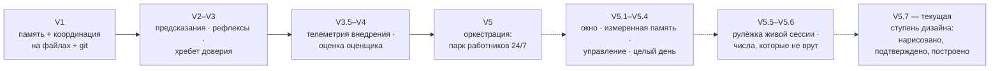

# Роадмап SMA

*Направления, а не даты. Каждый пункт выходит так, как здесь выходит всё: детерминированным скриптом с зарегистрированным предсказанием и квитанцией.*

**English version: [ROADMAP.md](ROADMAP.md)**

## Где мы

```mermaid
flowchart LR
    V1["V1<br>память + координация<br>на файлах + git"] --> V3["V2–V3<br>предсказания · рефлексы ·<br>хребет доверия"]
    V3 --> V4["V3.5–V4<br>телеметрия внедрения ·<br>оценка оценщика"]
    V4 --> V5["V5<br>оркестрация:<br>парк работников 24/7"]
    V5 -.-> V54["V5.1–V5.4<br>окно · измеренная память ·<br>управление · целый день"]
    V54 -.-> V56["V5.5–V5.6<br>рулёжка живой сессии ·<br>числа, которые не врут"]
    V56 -.-> V57["V5.7 — текущая<br>ступень дизайна:<br>нарисовано, подтверждено, построено"]
```

| Версия | Тема | Статус |
|---|---|---|
| V1 | Слоистая память + координация терминалов, обычные файлы + git | ✅ вышла |
| V2 | Предсказания, рефлексы, здоровье корпуса, гейты | ✅ вышла |
| V3 | Хребет доверия: квитанции, слепая проверка, последствия | ✅ вышла |
| V3.5 / V3.6 | Телеметрия внедрения · дверь одной команды | ✅ вышла |
| V4 | Оценка оценщика: градуированные вердикты, счётчики экономики | ✅ вышла |
| V5 | Оркестрация: парк работников 24/7 | ✅ вышла (v5.0.0, июль 2026) |
| V5.1 | Работает с тем, что у вас есть + рабочий фронт | ✅ вышла (v5.1.0) |
| V5.2 | Измеренная память: бенчмарк, объяснимость, гибридная доставка | ✅ вышла (v5.2.0) |
| V5.3 | Управление памятью, укреплённый парк | ✅ вышла (v5.3.0) |
| V5.4 | Целый рабочий день без терминала | ✅ вышла (v5.4.0) |
| V5.5 | Двигатель: рулёжка живой сессии | ✅ вышла (v5.5.0) |
| V5.6 | Задачник и числа, которые не врут | ✅ вышла (v5.6.0–v5.6.1) |
| **V5.7** | **Ступень дизайна: нарисовано, подтверждено, потом построено** | ✅ **вышла (v5.7.0) — текущая** |

Полная история каждого выпуска — что построил, что сломалось по дороге и чего он сознательно не утверждал — в [docs/DETAILS.ru.md](docs/DETAILS.ru.md#линейка-v5-выпуск-за-выпуском). Эта страница держит форму.

## Что построила дорога — главное

Каждую строку ниже держат квитанции в репозитории, а не слово этой страницы.

- **Хребет доверия, которого нет ни у кого.** Предрегистрированные предсказания, перезапускаемые квитанции, чей отпечаток связывает команду + код выхода + вывод, слепой проверяющий, отказывающийся читать самоотчёт агента, и ложное «готово», блокирующее релиз до решения человека. Сам оценщик оценивается, а значок калибровки скорее спрячется, чем завысит.
- **Слой памяти, который измерен, а не обещан.** Бенчмарк, воспроизводимый на свежем клоне; команда explain, называющая, почему каждая заметка доставлена или удержана; лексический слой доставки, допущенный в путь по умолчанию только после измеренного прироста на золотых кейсах (recall@3 +34 пункта, MRR +26 — и его единственная регрессия в том же протоколе); двенадцатишаговый конвейер записи с вычисткой секретов и черновиками.
- **Парк, чей паритет доказан на каждой попытке.** Работник идёт в собственной копии с вашими правилами, хуками, памятью, навыками и сужающими разрешениями — пять квитанций на попытку, которые считает демон, и отсутствие данных там — провал. Пуш, слияние, тег, деплой отказаны в аргументах запуска самого процесса.
- **Окно, чьи числа не врут.** Каждая цифра задачника измерена или говорит «нет данных» словами; поле, доехавшее до договора окна, нарисовано — или стоит в явном списке «не для показа» с причиной, и это держит сьют. Таблица дверей заморожена, её размер — тест.
- **Рулёжка живой сессии** — щель, которую оставил открытой весь рынок: слово, напечатанное в работающую работу, доезжает в ход на ближайшей границе вызова инструмента — или прерывает, с правкой, записанной на диск до убийства; возвращённая задача продолжает уже оплаченную сессию.
- **Документация, которую держит сьют.** Числа команд, глаголов, дверей и тестов в доках сверяются с кодом на каждом `npm test`; значок пишется из отчёта настоящего прогона.
- **Кампания укрепления, закрытая квитанциями.** Реестр в 116 пунктов — паритет работника с терминалом, проводка движка, «доки = код», сквозная приёмка — доведён до 112 зелёных с квитанцией за каждым; четыре оставшихся — ровно вехи живой эксплуатации, названные ниже на этой странице, а не спрятанные в чейнджлог.
- **И ступень дизайна** — пятая ступень графа фаз: вещь рисуется, рядом с рисунком стоит договор, и исполнение физически отказано, пока человек не подтвердит. С ней пришли две роли: дизайнер, собранный из настоящих дизайн-наработок, и аниматор под явным законом движения.

## Что дальше

- **Пятидневный приёмочный прогон.** Владелец пять дней работает только из окна на настоящем проекте; каждая дыра становится заведённой задачей; ноль ручных подъёмов демона. Это веха живой эксплуатации — её нельзя закрыть тестом, только прожитыми днями.
- **Федерация на двух физических машинах.** Схема hub/peer построена и доказана на одной машине; квитанция на двух настоящих машинах через приватную сеть — оставшийся шаг.
- **Двуязычный рантайм и пилоты на чужих репозиториях.** Поверхности рантайма говорят на языке пользователя (RU/EN) ровно, под тестом паритета строк; полный путь — задача → работник → приёмка — проходит на двух внешних открытых репозиториях, квитанции публикуются, отрицательные результаты включаются.
- **Один журнал на все ошибки.** Сегодня отказы ложатся в полдюжины мест, а часть тихих отказов — никуда; единый журнал ошибок — каждая подсистема, по строке, словами и со следом — становится источником, который сам предлагает задачи на доску.
- **Независимый проверяющий другой крови.** Кресло слепой проверки расширяется так, чтобы работу, сделанную одним семейством моделей, перепроверяла модель другого вендора, не видевшая ни промпта, ни рассуждений исполнителя, — ловя то, что проверяющий той же крови мог бы разделить как слепое пятно.

## Пока сознательно не строим

Фича попадает в этот роадмап только с конкретным классом отказа, базлайном, фальсифицируемым предсказанием, критериями приёмки и условием отката. До тех пор — сознательно **не** строим: хостируемую панель или SaaS — парк, его очередь и его секреты остаются на ваших машинах; обязательную облачную векторную базу; автоматическое LLM-переписывание канонических записей; автоматическое повышение любого вывода в рефлекс; полный граф для каждой заметки; больше глаголов CLI верхнего уровня; дообучение модели политики на стенограммах владельца (сначала retrieval + replay, потом сравнение); Creator, который сам активирует агентов; автоматический push/merge; регулируемые данные в общем субстрате памяти; маркетинговые заявления о «памяти как у человека».

## Ещё запланировано

- **Опубликовать значок калибровки этого репозитория** — спрятан, пока закоммиченный журнал не наберёт n ≥ 20 сведённых предсказаний на одной модели Claude.
- **Продолжать смотреть за вендором в открытую** — каждая новая возможность платформы получает вердикт CORE/BRIDGE в append-only журнале; поверхность BRIDGE выходит со своим предсказанием самоудаления.
