# SMA — the full deep dive

*Everything the lean [README](../README.md) points to: the side-by-side comparison, the accountable loop in detail, the full CLI reference tables, the demo gallery, the hook integration, and the complete version history V1 → the V5 series with the trust spine process by process. The [ROADMAP](../ROADMAP.md) covers what comes next.*

[Русская версия → DETAILS.ru.md](DETAILS.ru.md)

---

## Side by side — one task, four setups

The same model does the coding in bare Claude Code, in Superpowers, in GSD, and in SMA. What changes is the process around it — and, at the finish line, **whose word you take for "done."** Here is one ~30-minute task followed through its phases:

| Phase | Bare Claude Code | Superpowers | GSD | **SMA** |
|---|---|---|---|---|
| **Plan** | In its head, ad-hoc | Brainstorm → plan skill | Written `PLAN.md`, checked by an agent | Plan, then **grilled** — every promise cross-examined before a line is written |
| **Research** | From what it already knows | Research skill | Research subagents → `RESEARCH.md` | Reads its **own memory + receipts** first; catalog before grep |
| **Execute** | Writes the code | Test-first skills | Executor subagents, atomic commits | Executes — the relevant rule **fires at the exact tool call**, not in a file skimmed once |
| **Verify** | "Looks done" — its own word | Runs the tests | A verifier *agent* checks the goal | **Re-derives "done" from the code alone**, refuses the self-report; a false "done" blocks the release |
| **Remember** | Nothing — next session starts blank | Nothing carries across sessions | Learnings saved to `.planning` (this project) | Lessons + calibration + coordination **persist and fire next time** — across sessions and terminals |

Every column but one ends on *the agent's own word* for "done." SMA is the layer that checks the homework the model cannot grade itself — and remembers, so you don't pay for the same mistake twice.

## How the loop runs

<p align="center">
  
</p>

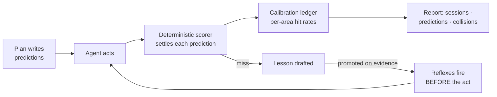
```mermaid
flowchart LR
    A["Plan writes<br>predictions"] --> B["Agent acts"]
    R["Reflexes fire<br>BEFORE the act"] --> B
    B --> C["Deterministic scorer<br>settles each prediction"]
    C --> D["Calibration ledger<br>per-area hit rates"]
    C -->|miss| E["Lesson drafted"]
    E -->|promoted on evidence| R
    D --> F["Report: sessions ·<br>predictions · collisions"]
```

One burn, permanent avoidance — the model is a child who touches boiling water once. The miss is written down, the written lesson gets a trigger, and the trigger fires as a warning in front of the *next* matching action, in every terminal, forever. And because the scorer is a script, the loop cannot flatter itself.


## Memory, in three layers

Not one big instruction file — three tiers that keep the always-loaded budget tiny while nothing is lost by accident. (Losing something on purpose is its own command — see *Governance: classes, lifecycle, erasure and refusals* below.)

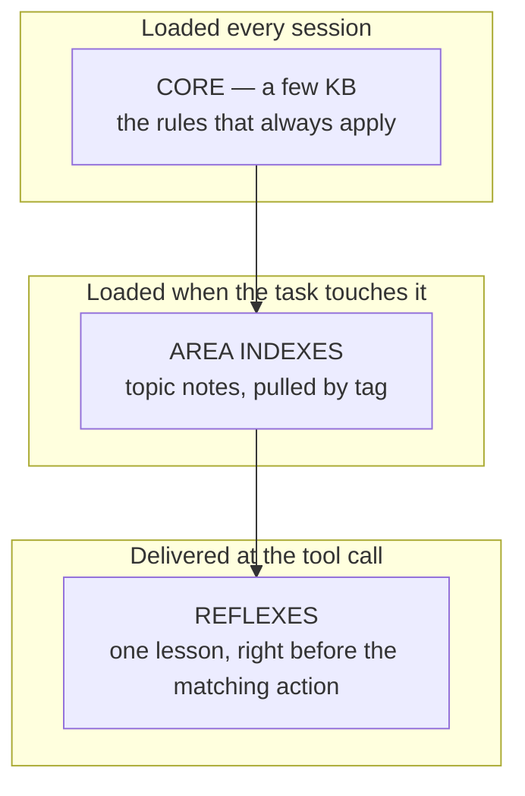
```mermaid
flowchart TD
    subgraph Always["Loaded every session"]
        C["CORE — a few KB<br>the rules that always apply"]
    end
    subgraph OnDemand["Loaded when the task touches it"]
        I["AREA INDEXES<br>topic notes, pulled by tag"]
    end
    subgraph AtTheAct["Delivered at the tool call"]
        X["REFLEXES<br>one lesson, right before the matching action"]
    end
    C --> I --> X
```

Auto-trim never deletes — it *demotes* down the layers, so the system gets lighter without ever losing a fact (in this repo's own dogfood, the always-loaded index went from 46 KB to 5 KB with full recall preserved, gated by a standing benchmark).

**How a memory actually gets saved** — a fact never enters by accident, and it never leaves by accident either:

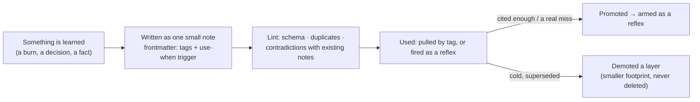
```mermaid
flowchart LR
    T["Something is learned<br>(a burn, a decision, a fact)"] --> N["Written as one small note<br>frontmatter: tags + use-when trigger"]
    N --> L["Lint: schema · duplicates ·<br>contradictions with existing notes"]
    L --> U["Used: pulled by tag, or fired as a reflex"]
    U -->|cited enough / a real miss| PR["Promoted → armed as a reflex"]
    U -->|cold, superseded| DM["Demoted a layer<br>(smaller footprint, never deleted)"]
```

Each note carries a `use-when` trigger — that single line is what lets SMA deliver it at exactly the right tool call instead of dumping the whole corpus into every prompt. Promotion is earned by evidence, never by a timer; demotion shrinks the hot budget without forgetting. *Auto-trim only changes how loudly the system remembers; real forgetting is a separate deliberate command, never a side effect.*

## Governance: classes, lifecycle, erasure and refusals

This section is the map. The law lives in four documents and is not reprinted here:
[MEMORY-MODEL.md](MEMORY-MODEL.md) (what one record may claim and must carry),
[MEMORY-LIFECYCLE.md](MEMORY-LIFECYCLE.md) (how it is written, approved and retired),
[MEMORY-THREAT-MODEL.md](MEMORY-THREAT-MODEL.md) (who may see what, and what fails closed),
[FLEET-INVARIANTS.md](FLEET-INVARIANTS.md) (the worker fleet's eight invariants). A map that
reprints the territory goes stale first.

### The three storage classes, and the field they are derived from

There is no new frontmatter field to learn. All three classes are **derived** from fields the
schema already has — `sensitivity` answers *who may see this*, the lifetime fields
(`retention`, `valid_until`) answer *how long may it live*. Folding those two questions into one
field would make both unanswerable, so they stay separate and the class falls out of them:

| `sensitivity` | → storage class | why |
|---|---|---|
| none declared | `shared` | nothing says otherwise |
| `public` | `shared` | everyone may see it |
| `internal` | `shared` | the team may — and git *is* the team |
| `sensitive` | `this-machine-only` | not where an export can read it |
| `encrypted-required` | `this-machine-only` | must not sit in a git-backed class at all |
| any of the above **plus** a lifetime window | `ephemeral` | …unless the value is restricted, in which case the strictest wins |
| anything else | **refused** | an unreadable label is not a permit |

The mapping is enforced in both write doors before a single byte is written, failing closed. A
`this-machine-only` record is filed under `.sma/local-memory`, which keeps itself out of git by
its own ignore marker. **Be exact about what that buys: it is enforced placement, not
encryption.** The bytes are plain text on disk — a decision taken on 2026-08-04 with its costs
measured and written down, not an oversight. The reasoning is in
[MEMORY-THREAT-MODEL.md](MEMORY-THREAT-MODEL.md) §6.

### The five lifecycle states, and which one a bare forget applies

A record is `active`, or it is in one of four retirements: `superseded` (something newer says it
better), `revoked` (it was withdrawn), `expired` (its own clock ran out), `archived` (parked for
history). **All four are honoured by the read path**, not just some of them: a record in any of
them is excluded from the pack, stays in its area index marked, and remains quotable as history.

`sma memory forget <id>` with no flag applies **`revoked`** — the plain reading of "forget this":
withdrawn, no longer delivered, still readable. The other three are explicit:
`--expire`, `--archive`, and `--replaced-by <id>` for supersession. Nothing is deleted by any of
them, and the generated index is rebuilt so the on-disk `MEMORY.md` stops quoting what was just
retired.

### What an erase walks, and how it proves it

`--erase` is the different verb: physical removal, asked once, not reversible. It walks six named
surfaces, clears each, and then **reads each one back** to confirm it is actually gone:

| Surface | What it is |
|---|---|
| `corpus` | the reviewed record itself, in the git working tree |
| `drafts` | a staged copy awaiting review, in the same tree |
| `local-store` | the this-machine-only store under `.sma/` |
| `generated-index` | `MEMORY.md`, rebuilt afterwards rather than patched |
| `area-indexes` | the per-area catalogs, rebuilt the same way |
| `lexical-index` | the derived BM25/path index under `.sma/` |

A surface whose path the caller did not supply is reported as **`unverified`** — named to the
user, never counted as clean. That distinction is the whole point: "I could not look there" and
"there is nothing there" are different sentences, and a delete command that confuses them is
worth nothing. Two limits are stated rather than hidden: **git history still holds anything that
was committed** (erase says so, and rewriting history stays your decision), and the episode
archive is deliberately *not* a surface erase clears — an episode is "what happened", a different
asset class from "what is true".

### The refusals that happen at read time

Retrieved text is data, never an instruction. Two refusals fire before ranking, and both are
visible:

- **A note carrying something aimed at the assistant** — "ignore your previous instructions" and
  the same trick in Russian — is withheld, not down-ranked. (The Russian half of that matcher was
  dead code until this version; it was found by measurement, not by reading.)
- **A note belonging to a different repository** than the one being asked about is withheld once
  the caller declares which world it is asking about.

Neither happens silently. `sma memory explain --task "…"` gives every note in the corpus exactly
one verdict — delivered on a named ground, or withheld naming the filter and the field that
decided — so a refusal is arguable decision by decision instead of being an unexplained absence.

### The fleet, made formal

The optional worker fleet gained three declarations, and they are declarations the tests hold the
code to:

- **A named state machine** — which task state may follow which, and on whose authority. An
  accepted task requires an authorized disposition; the vocabulary is closed.
- **A capability envelope** — what one worker may touch, declared up front across eight
  fail-closed dimensions, with an empty list meaning "nothing", never "anything".
- **An attempt stamp** — every attempt can record the world it ran in: which policy version,
  which plan, which memory snapshot, which harness, which state-machine version, plus an
  idempotency key so a redelivered effect is applied once.

Seeded property tests attack all eight invariants — twelve independent histories, forty steps
each, from one fixed seed, so a failure arrives as a replayable recipe rather than a mood — and
crash, restart, dead-letter and redelivery drills take a task census before and after each blow.

**The wiring landed on 2026-08-05**, and the three declarations are now consulted by the running
daemon: the queue adapter routes its status changes through the state machine, the tick refuses to
start a worker whose lane envelope grants no execution surface, and production attempt rows carry
the idempotency key, the state-machine version, the envelope digest and the digest of the memory
corpus the worker stood in. A fourth thing landed with them — the ledger is reconciled against the
queue's own retry count once a tick, so an attempt that died while the daemon was down no longer
leaves no trace at all.

**What is honestly still not true**, stated here because a document that only lists capabilities is
an advertisement: three of the seven stamp fields — the policy version, the harness version and a
plan hash — stay **absent**, because nothing in the product can compute them and a stamp that
invents a value is worse than one that admits a gap. Three transitions are exempt by name, each for
a reason written down. And the envelope bounds what the *daemon* does on a worker's behalf, not
what the worker may reach once its session is running — that surface is still the checkout's own
settings. §5 of [FLEET-INVARIANTS.md](FLEET-INVARIANTS.md) says which parts are deliberately not
goals, and exactly where each remaining edge is.

## The CLI reference, by version layer

The coordination + accountability CLI runs underneath — 93 verbs, and the sections below group by the version layer that introduced them the ones this document walks through. Sessions and hooks call the CLI for you; you can also call any verb directly with `node scripts/sma/cli.mjs <verb>`, and every one has an in-product explainer (`node scripts/sma/cli.mjs explain <verb>`). **This grouping is not the complete list** — a few later verbs are described in the release sections further down and a few are not described here at all; the list with a line for every single verb lives in [`scripts/sma/README.md`](../scripts/sma/README.md), and that one is checked against the dispatch table by a gate.

**The count moved by one, and that is worth saying out loud.** For several releases it did not move at all: real new abilities — forgetting, erasing, storage classes, the fleet's formal layer — arrived as subcommands of namespaces that already existed (`memory forget`, `memory index`) rather than as new top-level names. This release added one new top-level name, deliberately and as a decision. The alternative is a surface that grows a little every release until nobody can hold it in their head, and the growth is never anybody's decision because each single addition looked small. The number in the sentence above is not typed by hand either: a gate reads it out of the dispatch table in every document that names it, so the day it moves again no document can quietly stay behind — which is exactly what happened to this file until the gate was widened to watch it.

### Core (V1–V2): memory, coordination, slots

| CLI verbs | What they do |
|---|---|
| `status` · `heartbeat` · `session-start` | Register/renew this terminal's session; the live who-is-doing-what picture (`status` now also reports fingerprint-backed liveness for each claim holder) |
| `claim` · `release` · `force-clear` | Declare "I am taking these files"; warnings fire for other terminals before they edit; force-clear carries provenance |
| `next-slot` · `consume` · `tia` | Race-free shared counters (migrations, releases) and regex test-impact analysis |
| `pre` · `pre-bench` | The one-spawn PreToolUse multiplexer (collision → reflex → gates → airbag → spend) and its SLO instrument; `collision-check` / `reflex-check` / `gates-check` remain as deprecated single-stream aliases |
| `stall-check` | PostToolUse stall/loop detector; drops a flight mark |
| `gates` · `gates-report` · `gates-ack` | Checkable project rules: advisory warns, evidence-gated soft-deny, acknowledgements |
| `lint` · `build-index` · `load` · `snapshot` · `usage` · `consolidate` · `trim` | The memory corpus toolchain: quality lint, machine-built index, tag-scoped loading, usage citations, scheduled consolidation, layer-aware trim |
| `predict-score` · `calibration` | Settle registered predictions with a script; read the per-domain hit-rate ledger |
| `state` · `exec-journal` · `metrics` · `report` | Where a plan stands, the per-plan progress journal, and the whole-system report |

### V3 — the trust spine

| CLI verbs | What they do |
|---|---|
| `reverify` · `receipt-hash` | Re-run every structural receipt; `--fresh-clone` counts only committed evidence |
| `chain-tip` · `chain-verify` | The tamper-evident journal chain: emit the tip (pinned into release tags), detect any edit |
| `blind-verify` | Re-derive every "done" from the code tree alone; refuses executor self-reports (`BLIND_FORBIDDEN`) |
| `preship` · `disposition` | An open class-A event blocks the ship; only a founder disposition (append-only) clears it |
| `grill` | Register/resolve adversarial challenges; `--gate` blocks an ungrilled build; `--pre-push` grills `origin..main` |
| `evidence` | Burden-of-proof records required before risky ops (force-push, allowlist edits, foreign claim clears) |
| `pretask-pack` · `subagent-verify` · `subagent-receipts` | Context inheritance for subagents by construction; every claimed write verified against the real tree |
| `bench` | The 8-metric scorecard harness (baseline frozen before the spine was built) |
| `integrity` · `skeptic` · `canary` · `nearmiss` | The Goodhart/STPA guards that keep the published numbers honest |
| `airbag` · `airbag-check` · `undo` | Bridge (opt-in): millisecond git snapshots before destructive ops; one-action restore |
| `precompact-capsule` · `resume` · `handoff` · `flight` | Bridge (opt-in): the pre-compaction flight capsule and continuation/handoff briefs |
| `spend` · `spend-check` · `breaker` | Bridge (opt-in): the deterministic spend ledger, budget reflexes, and the runaway-rule loop-breaker |

### NEW in V3.5 — adoption & trust telemetry

| CLI verbs | What they do |
|---|---|
| `profile` | The deterministic onboarding profile surface: schema, lint, coverage, recap re-render check |
| `passport` · `model` | Build/verify the calibration passport + README badge; the model-version guard that hides stale priors until n≥20 |
| `excavate` | Mine a stranger's git history read-only; print CATCHES lines — which reflex would have fired before which push |
| `emit` | Compile the corpus into `CLAUDE.md` / `AGENTS.md` / `.cursorrules` / `GEMINI.md` managed blocks (byte-identical re-emits) |
| `catalog` · `context` | The fragment catalog (one deterministic card per file) and the budgeted, byte-deterministic context compiler |
| `ladder` · `tune` · `curriculum` | The self-tuning enforcement ladder: tier table, evidence-gated promote/demote proposals, the weekly miss-curriculum |
| `statusline` · `pulse` | The native statusline segment (composes with a pre-existing user statusline) and the working/waiting attention pulse |
| `manifest` | The PR evidence passport: predictions, receipts, and verdicts for a commit range, as JSON/Markdown |
| `preflight` | The already-built gate: check a plan's claims against the real tree before any executor spawns. The daemon's tick asks it with the PATH of a plan, for machine output, in the connected project's tree — once per plan of the phase |
| `arena` | The comparative benchmark arena scorer + static graphs page (raw data and negative results published) |
| `batch` | The `sma batch` middle lane: risk filter, grill-lite, mandatory receipts |
| `worktree` · `merge` | Per-terminal worktree isolation — `provision` copies the untracked layer named by `.sma/worktree-include` and links dependencies instead of installing them, `remove` unlinks first and only then removes the tree (`--delete-branch` takes the branch too) — and the serialized local-only merge gate (the push itself stays a human-ordered ritual) |
| `session-end` | SessionEnd hook: release this terminal's own claims so stale leases never haunt teammates |
| `ask` | *(experimental stub)* — the fingerprint demand surface (`--unmet-count`); the full feature matures in a later release |
| `explain` · `doc-audit` | 26 plain-language explainer topics with a command-coverage tripwire (every verb resolves to one); the deterministic docs honesty audit |

### NEW in V3.6 — the one-command door

| CLI verbs | What they do |
|---|---|
| `deleteme` | The off-ramp: reverse every installer artifact (dry-run by default) and PRESERVE `.claude/memory/**` — leaving is as cheap as arriving |
| `memory-preview` | The onboarding preview: an ASCII graph of how SMA will lay out YOUR repo's memory (areas from `git ls-files`, reflex candidates from `excavate`) — read-only, zero network, deterministic |

The full CLI reference — every subcommand, flag, hook event, and kill-switch — lives in [scripts/sma/README.md](../scripts/sma/README.md).

### See each command in action

Every command is a terminal conversation. Expand any to watch what it does — each demo loops.

<details open>
<summary><b><code>/sma-start</code></b> — first-run onboarding: it explains the system, then configures it</summary>
<br>
</details>

<details>
<summary><b><code>/sma-discuss-phase</code></b> — lock the gray-area decisions with a human before any code</summary>
<br>
</details>

<details>
<summary><b><code>/sma-plan-phase</code></b> — research, plans, and a plan-check; every step carries a prediction</summary>
<br>
</details>

<details>
<summary><b><code>/sma-execute-phase</code></b> — build in dependency-aware waves; reflexes fire before the act</summary>
<br>
</details>

<details>
<summary><b><code>/sma-verify-work</code></b> — validate against acceptance criteria; a script re-runs each "done"</summary>
<br>
</details>

<details>
<summary><b><code>/sma-quick</code></b> — a small task with full guarantees (atomic commit, state tracked)</summary>
<br>
</details>

<details>
<summary><b><code>/sma-fast</code></b> — a trivial task, inline; no subagents, no planning</summary>
<br>
</details>

<details>
<summary><b><code>/sma-debug</code></b> — systematic debugging whose state survives a context reset</summary>
<br>
</details>

<details>
<summary><b><code>/sma-progress</code></b> — where things stand, and the next concrete step</summary>
<br>
</details>

<details>
<summary><b><code>/sma-resume-work</code></b> — restore full context from the flight recorder</summary>
<br>
</details>

<details>
<summary><b><code>/sma-pause-work</code></b> — write a handoff before you step away</summary>
<br>
</details>

<details>
<summary><b><code>/sma-help</code></b> — the whole <code>/sma-*</code> family at a glance</summary>
<br>
</details>

#### V3 — the trust spine in action

<details open>
<summary><b><code>sma reverify</code></b> — re-run every "done" on a fresh clone; prose-only "done" fails lint</summary>
<br>
</details>

<details>
<summary><b><code>sma blind-verify</code></b> — re-derive "done" from the tree alone; refuse the executor's report</summary>
<br>
</details>

<details>
<summary><b><code>sma preship</code></b> / <code>disposition</code> — a class-A miss blocks the ship until the founder unblocks it</summary>
<br>
</details>

<details>
<summary><b><code>sma grill</code></b> — a challenge becomes a registered prediction, or the build does not start</summary>
<br>
</details>

<details>
<summary><b><code>sma pre-bench</code></b> — one spawn per tool call: 1268.6 ms → p95 152–157 ms</summary>
<br>
</details>

<details>
<summary><b><code>sma undo</code></b> — the git airbag: one action back to safety <sub>(bridge · opt-in)</sub></summary>
<br>
</details>

<details>
<summary><b><code>sma resume</code></b> — rebuild the brief from the flight recorder after a compaction <sub>(bridge · opt-in)</sub></summary>
<br>
</details>

<details>
<summary><b><code>sma spend</code></b> — the deterministic spend ledger + budget reflexes <sub>(bridge · opt-in)</sub></summary>
<br>
</details>

## How it hooks into your agent

SMA plugs into your agent through its harness's **hook points** — the moments the agent lets an outside script run. There is no wrapper around Claude and no fork of it; SMA registers small commands at a few lifecycle events, each a one-line entry in `.claude/settings.json`. Every hook is **fail-open**: if it errors or times out, your work continues — a dead hook never wedges a session.

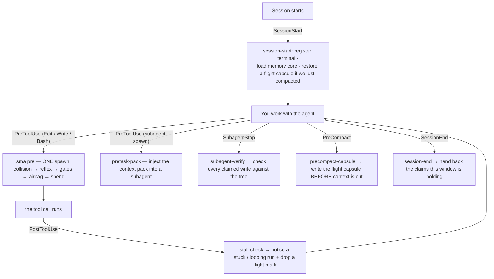
```mermaid
flowchart TD
    S["Session starts"] -->|SessionStart| S1["session-start: register terminal ·<br>load memory core · restore a flight capsule if we just compacted"]
    S1 --> W["You work with the agent"]
    W -->|"PreToolUse (Edit / Write / Bash)"| P1["sma pre — ONE spawn:<br>collision → reflex → gates → airbag → spend"]
    P1 --> ACT["the tool call runs"]
    W -->|"PreToolUse (subagent spawn)"| PT["pretask-pack — inject the context pack into a subagent"]
    ACT -->|PostToolUse| PO["stall-check → notice a stuck / looping run + drop a flight mark"]
    W -->|SubagentStop| SV["subagent-verify → check every claimed write against the tree"]
    W -->|PreCompact| PC["precompact-capsule → write the flight capsule BEFORE context is cut"]
    W -->|SessionEnd| SE["session-end → hand back the claims this window is holding"]
    PO --> W
```

| Hook point | SMA command | What it does at that instant |
|---|---|---|
| **SessionStart** | `session-start` | Registers this terminal, loads the tiny memory core, briefs on what other terminals changed — and, if the session just auto-compacted, re-injects the flight capsule as the first context. |
| **PreToolUse** (Edit/Write/Bash) | `pre` | **One spawn** runs the ordered stream pipeline — collision → reflex → gates → airbag → spend — replacing V2's 3–4 spawns. |
| **PreToolUse** (subagent spawn, `Task\|Agent`) | `pretask-pack` | Injects the assembled context pack into a subagent — inheritance by construction. |
| **PostToolUse** | `stall-check` | Notices a stuck/looping run so an executor death becomes a five-minute resume; also appends one flight mark. |
| **SessionEnd** | `session-end` | Hands back the claims this window is holding, so a terminal that simply went away never leaves a teammate blocked on a scope nobody is editing. |
| **SubagentStop** | `subagent-verify` | Verifies every claimed file write against the real tree; phantom writes are flagged. |
| **PreCompact** | `precompact-capsule` | Deterministically writes the flight capsule *before* compaction deletes the working state. |

Seven entries across those six events, and that is the entire integration surface. The hooks call the same CLI you can run by hand (`node scripts/sma/cli.mjs …`), so nothing happens that you cannot reproduce and inspect yourself. The canonical PreToolUse wiring is a **single entry per matcher** — one `pre` multiplexer for the editing tools, one `pretask-pack` for the spawn tool; the old per-stream commands remain as deprecated aliases for back-compat.

Three limits, named rather than glossed over. The **spawn tool is matched under both names it has carried** (`Task|Agent`): it was renamed between agent versions, and a matcher that knows only one name installs cleanly, fires, and does nothing — matching both is what survives the rename in either direction. **`SessionEnd` fires on every way a session can end** — the window closed, `/clear`, a logout — because the claims want handing back in all three; a `/clear` simply gets a new session id and takes its claims again. And the **`PreCompact` capsule depends on your agent version announcing that event**: where it does not, the command exits without an error and without a capsule, and the entry sits installed until an upgrade makes it live. One more thing not promised: if another tool in your project also rewrites the spawn call's input, the agent keeps whichever hook finished last — SMA does not claim compatibility with a second such modifier.

## Terminal parity, receipt by receipt

«A worker session is the same session you get in your own terminal» is a claim that is worthless
when asserted and load-bearing when proven. It is never proven here by prose, by a green suite or
by the daemon's own word — it is proven by the artifacts one real attempt left behind.

### The run directory

Every attempt writes `<project>/.sma/runs/<attemptId>/` into the connected project — four files:

| File | What it holds |
| --- | --- |
| `run.json` | what the attempt was GIVEN: the command line, the NAMES of the environment variables it was handed, the capability envelope with its digest, the copy it ran in, the personal layer, the mcp config, the state of the project's rules in the copy — and what the session's own opening frame said back |
| `guards.jsonl` | one line per hook the CLI started and answered, and one per tool a guard refused. Always written, even empty: zero lines is the statement «no hook spoke and nothing was refused», which is a finding, where a missing file would only say «nobody wrote one» |
| `transcript.jsonl` | a REFERENCE to the attempt's transcript in the ledger — its path, its digest, its line count and how many rows the ledger's line cap cut short. Never a second copy of the stream: a copy would double the disk for nothing and drift the moment either half were touched |
| `receipt.json` | how the try ENDED: the outcome, the gate that decided it, the verdict, the lesson, the memory layer as the stream observed it — and the parity verdict itself, five receipts beside their summary |

Secrets are absent by construction rather than by filtering: `run.json` carries the NAMES of the
environment variables and never their values, and the prompt is reduced to a digest and a size. The
redaction pass over the finished record is the second belt, not the first.

The directory is **not for git** — a `.sma/` inside a project is local evidence, not history. The
project keeps the newest **200** attempts and sweeps the rest, and every removal writes one line to
the operator's log naming what went: «it can be rolled back» and «it is visible what was removed»
are two different guarantees, and a silent sweep only ever provides the first.

### One command

```
node tools/terminal-parity-check.mjs [<attemptId>] [--attempt <id>] [--project <dir>]
                                     [--dir <runDir>] [--config <path>] [--ledger <path>] [--json]
```

- with no identifier it reads the **latest** attempt of the project by `run.json.startedAt`, falling
  back to the directory's own modification time; an empty `.sma/runs` is said out loud, with the path
  that was looked at, instead of being reported as a quiet zero;
- `--project` names the project root (the current directory by default); `--dir` points straight at
  one run directory; the positional id and `--attempt` are the same thing, and giving both is an error;
- `--config` lets the rights receipt name the worker the attempt was routed to; `--ledger` finds the
  transcript when the ledger has moved;
- `--json` prints the same verdict as an object with exactly five receipts, and the bare number stays
  the last line in either mode.

Exit codes: **0** at five out of five, **1** for an incomplete set or a project with no runs at all,
**2** for a misused command line. The last line of the output is always the bare count, 0–5, which is
what makes the command receipt-hashable and scorable.

### The five, and the boundary of each

| Receipt | Fulfilled when | What it does NOT prove |
| --- | --- | --- |
| `hooks` | at least one hook ANSWERED inside this run's own time window — the window is what makes it a receipt of THIS attempt rather than of the machine's history | that what the guard watched was refused correctly. A start with no answer is not «probably fine»: it is written down as a failure that says so, because a hook launched and never replied is exactly the shape of a guard that was not guarding |
| `memory` | the corpus was actually READ: the index came back, or the search was called | that the session used what it read. The fact is counted by the daemon out of the live stream, where a request and its result are still paired — a read that FAILED looks exactly like a read that succeeded to anybody parsing requests alone, and it was scored as success for a year |
| `rules` | the project's instruction file reached the working copy, materialized into it or tracked by it | that anyone opened it. `absent` is a failure and not a footnote: a worker that never saw the project's rules is not running under them |
| `skills` | the copy carries skills or agents | anything about a project that has neither — that earns an honest **n/a** with the reason printed, never a pass. «Not applicable» is a fact about the project; «passed» would be a fact about the run that nobody established |
| `rights` | **both** halves of the envelope reached the process: the granted tools equal the allow list on the command line, and the actions reserved for a human — push, merge, tag, deploy — equal the refusal list on the same line. An envelope that names human-only actions while the spawn carries no refusal list is a **failure** here, not a warning: that is exactly the state this receipt was pinned at `warn` for, back when only the grant travelled | that the boundary cannot be walked around from inside the session. The refusal list catches the obvious spellings of each action — it is one of three locks and never the only one, and the session's own MCP intake is a separate matter: a server declared in the root of the connected project loads anyway, so the attempt's record names the MCP tools that did not come from your registry |

**Missing data is a failure that names what was missing** — never a default pass, and never a free
n/a. That rule is the whole reason the check exists: the cheapest route to five out of five is to
check nothing, and a checker that reads an empty directory as an unproblematic one is
indistinguishable from a checker that lies. `n/a` is available for exactly one situation — a project
that demonstrably has no skills — and it carries its reason in the same line.

### The same verdict, without running anything

The daemon computes the five from the **same module** the command imports, over the same four files
read back from disk, and writes the result into `receipt.json` and onto the attempt row — so the task
card shows the score, the names of the receipts that did not pass and the path to the directory,
without anybody running a command first. This is not a second opinion: a second implementation of
«did the hooks fire» would agree on the day it was written and drift on every day after, and the
first person to notice would be the one holding a green report over a red run. The suite compares
the two verdicts receipt by receipt, so a divergence is a red test instead of a discovery. An
attempt whose verdict could not be computed carries `null` — «nobody has checked», which is not the
same statement as «checked and fine».

## The V5 series, release by release

The README carries only what is newest. The rest of the V5 line lives here, newest first, in the
words each release was announced in — fix lists included, because a release note that hides what
was broken is worth nothing to the person who hit it. Where a release's mechanism has its own
canonical document, this history links to it instead of reprinting it.

### 5.6.0 — the taskboard, and numbers that do not lie

The task screen became the owner's workplace: every unit of work — a task, a batch, a phase —
reads as one line and opens into its own view; a task card shows what was promised, what was
done, and what proves it; the conversation with the system answers a waiting worker by button
and continues the same session. The exit gate now certifies the work itself: it measures the
worker's copy, and only a NEW divergence counts as red. Numbers stopped lying — waiting age,
attempt counts, merge receipts that say "tests were not run" instead of an invented green.

### 5.5.2 — the engine, connected

5.5.0 built the engine. This release is the day it was discovered that its parts had never been
bolted to one another. Nine breaks, all one class: each piece was written, covered by a test,
green — and attached to nothing. Each became visible only after the one before it was fixed.

- **A worker could not change a file — not once in this product's history.** The permission
  envelope was computed per lane, hashed into every attempt and written to the journal, and never
  handed to the process being launched. A non-interactive session has nobody to confirm an action,
  so Edit, Write, Bash, Grep and Glob were refused inside the child process: a worker could read
  the repository, find the cause of a defect, write the exact patch into its final message — and
  not apply it. Every task failed further downstream («no receipt», «tests red»), and no screen
  could name the reason, because the refusal happened inside a child process. The grant is the
  envelope's own list and nothing beyond it: policy is not widened, it is *delivered*.
- **A live worker was declared dead every two minutes.** Renewing a task's lease called a method
  the queue library does not have, and the error was swallowed by an empty catch. The worker
  counted as silent, its process was never killed, and a duplicate was launched — three parallel
  agents on one task, burning one subscription.
- **The board showed an empty room while work was running.** The router picked an executor and
  stored it nowhere; every busy-counter is built from that field.
- **Work happened in the wrong repository.** The working copy was cut in the directory the daemon
  was launched from rather than the tree of the connected project — and the done card, the diff
  door, the task timeline and the «answer without code» gate read git there too, naming the main
  branch by a hard-coded word.
- **Finished work could not be accepted.** The acceptance gate asked for verification without
  requesting a structured answer and got prose that parsed to nothing; and in a repository with no
  structural receipts the honest answer «nothing to verify» read as «no receipt», failing work that
  carried a real commit. Work with a commit but without proof is not declared done — it goes to the
  human column marked *unverified*. No self-certification: «done» is still only a human's word.
- **A worker's stated approach was never heard.** The parser wanted its marker at the start of a
  line; the stream arrives in JSON frames where the worker's words sit inside a field.
- **The forge lane — creating agents and skills — had received none of the above.** The same four
  misses again on its own code path.
- **Live updates had never reached the window.** The daemon names every frame (`event: <name>`);
  the window listened only for the unnamed default type, to which a named frame is never delivered.
  Every screen quietly lived on a three-second poll, and the live feed always said it was quiet.
  Nothing crashed, so nothing was noticed. The window is now subscribed by name to every declared
  name, proven end to end by a test that runs a real hub → a real server on a live port → a socket
  → the stream parsed to the letter of the spec → the window's own listener.
- **The corpus lost notes on Windows checkouts, silently.** Every grammar decision in the
  frontmatter reader assumed LF, so a note delivered with CRLF came back as a «structural file» —
  description, kind, tags, importance gone without a word — and the tag registry came back empty,
  after which the lint declared every tag in the corpus unregistered. An owner cannot see this by
  construction: their clone is an old checkout with LF, while every fresh worktree the daemon cuts
  for a worker arrives with CRLF.

**New, and visible.** The subscription-window figure on the spend screen is the one Claude Code
hands its own status line — the only programmatic source that also counts the sessions you ran in
your own terminal. It lands as an observation snapshot, is attributed to no account, and expires
with its window. Zero is never displayed — a zero reads as «quota free». Alongside it: the newest
attempt on a task card opens without a click, and the attempt's own summary — steps, tools and how
many times each, files changed, connections and skills used, whether it went through the paid
channel and what it cost — is read there in words.

### 5.5.0 — the engine: steering a live session

The market gap the competitor recon exposed: **nobody lets you steer a live agent session.** This
release built the wheel into the window.

- **The task card is a thread.** The order, every numbered attempt as a fold, and the fold opens
  into the transcript — in three readings: the human feed (tool crumbs, handoffs), every stored
  line verbatim, and a reading pinned to the tail of a running attempt. One transcript, one reader.
- **Text typed against running work has a declared fate.** The card of a running task carries a
  steering composer: interrupt now kills the run and the SAME session resumes with your correction;
  after this move lets the run finish and the correction rides the continuation. The correction is
  written to disk BEFORE anything is killed — a daemon restart cannot lose your «no, not like that».
- **A return continues the same session.** A task sent back with a comment used to start over from
  zero; attempt N+1 resumes attempt N's session.
- **The corpus check speaks Russian** in the Russian window.

**What it did not claim.** True mid-turn injection — a correction landing between two tool calls of
the CURRENT turn — is blocked by the CLI's stdin protocol and was NOT built; the interrupt is an
honest kill-and-resume, named as such. Codex sessions have a different resume protocol: a
correction to a Codex task is skipped on the record, never silently.

### 5.4.3 — the first wave of the engine

Five moves that make the window feel alive, each taken from the competitor recon and rebuilt our
way:

- the conversation's status **ticks by the second** — a live system is visible by a moving digit
- while a turn runs, **Send becomes Stop** — and a stopped turn answers «stopped», never an apology
  for a "failure" you ordered
- after Stop **your text returns to the composer** — a stop is a redirect, not a loss
- a queued task that nothing will pick up **names its blocker on the card** (conveyor off, windows
  closed, budget spent), and the new-task form warns **before** you submit
- a failed attempt reads in **two layers**: the human sentence plus how long the attempt ran, and
  the raw reason code one click away

### 5.4.2 — QA that uses the product instead of reading it

Every UI review in the fleet read the code. The one path that was supposed to look at a running app
shelled out to a screenshot command with its errors sent to `/dev/null` — a command that refuses
non-interactively on any machine without that package cached, and fails on a build mismatch when
the browser cache is stale. Both errors were discarded, so the audit continued as a code-only read
**and still produced a score**. A panel wired to nothing photographs as a clean pass, and the
operator, told the machine had looked, stops looking.

`sma-ui-qa` is the QA department: it runs after the verifier and before the phase reaches you. The
verifier asks whether the **repository** shows the goal was met; this asks whether the **product
does it when someone uses it** — and a file can be present, imported, covered by a test, and the
feature still not work.

**It compares against the phase's own promises, and invents nothing.** It loads the same contract
the verifier loads — the roadmap's success criteria, the plan's must-haves, the requirement ids —
and turns each into a test case it *runs*. A criterion it could not test is BLOCKED, never passed.
Then it sweeps the surface, pressing every visible control once and reporting which broke, how many
it reached **out of how many exist**, and which it refused to press because they destroy data —
«Delete», «Publish», «Pay» are left for a human, named in the receipt rather than silently skipped.

Underneath, `scripts/sma/ui-drive.mjs` writes the receipt and exits non-zero on a blocking finding,
so it can gate rather than advise. Alongside the contract it reports what is measured rather than
judged: content wider than the viewport at phone width, a control that cannot be operated, a
control with no accessible name, uncaught exceptions, dead requests, the app's own API at 4xx or
5xx.

That sideways measurement follows the CONTENT, not the document. A window that carries its minimum
width on a container inside the page measures perfectly clean at phone width while most of the
screen lies past the edge — so the finding names the box that holds the content and how many pixels
are off the screen, rather than reporting that the page scrolls when it does not.

Every declared width is opened and measured on every run; the scripted path and the sweep walk at
the desktop, because that is where a claim about a window is usually made. When the claim is about
a narrow screen, `--at mobile` (or `tablet`, or `desktop`) walks them there instead, and the width
goes into the receipt — so «it goes through on a phone» is something a reader can check rather than
a word they have to take. The choice is limited to the widths the run already opens: an arbitrary
pixel number would add a size nobody measures. A declared minimum that cuts off the width you asked
the path to walk is refused out loud instead of the path being quietly walked somewhere else.

**Only measured defects send work back to the builder.** A failing criterion or a dead request
reproduces, so a machine may return it. Whether a hierarchy reads well does not reproduce — that
lands on the card as advice for a person, because a beauty score with a decimal point is a random
number, and one that dispatches rework is an expensive one. And the loop can end: a defect that
survives one rework is not dispatched a third time, it is parked for you with both attempts
described.

The rule it exists to enforce: **a run that did not happen is never a pass.** No browser driver
means exit 3, the word `NOT RUN`, and the one command that fixes it — never an empty finding list
that reads as clean. SMA still declares **no runtime dependency**: the driver is resolved at run
time, never installed on your behalf, and `SMA_UI_DRIVER` points at one you already have elsewhere.

**What it did not claim.** This drives a browser: native and mobile shells are outside it. And the
part that judges whether a screen is *good* is a model reading screenshots, which is judgment, not
measurement. The receipt keeps the two apart so a reader can tell which is which.

Its first live pass over the product's own window found five defects no code read had seen, fixed
in the same release: a closed tab now frees its live-events slot; the corpus check answers in
seconds with a budgeted report naming what it skipped; the coordination screen shows the live
sessions and reservations of the connected checkout; every spend row names its channel, so the
paid-channel figure counts only paid-channel work; and the memory screen reads the selected
project's own table of contents.

### 5.4.1 — the fixes that had accumulated

Cut into a release of their own rather than left to ride along with the next feature: the spend
ceiling starts to exist and an estimate stops booking centuries; live updates arrive and sub-agent
lines group under the worker that spawned them; a card shows the receipt it has instead of «no
receipt»; signing in leads to work, and memory shows the notes of the **selected** project; the
park can be stopped from the window and a machine can be detached; a context clear inside the
window no longer counts as a new terminal; the live log says which tool ran and what was handed to
the agent, in words.

### V5.4 — the whole working day, without the terminal

V5.1 put the window there. V5.3 filled it with the shipped team. V5.4 made it a place you can work
from all day: every door in the route table live, and no «coming soon» handler left in it.

**An answer is also work.** «Look into it and tell me» is real work, and until this release it
ended in a red row: the only door to done demanded a receipt over code that was never supposed to
exist. Such a task now completes on an **answer receipt** and lands in approval, where the worker's
own note is the card a person acknowledges. The law it must not touch — the one about work that
touched the repository — is intact. The new gate opens only when the repository cannot tell the
attempt ever happened: git is asked twice, never the worker — **zero commits** on the task branch,
and a **clean worktree**. An edit left uncommitted is unfinished work, not an answer, and still
fails exactly as before. Every question fails safe: no git surface, a throw, or a count that is not
a plain zero, and the old outcome stands.

**Proof that the move actually happened.** A claim of «I worked only from the app» is worth what it
can be checked with, so this release shipped the check. A session-start hook writes one line per
terminal run, and `terminal-journal.mjs report --since <date>` sorts each line into one of the
**four kinds of work that were agreed to stay at a terminal** — measuring runs, git history
surgery, removing the framework, and repairing the daemon itself — then prints, as its **last
line**, the count of runs outside that list. A missing journal is not reported as a zero: the
command says so and exits 3, because the absence of a record is not a record of absence. Sessions
the daemon spawns are skipped entirely. An attempt also books what it cost, so the spend screen
answers with real numbers instead of zero.

### V5.3 — governable memory, and a fleet whose rules are consulted

V5.2 made the memory layer **measurable**. V5.3 made it **governable** — and did the same to the
optional fleet: rules that had been written down as prose became the rules the running code
actually asks. The mechanisms themselves are documented above (see *Governance: classes, lifecycle,
erasure and refusals* and *The fleet, made formal*) and in
[MEMORY-LIFECYCLE.md](MEMORY-LIFECYCLE.md) and [FLEET-INVARIANTS.md](FLEET-INVARIANTS.md); what
follows is what the release added around them.

- **A task named in any language.** PostgreSQL fixes a database's encoding at CREATE time, and the
  Windows `initdb` default is the ANSI code page. A queue created there used to answer a Cyrillic,
  Greek, Japanese or emoji title with a driver stack trace. The daemon now asks the database its
  encoding at boot, says what will happen and which command repairs it, and refuses such a title
  with that same sentence. `node supervisor/queue-utf8-migrate.mjs --apply` builds a UTF-8
  database, carries the waiting tasks and the attempt rows over, and **keeps** the old one — there
  is no `DROP` in it.
- **A confirmed draft finally has a door into the corpus.** Step 7 of the write pipeline stages
  anything that is not a low-risk working observation as a draft, and until this release a
  confirmed draft had no path into the corpus at all. The command behind that confirmation is
  `sma memory write --apply <draft> --confirm <id>.md --yes`, and classification, redaction,
  extraction and comparison are asked AGAIN against the corpus as it is now — a confirmation is not
  provenance.
- **The contradiction detector became worth listening to.** It reads every kind of note that
  *states a rule*, in a Russian corpus as well as an English one, so a clean result means «nothing
  was found» instead of «nothing was examined». It calls two notes contradictory only where one
  denies the other about the same subject, inside the same clause, and it no longer reads a date as
  a quantity. Measured on a live corpus, that turned two critical findings — both false — into
  zero, with every true positive still firing.
- **The whole team ships, and the window shows it.** Every agent that comes with the product
  appears on the team screen beside the ones you wrote, marked as stock, yours, or a stock
  definition you have edited. The switch is a panel at the top of the section it acts on: the state
  in words, the count in figures, what one press will do — and a result either way, because an
  action that ends in silence is a defect on its own.
- **A project is connected from the window** — a form, not a hand-made HTTP request — and its files
  are then followed as they change. The window's view of that project's memory is read-only, and
  the migration preview is bounded: a corpus over 200 notes reports its size instead of building a
  preview of that scale.
- **The first run can wait.** The "later" button closes the onboarding interview having written
  nothing into your project; the answer is kept daemon-side, so the window stops asking and the
  door stays open.
- **The release gate is runnable again.** `lint` over a real planning tree of 151 plans took ~193 s,
  and 92 % of it was two checks spawning 604 git processes to answer one question twice. It now
  asks git once per run: **193 s → 3.5 s, 604 spawns → 27**, with a byte-identical report. A check
  that costs more than the whole test suite is a check that stops being run. It also gained
  progress on stderr and a wall-clock budget that says `PARTIAL` and exits non-zero rather than
  truncating silently.

## What's new in V4 — grade the grader

V3 built the trust spine: every "done" is settled by a script and re-derived by a blind verifier. **V4 turns that skepticism on the verifier itself.** The bet is one line: a model vendor can *verify* — it cannot be *audited*. An opaque vendor grader (Anthropic's Outcomes, a managed judge) can say pass or fail, but you cannot open it, replay it, or hold last week's verdict against this week's model. SMA grades its graders in the open. Eight surfaces, the same discipline as always: deterministic scripts on files + git, no LLM in the hot path.

### Grade the grader — every verdict is a scored prediction

Each separate-context LLM verdict is recorded as a prediction (`--grader-record`) and scored against deterministic ground truth — a revert, a rework, a red CI run, a founder rejection. The judge model id is stamped on every record, so calibration slices by *who* judged (`hitRateByJudge`): a model change never lets stale accuracy headline a new judge. A verdict of 'satisfied' that ground truth later contradicts is a **class-A ship blocker** until the founder records a disposition — the grader does not get to be wrong quietly.

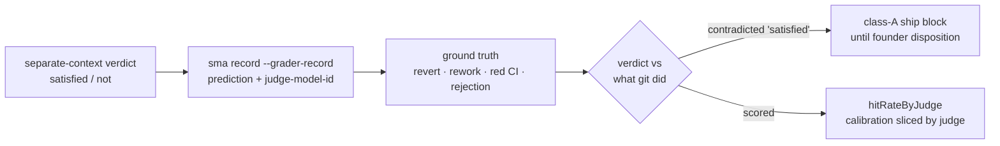
```mermaid
flowchart LR
    V["separate-context verdict<br>satisfied / not"] --> R["sma record --grader-record<br>prediction + judge-model-id"]
    R --> GT["ground truth<br>revert · rework · red CI · rejection"]
    GT --> S{"verdict vs<br>what git did"}
    S -->|"contradicted 'satisfied'"| BLK["class-A ship block<br>until founder disposition"]
    S -->|"scored"| HR["hitRateByJudge<br>calibration sliced by judge"]
```

### The economy meters — every run priced against your own spend, guarded on quality

Per-lane USD and minute budgets are derived from *your* project's own spend-ledger percentiles — not a vendor default — for the fix / quick / batch / build lanes; an overrun is scored as a calibration miss and drafts a lesson. `sma memory stats` reports the deterministic, versioned token cost of the corpus; `sma spend self-cost` makes SMA measure its own injection overhead. Every savings number is paired with a quality guard, so cheaper can never quietly mean worse.

### The rest of V4

| Surface | What it does |
|---|---|
| **Standing vendor triage** (`sma vendor`) | An append-only `VENDOR-LEDGER.md` (14 rows seeded, negative verdicts included) triages every upstream vendor capability as CORE or BRIDGE; `lint`/`count` verbs and a product release gate refuse to ship on an untriaged row. The vendor is watched in the open, not chased. |
| **Footprint ladder** (`reverify --footprint`) | A plan declares its footprint up front in frontmatter (files, new files, ~LOC, new deps); the grill asks «which ladder rung?»; a receipt checks the claim against `git diff --numstat` actuals — an overrun is a flagged calibration row. Ideology absorbed from two MIT sources (credited in THIRD-PARTY-LICENSES.md); their LLM judge was rejected and rebuilt as a deterministic receipt. |
| **Quick-ship lane** (`sma ship-lane check`) | A deterministic entry precondition — origin delta ≤ 5 commits, no migrations, no foreign push-claim — or it REFUSES back into the full ritual. The gate is identical, never weaker; the lane only buys a small reviewed delta a deterministic conventional-commit changelog, plus pending-run orphan visibility. |
| **Phantom-instrument precision** (`--stat phantomsAsserted`) | S4 receipt forensics: dedupe, basename cross-match kill, a negation stoplist, and an honest unknown-key error path. Nine forensic rows are frozen as permanent regression fixtures. |
| **Quick profile update** (`sma profile --quick`) | An existing install no longer re-interviews from scratch: `--quick` plans an interview over unset fields only, with `--selftest` and `--profile`; `sma-start` routes existing installs there. |
| **Positioning, re-anchored** | The README positioning region (EN + RU) is rebuilt around the Outcomes row, the audit-gap thesis, and the economy pillar; 'Outcomes' joins the doc-audit ANALOGS honesty guard, and falsified claims were dropped. |

## What's new in V3.6 — the one-command door, both ways

V3.5 made the trust spine legible from the outside. **V3.6 removes the last friction at the door — in BOTH directions — and shows a newcomer their own project before they adopt anything.** Four surfaces, the same bet as always: deterministic scripts on files + git, no LLM in the hot path.

### One-command install: `npx -y sma-framework@latest init`

The package is on the public npm registry. One command from your project root installs the engine, the runtime, the `/sma-*` skills and the hooks — Node built-ins only, zero dependencies. The version in the banner, the git tag, `package.json` and `capability.json` are ONE value, enforced by the deterministic `package-check` gate (`--count` prints 0 on a publishable tree; it runs as `prepublishOnly`, so a stale or private tarball cannot ship).

### The installer embeds the rules block into CLAUDE.md

Most projects never wire `.claude/memory/` into the agent's context — the corpus SMA builds was invisible to the very agent it exists for. `init` now splices a short managed **rules block** (where the memory lives, how to load it, how to coordinate, how to leave) into your project's CLAUDE.md under the same splice law as `sma emit`: your bytes are never touched, re-runs are no-ops, torn markers are refused. Its anchor family is separate (`SMA:RULES`), so the corpus block and the rules block never fight over one span.

### The off-ramp: `sma deleteme` / `/sma-deleteme`

One command reverses everything the installer wrote — skills, engine, runtime, agents, hooks, the statusline segment (your original statusline is restored verbatim), both managed blocks, the `.sma/` state — and **preserves `.claude/memory/`**. Dry-run by default; never-clobber settings surgery (only SMA hook entries and the `statusLine` key are edited; every other key survives byte-identical). The trust argument is symmetry: an adopter who can see the exit will walk through the entrance.

### Your memory, previewed: `sma memory-preview`

During `/sma-start` TEACH, the preview draws — right in the terminal — how SMA would lay out the memory of YOUR repository: the always-loaded CORE, the periphery areas folded from your real file tree, and the reflex candidates `excavate` mines from your own git history (the reverts and fix-forward chains your team already paid for). Read-only, zero network, byte-identical at one HEAD; `--project <path>` previews any other repo, `--lang ru` renders in Russian.

## What's new in V3.5 — Adoption & Trust Telemetry

V3 built the trust spine. **V3.5 gets that spine into a stranger's repo on day one, and makes its honesty legible from the outside.** Fifteen surfaces, all the same bet — deterministic scripts on files + git, no LLM in the hot path.

### Deep `/sma-start` onboarding

The first run is a staged conversation that alternates teaching and asking — you learn how the accountable loop works *while* SMA records the profile every later command reads (your deploy host, your release ritual, your risk tolerance). Nothing is re-explained twice.

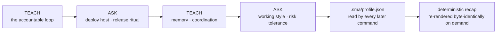
```mermaid
flowchart LR
    T1["TEACH<br>the accountable loop"] --> A1["ASK<br>deploy host · release ritual"]
    A1 --> T2["TEACH<br>memory · coordination"]
    T2 --> A2["ASK<br>working style · risk tolerance"]
    A2 --> P[".sma/profile.json<br>read by every later command"]
    P --> R["deterministic recap<br>re-rendered byte-identically on demand"]
```

### Calibration passport + honest README badge

`sma passport` turns the calibration ledger into `PASSPORT.md` and a public badge — the real hit rate and sample size, reproducible byte-for-byte on a fresh clone. The model-version guard is the honest part: after a model change the old hit rate no longer describes the new model, so the badge **hides itself until n ≥ 20** fresh predictions accumulate. The first production dogfood (the founder's platform, SMA user #1) stands at n=16/20 fresh verdicts on *its own* ledger — that is that deployment's number, not this repo's badge, which stays hidden until this repo's committed ledger reaches the gate.

The passport now states out loud **what it is able to count**, because a small number on a public page invites the wrong reading. Every figure on it comes from calibration data committed to this repository and from nothing else: the team that develops SMA runs its predictions in a separate, private planning workspace whose ledger names internal planning files, so copying it here would carry private material into a public repository — and it is never copied. A small sample size therefore means «this repository holds few reproducible verdicts of its own», never «a larger number is being kept out of sight». One rebuild writes the badge into every README the repository carries, from one snapshot, so the English and Russian pages cannot drift apart; a README that is absent is named in the output rather than created.

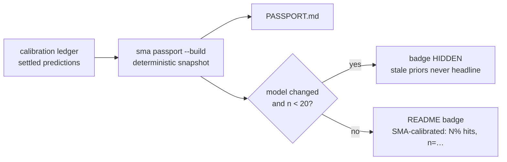
```mermaid
flowchart LR
    L["calibration ledger<br>settled predictions"] --> S["sma passport --build<br>deterministic snapshot"]
    S --> PM["PASSPORT.md"]
    S --> G{"model changed<br>and n &lt; 20?"}
    G -->|"yes"| H["badge HIDDEN<br>stale priors never headline"]
    G -->|"no"| B["README badge<br>SMA-calibrated: N% hits, n=…"]
```

### The adoption wedges — value before any habit change

| Surface | What it does |
|---|---|
| **`sma excavate`** | Mines a stranger's git history read-only (commit↔revert pairs, typo-fix chains, red CI runs) and prints CATCHES lines — *this reflex would have fired before this push*. Concrete evidence in the first five minutes. |
| **`sma emit`** | Compiles the corpus into `CLAUDE.md` / `AGENTS.md` / `.cursorrules` / `GEMINI.md` via managed blocks. Your text outside the block is never touched; re-emits are byte-identical. Anti-lock-in by construction. |
| **Fragment catalog + `sma context`** | A deterministic one-line card per repo file (symbols, imports, git stats), then a budgeted, byte-deterministic task context pack — catalog before grep, same input → same pack. |
| **Already-built preflight** | A millisecond, zero-token check of a plan's claims against the real tree before any executor spawns — nothing is rebuilt for pay. The daemon's tick asks it with the plan's path and for a machine answer, and grants «built» only when EVERY plan of the task's phase answers built: a false «not built» costs one extra run, a false «built» would close the task with the work never done. The verdict is written to the log every time — built, partial, absent, and the verb's own failure alike. Work with no plan behind it is not asked at all, with the reason logged: an order carrying no phase, and, deliberately, a documentary stage of the phase cycle — «does this already exist in the tree» is not that stage's question. |
| **`sma explain` + `sma doc-audit`** | 26 plain-language topics covering every concept *and every CLI verb* (a coverage tripwire scores a miss if a command ships undocumented); a deterministic audit proves the manual and this README stay complete, fresh, and honest. |

### Self-tuning enforcement ladder

Rules rise **and fall** only on journal evidence — benefit accounting, not fire counting — and always as a reviewable diff. A weekly miss-curriculum turns error clusters into prediction templates and a weak-spots brief — and it **rebuilds itself** at session start the moment the standing brief is over a week old, instead of printing a reminder that the brief is stale and leaving it stale. It names the state directory it read, because the same verb run from a working copy used to resolve the root through the shared git directory and report on a *different* checkout's journal — which is how an «empty» week could be reported on a ledger that was not empty. The rule set sharpens instead of only growing.

### Statusline segment + attention pulse

Live coordination state in the native Claude Code status line — installed **by default** with the rest of the engine, not left as an opt-in — and it composes: your existing statusline command runs first and its output is preserved, with the SMA segment appended.

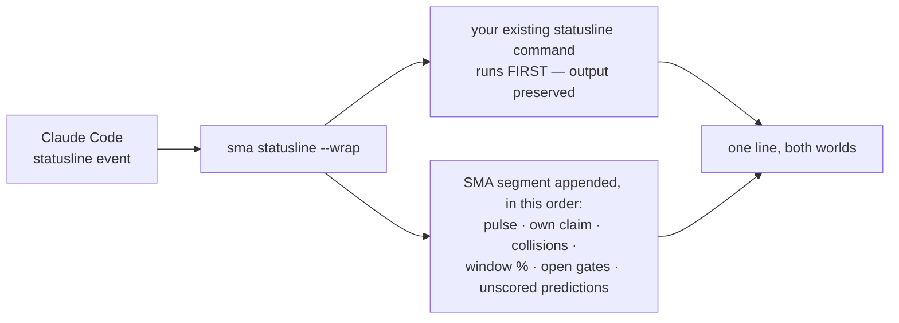
```mermaid
flowchart LR
    CC["Claude Code<br>statusline event"] --> W["sma statusline --wrap"]
    W --> U["your existing statusline command<br>runs FIRST — output preserved"]
    U --> OUT["one line, both worlds"]
    W --> SEG["SMA segment appended, in this order:<br>pulse · own claim · collisions ·<br>window % · open gates · unscored predictions"]
    SEG --> OUT
```

Those six sub-segments render in exactly that fixed order, and a value that cannot be resolved prints as `—` rather than as a zero. The window axis is the one worth spelling out: the subscription-window reading the vendor pipes in on stdin at every render comes first; the percentage of your own spend against a money cap you set is the fallback underneath it; with neither available the axis is an honest dash — which says "no reading", not "nothing used".

The attention pulse marks each window *working* or *waiting-for-human* (idle is derived, never guessed). The optional webhook is **outbound-only** — SMA sends a nudge out; there is no inbound path and nothing listens.

### PR evidence manifest + benchmark arena

`sma manifest` assembles the evidence passport for a commit range — registered predictions and how they scored, a receipt per claim, blind-verify verdicts — so the reviewer starts from evidence, not diff archaeology. `sma arena` scores comparative 4-arm benchmark runs deterministically and publishes raw data **including negative results**; the claim under test is cost-per-*result*, not cost-per-task.

### `sma batch` — the middle lane

Between an inline fix and a full phase: 2–4 compatible backlog items, one executor, receipts and re-verification still mandatory. Two hard guards keep the lane honest:

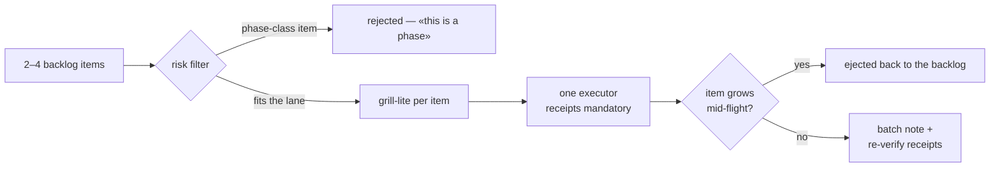
```mermaid
flowchart LR
    I["2–4 backlog items"] --> RF{"risk filter"}
    RF -->|"phase-class item"| REJ["rejected — «this is a phase»"]
    RF -->|"fits the lane"| GL["grill-lite per item"]
    GL --> EX["one executor<br>receipts mandatory"]
    EX --> GR{"item grows<br>mid-flight?"}
    GR -->|"yes"| EJ["ejected back to the backlog"]
    GR -->|"no"| DONE["batch note +<br>re-verify receipts"]
```

### Coordination hardening: fingerprint → claim-trust → worktrees → merge gate

Four surfaces that close the multi-terminal loop end to end — from *is that claim holder even alive?* to *how does a parallel branch safely enter main?*

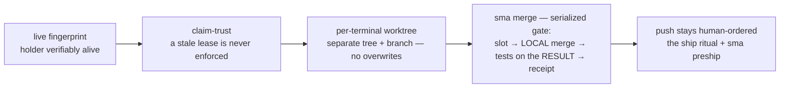
```mermaid
flowchart LR
    F["live fingerprint<br>holder verifiably alive"] --> CT["claim-trust<br>a stale lease is never enforced"]
    CT --> WT["per-terminal worktree<br>separate tree + branch — no overwrites"]
    WT --> MG["sma merge — serialized gate:<br>slot → LOCAL merge → tests on the RESULT → receipt"]
    MG --> SHIP["push stays human-ordered<br>the ship ritual + sma preship"]
```

`sma merge` never pushes and never deploys: it acquires the merge slot (a concurrent merge gets a soft-deny), merges **locally**, runs targeted tests on the *merged* tree — because two individually green branches can be red together — journals a receipt, and releases the slot.

#### Worker copy: what it carries and how it is removed

A copy cut for a run is not a bare checkout. Provisioning reads `.sma/worktree-include` at the root of your main tree and materializes the layer git does not track:

```json
{ "copy": [".claude/", "CLAUDE.md", ".claude/settings.local.json"],
  "link": ["node_modules", "spa/node_modules"] }
```

Those three `copy` entries are the defaults, applied when the file is absent — and also when it is malformed, because a typo in one file must not cost the session its rules. `copy` paths are brought over file by file, and only where the copy is older; anything git already tracks is left alone (the checkout has it). `link` paths become a junction (Windows) or a directory symlink (elsewhere) into the main tree, so no package manager ever runs in the copy. Entries must be relative paths inside the project — no `..`, no `.git`, no `.sma` — and `.env*`, `*.pem`, `*.key`, `.secrets*` are refused whatever the manifest says. Every decision comes back in the verb's answer as `copied / linked / already tracked / skipped, and why`, and is written onto the attempt so the card can show it.

**If you link things by hand, unlink before you remove.** On Windows `git worktree remove` follows a junction into its target and deletes what it finds *there* — that is your main tree's `node_modules`, not the copy's link. The product's own `worktree remove` does it in the safe order: unlink first, then remove the tree; `--delete-branch` takes the branch with it and records the tip it deleted, so the work can still be raised from that commit.

#### Worker account: the personal layer

The copy above answers «where did it work». This answers «under whose rules». A worker runs in
its own Claude Code config directory — its own account — and an account carrying none of your
working profile is not the session you get, whatever a marketing paragraph says. Before
**every** spawn the daemon mirrors your layer into that directory, idempotently: an unchanged
layer writes nothing and reports `changed:false`, so calling it before each run costs nothing.
If the mirror cannot be written the attempt is **refused by name** (`personal_layer_error`)
rather than started — a session running under rules nobody chose spends your subscription on
work you cannot account for.

| From your own `~/.claude` | Mirrored into the worker's account | Why |
|---|---|---|
| global `CLAUDE.md` | **yes** — content copied, fingerprint recorded | it is the instruction set you work under; without it the worker is a different colleague |
| `hooks` | **yes** — merged per event, so an override adds a Stop hook without erasing SessionStart | a hook that does not fire is a rule you believe is in force |
| `permissions.deny`, `permissions.ask` | **yes** | these two can only ever *narrow* what a session may do |
| `permissions.allow` | **no** — the card says so in words | it widens rights one rule at a time, and widening is a decision, never a side effect |
| `defaultMode` | **no** | `"auto"` in a user-scope settings file puts a headless session into auto mode — past the envelope the run was given |
| your plugins (`enabledPlugins`) | **no** | a plugin is installed into an account, and the worker's account is not yours — see below |
| `model`, `env`, `statusLine` | **no** | the model and environment of a run come from the worker profile the daemon already owns |
| anything else the account holds (`theme`, …) | **untouched** | the merge is deep: mirroring must not quietly reset a setting nobody asked about |

The previous `settings.json` is copied aside before the first overwrite (a small dated ring of
copies), and every field above is written onto the attempt — file fingerprint, hook count, rule
counts, plugin list, connector state — beside what the session **actually loaded** when it
started, read off its own init frame. The gap between «what we put in» and «what came up» is
the whole reason both halves are recorded.

**Connections: the hosted ones are off, the project's own still arrive.**
`disableClaudeAiConnectors: true` goes into the worker's settings (Claude Code 2.1.182 or
later), so hosted claude.ai MCP connectors are neither fetched nor attached, and the servers
handed over explicitly on `--mcp-config` are unaffected. What this does NOT do — and the
sentence here used to claim it did — is keep out a server declared by the project the worker
was pointed at: an MCP file in that project's own root is loaded by the session regardless of
how empty the worker's account is. Five measured runs settled it; neither switch that looks
like it should close that door (turning off project servers wholesale, disabling them by name)
closes it, and the one flag that would is refused by this product's own argument guard, because
it belongs to the family of flags that quietly de-parity a session while the run still looks
green. So the boundary here is visibility rather than prevention: every attempt records, beside
the servers it was handed, the ones that arrived without being on the register — and a project
whose connection file you have not read is a project whose servers your worker will load. They come from the registry a human keeps on the machine
(`~/.sma-daemon/mcp.json`), switched on row by row on «Подключения» — the window can flip
`enabled` and nothing else, so no text typed into it ever becomes a command.

**Plugins are named by you, installed by you.**

```json
{
  "personalLayer": { "sourceDir": "C:/Users/you/.claude" },
  "workers": [
    { "id": "local-1", "provider": "claude",
      "plugins": ["reviewer@my-marketplace"],
      "settingsOverrides": { "permissions": { "deny": ["Bash(curl:*)"] } } }
  ]
}
```

`plugins` states what the worker's account should carry; the install into that account stays
your own action, because installing software on somebody's behalf is not a thing this product
does. `settingsOverrides` accepts four keys and refuses the rest when the config loads —
`hooks`, `permissions`, `autoMemoryDirectory`, `autoMemoryEnabled` — because a silently
dropped override is a rule the operator believes is in force.

**Auto-memory is per repository, not per copy.** Claude Code keys the automatic memory
directory by the git repository, so every worker copy cut from one project shares one memory
folder: a lesson written down in one attempt is in the room for the next. Nothing is built to
make that true — it is verified, and the path the session itself reported is written onto the
attempt and shown on the card.

#### The lesson step: markers, the `no_lesson` gate, and the harvest at approval

The two subsections above answer where a worker worked and under whose rules. This one answers
what it left behind. A copy carries your lessons **in**; a flywheel that never turns the other
way is a picture of one, and for a long stretch this product's own corpus held nothing at all
written into it by a worker — the promise lived in the README and nowhere in the daemon.

**The markers.** A run closes with one of two lines, read off the same final frame the approach
note is read from:

```
LESSON_WRITTEN: .claude/memory/drafts/lesson-<slug>.md
LESSON_NONE: <why there is nothing to teach, in the worker's own words>
```

**What the gate checks**, in order, against the copy's own tree — a marker is a claim, and a
claim nobody verifies is a formality:

| Condition | Refusal when it fails |
|---|---|
| one of the two markers is present | `ни заметки, ни причины` |
| `LESSON_NONE` carries a reason | `сказано «урока нет» без причины` |
| the path lies inside the copy's memory corpus, no `..` | `путь урока вне корпуса памяти копии` |
| the file exists in the copy | `файла урока нет в копии` |
| it parses as a corpus note of the current schema | `заметка урока не в схеме корпуса` |
| it was produced by the write pipeline (`draft_kind`) | `заметка положена мимо конвейера памяти` |

A green attempt that fails any of them fails as **`no_lesson`** — a closed-vocabulary reason
beside `no_receipt` and `no_journal`, so the card reads it as a sentence rather than a code. The
order matters: an attempt missing both the note and the lesson is named `no_journal` first,
because the note explains the work you are about to accept while the lesson is for the attempt
after this one, and naming the smaller gap first would send you looking for the wrong thing.
Two classes are exempt: a **parked** round, cut short by a question to you before it ever
reached the step, and the **Creator's** own lane, which drafts definitions rather than doing
the work. A written document and an answer-only run are **not** exempt — work in words teaches
exactly as much.

**Why through the pipeline and not straight to a file.** The last condition is the point of the
whole step. `sma memory write` is twelve steps of scrubbing, contradiction checks and a verdict,
and what it produces is a **draft**, not a corpus entry. So a lesson is a proposal until you
accept it, and «nothing enters memory by accident» stays true for the road a worker takes as
well as the road you take.

**The harvest at approval.** Pressing «Одобрить» runs the collection **before** the copy is
swept, and the two are deliberately separate events:

| Corpus mode | What the approval does |
|---|---|
| `.claude/` tracked by git | the merge brings the note itself; the harvest applies the drafts and rebuilds the index |
| `.claude/` outside git (this product's own case) | drafts cannot travel in a merge, so they are carried out of the copy into the project's corpus first, then applied through the pipeline |

The mode is asked of git (`check-ignore`), never taken from a setting — a setting can be stale,
git cannot. Only pipeline drafts move, only into the drafts directory, and never over a file
that is already there. If the harvest fails on an untracked corpus the **sweep does not run**:
a copy holding the only surviving instance of a lesson is not rubbish. The approach note takes
the same road and is staged as a draft of the project's memory.

What came of it is written onto the attempt as `memoryHarvest` — `{at, by, mode, copied,
applied, drafted, refused, ok}` — on its **own** ledger row, next to `cleanup` rather than
inside it: «what reached the corpus» and «what was deleted from disk» fail independently, and
folded into one object they would one day explain a missing lesson by a successful removal. The
card prints all of it, refusals with their reasons included.

**The memory layer of the journal** is written for **every** attempt at one point in the tick,
above all four exits of the lane, so «every attempt has one» is a property of the control flow
rather than a rule somebody has to remember in four places. It carries `loaded` (whether the
index was opened, which notes were read, how many loader calls), `reflexes` with the
`reflexSource` they are known from (`none` is said out loud rather than passed off as an empty
observation), `autoMemoryReads` kept apart from the project's corpus, the `lesson` itself and
the mark saying whether an approach note exists. Identifiers and marks only — no note body ever
leaves the machine it was written on.

## V3 — The Trust Spine

V1 taught the system to **remember**. V2 taught it to **predict, fire reflexes, and coordinate**. **V3 makes it stop trusting its own word.**

> **The vendor cannot impartially grade its own agent's homework.** That is the one layer that survives platform absorption — the accountability that a model vendor structurally cannot ship neutrally. SMA is that layer, built from outside the model: **files + git only, deterministic, zero LLM in the hot path, fail-open with a kill-switch on every stream.**

Everything below is a plain script on the V2 files+git substrate — no daemon, no database, no embeddings, no cloud. Here is the whole accountable loop, end to end:

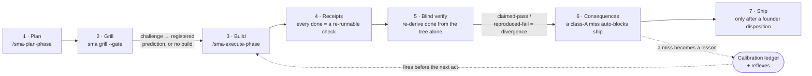
```mermaid
flowchart LR
    P["1 · Plan<br>/sma-plan-phase"] --> G["2 · Grill<br>sma grill --gate"]
    G -->|"challenge → registered<br>prediction, or no build"| B["3 · Build<br>/sma-execute-phase"]
    B --> R["4 · Receipts<br>every done = a re-runnable check"]
    R --> BV["5 · Blind verify<br>re-derive done from the tree alone"]
    BV -->|"claimed-pass /<br>reproduced-fail = divergence"| C["6 · Consequences<br>a class-A miss auto-blocks ship"]
    C --> S["7 · Ship<br>only after a founder disposition"]
    C -.->|"a miss becomes a lesson"| M(["Calibration ledger<br>+ reflexes"])
    M -.->|"fires before the next act"| B
```

| The V3 spine | What it gives you | Command |
|---|---|---|
| **Structural receipts** | every "done" carries machine-checkable claims `{assertion, check_command, expected hash}`, re-run on a fresh clone; prose-only "done" fails lint | `sma reverify` |
| **Tamper-evident journal** | every journal line is hash-chained; the chain tip is pinned in the release tag, so editing history is detectable by anyone holding the tag | `sma chain-verify` |
| **Blind verifier** | re-derives every "done" from the code tree alone; structurally refuses the executor's self-report as input | `sma blind-verify` |
| **Consequences-as-LAW** | a trust-class miss or divergence auto-blocks shipping until the human owner records an explicit disposition — the agent cannot forgive itself | `sma preship` / `sma disposition` |
| **`sma grill`** | every plan promise is cross-examined before the build; an unresolved challenge must become a registered prediction or the build does not start | `sma grill` |
| **`sma pre` multiplexer** | ONE node spawn per tool call for all hook streams, replacing 3–4: measured p95 **152–157 ms** vs a **1268.6 ms** V2 base | `sma pre-bench` |
| **Subagent write-receipts** | every claimed file write is verified against the real tree on SubagentStop; phantom writes flagged deterministically | `sma subagent-verify` |
| **Integrity guards** | skeptic countersign, seeded 5% receipt audit, planted canary false-dones, STPA disarm-path guard — so the published numbers stay honest | `sma skeptic` / `sma canary` / `sma integrity` |
| **`sma bench`** | the 8-metric scorecard, captured and frozen *before* the spine was built ("no measured base, no target") | `sma bench` |

Each of these is explained, with its own diagram and — where you drive it — an animated demo, in **[The Trust Spine, process by process](#the-trust-spine-process-by-process)** below. The V3 release ate its own cooking: **532/532 tests green at that tag (the suite stands at 876/876, 78 files, in v4.0.0); hostile goal-backward verification 56/56 after a same-day fix round; the consequences law fired for real during that verification.** Journal chain tip at the V3 release: `b745d7d4…67db0161`, 0 breaks.

### The Trust Spine, process by process

This is the V3 core — the class of capability a model vendor structurally cannot ship neutrally. Each stream is a deterministic script; each is explained here with a diagram, and the ones you drive have an animated demo in **[the command gallery](#see-each-command-in-action)**.

#### 1 · Structural receipts + `sma reverify`

A "done" is no longer prose. Every plan summary may carry a `receipts:` block of machine-checkable claims — `{id, assertion, check_command, expected_sha256}` — layered over the V2 coverage block. `sma reverify` re-runs each `check_command` across the same safe-command boundary as predictions; `--fresh-clone` runs it on a throwaway `git clone` so **only committed evidence counts**. A `RECEIPT-PROSE` lint fails any machine-verifiable "done" that carries no receipt — a prose-only claim cannot pass.

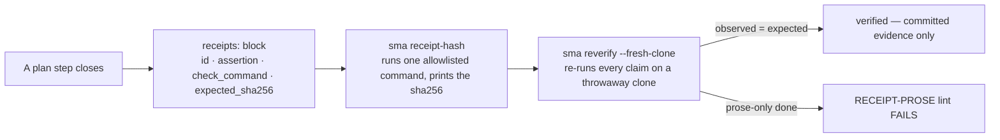
```mermaid
flowchart LR
    D["A plan step closes"] --> RC["receipts: block<br>id · assertion · check_command · expected_sha256"]
    RC --> RH["sma receipt-hash<br>runs one allowlisted command, prints the sha256"]
    RH --> RV["sma reverify --fresh-clone<br>re-runs every claim on a throwaway clone"]
    RV -->|"observed = expected"| OK["verified — committed evidence only"]
    RV -->|"prose-only done"| L["RECEIPT-PROSE lint FAILS"]
```

#### 2 · Tamper-evident journal

Published trust numbers are worthless if the local ledger is silently editable. So every `.sma/journal` line is **hash-chained**: each line's `prev` is the sha256 of the previous raw line. `sma chain-verify` reports any edit, deletion, or post-chain insertion, and a break is never auto-repaired. `sma chain-tip` emits a deterministic merged tip that the release ritual **pins into the annotated release tag** (`SMA-Journal-Tip: …`). Anyone holding the tag can recompute the tip and detect a local edit.

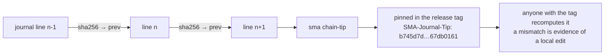
```mermaid
flowchart LR
    L1["journal line n-1"] -->|"sha256 → prev"| L2["line n"]
    L2 -->|"sha256 → prev"| L3["line n+1"]
    L3 --> T["sma chain-tip"]
    T --> TAG["pinned in the release tag<br>SMA-Journal-Tip: b745d7d…67db0161"]
    TAG --> V["anyone with the tag recomputes it<br>a mismatch is evidence of a local edit"]
```

#### 3 · Blind verifier — `sma blind-verify`

The heaviest signal in the whole system. A separate pass re-derives every "done" **from the code tree alone**, and it **structurally refuses** the executor's own report as input: hand it a SUMMARY or exec-journal and it errors with `BLIND_FORBIDDEN`, writing nothing. A claimed-pass that the blind pass reproduces as a fail is a **divergence** — the heaviest calibration-ledger event there is, and it blocks the ship.

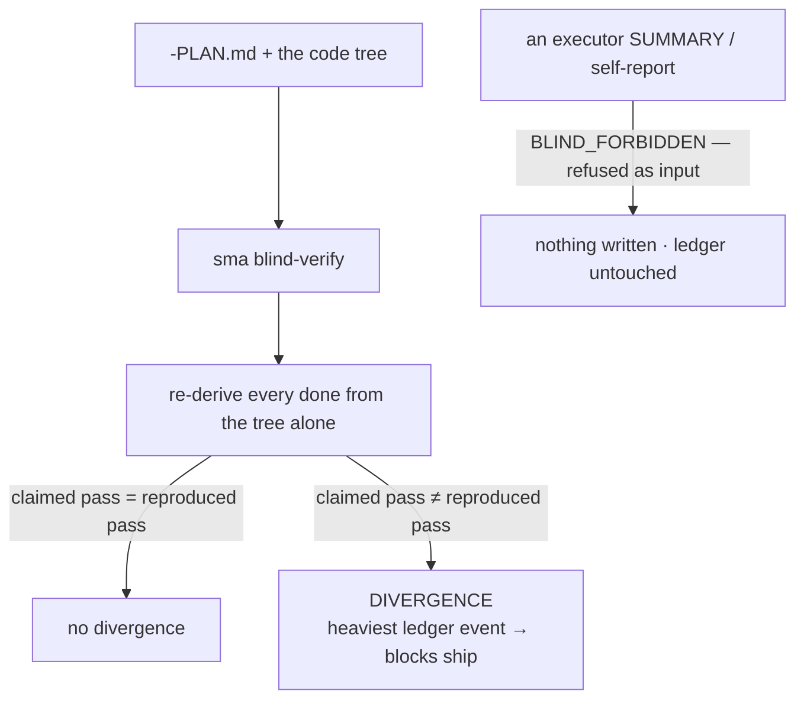
```mermaid
flowchart TD
    IN["-PLAN.md + the code tree"] --> BV["sma blind-verify"]
    SUM["an executor SUMMARY / self-report"] -->|"BLIND_FORBIDDEN — refused as input"| XX["nothing written · ledger untouched"]
    BV --> DER["re-derive every done from the tree alone"]
    DER -->|"claimed pass = reproduced pass"| OK["no divergence"]
    DER -->|"claimed pass ≠ reproduced pass"| DIV["DIVERGENCE<br>heaviest ledger event → blocks ship"]
```

#### 4 · Consequences-as-LAW — `sma preship` / `sma disposition`

The single step from *recording* a false "done" to *acting* on it. An immutable `consequences:` block in plan frontmatter, fixed at plan time, defines what a class-A miss blocks. **Class A** = a miss that invalidates the trust claim itself (false-done rate, subagent honesty, blind-verifier quality). When one fires, `sma preship` **blocks the push ritual** until the founder records an explicit disposition (`accept` / `fix-forward` / `rollback`) in the **append-only** ledger; a divergence additionally opens a rollback candidate branch. The agent cannot forgive itself — **this fired for real during this very release's verification**, and its two false ledger events are visible in the ledger, dispositioned by the owner, exactly as designed.

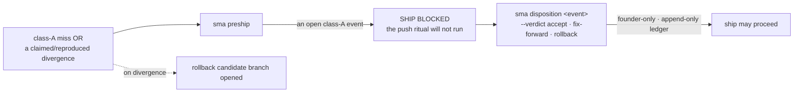
```mermaid
flowchart LR
    E["class-A miss OR<br>a claimed/reproduced divergence"] --> PS["sma preship"]
    PS -->|"an open class-A event"| BLK["SHIP BLOCKED<br>the push ritual will not run"]
    BLK --> DISP["sma disposition &lt;event&gt;<br>--verdict accept · fix-forward · rollback"]
    DISP -->|"founder-only · append-only ledger"| CLR["ship may proceed"]
    E -.->|"on divergence"| RB["rollback candidate branch opened"]
```

#### 5 · `sma grill` — the adversarial pre-build gate

The founder's own *grillme* ritual, absorbed into architecture instead of rhetoric. Every promise of a plan is cross-examined **before** the build. An unresolved challenge must become a registered falsifiable prediction, be withdrawn, or be founder-accepted — otherwise `--gate` **blocks the build**. Pre-push, a **budget-aware** grill inspects `origin..main` and spends review depth precisely where the calibration ledger proves the project has historically been miscalibrated.

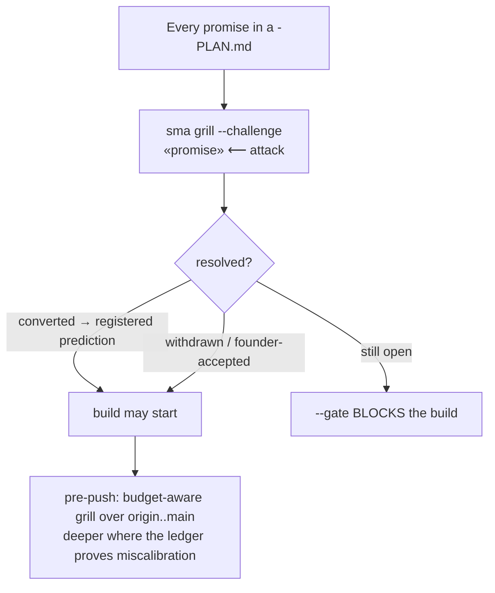
```mermaid
flowchart TD
    P["Every promise in a -PLAN.md"] --> CH["sma grill --challenge<br>«promise» ⟵ attack"]
    CH --> Q{"resolved?"}
    Q -->|"converted → registered prediction"| GO["build may start"]
    Q -->|"withdrawn / founder-accepted"| GO
    Q -->|"still open"| STOP["--gate BLOCKS the build"]
    GO --> PP["pre-push: budget-aware grill over origin..main<br>deeper where the ledger proves miscalibration"]
```

#### 6 · `sma pre` — one spawn per tool call

Everything above adds hook streams, and naive hooks tax every keystroke. The `sma pre` multiplexer reads the tool event **once** and dispatches the ordered stream pipeline (collision → reflex → gates → airbag → spend) in a **single node spawn**, replacing the 3–4 spawns V2 used. Honest numbers, measured on the origin project dogfood (SMA user #1) on 2026-07-08:

<p align="center">
  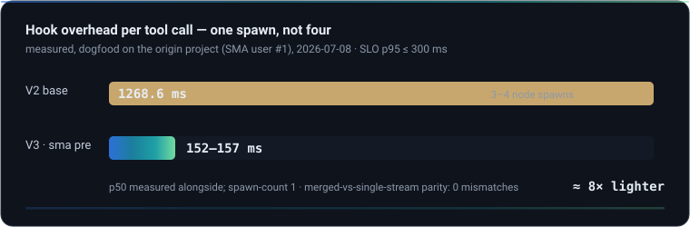
</p>

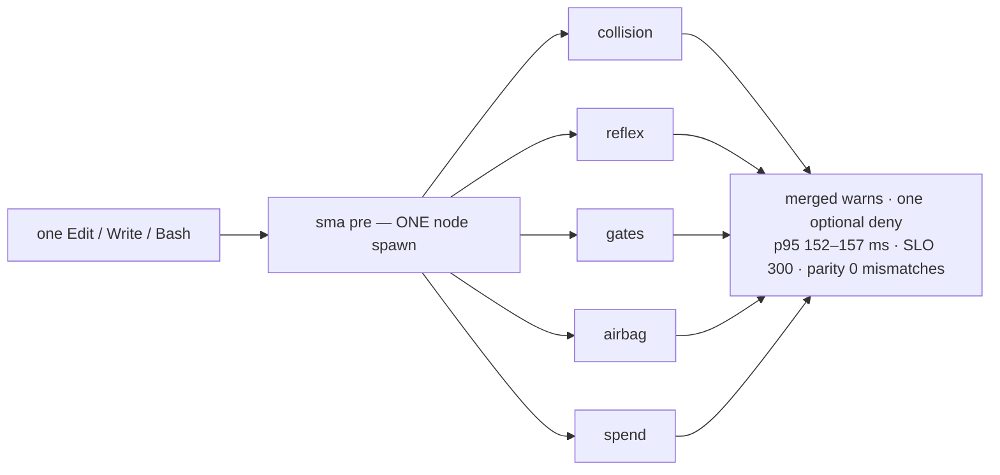
```mermaid
flowchart LR
    TC["one Edit / Write / Bash"] --> PRE["sma pre — ONE node spawn"]
    PRE --> S1["collision"]
    PRE --> S2["reflex"]
    PRE --> S3["gates"]
    PRE --> S4["airbag"]
    PRE --> S5["spend"]
    S1 & S2 & S3 & S4 & S5 --> OUT["merged warns · one optional deny<br>p95 152–157 ms · SLO 300 · parity 0 mismatches"]
```

`sma pre-bench` re-measures the p95, the spawn count (must be 1), and merged-vs-single-stream parity after any change. Every stream has a kill-switch (`SMA_PRE_DISABLE`, `SMA_REFLEX_DISABLE`, …) and a soft time budget — a slow stream is skipped, never allowed to overrun.

#### 7 · Subagent write-receipts + PreTask pack

Anthropic closed the context-inheritance request "not planned", so only an outer layer can fix it. A `PreToolUse(Task)` hook injects the assembled pack — rules digest, task-scoped lessons, active claims, the parent's task slice — giving the subagent **inheritance by construction**. On `SubagentStop`, `sma subagent-verify` checks **every claimed file write against the real tree**: a receipt lands in the shared journal, and a **phantom write** (claimed but not on disk) is flagged deterministically. The parent reads disk truth, not the subagent's self-report.

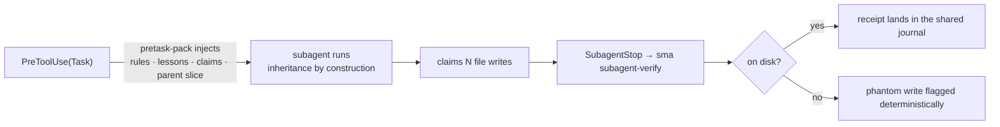
```mermaid
flowchart LR
    PT["PreToolUse(Task)"] -->|"pretask-pack injects<br>rules · lessons · claims · parent slice"| SUB["subagent runs<br>inheritance by construction"]
    SUB --> CLAIM["claims N file writes"]
    CLAIM --> SS["SubagentStop → sma subagent-verify"]
    SS --> TREE{"on disk?"}
    TREE -->|"yes"| OK["receipt lands in the shared journal"]
    TREE -->|"no"| PH["phantom write flagged deterministically"]
```

#### 8 · Integrity guards — keeping the numbers honest

The moment trust numbers are published, the incentive to game them exists — a scoreboard without a judge is not viable. So the spine ships with its own adversaries: predictions are **countersigned by a skeptic** (a non-implementer role); a **seeded 5% deep audit** re-checks receipts at random; **planted canary false-dones** the blind verifier must catch (below a 90% catch rate, "zero divergence" is evidence of a lazy verifier, not clean work — this is scorecard metric S8); and an **STPA disarm-path guard** where every kill-switch must cite a compensating control, with the birth-fixture shadow-running even while a rule is off and auto-re-arming it.

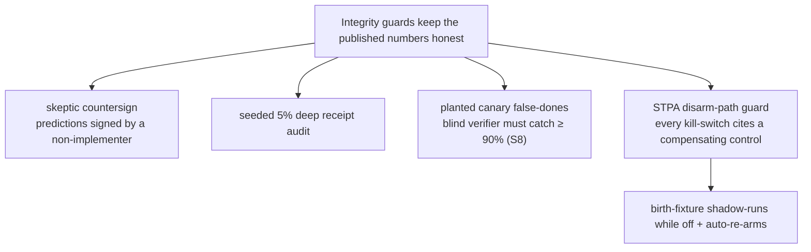
```mermaid
flowchart TD
    G["Integrity guards keep the published numbers honest"] --> SK["skeptic countersign<br>predictions signed by a non-implementer"]
    G --> AU["seeded 5% deep receipt audit"]
    G --> CAN["planted canary false-dones<br>blind verifier must catch ≥ 90% (S8)"]
    G --> STPA["STPA disarm-path guard<br>every kill-switch cites a compensating control"]
    STPA --> SR["birth-fixture shadow-runs while off + auto-re-arms"]
```

#### 9 · `sma bench` + the 8-metric scorecard

The founding act: **the measurement harness shipped before the spine was built.** No measured base, no target. `sma bench` captured and froze the V2 baseline first; every target lives as an immutable, machine-scoreable prediction. Honest to a fault — two of the eight bases were forfeit when the founder shortened the measurement window on 2026-07-08, and they are frozen as `insufficient-data` rather than hidden.

| # | Metric | V2 base | 10× target | Status |
|---|--------|---------|------------|--------|
| S1 | False-"done" rate | retro blind re-verify of the last 10 V2 plans | < 1%, 100% of claims carrying receipts | measured, registered |
| S2 | Git-loss recoverability | 30-day journal of destructive-gate firings | 100% of firings preceded by a snapshot | measured, registered |
| S3 | Compaction survival | 10-question exam *before* the capsule exists | ≥ 90% match against the capsule | **`insufficient-data`** (window forfeit) |
| S4 | Subagent honesty | phantom-write share over 2 dogfood phases | 0 unverified write claims in `main` | measured, registered |
| S5 | Time-to-context | median "session start → first Edit" | ≥ 3× reduction on same-risk tasks | **`insufficient-data`** (window forfeit) |
| S6 | Cross-machine collisions | 0 (no mechanism yet) | ≥ 90% warns in a 2-machine drill, n=20 | registered, scored when the git bus ships (V3.1) |
| S7 | V3 self-cost | today's 3–4 node runs per tool call | all V3 layers ≤ 10% of session spend; p95 ≤ 300 ms | measured, registered |
| S8 | Blind-verifier quality | 0 (no verifier existed) | ≥ 90% catch of planted canary false-"dones" | measured, registered |

> **We never claim a multiplier for S3 or S5.** Under the founder's 2026-07-08 force-freeze the measurement window was shortened; those two bases are recorded `insufficient-data`, on the record, rather than dressed up. That honesty *is* the product.

#### The bridges (opt-in, never headlined)

Three conveniences ship behind capability probes, each with a **registered self-removal prediction** — they stand down the day a native equivalent suffices. They are deliberately not part of the headline; the accountability core above is what SMA *is*, and these are scaffolding it expects to remove.

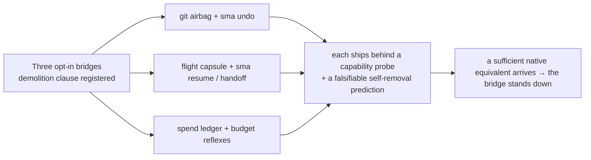
```mermaid
flowchart LR
    B["Three opt-in bridges<br>demolition clause registered"] --> A1["git airbag + sma undo"]
    B --> A2["flight capsule + sma resume / handoff"]
    B --> A3["spend ledger + budget reflexes"]
    A1 & A2 & A3 --> DC["each ships behind a capability probe<br>+ a falsifiable self-removal prediction"]
    DC --> STAND["a sufficient native equivalent arrives → the bridge stands down"]
```

- **Git airbag** — a millisecond `git update-ref refs/sma/airbag` + `git stash create` snapshot before destructive git (explicitly **not** a slow `git bundle`, which would time out at exactly the catastrophe moment). `sma undo` restores HEAD + dirty tracked + untracked in one action. Stand-down probe: `SMA_AIRBAG_NATIVE`.
- **Pre-compaction flight capsule** — a deterministic, zero-LLM `PreCompact` capsule (`.sma/flight/intent.md`) written *before* the context is cut; `sma resume` assembles a continuation brief, `sma handoff` a teammate one. Stand-down probe: `SMA_FLIGHT_NATIVE`.
- **Deterministic spend ledger** — a versioned log-format adapter parses local session logs into a per-session/subagent/model book; `sma spend` reports it; budget reflexes warn at 70/90% and soft-deny new subagents over cap; a loop-breaker disarms a rule that fires runaway. Field-compatible with the OTel/ccusage schema.

### Watch it work — five real files

SMA is "just files," and that is the feature — you can point at every part of it. Here is the whole loop, in the artifacts it actually reads and writes.

**1 · A lesson, the first time something burns you** — `.claude/memory/bug_build_node20.md`

```markdown
---
description: Build emits an empty API chunk on Node 20 without --no-experimental
kind: bug-lesson
tags: [build, ci]
use-when: "editing vite.config or running the production build"
importance: 8
---
**Rule:** On Node 20 the API bundle needs `--no-experimental-*` or it silently
ships an empty chunk (exit code 0, broken deploy).

**Why:** Cost us a red prod on 2026-06-02 — the build "passed" and shipped nothing.

**How to apply:** keep the flag in `build:api`; if you touch the bundler config,
run `pnpm build:api` and confirm the chunk is non-empty before committing.
```

**2 · A prediction, written into the plan before any code** — `.planning/phases/12-.../12-01-PLAN.md`

```yaml
predictions:
  - id: PRED-01
    claim: "The rate-limit suite is green: the limiter rejects the 101st request in a 60s window"
    metric: rate_limit_suite_exit_code
    check_command: "pnpm vitest run test/rate-limit.test.ts"   # allowlisted prefixes only
    measure: exit-code # OPTIONAL — the fact is the process exit code, not the last output line
    cwd: "packages/api" # OPTIONAL — a FIELD handed to the runner, never glued into the command
    comparator: "=="
    threshold: 0
    horizon: plan-close
    domain: api
    confidence: 0.8    # recorded for calibration — NEVER gates the result
```

The two optional fields are what make this example scoreable at all. By default the fact is the
**numeric last line** of the output, and a test runner does not print one — so a claim like «the
suite is green» used to be registered, run, and never settled. `measure: exit-code` takes the
process exit code as the fact; `cwd` names the directory the command runs in. Both are handed to
the runner as parameters, so the allowlist is untouched: `cd X && cmd` and `cmd; echo $?` are
still refused by the charset guard, and a run that never finished is recorded as **could not
measure** — never as a miss, because «I failed to measure you» is not a statement about the world.

**3 · A structural receipt, settled by a script on a fresh clone (zero LLM)** — the `receipts:` block a "done" now carries

```yaml
receipts:
  - id: R-01
    assertion: "rate-limit suite is green on a clean clone"
    check_command: "pnpm vitest run test/rate-limit.test.ts"
    expected_sha256: "9f2c…a17b"   # observed == expected on `sma reverify --fresh-clone`
```

```json
{"type":"prediction-verdict","id":"PRED-01","domain":"api",
 "result":"hit","observed":1,"comparator":">=","threshold":1,"ts":"2026-06-14T09:41:02Z"}
```

```text
# calibration ledger — per area, how often our promises matched facts
api        14/15  (93%)
migrations  6/6   (100%)
ui          9/12  (75%)   ← this area keeps over-promising; SMA escalates it
```

**4 · A reflex firing — the warning the agent sees *inside* the tool call** (before it edits `vite.config.ts`)

```text
⚠ SMA reflex [bug_build_node20]: On Node 20 the API bundle needs --no-experimental
  or it silently ships an empty chunk. Last time this red-shipped prod (2026-06-02).
  → run `pnpm build:api` and confirm the chunk is non-empty before you commit.
```

**5 · A collision + a shared counter — coordination, no server** (Terminal B, about to touch A's files)

```text
⚠ SMA: src/api/** is claimed by t-4821 (phase 12 exec) since 14:07.
  You are about to Edit src/api/routes.ts — coordinate first (`node scripts/sma/cli.mjs status`).

$ node scripts/sma/cli.mjs next-slot migration
0007          # yours. A parallel terminal asking now gets 0008 — they never collide.
```

Nothing here is a database row or an opaque embedding. It is a handful of text files, and together they are the entire loop: burn → note → prediction → script-settled receipt → reflex that stops the next burn.

### The lifecycle: discuss → plan → grill → build → verify → ship

SMA is not only memory — it is a full working rhythm for shipping real changes with an agent. Each stage is a `/sma-*` command, and every stage reads from and writes back to the same file-based memory, so nothing is re-explained twice.

```mermaid
flowchart LR
    D["1 · Discuss<br>/sma-discuss-phase"] --> P["2 · Plan<br>/sma-plan-phase"]
    P --> G["3 · Grill<br>sma grill --gate"]
    G --> B["4 · Build<br>/sma-execute-phase"]
    B --> V["5 · Verify<br>/sma-verify-work"]
    V --> S["6 · Ship<br>push ritual + preship gate"]
    M(["Memory + predictions<br>+ receipts + reflexes"]) -.->|reads| D
    M -.->|reads| P
    M -.->|reads| B
    B -.->|writes receipts + lessons| M
    V -.->|writes lessons| M
    S -.->|calibration scored| M
```

- **1 · Discuss** — lock the gray-area decisions with a human *before* any code, through adaptive questioning. The context is captured as files, so the plan that follows is grounded, not guessed.
- **2 · Plan** — turn the decisions into an executable plan whose steps each carry a machine-checkable **prediction** and, at close, a re-runnable **receipt**. The plan is the contract.
- **3 · Grill** — cross-examine every promise before a line is built; an unresolved challenge becomes a registered prediction or the build does not start.
- **4 · Build** — execute the plan in dependency-aware waves. Reflexes fire before risky actions; progress is journaled so an interrupted run resumes in minutes, not from scratch; subagent writes are verified against the tree.
- **5 · Verify** — validate the built feature against its acceptance criteria, and let the blind verifier re-derive each "done" from the tree alone. Human sign-off gates stay human; the agent never self-certifies.
- **6 · Ship** — the release ritual runs the full gate *and the `preship` consequences check*; the predictions written in step 2 are **scored** against what actually happened. A class-A miss blocks the push until the founder dispositions it. The loop closes.

## V2 — Predictions, reflexes, coordination

V2 is where SMA learned to keep score. Three mechanisms, all deterministic, all still the substrate everything above runs on:

- **Predictions** — every plan states up front what will measurably change: a metric, a check command, a threshold. Registered predictions are immutable (a lint refuses post-hoc edits), so the goalposts cannot move after the result is known. Settling them at close is a gate, not a habit: `PRED-UNSCORED` is a **critical** finding on a closed plan that left a checkable, already-due prediction without a verdict. It is deliberately narrow — a prediction whose horizon has not arrived, and one whose check the command allowlist refuses, are both left alone, the second because that is a defect of the prediction to be named in words, not a debt to be enforced against whoever is closing the plan today.
- **Reflexes** — a scored miss becomes a rule with a firing condition, delivered as a warning *inside* the matching tool call. One burn, permanent avoidance — with noise controls (repeat muting, a kill-switch per rule).
- **Calibration** — a per-domain ledger of promise-versus-fact. An area that keeps over-promising earns stricter oversight; a long clean record earns lighter touch.

The prediction lifecycle, end to end:

```mermaid
flowchart LR
    REG["prediction registered<br>in plan frontmatter — immutable"] --> HZ["horizon reached<br>plan close / phase verify"]
    HZ --> SC["deterministic scorer<br>sma predict-score"]
    SC -->|"hit"| CAL["calibration ledger<br>per-domain hit rate"]
    SC -->|"miss"| LES["lesson drafted<br>→ promoted to a reflex on evidence"]
    LES --> CAL
    CAL --> BG["budget-aware grill<br>review goes deeper exactly where<br>the ledger proves miscalibration"]
```

### Coordination without a server

```mermaid
sequenceDiagram
    participant A as Terminal A
    participant FS as .sma/ (files + git)
    participant B as Terminal B
    A->>FS: register session · claim src/api
    B->>FS: register session · claim src/api
    FS-->>B: ⚠ scope held by A — warned BEFORE the edit
    A->>FS: next-slot migration → 0007
    B->>FS: next-slot migration → 0008
    Note over FS: shared counters never collide<br>the journal records who did what
```

## V1 — The memory foundation (why SMA exists)

Everything above stands on the V1 bet: small files in your git repo, deterministic scripts, and the agent-harness hook system. This is the origin story — the four failures that started it, and the memory architecture that answers them.

### Why SMA exists

If you run Claude Code (or any coding agent) on a real project every day, you already know these four failures:

1. **Rules get read, then dropped.** Your carefully written instructions file is acknowledged at session start and violated an hour later — the model's working attention is tiny, and a rule that isn't present *at the moment of the action* might as well not exist.
2. **"Done" that isn't.** The agent reports tests green and files written; the tree says otherwise. Confident prose is not evidence. **(This is the failure the V3 trust spine exists to kill — see below.)**
3. **Lessons get re-learned, expensively.** The same mistake — the same footgun in your build, the same API quirk — burns you again next month, because nothing turned the first burn into a permanent avoidance.
4. **Parallel sessions collide.** Two terminals on one checkout silently overwrite each other; session B "fixes" what session A finished an hour ago.

SMA is a layer on top of the agent that attacks all four with the same design bet: **small files in your git repo + deterministic scripts + the agent-harness hook system**. The memory and accountability layer needs no daemon, no database, no embeddings and no cloud — that bet still holds today, and the optional V5 worker fleet is a separate layer bolted on top of it, never underneath it. Everything SMA knows is a markdown file you can read, diff, and revert; everything it enforces is a script you can run yourself.

> **A 700-line instructions file is not a process.** It is one big note the model skims once and forgets. SMA's bet is the opposite: keep the always-loaded rules tiny, and deliver each *specific* rule as a warning at the precise tool call it governs. Presence beats length. That is the difference between "I told the agent" and "the agent could not miss it."


### What SMA is

Three subsystems on one substrate, now bound by a fourth — the accountability layer that makes their claims answerable:

- **Memory that arrives on time.** Project knowledge lives as small, tagged notes. The always-loaded core stays tiny (a few KB); topic notes load only when the task touches that topic; and *reflexes* deliver the exact relevant lesson right before the tool call that needs it — because a rule named at the moment of the act is worth ten rules buried in a big instructions file.
- **Coordination without a server.** Every open terminal registers itself, claims the files it is working on, and draws shared counters (migration numbers, release numbers) from one queue. Parallel sessions warn each other *before* the collision, and the journal records who did what.
- **A learning loop with a score.** Plans state up front what will measurably change and how to check it (`predictions`). A deterministic scorer — a script, not a judge model — settles each prediction against reality. Misses become lessons; repeated lessons become reflexes; the calibration ledger tracks, per area, how often promises match facts.
- **An accountability spine (V3).** Every "done" carries a re-runnable receipt; a blind verifier re-derives it from the code tree alone; a false "done" blocks the next ship until a human dispositions it. SMA's memory does not claim to work — it publishes a measured hit rate, and its own release is gated by that measurement.

### The story in 10 slides

<p align="center">
  
</p>

<details>
<summary><b>Open the full deck (10 slides)</b> — the problem, the root cause, the mechanism, the proof discipline</summary>

<br>

| | |
|:--:|:--:|
| 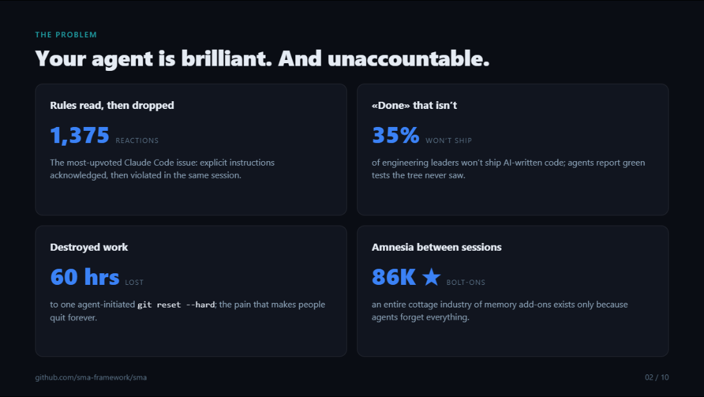<br>**The problem** — brilliant, and unaccountable | 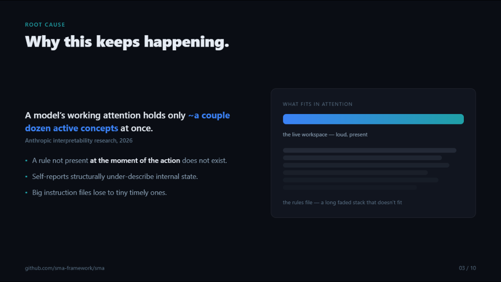<br>**Root cause** — a model's working attention is tiny |
| 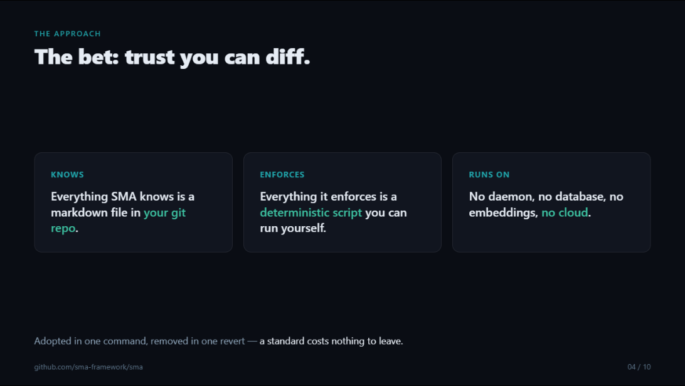<br>**The bet** — trust you can diff | 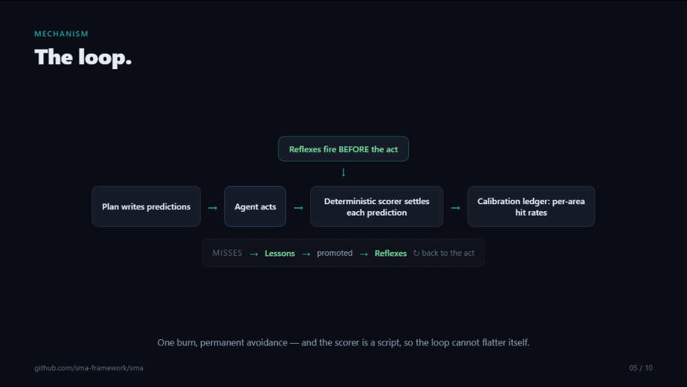<br>**The loop** — predict, act, score, learn |
| 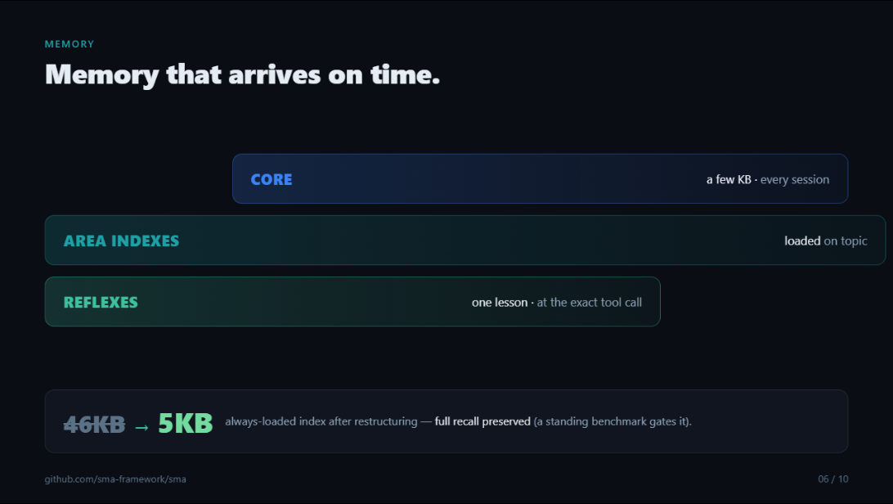<br>**Memory that arrives on time** | 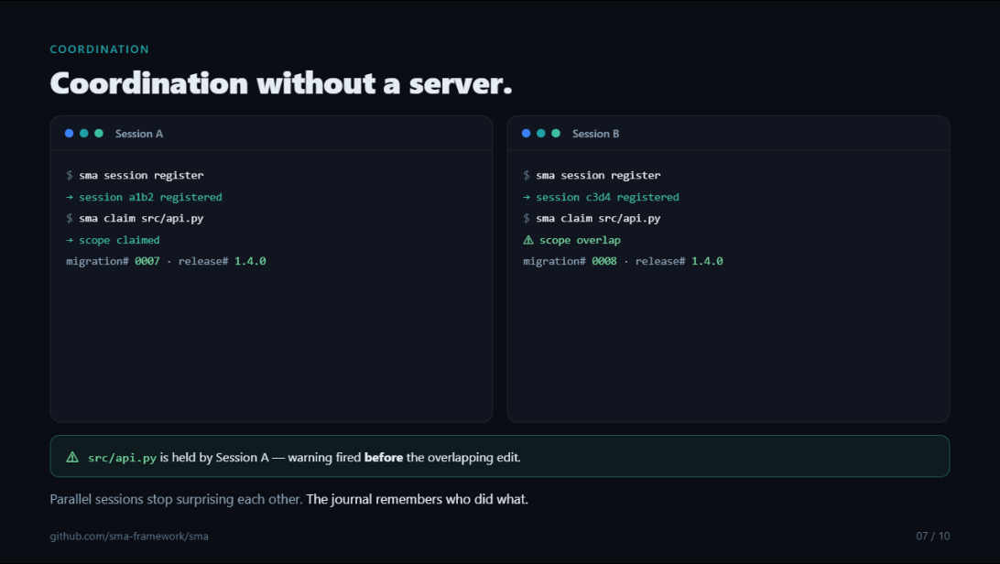<br>**Coordination without a server** |
| 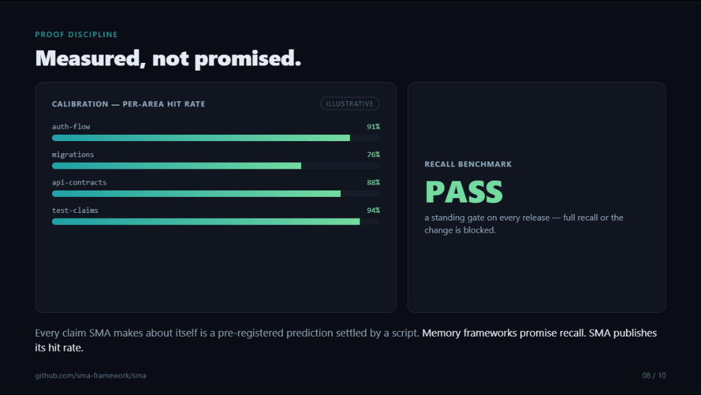<br>**Measured, not promised** | 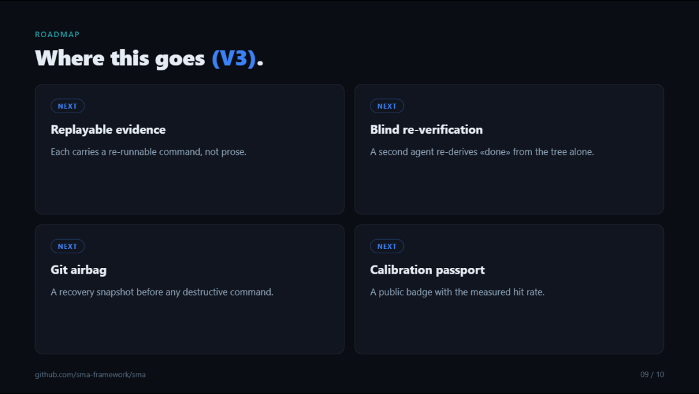<br>**Where this goes (V3)** |
| 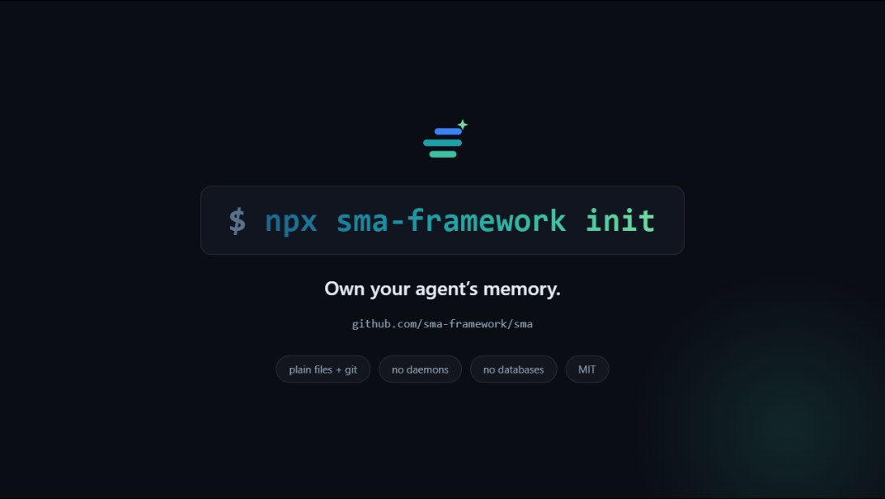<br>**Own your agent's memory** | |

</details>

### The version timeline

```mermaid
flowchart LR
    V1["V1<br>memory + coordination<br>on files + git"] --> V2["V2<br>predictions · reflexes ·<br>corpus health · gates"]
    V2 --> V3["V3<br>the trust spine:<br>receipts · blind verify · consequences"]
    V3 --> V35["V3.5<br>adoption & trust telemetry"]
    V35 --> V36["V3.6<br>the one-command door:<br>npm install · off-ramp · memory preview"]
    V36 --> V4["V4<br>grade the grader:<br>graded verdicts · economy meters · vendor triage"]
    V4 --> V5["V5<br>orchestration:<br>a 24/7 worker fleet"]
    V5 --> V51["V5.1<br>works with what you have:<br>the app the daemon serves"]
    V51 --> V52["V5.2 → V5.4<br>measured memory · governance ·<br>the working day without the terminal"]
    V52 --> V55["V5.5 → V5.6 — current<br>the engine: steering a live session ·<br>the taskboard and honest numbers"]
```
